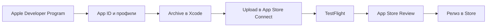

# TestFlight и App Store — публикация для начинающих

<div class="article-tags">
  <span class="tag tag-required">ОБЯЗАТЕЛЬНО</span>
  <span class="tag tag-beginner">ДЛЯ НОВИЧКОВ</span>
</div>

<span class="complexity-badge">Разработчику</span>

**Дальше:** [SwiftUI практикум](./271.md) · [Swift — о разделе](./intro.md) · [Xcode](./26.md)

---

## Публикация iOS-приложения — практикум

Когда [мини-приложение на SwiftUI](./271.md) готово, его нужно **собрать**, **подписать** и **отправить** в экосистему Apple. Для учебного проекта достаточно **TestFlight** — beta-канал без публичной витрины. Для реальных пользователей — **App Store** после модерации.

Практикум идёт **по шагам** — от Apple Developer Program до первой beta-сборки и подготовки к ревью.

| Шаг | Тема | Результат |
|-----|------|-----------|
| 0 | Термины и схема | Понимание цепочки |
| 1 | Developer Program + Connect | App record создан |
| 2 | Signing в Xcode | Team, Bundle ID |
| 3 | Archive и Upload | Build в Connect |
| 4 | TestFlight | Internal / External testers |
| 5 | Метаданные Store | Скриншоты, privacy |
| 6 | Submit for Review | Отправка на модерацию |
| 7 | После релиза | Обновления, отзывы |

| Материал | Зачем |
|----------|-------|
| [SwiftUI практикум](./271.md) | Готовое приложение TaskMini |
| [Swift — о разделе](./intro.md) | Маршрут по экосистеме |
| [Xcode](./26.md) | Archive, Organizer, Accounts |
| [Жизненный цикл](./21.md) | Версии, capabilities |
| [Мобильные приложения](/encyclopedia/4-code-dev/4-12-mobilnye-prilozheniya/intro) | Контекст платформы |
| [iOS справочник](/encyclopedia/2-system-network/2-01-operatsionnaya-sistema/71) | ОС и ограничения |

### Навигация по блоку Swift

- UI: [SwiftUI практикум](./271.md)
- IDE: [Xcode](./26.md)
- Вы здесь: [TestFlight и App Store](./272.md)
- Язык: [Swift — о разделе](./intro.md)

Цепочка для новичка:



<div class="callout callout--tip">
  <div class="callout-title">С чего начать без $99</div>

  <div class="callout-body">
  Симулятор и локальная разработка не требуют платной подписки. TestFlight и App Store — только с <strong>Apple Developer Program</strong>.
</div>
</div>

---

## Шаг 0 — термины

| Термин | Простыми словами |
|--------|------------------|
| **Apple Developer Program** | Платная подписка ($99/год) — доступ к публикации и TestFlight |
| **Bundle ID** | Уникальный идентификатор приложения (`com.company.app`) |
| **Signing Certificate** | Ключ разработчика/дистрибуции для подписи бинарника |
| **Provisioning Profile** | Связка сертификата, Bundle ID и устройств/Store |
| **Archive** | Release-сборка `.ipa` из Xcode |
| **App Store Connect** | Веб-консоль: версии, скриншоты, ревью |
| **TestFlight** | Распространение beta-сборок тестерам |
| **App Review** | Проверка Apple перед публикацией в Store |
| **dSYM** | Файлы символов для расшифровки crash logs |

Общий контекст — [мобильные приложения](/encyclopedia/4-code-dev/4-12-mobilnye-prilozheniya/intro), [справочник iOS](/encyclopedia/2-system-network/2-01-operatsionnaya-sistema/71).

---

## Шаг 1 — Apple Developer и App Store Connect

### Регистрация

1. Зарегистрируйтесь на [developer.apple.com](https://developer.apple.com).
2. Вступите в **Apple Developer Program** (оплата, проверка может занять 1–2 дня).
3. Откройте [App Store Connect](https://appstoreconnect.apple.com).

### Создание App record

1. **Apps** → **+** → **New App**.
2. Платформа: **iOS**.
3. Name: имя в Store (можно изменить до релиза).
4. Primary Language: Russian или English.
5. **Bundle ID** — выберите или создайте в [Certificates, Identifiers & Profiles](https://developer.apple.com/account/resources/identifiers/list).

| Поле в Connect | Что указать |
|----------------|-------------|
| Name | TaskMini или продуктовое имя |
| Primary Language | Язык описания по умолчанию |
| Bundle ID | Совпадает с Xcode Target |
| SKU | Внутренний код (`taskmini-2024`) |
| User Access | Full Access для себя |

### App ID в Developer Portal

1. **Identifiers** → **+** → **App IDs** → **App**.
2. Description: `TaskMini`.
3. Bundle ID: Explicit — `com.example.TaskMini`.
4. Capabilities: включайте только нужные (Push, Sign in with Apple и т.д.).

<div class="callout callout--info">
  <div class="callout-title">Bundle ID навсегда</div>

  <div class="callout-body">
  Bundle ID нельзя изменить после первой загрузки build в Connect. Выберите осмысленный reverse-DNS формат заранее.
</div>
</div>

---

## Шаг 2 — подпись в Xcode

Откройте проект [SwiftUI практикум](./271.md) или свой `TaskMini`.

**Target → Signing & Capabilities**:

| Настройка | Рекомендация для старта |
|-----------|-------------------------|
| **Automatically manage signing** | Включить — Xcode создаст профили |
| **Team** | Ваша команда Developer Program |
| **Bundle Identifier** | `com.example.TaskMini` — как в Connect |

**Target → General**:

| Поле | Значение |
|------|----------|
| Version | `1.0` (CFBundleShortVersionString) |
| Build | `1` (CFBundleVersion) |

Каждая **новая загрузка** в Connect требует **уникальный Build number** (увеличивайте Build, Version можно оставить при patch).

### Иконка приложения

**Assets.xcassets → AppIcon** — добавьте все размеры; обязателен **1024×1024** для Store.

### Info.plist и permissions

Если app использует камеру, геолокацию, contacts — добавьте ключи с понятным текстом для пользователя:

```xml
<key>NSCameraUsageDescription</key>
<string>Нужна камера для фото задачи</string>
```

Без usage description app **reject** на ревью при первом обращении к API.

Подробнее про среду — [Xcode](./26.md).

---

## Шаг 3 — Archive и Upload

### Подготовка Release

1. Схема: **Any iOS Device (arm64)** — не симулятор.
2. **Product → Scheme → Edit Scheme → Archive** — Build Configuration: **Release**.
3. Убедитесь, что app запускается на **физическом iPhone** (опционально, но ловит signing bugs).

### Archive

1. **Product → Archive**.
2. Откроется **Organizer** → вкладка **Archives**.
3. Выберите свежий archive → **Distribute App**.

### Upload wizard

1. **App Store Connect** → **Upload**.
2. Distribution options: включите **Upload symbols** (dSYM для crashes).
3. **Automatically manage signing** — обычно достаточно.
4. Дождитесь **Upload Successful**.

Xcode проверит подпись, bitcode (deprecated), метаданные и entitlements.

### Типичные сообщения об ошибках

```text
No profiles for 'com.example.TaskMini' were found
→ Проверьте Bundle ID, Team, включите Automatic signing

Invalid Signature
→ Xcode → Settings → Accounts → Download Manual Profiles

Missing compliance (export encryption)
→ App Store Connect → app → Build → Export Compliance

Asset validation failed (App Icon)
→ 1024×1024 без alpha channel в AppIcon
```

| Симптом | Причина | Решение |
|---------|---------|---------|
| Archive disabled | Выбран симулятор | Any iOS Device |
| Upload rejected | Duplicate build number | Build +1 |
| Missing dSYM | Symbols не загружены | Upload symbols в wizard |
| Provisioning failed | Нет capability в portal | Sync capabilities |

---

## Шаг 4 — TestFlight

После upload сборка обрабатывается **5–30 минут** (иногда дольше). Статус: **Processing** → **Ready to Test**.

### Internal Testing

- До **100** пользователей с ролью в App Store Connect (Admin, Developer, Marketing).
- **Без** ревью Apple.
- Идеально для команды и первого smoke test.

Шаги:

1. Connect → **TestFlight** → ваше приложение.
2. **Internal Testing** → **+** группа или default.
3. Добавьте build → включите testers.

### External Testing

- До **10 000** тестеров по email или **public link**.
- **Первая** сборка каждой external группы — **Beta App Review** (обычно короче full review).

| Тип | Кто | Ревью Apple |
|-----|-----|-------------|
| Internal | Команда Connect | Нет |
| External | Email, public link | Да (первая сборка группы) |

### Опыт тестера

1. Установить **TestFlight** из App Store на iPhone.
2. Принять email-приглашение или открыть public link.
3. **Install** → app появится на home screen с оранжевой точкой.

### Что проверить в beta

- чистая установка (удалить старую версию);
- сохранение данных [SwiftUI практикум](./271.md);
- rotate, dark mode, Dynamic Type;
- нет crash при launch;
- feedback через TestFlight shake или форму.

<div class="callout callout--warning">
  <div class="callout-title">Build expiration</div>

  <div class="callout-body">
  TestFlight builds истекают через ~90 дней. Планируйте регулярные upload для длинных beta-циклов.
</div>
</div>

---

## Шаг 5 — подготовка к App Store

Когда beta стабильна, в Connect → **App Store** → версия (например 1.0):

### Скриншоты

Обязательные размеры для iPhone (проверяйте актуальный список в Connect):

| Устройство | Пример размера |
|------------|----------------|
| 6.7" | 1290 × 2796 |
| 6.5" | 1284 × 2778 |
| 5.5" | 1242 × 2208 |

Снимайте из **Simulator → File → Save Screen** или Xcode screenshots. Без placeholder "Lorem ipsum" на финальных shot.

### Тексты

| Блок | Содержание |
|------|------------|
| Description | Что делает app, для кого |
| Keywords | Поиск в Store (через запятую) |
| Support URL | Страница помощи |
| Marketing URL | Опционально |
| What's New | Для обновлений |

### Privacy

| Блок | Содержание |
|------|------------|
| Privacy Policy URL | **Обязателен**, если собираете данные |
| App Privacy | Анкета типов данных (Analytics, Contacts…) |
| Age Rating | Опросник контента |

Для `TaskMini` с локальным JSON часто достаточно указать "Data Not Collected" — уточняйте по факту analytics SDK.

### Review Information

| Поле | Когда заполнять |
|------|-----------------|
| Contact | Email и телефон Apple Review |
| Demo Account | Login/password если app требует вход |
| Notes | Как найти ключевые функции |

---

## Шаг 6 — Submit for Review

1. Выберите build в версии 1.0.
2. Заполните Export Compliance (шифрование — обычно "No" для HTTPS-only).
3. **Add for Review** → **Submit to App Review**.

Срок модерации — от нескольких часов до нескольких дней. Статусы: **Waiting for Review** → **In Review** → **Ready for Sale** или **Rejected**.

### Типичные причины Reject

- crash на launch;
- broken links (privacy policy);
- misleading screenshots;
- missing Login demo account;
- использование private API;
- incomplete IAP flow.

При Reject — **Resolution Center**, исправьте, upload новый build при необходимости, resubmit.

---

## Чек-лист перед отправкой

| # | Проверка |
|---|----------|
| 1 | App не падает на чистой установке |
| 2 | Нет заглушек на скриншотах Store |
| 3 | Privacy Policy URL доступен по HTTPS |
| 4 | Запрошены только нужные Privacy Permissions |
| 5 | Version и Build увеличены относительно предыдущей загрузки |
| 6 | Demo-аккаунт в Review Notes, если нужен вход |
| 7 | App Icon 1024×1024 загружен |
| 8 | TestFlight beta прошла internal smoke |
| 9 | Age Rating соответствует контенту |
| 10 | Локализация Store совпадает с app |

Практика тестирования — [разработка и отладка](/encyclopedia/4-code-dev/4-14-razrabotka-i-otladka/intro).

---

## Частые ошибки новичков

| Ошибка | Последствие | Что делать |
|--------|-------------|------------|
| Bundle ID не совпадает | Upload отклонён | Синхронизировать Xcode и Connect |
| Забыли увеличить Build | Дубликат версии | Build +1 для каждого upload |
| Debug-сборка на Store | Отказ | Только **Archive** Release |
| Нет иконки 1024×1024 | Ошибка метаданных | Asset Catalog → AppIcon |
| Краш на старте | Reject на ревью | Device testing, crash logs |
| Expired certificate | Signing failed | Renew в Developer portal |
| Missing encryption form | Build stuck | Answer export compliance |
| TestFlight "Missing Compliance" | Testers blocked | Connect → build → Manage compliance |

---

## Альтернативы полной публикации

| Канал | Когда |
|-------|-------|
| **Simulator only** | Учёба, без Developer Program |
| **Ad Hoc** | Ограниченный список UDID устройств |
| **Enterprise** | Внутренние корпоративные apps (отдельная программа) |
| **Custom Apps** | B2B через Apple Business Manager |

Для обучения достаточно симулятора и [SwiftUI практикума](./271.md). TestFlight имеет смысл, когда нужна обратная связь на реальных iPhone.

---

## Production после релиза

| Тема | Рекомендация |
|------|--------------|
| Crash reports | Xcode Organizer → Crashes, symbolicate dSYM |
| App Analytics | Connect → Analytics, retention |
| Phased Release | Постепенный rollout 1% → 100% |
| Hotfix | Build +1, expedited review только при critical |
| Changelog | What's New для пользователей |
| Ratings | Отвечайте на отзывы в Connect |

<div class="callout callout--warning">
  <div class="callout-title">Production</div>

  <div class="callout-body">
  Храните dSYM каждого upload — без них crash logs нечитаемы. CI может архивировать <code>.xcarchive</code> и dSYM из Organizer.

  Секреты API — не в бинарнике; используйте backend proxy. Подробнее про безопасность — <a href="/encyclopedia/4-code-dev/4-14-razrabotka-i-otladka/intro">разработка и отладка</a>.
</div>
</div>

---

## Упражнения

1. **Internal beta** — загрузите TaskMini, пригласите второй Apple ID в команду Connect.
2. **Changelog** — файл `CHANGELOG.md` с Build 1, 2, 3.
3. **Screenshots** — три shot: список, добавление, dark mode.
4. **Privacy** — заполните App Privacy questionnaire для app без сети.
5. **Rejected fix** — симулируйте missing icon, исправьте, re-upload.

---

## FAQ

**Нужен ли Mac для App Store?**

Да. Archive и upload — через Xcode на macOS.

**Сколько стоит публикация?**

$99/год Apple Developer Program. Комиссия Store с платных app — отдельно (обычно 15–30%).

**Можно ли изменить Bundle ID?**

До первого upload — да. После — нужен новый app record.

**TestFlight без ревью?**

Internal — да. External — beta review на первую сборку группы.

**Как ускорить Review?**

Expedited Request — только critical bug fix; злоупотребление блокируют.

**Нужен ли privacy policy для локального to-do?**

Если данные только на устройстве и нет analytics — часто достаточно "Data Not Collected". При любом сборе — policy URL.

**iPad и iPhone одним binary?**

Universal target — один build для обоих; скриншоты нужны для каждой платформы в listing.

---

## Куда дальше

1. [Жизненный цикл приложения](./21.md) — сцены, фон, push.
2. [Фреймворки Apple](./15.md) — StoreKit, Sign in with Apple.
3. [Экосистема Swift](./10.md) — аналитика, CI для iOS.
4. [Swift — о разделе](./intro.md) — полный маршрут.
5. [Мобильные приложения — о разделе](/encyclopedia/4-code-dev/4-12-mobilnye-prilozheniya/intro).

<div class="callout callout--tip">
  <div class="callout-title">Совет</div>

  <div class="callout-body">
  Ведите changelog по Build number: что изменилось между TestFlight 1.0 (7) и 1.0 (8). Это ускорит ответы тестерам и прохождение App Review.
</div>
</div>

---

## Пошаговый Upload — детальный сценарий

### День 1 — подготовка аккаунтов

1. Оплатите Apple Developer Program.
2. Дождитесь активации (email от Apple).
3. Xcode → Settings → Accounts → добавьте Apple ID → Download Manual Profiles.

### День 2 — Connect и Xcode sync

1. Создайте App ID `com.yourcompany.TaskMini`.
2. Создайте App record в Connect с тем же Bundle ID.
3. В Xcode Target → Signing → выберите Team → дождитесь "Signing Certificate: Apple Development".

### День 3 — первый Archive

1. Увеличьте Build до `1`.
2. Product → Clean Build Folder (⇧⌘K).
3. Product → Archive.
4. Distribute → Upload → дождитесь email "App Store Connect: Build processed".

### День 4 — TestFlight internal

1. Connect → TestFlight → добавьте себя как internal tester.
2. Установите TestFlight на iPhone.
3. Пройдите smoke test [SwiftUI практикума](./271.md).

### День 5 — метаданные Store

1. Скриншоты из Simulator (⌘S).
2. Privacy questionnaire.
3. Support URL (можно GitHub Pages).

---

## Versioning strategy

| Поле | SemVer | Когда менять |
|------|--------|--------------|
| Version | 1.0.0 → 1.1.0 | Новые features для пользователя |
| Build | 1, 2, 3… | **Каждый** upload в Connect |

Правило команды:

- TestFlight beta — Version 1.0, Build N растёт каждый день.
- App Store release — Version bump, Build продолжает расти monotonic.

```text
1.0 (12) — TestFlight beta
1.0 (13) — fix crash
1.0 (14) — submitted to App Store
1.1 (15) — feature release after approval
```

---

## Export Compliance и шифрование

При каждом upload Connect спрашивает про encryption:

| Сценарий | Ответ |
|----------|-------|
| Только HTTPS (URLSession) | Usually "No" specialized encryption |
| Custom crypto | "Yes" + documentation |
| Only Apple OS encryption | Exempt — стандартный case |

Для `TaskMini` без сети — ответ **No** на export compliance часто корректен. При добавлении API — пересмотрите.

---

## App Privacy Details — пример TaskMini

| Data Type | Collected | Linked to User | Tracking |
|-----------|-----------|----------------|----------|
| User content (tasks) | No (on-device only) | — | No |
| Analytics | No | — | No |

Если добавите Firebase Analytics — обновите анкету **до** следующего submit.

---

## Review Notes — шаблон

```text
Demo credentials: not required — app works offline without login.

Steps to test:
1. Launch app
2. Type task title in field, tap Add
3. Tap circle to mark complete
4. Swipe left to delete
5. Force quit and relaunch — tasks persist

Contact: your@email.com, +1-555-0100 (Mon-Fri 9-18 UTC+3)
```

Apple Review читает Notes — чем конкретнее, тем быстрее.

---

## После Reject — типовой workflow

1. Прочитайте Resolution Center — точная причина.
2. Воспроизведите на чистом устройстве.
3. Исправьте код / метаданные.
4. Build +1, новый upload если нужен binary fix.
5. Reply in Resolution Center — что исправлено.
6. Resubmit.

| Reject reason | Fix |
|---------------|-----|
| Guideline 2.1 — Performance | Fix crash, add tests |
| 4.0 — Design | Improve UI, remove placeholders |
| 5.1 — Privacy | Add policy URL, fix plist keys |

---

## CI/CD — Xcode Cloud и Fastlane (обзор)

### Xcode Cloud

1. Xcode → Product → Create Cloud Workflow.
2. Привязка к Git repo.
3. Archive + TestFlight upload на каждый push в `main`.

### Fastlane (концепт)

```ruby
# fastlane/Fastfile
lane :beta do
  increment_build_number
  build_app(scheme: "TaskMini")
  upload_to_testflight
end
```

Fastlane автоматизирует повторяющиеся шаги — см. [Git в разработке](/encyclopedia/4-code-dev/4-13-osnovy-raboty-s-git/intro) для CI patterns.

---

## Мониторинг после релиза

| Инструмент | Данные |
|------------|--------|
| Xcode Organizer | Crashes, energy |
| App Store Connect Analytics | Downloads, retention |
| MetricKit | Hang rate, launch time |
| Customer Reviews | Connect → Ratings |

Symbolicate crashes:

1. Organizer → Crashes → выберите crash.
2. Upload dSYM если missing.
3. Stack trace укажет на Swift file:line.

---

## Phased Release

После approval:

1. Connect → App Store → Version → Phased Release **On**.
2. Apple раскатывает 1% → 2% → … → 100% за 7 дней.
3. Можно pause при spike crashes.

Для первого app рекомендуется phased release.

---

## Расширенный FAQ

**Сколько builds в TestFlight одновременно?**

Connect хранит limited history; expired builds не устанавливаются.

**Public link TestFlight?**

External group → Enable Public Link → share URL.

**TestFlight на iPad?**

Universal app — один build, если Target includes iPad.

**Mac Catalyst?**

Отдельные скриншоты Mac App Store при публикации на macOS.

**Enterprise vs App Store?**

Enterprise — internal employees only, без public Store; отдельная программа $299.

**Age Rating для to-do app?**

Обычно 4+ без user-generated public content.

---

## Production checklist — расширенный

| # | Item |
|---|------|
| 11 | ATS (App Transport Security) — HTTPS only если есть API |
| 12 | Background modes — только включённые capabilities |
| 13 | Push certificates — если notifications |
| 14 | Sign in with Apple — если есть Google/Facebook login |
| 15 | In-App Purchase — sandbox testers настроены |
| 16 | Localization — Store metadata на всех языках app |
| 17 | Copyright field заполнен |
| 18 | Trade Representative если EU |

<div class="callout callout--info">
  <div class="callout-title">EU Digital Services Act</div>

  <div class="callout-body">
  Разработчики с EU presence заполняют trader status в Connect. Проверьте актуальные требования Apple для вашей юрисдикции.
</div>
</div>

---

## Дополнительные упражнения

6. **Metadata A/B** — Product Page Optimization в Connect (advanced).
7. **Custom Product Pages** — отдельные скриншоты для аудиторий.
8. **Promo codes** — App Store promo для прессы.
9. **Crash injection** — test crash reporting в TestFlight build, verify Organizer.
10. **Rollback plan** — document как снять версию с продажи (Remove from Sale).

---

## Скриншоты — workflow в Simulator

1. Запустите app на **iPhone 15 Pro Max** (6.7").
2. UI без status bar debug overlay — Hide Debug Area.
3. Sample data заполните красивыми задачами (не "test").
4. **File → Save Screen** (⌘S) — PNG в Desktop.
5. Повторите для **iPhone 8 Plus** (5.5") и dark mode (⌘⇧A Appearance toggle).

Automate with **fastlane snapshot** или Xcode Cloud screenshots.

---

## App Store Connect — пошаговые экраны

| Экран Connect | Действие |
|---------------|----------|
| Apps → TaskMini | Overview |
| TestFlight → Builds | Select build for testers |
| App Store → 1.0 Prepare | Screenshots, description |
| App Information | Category, content rights |
| Pricing | Free or paid tier |
| App Privacy | Data collection form |

---

## Entitlements и Capabilities

Добавляйте только используемые:

| Capability | Когда |
|------------|-------|
| Push Notifications | Remote alerts |
| App Groups | Widget / extension share |
| Sign in with Apple | Third-party auth present |
| Background Modes | Fetch, location |

Лишние entitlements — вопросы на Review.

---

## TestFlight feedback loop

1. Testers send screenshot feedback in TestFlight app.
2. Export feedback CSV from Connect.
3. Map to Build number in changelog.
4. Prioritize crash fixes before feature work.

---

## App Store Optimization basics

| Element | Tip |
|---------|-----|
| Title | 30 chars, keyword rich |
| Subtitle | 30 chars, value proposition |
| Keywords | 100 chars, no spaces duplicate title |
| Screenshots | First image = main value prop |
| Localization | Translate metadata for each market |

---

## Subscription apps (обзор)

Если позже добавите IAP:

1. App Store Connect → Features → Subscriptions.
2. StoreKit 2 in app — см. [Фреймворки Apple](./15.md).
3. Sandbox tester account для проверки.
4. Restore purchases button обязателен.

---

## Ещё упражнения (11–15)

11. **App Store Connect API** — automate metadata (advanced).
12. **TestFlight groups** — separate QA vs stakeholders.
13. **Crashlytics** — Firebase symbol upload script.
14. **App Clip** — lightweight onboarding (optional).
15. **Regional availability** — exclude countries without support.

---


---

## Второй проход — расширенный практикум (TestFlight и App Store)

### Серия мини-туториалов

#### Туториал 1 — Fastlane match

Команда или API: `sync certificates repo`.

Детали: team signing automation.

```typescript
// пример шага
console.log('ok');
```

| Шаг | Проверка |
|-----|----------|
| 1 | Выполнить Fastlane match |
| 2 | Перезапустить dev-сервер |
| 3 | Убедиться в отсутствии ошибок в консоли |

#### Туториал 2 — Fastlane pilot

Команда или API: `upload_to_testflight`.

Детали: CI lane beta deploy.

```typescript
// пример шага
console.log('ok');
```

| Шаг | Проверка |
|-----|----------|
| 1 | Выполнить Fastlane pilot |
| 2 | Перезапустить dev-сервер |
| 3 | Убедиться в отсутствии ошибок в консоли |

#### Туториал 3 — Xcode Cloud

Команда или API: `workflow archive test`.

Детали: Apple hosted CI.

```typescript
// пример шага
console.log('ok');
```

| Шаг | Проверка |
|-----|----------|
| 1 | Выполнить Xcode Cloud |
| 2 | Перезапустить dev-сервер |
| 3 | Убедиться в отсутствии ошибок в консоли |

#### Туториал 4 — App Store Connect API

Команда или API: `JWT key issuer`.

Детали: automate metadata.

```typescript
// пример шага
console.log('ok');
```

| Шаг | Проверка |
|-----|----------|
| 1 | Выполнить App Store Connect API |
| 2 | Перезапустить dev-сервер |
| 3 | Убедиться в отсутствии ошибок в консоли |

#### Туториал 5 — Phased release

Команда или API: `Connect gradual rollout`.

Детали: percent users day by day.

```typescript
// пример шага
console.log('ok');
```

| Шаг | Проверка |
|-----|----------|
| 1 | Выполнить Phased release |
| 2 | Перезапустить dev-сервер |
| 3 | Убедиться в отсутствии ошибок в консоли |

#### Туториал 6 — App Clips

Команда или API: `lightweight entry`.

Детали: single task demo clip.

```typescript
// пример шага
console.log('ok');
```

| Шаг | Проверка |
|-----|----------|
| 1 | Выполнить App Clips |
| 2 | Перезапустить dev-сервер |
| 3 | Убедиться в отсутствии ошибок в консоли |

#### Туториал 7 — In-App Purchase

Команда или API: `StoreKit 2 products`.

Детали: monetization sandbox test.

```typescript
// пример шага
console.log('ok');
```

| Шаг | Проверка |
|-----|----------|
| 1 | Выполнить In-App Purchase |
| 2 | Перезапустить dev-сервер |
| 3 | Убедиться в отсутствии ошибок в консоли |

#### Туториал 8 — Push capability

Команда или API: `APNs key Connect`.

Детали: remote notification entitlement.

```typescript
// пример шага
console.log('ok');
```

| Шаг | Проверка |
|-----|----------|
| 1 | Выполнить Push capability |
| 2 | Перезапустить dev-сервер |
| 3 | Убедиться в отсутствии ошибок в консоли |

#### Туториал 9 — Sign in Apple

Команда или API: `capability + button`.

Детали: required if social login.

```typescript
// пример шага
console.log('ok');
```

| Шаг | Проверка |
|-----|----------|
| 1 | Выполнить Sign in Apple |
| 2 | Перезапустить dev-сервер |
| 3 | Убедиться в отсутствии ошибок в консоли |

#### Туториал 10 — Privacy nutrition

Команда или API: `PrivacyInfo.xcprivacy`.

Детали: required reason APIs.

```typescript
// пример шага
console.log('ok');
```

| Шаг | Проверка |
|-----|----------|
| 1 | Выполнить Privacy nutrition |
| 2 | Перезапустить dev-сервер |
| 3 | Убедиться в отсутствии ошибок в консоли |

---

## Расширенные упражнения (второй проход)

13. Internal beta second tester invite.

> **Подсказка к упражнению 13:** Начните с минимального изменения, затем добавьте тест. Тема: Internal.

14. CHANGELOG by build number file.

> **Подсказка к упражнению 14:** Начните с минимального изменения, затем добавьте тест. Тема: CHANGELOG.

15. Three screenshots list add dark.

> **Подсказка к упражнению 15:** Начните с минимального изменения, затем добавьте тест. Тема: Three.

16. App Privacy no data collected form.

> **Подсказка к упражнению 16:** Начните с минимального изменения, затем добавьте тест. Тема: App.

17. Fix missing icon re-upload build.

> **Подсказка к упражнению 17:** Начните с минимального изменения, затем добавьте тест. Тема: Fix.

18. Export compliance HTTPS only answer.

> **Подсказка к упражнению 18:** Начните с минимального изменения, затем добавьте тест. Тема: Export.

19. TestFlight public link external group.

> **Подсказка к упражнению 19:** Начните с минимального изменения, затем добавьте тест. Тема: TestFlight.

20. Resolution Center reject simulation doc.

> **Подсказка к упражнению 20:** Начните с минимального изменения, затем добавьте тест. Тема: Resolution.

21. Fastlane snapshot UI tests screenshots.

> **Подсказка к упражнению 21:** Начните с минимального изменения, затем добавьте тест. Тема: Fastlane.

22. Version 1.0.1 patch bump build only.

> **Подсказка к упражнению 22:** Начните с минимального изменения, затем добавьте тест. Тема: Version.

---

## Расширенный FAQ (второй проход)

**Mac required?**

Yes archive upload Xcode macOS.

**99 dollar yearly?**

Developer Program subscription required.

**Change bundle id?**

New app record after first upload impossible.

**TestFlight expiry?**

Builds expire ~90 days renew upload.

**Review expedite?**

Critical bug only abuse blocked.

**Privacy policy local app?**

Data Not Collected if truly local only.

**iPad screenshots?**

Required if universal target enabled.

**Mac App Store same?**

Separate Mac app record process similar.

**Enterprise distribute?**

Different program not public Store.

**dSYM missing crashes?**

Upload symbols wizard Organizer each archive.

---

## Production — дополнительные рекомендации

| # | Практика | Зачем |
|---|----------|-------|
| 1 | Archive | Archive dSYM every build S3 backup |
| 2 | Phased | Phased release monitor crash rate |
| 3 | App | App Analytics retention Connect dashboard |
| 4 | Respond | Respond App Store reviews weekly |
| 5 | Hotfix | Hotfix build increment build number |
| 6 | Secrets | Secrets API backend not in binary |
| 7 | TestFlight | TestFlight feedback triage process |
| 8 | Compliance | Compliance export encryption annual review |

---

## Troubleshooting — расширенная таблица

| Симптом | Вероятная причина | Действие |
|---------|-------------------|----------|
| Сборка падает без текста | Кэш или версия Node | Очистить node_modules, lock-файл, переустановить |
| Тесты flaky | Порядок или timing | Изолировать example, убрать sleep, добавить wait matchers |
| Production 502 | Process не слушает PORT | Проверить env PORT и health endpoint |
| Данные пропали после deploy | In-memory store или migrate | Подключить БД, migrate deploy |
| CORS в браузере | Прямой URL API | Proxy dev или enableCors origin |
| Медленный первый запрос | Cold start DB pool | Warmup health check после deploy |
| Ошибка подписи iOS | Certificate expired | Renew в Developer portal, download profiles |
| Turbo frame blank | Id mismatch | Сверить turbo-frame id в request и response |
| Prisma client outdated | Schema changed | npx prisma generate после migrate |
| Vite blank prod | Неверный base path | Проверить base и URL деплоя |

---

## Пошаговый walkthrough — контрольный список

### День 1

1. Шаг 1 дня 1: закрепить часть стека TestFlight и App Store. Запишите результат в README проекта.

```bash
# checkpoint
npm test || bundle exec rspec || echo manual check
```

2. Шаг 2 дня 1: закрепить часть стека TestFlight и App Store. Запишите результат в README проекта.

```bash
# checkpoint
npm test || bundle exec rspec || echo manual check
```

3. Шаг 3 дня 1: закрепить часть стека TestFlight и App Store. Запишите результат в README проекта.

```bash
# checkpoint
npm test || bundle exec rspec || echo manual check
```

4. Шаг 4 дня 1: закрепить часть стека TestFlight и App Store. Запишите результат в README проекта.

```bash
# checkpoint
npm test || bundle exec rspec || echo manual check
```

5. Шаг 5 дня 1: закрепить часть стека TestFlight и App Store. Запишите результат в README проекта.

```bash
# checkpoint
npm test || bundle exec rspec || echo manual check
```

### День 2

1. Шаг 1 дня 2: закрепить часть стека TestFlight и App Store. Запишите результат в README проекта.

```bash
# checkpoint
npm test || bundle exec rspec || echo manual check
```

2. Шаг 2 дня 2: закрепить часть стека TestFlight и App Store. Запишите результат в README проекта.

```bash
# checkpoint
npm test || bundle exec rspec || echo manual check
```

3. Шаг 3 дня 2: закрепить часть стека TestFlight и App Store. Запишите результат в README проекта.

```bash
# checkpoint
npm test || bundle exec rspec || echo manual check
```

4. Шаг 4 дня 2: закрепить часть стека TestFlight и App Store. Запишите результат в README проекта.

```bash
# checkpoint
npm test || bundle exec rspec || echo manual check
```

5. Шаг 5 дня 2: закрепить часть стека TestFlight и App Store. Запишите результат в README проекта.

```bash
# checkpoint
npm test || bundle exec rspec || echo manual check
```

### День 3

1. Шаг 1 дня 3: закрепить часть стека TestFlight и App Store. Запишите результат в README проекта.

```bash
# checkpoint
npm test || bundle exec rspec || echo manual check
```

2. Шаг 2 дня 3: закрепить часть стека TestFlight и App Store. Запишите результат в README проекта.

```bash
# checkpoint
npm test || bundle exec rspec || echo manual check
```

3. Шаг 3 дня 3: закрепить часть стека TestFlight и App Store. Запишите результат в README проекта.

```bash
# checkpoint
npm test || bundle exec rspec || echo manual check
```

4. Шаг 4 дня 3: закрепить часть стека TestFlight и App Store. Запишите результат в README проекта.

```bash
# checkpoint
npm test || bundle exec rspec || echo manual check
```

5. Шаг 5 дня 3: закрепить часть стека TestFlight и App Store. Запишите результат в README проекта.

```bash
# checkpoint
npm test || bundle exec rspec || echo manual check
```

### День 4

1. Шаг 1 дня 4: закрепить часть стека TestFlight и App Store. Запишите результат в README проекта.

```bash
# checkpoint
npm test || bundle exec rspec || echo manual check
```

2. Шаг 2 дня 4: закрепить часть стека TestFlight и App Store. Запишите результат в README проекта.

```bash
# checkpoint
npm test || bundle exec rspec || echo manual check
```

3. Шаг 3 дня 4: закрепить часть стека TestFlight и App Store. Запишите результат в README проекта.

```bash
# checkpoint
npm test || bundle exec rspec || echo manual check
```

4. Шаг 4 дня 4: закрепить часть стека TestFlight и App Store. Запишите результат в README проекта.

```bash
# checkpoint
npm test || bundle exec rspec || echo manual check
```

5. Шаг 5 дня 4: закрепить часть стека TestFlight и App Store. Запишите результат в README проекта.

```bash
# checkpoint
npm test || bundle exec rspec || echo manual check
```

### День 5

1. Шаг 1 дня 5: закрепить часть стека TestFlight и App Store. Запишите результат в README проекта.

```bash
# checkpoint
npm test || bundle exec rspec || echo manual check
```

2. Шаг 2 дня 5: закрепить часть стека TestFlight и App Store. Запишите результат в README проекта.

```bash
# checkpoint
npm test || bundle exec rspec || echo manual check
```

3. Шаг 3 дня 5: закрепить часть стека TestFlight и App Store. Запишите результат в README проекта.

```bash
# checkpoint
npm test || bundle exec rspec || echo manual check
```

4. Шаг 4 дня 5: закрепить часть стека TestFlight и App Store. Запишите результат в README проекта.

```bash
# checkpoint
npm test || bundle exec rspec || echo manual check
```

5. Шаг 5 дня 5: закрепить часть стека TestFlight и App Store. Запишите результат в README проекта.

```bash
# checkpoint
npm test || bundle exec rspec || echo manual check
```

### День 6

1. Шаг 1 дня 6: закрепить часть стека TestFlight и App Store. Запишите результат в README проекта.

```bash
# checkpoint
npm test || bundle exec rspec || echo manual check
```

2. Шаг 2 дня 6: закрепить часть стека TestFlight и App Store. Запишите результат в README проекта.

```bash
# checkpoint
npm test || bundle exec rspec || echo manual check
```

3. Шаг 3 дня 6: закрепить часть стека TestFlight и App Store. Запишите результат в README проекта.

```bash
# checkpoint
npm test || bundle exec rspec || echo manual check
```

4. Шаг 4 дня 6: закрепить часть стека TestFlight и App Store. Запишите результат в README проекта.

```bash
# checkpoint
npm test || bundle exec rspec || echo manual check
```

5. Шаг 5 дня 6: закрепить часть стека TestFlight и App Store. Запишите результат в README проекта.

```bash
# checkpoint
npm test || bundle exec rspec || echo manual check
```

### День 7

1. Шаг 1 дня 7: закрепить часть стека TestFlight и App Store. Запишите результат в README проекта.

```bash
# checkpoint
npm test || bundle exec rspec || echo manual check
```

2. Шаг 2 дня 7: закрепить часть стека TestFlight и App Store. Запишите результат в README проекта.

```bash
# checkpoint
npm test || bundle exec rspec || echo manual check
```

3. Шаг 3 дня 7: закрепить часть стека TestFlight и App Store. Запишите результат в README проекта.

```bash
# checkpoint
npm test || bundle exec rspec || echo manual check
```

4. Шаг 4 дня 7: закрепить часть стека TestFlight и App Store. Запишите результат в README проекта.

```bash
# checkpoint
npm test || bundle exec rspec || echo manual check
```

5. Шаг 5 дня 7: закрепить часть стека TestFlight и App Store. Запишите результат в README проекта.

```bash
# checkpoint
npm test || bundle exec rspec || echo manual check
```

---

## Чек-лист самопроверки перед сдачей практикума

- [ ] Проект создаётся с нуля по статье без пропусков шагов

- [ ] CRUD или эквивалентный сценарий работает end-to-end

- [ ] Есть обработка ошибок валидации или 404

- [ ] Данные переживают перезапуск там, где это требуется темой

- [ ] Написан минимум один автоматический тест или system check

- [ ] Production-секция прочитана и применена к деплою или Docker

- [ ] FAQ просмотрен — типичные ошибки воспроизведены и исправлены

- [ ] Связанные материалы открыты для следующего шага обучения


## Связанные материалы

| Тема | Материал |
|------|----------|
| SwiftUI app | [SwiftUI практикум](./271.md) |
| Xcode | [Xcode — IDE Apple](./26.md) |
| Swift | [Swift — о разделе](./intro.md) |
| iOS | [Справочник iOS](/encyclopedia/2-system-network/2-01-operatsionnaya-sistema/71) |
| Тестирование | [Разработка и отладка](/encyclopedia/4-code-dev/4-14-razrabotka-i-otladka/intro) |

---
