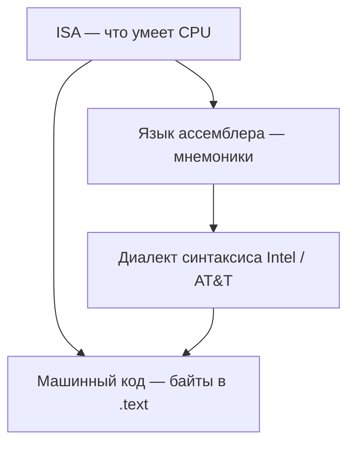

# Система команд (ISA) и синтаксис Intel/AT&T

<div class="article-tags">
  <span class="tag tag-required">ОБЯЗАТЕЛЬНО</span>
  <span class="tag tag-beginner">ДЛЯ НОВИЧКОВ</span>
</div>

<span class="complexity-badge">Разработчику</span>
<span class="complexity-badge">Архитектору</span>

> **Контекст:** раздел учит **x86/x86-64** в **Intel-синтаксисе (NASM)**. Эта статья объясняет, почему листинг `objdump` на Linux выглядит иначе, и чем **система команд** отличается от **стиля записи** asm.

---

## Система команд — ISA

★ **Система команд** (англ. *instruction set*, **ISA** — *Instruction Set Architecture*) — соглашение о том, какие операции умеет выполнять процессор и как они кодируются в **машинных словах** (опкод + поля операндов).

ISA задаёт:

- набор **операций** (сложение, переход, загрузка из памяти, системный вызов через инструкции вроде `syscall`);
- **регистры** и их размеры;
- **режимы адресации** (регистр, память, константа);
- правила **флагов** и прерываний.

Разные микропроцессоры с **одинаковой ISA** могут иметь разную внутреннюю реализацию (конвейер, кэш), но программа, собранная под эту ISA, остаётся совместимой на уровне команд. Пример — процессоры Intel и AMD с семейством **x86-64**: общая система команд, разный "железный" дизайн.

**Язык ассемблера** — человекочитаемая запись **той же** ISA. Мнемоника `mov` на x86 и `ldr` на ARM — разные слова для **разных** систем команд. Подробнее о терминах — в [о разделе](intro.md) и [Основах](2.md).



---

### CISC и RISC — два подхода к ISA

Исторически архитектуры делят на **CISC** (*Complex Instruction Set Computer*) и **RISC** (*Reduced Instruction Set Computer*).$1это разный компромисс между сложностью одной команды и гибкостью компилятора.

| Признак | CISC (пример x86) | RISC (пример ARM, RISC-V, MIPS) |
|---------|-------------------|----------------------------------|
| Инструкции | Часто сложные, переменной длины (x86) | Чаще фиксированной длины, проще |
| Адресация | Много режимов | Ограниченный набор |
| Типичный asm | `mov eax, [ebx+8*4+offset]` | `ldr w0, [x1, #32]` |
| Учебный фокус раздела | **Да** — NASM, Linux/Windows PC | Упоминается для сравнения |

Современные x86-процессоры внутри декодируют CISC-команды в более простые микрооперации, но **программист и ассемблер** по-прежнему оперируют классическими мнемониками ISA x86.

<div class="callout callout--info">
  <div class="callout-title">Семейства ISA в энциклопедии</div>

  <div class="callout-body">
  Краткий обзор x86, ARM, MIPS, RISC-V — в <a href="711.md">справочнике</a> и в таблице архитектур в <a href="1.md">истории</a>. Регистры x86-64 разбираются в <a href="4.md">типах данных и регистрах</a>.
</div>
</div>

---

## Диалект синтаксиса — Intel и AT&T

Для **одной и той же** ISA x86 существуют два распространённых **стиля текста**. Машинные байты после сборки могут совпадать; меняется только запись для человека.

| Правило | Intel (NASM, MASM, многие учебники) | AT&T (GAS по умолчанию, `objdump` на Linux) |
|---------|--------------------------------------|---------------------------------------------|
| Порядок операндов `mov` | **куда**, **откуда** — `mov dst, src` | **откуда**, **куда** — `mov src, dst` |
| Регистры | `eax`, `rax`, без префикса | `%eax`, `%rax` |
| Константа (immediate) | `42`, `0x10` | `$42`, `$0x10` |
| Память | `[rbx + 8]` — адрес в скобках | `8(%rbx)` — смещение перед скобками |
| Размер операнда | часто по имени регистра (`mov eax, …`) | суффикс `b/w/l/q` — `movl`, `movq` |
| Сегментные имена | редко в 64-bit user code | `(%rip)` для PC-relative |

★ Запомнить проще так: в **Intel** "слева получатель", как в присваивании C: `x = y`. В **AT&T** порядок как у мнемоники "переместить" — сначала источник, потом приёмник.

---

### Одна операция — два записи

Загрузка константы в 32-битный регистр (`EAX = 10`):

```asm
; Intel (NASM)
    mov eax, 10
```

```asm
# AT&T (GAS)
    movl $10, %eax
```

Копирование между регистрами (`EBX = EAX`):

```asm
; Intel
    mov ebx, eax
```

```asm
# AT&T
    movl %eax, %ebx
```

Сложение с памятью (`EAX += dword по адресу RBX`):

```asm
; Intel
    add eax, [rbx]
```

```asm
# AT&T
    addl (%rbx), %eax
```

Условный переход "если равно — на метку" после `cmp eax, ebx`:

```asm
; Intel
    cmp eax, ebx
    je  equal_label
```

```asm
# AT&T
    cmpl %ebx, %eax
    je  equal_label
```

Вызов функции по метке `helper`:

```asm
; Intel
    call helper
```

```asm
# AT&T
    call helper
```

`call`/`ret` и метки в обоих стилях читаются похоже; чаще всего путают **`mov`** и **`add`** из‑за порядка операндов и обозначения памяти.

---

### PC-relative адрес строки (x86-64 Linux)

Типичный фрагмент из [Первой программы](7.md) — адрес буфера для `write`:

```asm
; Intel (NASM), Linux x86-64
    lea rsi, [rel msg]
```

```asm
# AT&T (GAS)
    lea msg(%rip), %rsi
```

Смысл один: сформировать адрес `msg` относительно текущей инструкции (позиционно-независимый код, PIE).

---

## Кто какой синтаксис использует

| Инструмент | Синтаксис по умолчанию | Примечание |
|------------|------------------------|------------|
| **NASM**, **MASM**, **FASM** | Intel | учебный стандарт раздела |
| **GAS** (`as`) | AT&T | ключ `-intel-syntax` или директива `.intel_syntax noprefix` |
| **`gcc -S`** | AT&T в `.s` | можно `-masm=intel` |
| **`objdump -d`** на Linux | AT&T | `objdump -d -M intel` — Intel-стиль в листинге |
| **GDB** `disassemble` | AT&T | `set disassembly-flavor intel` |
| **Inline asm в GCC/Clang** | AT&T | расширенный `asm` с constraints |
| **Inline asm в MSVC** | Intel | блок `__asm { … }` |

<div class="callout callout--tip">
  <div class="callout-title">Практика на Linux</div>

  <div class="callout-body">
  Собрали программу NASM (Intel), открыли в отладчике — видите AT&T.

  Это нормально: байты те же.

  Для сравнения с исходником: `objdump -d -M intel prog` или в GDB `set disassembly-flavor intel`.

  Разбор ELF — в [чтении бинарника](13.md).
</div>
</div>

---

### GAS в режиме Intel

Если нужно писать `.s` для GCC в привычном стиле:

```asm
    .intel_syntax noprefix
    mov rax, 1
    mov rdi, 1
    syscall
    .att_syntax prefix
```

Директивы секций у GAS (`.globl`, `.data`) отличаются от NASM (`section .data`, `global`) — см. [взаимодействие с C](12.md) и [несколько модулей](11.md).

---

## Как не смешивать уровни абстракции

При чтении кода полезно держать три вопроса отдельно:

1. **Какая ISA?** (x86-64, ARM, …) — от этого зависят мнемоники и регистры.
2. **Какой диалект записи?** (Intel или AT&T) — от этого зависит порядок операндов в листинге.
3. **Какой транслятор?** (NASM, GAS, MASM) — от этого зависят директивы `section` / `.section`.

Ошибка новичка — спорить "как правильно писать `mov`", имея в виду разные диалекты одной ISA. В этом разделе эталон — **Intel + NASM**; AT&T нужен, чтобы понимать вывод GNU-инструментов и листинги компилятора C.

---

### Куда дальше

| Шаг | Материал |
|-----|----------|
| 1 | [Основы](2.md) — структура строки, стек, секции |
| 2 | [Типы данных и регистры](4.md) — размеры, флаги, endianness |
| 3 | [Управляющие конструкции](5.md) — `CMP`, `Jcc`, циклы |
| 4 | [Первая программа](7.md) — сборка NASM под Linux x86-64 |
| 5 | [Справочник](711.md) — таблицы мнемоник |

---
