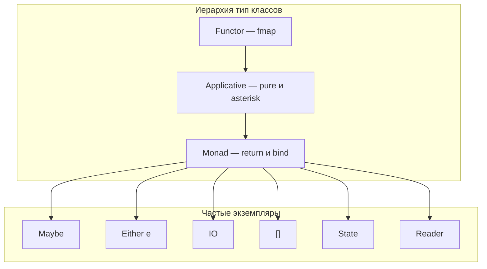
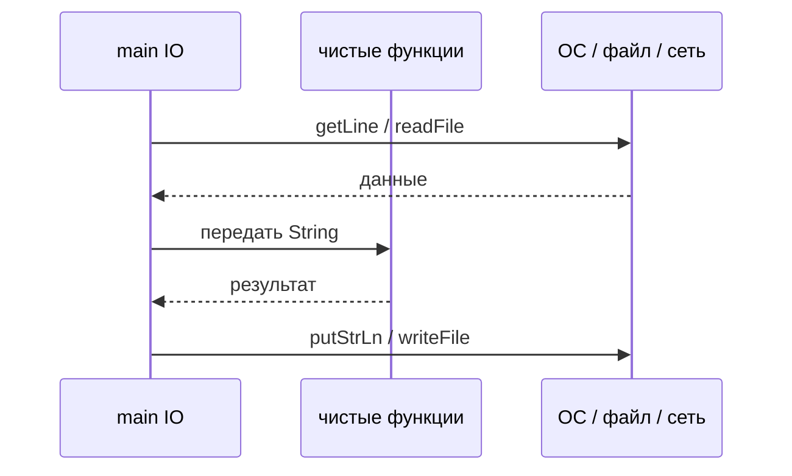

# Монады в Haskell

<div class="article-tags">
  <span class="tag tag-required">ОБЯЗАТЕЛЬНО</span>
  <span class="tag tag-beginner">ДЛЯ НОВИЧКОВ</span>
</div>

<span class="complexity-badge">Разработчику</span>
<span class="complexity-badge">Архитектору</span>

**Дальше:** [Cabal и Stack](./9.md) · [простые приложения](./103.md)

---

## Монады в Haskell

**Монада** — контракт для последовательных вычислений внутри контекста: возможная ошибка (`Maybe`), несколько результатов (`[]`), ввод-вывод (`IO`), изменяемое состояние (`State`). Тип класс `Monad` задаёт `return` и оператор `(>>=)` (bind); `do`-notation — синтаксический сахар над bind.

Чистые функции в Haskell не выполняют побочных эффектов напрямую, но реальные программы читают файлы, обрабатывают ошибки и хранят состояние. Монады **структурируют эффект** так, чтобы композиция функций оставалась предсказуемой и проверяемой типами.

Практикум идёт **по шагам** — от `Functor` и `Applicative` к `Monad`, затем `Maybe`, `Either`, `IO`, списки, `do`-блоки и учебный парсер конфигурации.

| Шаг | Тема | Зачем |
|-----|------|-------|
| 1 | Зачем нужен контекст | Понять проблему вложенных `case` |
| 2 | `Functor` и `fmap` | Первый уровень абстракции |
| 3 | `Applicative` и `<*>` | Независимые вычисления в контексте |
| 4 | Тип класс `Monad` | `return` и `(>>=)` |
| 5 | `Maybe` | Ошибка как отсутствие значения |
| 6 | `Either` | Ошибка с текстом |
| 7 | `IO` | Эффекты на границе программы |
| 8 | Списки как монада | Недетерминизм и comprehension |
| 9 | `do`-notation | Читаемые цепочки |
| 10 | `Reader` и `State` | Окружение и состояние |
| 11 | Практика — парсинг порта | Собрать всё вместе |

| Материал | Зачем |
|----------|-------|
| [Типы данных](./4.md) | `Maybe`, `Either`, алгебраические типы |
| [Основы FP](./2.md) | Чистые функции, иммутабельность |
| [Первая программа](./7.md) | GHCi, `main`, первый `IO` |
| [Cabal и Stack](./9.md) | Собрать проект с `mtl` |
| [Простые приложения](./103.md) | `IO` + JSON на краях |
| [Типизация](/encyclopedia/1-basics/1-09-dannye-i-informatsiya/4) | Общая теория типов |
| [Scala flatMap](/encyclopedia/5-languages/5-18-scala/6) | Аналог на JVM |

### Навигация по блоку Haskell

- Предыдущий шаг: [Функции и композиция](./6.md), [Управляющие конструкции](./5.md)
- Вы здесь: [Монады в Haskell](./8.md)
- Следующий шаг: [Cabal и Stack](./9.md) → [Простые приложения](./103.md)
- Обзор раздела: [Haskell — о разделе](./intro.md)



<div class="callout callout--tip">
  <div class="callout-title">GHCi — лучший способ учить монады</div>

  <div class="callout-body">
  Запустите <code>ghci</code> и пробуйте выражения по ходу статьи. Полезные команды: <code>:info Monad</code>, <code>:type (>>=)</code>, <code>:m + Data.Maybe</code>. Отладка в IDE — <a href="/encyclopedia/4-code-dev/4-14-razrabotka-i-otladka/111">статья про отладку</a>.
</div>
</div>

---

## Шаг 1 — зачем нужен контекст

Представьте цепочку операций, где каждая может завершиться ошибкой:

```haskell
-- Императивный стиль через вложенные case — трудно читать
calcUgly :: Double -> Double -> Double -> Maybe Double
calcUgly a b c =
  case safeDiv a b of
    Nothing -> Nothing
    Just x  ->
      case safeDiv x c of
        Nothing -> Nothing
        Just y  -> Just y
```

Каждый новый шаг добавляет ещё один уровень вложенности. При пяти шагах код превращается в лесенку из `case`.

Монада даёт **единый способ** соединять шаги:

```haskell
calc :: Double -> Double -> Double -> Maybe Double
calc a b c = do
  x <- safeDiv a b
  y <- safeDiv x c
  return y
```

Разбор:
- `do`-блок читается сверху вниз, как последовательность команд.
- На первом `Nothing` цепочка **прерывается** — остальные шаги не выполняются.
- `return y` упаковывает чистое значение `y` обратно в `Maybe`.

Тот же смысл без `do`:

```haskell
calc a b c = safeDiv a b >>= \x -> safeDiv x c
```

Оператор `(>>=)` называют **bind** (связывание): он берёт значение из контекста и передаёт его в следующую функцию.

---

## Шаг 2 — Functor и fmap

Перед `Monad` полезно понять **Functor** — тип класс с одной операцией `fmap`:

```haskell
class Functor f where
  fmap :: (a -> b) -> f a -> f b
```

`fmap` применяет обычную функцию **внутри** контекста `f`, не извлекая значение наружу.

```haskell
fmap (+1) (Just 2)        -- Just 3
fmap (+1) Nothing         -- Nothing
fmap length ["ab", "c"]   -- [2, 1]
```

Разбор:
- `Just 2` — контекст "значение есть"; `fmap` добавляет 1, контекст сохраняется.
- `Nothing` — контекст "значения нет"; `fmap` ничего не меняет.
- Для списков `fmap` совпадает с `map`.

В GHCi:

```haskell
ghci> fmap (*2) [1..3]
[2,4,6]
ghci> fmap show (Right 42)
Right "42"
```

Оператор `<$>` — инфиксная запись `fmap`:

```haskell
(+1) <$> Just 5   -- Just 6
```

**Ограничение Functor:** нельзя применить функцию из одного контекста к значению в другом контексте того же типа. Для этого нужен `Applicative`.

---

## Шаг 3 — Applicative и оператор `<*>`

**Applicative** расширяет `Functor` операциями `pure` и `<*>`:

```haskell
class (Functor f) => Applicative f where
  pure  :: a -> f a
  (<*>) :: f (a -> b) -> f a -> f b
```

| Операция | Смысл |
|----------|--------|
| `pure x` | Положить чистое значение в контекст (аналог `return`) |
| `f <*> x` | Применить функцию внутри `f` к значению внутри `f` |

Примеры:

```haskell
pure 3 :: Maybe Int                    -- Just 3
Just (+1) <*> Just 2                   -- Just 3
Just (+1) <*> Nothing                  -- Nothing

(+) <$> Just 1 <*> Just 2              -- Just 3
(+) <$> Just 1 <*> Nothing             -- Nothing
```

Разбор цепочки `(<$>)` + `(<*>)`:
- `(<$>)` — это `fmap`; `(+) <$> Just 1` даёт `Just (+1)`.
- `<*>` применяет `Just (+1)` к `Just 2`.

Для **независимых** шагов (когда результат одного не нужен для вызова следующего) достаточно `Applicative`. Когда следующий шаг **зависит** от предыдущего значения — нужен `Monad` и `(>>=)`.

```haskell
-- Applicative: оба аргумента уже известны
(+) <$> Just 10 <*> Just 5             -- Just 15

-- Monad: второй шаг зависит от результата первого
safeDiv 10 2 >>= \x -> safeDiv x 3     -- Just (10/2/3)
```

---

## Шаг 4 — тип класс Monad

```haskell
class (Applicative m) => Monad m where
  return :: a -> m a
  (>>=)  :: m a -> (a -> m b) -> m b
```

| Метод | Тип | Роль |
|-------|-----|------|
| `return` | `a -> m a` | Упаковать чистое значение |
| `(>>=)` | `m a -> (a -> m b) -> m b` | Связать шаги |

Оператор `>>` отбрасывает результат первого шага:

```haskell
(>>) :: Monad m => m a -> m b -> m b
ma >> mb = ma >>= \_ -> mb

putStrLn "start" >> putStrLn "end"
```

### Законы монад

Законы гарантируют, что `return` и `(>>=)` ведут себя предсказуемо:

1. **Левая единица:** `return x >>= f` эквивалентно `f x`
2. **Правая единица:** `m >>= return` эквивалентно `m`
3. **Ассоциативность:** `(m >>= f) >>= g` эквивалентно `m >>= (\x -> f x >>= g)`

На практике компилятор не проверяет законы — это ответственность автора экземпляра. Нарушение законов ломает рефакторинг и оптимизации.

```haskell
ghci> :info Monad
class Applicative m => Monad (m :: Type -> Type) where
  (>>=) :: m a -> (a -> m b) -> m b
  ...
```

<div class="callout callout--info">
  <div class="callout-title">return в Haskell и return в C</div>

  <div class="callout-body">
  <code>return</code> в Haskell <strong>не завершает функцию</strong>. Это просто упаковка значения в монаду. Выход из <code>do</code>-блока происходит обычным образом — последнее выражение задаёт результат всего блока.
</div>
</div>

---

## Шаг 5 — Maybe

`Maybe a` моделирует **опциональное** значение:

```haskell
data Maybe a = Nothing | Just a
```

### Безопасное деление

```haskell
safeDiv :: Double -> Double -> Maybe Double
safeDiv _ 0 = Nothing
safeDiv x y = Just (x / y)
```

```haskell
ghci> safeDiv 10 2
Just 5.0
ghci> safeDiv 10 0
Nothing
```

### Цепочка вычислений

```haskell
calc :: Double -> Double -> Double -> Maybe Double
calc a b c = do
  x <- safeDiv a b
  y <- safeDiv x c
  return y

ghci> calc 100 5 2
Just 10.0
ghci> calc 100 0 2
Nothing
```

Разбор `x <- safeDiv a b`:
- `<-` **извлекает** значение из `Maybe` внутри `do`.
- Если `safeDiv` вернул `Nothing`, весь `do`-блок сразу возвращает `Nothing`.
- Переменная `x` доступна только в чистом контексте ниже по блоку.

### Эквивалент через bind

```haskell
calc a b c =
  safeDiv a b >>= \x ->
  safeDiv x c
```

### Комбинирование с fmap

Когда нужно преобразовать значение внутри `Just`, но не строить цепочку:

```haskell
doubleIfPresent :: Maybe Int -> Maybe Int
doubleIfPresent = fmap (*2)

ghci> doubleIfPresent (Just 21)
Just 42
ghci> doubleIfPresent Nothing
Nothing
```

### fromMaybe — значение по умолчанию

```haskell
import Data.Maybe (fromMaybe)

portOrDefault :: Maybe Int -> Int
portOrDefault = fromMaybe 8080
```

| Ситуация | Подход |
|----------|--------|
| Один шаг может отсутствовать | `Maybe` |
| Нужно сообщение об ошибке | `Either String` |
| Несколько независимых `Maybe` | `Applicative` |
| Шаги зависят друг от друга | `Monad` + `do` |

---

## Шаг 6 — Either

`Either e a` хранит **либо ошибку** типа `e`, **либо успех** типа `a`:

```haskell
data Either e a = Left e | Right a
```

По соглашению `Left` — ошибка, `Right` — успешный результат (мнемоника: right = правильный).

```haskell
safeDivE :: Double -> Double -> Either String Double
safeDivE _ 0 = Left "division by zero"
safeDivE x y = Right (x / y)
```

```haskell
pipeline :: Either String Double
pipeline = do
  x <- safeDivE 10 2    -- Right 5.0
  y <- safeDivE x 0     -- Left "division by zero"
  return y              -- сюда не дойдём
```

`Either e` — монада **по правому** типу `a`, когда `e` фиксирован. Все ошибки в цепочке имеют один тип `e`.

### Улучшенный парсер порта

```haskell
parsePortE :: String -> Either String Int
parsePortE s =
  case reads s of
    [(n, "")] | n > 0 && n < 65536 -> Right n
    _ -> Left ("invalid port: " ++ s)

loadPortE :: String -> Either String Int
loadPortE input = do
  port <- parsePortE input
  return port

ghci> loadPortE "3000"
Right 3000
ghci> loadPortE "99999"
Left "invalid port: 99999"
```

### Сравнение Maybe и Either

| Тип | Ошибка | Когда использовать |
|-----|--------|-------------------|
| `Maybe a` | Без деталей (`Nothing`) | Внутренние вычисления, lookup |
| `Either e a` | С полем `e` | CLI, API, логирование |

В продакшене часто переходят на библиотеки **mtl** и **transformers** — см. [Cabal и Stack](./9.md).

---

## Шаг 7 — IO

`IO a` описывает вычисление с **побочными эффектами**, которое при выполнении вернёт значение типа `a`.

```haskell
main :: IO ()
main = do
  putStrLn "Введите имя:"
  name <- getLine
  putStrLn ("Hello, " ++ name)
```

Разбор:
- `main` — точка входа; её тип **обязан** быть `IO ()`.
- `putStrLn` печатает строку и возвращает `IO ()`.
- `getLine` читает строку из stdin и возвращает `IO String`.
- `name <- getLine` извлекает чистую `String` для дальнейшего использования.

### Разделение чистой логики и IO

Паттерн из [простых приложений](./103.md):

```haskell
greet :: String -> String
greet name = "Hello, " ++ name

main :: IO ()
main = do
  name <- getLine
  putStrLn (greet name)   -- чистая логика отдельно
```

Преимущества:
- `greet` легко тестировать без stdin.
- Компилятор видит, где начинаются эффекты.
- Рефакторинг чистого кода безопаснее.

### Чтение файла

```haskell
import System.IO

readConfig :: FilePath -> IO (Either String Int)
readConfig path = do
  result <- try (readFile path) :: IO (Either IOError String)
  case result of
    Left err  -> return (Left ("cannot read: " ++ show err))
    Right txt -> return (parsePortE (head (lines txt)))
```

`try` из `Control.Exception` оборачивает `IO` в `Either` — пересечение исключений и монад.

### Правило IO

**Внутри чистого кода** нельзя вызвать `getLine` или `readFile`. Эффекты живут в `IO` и композируются через `do` и `(>>=)`. Значение типа `IO a` нельзя вытащить в чистую функцию без `unsafePerformIO` — и это антипаттерн.



<div class="callout callout--warning">
  <div class="callout-title">unsafePerformIO</div>

  <div class="callout-body">
  <code>unsafePerformIO</code> обходит гарантии чистоты. Используйте только в низкоуровневых библиотеках с документированными инвариантами. В прикладном коде держите эффекты в <code>main</code> и явных <code>IO</code>-функциях.
</div>
</div>

---

## Шаг 8 — списки как монада

Для списков `(>>=)` реализует **все комбинации**:

```haskell
pairs :: [(Int, Char)]
pairs = do
  x <- [1, 2, 3]
  y <- ['a', 'b']
  return (x, y)
-- [(1,'a'),(1,'b'),(2,'a'),(2,'b'),(3,'a'),(3,'b')]
```

Разбор:
- `x <- [1,2,3]` — для каждого `x` выполняется остаток блока.
- `y <- ['a','b']` — для каждого `y` строится пара.
- `return (x,y)` — это `pure (x,y)` для списка: один элемент.

Эквивалент в list comprehension:

```haskell
[(x, y) | x <- [1,2,3], y <- ['a','b']]
```

### Поиск пары чисел с заданной суммой

```haskell
sumPairs :: Int -> [(Int, Int)]
sumPairs target = do
  a <- [1..target]
  b <- [a..target]
  guard (a + b == target)
  return (a, b)
```

Здесь `guard` из `Control.Monad` фильтрует комбинации (для списка — как `filter`).

---

## Шаг 9 — do-notation и отступы

`do`-блок — синтаксический сахар. Компилятор переводит его в `(>>=)` и `return`.

```haskell
readConfig :: IO (Maybe Int)
readConfig = do
  line <- getLine
  let n = read line :: Int
  return (Just n)
```

| Конструкция | Смысл |
|-------------|--------|
| `x <- action` | Извлечь из монады (action :: m a) |
| `let x = expr` | Чистое локальное связывание |
| `return expr` | Упаковать в монаду |
| Последняя строка без `<-` | Результат всего блока |

### Обычный let и let в do

```haskell
-- let без in в do
doubleInDo :: IO Int
doubleInDo = do
  let x = 21
  return (x * 2)
```

### Отступы

Haskell чувствителен к отступам в `do`. Все строки одного блока выравнивают под первой командой:

```haskell
main = do
  putStrLn "ok"    -- тот же блок
  return ()
```

Смешение табов и пробелов ломает разбор — настройте редактор на пробелы. Подробнее о синтаксисе — [Управляющие конструкции](./5.md).

### Сопоставление с образцом в do

```haskell
parseLine :: String -> Maybe (Int, Int)
parseLine line = do
  [a, b] <- pure (words line)
  x <- readMaybe a
  y <- readMaybe b
  return (x, y)
  where
    readMaybe s = case reads s of
      [(n, "")] -> Just n
      _         -> Nothing
```

Если `words line` не даст ровно два слова, `pure [a,b]` не сопоставится — получим `Nothing` (для `Maybe` с `fail`).

---

## Шаг 10 — Reader и State

### Reader — доступ к окружению

`Reader r a` — вычисление, которому нужен неизменяемый контекст `r`:

```haskell
import Control.Monad.Reader

greetR :: Reader String String
greetR = do
  env <- ask
  return ("Config path: " ++ env)

runGreet :: String
runGreet = runReader greetR "/etc/app.conf"
```

`ask` возвращает текущее окружение. В веб-приложениях через `ReaderT` передают конфиг и пул соединений.

### State — поток изменяемого состояния

`State s a` — функция `s -> (a, s)` в обёртке:

```haskell
import Control.Monad.State

increment :: State Int Int
increment = do
  n <- get
  put (n + 1)
  return n

runDemo :: (Int, Int)
runDemo = runState (increment >> increment) 0
-- (1, 2) — вернули первое значение n, финальное состояние 2
```

| Монада | Вопрос | Типичное применение |
|--------|--------|---------------------|
| `Reader r` | Какое окружение? | Конфиг, логгер |
| `State s` | Какое состояние? | Счётчик, парсер |
| `Writer w` | Какой лог? | Накопление событий |
| `IO` | Какие эффекты ОС? | Файлы, сеть |

### Monad transformers (кратко)

В реальных проектах комбинируют монады: `ReaderT Config IO a`, `StateT s IO a`. Трансформеры `*T` добавляют слой поверх базовой монады (часто `IO`). Старт — после освоения `Maybe`, `Either`, `IO` и [Cabal](./9.md).

---

## Шаг 11 — практика, парсинг конфигурации

Соберём загрузку порта из stdin с валидацией.

### Версия на Maybe

```haskell
parsePort :: String -> Maybe Int
parsePort s = case reads s of
  [(n, "")] | n > 0 && n < 65536 -> Just n
  _ -> Nothing

loadPort :: IO (Maybe Int)
loadPort = do
  line <- getLine
  case parsePort line of
    Nothing -> do
      putStrLn "Invalid port"
      return Nothing
    Just p  -> return (Just p)
```

### Версия на Either — без вложенного case

```haskell
parsePortE :: String -> Either String Int
parsePortE s = case reads s of
  [(n, "")] | n > 0 && n < 65536 -> Right n
  _ -> Left ("invalid port: " ++ show s)

loadPortE :: IO (Either String Int)
loadPortE = do
  line <- getLine
  case parsePortE line of
    Left err -> do
      putStrLn err
      return (Left err)
    Right p  -> return (Right p)
```

### Единая do-цепочка

```haskell
loadPortClean :: IO (Either String Int)
loadPortClean = do
  line <- getLine
  let result = parsePortE line
  case result of
    Left err -> putStrLn err >> return (Left err)
    Right p  -> return (Right p)
```

Ещё лучше вынести парсинг в чистую функцию и оставить в `IO` только ввод-вывод — как в [простых приложениях](./103.md) с JSON.

### Проверка в GHCi

```haskell
ghci> parsePortE "8080"
Right 8080
ghci> parsePortE "0"
Left "invalid port: \"0\""
```

---

## Типичные ошибки

| Симптом | Причина | Что сделать |
|---------|---------|-------------|
| `Couldn't match type IO a with a` | Вызов `IO` внутри чистой функции | Поднять тип до `IO` или передавать данные аргументом |
| Бесконечный `do` без `return` | Последняя строка не в монаде | Добавить `return` или выровнять тип |
| `No instance for Monad ((->) r)` | Путаница с `Reader` | Использовать `ReaderT` / `ask` |
| Вложенные `case` на десятки строк | Не используется `do` | Переписать на `do` или `>>=` |
| `return` в середине блока как в C | Неверная модель | В Haskell `return` только упаковывает |
| Все ошибки через `error` | Нет `Either` | Заменить на `Either String` |
| Табы в `do` | Сломан разбор | Только пробелы, один стиль |

---

## Упражнения

1. Напишите `safeHead :: [a] -> Maybe a` и цепочку `do`, которая берёт голову списка, удваивает (для `Int`) и возвращает `Maybe Int`.
2. Реализуйте `validateAge :: String -> Either String Int` (возраст 0–150) и `greetUser :: IO ()`, читающий имя и возраст.
3. Перепишите `pairs` через `(>>=)` без `do`.
4. Добавьте `Writer [String]` к парсеру порта — логируйте каждый шаг в чистой функции (подсказка: `Control.Monad.Writer`).
5. В GHCi выполните `:info Functor` и `:info Applicative` — запишите, какие классы наследует `Monad`.

<details>
<summary>Подсказки к упражнениям 1–2</summary>

```haskell
safeHead []    = Nothing
safeHead (x:_) = Just x

chain :: [Int] -> Maybe Int
chain xs = do
  h <- safeHead xs
  return (h * 2)
```

```haskell
validateAge s = case reads s of
  [(n, "")] | n >= 0 && n <= 150 -> Right n
  _ -> Left "age out of range"
```

</details>

---

## FAQ

**Монада — это контейнер?**
Часто удобно так думать (`Maybe`, `[]`), но формально монада — это тип с `return` и `(>>=)`, удовлетворяющий законам. `IO` — монада, хотя не контейнер в бытовом смысле.

**Нужно ли учить теорию категорий?**
Для прикладного Haskell достаточно `Functor` → `Applicative` → `Monad` и практики на `Maybe` / `Either` / `IO`.

**Чем `return` отличается от `pure`?**
В `Monad` метод `return` совпадает с `pure` из `Applicative`. Исторически `return` появился раньше; стиль кода часто предпочитает `pure` вне `do`.

**Когда список, когда `Maybe`?**
`Maybe` — ноль или один результат. Список — ноль или много. Выбор влияет на семантику `(>>=)`.

**Как отлаживать IO?**
`print` внутри `do`, трассировка через `Debug.Trace`, тесты на чистых частях. См. [отладку](/encyclopedia/4-code-dev/4-14-razrabotka-i-otladka/111).

**Что читать после этой статьи?**
[Cabal и Stack](./9.md), затем [простые приложения](./103.md). Книги: *Learn You a Haskell* (главы про монады), *Haskell Programming from First Principles*.

---

## Глоссарий

| Термин | Краткое определение |
|--------|---------------------|
| **Bind (`>>=`)** | Связывание монадического шага с функцией, принимающей чистое значение |
| **Контекст** | Обёртка типа `m` в `m a` — правила вычисления |
| **do-notation** | Синтаксис для цепочек bind |
| **Чистая функция** | Без побочных эффектов, результат зависит только от аргументов |
| **Эффект** | Ввод-вывод, состояние, ошибка, недетерминизм |
| **Functor** | `fmap` — применить функцию внутри контекста |
| **Applicative** | Независимые вычисления в контексте через `<*>` |
| **Тип класс** | Интерфейс с операциями для разных типов |
| **Трансформер** | Монада, построенная поверх другой (`ReaderT`, `StateT`) |
| **Законы монад** | Три равенства, задающие смысл `return` и `(>>=)` |

---

## Связь с другими языками

| Haskell | Аналог |
|---------|--------|
| `Maybe` | `Option` в Scala/Rust |
| `Either` | `Result` в Rust |
| `IO` | `Task`, эффекты на границе |
| `(>>=)` | `flatMap` в Scala |
| `do` | `for`-comprehension в Scala |

Сравнение на JVM — [Scala flatMap](/encyclopedia/5-languages/5-18-scala/6). Обработка ошибок в Rust — [раздел Rust](/encyclopedia/5-languages/5-13-rust/intro).

---

## Что читать дальше

1. [Cabal и Stack](./9.md) — собрать проект с `mtl` / `text`.
2. [Простые приложения](./103.md) — `IO` + JSON на краях.
3. **Learn You a Haskell** — глава *A Fistful of Monads*.
4. **Haskell Book** — глава про monad transformers.
5. GHCi: `:info Monad`, `:type (>>=)`, `:m Control.Monad`.

<div class="callout callout--tip">
  <div class="callout-title">Главная идея</div>

  <div class="callout-body">
  Монады — инструмент <strong>композиции эффектов</strong>. Освоив <code>Maybe</code>, <code>Either</code> и <code>IO</code>, вы понимаете большую часть реального Haskell-кода. Не застревайте на метафорах — смотрите на типы и на то, как ведёт себя <code>(>>=)</code>.
</div>
</div>

---

## Шаг 12 — Kleisli и композиция функций

Функция `a -> m b` называется **Kleisli-стрелкой**. Оператор `<=<` композирует их справа налево:

```haskell
import Control.Monad

safeDivK :: Double -> Double -> Maybe Double
safeDivK = safeDiv

pipelineK :: Double -> Double -> Double -> Maybe Double
pipelineK a b c = (safeDivK c) <=< (safeDivK b) $ safeDivK a b
-- эквивалент calc a b c через do
```

Разбор:
- `g <=< f` значит: сначала `f`, потом `g` в контексте монады.
- Kleisli-стиль удобен, когда шаги уже оформлены как функции `a -> m b`.

Таблица операторов:

| Оператор | Тип | Чтение |
|----------|-----|--------|
| `fmap` / `<$>` | `(a->b) -> f a -> f b` | Функция снаружи контекста |
| `<*>` | `f (a->b) -> f a -> f b` | Независимые контексты |
| `>>=` | `m a -> (a->m b) -> m b` | Зависимая цепочка |
| `=<<` | `(a->m b) -> m a -> m b` | Flip bind |
| `<=<` | `(b->m c) -> (a->m b) -> a->m c` | Kleisli compose |

---

## Шаг 13 — when, unless, guard в do

```haskell
import Control.Monad

checkPositive :: Double -> Maybe Double
checkPositive x = do
  guard (x > 0)
  return x

validateAll :: [Double] -> Maybe [Double]
validateAll xs = mapM checkPositive xs
```

| Функция | Роль |
|---------|------|
| `guard True` | Продолжить |
| `guard False` | Прервать (для Maybe — `Nothing`) |
| `when cond action` | Выполнить `action` если `cond` |
| `unless cond action` | Выполнить если не `cond` |
| `mapM f xs` | `map` с монадическим `f` |
| `sequence` | `[m a]` → `m [a]` |

```haskell
process :: Maybe Int -> IO ()
process m = do
  when (isJust m) $ putStrLn "got value"
  unless (isNothing m) $ print (fromJust m)
```

Для продакшена избегайте `fromJust` — используйте явный `case` или `maybe`.

---

## Шаг 14 — IO, файлы и bracket

Безопасная работа с файлом — `bracket` гарантирует закрытие дескриптора:

```haskell
import System.IO
import Control.Exception (bracket)

readFirstLine :: FilePath -> IO String
readFirstLine path = bracket
  (openFile path ReadMode)
  hClose
  (\h -> do
    line <- hGetLine h
    return line)
```

Разбор:
- `bracket acquire release use` — `release` вызывается даже при исключении.
- Логику чтения держите в `use`; парсинг строки — в чистой функции.

```haskell
loadPortFromFile :: FilePath -> IO (Either String Int)
loadPortFromFile path = do
  exists <- doesFileExist path
  if not exists
    then return (Left "file not found")
    else do
      content <- readFile path
      let line = takeWhile (/= '\n') content
      return (parsePortE line)
```

---

## Шаг 15 — учебный сценарий в GHCi

Выполните по порядку в `ghci` (файл `MonadLab.hs` с определениями `safeDiv`, `calc`):

```haskell
ghci> calc 100 5 2
Just 10.0
ghci> calc 100 0 2
Nothing
ghci> safeDiv 10 2 >>= \x -> return (x + 1)
Just 6.0
ghci> [1,2] >>= \x -> [x, x*10]
[1,10,2,20]
ghci> :type (>>=)
(>>=) :: Monad m => m a -> (a -> m b) -> m b
```

Сохраните сессию в файл `:cmd` или скопируйте в README проекта — так проще повторить эксперимент.

---

## Шаг 16 — Either и кастомные ошибки

```haskell
data AppError = InvalidPort String | FileMissing String
  deriving (Show, Eq)

parsePortErr :: String -> Either AppError Int
parsePortErr s =
  case reads s of
    [(n, "")] | n > 0 && n < 65536 -> Right n
    _ -> Left (InvalidPort s)

firstError :: Either AppError Int
firstError = do
  port <- parsePortErr "abc"
  return port
```

Тип ошибки один на всю цепочку — сообщения единообразны для логов и API.

---

## Расширенная таблица монад

| Монада | Тип | Типичный вопрос | Пример |
|--------|-----|-----------------|--------|
| `Maybe` | `Maybe a` | Значение есть? | lookup, safe div |
| `Either e` | `Either e a` | Успех или ошибка? | валидация ввода |
| `[]` | `[a]` | Какие варианты? | перебор, парсер |
| `IO` | `IO a` | Эффект ОС? | файлы, сеть |
| `Reader r` | `Reader r a` | Какой конфиг? | настройки |
| `State s` | `State s a` | Какое состояние? | счётчик |
| `Writer w` | `Writer w a` | Какой лог? | аудит шагов |
| `STM` | `STM a` | Атомарно в памяти? | concurrent |

---

## Monad transformers — следующий уровень

Когда одной монады мало, используют **трансформеры** — `ReaderT`, `StateT`, `ExceptT` поверх `IO`:

```haskell
{-# LANGUAGE OverloadedStrings #-}
-- упрощённый псевдопример стека
-- type App = ReaderT Config (ExceptT String IO)

-- runApp :: App a -> Config -> IO (Either String a)
```

Порядок слоёв важен: `ReaderT Config (ExceptT String IO)` читает конфиг, затем обрабатывает ошибки, затем IO. Подробности — после [Cabal и Stack](./9.md) с зависимостью `mtl`.

---

## Дополнительные упражнения

6. Напишите `safeTail :: [a] -> Maybe [a]` и цепочку, которая берёт хвост дважды.
7. Реализуйте `readTwoLines :: IO (Either String (String, String))` — вторая строка не короче трёх символов.
8. Перепишите `pairs` как list comprehension и сравните с `do`.
9. Добавьте `Writer [String]` к `parsePortE` — лог `"parsed OK"` при успехе.
10. Объясните своими словами закон ассоциативности на примере `Maybe`.

---

## Дополнительный FAQ

**Что такое fail в Monad?**
Исторически `fail` прерывал `do` с ошибкой строки. В современном GHC для `Maybe` это `Nothing`, для `Either` — `Left`. В GHC2021 `fail` уходит из `Monad`.

**Нужен ли Free monad в учебном проекте?**
Нет. Free monads — для встраиваемых DSL; начните с `Either` и `IO`.

**Как тестировать IO?**
Выносите логику в чистые функции; IO оставляйте тонкой оболочкой. Для подмены — `System.IO.Unsafe` не нужен; передавайте строки аргументами.

**Чем отличается Traversable от Functor?**
`traverse` применяет монадическую функцию к структуре и собирает результат в одну монаду: `traverse readMaybe ["1","2"] :: Maybe [Int]`.

---

## Разбор фрагментов — шпаргалка

| Код | Смысл |
|-----|--------|
| `x <- m` | Извлечь из монады в do |
| `let x = e` | Чистое связывание |
| `return v` | `pure v` в монаде |
| `m >> n` | Выполнить m, отбросить результат, затем n |
| `void m` | Выполнить m, вернуть () |
| `fmap f m` | Преобразовать внутри контекста |
| `join m` | `m >>= id`, схлопнуть m (m a) в m a |

---

## Сценарий — CLI с Either

```haskell
{-# LANGUAGE OverloadedStrings #-}
import System.Environment (getArgs)

main :: IO ()
main = do
  args <- getArgs
  case args of
    [path] -> do
      result <- loadPortFromFile path
      case result of
        Left err -> putStrLn err
        Right p  -> putStrLn ("Port: " ++ show p)
    _ -> putStrLn "Usage: app <config-file>"
```

Сборка — [Cabal и Stack](./9.md); JSON вместо файла — [простые приложения](./103.md).

## Полный учебный модуль — валидация формы в IO

Пошагово соберём программу, которая читает имя и возраст, валидирует через `Either` и печатает приветствие.

### Шаг A — чистые валидаторы

```haskell
validateName :: String -> Either String String
validateName s
  | null (trim s)   = Left "name is empty"
  | length s > 50   = Left "name too long"
  | otherwise       = Right (trim s)
  where trim = reverse . dropWhile (==' ') . reverse . dropWhile (==' ')

validateAge :: String -> Either String Int
validateAge s = case reads s of
  [(n, "")] | n >= 0 && n <= 150 -> Right n
  _ -> Left "age must be 0-150"
```

### Шаг B — монадическая сборка

```haskell
readUser :: IO (Either String (String, Int))
readUser = do
  putStrLn "Name:"
  nameLine <- getLine
  putStrLn "Age:"
  ageLine <- getLine
  return $ do
    name <- validateName nameLine
    age  <- validateAge ageLine
    return (name, age)
```

Обратите внимание: внутренний `do` имеет тип `Either String (String, Int)` — это **чистая** цепочка внутри `return`.

### Шаг C — main

```haskell
greetUser :: (String, Int) -> String
greetUser (name, age) = "Hello, " ++ name ++ " (" ++ show age ++ ")"

main :: IO ()
main = do
  result <- readUser
  case result of
    Left err -> putStrLn ("Error: " ++ err)
    Right u  -> putStrLn (greetUser u)
```

### Шаг D — проверка

```bash
cabal run my-app
# Name: Ann
# Age: 30
# Hello, Ann (30)
```

Такой шаблон (IO снаружи, `Either` внутри) повторяется в [простых приложениях](./103.md) при разборе JSON API.

---

## Карта чтения по уровню

| Уровень | Секции |
|---------|--------|
| Новичок | Шаги 1–7, Maybe, Either, IO, упражнения 1–3 |
| Практик | do-notation, парсинг порта, CLI, GHCi лаб |
| Углубление | Kleisli, transformers, законы, Traversable |

---

## Ссылки на смежные темы энциклопедии

| Тема | Материал |
|------|----------|
| Функциональное программирование | [Основы FP](./2.md) |
| Алгебраические типы | [Типы](./4.md) |
| Сборка проекта | [Cabal и Stack](./9.md) |
| Отладка | [Разработка и отладка](/encyclopedia/4-code-dev/4-14-razrabotka-i-otladka/111) |
| Типизация | [Данные и информация](/encyclopedia/1-basics/1-09-dannye-i-informatsiya/4) |
| Scala | [flatMap](/encyclopedia/5-languages/5-18-scala/6) |
| Rust Result | [Rust intro](/encyclopedia/5-languages/5-13-rust/intro) |

{/* sidebar-collections */}

---

## В подборках

Статья входит в [тематические подборки](/about/collections) и маршрут раздела [Haskell](./intro.md). Соседние шаги:

**Haskell** — [Первая программа](/encyclopedia/5-languages/5-17-haskell/7), [Основы FP](/encyclopedia/5-languages/5-17-haskell/2), [Типы](/encyclopedia/5-languages/5-17-haskell/4), [Cabal и Stack](/encyclopedia/5-languages/5-17-haskell/9).

{/* /sidebar-collections */}

---

## Дополнительный практикум: Kleisli и композиция

**Kleisli arrow** — функция вида `a -> m b`. Композиция через `(<=<)` или `(>=>)` читается справа налево как pipeline эффектов:

```haskell
import Control.Monad ((>=>))

parsePort :: String -> Maybe Int
parsePort s = readMaybe s >>= \n ->
  if n >= 1 && n <= 65535 then Just n else Nothing

readPortFromEnv :: String -> IO (Maybe Int)
readPortFromEnv key =
  lookupEnv key >>= \case
    Nothing -> pure Nothing
    Just s  -> pure (parsePort s)
```

Цепочка `f >=> g` означает: результат `f` подставляется в `g` внутри монадического контекста. Это тот же bind, но записанный для функций между контекстами.

| Оператор | Тип | Читается как |
|----------|-----|--------------|
| `(>>=)` | `m a -> (a -> m b) -> m b` | bind значения |
| `(=<<)` | `(a -> m b) -> m a -> m b` | flip bind |
| `(>=>)` | `(a -> m b) -> (b -> m c) -> a -> m c` | Kleisli compose |
| `(<=<)` | flip `(>=>)` | compose справа |

---

## Reader и State: когда применять

**Reader r** хранит неизменяемое окружение `r`, доступное через `ask` и `local`:

```haskell
import Control.Monad.Reader

type Config = { port :: Int, host :: String }

runServer :: Reader Config String
runServer = do
  cfg <- ask
  pure ("listening on " ++ host cfg ++ ":" ++ show (port cfg))
```

**State s** — последовательные изменения состояния без явной передачи аргумента:

```haskell
import Control.Monad.State

tick :: State Int Int
tick = do
  n <- get
  put (n + 1)
  pure n
```

В прикладном коде `State` часто заменяют на чистые fold по списку; `Reader` — на явную передачу `Config` в сигнатуре. Монадические обёртки оправданы, когда цепочка длинная и повторяется паттерн `do`.

---

## Traversable и sequence

Тип класс `Traversable` обобщает обход структуры с эффектом:

```haskell
import Data.Traversable (for)

users :: [UserId]
users = [1, 2, 3]

loadAll :: (Traversable t, Monad m) => t UserId -> m (t User)
loadAll = for `id` loadUser  -- for = flip traverse
```

`sequence` для `[Maybe a]` схлопывает список в `Maybe [a]` — если хоть один `Nothing`, весь результат `Nothing`. Это тот же паттерн, что `all`/`any`, но в монадическом стиле.

---

## Типичные ошибки новичков

| Ошибка | Симптом | Исправление |
|--------|---------|-------------|
| `IO` внутри чистой функции | Компилятор: expected pure type | Вынести `IO` в `main`, вернуть `Either`/`Maybe` |
| Вложенные `case` вместо bind | Нечитаемый код | `do` или `(>>=)` |
| `return` как выход из функции | Путаница с `return` в C | `return` = `pure` в Haskell |
| Смешение `Applicative` и `Monad` | Лишние зависимости между шагами | Независимые шаги — `<*>` |
| `fail` в do | Deprecated для многих monad | `guard`, `Maybe`, явный `Left` |

---

## Упражнения с разбором (продолжение)

### Упражнение 4 — цепочка Either

Напишите функцию `parseUser :: String -> String -> Either String User`, где первый аргумент — имя, второй — возраст как строка. Ошибки: пустое имя, нечисловой возраст, возраст вне 0..150.

```haskell
data User = User { userName :: String, userAge :: Int }
  deriving Show

parseUser :: String -> String -> Either String User
parseUser name ageStr = do
  n <- if null (trim name) then Left "empty name" else Right (trim name)
  a <- parseAge ageStr
  pure (User n a)
  where
    trim = dropWhile (== ' ') . reverse . dropWhile (== ' ') . reverse
    parseAge s = case readMaybe s of
      Nothing -> Left "age not a number"
      Just a | a < 0 || a > 150 -> Left "age out of range"
      Just a -> Right a
```

### Упражнение 5 — списки как монада

Все пары `(x, y)` из `[1,2,3]` и `[10,20]`, где `x < y`:

```haskell
pairs :: [(Int, Int)]
pairs = do
  x <- [1, 2, 3]
  y <- [10, 20]
  guard (x < y)
  pure (x, y)
-- [(1,10),(1,20),(2,10),(2,20),(3,10),(3,20)] без (3,20)? x<y: (3,20) ok
```

`guard False` отфильтровывает ветку — аналог `if` с early empty для списка.

---

## ST и безопасная мутабельность

Монада `ST s` изолирует мутабельные ссылки в локальном scope — наружу не утекают:

```haskell
import Control.Monad.ST
import Data.STRef

sumMutable :: [Int] -> Int
sumMutable xs = runST $ do
  ref <- newSTRef 0
  mapM_ (\x -> modifySTRef' ref (+ x)) xs
  readSTRef ref
```

`runST` гарантирует, что ссылка не покинет блок — тип `s` phantom, компилятор не даст сохранить `STRef s` в глобальное состояние.

---

## Тестирование монадического кода

| Подход | Когда |
|--------|-------|
| Чистые функции + `Either`/`Maybe` | `QuickCheck`, unit без `IO` |
| `IO` только в `main` | Integration через temp files |
| `MonadIO` в transformer stack | Mock через type class |

Пример property для `parsePort`:

```haskell
-- prop_parsePort_valid n = n >= 1 && n <= 65535 ==>
--   parsePort (show n) == Just n
```

---

## Связь с другими экосистемами

| Haskell | Аналог | Заметка |
|---------|--------|---------|
| `Maybe` | `Optional` (Java) | Отсутствие значения |
| `Either e` | `Result` (Rust) | Ошибка с типом |
| `IO` | `main` + syscalls | Эффект на границе |
| `do` | `async/await`, `flatMap` | Синтаксический сахар |

Подробнее про JVM — [Scala flatMap](/encyclopedia/5-languages/5-18-scala/6); про явные ошибки — [Rust](/encyclopedia/5-languages/5-13-rust/intro).

---

## Чек-лист перед переходом к Cabal

- [ ] Объяснить разницу `Functor`, `Applicative`, `Monad` на примере `Maybe`
- [ ] Переписать вложенные `case` в `do` для `Either`
- [ ] Написать `main`, читающий env и парсящий порт через `Maybe`
- [ ] Пройти упражнения 1–5 в GHCi
- [ ] Прочитать законы monad и проверить на бумаге для списка

**Следующий шаг:** [Cabal и Stack](./9.md) — собрать проект с зависимостями `mtl`, `aeson`.

---

---

## Практикум — шаг 12: Kleisli и compose

```haskell
import Control.Monad

safeDiv :: Double -> Double -> Maybe Double
safeDiv _ 0 = Nothing
safeDiv x y = Just (x / y)

chain :: Double -> Double -> Double -> Maybe Double
chain a b c = do
  x <- safeDiv a b
  safeDiv x c
```

---

## Практикум — шаг 13: Either с несколькими шагами

```haskell
parsePositive :: String -> Either String Double
parsePositive s = case reads s of
  [(n, "")] | n > 0 -> Right n
  _ -> Left "not positive"

pipeline :: String -> String -> Either String Double
pipeline a b = do
  x <- parsePositive a
  y <- parsePositive b
  Right (x + y)
```

---

## Практикум — шаг 14: IO + Either в main

```haskell
main :: IO ()
main = do
  line <- getLine
  case parsePortE line of
    Left err -> putStrLn err
    Right p  -> putStrLn ("Port: " ++ show p)
```

---

## Практикум — шаг 15: list comprehension и do

```haskell
pairs = [(x,y) | x <- [1..3], y <- ['a','b']]

pairsDo = do
  x <- [1..3]
  y <- ['a','b']
  return (x, y)
```

---

## Воркшоп: парсер конфига (30 мин)

| Мин | Задача |
|-----|--------|
| 0–10 | parsePortE |
| 10–20 | loadPortE в IO |
| 20–30 | тесты в GHCi |

---

## Troubleshooting монад

| Симптом | Решение |
|---------|---------|
| IO в pure | поднять тип |
| вложенные case | do / >>= |
| return как exit | return = pure |
| табы в do | пробелы |

---

## FAQ монады

**Монада = контейнер?** — формально тип класс с законами.

**Теория категорий?** — не обязательна для практики.

**return vs pure?** — синонимы в Applicative.

**Когда [] vs Maybe?** — много vs ноль/один результатов.

**Отладка IO?** — Debug.Trace, тесты pure частей.

---

---

## Дополнительные сценарии (монады)

### Сценарий A: GHCi Maybe chain

```haskell
ghci> safeDiv 10 2 >>= \x -> safeDiv x 5
Just 1.0
ghci> safeDiv 10 0 >>= \x -> safeDiv x 5
Nothing
```

### Сценарий B: Either с сообщением

```haskell
ghci> parsePortE "8080"
Right 8080
ghci> parsePortE "abc"
Left "invalid port: \"abc\""
```

### Сценарий C: do и bind

Перепишите `calc` из статьи без `do` — только `(>>=)`.

### Сценарий D: список как монада

```haskell
ghci> do { x <- [1,2]; y <- [10,20]; return (x+y) }
[11,21,12,22]
```

### Сценарий E: чистая greet + IO main

`greet` без IO; `main` только getLine и putStrLn.

---

## Упражнения — контрольная точка

6. `safeTail :: [a] -> Maybe [a]`.
7. `validateEmail :: String -> Either String String`.
8. Writer для лога шагов парсера.
9. Reader с конфигом порта по умолчанию.
10. Сравнение `flatMap` в [Scala](/encyclopedia/5-languages/5-18-scala/6).

---
