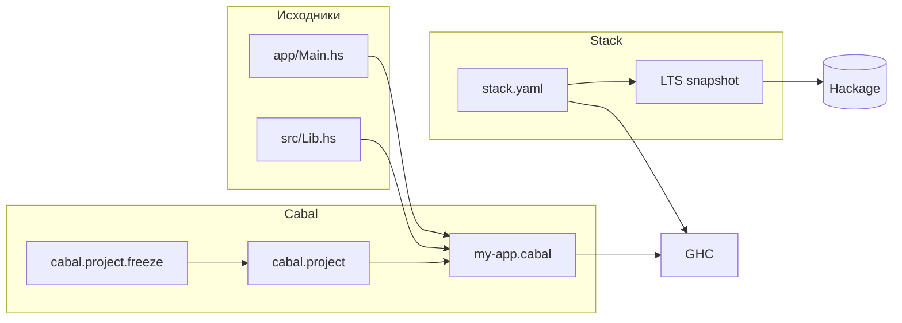

# Cabal и Stack

<div class="article-tags">
  <span class="tag tag-required">ОБЯЗАТЕЛЬНО</span>
  <span class="tag tag-beginner">ДЛЯ НОВИЧКОВ</span>
</div>

<span class="complexity-badge">Разработчику</span>
<span class="complexity-badge">Архитектору</span>

**Дальше:** [простые приложения](./103.md) · [монады](./8.md)

---

## Cabal и Stack

Haskell-код редко живёт в одном `.hs` файле. **Cabal** (Common Architecture for Building Applications and Libraries) — стандарт описания пакетов и сборки в экосистеме GHC. **Stack** — инструмент с фиксированными снимками GHC и Stackage для воспроизводимых сборок.

Оба используют реестр **Hackage** ([hackage.haskell.org](https://hackage.haskell.org)). Перед этой главой полезно пройти [первую программу](./7.md) и [монады](./8.md).

Практикум **по шагам** — установка GHC, проект Cabal, проект Stack, зависимости, тесты, REPL, HLS и типичные ошибки.

| Шаг | Тема | Зачем |
|-----|------|-------|
| 1 | GHCup и выбор инструмента | Подготовить среду |
| 2 | Cabal-проект с нуля | Стандартная сборка |
| 3 | `stack new` | Быстрый старт с LTS |
| 4 | Зависимости | `aeson`, `text`, `mtl` |
| 5 | REPL и тесты | Цикл разработки |
| 6 | HLS в редакторе | Подсказки и типы |
| 7 | CI и freeze | Воспроизводимость |
| 8 | Миграция и чек-лист | Закрепление |

| Материал | Зачем |
|----------|-------|
| [Первая программа](./7.md) | GHCi, `main`, hello world |
| [Монады](./8.md) | `mtl` в зависимостях |
| [Простые приложения](./103.md) | JSON, HTTP после сборки |
| [npm в Node](/encyclopedia/5-languages/5-01-javascript/3-ecosystem/1-runtime-node/265.md) | Аналог менеджера пакетов |
| [Конфигурации](/encyclopedia/3-data-markup/3-04-konfiguratsii-i-dannye/intro) | Манифесты и lock-файлы |
| [sbt в Scala](/encyclopedia/5-languages/5-18-scala/7) | Сборка на JVM |

### Навигация по блоку Haskell

- Предыдущий шаг: [Монады в Haskell](./8.md)
- Вы здесь: [Cabal и Stack](./9.md)
- Следующий шаг: [Простые приложения](./103.md)
- Обзор: [Haskell — о разделе](./intro.md)



<div class="callout callout--tip">
  <div class="callout-title">Один инструмент на проект</div>

  <div class="callout-body">
  Не смешивайте <code>cabal build</code> и <code>stack build</code> в одном репозитории без явной причины. Выберите Cabal или Stack, опишите выбор в README — так проще CI и онбординг коллег.
</div>
</div>

---

## Шаг 1 — GHCup и выбор инструмента

**GHCup** ([www.haskell.org/ghcup](https://www.haskell.org/ghcup/)) устанавливает GHC, Cabal, Stack и HLS на Linux, macOS и Windows.

```bash
# Проверка после установки
ghc --version
cabal --version
stack --version
```

Рекомендуемый GHC для новых проектов — ветка **9.6** или **9.8** (LTS Stack подбирается под них).

### Cabal или Stack

| Критерий | Cabal | Stack |
|----------|-------|-------|
| Воспроизводимость | `cabal.project` + freeze | LTS snapshot из коробки |
| Новичку | Гибче, больше настройки | Проще старт |
| Актуальные пакеты Hackage | Полный индекс | Подмножество Stackage |
| Версия GHC | `with-compiler` в project | `resolver` в yaml |
| CI | `cabal build` | `stack build` |

**Stack** — быстрый старт, фиксированный LTS, меньше конфликтов версий на первых проектах.

**Cabal** — гибкость, свежие версии с Hackage, стандарт инструментов GHCup.

| Инструмент | Аналог |
|------------|--------|
| Cabal | `npm` + `package.json`, Cargo |
| Stack | фиксированный toolchain + lock |
| Hackage | npm registry, crates.io |
| Stackage | курируемый набор пакетов |

---

## Шаг 2 — Cabal-проект с нуля

### Структура каталогов

```text
my-app/
├── my-app.cabal
├── cabal.project
├── app/
│   └── Main.hs
└── src/
    └── Lib.hs
```

### Создание проекта

```bash
mkdir my-app && cd my-app
cabal init -n --is-executable
```

Флаг `-n` — non-interactive; `--is-executable` — исполняемый пакет с `main`.

### Минимальный Main.hs

```haskell
-- app/Main.hs
module Main where

import Lib (greet)

main :: IO ()
main = putStrLn (greet "Haskell")
```

```haskell
-- src/Lib.hs
module Lib (greet) where

greet :: String -> String
greet name = "Hello, " ++ name
```

### Сборка и запуск

```bash
cabal build
cabal run my-app
```

Разбор:
- `cabal build` компилирует все компоненты из `.cabal`.
- `cabal run my-app` собирает при необходимости и запускает executable `my-app`.
- Имя executable совпадает со stanza в `.cabal`.

### Фрагмент my-app.cabal

```cabal
cabal-version:      3.0
name:                 my-app
version:              0.1.0.0
build-type:           Simple

executable my-app
  main-is:            Main.hs
  hs-source-dirs:     app
  other-modules:      Lib
  build-depends:
      base ^>=4.18.0.0,
      my-app
  default-language:   Haskell2010

library
  hs-source-dirs:     src
  exposed-modules:    Lib
  build-depends:      base ^>=4.18.0.0
```

| Поле | Смысл |
|------|--------|
| `build-depends` | Зависимости компонента |
| `^>=4.18` | Совместимость с major 4.18 |
| `hs-source-dirs` | Каталоги с модулями |
| `default-language` | Haskell2010 или GHC2021 |

Библиотека и executable в одном пакете — типичная схема: логика в `Lib`, точка входа в `Main`.

---

## Шаг 3 — cabal.project и freeze

Файл **`cabal.project`** в корне задаёт параметры всего workspace:

```cabal
packages: .
with-compiler: ghc-9.6.5
```

| Опция | Назначение |
|-------|------------|
| `packages: .` | Собирать пакет в текущей папке |
| `packages: app lib` | Несколько пакетов в монорепо |
| `with-compiler` | Фиксировать версию GHC |

### Воспроизводимость

```bash
cabal update
cabal build
cabal freeze
```

Создаётся **`cabal.project.freeze`** — точные версии всех зависимостей. Коммитьте freeze в приложения и CI.

```bash
# На чистой машине
cabal build --enable-tests
```

<div class="callout callout--info">
  <div class="callout-title">cabal update</div>

  <div class="callout-body">
  Перед добавлением новых пакетов выполните <code>cabal update</code> — обновляется локальный индекс Hackage. Без этого solver может не найти свежие версии.
</div>
</div>

---

## Шаг 4 — Stack-проект

### Создание

```bash
stack new my-app
cd my-app
stack build
stack run
```

Команда `stack new` генерирует шаблон с `package.yaml` (hpack) или `.cabal`, `stack.yaml` и `app/Main.hs`.

### stack.yaml

```yaml
resolver: lts-22.28

packages:
  - .

extra-deps: []
```

| Поле | Смысл |
|------|--------|
| `resolver` | LTS = GHC + набор версий Stackage |
| `packages` | Локальные пакеты |
| `extra-deps` | Пакеты вне snapshot |

Список LTS: [stackage.org](https://www.stackage.org/). Выбирайте resolver с вашей версией GHC.

### package.yaml (hpack)

Stack часто использует **hpack** — YAML, из которого генерируется `.cabal`:

```yaml
name: my-app
version: 0.1.0.0

executables:
  my-app-exe:
    main: Main.hs
    source-dirs: app
    dependencies:
      - base
      - my-app

library:
  source-dirs: src
  exposed-modules:
    - Lib
```

После правки `package.yaml`:

```bash
stack build
```

---

## Шаг 5 — добавление зависимостей

### Cabal (современный способ)

```bash
cabal add aeson text mtl
cabal build
```

Команда обновляет `build-depends` в `.cabal` и запускает solver.

### Ручное редактирование .cabal

```cabal
executable my-app
  build-depends:
      base ^>=4.18.0.0,
      aeson >=2.0 && <2.3,
      text,
      mtl
```

### Stack

В `package.yaml` или `.cabal`:

```yaml
dependencies:
  - aeson
  - text
  - mtl
```

```bash
stack build
```

### Пример — чтение JSON

```haskell
{-# LANGUAGE OverloadedStrings #-}
import Data.Aeson (decode)
import qualified Data.ByteString.Lazy as BL

data User = User { userName :: String } deriving (Show)

-- instance FromJSON User ... (упрощённо опустим)

main :: IO ()
main = do
  content <- BL.readFile "user.json"
  print (decode content :: Maybe User)
```

Полный пример с `FromJSON` — в [простых приложениях](./103.md).

---

## Шаг 6 — REPL, тесты и документация

| Задача | Cabal | Stack |
|--------|-------|-------|
| REPL с зависимостями | `cabal repl` | `stack ghci` |
| REPL для lib | `cabal repl lib:my-app` | `stack ghci my-app:lib` |
| Тесты | `cabal test` | `stack test` |
| Документация | `cabal haddock` | `stack haddock` |
| Очистка | `cabal clean` | `stack clean` |

### Test stanza в .cabal

```cabal
test-suite my-app-test
  type:                exitcode-stdio-1.0
  hs-source-dirs:      test
  main-is:             Spec.hs
  build-depends:
      my-app,
      base,
      hspec
  default-language:    Haskell2010
```

```haskell
-- test/Spec.hs
import Test.Hspec
import Lib (greet)

main :: IO ()
main = hspec $ do
  describe "greet" $ do
    it "adds Hello" $ greet "Ann" `shouldBe` "Hello, Ann"
```

```bash
cabal test
# или
stack test
```

### GHCi без полного проекта

```bash
ghci app/Main.hs
```

Для одного файла без зависимостей — см. [первую программу](./7.md). Как только появляются пакеты с Hackage — только через Cabal или Stack.

---

## Шаг 7 — HLS и редактор

**Haskell Language Server (HLS)** даёт подсказки типов, переход к определению и диагностику в VS Code / Cursor.

```bash
ghcup install hls
ghcup tui
```

### hie.yaml для Stack

```yaml
cradle:
  stack:
    component: "my-app:exe:my-app"
```

### hie.yaml для Cabal

```yaml
cradle:
  cabal:
    component: "my-app:exe:my-app"
```

Компонент уточняйте через `cabal repl -v0` или документацию HLS.

<div class="callout callout--warning">
  <div class="callout-title">HLS и версия GHC</div>

  <div class="callout-body">
  HLS привязан к версии GHC проекта. После смены <code>resolver</code> или <code>with-compiler</code> переустановите или переключите HLS через <code>ghcup</code>.
</div>
</div>

---

## Шаг 8 — CI, форматирование, публикация

### Минимальный CI (GitHub Actions, Cabal)

```yaml
- run: cabal update
- run: cabal build --enable-tests
- run: cabal test
```

Для Stack:

```yaml
- run: stack build --test
- run: stack test
```

### Форматирование

| Инструмент | Команда |
|------------|---------|
| **fourmolu** | `fourmolu -i src/` |
| **ormolu** | `ormolu --mode inplace $(find src -name '*.hs')` |

Добавьте проверку формата в CI — единый стиль в команде.

### Публикация на Hackage

```bash
cabal sdist
cabal upload dist-newstyle/sdist/my-app-0.1.0.0.tar.gz
```

Требуется аккаунт на Hackage и корректные `license`, `synopsis`, `description` в `.cabal`.

---

## Типичные ошибки сборки

| Сообщение | Причина | Действие |
|-----------|---------|----------|
| `cannot satisfy` / `Could not resolve` | Конфликт версий | `cabal update`, ослабить bounds, другой LTS |
| `Module not found: X` | Нет в `build-depends` | `cabal add X` или правка `.cabal` |
| `Couldn't match expected type` | Неверный GHC | Сменить `resolver` / `with-compiler` |
| `Cyclic module dependencies` | Импорты по кругу | Вынести общий код в третий модуль |
| `Variable not in scope` | Не экспортирован модуль | Добавить в `exposed-modules` |
| Долгая первая сборка | Компиляция зависимостей | Нормально; кэш в `dist-newstyle` / `.stack-work` |
| HLS краснит, build ок | Устаревший hie.yaml | Перегенерировать cradle |

Полный лог в CI не сокращайте до одной строки — первая причина часто в середине вывода solver.

---

## Миграция между Cabal и Stack

### Cabal → Stack

```bash
cd existing-cabal-project
stack init
# подобрать resolver с вашим GHC
stack build
```

`stack init` анализирует `.cabal` и предлагает resolver.

### Stack → Cabal

1. Скопировать `build-depends` из `.cabal` / `package.yaml`.
2. Создать `cabal.project` с `with-compiler`.
3. `cabal freeze` для lock.
4. Удалить `stack.yaml` из репозитория (после проверки CI).

Документируйте выбор в README и в [конфигурациях команды](/encyclopedia/3-data-markup/3-04-konfiguratsii-i-dannye/intro).

---

## Практический чек-лист

1. `ghcup` установил GHC 9.6+.
2. `stack new` или `cabal init` — hello world собирается и запускается.
3. Добавили `aeson`, прочитали JSON — [приложения](./103.md).
4. `stack test` / `cabal test` — один hspec-тест зелёный.
5. HLS показывает типы в `Main.hs`.
6. `fourmolu` или `ormolu` в pre-commit или CI.
7. Freeze / LTS закоммичен для воспроизводимости.

---

## Упражнения

1. Создайте Cabal-проект `greeter` с библиотекой и executable; вынесите `greet` в `Lib`.
2. Добавьте зависимость `text`, замените конкатенацию `++` на `Data.Text.pack` / `unpack` в одной функции.
3. Напишите hspec-тест, который падает, и исправьте код до зелёного `cabal test`.
4. Сгенерируйте `cabal.project.freeze` и соберите проект на второй машине (или в CI).
5. Создайте тот же проект через `stack new` и сравните структуру файлов с Cabal.

---

## FAQ

**Можно ли использовать и Cabal, и Stack в одном проекте?**
Технически да, но команда и CI путаются. Обычно выбирают один путь.

**Что такое Stackage?**
Курируемый набор версий пакетов, совместимых с конкретным GHC. Stack скачивает готовые планы сборки.

**Нужен ли hpack?**
Не обязателен. Удобен, когда не хотите править `.cabal` вручную — Stack генерирует его из `package.yaml`.

**Где хранятся артефакты?**
Cabal — `dist-newstyle/`. Stack — `.stack-work/`. Оба каталога в `.gitignore`.

**Как обновить зависимости?**
Cabal: `cabal update`, правка bounds, `cabal build`. Stack: смена `resolver` или `stack upgrade`.

**Аналог в других языках?**
npm — [Node 265](/encyclopedia/5-languages/5-01-javascript/3-ecosystem/1-runtime-node/265.md); mix — [Elixir](/encyclopedia/5-languages/5-19-elixir/7); Cargo — [Rust](/encyclopedia/5-languages/5-13-rust/intro).

---

## Глоссарий

| Термин | Определение |
|--------|-------------|
| **Cabal** | Формат пакета `.cabal` и CLI сборки |
| **Stack** | CLI с LTS и изолированными сборками |
| **Hackage** | Реестр Haskell-пакетов |
| **Stackage** | Снимок совместимых версий |
| **Resolver** | Идентификатор LTS/nightly в Stack |
| **Stanza** | Секция в `.cabal` (executable, library, test) |
| **Solver** | Подбор версий зависимостей Cabal |
| **Freeze** | Зафиксированные версии в lock-файле |
| **hpack** | Генератор `.cabal` из YAML |
| **HLS** | Language Server для Haskell |

---

## Что дальше

- **Nix** + Cabal для hermetic builds.
- **cabal-fmt** для форматирования `.cabal`.
- Публикация библиотеки на Hackage.
- Прикладной код — [простые приложения](./103.md).
- Теория эффектов — [монады](./8.md).

<div class="callout callout--tip">
  <div class="callout-title">Итог</div>

  <div class="callout-body">
  Cabal и Stack — <strong>инфраструктура Haskell</strong>. Без них сложно перейти от упражнений в GHCi к поддерживаемым проектам с тестами, зависимостями и CI. Выберите один инструмент, пройдите чек-лист и переходите к <a href="./103.md">простым приложениям</a>.
</div>
</div>

---

## Шаг 9 — монорепозиторий и несколько пакетов

Когда в одном git-репозитории несколько библиотек:

```text
workspace/
├── cabal.project
├── lib-core/
│   └── lib-core.cabal
├── lib-api/
│   └── lib-api.cabal
└── app-web/
    └── app-web.cabal
```

```cabal
-- cabal.project
packages:
  lib-core
  lib-api
  app-web

with-compiler: ghc-9.6.5
```

```bash
cabal build all
cabal run app-web
cabal repl lib:lib-core
```

Разбор:
- `packages` перечисляет каталоги с `.cabal`.
- `app-web` в `build-depends` указывает `lib-core`, `lib-api`.
- `cabal build all` собирает весь workspace.

---

## Шаг 10 — флаги, benchmarks, санитайзеры

### compile-time флаги в .cabal

```cabal
flag dev
  description: Enable development warnings
  default:     False
  manual:      True

library
  if flag(dev)
    ghc-options: -Wall -Wcompat
```

```bash
cabal build -fdev
```

### benchmark stanza

```cabal
benchmark my-app-bench
  type:       exitcode-stdio-1.0
  main-is:    Bench.hs
  hs-source-dirs: bench
  build-depends: my-app, base, criterion
```

```bash
cabal bench
```

### Stack с GHC options

```yaml
# stack.yaml
ghc-options:
  "$locals": -Wall
  "$everything": -O2
```

---

## Шаг 11 — Docker и воспроизводимая сборка

Минимальный `Dockerfile` для Stack:

```dockerfile
FROM haskell:9.6
WORKDIR /app
COPY stack.yaml package.yaml ./
RUN stack setup
COPY . .
RUN stack build
CMD ["stack", "exec", "my-app-exe"]
```

Для Cabal с freeze:

```dockerfile
COPY cabal.project cabal.project.freeze my-app.cabal ./
RUN cabal update && cabal build
```

Кэшируйте слой с зависимостями отдельно от исходников — так CI быстрее.

---

## Шаг 12 — hpack и cabal-fmt

**hpack** генерирует `.cabal` из YAML — меньше дублирования:

```yaml
# package.yaml
name: my-app
dependencies:
  - base >= 4.18 && < 5

library:
  source-dirs: src
  exposed-modules:
    - Lib

executables:
  my-app-exe:
    main: Main.hs
    source-dirs: app
```

```bash
stack build   # hpack вызывается автоматически
```

**cabal-fmt** выравнивает `.cabal` для ревью:

```bash
cabal-fmt my-app.cabal -i
```

---

## Шаг 13 — зависимости из Git

### Cabal

```cabal
source-repository-package
  type: git
  location: https://github.com/user/lib.git
  tag: v1.2.0
```

### Stack extra-deps

```yaml
extra-deps:
  - git: user@github.com:user/lib.git
    commit: abc123def
```

Используйте для форков до публикации на Hackage.

---

## Шаг 14 — отладка solver Cabal

Типичный сценарий `cabal build` падает с `Could not resolve dependencies`:

1. `cabal update`
2. `cabal build -v3` — полный лог solver
3. Проверить `^>=` и верхние границы в `.cabal`
4. Временно ослабить bound проблемного пакета
5. `cabal freeze` после успешной сборки

```bash
cabal list-bin my-app
# путь к скомпилированному executable
```

---

## Шаг 15 — сравнение с npm и Cargo

| Задача | Cabal | Stack | npm | Cargo |
|--------|-------|-------|-----|-------|
| Манифест | `.cabal` | `package.yaml` | `package.json` | `Cargo.toml` |
| Lock | `cabal.project.freeze` | через snapshot | `package-lock.json` | `Cargo.lock` |
| Установка deps | `cabal build` | `stack build` | `npm install` | `cargo build` |
| REPL | `cabal repl` | `stack ghci` | `node` REPL | нет встроенного |
| Тесты | `cabal test` | `stack test` | `npm test` | `cargo test` |

Общая теория — [конфигурации и данные](/encyclopedia/3-data-markup/3-04-konfiguratsii-i-dannye/intro).

---

## Расширенные упражнения

6. Добавьте `benchmark` с `criterion` на функцию из `Lib`.
7. Настройте `fourmolu` в GitHub Actions вместе с `cabal test`.
8. Создайте workspace из `lib` + `exe` и подключите `lib` как зависимость.
9. Сгенерируйте `hie.yaml` через `stack ide configurations` (или документацию HLS).
10. Опубликуйте учебный пакет на локальный `cabal store` и подключите как dependency.

---

## Расширенный FAQ

**Что в dist-newstyle?**
Артефакты Cabal v2 — не удаляйте без причины; `cabal clean` безопаснее.

**stack install устарел?**
Используйте `stack install` для глобальных утилит или `stack build` + `stack exec`.

**Как зафиксировать GHC в команде?**
Cabal: `with-compiler` в `cabal.project`. Stack: `resolver`. Документируйте в README.

**Нужен ли Nix?**
Для hermetic CI — да, опционально. Для учебного проекта достаточно freeze или LTS.

**Как подключить mtl после монады?**
`cabal add mtl` — см. [монады](./8.md), затем `ReaderT` в приложении.

---

## Чек-лист перед code review

| Пункт | Проверка |
|-------|----------|
| Сборка с нуля | `cabal build` / `stack build` на чистой машине |
| Тесты | `cabal test` зелёный |
| Формат | ormolu / fourmolu |
| HLS | Нет ложных ошибок в `Main.hs` |
| Freeze / LTS | Закоммичен |
| README | Указан Cabal или Stack |
| bounds | Нет лишних `==` без причины |

## Полный walkthrough — проект notes-json

Учебный проект читает JSON с диска — связка Cabal + aeson из [простых приложений](./103.md).

### 1. Инициализация

```bash
stack new notes-json simple
cd notes-json
stack add aeson text bytestring
```

### 2. Файл data/note.json

```json
{"title": "Learn Monads", "done": false}
```

### 3. Lib.hs — чистый парсинг

```haskell
{-# LANGUAGE DeriveGeneric #-}
module Lib where

import Data.Aeson (FromJSON, decode)
import qualified Data.ByteString.Lazy as BL
import GHC.Generics

data Note = Note { title :: String, done :: Bool }
  deriving (Show, Generic, FromJSON)

loadNote :: FilePath -> Either String Note
loadNote path =
  case BL.readFile path >>= decode of
    Nothing -> Left "invalid JSON"
    Just n  -> Right n
```

### 4. Main.hs — тонкий IO

```haskell
module Main where

import Lib
import System.Environment (getArgs)

main :: IO ()
main = do
  args <- getArgs
  case args of
    [path] ->
      case loadNote path of
        Left e -> print e
        Right n -> print n
    _ -> putStrLn "usage: notes-json <file>"
```

### 5. Запуск

```bash
stack build
stack exec notes-json-exe data/note.json
```

Ошибки парсинга остаются в `Either` — тот же паттерн, что в [монадах](./8.md).

---

## Ссылки на смежные темы

| Тема | Материал |
|------|----------|
| Первая программа | [7.md](./7.md) |
| Монады и Either | [8.md](./8.md) |
| npm и lock | [Node 265](/encyclopedia/5-languages/5-01-javascript/3-ecosystem/1-runtime-node/265.md) |
| Конфиги | [3.04 Конфигурации](/encyclopedia/3-data-markup/3-04-konfiguratsii-i-dannye/intro) |
| CI/CD | [Разработка](/encyclopedia/4-code-dev/4-14-razrabotka-i-otladka/intro) |

{/* sidebar-collections */}

---

## В подборках

Статья входит в маршрут [Haskell](./intro.md): [Первая программа](/encyclopedia/5-languages/5-17-haskell/7) → [Монады](/encyclopedia/5-languages/5-17-haskell/8) → **Cabal и Stack** → [Простые приложения](/encyclopedia/5-languages/5-17-haskell/103).

{/* /sidebar-collections */}

---

## hpack и генерация cabal-файлов

**hpack** описывает пакет в YAML; `hpack` генерирует `.cabal`:

```yaml
# package.yaml
name: my-app
version: 0.1.0.0
dependencies:
  - base >= 4.14 && < 5
  - aeson
executables:
  my-app-exe:
    main: Main.hs
    source-dirs: app
```

Плюсы: меньше дублирования, читаемые зависимости. Минус: нужен шаг генерации в CI (`hpack` перед `cabal build`).

| Инструмент | Файл источника | Результат |
|------------|----------------|-----------|
| hpack | `package.yaml` | `.cabal` |
| cabal init | интерактив | `.cabal` |
| stack init | шаблон | `package.yaml` или `.cabal` |

---

## Мультипакетный репозиторий (Cabal)

Структура monorepo:

```
repo/
  cabal.project
  lib-core/
    lib-core.cabal
  app-web/
    app-web.cabal
```

`cabal.project`:

```
packages: lib-core app-web
tests: true
```

Команда `cabal build all` собирает граф зависимостей между локальными пакетами. Версии согласуют через общий `cabal.project.freeze` или `plan.json` в CI.

---

## Stack snapshot и LTS

**Stackage LTS** — снимок Hackage, где все пакеты совместимы:

```yaml
# stack.yaml
resolver: lts-22.28
packages:
  - .
extra-deps:
  - some-package-1.2.3@sha256:...
```

`extra-deps` нужен для пакетов вне snapshot. Зафиксируйте `@sha256` для воспроизводимости — аналог lockfile в npm ([Node 265](/encyclopedia/5-languages/5-01-javascript/3-ecosystem/1-runtime-node/265.md)).

---

## CI для Haskell-проекта

Типичный pipeline GitHub Actions:

```yaml
- uses: haskell-actions/setup@v2
  with:
    ghc-version: '9.6'
    cabal-version: '3.10'
- run: cabal update
- run: cabal build all
- run: cabal test all
```

Для Stack — `stack build --test --no-run-tests` или `stack test`. Кэшируйте `~/.cabal/store` и `dist-newstyle`.

| Шаг | Cabal | Stack |
|-----|-------|-------|
| Lock deps | `cabal freeze` | `stack.yaml` + resolver |
| Test | `cabal test` | `stack test` |
| HPC coverage | `--enable-coverage` | `--coverage` |

---

## Зависимости: best practices

1. **Указывайте верхнюю границу** в `.cabal` (`base < 5`), иначе завтрашний Hackage сломает сборку.
2. **Минимизируйте transitive deps** — каждый пакет увеличивает время сборки CI.
3. **Пинning в приложениях** — `cabal freeze` или Stack snapshot; библиотеки — широкие bounds.
4. **Проверяйте licenses** — `cabal-plan license` или `stack ls dependencies`.

---

## GHC options и warnings

```cabal
ghc-options: -Wall -Wcompat -Widentities -Wincomplete-record-updates
```

В `cabal.project`:

```
package *
  ghc-options: -Werror
```

`-Werror` в CI ловит предупреждения как ошибки — полезно для команд, но мешает локальной разработке на новом GHC.

---

## Профилирование и оптимизация

```bash
cabal build --enable-profiling
cabal exec my-app-exe -- +RTS -p
```

Файл `my-app-exe.prof` — cost center report. Stack: `stack build --profile`, затем `+RTS -p`.

| Флаг RTS | Назначение |
|----------|------------|
| `-p` | time profile |
| `-h` | heap profile |
| `-s` | summary stats |

---

## Nix и reproducible builds

**Nix** + **haskell.nix** или **stack2nix** дают bit-identical окружение:

```nix
# flake.nix (упрощённо)
packages.default = pkgs.haskellPackages.callCabal2nix "my-app" ./. {};
```

Плюс — полная воспроизводимость; минус — кривая обучения. Для большинства команд достаточно `cabal freeze` + Docker образ с фиксированным GHC.

---

## Docker для деплоя

Многоэтапная сборка:

```dockerfile
FROM haskell:9.6 AS build
WORKDIR /app
COPY . .
RUN cabal update && cabal build --enable-executable-static

FROM debian:bookworm-slim
COPY --from=build /app/dist-newstyle/.../my-app-exe /usr/local/bin/
CMD ["my-app-exe"]
```

Статическая линковка (`-static`) упрощает runtime image, но увеличивает размер бинарника.

---

## Отладка cabal/stack ошибок

| Сообщение | Частая причина | Действие |
|-----------|----------------|----------|
| `Could not resolve dependencies` | Конфlicting bounds | `cabal outdated`, ослабить/ужесточить bounds |
| `Module not found` | Нет в build-depends | Добавить пackage в `.cabal` |
| `Plan failed` | GHC too new/old | Проверить `tested-with` |
| Stack `Snapshot does not have` | Пакет вне LTS | `extra-deps` |

`cabal build -v3` и `stack build --verbose` — первый шаг диагностики.

---

## Интеграция с IDE

| IDE | Cabal | Stack |
|-----|-------|-------|
| VS Code + Haskell extension | hls через `cabal haddock` | hls + stack |
| IntelliJ | ограниченно | редко |

**Haskell Language Server (HLS)** читает `hie.yaml` или `cabal`/`stack` metadata. Генерация:

```bash
stack exec hscaffold hie
```

---

## Практикум: добавить тесты в существующий проект

### 1. Секция в `.cabal`

```cabal
test-suite my-app-test
  type: exitcode-stdio-1.0
  main-is: Spec.hs
  build-depends: base, my-app, tasty, tasty-hunit
  hs-source-dirs: test
  default-language: Haskell2010
```

### 2. test/Spec.hs

```haskell
import Test.Tasty
import Test.Tasty.HUnit

main = defaultMain tests

tests = testGroup "Lib"
  [ testCase "parse ok" $ parseNote "{\"title\":\"x\",\"done\":false}" @?= Right (Note "x" False)
  ]
```

### 3. Запуск

```bash
cabal test
# или stack test
```

---

## Связь с монадическим кодом

Сборка не меняет архитектуру [монады](./8.md): `IO` остаётся в `main`, парсинг — в `Either`. Зависимости `aeson`, `mtl` подключаются один раз в `.cabal` — см. пример JSON выше в статье.

---

## Чек-лист production-ready Haskell app

- [ ] `cabal freeze` или Stack LTS зафиксирован в репозитории
- [ ] CI: build + test на целевом GHC
- [ ] `-Wall` без игнорирования предупреждений в CI
- [ ] Executable static или Docker image
- [ ] README с командами `cabal run` / `stack exec`
- [ ] Версия GHC в `tested-with`

**Дальше:** [простые приложения](./103.md) — HTTP, JSON, полный цикл.

---

---

## Практикум — шаг 9: multi-package cabal.project

```cabal
packages:
  app
  lib
  api
```

Монорепо: общая библиотека, executable, test-suite.

---

## Практикум — шаг 10: benchmark stanza

```cabal
benchmark my-bench
  type: exitcode-stdio-1.0
  main-is: Bench.hs
  build-depends: my-app, criterion
```

```bash
cabal bench
```

---

## Практикум — шаг 11: flags в .cabal

```cabal
flag dev
  default: False
  manual: True

if flag(dev)
  ghc-options: -O0
else
  ghc-options: -O2
```

---

## Практикум — шаг 12: Nix + Cabal (обзор)

Nix даёт hermetic GHC; Cabal собирает внутри `nix-shell`. Для команд с воспроизводимым toolchain.

---

## Воркшоп Cabal (45 мин)

| Мин | Задача |
|-----|--------|
| 0–10 | cabal init |
| 10–20 | Lib + exe |
| 20–30 | aeson add |
| 30–40 | hspec test |
| 40–45 | freeze |

---

## Troubleshooting Cabal/Stack

| Симптом | Решение |
|---------|---------|
| cannot satisfy | cabal update, bounds |
| Module not found | build-depends |
| HLS mismatch | hie.yaml, ghc version |
| Cyclic imports | третий модуль |

---

## FAQ Cabal

**Cabal и Stack вместе?** — выберите один.

**Stackage?** — курируемый snapshot.

**hpack?** — YAML → .cabal.

**Артефакты?** — dist-newstyle, .stack-work в gitignore.

**Обновление deps?** — cabal update / stack upgrade.

---

---

## Дополнительные сценарии (Cabal/Stack)

### Сценарий A: cabal init non-interactive

```bash
cabal init -n --is-executable
cabal build && cabal run
```

### Сценарий B: stack new и сравнение

```bash
stack new stack-demo
diff -ru my-app.cabal stack-demo/package.yaml  # структура
```

### Сценарий C: freeze и чистая машина

```bash
cabal freeze
git add cabal.project.freeze
```

### Сценарий D: hspec красный → зелёный

Намеренно сломайте `greet` — тест падает — исправьте.

### Сценарий E: HLS в редакторе

`:type greet` в подсказках после hie.yaml.

---

## Упражнения — контрольная точка

6. Добавьте benchmark с criterion.
7. flag(dev) для -O0 в dev-сборке.
8. test-suite с exitcode-stdio.
9. fourmolu в CI.
10. Сравнение с [npm](/encyclopedia/5-languages/5-01-javascript/3-ecosystem/1-runtime-node/265.md).
