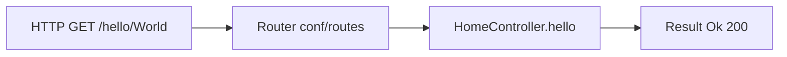
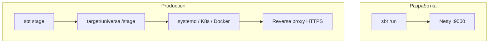
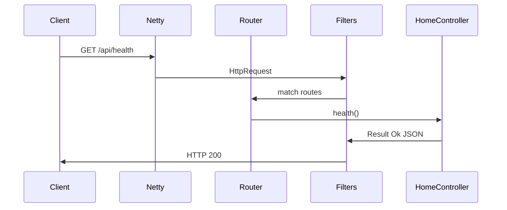
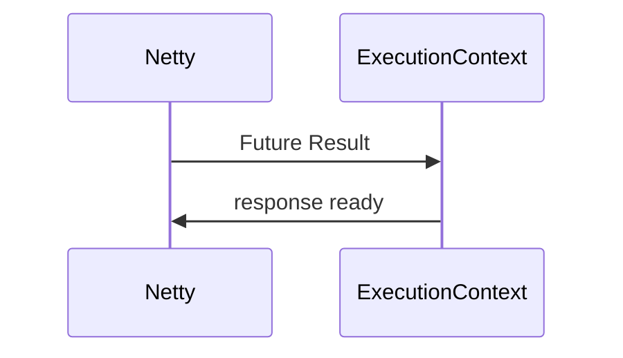
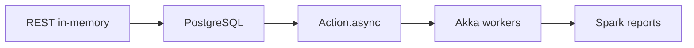

# Play Framework — первая программа

<div class="article-tags">
  <span class="tag tag-required">ОБЯЗАТЕЛЬНО</span>
</div>

<span class="complexity-badge">Разработчику</span>
<span class="complexity-badge">Архитектору</span>

**Дальше:** [Akka — основы](./212.md) · [Apache Spark на Scala](./213.md) · [Scala — о разделе](./intro.md)

---

## Play Framework — первая программа

**Play Framework** — веб-фреймворк для [JVM](/encyclopedia/2-system-network/2-01-operatsionnaya-sistema/415) (Scala и Java). Он строится на **реактивной модели**: асинхронные запросы, маршрутизация через конфигурацию, встроенный HTTP-сервер Netty. Для Scala это один из стандартных путей от консольных утилит к production REST и HTML-приложениям.

Практикум идёт **по шагам** — проверка JDK и **sbt**, генератор проекта, маршруты и контроллер, HTML через Twirl, затем учебное REST API "Заметки". Близкий стек на BEAM — [Phoenix](/encyclopedia/5-languages/5-19-elixir/104); акторная модель JVM — [Akka](./212.md).

| Шаг | Тема | Зачем |
|-----|------|-------|
| 1 | JDK, sbt | Убедиться, что среда готова |
| 2 | `sbt new` | Создать каркас проекта |
| 3 | `conf/routes` | Связать URL с action |
| 4 | Контроллер | Обработать HTTP-запрос |
| 5 | Twirl-шаблон | Отдать HTML |
| 6 | JSON API | REST без фронтенда |
| 7 | Тесты и production | Закрепить и подготовить деплой |

| Материал | Зачем |
|----------|-------|
| [Первая программа на Scala](./7.md) | Синтаксис и запуск |
| [Основы языка](./2.md) | case class, implicits |
| [sbt-проект](/encyclopedia/4-code-dev/4-04-proekt-i-freymvorki/104) | Сборка и зависимости |
| [HTTP как основа веб-интеграций](/encyclopedia/2-system-network/2-09-osnovy-integratsionnogo-vzaimodeystviya/118) | Методы, статусы, заголовки |
| [Scala — о разделе](./intro.md) | Маршрут по всему разделу |

### Навигация по экосистеме Scala

- Вы здесь: [Play Framework — первая программа](./211.md)
- Акторы и concurrency: [Akka — основы](./212.md)
- Big data: [Apache Spark на Scala](./213.md)
- Соседний стек: [Phoenix — первая программа](/encyclopedia/5-languages/5-19-elixir/104)

<div class="callout callout--tip">
  <div class="callout-title">Редактор и терминал</div>

  <div class="callout-body">
  Команды удобно выполнять во вкладке <strong>Терминал</strong> VS Code (<code>Ctrl+`</code>). Отладка JVM — <a href="/encyclopedia/4-code-dev/4-14-razrabotka-i-otladka/111">статья про отладку</a>.
</div>
</div>

---

## Термины перед стартом

| Термин | Кратко |
|--------|--------|
| **sbt** | Simple Build Tool — сборщик Scala/Java: зависимости, компиляция, запуск, тесты |
| **Action** | Обработчик одного HTTP-запроса в Play; возвращает `Result` (статус + тело) |
| **Twirl** | Шаблонизатор Play: `.scala.html` компилируется в типобезопасные Scala-функции |
| **Netty** | Асинхронный сетевой фреймворк; Play слушает порт через него |
| **DI (Guice)** | Внедрение зависимостей: `@Inject()` в контроллерах |

---

## Шаг 1 — проверка установки

| Компонент | Версия | Проверка |
|-----------|--------|----------|
| JDK | 17+ | `java -version` |
| sbt | 1.9+ | `sbt --version` |
| Scala | 3.x (в проекте) | см. `build.sbt` после генерации |

```bash
java -version
sbt --version
```

Разбор:

- Play 3.x требует **JDK 17** или новее; на Windows установите Temurin или Oracle JDK и проверьте `JAVA_HOME`.
- **sbt** скачивает нужную версию Scala при первом запуске проекта — глобально достаточно свежего sbt.
- Официальная документация: [playframework.com](https://www.playframework.com/documentation).

<div class="callout callout--info">
  <div class="callout-title">Windows и кодировка</div>

  <div class="callout-body">
  Сохраняйте исходники в UTF-8. В PowerShell для curl иногда удобнее Git Bash или Windows Terminal.
</div>
</div>

---

## Шаг 2 — создание проекта

Play поставляет генератор через sbt:

```bash
sbt new playframework/play-scala-seed.g8
```

На вопросы шаблона ответьте, например:

- `name` → `hello-play`
- `organization` → `com.example`
- `scala_version` → оставьте значение по умолчанию (3.x)

Структура минимального проекта:

```text
hello-play/
├── app/
│   ├── controllers/
│   │   └── HomeController.scala
│   └── views/
│       └── index.scala.html
├── conf/
│   ├── routes
│   └── application.conf
├── build.sbt
└── project/
    └── plugins.sbt
```

Запуск dev-сервера:

```bash
cd hello-play
sbt run
```

При первом запуске sbt скачает зависимости — это может занять несколько минут. Когда в консоли появится `(Ok)` и строка про порта 9000, откройте `http://localhost:9000` — должна появиться стартовая страница шаблона.

Остановка: `Ctrl+C` в терминале sbt.

### Что лежит в `build.sbt`

```scala
name := "hello-play"
organization := "com.example"
version := "1.0-SNAPSHOT"
scalaVersion := "3.3.5"

libraryDependencies += guice
```

**sbt** читает этот файл как Scala-DSL: здесь имя артеfact, версия Scala и плагины Play.

---

## Шаг 3 — маршруты (`conf/routes`)

Play связывает URL с **action** контроллера декларативно:

```text
# conf/routes
GET     /               controllers.HomeController.index()
GET     /hello/:name    controllers.HomeController.hello(name: String)
GET     /api/health     controllers.HomeController.health()
```

Правила:

- строка = метод HTTP + путь + вызов `Controller.action(params)`;
- `:name` — path-параметр, тип указывается явно;
- порядок маршрутов важен — более специфичные выше общих;
- после изменения `routes` Play в dev-режиме перекомпилирует проект автоматически.



---

## Шаг 4 — контроллер

```scala
// app/controllers/HomeController.scala
package controllers

import javax.inject._
import play.api.mvc._
import play.api.libs.json._

@Singleton
class HomeController @Inject() (val controllerComponents: ControllerComponents)
    extends BaseController {

  def index(): Action[AnyContent] = Action {
    Ok(views.html.index("Play + Scala"))
  }

  def hello(name: String): Action[AnyContent] = Action {
    Ok(s"Hello, $name!")
  }

  def health(): Action[AnyContent] = Action {
    Ok(Json.obj("status" -> "ok", "service" -> "hello-play"))
  }
}
```

Разбор:

- `@Singleton` + `@Inject()` — контроллер создаёт Guice один раз на приложение.
- `Action { ... }` — синхронный обработчик; для I/O позже используют `Action.async`.
- `Ok(...)` — ответ HTTP 200.
- `views.html.index(...)` — Twirl-шаблон из `app/views/`.
- `Json.obj` — встроенный Play JSON.

---

## Шаг 5 — представление (Twirl)

```html
@* app/views/index.scala.html *@
@(message: String)

<!DOCTYPE html>
<html lang="ru">
  <head>
    <meta charset="UTF-8">
    <title>@message</title>
  </head>
  <body>
    <h1>@message</h1>
    <p><a href="/hello/World">Проверить маршрут с параметром</a></p>
    <p><a href="/api/health">JSON health</a></p>
  </body>
</html>
```

Twirl компилируется в Scala-функции — опечатка в имени шаблона ловится на этапе сборки, а не в runtime. Файл `index.scala.html` → вызов `views.html.index`.

---

## Шаг 6 — REST API "Заметки"

Соберём учебное API по тому же сценарию, что в [Phoenix](/encyclopedia/5-languages/5-19-elixir/104) и [Node.js](/encyclopedia/5-languages/5-01-javascript/3-ecosystem/1-runtime-node/262.md): заметки хранятся **в памяти** (после перезапуска список пустой).

### Модель и JSON

```scala
// app/models/Note.scala
package models

import play.api.libs.json._

case class Note(id: Long, text: String)

object Note {
  implicit val format: OFormat[Note] = Json.format[Note]
}
```

### Контроллер заметок

```scala
// app/controllers/NotesController.scala
package controllers

import javax.inject._
import models.Note
import play.api.libs.json._
import play.api.mvc._
import scala.collection.mutable

@Singleton
class NotesController @Inject() (val controllerComponents: ControllerComponents)
    extends BaseController {

  private val store = mutable.ArrayBuffer.empty[Note]
  private var nextId = 1L

  def list(): Action[AnyContent] = Action {
    Ok(Json.toJson(store.toSeq))
  }

  def create(): Action[JsValue] = Action(parse.json) { request =>
    val text = (request.body \ "text").asOpt[String].map(_.trim).filter(_.nonEmpty)
    text match {
      case None =>
        BadRequest(Json.obj("error" -> "text is required"))
      case Some(value) =>
        val note = Note(nextId, value)
        nextId += 1
        store += note
        Created(Json.toJson(note))
    }
  }

  def delete(id: Long): Action[AnyContent] = Action {
    val idx = store.indexWhere(_.id == id)
    if (idx < 0) NotFound(Json.obj("error" -> "not found"))
    else {
      store.remove(idx)
      NoContent
    }
  }
}
```

### Маршруты API

```text
# conf/routes — добавить
GET     /api/notes           controllers.NotesController.list()
POST    /api/notes           controllers.NotesController.create()
DELETE  /api/notes/:id        controllers.NotesController.delete(id: Long)
```

### Проверка через curl

```bash
curl http://localhost:9000/api/health
curl http://localhost:9000/api/notes
curl -X POST http://localhost:9000/api/notes \
  -H "Content-Type: application/json" \
  -d "{\"text\": \"Изучить Play\"}"
curl http://localhost:9000/api/notes
curl -X DELETE http://localhost:9000/api/notes/1
```

| Метод | Путь | Успех | Ошибка |
|-------|------|-------|--------|
| GET | `/api/notes` | `200` + массив | — |
| POST | `/api/notes` | `201` + объект | `400` при пустом `text` |
| DELETE | `/api/notes/:id` | `204` | `404` если id не найден |

---

## Шаг 7 — конфигурация и production

### `conf/application.conf`

```hocon
play.server.http.port = 9000
play.filters.enabled += "play.filters.cors.CORSFilter"

play.filters.cors {
  allowedOrigins = ["http://localhost:5173"]
  allowedHttpMethods = ["GET", "POST", "DELETE", "OPTIONS"]
}
```

Для production секреты и строки БД выносят в переменные окружения — см. [конфигурации и данные](/encyclopedia/3-data-markup/3-04-konfiguratsii-i-dannye/1).

### Сборка и Docker

```bash
sbt stage
# или
sbt docker:publishLocal
```



<div class="callout callout--warning">
  <div class="callout-title">Production</div>

  <div class="callout-body">
  In-memory store теряется при перезапуске — подключите PostgreSQL через JDBC, Slick или Doobie. HTTPS — за Nginx или Caddy. Секреты — только из окружения, никогда в git.
</div>
</div>

---

## Архитектура запроса в Play



- **Endpoint** — цепочка фильтров (CSRF, CORS, логирование).
- **Router** — таблица из `conf/routes`.
- **Controller** — бизнес-логика; тяжёлые задачи лучше выносить в сервис или [Akka](./212.md).

---

## Тесты маршрутов

```scala
// test/controllers/HomeControllerSpec.scala
package controllers

import org.scalatestplus.play._
import play.api.test._
import play.api.test.Helpers._

class HomeControllerSpec extends PlaySpec with GuiceOneAppPerTest {

  "HomeController GET /" should {
    "return OK" in {
      val controller = app.injector.instanceOf[HomeController]
      val result = controller.index().apply(FakeRequest(GET, "/"))
      status(result) mustBe OK
    }
  }

  "NotesController POST /api/notes" should {
    "reject empty text" in {
      val controller = app.injector.instanceOf[NotesController]
      val request = FakeRequest(POST, "/api/notes")
        .withJsonBody(play.api.libs.json.Json.obj("text" -> ""))
      val result = controller.create().apply(request)
      status(result) mustBe BAD_REQUEST
    }
  }
}
```

```bash
sbt test
```

---

## Частые ошибки

| Симптом | Причина | Что сделать |
|---------|---------|-------------|
| `Compilation error` в routes | Неверное имя action или тип параметра | Сверить с сигнатурой метода контроллера |
| Порт 9000 занят | Другой экземпляр Play | `sbt -Dhttp.port=9001 run` |
| Шаблон не найден | Файл вне `app/views/` | `index.scala.html` → `views.html.index` |
| Медленный cold start | JVM + sbt | Нормально для dev; в prod — `sbt stage` |
| `req.body` пустой на POST | Нет `parse.json` | `Action(parse.json)` вместо `Action` |
| CORS в браузере | Фронт на другом порту | Настроить `play.filters.cors` |

---

## Сравнение с соседними стеками

| Фреймворк | Платформа | Когда выбирают |
|-----------|-----------|----------------|
| **Play** | JVM, Scala/Java | REST + SSR, reactive I/O |
| **Spring Boot** | JVM, Java | Enterprise, огромная экосистема |
| **Phoenix** | BEAM, Elixir | WebSocket, LiveView — [статья](/encyclopedia/5-languages/5-19-elixir/104) |
| **Rails** | Ruby | Быстрый CRUD — [Ruby](/encyclopedia/5-languages/5-11-ruby/21) |

Оба JVM- и BEAM-стека опираются на **сообщения и изоляцию** — у Scala это [Akka](./212.md), у Elixir — процессы OTP.

---

## Упражнения

1. Добавьте `GET /api/notes/:id` — одна заметка или `404`.
2. Подключите форму POST (Play Forms) для HTML-создания заметки.
3. Напишите тест на успешный `POST` с телом `{"text": "test"}`.
4. Вынесите `store` в отдельный класс `NoteRepository` и внедрите через Guice.
5. Сравните свой JSON API с [Phoenix REST](/encyclopedia/5-languages/5-19-elixir/104) — какие статусы совпадают?

---

## FAQ

**Play только для Scala?**
Нет, есть шаблон `play-java-seed`, но типобезопасные Twirl и JSON удобнее в Scala.

**Нужен ли Tomcat?**
Play встраивает Netty — отдельный servlet-контейнер для dev/prod не обязателен.

**Play и Akka — одно и то же?**
Play — HTTP-слой; [Akka](./212.md) — акторы и стримы. В Play 2.x была тесная связь; в Play 3 опираются на Pekko/Akka как на библиотеку по необходимости.

**Когда Spark вместо Play?**
[Spark](./213.md) — batch/stream big data на кластере, это другой класс задач.

---

## План эволюции учебного API

1. In-memory store для отладки маршрутов.
2. PostgreSQL + Evolutions или Flyway.
3. Единый формат ошибок JSON.
4. `Action.async` + thread pool для БД.
5. Логи, метрики, health-check для оркестратора.

---

## Middleware и фильтры

Play обрабатывает запрос **цепочкой фильтров** до контроллера. В `build.sbt` уже подключены CSRF, security headers и gzip.

### Логирование запросов

```scala
// app/filters/LoggingFilter.scala
package filters

import org.apache.pekko.stream.Materializer
import play.api.mvc._
import javax.inject._
import scala.concurrent.{ExecutionContext, Future}

@Singleton
class LoggingFilter @Inject() (implicit val mat: Materializer, ec: ExecutionContext)
    extends Filter {

  def apply(nextFilter: RequestHeader => Future[Result])(requestHeader: RequestHeader): Future[Result] = {
    val start = System.currentTimeMillis()
    nextFilter(requestHeader).map { result =>
      val ms = System.currentTimeMillis() - start
      println(s"${requestHeader.method} ${requestHeader.uri} -> ${result.header.status} (${ms}ms)")
      result
    }
  }
}
```

Регистрация в `conf/application.conf`:

```hocon
play.http.filters = "filters.LoggingFilter"
```

Разбор:

- `Filter` — аналог middleware в [Express](/encyclopedia/5-languages/5-01-javascript/3-ecosystem/1-runtime-node/263.md).
- `nextFilter` — следующий элемент цепочки; без вызова контроллер не выполнится.
- Фильтр возвращает `Future[Result]` — Play реактивен end-to-end.

---

## Форма POST и валидация

HTML-форма для создания заметки без JavaScript:

```scala
// app/controllers/NoteFormController.scala
package controllers

import javax.inject._
import play.api.data.Form
import play.api.data.Forms._
import play.api.mvc._

case class NoteFormData(text: String)

@Singleton
class NoteFormController @Inject() (val controllerComponents: ControllerComponents)
    extends BaseController {

  val form = Form(
    mapping("text" -> nonEmptyText(maxLength = 500))(NoteFormData.apply)(NoteFormData.unapply)
  )

  def showForm() = Action { implicit request =>
    Ok(views.html.noteForm(form))
  }

  def submit() = Action { implicit request =>
    form.bindFromRequest().fold(
      formWithErrors => BadRequest(views.html.noteForm(formWithErrors)),
      data => Redirect(routes.NoteFormController.showForm()).flashing("success" -> s"Сохранено: ${data.text}")
    )
  }
}
```

```html
@* app/views/noteForm.scala.html *@
@(noteForm: Form[controllers.NoteFormData])(implicit request: RequestHeader)

@helper.form(routes.NoteFormController.submit()) {
  @helper.CSRF.formField
  @helper.inputText(noteForm("text"), Symbol("_label") -> "Текст заметки")
  <button type="submit">Отправить</button>
}
```

Маршруты:

```text
GET     /notes/new        controllers.NoteFormController.showForm()
POST    /notes/new        controllers.NoteFormController.submit()
```

- `helper.CSRF.formField` — токен для `:browser` pipeline.
- `bindFromRequest` — парсинг `application/x-www-form-urlencoded`.
- Ошибки валидации возвращают ту же форму с сообщениями.

---

## Единый обработчик ошибок JSON

```scala
// app/controllers/JsonErrorHandler.scala
package controllers

import play.api.http.HttpErrorHandler
import play.api.libs.json.Json
import play.api.mvc._
import javax.inject._
import scala.concurrent._

@Singleton
class JsonErrorHandler @Inject() () extends HttpErrorHandler {

  def onClientError(request: RequestHeader, statusCode: Int, message: String): Future[Result] =
    Future.successful(
      Results.Status(statusCode)(Json.obj("error" -> message, "status" -> statusCode))
    )

  def onServerError(request: RequestHeader, exception: Throwable): Future[Result] = {
    exception.printStackTrace()
    Future.successful(
      Results.InternalServerError(Json.obj("error" -> "internal server error"))
    )
  }
}
```

```hocon
# conf/application.conf
play.http.errorHandler = "controllers.JsonErrorHandler"
```

Так клиент API всегда получает JSON, даже при 404/500 — удобно для SPA и mobile.

---

## Подключение PostgreSQL (обзор)

После in-memory store следующий шаг — **Evolutions** + JDBC:

```hocon
# conf/application.conf
db.default.driver = org.postgresql.Driver
db.default.url = "jdbc:postgresql://localhost:5430/notes"
db.default.username = "notes"
db.default.password = ${?DB_PASSWORD}
```

```sql
-- conf/evolutions/default/1.sql
# --- !Ups
CREATE TABLE note (
  id BIGSERIAL PRIMARY KEY,
  text TEXT NOT NULL,
  created_at TIMESTAMP DEFAULT NOW()
);

# --- !Downs
DROP TABLE note;
```

Play применит миграции при `sbt run`. Детали SQL — [первый проект SQL](/encyclopedia/3-data-markup/3-07-sql/101). ORM-слой — Slick или Doobie поверх того же JDBC.

---

## Деплой — чек-лист

| Шаг | Команда / действие |
|-----|-------------------|
| 1 | `sbt clean stage` |
| 2 | Проверить `target/universal/stage/bin/hello-play` |
| 3 | Передать `APPLICATION_SECRET`, `DB_PASSWORD` в env |
| 4 | За reverse proxy — только HTTP внутри, HTTPS снаружи |
| 5 | Health-check на `/api/health` для load balancer |

```bash
target/universal/stage/bin/hello-play \
  -Dhttp.port=9000 \
  -Dconfig.resource=prod.conf
```

На Kubernetes — liveness probe на `/api/health`, readiness после прогрева JVM.

---

## Расширенный FAQ

**Можно ли смешивать Scala 2 и 3 в одном Play-проекте?**
Play 3.x ориентирован на Scala 3; для legacy смотрите Play 2.8 + Scala 2.13.

**Как отдать static files?**
Каталог `public/` — файлы доступны по корню URL; для CDN в prod копируйте в object storage.

**Play и GraalVM native image?**
Экспериментально; типичный prod — JVM + `-XX:+UseContainerSupport`.

**Где concurrency после Play?**
Долгие фоновые задачи — [Akka](./212.md) actors или отдельный worker; Play Action должен быстро отдавать `Future`.

---

## Связанные материалы

| Тема | Материал |
|------|----------|
| Акторы на JVM | [Akka — основы](./212.md) |
| Big data | [Apache Spark на Scala](./213.md) |
| Phoenix на BEAM | [Phoenix — первая программа](/encyclopedia/5-languages/5-19-elixir/104) |
| Раздел Scala | [Scala — о разделе](./intro.md) |
| HTTP теория | [HTTP как основа веб-интеграций](/encyclopedia/2-system-network/2-09-osnovy-integratsionnogo-vzaimodeystviya/118) |

<div class="callout callout--tip">
  <div class="callout-title">Следующий шаг</div>

  <div class="callout-body">
  После REST изучите <a href="./212.md">Akka</a> — concurrency через сообщения. Для аналитики больших объёмов — <a href="./213.md">Spark</a>.
</div>
</div>

---

## Практикум — шаг 8: асинхронные Action

Синхронный `Action` блокирует поток Netty на время I/O. Для БД и внешних HTTP используйте **`Action.async`**:

```scala
import scala.concurrent.Future
import scala.concurrent.ExecutionContext.Implicits.global

def slowHealth(): Action[AnyContent] = Action.async {
  Future {
    Ok(Json.obj("status" -> "ok"))
  }
}
```

| Шаг | Действие | Проверка |
|-----|----------|----------|
| 1 | Вынести store в `NoteService` | `sbt compile` |
| 2 | `listAsync` через `Future` | `curl /api/notes` |
| 3 | Тест `NotesRouteSpec` с `route()` | `sbt test` |



### Сервисный слой

```scala
trait NoteService {
  def list(): Future[Seq[Note]]
  def create(text: String): Future[Either[String, Note]]
}
```

Контроллер только мапит `Either` в HTTP — как Context в [Phoenix](/encyclopedia/5-languages/5-19-elixir/104).

---

## Практикум — шаг 9: единый JSON ошибок

```scala
case class ApiError(error: String, code: String)
object ApiError {
  implicit val format: OFormat[ApiError] = Json.format[ApiError]
  def badRequest(msg: String) = ApiError(msg, "bad_request")
}
```

| HTTP | code | Случай |
|------|------|--------|
| 400 | bad_request | Пустой text |
| 404 | not_found | DELETE без id |
| 500 | internal | Exception |

<div class="callout callout--warning">
  <div class="callout-title">Один формат</div>
  <div class="callout-body">Все endpoints API должны возвращать ошибки в одной JSON-схеме — иначе клиент пишет несколько парсеров.</div>
</div>

---

## Практикум — шаг 10: интеграционные тесты

```scala
class NotesRouteSpec extends PlaySpec with GuiceOneAppPerSuite {
  "POST /api/notes" should {
    "create note" in {
      val req = FakeRequest(POST, "/api/notes")
        .withJsonBody(Json.obj("text" -> "test"))
      val res = route(app, req).get
      status(res) mustBe CREATED
    }
  }
}
```

```bash
sbt "testOnly controllers.NotesRouteSpec"
```

---

## Практикум — шаг 11: Docker и health-check

```dockerfile
FROM eclipse-temurin:17-jre
COPY target/universal/stage /app
EXPOSE 9000
CMD ["bin/hello-play", "-Dhttp.port=9000"]
```

```yaml
livenessProbe:
  httpGet:
    path: /api/health
    port: 9000
  initialDelaySeconds: 60
```

JVM прогревается дольше Node — не занижайте `initialDelaySeconds`.

---

## Сквозной воркшоп за 60 минут

| Мин | Задача |
|-----|--------|
| 0–10 | `sbt new playframework/play-scala-seed.g8` |
| 10–20 | Health + routes |
| 20–35 | NotesController in-memory |
| 35–45 | curl POST/GET/DELETE |
| 45–55 | `NotesRouteSpec` |
| 55–60 | CORS для :5173 |

**Критерии:** POST 201, пустой text 400, DELETE 404, тест зелёный.

---

## Отладка — сценарии

| Симптом | Шаг 1 | Шаг 2 | Шаг 3 |
|---------|-------|-------|-------|
| 404 route | `conf/routes` | HTTP-метод | `sbt compile` |
| Пустой JSON POST | `parse.json` | Content-Type | тело curl |
| Порт занят | `netstat` | `-Dhttp.port=9001` | kill процесс |
| Twirl error | `app/views/` | сигнатура `@()` | имя `views.html.*` |
| CORS в браузере | `play.filters.cors` | allowedOrigins | OPTIONS |

### PowerShell и curl

```powershell
$body = '{"text":"test"}'
Invoke-RestMethod -Uri http://localhost:9000/api/notes -Method POST -Body $body -ContentType "application/json"
```

Или сохраните тело в `body.json` и `curl -d @body.json`.

---

## Дополнительные упражнения

6. `GET /api/notes/:id` — 200 или 404.
7. `PATCH /api/notes/:id` — обновление text.
8. `GET /api/notes?limit=10&offset=0` — пагинация.
9. `LoggingFilter` — время запроса в мс.
10. Таблица Play / Phoenix — маршруты, store, тесты.

<details>
<summary>Подсказка: PATCH</summary>

```scala
def update(id: Long): Action[JsValue] = Action(parse.json) { request =>
  val text = (request.body \ "text").asOpt[String].map(_.trim).filter(_.nonEmpty)
  // найти в store, заменить text или NotFound
}
```

</details>

---

## Расширенный FAQ

**Query-параметры?** — `def search(q: Option[String])` в action.

**Версия API `/v1/`?** — префикс в routes или отдельный модуль.

**Play 3 и Scala 3?** — см. migration guide на playframework.com.

**Статика?** — каталог `public/`.

**Swagger?** — `play-swagger` или `openapi.yaml`.

**Сессия?** — cookie; JWT — фильтр на `Authorization`.

**Логировать body?** — только dev, без PII.

**После Play?** — [Akka](./212.md), [Spark](./213.md).

**Тесты без сервера?** — `route(app, FakeRequest)` достаточно для routes.

**Guice модуль?** — `class Module extends AbstractModule` для `NoteService`.

**Эволюции БД?** — `conf/evolutions` + JDBC.

**Reverse proxy?** — Nginx/Caddy перед Play, HTTPS снаружи.

**Метрики?** — Micrometer, Prometheus endpoint.

**WebSocket?** — отдельный API; сравните [Phoenix Channels](/encyclopedia/5-languages/5-19-elixir/104).

---

## Глоссарий (расширенный)

| Термин | Определение |
|--------|-------------|
| Action | Обработчик HTTP-запроса |
| BodyParser | Разбор тела: json, form, raw |
| Result | Статус + заголовки + тело |
| Stage | Standalone после `sbt stage` |
| Evolutions | SQL-миграции Play |
| Filter | Middleware до контроллера |
| Pekko | Fork Akka в Play 3 |

---

## Маршрут обучения



<div class="callout callout--tip">
  <div class="callout-title">Smoke-тест</div>
  <div class="callout-body">Сохраните curl-скрипт проверки API — пригодится при переходе на БД и async.</div>
</div>

---

---

## Учебный проект: NoteRepository и Guice

### Интерфейс

```scala
trait NoteRepository {
  def all(): Future[Seq[Note]]
  def insert(text: String): Future[Note]
  def delete(id: Long): Future[Boolean]
}
```

### In-memory реализация

```scala
@Singleton
class InMemoryNoteRepository @Inject() (implicit ec: ExecutionContext)
    extends NoteRepository {
  private var data = Vector.empty[Note]
  private var nextId = 1L
  def all() = Future.successful(data)
  def insert(text: String) = Future {
    val n = Note(nextId, text.trim); nextId += 1; data :+= n; n
  }
  def delete(id: Long) = Future {
    val b = data.size; data = data.filterNot(_.id == id); data.size < b
  }
}
```

### Module

```scala
class Module extends AbstractModule {
  override def configure(): Unit =
    bind(classOf[NoteRepository]).to(classOf[InMemoryNoteRepository])
}
```

```hocon
play.modules.enabled += "Module"
```

---

## JDBC в Future (обзор)

```scala
Future {
  blocking {
    // JDBC — только здесь
  }
}
```

Для production: Slick, Doobie. Фоновые задачи — [Akka](./212.md).

---

## Чек-лист code review

- [ ] Секреты не в git
- [ ] JSON ошибок единообразен
- [ ] Route-тесты
- [ ] CORS явный
- [ ] Health для LB

---

---

## Дополнительные практические сценарии (Play)

### Сценарий A: первый запуск на Windows

| Шаг | Команда | Ожидаемый вывод |
|-----|---------|-----------------|
| 1 | `java -version` | 17+ |
| 2 | `sbt --version` | 1.9+ |
| 3 | `sbt new playframework/play-scala-seed.g8` | шаблон создан |
| 4 | `cd hello-play && sbt run` | `(Ok)` порт 9000 |
| 5 | Браузер `localhost:9000` | стартовая страница |

<div class="callout callout--info">
  <div class="callout-title">Windows</div>
  <div class="callout-body">При ошибке кодировки в PowerShell сохраняйте файлы UTF-8 и используйте Windows Terminal.</div>
</div>

### Сценарий B: отладка 404 на API

1. Проверьте `conf/routes` — строка `GET /api/notes`.
2. `sbt compile` — нет ошибок в routes.
3. `curl -v http://localhost:9000/api/notes` — смотрите статус.
4. Лог Play: уровень DEBUG для router при необходимости.

### Сценарий C: smoke-тест скрипт

```bash
#!/bin/sh
set -e
BASE=http://localhost:9000
curl -sf "$BASE/api/health"
curl -sf "$BASE/api/notes" | grep '\[\]'
curl -sf -X POST "$BASE/api/notes" -H 'Content-Type: application/json' -d '{"text":"smoke"}'
curl -sf "$BASE/api/notes" | grep smoke
echo OK
```

### Сценарий D: переход на PostgreSQL

| Шаг | Файл | Действие |
|-----|------|----------|
| 1 | `1.sql` evolutions | CREATE TABLE note |
| 2 | `application.conf` | db.default.url |
| 3 | Repository | JDBC в Future+blocking |
| 4 | Тест | Testcontainers Postgres |

### Сценарий E: сравнение с Phoenix

Заполните после прохождения [Phoenix REST](/encyclopedia/5-languages/5-19-elixir/104):

| Элемент | Play | Phoenix |
|---------|------|---------|
| Маршруты | conf/routes | router.ex |
| Store | ArrayBuffer / Repo | Agent / Ecto |
| Тест | route(app, req) | ConnCase |

---

## FAQ — эксплуатация Play

**Как уменьшить cold start JVM?**
Используйте `sbt stage`, CDS (Class Data Sharing), достаточный heap в контейнере.

**Как логировать request id?**
Filter с `X-Request-Id` в MDC (Logback).

**Как ограничить rate API?**
Filter или API gateway перед Play.

**Как отдать OpenAPI?**
`play-swagger` или статический `openapi.yaml` в public.

---

## Упражнения — контрольная точка

16. Реализуйте `NoteRepository` с JDBC и Evolutions.
17. Напишите smoke-скрипт из сценария C.
18. Добавьте `PATCH` обновление текста заметки.
19. Покройте `PATCH` route-тестом.
20. Задокументируйте коды ошибок `ApiError` в README.

<details>
<summary>Критерии 16–20</summary>

- После перезапуска данные в Postgres сохраняются
- smoke.sh exit 0 на чистой БД
- PATCH 200 с новым text, 404 для несуществующего id
- README содержит таблицу HTTP кодов

</details>
