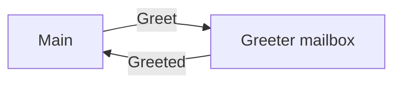
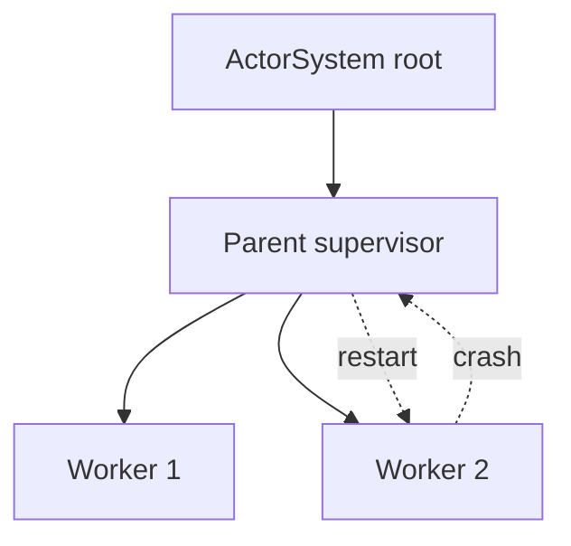
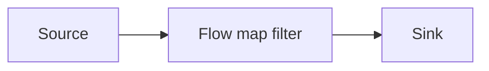

# Akka — основы

<div class="article-tags">
  <span class="tag tag-required">ОБЯЗАТЕЛЬНО</span>
</div>

<span class="complexity-badge">Разработчику</span>
<span class="complexity-badge">Архитектору</span>

**Дальше:** [Apache Spark на Scala](./213.md) · [Play Framework](./211.md) · [Phoenix (BEAM)](/encyclopedia/5-languages/5-19-elixir/104)

---

## Akka — основы

**Akka** реализует **модель акторов** на JVM: изолированные сущности обмениваются **неизменяемыми сообщениями**, состояние между акторами через общую память не передаётся. Это фундамент отказоустойчивых систем в Scala — от микросервисов до стриминга данных.

Практикум идёт **по шагам** — зависимости sbt, первый typed-актор, `ActorSystem`, supervision, счётчик с функциональным состоянием, worker pool и краткий обзор Akka Streams.

> **Примечание.** Коммерческая ветка Akka с 2022 года изменила лицензию; open-source форк **Apache Pekko** сохраняет совместимый API. В учебных примерах ниже — классические концепции Akka/Pekko.

| Шаг | Тема | Зачем |
|-----|------|-------|
| 1 | Зависимости sbt | Подключить akka-actor-typed |
| 2 | Greeter-актор | Отправить и получить сообщение |
| 3 | ActorSystem | Корень иерархии и shutdown |
| 4 | Supervision | Перезапуск при ошибке |
| 5 | Counter | Состояние без `var` в heap |
| 6 | Worker pool | Распределение задач |
| 7 | Streams | Pipeline с backpressure |

| Материал | Зачем |
|----------|-------|
| [Типы и pattern matching](./4.md) | sealed trait, case class |
| [Архитектура JVM-приложений](./3.md) | Потоки, heap, GC |
| [Play Framework](./211.md) | HTTP-слой поверх JVM |
| [Elixir — о разделе](/encyclopedia/5-languages/5-19-elixir/intro) | OTP и BEAM — родственная идея |
| [Phoenix](/encyclopedia/5-languages/5-19-elixir/104) | Веб на процессах BEAM |

### Навигация по экосистеме Scala

- HTTP и REST: [Play Framework — первая программа](./211.md)
- Вы здесь: [Akka — основы](./212.md)
- Big data: [Apache Spark на Scala](./213.md)
- Раздел: [Scala — о разделе](./intro.md)

<div class="callout callout--info">
  <div class="callout-title">Akka и Elixir OTP</div>

  <div class="callout-body">
  И Akka, и <strong>BEAM</strong> решают concurrency через <strong>сообщения</strong>. На JVM процессы тяжелее, чем на BEAM, зато Scala даёт статическую типизацию протокола сообщений. Сравните с <a href="/encyclopedia/5-languages/5-19-elixir/104">Phoenix</a> после этого практикума.
</div>
</div>

---

## Термины перед стартом

| Термин | Кратко |
|--------|--------|
| **Актор (actor)** | Изолированная сущность с очередью сообщений (mailbox) и поведением |
| **ActorSystem** | Корень дерева акторов, пул потоков, конфигурация, lifecycle |
| **Behavior** | Функция `(Context, Message) => Behavior` — как актор реагирует |
| **Supervision** | Родитель решает, перезапустить ли упавшего потомка |
| **Mailbox** | Очередь входящих сообщений; обработка по одному за раз |
| **Ask (`?`)** | Запрос с ожиданием ответа (Future); внутри актора использовать осторожно |

---

## Шаг 1 — проект и зависимости

Создайте каталог `akka-hello` и файл `build.sbt`:

```scala
name := "akka-hello"
version := "0.1"
scalaVersion := "2.13.14"

val akkaVersion = "2.8.5"

libraryDependencies ++= Seq(
  "com.typesafe.akka" %% "akka-actor-typed" % akkaVersion,
  "com.typesafe.akka" %% "akka-stream"        % akkaVersion,
  "org.scalatest"     %% "scalatest"          % "3.2.19" % Test
)
```

Для **Apache Pekko** замените groupId на `org.apache.pekko` и artifact `pekko-*`.

```bash
sbt run
```

**sbt** — тот же сборщик, что и в [Play](./211.md): `run` ищет объект с `App` или метод `main`.

---

## Шаг 2 — первый актор (Akka Typed)

Typed API фиксирует протокол сообщений на уровне типов — опечатка в `!` ловится компилятором.

```scala
// src/main/scala/Greeter.scala
import akka.actor.typed._
import akka.actor.typed.scaladsl._

object Greeter {
  sealed trait Command
  case class Greet(name: String, replyTo: ActorRef[Greeted]) extends Command
  case class Greeted(from: String, message: String)

  def apply(): Behavior[Command] =
    Behaviors.receive { (context, message) =>
      message match {
        case Greet(name, replyTo) =>
          context.log.info(s"Hello, $name")
          replyTo ! Greeted("greeter", s"Hello, $name")
          Behaviors.same
      }
    }
}
```

Разбор:

- `sealed trait Command` — закрытый набор сообщений для этого актора.
- `replyTo ! Greeted(...)` — оператор `!` отправляет сообщение в mailbox другого актора.
- `Behaviors.same` — поведение без смены состояния.



---

## Шаг 3 — ActorSystem и запуск

```scala
// src/main/scala/Main.scala
import akka.actor.typed.scaladsl.AskPattern._
import akka.actor.typed.scaladsl.Behaviors
import akka.actor.typed.{ActorRef, ActorSystem}
import akka.util.Timeout
import scala.concurrent.Await
import scala.concurrent.duration._

object Main extends App {
  implicit val system: ActorSystem[Greeter.Command] =
    ActorSystem(Greeter(), "hello-system")
  implicit val ec = system.executionContext
  implicit val timeout: Timeout = 3.seconds

  import Greeter._

  val greeter: ActorRef[Command] = system.ref

  val result = greeter.ask(Greet("Scala", _))
  println(Await.result(result, timeout.duration))

  system.terminate()
}
```

- `ActorSystem(Greeter(), "hello-system")` — поднимает корневой актор и потоки.
- `ask` — pattern request-response; возвращает `Future[Greeted]`.
- `system.terminate()` — корректное завершение (важно в тестах и prod).

<div class="callout callout--warning">
  <div class="callout-title">Блокировка внутри актора</div>

  <div class="callout-body">
  Не вызывайте <code>Await.result</code> и <code>Thread.sleep</code> внутри <code>Behaviors.receive</code> — mailbox других сообщений будет голодать. <code>ask</code> снаружи актора допустим для учебного <code>main</code>.
</div>
</div>

---

## Шаг 4 — иерархия и supervision

```scala
import akka.actor.typed.SupervisorStrategy

val supervisedGreeter = Behaviors.supervise(Greeter())
  .onFailure[Exception](SupervisorStrategy.restart)
```

Стратегии:

| Стратегия | Поведение |
|-----------|-----------|
| `restart` | Новый актор, mailbox может быть сброшен |
| `resume` | Продолжить после ошибки |
| `stop` | Остановить актор |
| `escalate` | Передать ошибку родителю |



Это реализация **let it crash** — ошибки локализуются, система восстанавливается на уровне дерева акторов. На BEAM ту же философию несёт OTP — см. [Elixir intro](/encyclopedia/5-languages/5-19-elixir/intro).

---

## Шаг 5 — счётчик с функциональным состоянием

Состояние хранится в параметре `Behavior`, без `var` в shared memory:

```scala
object Counter {
  sealed trait Command
  case object Increment extends Command
  case class Get(replyTo: ActorRef[Int]) extends Command

  def apply(): Behavior[Command] = counter(0)

  def counter(n: Int): Behavior[Command] =
    Behaviors.receiveMessage {
      case Increment =>
        counter(n + 1)
      case Get(replyTo) =>
        replyTo ! n
        Behaviors.same
    }
}
```

Проверка из `Main`:

```scala
val counter = system.systemActorOf(Counter(), "counter")
counter ! Counter.Increment
counter ! Counter.Increment
val value = counter.ask(Counter.Get(_))
println(Await.result(value, timeout.duration)) // 2
```

Каждый `Increment` возвращает **новое** поведение `counter(n + 1)` — immutability на уровне модели.

---

## Шаг 6 — worker pool (полный пример)

```scala
object WorkerPool {
  sealed trait Command
  case class Task(id: Int, payload: String)
  case class Result(id: Int, output: String)
  case class Submit(task: Task, replyTo: ActorRef[Result]) extends Command

  def router(workers: Vector[ActorRef[Task]]): Behavior[Command] =
    Behaviors.setup { context =>
      var idx = 0
      Behaviors.receiveMessage {
        case Submit(task, replyTo) =>
          val worker = workers(idx)
          idx = (idx + 1) % workers.size
          worker ! task
          // упрощение: worker шлёт Result напрямую replyTo
          Behaviors.same
      }
    }

  object Worker {
    def apply(): Behavior[Task] =
      Behaviors.receiveMessage { task =>
        // имитация работы
        Behaviors.same
      }
  }
}
```

Схема:

```text
        Router
       /  |  \
   W1   W2   W3    ← workers обрабатывают Task
```

- **Router** принимает `Submit` и распределяет round-robin.
- **Worker** выполняет задачу, шлёт `Result` клиенту.
- При падении worker — supervisor перезапускает только его ветку.

---

## Шаг 7 — Akka Streams

Для pipeline данных между акторами и внешними системами:

```scala
import akka.stream.scaladsl._
import akka.NotUsed

object StreamDemo extends App {
  implicit val system = ActorSystem(Behaviors.empty, "streams")
  implicit val ec = system.executionContext

  val source: Source[Int, NotUsed] = Source(1 to 100)
  val flow = Flow[Int].map(_ * 2).filter(_ % 3 == 0)
  val sink = Sink.foreach(println)

  source.via(flow).runWith(sink)
  system.terminate()
}
```

- **Source** — производитель данных.
- **Flow** — трансформация с backpressure.
- **Sink** — потребитель.

Streams интегрируются с Kafka, HTTP и [Spark](./213.md) через коннекторы (Alpakka).



---

## Конфигурация `application.conf`

Положите файл в `src/main/resources/application.conf`:

```hocon
akka {
  loglevel = "INFO"
  actor {
    default-dispatcher {
      fork-join-executor {
        parallelism-min = 2
        parallelism-max = 8
      }
    }
  }
}
```

Пулы потоков и mailbox настраиваются без изменения кода акторов.

---

## Сравнение Akka и Elixir OTP

| Аспект | Akka (JVM) | Elixir (BEAM) |
|--------|------------|---------------|
| Единица | Актор на JVM heap | Лёгкий процесс |
| Изоляция | Логическая, heap общий | Heap per process |
| Hot code reload | Ограничено | Сильная сторона OTP |
| Типизация | Scala types | Dynamic + `@spec` |
| Веб-слой | [Play](./211.md), Akka HTTP | [Phoenix](/encyclopedia/5-languages/5-19-elixir/104) |

Оба стека решают **concurrency через сообщения**.

---

## Частые ошибки

| Ошибка | Последствие | Что сделать |
|--------|-------------|-------------|
| `Await` внутри актора | Starvation mailbox | Вынести в `Future`, ответ — сообщением |
| Shared mutable state | Race conditions | Только сообщения между акторами |
| Слишком мелкие акторы | Overhead сообщений | Группировать связанную логику |
| Игнор supervision | Падение всего процесса | `Behaviors.supervise` на границах |
| `ask` без timeout | Зависший Future | Всегда задавать `Timeout` |

Правило: **внутри актора — только быстрая логика**; тяжёлую работу выносите в `Future` с возвратом результата сообщением.

---

## Production-сценарии

| Сценарий | Компонент Akka |
|----------|----------------|
| REST поверх акторов | Akka HTTP / Pekko HTTP |
| Шардирование state | Cluster Sharding |
| Очереди событий | Akka Streams + Kafka |
| Пersistence | Event Sourcing, Akka Persistence |

HTTP для пользователей часто остаётся в [Play](./211.md); внутренние сервисы — на акторах. Batch-аналитика — [Spark](./213.md).

<div class="callout callout--warning">
  <div class="callout-title">Production</div>

  <div class="callout-body">
  Мониторинг: Kamon, Micrometer. Cluster — минимум три узла для quorum. Логируйте correlation id в сообщениях. Тестируйте supervision через <code>TestKit</code> / <code>ActorTestKit</code>.
</div>
</div>

---

## Упражнения

1. Добавьте актор `Logger`, которому Greeter шлёт копию каждого приветствия.
2. Реализуйте `Decrement` и `Set(n)` в Counter.
3. Напишите тест: после трёх `Increment` `Get` возвращает 3.
4. Постройте Stream из файла построчно (`FileIO.fromPath`) и посчитайте строки с `ERROR`.
5. Прочитайте [Phoenix Endpoint](/encyclopedia/5-languages/5-19-elixir/104) и выпишите три параллели с `ActorSystem`.

---

## FAQ

**Актор — это поток ОС?**
Нет. Актор — сущность приложения с mailbox; на пул потоков dispatcher мапит множество акторов.

**Typed или Classic API?**
Для новых проектов — **Typed** (`akka-actor-typed`). Classic (`akka-actor`) встречается в legacy.

**Pekko или Akka?**
Pekko — Apache fork с открытой лицензией; API почти совпадает. Проверьте политику компании.

**Когда нужен Spark, а когда Akka?**
[Spark](./213.md) — распределённые SQL/ETL на кластере. Akka — long-running сервисы, стримы событий, stateful actors.

---

## Полный worker pool — код

```scala
// Worker.scala
object Worker {
  sealed trait Command
  case class Work(taskId: Int, data: String, replyTo: ActorRef[WorkResult]) extends Command
  case class WorkResult(taskId: Int, workerName: String, output: String)

  def apply(name: String): Behavior[Command] =
    Behaviors.receive { (context, msg) =>
      msg match {
        case Work(taskId, data, replyTo) =>
          context.log.info(s"$name processing task $taskId")
          replyTo ! WorkResult(taskId, name, data.toUpperCase)
          Behaviors.same
      }
    }
}

// Router.scala
object Router {
  sealed trait Command
  case class Submit(taskId: Int, data: String, replyTo: ActorRef[Worker.WorkResult]) extends Command

  def apply(workerCount: Int): Behavior[Command] =
    Behaviors.setup { context =>
      val workers = (1 to workerCount).map { i =>
        context.spawn(Worker(s"worker-$i"), s"worker-$i")
      }.toVector

      var idx = 0
      Behaviors.receiveMessage {
        case Submit(taskId, data, replyTo) =>
          val worker = workers(idx)
          idx = (idx + 1) % workers.size
          worker ! Worker.Work(taskId, data, replyTo)
          Behaviors.same
      }
    }
}
```

Запуск из `Main`:

```scala
val router = system.systemActorOf(Router(3), "router")
val f1 = router.ask(Router.Submit(1, "hello", _))
val f2 = router.ask(Router.Submit(2, "akka", _))
println(Await.result(f1, timeout.duration))
println(Await.result(f2, timeout.duration))
```

Каждый worker — отдельный актор с mailbox; router не хранит shared `var` state кроме индекса round-robin внутри одного актора (безопасно).

---

## Тестирование с ActorTestKit

```scala
// test/scala/GreeterSpec.scala
import org.scalatest.wordspec.AnyWordSpec
import akka.actor.testkit.typed.scaladsl.ActorTestKit
import akka.actor.testkit.typed.scaladsl.TestProbe
import Greeter._

class GreeterSpec extends AnyWordSpec {
  val testKit = ActorTestKit()

  "Greeter" should {
    "reply with Greeted" in {
      val probe = testKit.createTestProbe[Greeted]()
      val greeter = testKit.spawn(Greeter())
      greeter ! Greet("Test", probe.ref)
      probe.expectMessage(Greeted("greeter", "Hello, Test"))
    }
  }

  testKit.shutdownTestKit()
}
```

- `TestProbe` — тестовый актор с очередью ожидания сообщений.
- `expectMessage` — таймаут и падение теста при несовпадении.

---

## Ask pattern и back-pressure

Когда клиенту нужен ответ, используют **ask**:

```scala
import akka.actor.typed.scaladsl.AskPattern._
import akka.util.Timeout

implicit val timeout: Timeout = 3.seconds
val future: Future[Int] = counter.ask(Counter.Get(_))
```

Внутри production-актора **избегайте ask на себя** — deadlock. Предпочитайте fire-and-forget `!` и отдельный reply channel.

Для потоков высокого объёма — [Akka Streams](#шаг-7--akka-streams) с explicit backpressure вместо unbounded mailbox.

---

## Cluster и remoting (обзор)

```hocon
akka {
  actor.provider = cluster
  remote.artery {
    canonical.hostname = "127.0.0.1"
    canonical.port = 2551
  }
  cluster.seed-nodes = ["akka://HelloSystem@127.0.0.1:2551"]
}
```

```scala
ClusterSharding(system).init(
  Entity(typeKey = TypeKey) { entityContext =>
    Counter(entityContext.entityId)
  }
)
```

**Cluster Sharding** распределяет акторы по узлам по ключу entity — паттерн для миллионов session/stateful entities. HTTP-фасад — Akka HTTP или [Play](./211.md).

---

## Связь с Spark и Play

| Слой | Технология | Пример |
|------|------------|--------|
| HTTP API | Play | REST для пользователей |
| Event processing | Akka Streams | Kafka → transform → sink |
| Batch analytics | Spark | [213.md](./213.md) nightly reports |
| Realtime UI | Phoenix на BEAM | [104](/encyclopedia/5-languages/5-19-elixir/104) |

Akka связывает online-сервисы; Spark — offline. Не запускайте SparkSession внутри актора.

---

## Расширенный FAQ

**Сколько акторов на одном JVM?**
Миллионы лёгких акторов возможны; ограничение — память mailbox и GC. Профилируйте.

**Чем Typed лучше Classic?**
Компилятор проверяет протокол; меньше `ActorRef[Any]` и runtime ClassCast.

**Pekko migration?**
Замена пакетов `akka.*` → `org.apache.pekko.*` и зависимостей; скрипты есть в документации Pekko.

**Akka Persistence?**
Event sourcing + snapshots для durable state; сложнее Counter, но нужен для banking-grade.

---

## Связанные материалы

| Тема | Материал |
|------|----------|
| HTTP на Scala | [Play Framework — первая программа](./211.md) |
| Big data | [Apache Spark на Scala](./213.md) |
| BEAM и Phoenix | [Phoenix](/encyclopedia/5-languages/5-19-elixir/104), [Elixir intro](/encyclopedia/5-languages/5-19-elixir/intro) |
| Архитектура JVM | [Архитектура JVM-приложений](./3.md) |
| Раздел Scala | [Scala — о разделе](./intro.md) |

<div class="callout callout--tip">
  <div class="callout-title">Следующий шаг</div>

  <div class="callout-body">
  Для batch-обработки больших таблиц переходите к <a href="./213.md">Apache Spark</a>. Для сравнения с BEAM — <a href="/encyclopedia/5-languages/5-19-elixir/104">Phoenix</a>.
</div>
</div>

---

---

## Практикум — шаг 8: Greeter + TestProbe

```scala
class GreeterSpec extends AnyWordSpec {
  val kit = ActorTestKit()
  "Greeter" should {
    "reply" in {
      val probe = kit.createTestProbe[Greeter.Greeted]()
      kit.spawn(Greeter()) ! Greeter.Greet("T", probe.ref)
      probe.expectMessage(Greeter.Greeted("greeter", "Hello, T"))
    }
  }
  kit.shutdownTestKit()
}
```

---

## Практикум — шаг 9: TimerScheduler

```scala
Behaviors.withTimers { timers =>
  timers.startSingleTimer(Tick, 5.seconds)
  Behaviors.receiveMessage { case Tick => Behaviors.same }
}
```

---

## Практикум — шаг 10: FileIO Stream

```scala
FileIO.fromPath(path)
  .via(Framing.delimiter(ByteString("\n"), 4096))
  .map(_.utf8String)
  .filter(_.contains("ERROR"))
  .runWith(Sink.fold(0)((n, _) => n + 1))
```

---

## Воркшоп worker pool (45 мин)

| Мин | Задача |
|-----|--------|
| 0–10 | Worker + Router |
| 10–20 | ask Submit |
| 20–30 | Supervisor |
| 30–40 | Тест |
| 40–45 | Stream ERROR count |

---

## Troubleshooting (расширенный)

| Симптом | Решение |
|---------|---------|
| Dead letter | lifecycle / stop |
| ask timeout | Timeout, replyTo |
| OOM mailbox | Streams backpressure |
| Serialization | CBOR / protobuf |

---

## FAQ дополнительный

**spawn vs systemActorOf?** — дочерний vs system level.

**Cluster на одной JVM?** — не нужен.

**Akka HTTP vs Play?** — лёгкий REST vs полный стек.

**Pipe pattern?** — Future → сообщение себе.

**Pekko?** — замена groupId на org.apache.pekko.

---

---

## Дополнительные практические сценарии (Akka)

### Сценарий A: минимальный typed проект

```bash
mkdir akka-lab && cd akka-lab
# создайте build.sbt из шага 1 статьи
sbt run
```

### Сценарий B: счётчик с ask

```scala
val c = system.systemActorOf(Counter(), "c")
c ! Counter.Increment
c ! Counter.Increment
val v = c.ask(Counter.Get(_))
```

Ожидание: `2` после двух Increment.

### Сценарий C: supervision при падении

```scala
Behaviors.supervise(Worker()).onFailure[Exception](SupervisorStrategy.restart)
```

Отправьте Task, вызывающий exception — worker перезапустится.

### Сценарий D: stream подсчёта ERROR

Создайте `app.log` с 3 строками ERROR, запустите FileIO pipeline — вывод `3`.

### Сценарий E: сравнение с BEAM

| Идея | Akka | Elixir |
|------|------|--------|
| Изоляция | mailbox | process heap |
| Restart | supervisor | Supervisor OTP |
| Веб | Play / Akka HTTP | Phoenix |

---

## FAQ — эксплуатация Akka

**Как graceful shutdown?**
`CoordinatedShutdown` и `system.terminate()`.

**Как тестировать без sleep?**
`TestProbe`, `expectMessage`, не `Thread.sleep`.

**Когда Cluster Sharding?**
Миллионы session/state entity по ключу.

---

## Упражнения — контрольная точка

11. Logger-актор получает копию каждого Greet.
12. Stream: слова длиннее 5 символов из файла.
13. Timer: Tick каждые 2 секунды, 5 раз, затем stop.
14. Тест supervision restart.
15. Таблица параллелей с OTP из [Elixir intro](/encyclopedia/5-languages/5-19-elixir/intro).
