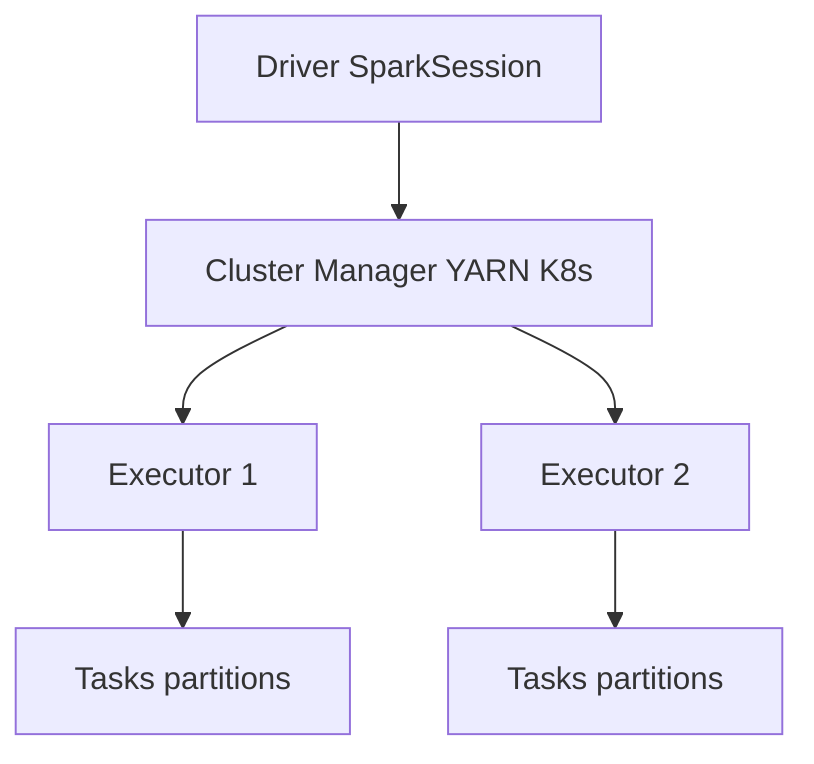
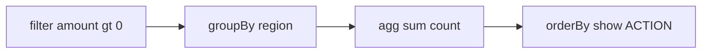

# Apache Spark на Scala — обзор

<div class="article-tags">
  <span class="tag tag-required">ОБЯЗАТЕЛЬНО</span>
</div>

<span class="complexity-badge">Разработчику</span>
<span class="complexity-badge">Архитектору</span>

**Дальше:** [Play Framework](./211.md) · [Akka — основы](./212.md) · [Scala — о разделе](./intro.md)

---

## Apache Spark на Scala — обзор

**Apache Spark** — распределённый движок для batch- и stream-обработки больших данных. **Scala** — язык, на котором Spark изначально писался: API DataFrame/Dataset наиболее идиоматичны именно в Scala, хотя доступны Python (PySpark) и Java.

Практикум идёт **по шагам** — подготовка данных, `SparkSession`, чтение CSV, трансформации, SQL, запись Parquet, кратко RDD и Structured Streaming.

| Шаг | Тема | Зачем |
|-----|------|-------|
| 1 | Когда нужен Spark | Не перегружать малые задачи |
| 2 | SparkSession | Точка входа программы |
| 3 | DataFrame + CSV | Загрузить таблицу |
| 4 | Transform / Action | Lazy evaluation |
| 5 | SQL | Знакомый синтаксис для аналитиков |
| 6 | Запись Parquet | Промежуточный слой data lake |
| 7 | spark-submit | Запуск на кластере |

| Материал | Зачем |
|----------|-------|
| [Основы Scala](./2.md) | case class, implicits |
| [Коллекции и типы](./4.md) | map, filter, fold |
| [SQL — первый проект](/encyclopedia/3-data-markup/3-07-sql/101) | GROUP BY, JOIN |
| [Akka — основы](./212.md) | Стримы событий рядом со Spark |
| [Play Framework](./211.md) | Сервисный слой поверх аналитики |

### Навигация по экосистеме Scala

- Веб: [Play Framework — первая программа](./211.md)
- Сервисы: [Akka — основы](./212.md)
- Вы здесь: [Apache Spark на Scala — обзор](./213.md)
- Аналог realtime на BEAM: [Phoenix](/encyclopedia/5-languages/5-19-elixir/104)

---

## Термины перед стартом

| Термин | Кратко |
|--------|--------|
| **RDD** | Resilient Distributed Dataset — низкоуровневый распределённый набор с lineage для recovery |
| **DataFrame** | Табличный API с именованными столбцами; оптимизатор Catalyst |
| **Dataset** | Типизированный DataFrame (Scala/Java) |
| **Driver** | JVM-процесс вашей `main`: планирует DAG |
| **Executor** | Worker-JVM: выполняет tasks, хранит кэш |
| **Shuffle** | Перераспределение данных между узлами; дорогая операция |
| **Partition** | Кусок данных на одном executor |

---

## Шаг 1 — когда нужен Spark

| Сценарий | Spark | Альтернатива на одной машине |
|----------|-------|------------------------------|
| Терабайты логов, join агрегатов | Да | — |
| CSV 50 MB, отчёт в Excel | Избыточен | pandas, R, SQL |
| Stream Kafka → агрегаты | Structured Streaming | Flink, ksqlDB |
| ML на кластере | MLlib | scikit-learn локально |

Spark масштабируется **горизонтально** — добавление executor-узлов ускоряет job.

<div class="callout callout--info">
  <div class="callout-title">Spark и веб-фреймворки</div>

  <div class="callout-body">
  <a href="./211.md">Play</a> обслуживает HTTP-запросы; <a href="./212.md">Akka</a> — события и actors. Spark — офлайн/batch и stream-аналитика. В одной компании они часто сосуществуют в разных пайплайнах.
</div>
</div>

---

## Шаг 2 — архитектура



- **Driver** планирует DAG операций.
- **Executor** выполняет tasks и хранит кэшированные партиции.
- **Shuffle** — пересылка данных между узлами при `groupBy` / `join`.

---

## Шаг 3 — проект sbt и SparkSession

### `build.sbt`

```scala
name := "sales-report"
version := "0.1"
scalaVersion := "2.13.14"

libraryDependencies ++= Seq(
  "org.apache.spark" %% "spark-core" % "3.5.0" % "provided",
  "org.apache.spark" %% "spark-sql"  % "3.5.0" % "provided"
)
```

На кластере JAR Spark уже есть на workers — scope `provided`. Локально для учёбы замените на `% "compile"` или запускайте через `spark-submit --packages`.

### Точка входа

```scala
// src/main/scala/SalesReport.scala
import org.apache.spark.sql.SparkSession
import org.apache.spark.sql.functions._

object SalesReport extends App {

  val spark = SparkSession.builder()
    .appName("SalesReport")
    .master("local[*]")
    .getOrCreate()

  import spark.implicits._

  // ... трансформации ...

  spark.stop()
}
```

- `local[*]` — все ядра CPU на одной машине (учёба).
- `getOrCreate()` — переиспользует сессию в REPL/notebook.
- `spark.stop()` — освобождает ресурсы.

---

## Шаг 4 — sample-данные и чтение CSV

Создайте `sales.csv`:

```csv
id,region,amount,date
1,EMEA,120.50,2024-01-10
2,APAC,80.00,2024-01-11
3,EMEA,-5.00,2024-01-12
4,AMER,200.00,2024-01-13
5,APAC,150.25,2024-01-14
```

```scala
val df = spark.read
  .option("header", "true")
  .option("inferSchema", "true")
  .csv("sales.csv")

df.printSchema()
df.show()
```

**DataFrame** — распределённая таблица с именованными столбцами; физически данные разбиты на **partitions** по executors.

---

## Шаг 5 — трансформации и действия

| Тип | Примеры | Когда выполняется |
|-----|---------|-------------------|
| **Transformation** (lazy) | `filter`, `select`, `groupBy`, `join` | При следующем action |
| **Action** | `count`, `show`, `collect`, `write` | Сразу, запускает job |

```scala
val byRegion = df
  .filter($"amount" > 0)
  .groupBy($"region")
  .agg(
    sum($"amount").as("total"),
    count("*").as("rows")
  )

byRegion.orderBy($"total".desc).show()
```

Lazy evaluation позволяет Catalyst **оптимизировать план** до физического выполнения.



---

## Шаг 6 — SQL поверх DataFrame

```scala
df.createOrReplaceTempView("sales")

spark.sql("""
  SELECT region, SUM(amount) AS total, COUNT(*) AS rows
  FROM sales
  WHERE amount > 0
  GROUP BY region
  ORDER BY total DESC
""").show()
```

Знакомый SQL-синтаксис для аналитиков; под капотом — тот же оптимизатор. Основы SQL — [первый проект](/encyclopedia/3-data-markup/3-07-sql/101).

---

## Шаг 7 — запись результата

```scala
byRegion.write
  .mode("overwrite")
  .option("header", "true")
  .parquet("output/by_region")
```

Форматы:

- **Parquet** — колоночный, предпочтителен для data lake;
- ORC, JSON, Delta Lake.

Качество данных и схемы — [конфигурации и данные](/encyclopedia/3-data-markup/3-04-konfiguratsii-i-dannye/219).

---

## RDD — исторический слой

**RDD** — низкоуровневый API до DataFrame:

```scala
val rdd = spark.sparkContext.textFile("logs.txt")
val errors = rdd.filter(line => line.contains("ERROR"))
println(errors.count())
```

Сегодня **DataFrame/Dataset** предпочтительны: оптимизатор и меньше boilerplate. RDD нужен для нестандартных типов и legacy-кода.

---

## Structured Streaming (кратко)

```scala
val stream = spark.readStream
  .format("kafka")
  .option("kafka.bootstrap.servers", "localhost:9092")
  .option("subscribe", "events")
  .load()

// агрегации → writeStream в sink
val query = stream
  .writeStream
  .format("console")
  .outputMode("append")
  .start()

query.awaitTermination()
```

Модель **micro-batch** — единый API для stream и batch. Для online-веба смотрите [Phoenix Channels](/encyclopedia/5-languages/5-19-elixir/104); для actor-pipeline — [Akka Streams](./212.md).

---

## Полный учебный job

```scala
import org.apache.spark.sql.SparkSession
import org.apache.spark.sql.functions._

object SalesReport extends App {
  val spark = SparkSession.builder()
    .appName("SalesReport")
    .master("local[*]")
    .getOrCreate()

  import spark.implicits._

  val df = spark.read
    .option("header", "true")
    .option("inferSchema", "true")
    .csv("sales.csv")

  val cleaned = df.filter($"amount" > 0)

  val byRegion = cleaned
    .groupBy($"region")
    .agg(
      sum($"amount").as("total"),
      count("*").as("rows"),
      avg($"amount").as("avg_check")
    )

  byRegion.orderBy($"total".desc).show()

  byRegion.write.mode("overwrite").parquet("output/by_region")

  println(s"Regions: ${byRegion.count()}")
  spark.stop()
}
```

Запуск локально:

```bash
sbt run
# или после assembly:
spark-submit --class SalesReport --master local[*] target/scala-2.13/sales-report.jar
```

---

## Сравнение Scala Spark и PySpark

| Критерий | Scala | Python |
|----------|-------|--------|
| Типизация Dataset | Сильная | DataFrame only |
| Производительность UDF | JVM native | Python overhead |
| Data science команда | Реже | pandas/sklearn привычнее |
| Spark internals | Reference API | Широкое adoption |

Для **data engineering pipeline** на кластере Scala остаётся сильным выбором; для **ML research** чаще PySpark.

---

## Частые ошибки

| Ошибка | Симптом | Решение |
|--------|---------|---------|
| `collect()` на большом DF | OOM на driver | Писать в файл или `take(n)` |
| Много мелких файлов | Медленный read | `coalesce` / `repartition` перед записью |
| Shuffle на каждом join | Долгие stages | Broadcast маленькой таблицы |
| `inferSchema` на проде | Неверные типы | Явная схема в `read.schema` |
| Забыли `spark.stop()` | Зависшие процессы | `try/finally` или `Using` |

---

## Production и эксплуатация

| Практика | Зачем |
|----------|-------|
| Явная схема | Стабильность типов |
| Партиционирование по дате | Меньше shuffle при фильтрах |
| `spark.sql.adaptive.enabled` | AQE на Spark 3.x |
| Мониторинг Spark UI | Stages, skew, GC |
| Отдельный кластер | Изоляция от [Play](./211.md)/[Akka](./212.md) сервисов |

<div class="callout callout--warning">
  <div class="callout-title">Production</div>

  <div class="callout-body">
  Не смешивайте driver и executor heap с web-приложением. Секреты S3/HDFS — через vault/env. Тестируйте job на sample 1% данных перед полным прогоном.
</div>
</div>

---

## Чек-лист первого проекта

1. Sample CSV 100k+ строк локально (`local[*]`).
2. `groupBy` + агрегаты + запись Parquet.
3. Unit-тест трансформаций (Spark local mode + `SharedSparkSession`).
4. Деплой через `spark-submit` на тестовый кластер.
5. Документируйте входные/выходные контракты как для REST API.

---

## Упражнения

1. Добавьте столбец `month` через `date_format` и агрегируйте по региону и месяцу.
2. Запишите результат в CSV и сравните размер с Parquet.
3. Перепишите фильтр `amount > 0` на Spark SQL.
4. Посчитайте строки с `ERROR` через RDD и через DataFrame — сравните код.
5. Нарисуйте, где в вашей компании могли бы стоять [Play](./211.md), [Akka](./212.md) и Spark.

---

## FAQ

**Spark заменяет базу данных?**
Нет. Spark читает из S3/HDFS/JDBC/Kafka, вычисляет, пишет результат. OLTP остаётся в PostgreSQL и т.п.

**Нужен ли Hadoop?**
Spark 3 часто работает с S3 + K8s без HDFS; YARN всё ещё встречается в enterprise.

**Dataset vs DataFrame?**
В Scala 2.13 `Dataset[T]` типизирован; `DataFrame` = `Dataset[Row]`.

**Как связать со Spark Connect?**
Spark Connect — удалённый клиент без fat driver; актуально для BI и thin clients.

---

## Связь с экосистемой энциклопедии

| Тема | Статья |
|------|--------|
| CSV, качество данных | [конфигурации и данные](/encyclopedia/3-data-markup/3-04-konfiguratsii-i-dannye/219) |
| SQL после агрегации | [SQL — первый проект](/encyclopedia/3-data-markup/3-07-sql/101) |
| Пакетная обработка | [анализ данных — пакеты](/encyclopedia/3-data-markup/3-11-analiz-dannyh/433) |
| Scala ETL до Spark | [простые приложения](./103.md) |
| HTTP-сервисы | [Play Framework](./211.md) |
| Акторы | [Akka — основы](./212.md) |

---

## Broadcast join — оптимизация

Когда одна таблица мала (справочник регионов), используйте **broadcast** — копия на каждый executor без shuffle:

```scala
import org.apache.spark.sql.functions.broadcast

val regions = spark.read.option("header", true).csv("regions.csv")
val sales = spark.read.option("header", true).csv("sales.csv")

val enriched = sales.join(broadcast(regions), Seq("region_id"), "left")
enriched.show()
```

Без broadcast Spark может shuffle обе стороны — на больших `sales` это дорого.

---

## Явная схема вместо inferSchema

```scala
import org.apache.spark.sql.types._

val schema = StructType(Seq(
  StructField("id", IntegerType, nullable = false),
  StructField("region", StringType, nullable = true),
  StructField("amount", DoubleType, nullable = true),
  StructField("date", DateType, nullable = true)
))

val df = spark.read
  .schema(schema)
  .option("header", true)
  .csv("sales.csv")
```

Production всегда задаёт схему — `inferSchema` читает sample и может ошибиться на новых данных.

---

## Unit-тест трансформаций

```scala
// test/scala/SalesReportSpec.scala
import org.scalatest.funsuite.AnyFunSuite
import org.apache.spark.sql.SparkSession

class SalesReportSpec extends AnyFunSuite {

  lazy val spark: SparkSession = SparkSession.builder()
    .master("local[2]")
    .appName("test")
    .getOrCreate()

  test("filter positive amounts") {
    import spark.implicits._
    val df = Seq(
      (1, "EMEA", 100.0),
      (2, "APAC", -5.0)
    ).toDF("id", "region", "amount")

    val positive = df.filter($"amount" > 0)
    assert(positive.count() == 1)
  }

  override def afterAll(): Unit = spark.stop()
}
```

`local[2]` — два потока, достаточно для CI без кластера.

---

## Партиции и файлы

| Операция | Когда |
|----------|-------|
| `repartition(n)` | Увеличить параллелизм перед тяжёлым join |
| `coalesce(n)` | Уменьшить число output-файлов без full shuffle |
| `partitionBy("date")` | Hive-style каталоги по дате |

```scala
byRegion.write
  .partitionBy("region")
  .mode("overwrite")
  .parquet("output/by_region_partitioned")
```

Много мелких Parquet-файлов (тысячи) замедляет read — целевой размер файла 128–256 MB.

---

## Spark UI и отладка

После запуска job откройте `http://localhost:4040` (пока SparkContext жив):

- **Jobs** — stages, duration;
- **Storage** — cached RDD/DataFrame;
- **Executors** — skew, GC time.

При straggler task — data skew; решение — salting ключа или `rebalance`.

---

## Delta Lake (кратко)

Delta добавляет **ACID** поверх Parquet:

```scala
import io.delta.tables._

spark.range(5).write.format("delta").save("/tmp/delta-table")
val delta = DeltaTable.forPath(spark, "/tmp/delta-table")
delta.delete("id < 2")
```

Подходит для incremental ETL и time travel (`VERSION AS OF`).

---

## Интеграция с оркестраторами

```text
Airflow DAG
  ├── extract (Spark job 1)
  ├── transform (Spark job 2)
  └── load to warehouse
```

Spark job — отдельный процесс `spark-submit`, не внутри [Play](./211.md) controller. Результаты — в warehouse; API читает агрегаты через JDBC.

---

## Расширенный FAQ

**SparkSession thread-safe?**
Да, одна session на JVM driver; не создавайте session per request.

**PySpark UDF медленный — почему?**
Сериализация Python ↔ JVM; предпочитайте built-in functions Spark SQL.

**Как передать параметры job?**
`spark-submit --conf` или аргументы `main(args)`.

**Structured Streaming и batch — один API?**
Да; streaming — непрерывный micro-batch; для веб-realtime — [Phoenix](/encyclopedia/5-languages/5-19-elixir/104).

---

## Связанные материалы

| Тема | Материал |
|------|----------|
| Раздел Scala | [Scala — о разделе](./intro.md) |
| Big data теория | [анализ данных — о разделе](/encyclopedia/3-data-markup/3-11-analiz-dannyh/11) |
| Realtime веб | [Phoenix](/encyclopedia/5-languages/5-19-elixir/104) |

<div class="callout callout--tip">
  <div class="callout-title">Следующий шаг</div>

  <div class="callout-body">
  Изучите Delta Lake и оркестрацию (Airflow). Для сервисного слоя вернитесь к <a href="./211.md">Play</a> или <a href="./212.md">Akka</a>.
</div>
</div>

---

---

## Практикум — шаг 8: window functions

```scala
import org.apache.spark.sql.expressions.Window
val w = Window.partitionBy($"region").orderBy($"date")
df.withColumn("running_total", sum($"amount").over(w))
```

---

## Практикум — шаг 9: cache и persist

```scala
val cached = df.filter($"amount" > 0).cache()
cached.count() // materialize
cached.groupBy($"region").count().show()
cached.unpersist()
```

| Уровень | Когда |
|---------|-------|
| MEMORY_ONLY | Повторные action на том же DF |
| DISK_ONLY | Не влезает в RAM |
| MEMORY_AND_DISK | Гибрид |

---

## Практикум — шаг 10: join strategies

```scala
sales.join(broadcast(regions), "region_id")
```

| Join | Риск |
|------|------|
| broadcast | Мала правая таблица |
| sort-merge | shuffle обе стороны |
| skew | salting ключа |

---

## Практикум — шаг 11: AQE

```hocon
spark.sql.adaptive.enabled = true
spark.sql.adaptive.coalescePartitions.enabled = true
```

---

## Воркшоп ETL (60 мин)

| Мин | Задача |
|-----|--------|
| 0–10 | sales.csv + schema |
| 10–25 | filter + groupBy |
| 25–35 | SQL temp view |
| 35–45 | parquet write |
| 45–55 | unit test |
| 55–60 | spark-submit |

---

## Troubleshooting Spark

| Симптом | Решение |
|---------|---------|
| OOM driver | no collect, write file |
| Много файлов | coalesce |
| Skew | salting, AQE |
| inferSchema | явная schema |

---

## FAQ Spark

**Spark заменяет БД?** — нет, вычисляет и пишет результат.

**Hadoop обязателен?** — S3 + K8s часто достаточно.

**Dataset vs DataFrame?** — Dataset типизирован в Scala.

**Spark Connect?** — thin client без fat driver.

**Streaming?** — Structured Streaming micro-batch.

---

---

## Дополнительные сценарии (Spark)

### Сценарий A: local job от CSV до Parquet

```bash
# sales.csv в корне
sbt run
ls output/by_region/
```

### Сценарий B: Spark UI

Откройте `http://localhost:4040` во время `show()` — найдите stage с shuffle.

### Сценарий C: явная schema

Замените `inferSchema` на `StructType` — сравните `printSchema` до и после.

### Сценарий D: broadcast join

Малый `regions.csv` + большой `sales.csv` — включите `broadcast(regions)`.

### Сценарий E: unit-тест filter

`SalesReportSpec` — `filter(amount > 0)` оставляет 4 строки из 5 в sample.

---

## Упражнения — контрольная точка

6. Агрегат по month + region.
7. Запись CSV и Parquet — сравните размер файлов.
8. SQL-версия того же отчёта.
9. RDD count ERROR и DataFrame filter.
10. Схема развёртывания Play + Akka + Spark в компании.
