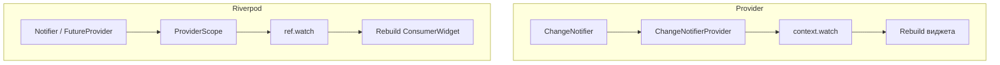
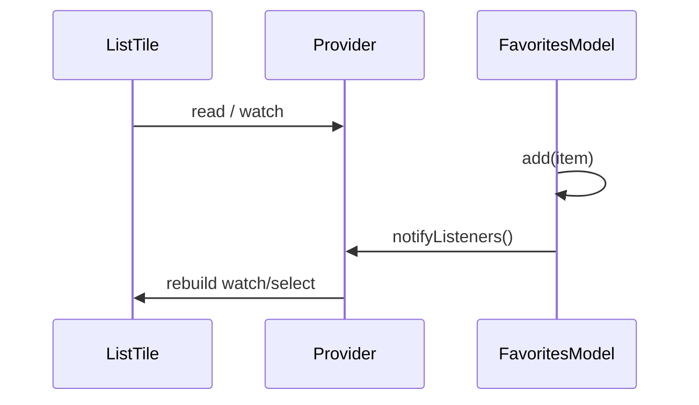
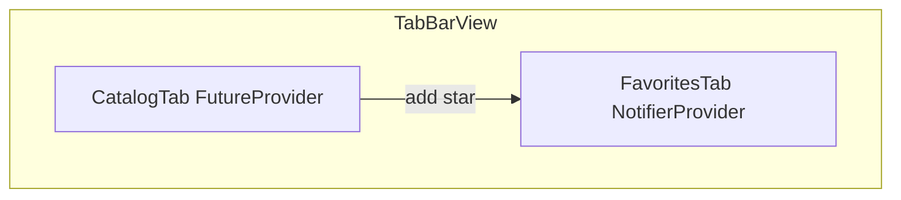

# Provider и Riverpod во Flutter

<div class="article-tags">
  <span class="tag tag-required">ОБЯЗАТЕЛЬНО</span>
  <span class="tag tag-beginner">ДЛЯ НОВИЧКОВ</span>
</div>

<span class="complexity-badge">Разработчику</span>
<span class="complexity-badge">Архитектору</span>

---

Во [Flutter](./311.md) виджеты **immutable** (неизменяемы): при изменении данных нужно вызвать `setState` или передать новое состояние сверху. В экранах с формами, авторизацией и списками с [API](/encyclopedia/4-code-dev/4-17-veb-razrabotka/2) длинная цепочка параметров через десять уровней дерева становится неудобной.

**Provider** и **Riverpod** решают задачу **доступа к общему состоянию** из любого виджета в поддереве, с предсказуемым обновлением UI.

Практикум идёт **по шагам** — счётчик на Provider, корзина, async API, тот же сценарий на Riverpod, troubleshooting и упражнения.

| Шаг | Тема | Зачем |
|-----|------|-------|
| 0 | Flutter project, `pubspec` | Базовый каркас |
| 1 | `ChangeNotifier` + Provider | Модель и подписка UI |
| 2 | `watch` / `read` / `select` | Правильные rebuild |
| 3 | Учебное приложение "Избранное" | CRUD в памяти |
| 4 | `ProviderScope` + `Notifier` | Riverpod без BuildContext |
| 5 | `FutureProvider` + API | AsyncValue и loading/error |
| 6 | Тесты `ProviderContainer` | Проверка без MaterialApp |
| 7 | Маршрут выбора стека | Provider или Riverpod |

| Подход | Идея | Пакет |
|--------|------|-------|
| `setState` | Состояние внутри одного `StatefulWidget` | Встроено |
| **Provider** | `ChangeNotifier` + `ChangeNotifierProvider` | `provider` |
| **Riverpod** | Граф провайдеров, `ref.watch` | `flutter_riverpod` |

| Материал | Зачем |
|----------|-------|
| [Flutter](./311.md) | Виджеты, hot reload |
| [Dart — типы](./4.md) | Классы, null safety |
| [async/Future](./6.md) | Загрузка с API |
| [Паттерны и switch в Dart 3](./8.md) | sealed-модели UI |
| [Мобильные приложения](/encyclopedia/4-code-dev/4-12-mobilnye-prilozheniya/1133) | UI-паттерны |

### Навигация по разделу Dart

- Вы здесь: [Provider и Riverpod во Flutter](./312.md)
- База UI: [Flutter](./311.md)
- Async: [Dart — функции и async](./6.md)
- HTTP: [Консоль и HTTP во Flutter/Dart](./9.md)



<div class="callout callout--tip">
  <div class="callout-title">Hot reload</div>

  <div class="callout-body">
  Запускайте <code>flutter run</code> в терминале или через IDE. После изменения моделей иногда нужен hot restart (<code>R</code> в консоли) — см. <a href="/encyclopedia/1-basics/1-12-sovety-dlya-novichka/13">запуск приложений</a>.
</div>
</div>

---

## Шаг 0 — подготовка проекта

Создайте приложение:

```bash
flutter create favorites_lab
cd favorites_lab
```

`pubspec.yaml` — зависимости для обоих подходов (в учебнике можно подключать по очереди):

```yaml
dependencies:
  flutter:
    sdk: flutter
  provider: ^6.1.0
  flutter_riverpod: ^2.6.0
  http: ^1.2.0
```

```bash
flutter pub get
```

Структура каталогов (рекомендуемая):

```text
lib/
  main.dart
  main_riverpod.dart      # отдельная точка для Riverpod-ветки
  models/
    favorite_item.dart
  provider_app/
    favorites_model.dart
    favorites_screen.dart
  riverpod_app/
    favorites_notifier.dart
    favorites_screen.dart
  services/
    fake_api.dart
```

База Dart: [типы](./4.md), [async/Future](./6.md).

---

## Шаг 1 — когда достаточно Provider

**Provider** — лёгкий вариант для учебных и средних приложений. Официальные codelabs Flutter исторически использовали Provider.

### Модель FavoriteItem

`lib/models/favorite_item.dart`:

```dart
class FavoriteItem {
  const FavoriteItem({required this.id, required this.title});

  final String id;
  final String title;
}
```

### ChangeNotifier — FavoritesModel

`lib/provider_app/favorites_model.dart`:

```dart
import 'package:flutter/foundation.dart';
import '../models/favorite_item.dart';

class FavoritesModel extends ChangeNotifier {
  final List<FavoriteItem> _items = [];

  List<FavoriteItem> get items => List.unmodifiable(_items);
  int get count => _items.length;

  bool contains(String id) => _items.any((e) => e.id == id);

  void add(FavoriteItem item) {
    if (contains(item.id)) return;
    _items.add(item);
    notifyListeners();
  }

  void remove(String id) {
    _items.removeWhere((e) => e.id == id);
    notifyListeners();
  }

  void clear() {
    _items.clear();
    notifyListeners();
  }
}
```

Разбор:

- `ChangeNotifier` — mixin с подписчиками на изменения.
- `notifyListeners()` сообщает Provider, что виджеты нужно обновить.
- Геттер `items` возвращает неизменяемую копию — снаружи нельзя сломать инварианты.
- Без `notifyListeners()` UI **не** перерисуется.

### Подключение в дереве

`lib/main.dart`:

```dart
import 'package:flutter/material.dart';
import 'package:provider/provider.dart';
import 'provider_app/favorites_model.dart';
import 'provider_app/favorites_screen.dart';

void main() {
  runApp(
    ChangeNotifierProvider(
      create: (_) => FavoritesModel(),
      child: const MyApp(),
    ),
  );
}

class MyApp extends StatelessWidget {
  const MyApp({super.key});

  @override
  Widget build(BuildContext context) {
    return MaterialApp(
      title: 'Избранное (Provider)',
      home: const FavoritesScreen(),
    );
  }
}
```

Разбор:

- `ChangeNotifierProvider` создаёт модель один раз и хранит её выше дерева UI.
- `create` вызывается лениво при первом `watch`/`read`.
- Для нескольких моделей используйте `MultiProvider`.

---

## Шаг 2 — чтение состояния в виджете

`lib/provider_app/favorites_screen.dart`:

```dart
import 'package:flutter/material.dart';
import 'package:provider/provider.dart';
import '../models/favorite_item.dart';
import 'favorites_model.dart';

class FavoritesScreen extends StatelessWidget {
  const FavoritesScreen({super.key});

  @override
  Widget build(BuildContext context) {
    final count = context.select<FavoritesModel, int>((m) => m.count);

    return Scaffold(
      appBar: AppBar(title: Text('Избранное ($count)')),
      body: const _FavoritesList(),
      floatingActionButton: const _AddFab(),
    );
  }
}

class _FavoritesList extends StatelessWidget {
  const _FavoritesList();

  @override
  Widget build(BuildContext context) {
    final items = context.watch<FavoritesModel>().items;

    if (items.isEmpty) {
      return const Center(child: Text('Список пуст'));
    }

    return ListView.builder(
      itemCount: items.length,
      itemBuilder: (context, index) {
        final item = items[index];
        return ListTile(
          title: Text(item.title),
          trailing: IconButton(
            icon: const Icon(Icons.delete),
            onPressed: () => context.read<FavoritesModel>().remove(item.id),
          ),
        );
      },
    );
  }
}

class _AddFab extends StatelessWidget {
  const _AddFab();

  @override
  Widget build(BuildContext context) {
    return FloatingActionButton(
      onPressed: () {
        final model = context.read<FavoritesModel>();
        final id = DateTime.now().millisecondsSinceEpoch.toString();
        model.add(FavoriteItem(id: id, title: 'Элемент $id'));
      },
      child: const Icon(Icons.add),
    );
  }
}
```

| Метод | Когда |
|-------|-------|
| `context.watch<T>()` | Перестраивать виджет при изменении |
| `context.read<T>()` | Одно действие (кнопка), без подписки |
| `context.select<T, R>()` | Слушать только часть модели (здесь `count`) |



<div class="callout callout--warning">
  <div class="callout-title">read внутри build</div>

  <div class="callout-body">
  Не вызывайте <code>context.read</code> для данных, которые должны отображаться на экране — UI не обновится. Для отображения — <code>watch</code> или <code>select</code>.
</div>
</div>

---

## Шаг 3 — MultiProvider и разделение моделей

Если приложение растёт, разбивайте `ChangeNotifier`:

```dart
MultiProvider(
  providers: [
    ChangeNotifierProvider(create: (_) => FavoritesModel()),
    ChangeNotifierProvider(create: (_) => CartModel()),
  ],
  child: const MyApp(),
)
```

`CartModel` — пример из корзины (см. ниже). Один огромный `ChangeNotifier` сложно тестировать.

### CartModel (краткий пример)

```dart
import 'package:flutter/foundation.dart';

class CartModel extends ChangeNotifier {
  final List<String> _items = [];

  List<String> get items => List.unmodifiable(_items);
  int get count => _items.length;

  void add(String name) {
    _items.add(name);
    notifyListeners();
  }

  void clear() {
    _items.clear();
    notifyListeners();
  }
}
```

Паттерны UI — [мобильные приложения](/encyclopedia/4-code-dev/4-12-mobilnye-prilozheniya/1133), [галерея виджетов (Lab)](/lab/Примеры/1154).

---

## Шаг 4 — переход на Riverpod

**Riverpod** (от автора Provider) убирает привязку к `BuildContext` для чтения состояния, упрощает **тесты** и **композицию** провайдеров (`async`, `family`, `autoDispose`).

### ProviderScope

`lib/main_riverpod.dart`:

```dart
import 'package:flutter/material.dart';
import 'package:flutter_riverpod/flutter_riverpod.dart';
import 'riverpod_app/favorites_screen.dart';

void main() {
  runApp(
    const ProviderScope(
      child: MyApp(),
    ),
  );
}

class MyApp extends StatelessWidget {
  const MyApp({super.key});

  @override
  Widget build(BuildContext context) {
    return MaterialApp(
      title: 'Избранное (Riverpod)',
      home: const RiverpodFavoritesScreen(),
    );
  }
}
```

Без `ProviderScope` вызов `ref.watch` завершится ошибкой.

### NotifierProvider

`lib/riverpod_app/favorites_notifier.dart`:

```dart
import 'package:flutter_riverpod/flutter_riverpod.dart';
import '../models/favorite_item.dart';

class FavoritesNotifier extends Notifier<List<FavoriteItem>> {
  @override
  List<FavoriteItem> build() => [];

  void add(FavoriteItem item) {
    if (state.any((e) => e.id == item.id)) return;
    state = [...state, item];
  }

  void remove(String id) {
    state = state.where((e) => e.id != id).toList();
  }

  void clear() {
    state = [];
  }
}

final favoritesProvider =
    NotifierProvider<FavoritesNotifier, List<FavoriteItem>>(
  FavoritesNotifier.new,
);
```

Разбор:

- `build()` — начальное состояние (аналог конструктора).
- `state = ...` с новым списком — immutable update, Riverpod уведомляет слушателей.
- `NotifierProvider` связывает класс и тип состояния.

### ConsumerWidget

`lib/riverpod_app/favorites_screen.dart`:

```dart
import 'package:flutter/material.dart';
import 'package:flutter_riverpod/flutter_riverpod.dart';
import '../models/favorite_item.dart';
import 'favorites_notifier.dart';

class RiverpodFavoritesScreen extends ConsumerWidget {
  const RiverpodFavoritesScreen({super.key});

  @override
  Widget build(BuildContext context, WidgetRef ref) {
    final items = ref.watch(favoritesProvider);

    return Scaffold(
      appBar: AppBar(title: Text('Избранное (${items.length})')),
      body: items.isEmpty
          ? const Center(child: Text('Список пуст'))
          : ListView.builder(
              itemCount: items.length,
              itemBuilder: (context, index) {
                final item = items[index];
                return ListTile(
                  title: Text(item.title),
                  trailing: IconButton(
                    icon: const Icon(Icons.delete),
                    onPressed: () =>
                        ref.read(favoritesProvider.notifier).remove(item.id),
                  ),
                );
              },
            ),
      floatingActionButton: FloatingActionButton(
        onPressed: () {
          final id = DateTime.now().millisecondsSinceEpoch.toString();
          ref.read(favoritesProvider.notifier).add(
                FavoriteItem(id: id, title: 'Элемент $id'),
              );
        },
        child: const Icon(Icons.add),
      ),
    );
  }
}
```

Разбор:

- `WidgetRef ref` заменяет `context.watch` — удобно в тестах без дерева виджетов.
- `ref.watch(favoritesProvider)` подписывает виджет на изменения.
- `ref.read(favoritesProvider.notifier).add(...)` — изменение без лишних rebuild всего списка в других виджетах.

---

## Шаг 5 — async и загрузка с API

### Fake API

`lib/services/fake_api.dart`:

```dart
import '../models/favorite_item.dart';

Future<List<FavoriteItem>> fetchCatalog() async {
  await Future.delayed(const Duration(seconds: 1));
  return [
    const FavoriteItem(id: '1', title: 'Dart'),
    const FavoriteItem(id: '2', title: 'Flutter'),
    const FavoriteItem(id: '3', title: 'Riverpod'),
  ];
}
```

### FutureProvider (Riverpod)

```dart
import 'package:flutter_riverpod/flutter_riverpod.dart';
import '../models/favorite_item.dart';
import '../services/fake_api.dart';

final catalogProvider = FutureProvider<List<FavoriteItem>>((ref) async {
  return fetchCatalog();
});
```

UI:

```dart
class CatalogTab extends ConsumerWidget {
  const CatalogTab({super.key});

  @override
  Widget build(BuildContext context, WidgetRef ref) {
    final asyncCatalog = ref.watch(catalogProvider);

    return asyncCatalog.when(
      data: (items) => ListView(
        children: items
            .map((e) => ListTile(
                  title: Text(e.title),
                  trailing: IconButton(
                    icon: const Icon(Icons.star_border),
                    onPressed: () => ref
                        .read(favoritesProvider.notifier)
                        .add(e),
                  ),
                ))
            .toList(),
      ),
      loading: () => const Center(child: CircularProgressIndicator()),
      error: (error, stack) => Center(child: Text('Ошибка: $error')),
    );
  }
}
```

Разбор:

- `AsyncValue` инкапсулирует loading / data / error — меньше ручных флагов.
- `ref.refresh(catalogProvider)` перезапускает загрузку.
- Реальный HTTP — пакет `http`, см. [консоль и HTTP](./9.md), [REST API](/encyclopedia/4-code-dev/4-17-veb-razrabotka/2).

### Provider + FutureBuilder

Аналог без Riverpod:

```dart
Future<List<FavoriteItem>>? _future;

@override
void initState() {
  super.initState();
  _future = fetchCatalog();
}

@override
Widget build(BuildContext context) {
  return FutureBuilder<List<FavoriteItem>>(
    future: _future,
    builder: (context, snapshot) {
      if (snapshot.connectionState == ConnectionState.waiting) {
        return const CircularProgressIndicator();
      }
      if (snapshot.hasError) {
        return Text('Ошибка: ${snapshot.error}');
      }
      final items = snapshot.data ?? [];
      return ListView(/* ... */);
    },
  );
}
```

Примеры `FutureBuilder` — [галерея виджетов (Lab)](/lab/Примеры/1154).

---

## Шаг 6 — family, autoDispose, select

### family — параметризованный провайдер

```dart
final itemProvider = FutureProvider.family<FavoriteItem?, String>((ref, id) async {
  final catalog = await ref.watch(catalogProvider.future);
  return catalog.cast<FavoriteItem?>().firstWhere(
        (e) => e?.id == id,
        orElse: () => null,
      );
});
```

Использование: `ref.watch(itemProvider('2'))`.

### autoDispose

```dart
final searchQueryProvider = StateProvider.autoDispose<String>((ref) => '');
```

Состояние сбрасывается, когда нет слушателей — удобно для полей поиска на экране.

### select в Riverpod

```dart
final count = ref.watch(
  favoritesProvider.select((items) => items.length),
);
```

Rebuild только при изменении длины списка — аналог `context.select` в Provider.

---

## Шаг 7 — тестирование

### Provider

```dart
import 'package:flutter_test/flutter_test.dart';
import 'package:provider/provider.dart';
import 'package:flutter/material.dart';
import '../lib/provider_app/favorites_model.dart';

void main() {
  testWidgets('add increases count', (tester) async {
    await tester.pumpWidget(
      ChangeNotifierProvider(
        create: (_) => FavoritesModel(),
        child: MaterialApp(
          home: Builder(
            builder: (context) {
              context.read<FavoritesModel>().add(
                    const FavoriteItem(id: '1', title: 'Test'),
                  );
              final count = context.watch<FavoritesModel>().count;
              return Text('$count');
            },
          ),
        ),
      ),
    );

    expect(find.text('1'), findsOneWidget);
  });
}
```

### Riverpod — ProviderContainer

```dart
import 'package:flutter_test/flutter_test.dart';
import 'package:flutter_riverpod/flutter_riverpod.dart';
import '../lib/models/favorite_item.dart';
import '../lib/riverpod_app/favorites_notifier.dart';

void main() {
  test('add item', () {
    final container = ProviderContainer();
    addTearDown(container.dispose);

    container.read(favoritesProvider.notifier).add(
          const FavoriteItem(id: '1', title: 'A'),
        );

    expect(container.read(favoritesProvider).length, 1);
  });
}
```

Разбор:

- `ProviderContainer` — тестовый контекст без `ProviderScope` в виджетах.
- Тесты Riverpod часто проще и быстрее widget-тестов.

Запуск:

```bash
flutter test
```

---

## Сравнение Provider и Riverpod

| Критерий | Provider | Riverpod |
|----------|----------|----------|
| Порог входа | Ниже | Чуть выше (новые термины) |
| Зависимость от `BuildContext` | Да | Нет (`ref`) |
| Async из коробки | `FutureProvider` (пакет) | `FutureProvider`, `AsyncValue` |
| Compile-time safety | Слабее | Сильнее (типы провайдеров) |
| Тестирование | Возможно | Удобнее (`ProviderContainer`) |
| Документация Flutter | Официальные codelabs | Активное community |

Оба пакета **дополняют** архитектуру, но не заменяют её. Разделяйте UI, домен и данные — см. [паттерны проектирования](/encyclopedia/7-project/7-06-proektirovanie-i-arhitektura/design-patterns/intro).

Параллель по идее "UI от состояния" — [Kotlin Compose](/encyclopedia/5-languages/5-09-kotlin/224).

---

## Sealed-модели UI (Dart 3)

Для сложных экранов комбинируйте Riverpod и [sealed class](./8.md):

```dart
sealed class CatalogState {}

class CatalogLoading extends CatalogState {}

class CatalogData extends CatalogState {
  CatalogData(this.items);
  final List<FavoriteItem> items;
}

class CatalogError extends CatalogState {
  CatalogError(this.message);
  final String message;
}
```

В `build`:

```dart
return switch (state) {
  CatalogLoading() => const CircularProgressIndicator(),
  CatalogData(:final items) => ListView(/* ... */),
  CatalogError(:final message) => Text(message),
};
```

Исчерпывающий switch — компилятор проверит все варианты.

---

## Типичные ошибки и troubleshooting

| Ошибка | Симптом | Решение |
|--------|---------|---------|
| `read` внутри `build` | UI не обновляется | Используйте `watch` или `select` |
| Забыли `notifyListeners` | Список застыл | Вызов после изменения полей |
| Нет `ProviderScope` | Crash при `ref.watch` | Обернуть `runApp` |
| Огромный `ChangeNotifier` | Сложно тестировать | Разбить на несколько моделей |
| `watch` в callback | Лишние rebuild | `read` в onPressed |
| Provider not found | Exception при `watch` | Provider выше по дереву |
| Riverpod override в test | Старый state | `ProviderContainer(overrides: [...])` |
| Async gap | setState after dispose | Проверять `mounted` или отмена |

<div class="callout callout--info">
  <div class="callout-title">DevTools</div>

  <div class="callout-body">
  Flutter DevTools показывает rebuild stats — полезно, когда <code>watch</code> стоит слишком высоко в дереве и перерисовывает весь экран.
</div>
</div>

---

## Упражнения

1. Добавьте переключатель темы через `ChangeNotifier` / `StateNotifier` — `ThemeMode light/dark`.
2. Реализуйте поиск по каталогу с `StateProvider.autoDispose` и debounce 300 ms.
3. Напишите widget-тест: tap FAB → элемент появился в списке (Provider).
4. Напишите unit-тест `FavoritesNotifier` без `MaterialApp` (Riverpod).
5. Загрузите реальный JSON с публичного API через `http` — обработайте 404 в `AsyncValue.error`.

<details>
<summary>Подсказка к упражнению 2</summary>

```dart
final debouncedSearchProvider = FutureProvider.autoDispose<String>((ref) async {
  final query = ref.watch(searchQueryProvider);
  await Future.delayed(const Duration(milliseconds: 300));
  return query;
});
```

Следите за отменой через `ref.onDispose` при смене query.

</details>

---

## FAQ

**Provider устарел?**

Пакет поддерживается. Riverpod — эволюция идей, не обязательная миграция для маленьких приложений.

**Нужен ли BLoC?**

BLoC — отдельный паттерн с событиями и состояниями. Provider/Riverpod проще для старта. Выбор зависит от команды и масштаба.

**Riverpod 3?**

Следите за changelog на pub.dev. API `Notifier` / `NotifierProvider` — современная база (Riverpod 2.x+).

**Где хранить API-ключи?**

Не в коде. `--dart-define`, env-файлы, backend proxy — [конфигурации](/encyclopedia/3-data-markup/3-04-konfiguratsii-i-dannye/intro).

**Можно смешивать Provider и Riverpod?**

Технически да, но в одном проекте лучше один основной подход — меньше путаницы.

**GetX, MobX?**

Альтернативы с другой философией. Provider/Riverpod — наиболее частые в учебных материалах Flutter.

---

## Маршрут обучения

1. [Flutter](./311.md) — виджеты, `StatelessWidget` / `StatefulWidget`.
2. Provider на одном экране (счётчик, корзина, избранное).
3. Riverpod — тот же экран + `FutureProvider` для API.
4. [Паттерны и switch в Dart 3](./8.md) — sealed-модели состояний UI.
5. [Консоль и HTTP во Flutter/Dart](./9.md) — реальные запросы.

<div class="callout callout--tip">
  <div class="callout-title">Практика</div>
  <div class="callout-body">
  Реализуйте экран "Избранное" с <code>ChangeNotifier</code> и переключитесь на <code>NotifierProvider</code> — сравните объём boilerplate и тесты без <code>MaterialApp</code>.
</div>
</div>

---

## Шаг 8 — полный пошаговый tutorial "Избранное"

Ниже — единый сценарий от пустого экрана до каталога с API. Выполняйте шаги по порядку.

### 8.1 Создайте модель

Файл `lib/models/favorite_item.dart` — см. [Шаг 1](#шаг-1--когда-достаточно-provider).

### 8.2 Provider-ветка

1. `FavoritesModel` extends `ChangeNotifier`.
2. `ChangeNotifierProvider` в `main.dart`.
3. `FavoritesScreen` с `watch` / `read`.
4. `flutter run -t lib/main.dart`.

### 8.3 Riverpod-ветка

1. `FavoritesNotifier` extends `Notifier`.
2. `ProviderScope` в `main_riverpod.dart`.
3. `ConsumerWidget` с `ref.watch`.
4. `flutter run -t lib/main_riverpod.dart`.

### 8.4 Добавьте вкладки

```dart
DefaultTabController(
  length: 2,
  child: Scaffold(
    appBar: AppBar(
      title: const Text('Demo'),
      bottom: const TabBar(tabs: [
        Tab(text: 'Каталог'),
        Tab(text: 'Избранное'),
      ]),
    ),
    body: const TabBarView(
      children: [CatalogTab(), FavoritesTabHost()],
    ),
  ),
);
```

`FavoritesTabHost` — ваш список избранного; `CatalogTab` — `FutureProvider` из [Шаг 5](#шаг-5--async-и-загрузка-с-api).



---

## Шаг 9 — навигация и передача состояния

С [go_router](https://pub.dev/packages/go_router) Riverpod сочетается через `ConsumerWidget` на каждом экране:

```dart
GoRoute(
  path: '/item/:id',
  builder: (context, state) {
    final id = state.pathParameters['id']!;
    return ItemDetailScreen(itemId: id);
  },
),
```

На экране детали:

```dart
final item = ref.watch(itemProvider(itemId));
```

Provider без Riverpod — передайте `FavoritesModel` через `Provider.value` или используйте ancestor `context.watch`.

Маршрутизация Flutter — [Flutter](./311.md), мобильные паттерны — [навигация в приложениях](/encyclopedia/4-code-dev/4-12-mobilnye-prilozheniya/1133).

---

## Шаг 10 — persistence с shared_preferences

Сохранение id избранного между перезапусками (Riverpod):

```yaml
dependencies:
  shared_preferences: ^2.3.0
```

```dart
class FavoritesNotifier extends AsyncNotifier<List<FavoriteItem>> {
  static const _key = 'favorite_ids';

  @override
  Future<List<FavoriteItem>> build() async {
    final prefs = await SharedPreferences.getInstance();
    final ids = prefs.getStringList(_key) ?? [];
    return ids.map((id) => FavoriteItem(id: id, title: 'Saved $id')).toList();
  }

  Future<void> add(FavoriteItem item) async {
    final current = state.value ?? [];
    if (current.any((e) => e.id == item.id)) return;
    final next = [...current, item];
    state = AsyncData(next);
    final prefs = await SharedPreferences.getInstance();
    await prefs.setStringList(_key, next.map((e) => e.id).toList());
  }
}
```

Разбор:

- `AsyncNotifier` — начальная загрузка async.
- UI: `ref.watch(favoritesProvider).when(...)`.
- Для production — SQLite (`drift`) или Isar.

Конфигурация — [конфигурации и данные](/encyclopedia/3-data-markup/3-04-konfiguratsii-i-dannye/intro).

---

## Шаг 11 — StateNotifier и legacy Provider

Старый стиль Riverpod 1.x / Provider bridge:

```dart
class CounterNotifier extends StateNotifier<int> {
  CounterNotifier() : super(0);
  void increment() => state++;
}

final counterProvider = StateNotifierProvider<CounterNotifier, int>(
  (ref) => CounterNotifier(),
);
```

В Riverpod 2+ предпочтите `Notifier` — см. [Шаг 4](#шаг-4--переход-на-riverpod).

---

## Шаг 12 — ConsumerStatefulWidget

Когда нужен lifecycle (`initState`, `AnimationController`):

```dart
class CatalogScreen extends ConsumerStatefulWidget {
  const CatalogScreen({super.key});

  @override
  ConsumerState<CatalogScreen> createState() => _CatalogScreenState();
}

class _CatalogScreenState extends ConsumerState<CatalogScreen> {
  @override
  void initState() {
    super.initState();
    Future.microtask(() => ref.invalidate(catalogProvider));
  }

  @override
  Widget build(BuildContext context) {
    final async = ref.watch(catalogProvider);
    return async.when(/* ... */);
  }
}
```

`ref` доступен после `super.initState()` в microtask или в `didChangeDependencies`.

---

## Шаг 13 — override провайдеров в тестах

```dart
testWidgets('catalog shows items', (tester) async {
  final container = ProviderContainer(
    overrides: [
      catalogProvider.overrideWith((ref) async => [
            const FavoriteItem(id: '1', title: 'Mock'),
          ]),
    ],
  );
  addTearDown(container.dispose);

  await tester.pumpWidget(
    UncontrolledProviderScope(
      container: container,
      child: const MaterialApp(home: CatalogTab()),
    ),
  );

  await tester.pumpAndSettle();
  expect(find.text('Mock'), findsOneWidget);
});
```

Override изолирует тест от сети — best practice для widget-тестов.

---

## Шаг 14 — performance и rebuild

| Проблема | Причина | Решение |
|----------|---------|---------|
| Весь экран мигает | `watch` высоко в дереве | `select`, вынести списки |
| Лишние API calls | `FutureProvider` без cache | `keepAlive`, `ref.invalidate` осознанно |
| Jank при add | `notifyListeners` для всей модели | Мельче провайдеры |

DevTools → **Performance** + **Rebuild stats** — [Flutter DevTools](./311.md).

---

## Шаг 15 — архитектура слоёв

```text
UI (Widget)
  ↓ ref.watch / context.watch
State (Notifier / ChangeNotifier)
  ↓
Repository (abstract)
  ↓
API / DB (http, drift)
```

```dart
abstract class FavoritesRepository {
  Future<List<FavoriteItem>> load();
  Future<void> save(List<FavoriteItem> items);
}

final favoritesRepositoryProvider = Provider<FavoritesRepository>((ref) {
  return InMemoryFavoritesRepository();
});

final favoritesProvider = AsyncNotifierProvider<FavoritesNotifier, List<FavoriteItem>>(
  FavoritesNotifier.new,
);
```

`FavoritesNotifier` вызывает repository — UI не знает про HTTP.

Паттерны — [проектирование](/encyclopedia/7-project/7-06-proektirovanie-i-arhitektura/design-patterns/intro).

---

## Provider — расширенные паттерны

### ProxyProvider

Когда модель зависит от другой:

```dart
MultiProvider(
  providers: [
    Provider(create: (_) => ApiClient()),
    ChangeNotifierProxyProvider<ApiClient, CatalogModel>(
      create: (_) => CatalogModel(null),
      update: (_, api, model) => model!..updateApi(api),
    ),
  ],
  child: const MyApp(),
)
```

### ValueListenableProvider

Для простых значений без ChangeNotifier:

```dart
final counter = ValueNotifier<int>(0);

ValueListenableProvider.value(
  value: counter,
  child: ...,
);
```

---

## Riverpod — Riverpod Generator (обзор)

Пакет `riverpod_annotation` + code generation:

```dart
@riverpod
class Favorites extends _$Favorites {
  @override
  List<FavoriteItem> build() => [];

  void add(FavoriteItem item) {
    state = [...state, item];
  }
}
```

Команда `dart run build_runner build` генерирует `favoritesProvider`. Удобно в больших проектах — официальная документация на riverpod.dev.

---

## Сравнение с другими подходами Flutter

| Подход | Сложность | Когда |
|--------|-----------|-------|
| setState | Низкая | Один виджет, локальное UI |
| Provider | Средняя | Учебные и средние apps |
| Riverpod | Средняя+ | Тесты, async, масштаб |
| BLoC | Выше | Строгие event/state потоки |
| GetX | Низкая вход | Малые проекты, спорная архитектура |

Выбор зависит от команды — Provider/Riverpod покрывают большинство учебных и production mobile apps.

---

## Расширенный troubleshooting

| Симптом | Причина | Решение |
|---------|---------|---------|
| `Tried to modify provider while building` | write в build | Перенести в callback / post-frame |
| Infinite rebuild | watch + setState loop | Разделить read/watch |
| FutureProvider каждый build | Новый Future | Стабильный provider, не inline Future |
| Hot reload state lost | Норма для state | Hot restart `R` |
| Platform channel + provider | Context missing | Provider выше MaterialApp |
| Exception in notifier | Stack в zone | `FlutterError.onError` |

---

## Дополнительные упражнения

6. Dark theme через `StateProvider<ThemeMode>` + `MaterialApp.themeMode`.
7. Pull-to-refresh каталога — `RefreshIndicator` + `ref.invalidate(catalogProvider)`.
8. Golden test для `FavoritesScreen` — `matchesGoldenFile`.
9. Integration test — `integration_test` tap FAB, expect list tile.
10. Migrate Provider app to Riverpod file-by-file с `UncontrolledProviderScope`.

---

## Расширенный FAQ

**Provider 7 и Riverpod 3?**

Следите за migration guides на pub.dev — API `Notifier` уже стандарт Riverpod 2.

**Equatable нужен с record-like models?**

Dart не имеет record до 3 — для классов используйте `equatable` package; Riverpod сравнивает по identity state.

**Riverpod без Flutter?**

Пакет `riverpod` (pure Dart) — логика в CLI и server Dart.

**InheritedWidget вручную?**

Provider построен поверх InheritedWidget; Riverpod — отдельный механизм.

**State management для games?**

Flutter Flame — отдельные паттерны; Provider/Riverpod для UI меню и meta-game.

**Web и Riverpod?**

Работает — `flutter run -d chrome`; CORS для API — [HTTP](./9.md).

---

## Полный листинг Provider main (reference)

```dart
import 'package:flutter/material.dart';
import 'package:provider/provider.dart';
import 'models/favorite_item.dart';
import 'provider_app/favorites_model.dart';

void main() {
  runApp(
    ChangeNotifierProvider(
      create: (_) => FavoritesModel()..bootstrap(),
      child: const FavoritesApp(),
    ),
  );
}

class FavoritesApp extends StatelessWidget {
  const FavoritesApp({super.key});

  @override
  Widget build(BuildContext context) {
    return MaterialApp(
      title: 'Favorites Provider',
      theme: ThemeData(colorSchemeSeed: Colors.indigo, useMaterial3: true),
      home: const FavoritesHomePage(),
    );
  }
}

class FavoritesHomePage extends StatelessWidget {
  const FavoritesHomePage({super.key});

  @override
  Widget build(BuildContext context) {
    final items = context.watch<FavoritesModel>().items;

    return Scaffold(
      appBar: AppBar(
        title: Text('Избранное (${items.length})'),
        actions: [
          if (items.isNotEmpty)
            IconButton(
              icon: const Icon(Icons.delete_sweep),
              onPressed: () => context.read<FavoritesModel>().clear(),
            ),
        ],
      ),
      body: items.isEmpty
          ? const Center(child: Text('Нажмите +'))
          : ListView.builder(
              itemCount: items.length,
              itemBuilder: (context, i) {
                final item = items[i];
                return Dismissible(
                  key: ValueKey(item.id),
                  onDismissed: (_) =>
                      context.read<FavoritesModel>().remove(item.id),
                  child: ListTile(title: Text(item.title)),
                );
              },
            ),
      floatingActionButton: FloatingActionButton(
        onPressed: () {
          final n = DateTime.now().millisecondsSinceEpoch;
          context.read<FavoritesModel>().add(
                FavoriteItem(id: '$n', title: 'Item $n'),
              );
        },
        child: const Icon(Icons.add),
      ),
    );
  }
}
```

Добавьте в `FavoritesModel` пустой `bootstrap()` для будущей загрузки из prefs.

---

## Полный листинг Riverpod notifier (reference)

```dart
import 'package:flutter_riverpod/flutter_riverpod.dart';
import '../models/favorite_item.dart';

class FavoritesNotifier extends Notifier<List<FavoriteItem>> {
  @override
  List<FavoriteItem> build() => [];

  void bootstrap() {
    // ref.read(storageProvider) — в расширенной версии
  }

  bool contains(String id) => state.any((e) => e.id == id);

  void toggle(FavoriteItem item) {
    if (contains(item.id)) {
      remove(item.id);
    } else {
      add(item);
    }
  }

  void add(FavoriteItem item) {
    if (contains(item.id)) return;
    state = [...state, item];
  }

  void remove(String id) {
    state = state.where((e) => e.id != id).toList(growable: false);
  }

  void clear() => state = [];
}

final favoritesProvider =
    NotifierProvider<FavoritesNotifier, List<FavoriteItem>>(
  FavoritesNotifier.new,
);

final favoritesCountProvider = Provider<int>((ref) {
  return ref.watch(favoritesProvider.select((list) => list.length));
});
```

`favoritesCountProvider` — derived state без дублирования логики в UI.

---

## Чек-лист перед релизом

- [ ] Нет `read` там, где нужен `watch`
- [ ] `notifyListeners` после каждой мутации (Provider)
- [ ] `ProviderScope` корень дерева (Riverpod)
- [ ] Async UI показывает loading и error
- [ ] Widget-тесты на ключевые сценарии
- [ ] Unit-тесты notifier без сети
- [ ] API keys не в репозитории

См. [мобильные приложения — релиз](/encyclopedia/4-code-dev/4-12-mobilnye-prilozheniya/intro).

---

## Глоссарий

| Термин | Смысл |
|--------|-------|
| **BuildContext** | Связь виджета с деревом; нужен Provider |
| **ChangeNotifier** | Класс с `notifyListeners` |
| **ProviderScope** | Корень Riverpod |
| **WidgetRef** | Доступ к провайдерам в Riverpod |
| **AsyncValue** | loading / data / error обёртка |
| **family** | Провайдер с параметром |
| **autoDispose** | Освобождение при отсутствии слушателей |

---

## Полный CatalogTab с http (reference)

```dart
import 'dart:convert';
import 'package:flutter/material.dart';
import 'package:flutter_riverpod/flutter_riverpod.dart';
import 'package:http/http.dart' as http;
import '../models/favorite_item.dart';
import 'favorites_notifier.dart';

Future<List<FavoriteItem>> fetchCatalogFromNetwork() async {
  // Замените URL на свой API или mock-сервер
  final uri = Uri.parse('https://jsonplaceholder.typicode.com/users');
  final response = await http.get(uri);
  if (response.statusCode != 200) {
    throw Exception('HTTP ${response.statusCode}');
  }
  final list = jsonDecode(response.body) as List<dynamic>;
  return list
      .map((e) => FavoriteItem(
            id: '${e['id']}',
            title: e['name'] as String,
          ))
      .toList();
}

final remoteCatalogProvider = FutureProvider<List<FavoriteItem>>((ref) {
  return fetchCatalogFromNetwork();
});

class CatalogTab extends ConsumerWidget {
  const CatalogTab({super.key});

  @override
  Widget build(BuildContext context, WidgetRef ref) {
    final catalog = ref.watch(remoteCatalogProvider);

    return catalog.when(
      loading: () => const Center(child: CircularProgressIndicator()),
      error: (e, _) => Center(
        child: Column(
          mainAxisSize: MainAxisSize.min,
          children: [
            Text('Ошибка: $e'),
            const SizedBox(height: 8),
            ElevatedButton(
              onPressed: () => ref.invalidate(remoteCatalogProvider),
              child: const Text('Повторить'),
            ),
          ],
        ),
      ),
      data: (items) => RefreshIndicator(
        onRefresh: () async => ref.invalidate(remoteCatalogProvider),
        child: ListView.builder(
          itemCount: items.length,
          itemBuilder: (context, index) {
            final item = items[index];
            final inFav = ref.watch(
              favoritesProvider.select((list) => list.any((f) => f.id == item.id)),
            );
            return ListTile(
              title: Text(item.title),
              trailing: IconButton(
                icon: Icon(inFav ? Icons.star : Icons.star_border),
                onPressed: () {
                  final notifier = ref.read(favoritesProvider.notifier);
                  if (inFav) {
                    notifier.remove(item.id);
                  } else {
                    notifier.add(item);
                  }
                },
              ),
            );
          },
        ),
      ),
    );
  }
}
```

Зависимость `http` — [консоль и HTTP во Flutter/Dart](./9.md). `jsonplaceholder` — публичный учебный API без auth.

---

## Типы провайдеров Riverpod — шпаргалка

| Provider | Назначение |
|----------|------------|
| `Provider` | Read-only вычисление, сервисы |
| `StateProvider` | Простое mutable state (int, String) |
| `NotifierProvider` | Сложная логика state |
| `AsyncNotifierProvider` | Async load + mutations |
| `FutureProvider` | One-shot async |
| `StreamProvider` | Stream из Firebase/WebSocket |
| `StateNotifierProvider` | Legacy (Riverpod 1 style) |

---

## Связанные материалы

| Тема | Материал |
|------|----------|
| Flutter основы | [Flutter](./311.md) |
| HTTP | [Консоль и HTTP во Flutter/Dart](./9.md) |
| Dart раздел | [Dart — о разделе](./intro.md) |
| Виджеты Lab | [Flutter — готовые виджеты](/lab/Примеры/1154) |
| Декларативный UI | [Kotlin Compose](/encyclopedia/5-languages/5-09-kotlin/224) |

{/* sidebar-collections */}

---

## В подборках

Статья дополняет маршрут [Flutter](./311.md) и блок мобильной разработки — [мобильные приложения](/encyclopedia/4-code-dev/4-12-mobilnye-prilozheniya/intro).

{/* /sidebar-collections */}

---

## Второй проход — InheritedWidget, BLoC и performance (черновик)

### InheritedWidget (как работает Provider под капотом)

Provider использует `InheritedWidget` для распространения значения вниз по дереву. Учебный минимум:

```dart
class CounterScope extends InheritedWidget {
  const CounterScope({
    super.key,
    required this.count,
    required super.child,
  });

  final int count;

  static CounterScope of(BuildContext context) {
    return context.dependOnInheritedWidgetOfExactType<CounterScope>()!;
  }

  @override
  bool updateShouldNotify(CounterScope old) => count != old.count;
}
```

`dependOnInheritedWidgetOfExactType` подписывает виджет на изменения — аналог `watch`.

### Когда смотреть BLoC

**BLoC** — события → состояния → UI. Подходит для больших команд с явными state machines. Provider/Riverpod проще для старта; BLoC — если нужен audit trail событий (analytics, undo).

| Критерий | Provider/Riverpod | BLoC |
|----------|-------------------|------|
| Порог входа | Ниже | Выше |
| События | Неявные (методы) | Явные Event class |
| Тесты | ProviderContainer | blocTest |

### ListView performance

```dart
ListView.builder(
  itemCount: items.length,
  itemBuilder: (context, index) => ListTile(title: Text(items[index].title)),
)
```

Не стройте `ListView(children: items.map(...).toList())` на тысячах элементов — builder ленивый.

### State restoration

Для сохранения состояния при kill процесса — `RestorationMixin`, `restorationId` на `Scaffold`. Riverpod: `StateNotifier` + `SharedPreferences` provider для персистентности избранного.

### Integration test

```dart
// integration_test/app_test.dart
import 'package:flutter_test/flutter_test.dart';
import 'package:integration_test/integration_test.dart';

void main() {
  IntegrationTestWidgetsFlutterBinding.ensureInitialized();
  testWidgets('tap FAB adds item', (tester) async {
    // pumpWidget MyApp, tap FAB, expect find.text
  });
}
```

Запуск: `flutter test integration_test/`. Отличается от unit `ProviderContainer` — полный UI on device/emulator.

---

## Дополнительные темы Flutter (кратко)

### Golden tests

```dart
await expectLater(
  find.byType(MyWidget),
  matchesGoldenFile('goldens/my_widget.png'),
);
```

Фиксируют pixel-perfect UI; обновление: `flutter test --update-goldens`.

### Flavors и `--dart-define`

```bash
flutter run --dart-define=API_URL=https://staging.example.com
```

Разделение staging/production без дублирования кода — см. [конфигурации](/encyclopedia/3-data-markup/3-04-konfiguratsii-i-dannye/intro).

### Performance overlay

```dart
import 'package:flutter/rendering.dart';
void main() {
  debugPaintLayerBordersEnabled = true;
  runApp(const MyApp());
}
```

Полезно при jank и лишних rebuild.

---

## Чек-лист перед релизом Flutter

- [ ] `flutter analyze` без ошибок
- [ ] `flutter test` зелёный
- [ ] Версия в `pubspec.yaml` и store listing совпадают
- [ ] ProGuard/R8 rules для Android release проверены
- [ ] iOS signing и capabilities настроены в Xcode

**Связанные материалы:** [Dart — о разделе](/encyclopedia/5-languages/5-22-dart/intro) · [мобильная разработка](/encyclopedia/4-code-dev/4-12-mobilnye-prilozheniya/intro).

---

## Дополнение: accessibility

```dart
Semantics(
  label: 'Add item button',
  child: FloatingActionButton(onPressed: _add, child: const Icon(Icons.add)),
)
```

VoiceOver и TalkBack читают `Semantics` — проверяйте на реальном устройстве перед релизом.

---

## Дополнение: internationalization

```dart
import 'package:flutter_gen/gen_l10n/app_localizations.dart';
// MaterialApp.localizationsDelegates + supportedLocales
```

Строки UI выносят в ARB-файлы; не хардкодьте текст в виджетах для store locales.

---

## Итог статьи

Flutter-практикум завершён чек-листом релиза, golden tests и a11y — переходите к [Dart intro](/encyclopedia/5-languages/5-22-dart/intro) для языковых основ.

---
