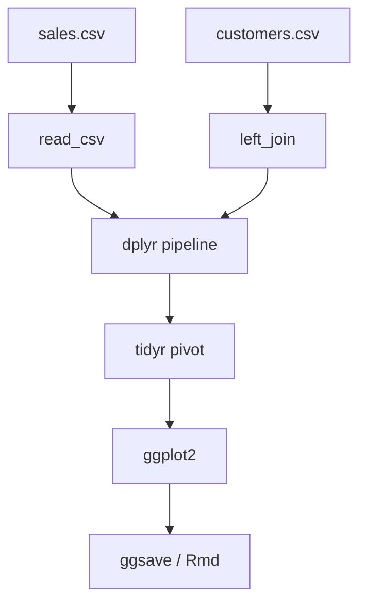
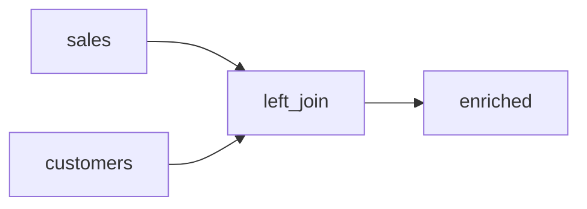
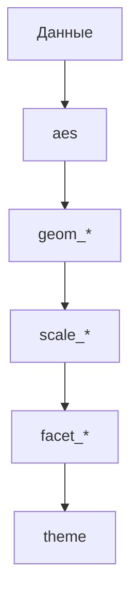

# tidyverse и ggplot2

<div class="article-tags">
  <span class="tag tag-required">ОБЯЗАТЕЛЬНО</span>
  <span class="tag tag-beginner">ДЛЯ НОВИЧКОВ</span>
</div>

<span class="complexity-badge">Разработчику</span>
<span class="complexity-badge">Архитектору</span>

**Дальше:** [простые приложения](./103.md) · [архитектура аналитики](./3.md)

---

## tidyverse и ggplot2

**tidyverse** — набор согласованных пакетов R для работы с **tidy data** (аккуратные табличные данные): каждый столбец — переменная, каждая строка — наблюдение. **ggplot2** реализует **грамматику графиков** — график собирается слоями (`geom`, `aes`, `facet`) вместо одного монолитного вызова `plot()`.

Практикум **по шагам** — установка, загрузка CSV, трансформации `dplyr`, формы `tidyr`, графики `ggplot2`, воспроизводимость и мини-проект.

| Шаг | Тема | Зачем |
|-----|------|-------|
| 1 | Установка tidyverse | Подготовить пакеты |
| 2 | Tidy data | Правильная форма таблицы |
| 3 | readr | Загрузка CSV |
| 4 | dplyr | filter, group_by, summarise |
| 5 | join | Связь справочников |
| 6 | tidyr | pivot_longer / pivot_wider |
| 7 | ggplot2 | Слои и эстетики |
| 8 | Сохранение и отчёт | ggsave, R Markdown |
| 9 | Мини-проект | Сквозной сценарий |

| Материал | Зачем |
|----------|-------|
| [Основы R](./2.md) | Векторы, `data.frame`, синтаксис |
| [Простые приложения](./103.md) | CSV, отчёты, первый pipeline |
| [Типы и векторизация](./4.md) | `NA`, факторы |
| [Функции и пакеты](./6.md) | `library()`, свои функции |
| [SQL joins](/encyclopedia/3-data-markup/3-07-sql/101) | Логика слияния таблиц |
| [CSV](/encyclopedia/3-data-markup/3-04-konfiguratsii-i-dannye/219) | Формат файлов |
| [pandas](/encyclopedia/3-data-markup/3-11-analiz-dannyh/427) | Аналог в Python |
| [Pkg и Plots в Julia](/encyclopedia/5-languages/5-24-julia/104) | Тот же CSV в Julia |

### Навигация по блоку R

- Предыдущий шаг: [Первая программа](./7.md), [Функции и пакеты](./6.md)
- Вы здесь: [tidyverse и ggplot2](./104.md)
- Следующий шаг: [Простые приложения](./103.md), [Архитектура](./3.md)
- Обзор: [R — о разделе](./intro.md)



<div class="callout callout--tip">
  <div class="callout-title">RStudio / Posit</div>

  <div class="callout-body">
  Удобно выполнять код по ячейкам в RStudio. Установка и <code>Rscript</code> — в <a href="./7.md">первой программе</a>. Сохраняйте скрипты в UTF-8 для кириллицы в подписях графиков.
</div>
</div>

---

## Шаг 1 — установка

```r
install.packages("tidyverse")
library(tidyverse)
```

Мета-пакет **tidyverse** подтягивает согласованные версии:

| Пакет | Роль |
|-------|------|
| **ggplot2** | Графики |
| **dplyr** | Трансформации таблиц |
| **tidyr** | Форма данных |
| **readr** | Чтение CSV |
| **tibble** | Современные data frame |
| **purrr** | Функциональные итерации |
| **stringr** | Строки |
| **forcats** | Факторы |

Проверка:

```r
packageVersion("ggplot2")
packageVersion("dplyr")
```

Если корпоративный прокси блокирует CRAN — настройте `repos` или зеркало. Список зеркал: [cran.r-project.org/mirrors.html](https://cran.r-project.org/mirrors.html).

---

## Шаг 2 — принципы tidy data

| Правило | Нарушение | Исправление |
|---------|-----------|-------------|
| Один столбец — одна переменная | `sales_2023`, `sales_2024` в одной строке | `pivot_longer` |
| Одна строка — одно наблюдение | несколько сущностей в строке | нормализовать строки |
| Одна таблица — один тип сущности | всё в одном листе | разделить таблицы |

Пример широкой таблицы (плохо для ggplot):

```r
wide <- tibble(
  region = c("North", "South"),
  Q1 = c(100, 80),
  Q2 = c(120, 90)
)
```

Цель — **long** формат:

```r
long <- wide %>%
  pivot_longer(
    cols = starts_with("Q"),
    names_to = "quarter",
    values_to = "revenue"
  )
```

Разбор:
- `starts_with("Q")` выбирает столбцы кварталов.
- `names_to` — имя нового столбца с метками кварталов.
- `values_to` — столбец с числами.

Подробнее о модели данных — [анализ данных](/encyclopedia/3-data-markup/3-11-analiz-dannyh/intro).

---

## Шаг 3 — readr и загрузка CSV

```r
library(readr)

sales <- read_csv("sales.csv", show_col_types = FALSE)
glimpse(sales)
```

Преимущества **readr** перед базовым `read.csv`:

- автоматическое определение типов столбцов;
- выше скорость на больших файлах;
- единообразная обработка `NA`;
- возвращает **tibble** с удобным выводом.

Пример `sales.csv`:

```csv
date,region,amount,customer_id
2024-01-15,North,1200,C001
2024-01-16,South,800,C002
2024-01-17,North,0,C003
```

```r
sales <- read_csv("sales.csv",
  col_types = cols(
    date = col_date(),
    region = col_character(),
    amount = col_double(),
    customer_id = col_character()
  )
)
```

Явные `col_types` убирают предупреждения и ускоряют повторное чтение.

Запись результата:

```r
write_csv(by_region, "report/by_region.csv")
```

См. [CSV в энциклопедии](/encyclopedia/3-data-markup/3-04-konfiguratsii-i-dannye/219).

---

## Шаг 4 — dplyr, pipeline трансформаций

```r
library(dplyr)

by_region <- sales %>%
  filter(amount > 0) %>%
  group_by(region) %>%
  summarise(
    total = sum(amount, na.rm = TRUE),
    n = n(),
    avg = mean(amount, na.rm = TRUE),
    .groups = "drop"
  ) %>%
  arrange(desc(total))
```

### Глаголы dplyr

| Глагол | Назначение | Пример |
|--------|------------|--------|
| `filter` | Строки по условию | `filter(amount > 0)` |
| `select` | Столбцы | `select(date, amount)` |
| `mutate` | Новые столбцы | `mutate(tax = amount * 0.2)` |
| `summarise` | Агрегаты | `summarise(total = sum(amount))` |
| `group_by` | Группы для summarise | `group_by(region)` |
| `arrange` | Сортировка | `arrange(desc(total))` |
| `distinct` | Уникальные строки | `distinct(customer_id)` |
| `slice_max` | Топ-N | `slice_max(amount, n = 5)` |

### Pipe `%>%` и native `|>`

```r
# Магритт pipe (tidyverse)
sales %>% filter(amount > 0) %>% count()

# Native pipe R 4.1+
sales |> filter(amount > 0) |> count()
```

Читается сверху вниз: возьми `sales`, отфильтруй, посчитай. Такой стиль называют **pipeline**.

### mutate и case_when

```r
sales_labeled <- sales %>%
  mutate(
    tier = case_when(
      amount >= 1000 ~ "high",
      amount >= 500  ~ "mid",
      TRUE           ~ "low"
    ),
    amount_with_tax = amount * 1.2
  )
```

---

## Шаг 5 — join, связь таблиц

```r
customers <- read_csv("customers.csv", show_col_types = FALSE)
# customer_id, customer_name, segment

enriched <- sales %>%
  left_join(customers, by = "customer_id")
```

| Тип join | Результат |
|----------|-----------|
| `left_join` | Все строки слева + совпадения справа |
| `inner_join` | Только совпавшие ключи |
| `right_join` | Все строки справа |
| `full_join` | Все строки с обеих сторон |
| `anti_join` | Строки слева без пары справа |

Проверка дубликатов ключа перед join:

```r
customers %>%
  count(customer_id) %>%
  filter(n > 1)
```

Идеи те же, что в [SQL](/encyclopedia/3-data-markup/3-07-sql/101).



---

## Шаг 6 — tidyr, pivot и separate

### pivot_longer / pivot_wider

```r
long <- wide %>%
  pivot_longer(
    cols = starts_with("Q"),
    names_to = "quarter",
    values_to = "revenue"
  )

wide_again <- long %>%
  pivot_wider(
    names_from = quarter,
    values_from = revenue
  )
```

### separate и unite

```r
df <- tibble(code = c("RU-MSK", "US-NYC"))
df %>%
  separate(code, into = c("country", "city"), sep = "-")

df2 <- tibble(country = "RU", city = "MSK")
df2 %>%
  unite("code", country, city, sep = "-")
```

### drop_na и replace_na

```r
sales %>%
  drop_na(amount)

sales %>%
  replace_na(list(amount = 0))
```

---

## Шаг 7 — ggplot2, грамматика графиков

Базовый столбчатый график:

```r
library(ggplot2)

p <- ggplot(by_region, aes(x = region, y = total, fill = region)) +
  geom_col() +
  labs(
    title = "Продажи по регионам",
    x = "Регион",
    y = "Сумма"
  ) +
  theme_minimal()

print(p)
```

### Слои графика

| Слой | Функции |
|------|---------|
| Данные | первый аргумент `ggplot(data, ...)` |
| Эстетики | `aes(x, y, color, fill, size, linetype)` |
| Геометрия | `geom_point`, `geom_line`, `geom_col`, `geom_histogram` |
| Масштабы | `scale_x_continuous`, `scale_fill_brewer` |
| Фасеты | `facet_wrap(~ year)`, `facet_grid(region ~ .)` |
| Тема | `theme_minimal()`, правки `theme()` |
| Координаты | `coord_flip()`, `coord_fixed()` |



### Линейный график времени

```r
ggplot(sales, aes(x = date, y = amount, color = region)) +
  geom_line(linewidth = 0.8) +
  geom_point(size = 2) +
  scale_x_date(date_labels = "%Y-%m") +
  labs(x = "Дата", y = "Сумма")
```

### geom_col и geom_bar

```r
# geom_col — высоты уже в данных
ggplot(by_region, aes(region, total)) + geom_col()

# geom_bar — считает частоты категорий
ggplot(sales, aes(region)) + geom_bar()
```

### Гистограмма и плотность

```r
ggplot(sales, aes(x = amount)) +
  geom_histogram(bins = 30, fill = "steelblue", color = "white")

ggplot(sales, aes(x = amount)) +
  geom_density(fill = "steelblue", alpha = 0.4)
```

### Факторы и порядок осей

```r
by_region %>%
  mutate(region = fct_reorder(region, total)) %>%
  ggplot(aes(region, total)) +
  geom_col() +
  coord_flip()
```

---

## Шаг 8 — сохранение, purrr, воспроизводимость

### ggsave

```r
ggsave(
  "report/by_region.png",
  plot = p,
  width = 8,
  height = 5,
  dpi = 150
)
```

### purrr — несколько файлов

```r
library(purrr)

files <- list.files("data", pattern = "\\.csv$", full.names = TRUE)
all_data <- map_dfr(files, ~ read_csv(.x, show_col_types = FALSE))
```

`map_dfr` читает каждый файл и **склеивает** строки — замена цикла `for`. Подробнее — [функции и пакеты](./6.md).

### renv и sessionInfo

```r
# install.packages("renv")
renv::init()
renv::snapshot()
```

| Практика | Цель |
|----------|------|
| **renv** | Фиксация версий пакетов |
| `set.seed()` | Повторяемость случайных операций |
| **R Markdown** | Отчёт = код + текст |
| `sessionInfo()` | Снимок окружения в лог |

Минимальный `.Rmd` — в [простых приложениях](./103.md).

<div class="callout callout--info">
  <div class="callout-title">R Markdown</div>

  <div class="callout-body">
  Файл <code>report.Rmd</code> объединяет код, графики и пояснения. Команда <code>rmarkdown::render("report.Rmd")</code> собирает HTML или PDF. Формулы — <a href="/lab/examples/1137">LaTeX в отчётах</a>.
</div>
</div>

---

## Шаг 9 — мини-проект по шагам

### 1. Подготовка данных

```r
library(tidyverse)

sales <- read_csv("data/sales.csv", show_col_types = FALSE)
regions <- read_csv("data/regions.csv", show_col_types = FALSE)
```

### 2. Очистка и агрегаты

```r
monthly <- sales %>%
  filter(amount > 0) %>%
  mutate(month = floor_date(date, "month")) %>%
  group_by(month, region) %>%
  summarise(total = sum(amount), .groups = "drop")
```

### 3. Обогащение справочником

```r
monthly_enriched <- monthly %>%
  left_join(regions, by = "region")
```

### 4. Два графика

```r
p_bar <- ggplot(by_region, aes(fct_reorder(region, total), total)) +
  geom_col(fill = "steelblue") +
  coord_flip() +
  labs(title = "Итого по регионам")

p_line <- ggplot(monthly, aes(month, total, color = region)) +
  geom_line(linewidth = 1) +
  labs(title = "Динамика по месяцам")
```

### 5. Экспорт

```r
dir.create("report", showWarnings = FALSE)
ggsave("report/bar.png", p_bar, width = 8, height = 5)
ggsave("report/line.png", p_line, width = 10, height = 5)
write_csv(monthly_enriched, "report/monthly.csv")
```

Шаблон расширяется в [простых приложениях](./103.md).

---

## Типичные ошибки

| Симптом | Причина | Решение |
|---------|---------|---------|
| `summarise()` не то | Нет `group_by` | Явная группировка |
| Группы залипают | Старый `group_by` | `.groups = "drop"` или `ungroup()` |
| Неверный порядок баров | Фактор по алфавиту | `fct_reorder`, `fct_inorder` |
| Пустой график | Все `NA` | `drop_na()`, `filter` |
| `geom_col` vs `geom_bar` | Путаница | `geom_col` — готовые высоты |
| Раздувание после join | Дубликаты ключа | `count(key)`, `distinct` |
| Предупреждение readr | Угадывание типов | Явный `col_types` |
| Кириллица в PDF | Шрифт | Настроить `theme` / device |

---

## tidyverse и base R

| Аспект | tidyverse | base R |
|--------|-----------|--------|
| Читаемость pipeline | Высокая | Циклы, `[`, `$` |
| Зависимости | Набор пакетов | Только base |
| Обучение | Стандарт в индустрии | Нужен для legacy |
| Скорость на огромных данных | data.table часто быстрее | data.table |

На собеседованиях и в командах аналитики **tidyverse + ggplot2** — де-факто стандарт. Base R полезен для чтения старого кода.

---

## Упражнения

1. Загрузите `sales.csv`, посчитайте средний `amount` по `region` и постройте столбчатый график.
2. Преобразуйте широкую таблицу с кварталами в long и постройте линию `revenue` по `quarter`.
3. Сделайте `left_join` с таблицей, где есть дубликаты `customer_id` — найдите раздувание строк через `nrow`.
4. Сохраните график в PNG 300 dpi и приложите `sessionInfo()` в текстовый лог.
5. Перепишите pipeline с `%>%` на native `|>` (R 4.1+).

---

## FAQ

**Нужен ли весь tidyverse?**
`library(tidyverse)` загружает основные пакеты. Для минимального скрипта достаточно `dplyr`, `ggplot2`, `readr`.

**Чем tibble отличается от data.frame?**
Tibble не превращает строки в факторы по умолчанию, печатает компактно, строже с `[`.

**ggplot2 или plotly?**
ggplot2 — статичные отчёты; **plotly** — интерактив. Для дашбордов — **Shiny**.

**Как ускорить большие данные?**
Пакет **data.table** или **duckdb**; tidyverse остаётся для средних объёмов и прототипов.

**Где учить дальше?**
[R for Data Science](https://r4ds.hadley.nz/) — официальный путь по tidyverse.

---

## Глоссарий

| Термин | Определение |
|--------|-------------|
| **Tidy data** | Столбец = переменная, строка = наблюдение |
| **Pipe** | Передача результата следующей функции |
| **Глагол dplyr** | `filter`, `mutate`, `summarise` и др. |
| **Эстетика aes** | Связь столбцов с осями и цветом |
| **Geom** | Геометрический слой точек, линий, столбцов |
| **Facet** | Разбивка графика по категории |
| **Join** | Слияние таблиц по ключу |
| **Pivot** | Перевод wide ↔ long |
| **Tibble** | Современная таблица tidyverse |
| **renv** | Воспроизводимые версии пакетов |

---

## Что дальше

- **lubridate** — даты во временных рядах.
- **broom** — tidy-вывод моделей (`lm`, `glm`).
- **Shiny** — интерактивные дашборды.
- **targets** — оркестрация pipeline.
- Практика — [простые приложения](./103.md).

<div class="callout callout--tip">
  <div class="callout-title">Итог</div>

  <div class="callout-body">
  tidyverse и ggplot2 — ядро <strong>современного анализа на R</strong>: от CSV до публикации графика в одном стиле. Освойте pipeline <code>dplyr</code> и слои <code>ggplot</code> — остальные пакеты надстраиваются поверх.
</div>
</div>

---

## Шаг 10 — stringr и forcats

### stringr

```r
library(stringr)

dirty <- c("  North ", "SOUTH", "north-east")
clean <- str_trim(str_to_lower(dirty))
str_replace(clean, "north-east", "north_east")
str_detect(clean, "^north")
```

| Функция | Назначение |
|---------|------------|
| `str_trim` | Убрать пробелы по краям |
| `str_to_lower` / `str_to_upper` | Регистр |
| `str_replace` | Замена подстроки |
| `str_detect` | Логический вектор совпадений |
| `str_split` | Разбить строку |

### forcats — порядок категорий

```r
library(forcats)

by_region %>%
  mutate(region = fct_reorder(region, total)) %>%
  ggplot(aes(region, total)) +
  geom_col() +
  coord_flip()
```

`fct_lump` сворачивает редкие категории в "Other" — удобно для отчётов с длинным хвостом.

---

## Шаг 11 — расширенный ggplot2

### facet_wrap и facet_grid

```r
ggplot(sales, aes(date, amount)) +
  geom_line() +
  facet_wrap(~ region, ncol = 2)

ggplot(sales, aes(date, amount)) +
  geom_line() +
  facet_grid(region ~ tier)
```

### Палитры и scale

```r
ggplot(by_region, aes(region, total, fill = region)) +
  geom_col() +
  scale_fill_brewer(palette = "Set2") +
  scale_y_continuous(labels = scales::comma)

ggplot(sales, aes(amount)) +
  geom_histogram(fill = "steelblue") +
  scale_x_log10()
```

### Аннотации и подписи

```r
ggplot(by_region, aes(region, total)) +
  geom_col(fill = "steelblue") +
  geom_text(aes(label = scales::comma(total)), vjust = -0.3) +
  labs(
    title = "Продажи по регионам",
    caption = "Источник: sales.csv"
  ) +
  theme_minimal(base_family = "sans")
```

### Сохранение для печати

```r
ggsave("report/print.pdf", p, width = 10, height = 6, device = cairo_pdf)
ggsave("report/slide.png", p, width = 16, height = 9, dpi = 300)
```

---

## Шаг 12 — tibble и column types

```r
sales_typed <- read_csv("sales.csv",
  col_types = cols(
    date = col_date(format = "%Y-%m-%d"),
    region = col_factor(levels = c("North", "South", "East", "West")),
    amount = col_double(),
    customer_id = col_character()
  )
)
```

Преимущества явных типов:
- фактор с фиксированным порядком на графике;
- нет предупреждений `col_spec`;
- быстрее повторное чтение.

```r
glimpse(sales_typed)
spec(sales_typed)
```

---

## Шаг 13 — window functions и slice

```r
library(dplyr)

sales %>%
  group_by(region) %>%
  arrange(date) %>%
  mutate(
    running_total = cumsum(amount),
    rank_in_region = row_number()
  ) %>%
  slice_max(amount, n = 3, by = region)
```

| Функция | Смысл |
|---------|--------|
| `row_number` | Порядковый номер в группе |
| `lag` / `lead` | Сдвиг по времени |
| `cumsum` | Накопительная сумма |
| `slice_max` | Топ-N в группе |

---

## Шаг 14 — R Markdown одностраничный отчёт

```r
# report.Rmd YAML
# title: "Отчёт по продажам"
# output: html_document
```

````markdown
## Сводка

```{r setup, include=FALSE}
library(tidyverse)
sales <- read_csv("data/sales.csv", show_col_types = FALSE)
```

```{r summary}
sales %>%
  filter(amount > 0) %>%
  group_by(region) %>%
  summarise(total = sum(amount))
```

```{r plot, fig.width=8}
ggplot(sales, aes(region, amount)) + geom_col()
```
````

```r
rmarkdown::render("report.Rmd")
```

Отчёт воспроизводим: код и график пересобираются из данных.

---

## Шаг 15 — сравнение с pandas (Python)

| Задача | tidyverse | pandas |
|--------|-----------|--------|
| Чтение CSV | `read_csv` | `read_csv` |
| Фильтр | `filter(x > 0)` | `df[df.x > 0]` |
| Группировка | `group_by %>% summarise` | `groupby().agg()` |
| График | `ggplot` | `matplotlib` / seaborn |
| Pipe | `%>%` | method chain |

Подробнее — [pandas в анализе](/encyclopedia/3-data-markup/3-11-analiz-dannyh/427). Тот же CSV можно прогнать в [Julia](/encyclopedia/5-languages/5-24-julia/104).

---

## Дополнительные упражнения

6. Постройте `facet_wrap` по `region` для линейного графика `amount` по `date`.
7. Используйте `str_detect` чтобы отфильтровать регионы, начинающиеся на "N".
8. Сделайте `running_total` по `date` внутри каждого `region`.
9. Соберите `report.Rmd` с одной таблицей и двумя графиками.
10. Инициализируйте `renv`, добавьте `snapshot`, проверьте на второй машине `renv::restore()`.

---

## Дополнительный FAQ

**Чем data.table отличается от dplyr?**
data.table быстрее на очень больших данных; синтаксис компактнее. tidyverse читается лучше новичкам.

**Как подписать оси по-русски в PDF?**
Укажите шрифт с кириллицей в `theme(text = element_text(family = "..."))` или используйте `showtext`.

**Где взять учебные данные?**
`data()` в base R (`mtcars`, `iris`); пакет `nycflights13`; CSV из [простых приложений](./103.md).

**Как отладить пустой ggplot?**
`nrow(data)`, `summary(data)`, убрать `filter`, проверить `aes` и имена столбцов.

---

## Разбор типичного pipeline — построчно

```r
result <- sales %>%
  filter(amount > 0) %>%           # 1. только положительные
  mutate(month = floor_date(date, "month")) %>%  # 2. месяц
  group_by(region, month) %>%        # 3. ключ группы
  summarise(total = sum(amount), .groups = "drop") %>%  # 4. агрегат
  arrange(region, month)             # 5. порядок для графика
```

Каждый `%>%` передаёт **tibble** следующей функции — если тип сломался, ошибка обычно на ближайшем шаге.

## Полный walkthrough — отчёт sales за один скрипт

Файл `scripts/sales_report.R` — воспроизводимый отчёт без ручных шагов.

```r
#!/usr/bin/env Rscript
# scripts/sales_report.R

suppressPackageStartupMessages({
  library(tidyverse)
})

main <- function() {
  dir.create("report", showWarnings = FALSE)

  sales <- read_csv("data/sales.csv", show_col_types = FALSE)
  regions <- read_csv("data/regions.csv", show_col_types = FALSE)

  summary_df <- sales %>%
    filter(amount > 0) %>%
    left_join(regions, by = "region") %>%
    group_by(region, tier = coalesce(tier, "unknown")) %>%
    summarise(
      total = sum(amount, na.rm = TRUE),
      orders = n(),
      .groups = "drop"
    ) %>%
    arrange(desc(total))

  write_csv(summary_df, "report/summary.csv")

  p <- ggplot(summary_df, aes(fct_reorder(region, total), total, fill = tier)) +
    geom_col() +
    coord_flip() +
    labs(title = "Продажи по регионам", x = NULL, y = "Сумма") +
    theme_minimal()

  ggsave("report/sales_bar.png", p, width = 10, height = 6, dpi = 150)

  monthly <- sales %>%
    filter(amount > 0) %>%
    mutate(month = floor_date(date, "month")) %>%
    group_by(month, region) %>%
    summarise(total = sum(amount), .groups = "drop")

  p2 <- ggplot(monthly, aes(month, total, color = region)) +
    geom_line(linewidth = 1) +
    labs(title = "Динамика по месяцам") +
    theme_minimal()

  ggsave("report/sales_line.png", p2, width = 10, height = 6, dpi = 150)

  message("OK: report/summary.csv, report/sales_bar.png, report/sales_line.png")
}

main()
```

Запуск:

```bash
Rscript scripts/sales_report.R
```

Тот же CSV можно обработать в [Julia](/encyclopedia/5-languages/5-24-julia/104) для сравнения результатов.

---

## Ссылки на смежные темы

| Тема | Материал |
|------|----------|
| Основы R | [2.md](./2.md) |
| Простые приложения | [103.md](./103.md) |
| SQL joins | [SQL 101](/encyclopedia/3-data-markup/3-07-sql/101) |
| CSV | [219](/encyclopedia/3-data-markup/3-04-konfiguratsii-i-dannye/219) |
| Анализ данных | [3.11 intro](/encyclopedia/3-data-markup/3-11-analiz-dannyh/intro) |
| pandas | [427](/encyclopedia/3-data-markup/3-11-analiz-dannyh/427) |

{/* sidebar-collections */}

---

## В подборках

Статья входит в маршрут [R](./intro.md) и раздел [анализ данных](/encyclopedia/3-data-markup/3-11-analiz-dannyh/intro). Сравнение с [Julia Plots](/encyclopedia/5-languages/5-24-julia/104) и [pandas](/encyclopedia/3-data-markup/3-11-analiz-dannyh/427).

{/* /sidebar-collections */}

---

---

## Практикум — шаг 10: stringr и forcats

```r
library(stringr)
library(forcats)

sales %>%
  mutate(region = str_trim(region)) %>%
  mutate(region = fct_reorder(region, amount, .fun = sum))
```

---

## Практикум — шаг 11: lubridate

```r
library(lubridate)

sales %>%
  mutate(
    date = ymd(date),
    month = floor_date(date, "month")
  )
```

---

## Практикум — шаг 12: broom + lm

```r
library(broom)

fit <- lm(amount ~ region, data = sales)
tidy(fit)
glance(fit)
```

---

## Практикум — шаг 13: ggplot2 темы

```r
p + theme_minimal() +
  theme(
    plot.title = element_text(face = "bold"),
    axis.text.x = element_text(angle = 45, hjust = 1)
  )
```

---

## Воркшоп tidyverse (60 мин)

| Мин | Задача |
|-----|--------|
| 0–10 | read_csv |
| 10–25 | dplyr pipeline |
| 25–35 | left_join |
| 35–50 | ggplot bar + line |
| 50–60 | ggsave + renv |

---

## Troubleshooting R

| Симптом | Решение |
|---------|---------|
| summarise wrong | group_by |
| sticky groups | .groups = "drop" |
| geom_col vs bar | col vs count |
| join explode | distinct keys |

---

## FAQ tidyverse

**Весь tidyverse?** — можно dplyr+ggplot2+readr.

**tibble vs data.frame?** — современный вывод.

**ggplot vs plotly?** — static vs interactive.

**Большие данные?** — data.table, duckdb.

---

---

## Дополнительные сценарии (tidyverse)

### Сценарий A: read_csv → glimpse

```r
sales <- read_csv("sales.csv", show_col_types = FALSE)
glimpse(sales)
```

### Сценарий B: pipeline без pipe

```r
arrange(summarise(group_by(filter(sales, amount > 0), region), total = sum(amount)), desc(total))
```

Сравните читаемость с `%>%`.

### Сценарий C: join и nrow

До join: `nrow(sales)`; после left_join с дубликатами — рост строк.

### Сценарий D: fct_reorder на графике

Столбцы по убыванию total, не по алфавиту.

### Сценарий E: renv snapshot

```r
renv::init()
renv::snapshot()
```

---

## Упражнения — контрольная точка

6. lubridate: агрегат по month.
7. broom::tidy(lm(...)).
8. facet_wrap по region.
9. ggsave 300 dpi.
10. Сравнение с [Julia 104](/encyclopedia/5-languages/5-24-julia/104).
