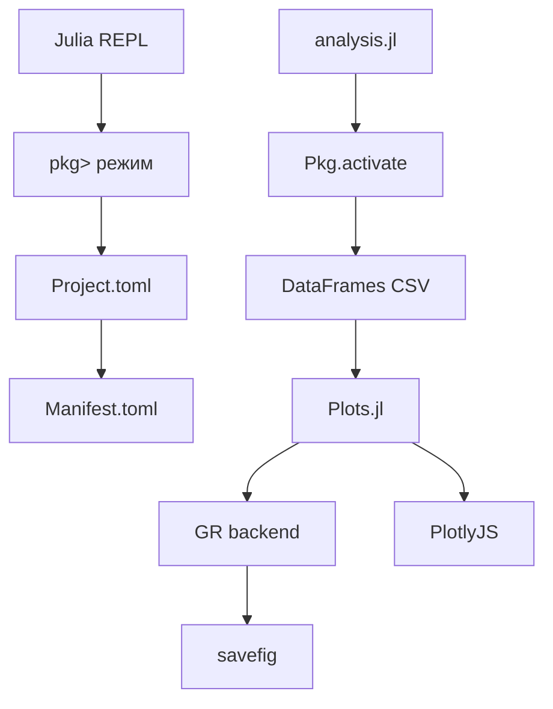
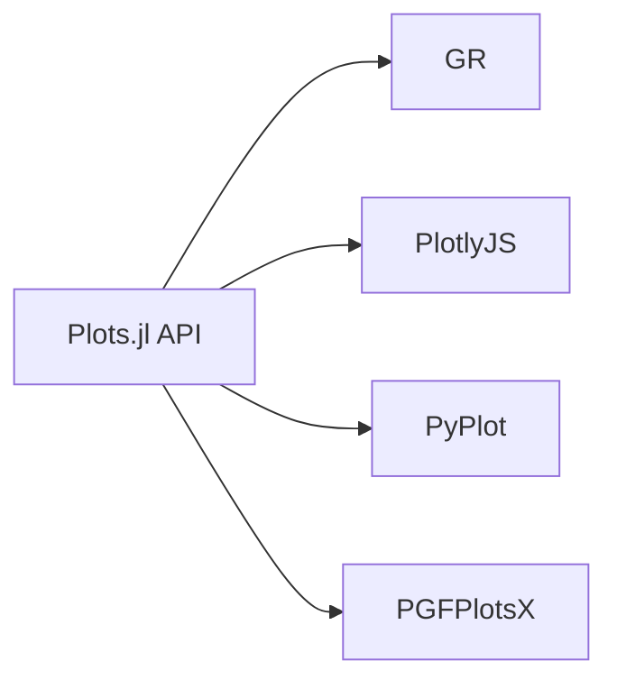
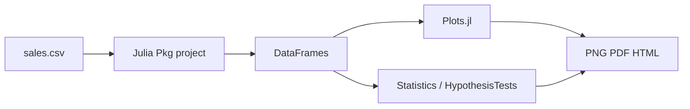

# Pkg и Plots в Julia

<div class="article-tags">
  <span class="tag tag-required">ОБЯЗАТЕЛЬНО</span>
  <span class="tag tag-beginner">ДЛЯ НОВИЧКОВ</span>
</div>

<span class="complexity-badge">Разработчику</span>
<span class="complexity-badge">Архитектору</span>

**Дальше:** [управление потоком](./5.md) · [справочник Julia](./3.md)

---

## Pkg и Plots в Julia

**Pkg** — встроенный менеджер пакетов Julia (реестр General на GitHub). **Plots.jl** — унифицированный API поверх бэкендов (GR, Plotly, PyPlot) для научной визуализации.

Julia сочетает удобство скриптового языка и производительность JIT-компиляции — см. [раздел Julia](./intro.md). Практикум **по шагам** — окружение Pkg, `Project.toml`, DataFrames, первые графики, бэкенды, типичные ошибки.

| Шаг | Тема | Зачем |
|-----|------|-------|
| 1 | REPL-режим pkg | Установка пакетов |
| 2 | Project.toml и Manifest | Воспроизводимость |
| 3 | Активация окружения | Изолировать проект |
| 4 | DataFrames + CSV | Таблицы как в R |
| 5 | Plots.jl — линии и scatter | Первые графики |
| 6 | Бэкенды и subplots | Выбор рендерера |
| 7 | Сквозной analysis.jl | Закрепление |
| 8 | Запуск и notebook | CLI и Pluto |

| Материал | Зачем |
|----------|-------|
| [Основы Julia](./2.md) | REPL, синтаксис, массивы |
| [Типы и диспетчеризация](./4.md) | Broadcast `sin.(x)` |
| [Управление потоком](./5.md) | `if`, циклы |
| [Первая программа](./7.md) | Установка Julia |
| [tidyverse в R](/encyclopedia/5-languages/5-23-r/104) | Тот же CSV в R |
| [pandas](/encyclopedia/3-data-markup/3-11-analiz-dannyh/427) | Аналог в Python |
| [Анализ данных](/encyclopedia/3-data-markup/3-11-analiz-dannyh/intro) | Теория ETL |

### Навигация по блоку Julia

- Предыдущий шаг: [Первая программа](./7.md), [Типы](./4.md)
- Вы здесь: [Pkg и Plots](./104.md)
- Следующий шаг: [Управление потоком](./5.md), [Справочник](./3.md)
- Обзор: [Julia — о разделе](./intro.md)



<div class="callout callout--tip">
  <div class="callout-title">VS Code + Julia</div>

  <div class="callout-body">
  Расширение Julia в VS Code / Cursor запускает REPL с активным окружением проекта. Установка Julia — в <a href="./7.md">первой программе</a>.
</div>
</div>

---

## Шаг 1 — REPL-режим Pkg

В Julia REPL нажмите **`]`** — приглашение сменится на `pkg>`:

```julia
# pkg> режим (после нажатия ])
add Plots DataFrames CSV
status
st
rm OldPackage
```

Выход из pkg-режима — **Backspace** или **Ctrl+C**.

Те же операции из обычного режима:

```julia
using Pkg
Pkg.add("Plots")
Pkg.add(["DataFrames", "CSV"])
Pkg.status()
Pkg.rm("OldPackage")
```

Разбор:
- `add` записывает пакет в активный `Project.toml` и обновляет `Manifest.toml`.
- `status` показывает прямые зависимости проекта.
- Первая установка пакета **компилирует** его — это может занять минуты.

Реестр **General**: [github.com/JuliaRegistries/General](https://github.com/JuliaRegistries/General).

---

## Шаг 2 — структура проекта

```text
myanalysis/
├── Project.toml
├── Manifest.toml
├── analysis.jl
└── data/
    └── sales.csv
```

### Project.toml

```toml
name = "MyAnalysis"
uuid = "a1b2c3d4-e5f6-7890-abcd-ef1234567890"
version = "0.1.0"
authors = ["You <you@example.com>"]

[deps]
CSV = "336ed68f-0bac-5ca0-87d4-7b16caf5d00b"
DataFrames = "a93c6f00-e57d-5684-b7b6-d8193f3e46c0"
Plots = "91a5bcdd-55d7-5caf-9e0b-520d859cae80"

[compat]
julia = "1.10"
Plots = "1.39"
```

| Файл | Роль |
|------|------|
| **Project.toml** | Имя проекта, прямые зависимости, compat |
| **Manifest.toml** | Полный lock всех транзитивных версий |

**Коммитьте `Manifest.toml`** в приложениях — так коллеги получат те же версии. Для библиотек иногда коммитят только `Project.toml`.

Аналог: **venv + requirements.txt** в Python, **renv** в R — [tidyverse 104](/encyclopedia/5-languages/5-23-r/104).

---

## Шаг 3 — активация окружения

```julia
using Pkg
Pkg.activate(".")
Pkg.instantiate()   # установить из Manifest
```

В скрипте **первые строки**:

```julia
using Pkg
Pkg.activate(@__DIR__)
```

`@__DIR__` — каталог файла скрипта; окружение подхватывается при запуске из любой папки.

Запуск из терминала:

```bash
julia --project=. analysis.jl
```

Флаг `--project=.` эквивалентен `Pkg.activate` для одной сессии.

### Совместимость версий

```julia
# pkg>
add DataFrames@1.6
update
```

Секция `[compat]` ограничивает допустимые версии. Julia **1.x** следует SemVer; мажорные обновления пакетов могут ломать API — фиксируйте Manifest перед релизом отчёта.

---

## Шаг 4 — DataFrames и CSV

```julia
using Pkg
Pkg.activate(@__DIR__)

using DataFrames, CSV

df = CSV.read("data/sales.csv", DataFrame)
first(df, 5)
describe(df)
```

Фильтрация и агрегаты:

```julia
using Statistics

positive = filter(row -> row.amount > 0, df)

by_region = combine(
  groupby(positive, :region),
  :amount => sum => :total,
  :amount => length => :n,
  :amount => mean => :avg
)

sort!(by_region, :total, rev=true)
```

Сравнение с dplyr — [tidyverse](/encyclopedia/5-languages/5-23-r/104):

| Задача | R (dplyr) | Julia (DataFrames) |
|--------|-----------|-------------------|
| Фильтр | `filter(amount > 0)` | `filter(row -> row.amount > 0, df)` |
| Группировка | `group_by(region)` | `groupby(df, :region)` |
| Агрегат | `summarise(total = sum(amount))` | `combine(..., :amount => sum => :total)` |

Точка в `sin.(x)` и `row.amount` — **broadcast** и доступ к полям — см. [типы](./4.md).

---

## Шаг 5 — Plots.jl, первый график

```julia
using Plots
gr()   # бэкенд GR — быстрый локально

x = 0:0.1:2π
y = sin.(x)

plot(x, y,
  label="sin",
  title="Демо",
  xlabel="x",
  ylabel="y",
  linewidth=2
)

savefig("sin.png")
```

Разбор:
- `0:0.1:2π` — диапазон с шагом 0.1.
- `sin.(x)` — поэлементный синус (broadcast).
- `plot` создаёт новый график; `savefig` пишет PNG в текущий каталог.
- `gr()` выбирает бэкенд **GR** до первого `plot`.

### Несколько серий на одном графике

```julia
plot(x, sin.(x), label="sin", color=:blue)
plot!(x, cos.(x), label="cos", color=:red)
```

Суффикс **`!`** — добавить на **текущий** график (`plot!`, `scatter!`).

### Scatter и histogram

```julia
scatter(df.amount, df.price,
  xlabel="Amount",
  ylabel="Price",
  legend=false,
  alpha=0.6
)

histogram(df.amount,
  bins=20,
  title="Распределение amount",
  xlabel="Amount",
  fillalpha=0.5
)
```

### Столбчатый график из агрегата

```julia
bar(by_region.region, by_region.total,
  xlabel="Region",
  ylabel="Total",
  legend=false,
  color=:steelblue
)
```

---

## Шаг 6 — бэкенды и subplots

| Backend | Когда использовать |
|---------|-------------------|
| **GR** | Локально, быстро, PNG/PDF |
| **PlotlyJS** | Интерактив в браузере |
| **PyPlot** | Привычный matplotlib |
| **PGFPlotsX** | LaTeX-публикации |
| **UnicodePlots** | Терминал без GUI |

```julia
using PlotlyJS
plotlyjs()

plot(x, sin.(x), label="sin")
# интерактивное окно или HTML
```

Установка бэкенда:

```julia
# pkg>
add PlotlyJS
```

### Subplots

```julia
p1 = plot(x, sin.(x), title="sin")
p2 = plot(x, cos.(x), title="cos")
plot(p1, p2, layout=(2, 1), size=(800, 600))
savefig("sin_cos.png")
```

`layout=(rows, cols)` задаёт сетку. `size` — пиксели итоговой картинки.



<div class="callout callout--info">
  <div class="callout-title">Plots и Makie</div>

  <div class="callout-body">
  <strong>Plots.jl</strong> — единый простой API для старта. <strong>Makie.jl</strong> — современная grammar-of-graphics с большими возможностями 3D и интерактива. Для отчётов часто хватает Plots + GR.
</div>
</div>

---

## Шаг 7 — сквозной analysis.jl

```julia
# analysis.jl
using Pkg
Pkg.activate(@__DIR__)

using CSV, DataFrames, Statistics, Plots

gr()

# 1. Загрузка
df = CSV.read("data/sales.csv", DataFrame)

# 2. Очистка
clean = filter(row -> row.amount > 0, df)

# 3. Агрегат по регионам
summary_df = combine(
  groupby(clean, :region),
  :amount => sum => :total
)
sort!(summary_df, :total, rev=true)

# 4. Графики
bar(summary_df.region, summary_df.total,
  title="Продажи по регионам",
  xlabel="Регион",
  ylabel="Сумма",
  legend=false
)
savefig("report/bar.png")

dates = sort(unique(clean.date))
# упрощённо: линия сумм по дате (если date в данных)
by_date = combine(groupby(clean, :date), :amount => sum => :daily_total)
plot(by_date.date, by_date.daily_total,
  marker=:circle,
  title="Динамика по дням",
  xlabel="Дата",
  ylabel="Сумма"
)
savefig("report/line.png")

println("Готово: report/bar.png, report/line.png")
```

Создайте каталоги заранее:

```bash
mkdir -p myanalysis/data myanalysis/report
```

Сравните вывод с [tidyverse pipeline](/encyclopedia/5-languages/5-23-r/104) на том же `sales.csv`.

---

## Шаг 8 — запуск, notebook, CI

### Терминал

```bash
cd myanalysis
julia --project=. analysis.jl
```

### Pluto.jl

```julia
# pkg>
add Pluto
```

```julia
using Pluto
Pluto.run()
```

Notebook с реактивными ячейками — удобно для исследования данных.

### IJulia (Jupyter)

```julia
Pkg.add("IJulia")
```

### Минимальный CI

```yaml
- uses: julia-actions/setup-julia@v2
  with:
    version: '1.10'
- run: julia --project=. -e 'using Pkg; Pkg.instantiate(); include("analysis.jl")'
```

---

## Связь с разделом анализа данных

| Задача | Julia-пакет |
|--------|-------------|
| Таблицы, ETL | DataFrames, CSV |
| Статистика | StatsBase, HypothesisTests |
| ML | Flux.jl, MLJ |
| Большие данные | Arrow, DuckDB.jl |
| Визуализация | Plots, Makie |

Обзор — [анализ данных](/encyclopedia/3-data-markup/3-11-analiz-dannyh/intro); big data — [3.11/11](/encyclopedia/3-data-markup/3-11-analiz-dannyh/11); численные методы — [математическое программирование](/encyclopedia/3-data-markup/3-12-matematicheskoe-programmirovanie/intro).

### Plots.jl, ggplot2 и matplotlib

| Аспект | Plots.jl | ggplot2 | matplotlib |
|--------|----------|---------|------------|
| API | Единый слой | Grammar of graphics | Императивный + OO |
| Большие массивы | Хорошо с GR | Средне | Зависит от backend |
| Экосистема stats | Растёт | Зрелая | Зрелая |

Julia удобна, когда **один язык** и считает, и рисует на больших массивах без вызова Python.

---

## Типичные ошибки Pkg и Plots

| Симптом | Причина | Решение |
|---------|---------|---------|
| `Package X not found` | Не в `[deps]` | `Pkg.add("X")`, `instantiate` |
| Разные версии на машинах | Нет Manifest в git | Коммит `Manifest.toml` |
| Долгий precompile | Первый `add` | Нормально; кэш в `~/.julia` |
| Конфликт версий | Несовместимый compat | `Pkg.resolve()`, правка `[compat]` |
| Пустой график | Неверные столбцы | `names(df)`, `describe` |
| `GR` не найден | Нет пакета GR | `add Plots` подтянет GR |
| Старый график в файле | `savefig` без имени | Явный путь `savefig("out.png")` |
| Медленный первый plot | JIT компиляция | Второй вызов быстрее |

---

## Практический чек-лист

1. `mkdir myanalysis && cd myanalysis`
2. Julia: `] activate .` → `add CSV DataFrames Plots`
3. Положить `sales.csv` в `data/`
4. Написать `analysis.jl` с `activate`, read → filter → plot → `savefig`
5. `julia --project=. analysis.jl` — файлы в `report/`
6. Закоммитить `Project.toml` и `Manifest.toml`
7. Сравнить с [R tidyverse](/encyclopedia/5-languages/5-23-r/104) на том же CSV

---

## Упражнения

1. Создайте проект с `activate .` и добавьте только `CSV` и `DataFrames`; выведите `describe` для `sales.csv`.
2. Постройте `histogram` и `density` для столбца `amount` на одном `layout=(2,1)`.
3. Переключите бэкенд на `plotlyjs()` и сохраните интерактивный HTML (подсказка: `plotly()` extension).
4. Зафиксируйте `[compat] julia = "1.10"` и проверьте `Pkg.status()` на второй машине с `instantiate`.
5. Перепишите `combine(groupby(...))` в цикл по `groupby` — сравните читаемость с [dplyr](/encyclopedia/5-languages/5-23-r/104).

---

## FAQ

**Нужен ли отдельный conda/venv?**
Нет. Julia Pkg — встроенные окружения на проект.

**Где хранятся пакеты?**
`~/.julia` (или `%USERPROFILE%\.julia` на Windows). Каталог большой — не коммитьте в git.

**Plots или Makie?**
Plots — быстрый старт; Makie — сложные 3D и кастомная графика.

**Почему первый запуск долгий?**
JIT компилирует методы под конкретные типы. Повторные вызовы быстрее.

**Как обновить пакеты?**
`] up` или `Pkg.update()`; проверьте, что отчёты воспроизводятся.

**Есть ли renv для Julia?**
Роль renv выполняют `Project.toml` + `Manifest.toml`.

---

## Глоссарий

| Термин | Определение |
|--------|-------------|
| **Pkg** | Встроенный менеджер пакетов Julia |
| **General** | Основной реестр пакетов |
| **Project.toml** | Манифест прямых зависимостей |
| **Manifest.toml** | Lock-файл всех версий |
| **activate** | Привязка сессии к окружению проекта |
| **instantiate** | Установка пакетов по Manifest |
| **compat** | Ограничения совместимости версий |
| **Backend** | Движок отрисовки Plots (GR, Plotly…) |
| **Broadcast** | Поэлементные операции с точкой `.` |
| **precompile** | Кэш скомпилированного пакета |

---

## Что дальше

- **Makie.jl** — grammar-of-graphics и 3D.
- **BenchmarkTools** — профилирование hot loops.
- **PackageCompiler.jl** — standalone binary.
- **DifferentialEquations** — модели и визуализация траекторий.
- Теория типов — [типы и диспетчеризация](./4.md).

<div class="callout callout--tip">
  <div class="callout-title">Итог</div>

  <div class="callout-body">
  <strong>Pkg</strong> даёт воспроизводимое окружение; <strong>Plots</strong> — быстрый путь от численного эксперимента к картинке для отчёта. Освойте <code>activate</code>, <code>Manifest</code> и один бэкенд (GR) — дальше масштабируйте на [анализ данных](/encyclopedia/3-data-markup/3-11-analiz-dannyh/intro).
</div>
</div>

<div class="callout callout--warning">
  <div class="callout-title">Production-отчёты</div>

  <div class="callout-body">
  Фиксируйте версию Julia в CI, коммитьте <code>Manifest.toml</code>, сохраняйте графики с явным <code>dpi</code> и размером. Для публикаций рассмотрите <code>PGFPlotsX</code> или экспорт SVG.
</div>
</div>

---

## Шаг 9 — атрибуты графика Plots

```julia
plot(x, sin.(x),
  label="sin",
  linewidth=3,
  linecolor=:blue,
  linestyle=:dash,
  marker=:circle,
  markersize=4,
  background_color=:white,
  foreground_color=:black,
  grid=true,
  legend=:topright,
  size=(900, 500),
  dpi=150
)
```

| Атрибут | Эффект |
|---------|--------|
| `linewidth` | Толщина линии |
| `linestyle` | `:solid`, `:dash`, `:dot` |
| `marker` | Маркер точки |
| `alpha` | Прозрачность |
| `size` | Размер canvas в пикселях |
| `dpi` | Плотность при сохранении |

---

## Шаг 10 — групповые цвета из DataFrame

```julia
using CategoricalArrays

clean = copy(df)
clean.region = categorical(clean.region)

scatter(clean.amount, clean.price,
  group=clean.region,
  xlabel="Amount",
  ylabel="Price",
  legend=:topright
)
```

`group` раскрашивает серии по столбцу — аналог `color = region` в ggplot2.

---

## Шаг 11 — статистические графики

```julia
using Statistics

histogram(df.amount, bins=30, normalize=:probability)
histogram(df.amount, bins=30, normalize=:density)

# boxplot по группам — вектор групп
boxplot(clean.region, clean.amount, legend=false)
```

```julia
# violin — через StatsPlots
# pkg> add StatsPlots
using StatsPlots
@df clean violin(:region, :amount, legend=false)
```

---

## Шаг 12 — работа с датами

```julia
using Dates

clean = transform(clean, :date => ByRow(Date) => :date)
sort!(clean, :date)

by_date = combine(groupby(clean, :date), :amount => sum => :daily_total)

plot(by_date.date, by_date.daily_total,
  marker=:circle,
  xlabel="Дата",
  ylabel="Сумма",
  xrotation=45
)
```

Julia `Dates` похож на **lubridate** в R — см. [tidyverse](/encyclopedia/5-languages/5-23-r/104).

---

## Шаг 13 — цепочка как в dplyr

```julia
using DataFrames, Statistics

result = df |>
  (t -> filter(row -> t.amount > 0, t)) |>
  (t -> groupby(t, :region)) |>
  (g -> combine(g, :amount => sum => :total, :amount => mean => :avg)) |>
  (t -> sort(t, :total, rev=true))
```

Оператор `|>` (pipe) в Julia 1.5+ читается как pipeline в R.

Альтернатива с `DataFramesMeta`:

```julia
# pkg> add DataFramesMeta
using DataFramesMeta

@chain df begin
  @filter(:amount > 0)
  @group_by(:region)
  @summarize(:total = sum(:amount), :avg = mean(:amount))
  @orderby(:total, order=Rev)
end
```

---

## Шаг 14 — экспорт и интерактив

```julia
using Plots
gr()

p = plot(x, sin.(x), label="sin")
savefig(p, "out/sin.png")
savefig(p, "out/sin.pdf")

# PlotlyJS — HTML
using PlotlyJS
plotlyjs()
p2 = plot(x, cos.(x))
# savefig(p2, "out/cos.html")  # при поддержке бэкенда
```

Для публикаций PDF через **PGFPlotsX** — векторная графика для LaTeX.

---

## Шаг 15 — окружение в Jupyter и Pluto

### IJulia

```julia
using Pkg
Pkg.add("IJulia")
# затем в Jupyter: New → Julia notebook
```

Первая ячейка:

```julia
using Pkg
Pkg.activate(".")
using CSV, DataFrames, Plots
gr()
```

### Pluto

```julia
using Pluto
Pluto.run(1234)
```

Pluto реактивно пересчитывает ячейки при изменении зависимостей — удобно для обучения.

---

## Шаг 16 — сравнение цикла и broadcast

```julia
# медленнее — scalar loop
y_loop = Vector{Float64}(undef, length(x))
for i in eachindex(x)
  y_loop[i] = sin(x[i])
end

# быстрее — broadcast
y_bc = sin.(x)

@assert y_loop ≈ y_bc
```

Broadcast — основа производительности Julia на численных графиках. Теория — [типы и диспетчеризация](./4.md).

---

## Шаг 17 — интеграция с разделом анализа



| Этап аналитики | Julia | R | Python |
|----------------|-------|---|--------|
| Загрузка | CSV.jl | readr | pandas |
| Очистка | filter transform | dplyr | pandas |
| Визуализация | Plots | ggplot2 | matplotlib |
| Отчёт | Pluto / Jupyter | R Markdown | Quarto |

Сквозной контекст — [анализ данных](/encyclopedia/3-data-markup/3-11-analiz-dannyh/intro).

---

## Дополнительные упражнения

6. Постройте `heatmap` случайной матрицы 10×10 с `color=:viridis`.
7. Сохраните один график в PNG 300 dpi и PDF — сравните размер файлов.
8. Используйте `@time` для сравнения `sin.(x)` и цикла на `x` длиной 1_000_000.
9. Добавьте `StatsPlots` и постройте `violin` по `region`.
10. Создайте Pluto-notebook с `activate` и тремя ячейками read → plot → savefig.

---

## Дополнительный FAQ

**Почему график не обновляется в скрипте?**
`plot` возвращает объект; передайте его в `savefig(plot, path)`.

**Как задать шрифт?**
Зависит от бэкенда; GR поддерживает ограниченный набор. Для полного контроля — PGFPlotsX.

**Нужен ли Python для PyPlot?**
Да, бэкенд PyPlot вызывает matplotlib — установите Python и PyCall.

**Как ускорить повторные plot?**
Первый вызов компилирует; держите сессию Julia открытой или используйте `--project` в одном процессе.

**Где хранить большие данные?**
Arrow.jl, DuckDB.jl — см. [big data в анализе](/encyclopedia/3-data-markup/3-11-analiz-dannyh/11).

---

## Разбор analysis.jl — блоками

| Блок | Ответственность |
|------|-----------------|
| `Pkg.activate` | Правильное окружение |
| `CSV.read` | Ввод |
| `filter` / `groupby` | Трансформация |
| `gr()` | Выбор рендерера |
| `bar` / `plot` | Визуализация |
| `savefig` | Артефакт для отчёта |
| `println` | Подтверждение в CI |

## Полный walkthrough — myanalysis с тестом в CI

### Структура

```text
myanalysis/
├── Project.toml
├── Manifest.toml
├── data/sales.csv
├── src/
│   └── MyAnalysis.jl
├── test/
│   └── runtests.jl
└── analysis.jl
```

### src/MyAnalysis.jl

```julia
module MyAnalysis

using CSV, DataFrames, Statistics

export load_sales, summarize_by_region

function load_sales(path::AbstractString)
  CSV.read(path, DataFrame)
end

function summarize_by_region(df::DataFrame)
  positive = filter(row -> row.amount > 0, df)
  combined = combine(
    groupby(positive, :region),
    :amount => sum => :total,
    :amount => length => :n
  )
  sort!(combined, :total, rev=true)
end

end
```

### test/runtests.jl

```julia
using Test
using DataFrames
include("../src/MyAnalysis.jl")
using .MyAnalysis

@testset "summarize" begin
  df = DataFrame(region=["N","N","S"], amount=[10.0, 5.0, 0.0])
  result = summarize_by_region(df)
  @test nrow(result) == 2
  @test result[1, :total] == 15.0
end
```

### Запуск тестов

```julia
# pkg> test
```

```bash
julia --project=. -e 'using Pkg; Pkg.test()'
```

### analysis.jl — точка входа

```julia
using Pkg
Pkg.activate(@__DIR__)
using CSV, DataFrames, Plots
include("src/MyAnalysis.jl")
using .MyAnalysis

gr()
df = load_sales("data/sales.csv")
summary_df = summarize_by_region(df)
bar(summary_df.region, summary_df.total, legend=false)
savefig("report/bar.png")
```

Сравните `summary_df` с выводом [tidyverse](/encyclopedia/5-languages/5-23-r/104) на том же файле.

---

## Ссылки на смежные темы

| Тема | Материал |
|------|----------|
| Основы Julia | [2.md](./2.md) |
| Broadcast | [4.md](./4.md) |
| Первая программа | [7.md](./7.md) |
| tidyverse | [R 104](/encyclopedia/5-languages/5-23-r/104) |
| Анализ данных | [3.11](/encyclopedia/3-data-markup/3-11-analiz-dannyh/intro) |
| Численные методы | [3.12](/encyclopedia/3-data-markup/3-12-matematicheskoe-programmirovanie/intro) |

{/* sidebar-collections */}

---

## В подборках

Статья входит в маршрут [Julia](./intro.md) и сопоставляется с [tidyverse в R](/encyclopedia/5-languages/5-23-r/104) и [pandas](/encyclopedia/3-data-markup/3-11-analiz-dannyh/427) в рамках [анализа данных](/encyclopedia/3-data-markup/3-11-analiz-dannyh/intro).

{/* /sidebar-collections */}

---

---

## Практикум — шаг 9: StatsPlots

```julia
using StatsPlots
histogram(df.amount, bins=20, label="")
```

---

## Практикум — шаг 10: DataFramesMeta

```julia
using DataFramesMeta

@chain df begin
  @filter(:amount .> 0)
  @transform(:tax = :amount .* 0.2)
  @by(:region, :total = sum(:amount))
end
```

---

## Практикум — шаг 11: Dates и группировка

```julia
using Dates

df[!, :month] = map(d -> Dates.month(d), df.date)
combine(groupby(df, :month), :amount => sum => :total)
```

---

## Практикум — шаг 12: PackageCompiler (обзор)

```julia
using PackageCompiler
create_app("analysis.jl", "MyApp")
```

Standalone binary для отчётов без установки Julia на целевой машине.

---

## Воркшоп Julia (60 мин)

| Мин | Задача |
|-----|--------|
| 0–10 | activate + add |
| 10–25 | CSV read |
| 25–40 | combine groupby |
| 40–55 | bar + savefig |
| 55–60 | --project run |

---

## Troubleshooting Julia

| Симптом | Решение |
|---------|---------|
| Package not found | Pkg.add, instantiate |
| Manifest drift | commit Manifest |
| precompile slow | норма первый раз |
| empty plot | names(df) |

---

## FAQ Julia

**conda?** — не нужен, Pkg встроен.

**Plots vs Makie?** — старт vs 3D.

**Первый запуск медленный?** — JIT warmup.

**renv аналог?** — Project + Manifest.

---

---

## Дополнительные сценарии (Pkg/Plots)

### Сценарий A: activate в скрипте

```julia
using Pkg; Pkg.activate(@__DIR__)
```

### Сценарий B: pkg> add и status

```julia
# ] add CSV
# st
```

### Сценарий C: GR backend

```julia
using Plots; gr()
plot(1:10, rand(10))
savefig("test.png")
```

### Сценарий D: groupby combine

```julia
combine(groupby(df, :region), :amount => sum => :total)
```

### Сценарий E: Manifest на второй машине

```bash
git clone ... && julia --project=. -e 'using Pkg; Pkg.instantiate()'
```

---

## Упражнения — контрольная точка

6. DataFramesMeta @chain pipeline.
7. plotlyjs() + сохранение HTML.
8. subplot sin/cos layout (2,1).
9. CI с julia-actions/setup-julia.
10. Тот же CSV что в [R 104](/encyclopedia/5-languages/5-23-r/104).
