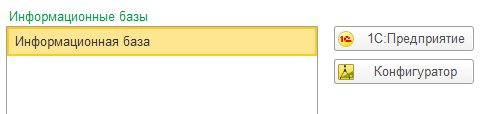

import ExternalPlayEmbed from '@site/src/components/ExternalPlayEmbed';


# Платформа 1С

<div class="article-tags">
  <span class="tag tag-required">ОБЯЗАТЕЛЬНО</span>
  <span class="tag tag-beginner">ДЛЯ НОВИЧКОВ</span>
</div>

<span class="complexity-badge">Разработчику</span>
<span class="complexity-badge">Архитектору</span>

<ExternalPlayEmbed example="data-markup/language-intro-play" title="Обзор языка разметки/данных" minHeight={520} playProps={{ topic: '1c' }} />

---

## Платформа 1С

### Что такое встроенный язык 1С?

**Встроенный язык 1С (BSL)** — это проприетарный скриптовый язык программирования со следующими особенностями:

- **Типизация** — преимущественно динамическая (тип определяется при присвоении); возможна явная статическая типизация переменных; проверка на этапе компиляции конфигурации в Конфигураторе.
- **Парадигма** — процедурный и объектно-ориентированный — модули с процедурами и функциями, объектная модель метаданных (справочники, документы, регистры), событийная обработка.
- **Уровень** — высокоуровневый; синтаксис на русском языке, близкий к естественным формулировкам (`Если…То…`, `Пока…Цикл`).
- **Выполнение** — модули компилируются при сохранении конфигурации и исполняются в управляемой среде платформы (сервер 1С и клиент); не автономный исполняемый файл.
- **Память** — автоматическая (GC): менеджер памяти и сборщик мусора на стороне runtime платформы.
- **Платформа** — кроссплатформенный через **1С:Предприятие** (Windows; с 8.3 — Linux, macOS; мобильные iOS/Android); управляемый runtime внутри платформы; не транспилируется в другой язык — исполняется средой 1С.
- **Формат разработки** — требует структуры конфигурации (метаданные, модули в **Конфигураторе** или **1С:EDT**); не скриптовый "один `.bsl`-файл".
- **Направление** — автоматизация бизнеса — ERP, бухучёт, торговля, склад, кадры, отчётность, интеграции с банками и внешними системами; не универсальный язык.
- **REPL** — классического REPL в терминале нет; интерактивная работа в **Конфигураторе** (отладчик, точки останова, выполнение фрагментов) и в режиме **1С:Предприятие**.
- **Поколение** — классический (корни линейки 7.7, 1990-е) и современный (активно развиваемая линейка 8.x).
- **Параллелизм и асинхронность** — нативных потоков и `async`/`await` в языке нет; фоновые задания, очереди сообщений, серверные вызовы и распределённые ИБ — механизмы платформы.
- **Безопасность** — относительно "безопасный" для прикладного кода: нет ручного управления памятью и указателей; транзакции, блокировки, `Попытка…Исключение`, ролевая модель прав; не memory-safe уровня Rust, но без классических уязвимостей C/C++.

Если какой-то пункт из списка непонятен — подробные определения и примеры в [Язык программирования](/encyclopedia/4-code-dev/4-02-chto-takoe-kod-i-kak-on-rabotaet/101).

<ExternalPlayEmbed example="languages/one-c-platform-emulator" title="Эмулятор платформы 1С" minHeight={560} />

---

### Что такое 1С

Язык 1С позволяет разработчику:
- создавать алгоритмы проведения, прописывать правил изменения остатков товаров на складах;
- управлять формами и описанием поведения интерфейса;
- писать логику для обмена данными.

Пишут разработчики 1С в конфигураторе платформы 1С:Предприятие.

**Платформа 1С:Предприятие** представляет собой фундаментальную программную среду, предназначенную для запуска специализированных бизнес-приложений. Это комплекс библиотек, механизмов управления памятью, обработки данных, сетевого взаимодействия и графического интерфейса. Платформа не содержит готовой логики учета или торговли, но предоставляет инструменты для их реализации. Она выступает в роли операционной системы для прикладных решений, обеспечивая выполнение кода, управление ресурсами компьютера и взаимодействие с пользователем.

**Прикладное решение (конфигурация)** — это набор правил, описывающих бизнес-процессы конкретной организации. Конфигурация определяет структуру хранимых данных, формы документов, алгоритмы расчетов и отчетность. Примеры таких решений включают "Бухгалтерия предприятия", "Управление торговлей" или "Зарплата и управление персоналом". Прикладное решение работает исключительно внутри среды платформы. Без установленной платформы программа 1С не запустится.



Отношения между платформой и конфигурацией строятся по принципу базы и надстройки. Платформа является базовым слоем, на котором функционирует логика приложения. Одна версия платформы может одновременно обслуживать множество различных конфигураций. Разработчики указывают минимально требуемую версию платформы в метаданных каждой конфигурации. Система автоматически проверяет соответствие перед запуском. Если версия платформы ниже требуемой, приложение выдаст ошибку и не запустится. Это гарантирует стабильность работы и корректное использование новых возможностей среды.

Технологическая платформа "1С:Предприятие" — **программная оболочка над базой данных**. Сама платформа написана на **C++**, **C#** и **SQL**; прикладная логика — на **встроенном языке** (BSL). Клиент работает под **Windows**, с версии **8.3** также под **Linux** и **macOS**; сервер 1С с **8.1** доступен на Windows и Linux. Мобильные клиенты поддерживают **iOS** и **Android**.

| Слой | Варианты хранения данных |
| :--- | :--- |
| Файловый режим | DBF (7.7), собственный **1CD** (с 8.0) |
| Клиент-сервер | **Microsoft SQL Server**, с 8.1 — **PostgreSQL**, с 8.2 — **Oracle**, также **IBM DB2** и сторонние СУБД через проекты партнёров |

Интеграция с внешним миром исторически строилась на **OLE**, **DDE**, **COM**; в современных релизах — **HTTP-сервисы**, **OData**, **веб-сервисы**, обмен XML/JSON.

Вне экосистемы учёта **1С** часто воспринимают как "бухгалтерию, а не разработку". На деле это платформа с встроенным языком, СУБД и сервером приложений — см. [историю](./11.md#в-рунет-дискурсе). В резюме и чатах точнее писать **разработчик 1С** или **конфигуратор**, а не обобщённые шутки из форумов.

Программное обеспечение 1С:Предприятие поддерживает два основных режима работы. Режим клиент-сервер распределяет вычислительную нагрузку между сервером базы данных и рабочими станциями пользователей. Клиентская часть отвечает за отображение интерфейса и сбор действий пользователя. Серверная часть обрабатывает запросы к данным и выполняет бизнес-правила. Однопроцессный режим подразумевает работу всех компонентов в рамках одного процесса на одной машине. Этот режим удобен для небольших организаций и тестирования.

Платформа поддерживает фоновые задания, серверные вызовы и распределённые информационные базы. Длительные операции можно вынести из интерактивного сеанса, а одновременную запись в данные защищают транзакции и блокировки на уровне СУБД.

---

### Классификация прикладных решений

Прикладные решения в экосистеме 1С делятся на категории в зависимости от функционального назначения и масштаба использования.

**Базовые конфигурации** поставляются только фирмой "1С", работают на облегчённой лицензии платформы и **не допускают изменения** метаданных (их можно преобразовать в типовые). **Типовые** — тиражные "коробочные" решения с правом доработки. В профессиональном сленге **"правленая"** типовая — сильно изменённая под заказчика; **"самописная"** — конфигурация, разработанная с нуля вне типовой линейки.

**Типовые конфигурации** — это готовые программы, разработанные компанией "1С" и доступные для покупки лицензионным пользователям. Эти решения содержат полный набор функций для автоматизации конкретных видов деятельности. Примеры типовых конфигураций:
*   "Бухгалтерия предприятия" — универсальное решение для бухгалтерского и налогового учета;
*   "Управление торговлей" — система для автоматизации продаж, закупок и складского учета;
*   "Зарплата и управление персоналом" — модуль для расчета заработной платы и кадрового учета;
*   "Розница" — программа для автоматизации торговых точек с поддержкой кассовых аппаратов;
*   "Комплексная автоматизация" — объединенное решение для крупных предприятий;
*   **"1С:ERP Управление предприятием 2"** (с 2013 года) — флагман класса ERP на платформе 8.3 для крупного бизнеса.

**Уникальные конфигурации** создаются партнерами компании "1С" или внутренними отделами информационных технологий крупных организаций. Эти решения разрабатываются под специфические требования заказчика и отличаются наличием уникальных бизнес-процессов. Уникальная конфигурация может включать нестандартные алгоритмы расчетов, специфические формы отчетности или интеграцию с редкими внешними системами.

**Отраслевые решения** адаптированы под особенности конкретных сфер деятельности. Они учитывают законодательные требования и специфику работы в медицине, образовании, строительстве или сельском хозяйстве. Такие решения часто базируются на типовых конфигурациях, но содержат дополнительные модули и настройки.

**Региональные решения** предназначены для работы в определенных странах или регионах. Они включают поддержку местных языков, валют, налоговых ставок и законодательных норм. Например, существуют версии для Беларуси, Казахстана, Украины, соответствующие местному законодательству.

**Облачные решения** размещаются на удаленных серверах провайдера и доступны через интернет. Пользователи не устанавливают программу на свои компьютеры, а работают в веб-интерфейсе. Облачная модель снижает затраты на инфраструктуру и упрощает обновление системы. Данные хранятся в защищенных дата-центрах.

**Мобильные приложения** являются частью экосистемы 1С и позволяют работать с данными через смартфоны и планшеты. Они обеспечивают доступ к справочникам, документам и отчетам в любом месте. Мобильные приложения синхронизируют изменения с основной базой данных.

Интерфейс каждого прикладного решения имеет свою структуру и логику навигации. Стандартный интерфейс включает верхнюю панель меню, боковую панель навигации, область рабочей области и нижнюю панель состояния. Меню содержит команды для работы с документами, справочниками, отчетами и журналами. Панель навигации позволяет быстро переходить к нужным разделам. Рабочая область отображает текущий объект: форму документа, таблицу списка или отчет. Нижняя панель показывает статус системы, количество записей и сообщения об ошибках.

Хранение данных в 1С осуществляется в файловых базах данных или в серверных СУБД. Файловая база данных представляет собой один или несколько файлов на диске. Все данные, включая метаданные и пользовательские действия, записываются в эти файлы. Этот формат удобен для небольших организаций и тестирования. Серверная база данных использует внешние системы управления базами данных, такие как Microsoft SQL Server, PostgreSQL, Oracle DB или IBM Db2. Серверная модель обеспечивает высокую производительность, надежность и возможность одновременной работы множества пользователей.

Конфигурация определяет структуру хранимых данных. Метаданные описывают объекты — справочники, документы, регистры сведений, отчеты, планы видов характеристик. Каждый объект имеет свой набор свойств и методов. Структура базы данных формируется автоматически на основе метаданных конфигурации. Пользователи видят только те объекты, которые необходимы для их работы.

Прикладные решения могут содержать встроенные скрипты и макросы. Скрипты расширяют функциональность стандартных объектов. Макросы позволяют автоматизировать рутинные действия пользователя. Система поддерживает интеграцию с внешними библиотеками и компонентами.

---

### Режимы запуска платформы

Пользователь и разработчик работают в разных режимах одной установки:

| Режим | Назначение |
| :--- | :--- |
| **1С:Предприятие** | Рабочий режим — ввод данных, отчёты, проведение документов |
| **Конфигуратор** | Разработка и изменение метаданных, печатных форм, модулей |
| **Отладчик** | Пошаговое выполнение, замер производительности (в составе конфигуратора в 8.x) |

В линейке **7.7** дополнительно был отдельный **Монитор** (активные пользователи и журнал регистрации); в **8.x** эти функции встроены в режимы предприятия и конфигуратора.

---

### Архитектура среды работы и исполнения кода

Среда выполнения 1С:Предприятия представляет собой сложный механизм, обеспечивающий обработку команд пользователя и выполнение бизнес-логики. Ядро платформы управляет жизненным циклом приложений, выделением ресурсов и безопасностью.

**Выполнение кода** происходит в среде платформы: модули конфигурации компилируются при сохранении, а при работе исполняются на сервере 1С и (для части логики) на клиенте. Это среда исполнения прикладных решений поверх Windows или Linux.

В промышленных сценариях среда исполнения строится как кластер серверов 1С, где один центральный сервер управляет распределением клиентских соединений между рабочими процессами. Это даёт:
- балансировку нагрузки;
- отказоустойчивость;
- изоляцию сессий.

**Среда выполнения** включает в себя менеджер памяти, который автоматически выделяет и освобождает память для объектов данных. Сборщик мусора отслеживает неиспользуемые объекты и удаляет их из памяти. Это предотвращает утечки памяти и обеспечивает стабильную работу приложения длительное время.

**Модули** являются основными единицами хранения кода в платформе. Каждый модуль содержит набор процедур и функций, реализующих определенную логику. Модули разделяются по типу выполняемых задач — модули обработчиков событий, модули внешних обработок, модули расширений. Система автоматически загружает необходимые модули при выполнении операций.

Здесь важно учитывать разделение выполнения кода:
- Серверный код (с директивой `&НаСервере`) — основная бизнес-логика, работа с базой данных, транзакции, проверки прав. Выполняется в рабочих процессах сервера 1С.
- Клиентский код (`&НаКлиенте`) — интерфейсная логика, валидация ввода, простые расчёты, подготовка данных для отображения. Выполняется на стороне клиента (тонкий, толстый или веб-клиент).


Общие модули могут иметь разные варианты исполнения и кэширования (например, «Кэшировать на время вызова» или «Кэшировать на время сеанса»), что влияет на производительность и консистентность данных.

Среда исполнения в 1С не просто «запускает код», а работает поверх метаданных конфигурации. Это значит:
- Платформа динамически создаёт объекты (справочники, документы, регистры) на основе описаний в метаданных.
- Поведение объектов (формы, движения по регистрам, проверки) определяется не только кодом, но и свойствами метаданных (например, признак «Проведение», настройки прав, связи между объектами).
- При обновлении конфигурации платформа выполняет миграции данных и адаптацию существующих записей под новую структуру.

**Объектно-ориентированная модель** платформы позволяет создавать объекты данных и управлять ими. Объекты имеют свойства, методы и события. Свойства хранят значения данных. Методы выполняют действия с объектом. События инициируют выполнение кода при изменении состояния объекта. Наследование позволяет создавать новые классы на основе существующих, переопределяя или дополняя их поведение.

**Транзакционность** обеспечивает целостность данных при выполнении операций. Транзакция представляет собой группу действий, которые либо выполняются полностью, либо откатываются полностью. Если в процессе выполнения возникает ошибка, система отменяет все изменения, сделанные в рамках транзакции. Это гарантирует, что база данных всегда находится в согласованном состоянии.

**Очереди сообщений** используются для асинхронной обработки задач. Задачи планируются на выполнение в будущем или передаются другим узлам системы. Очереди обеспечивают надежную доставку сообщений даже при временной недоступности получателя.

**Кэширование** ускоряет работу с данными. Результаты частых запросов сохраняются в памяти для быстрого доступа. Кэш обновляется при изменении исходных данных. Это снижает нагрузку на базу данных и повышает скорость отклика системы.

**Безопасность** реализуется на нескольких уровнях. Уровень доступа к базе данных контролирует вход пользователей. Уровень прав доступа определяет, какие операции разрешены конкретному пользователю. Уровень защиты объектов ограничивает доступ к отдельным полям и записям. Система поддерживает ролевую модель управления правами.

**Журналы регистрации** фиксируют все важные события в системе. Логи содержат информацию о входах пользователей, выполненных операциях, возникших ошибках. Администраторы используют журналы для анализа проблем и аудита действий.

**Распределенная обработка** позволяет работать с данными в сети. Клиент отправляет запрос на сервер, сервер обрабатывает его и возвращает результат. Протокол обмена данными оптимизирован для снижения трафика. Сжатие данных уменьшает объем передаваемой информации.

**Поддержка Unicode** обеспечивает работу с текстами на любых языках. Платформа корректно обрабатывает символы кириллицы, латыни, иероглифов и других алфавитов. Кодировка UTF-8 используется для хранения текста в базе данных.

---

### Специфика языка программирования и разработка в 1С

Язык программирования 1С:Предприятие является высокоуровневым средством разработки, ориентированным на создание бизнес-приложений. Синтаксис языка сочетает элементы процедурного и объектно-ориентированного стилей. Программисты пишут код, используя понятные конструкции, близкие к естественному языку.

Перед чтением длинного списка возможностей полезно держать в голове простую схему: "данные -> событие -> код -> запись результата". Почти любая задача в 1С укладывается в этот контур. Например, пользователь проводит документ, обработчик события формирует движения по регистрам, а затем база фиксирует изменения транзакцией.

**Структура кода** организуется в виде модулей. Каждый модуль содержит процедуры и функции. Процедуры не возвращают значений, а выполняют действия. Функции возвращают результат вычисления. Имена процедур и функций должны быть уникальными в пределах модуля.

**Переменные** объявляются внутри процедур или функций. Тип переменной определяется автоматически при присваивании значения. Язык поддерживает динамическую типизацию. Переменная может хранить значения разных типов в разные моменты времени. Существуют также статически типизированные переменные, если требуется явное указание типа.

**Управляющие конструкции** включают условные операторы и циклы. Условный оператор `Если...То...Иначе` позволяет выполнять разные ветви кода в зависимости от условия. Циклы `Пока`, `Для`, `Цикл` повторяют блок кода несколько раз. Конструкция `Пока` выполняется, пока условие истинно. Конструкция `Для` перебирает элементы коллекции.

**Работа с коллекциями** является центральной особенностью языка. Списки, таблицы значений и массивы используются для хранения групп данных. Таблица значений представляет собой двумерную структуру со строками и столбцами. Элементы таблицы обращаются по индексу или по имени столбца. Коллекции поддерживают сортировку, фильтрацию и поиск элементов.

**Объекты данных** представлены в виде классов. Справочники, документы, регистры и отчеты являются экземплярами этих классов. Объекты имеют стандартный набор методов для чтения, записи и удаления данных. Методы вызываются через точку после имени объекта.

**Обработка ошибок** осуществляется с помощью конструкций `Попытка...Исключение...КонецПопытки`. Код, который может вызвать ошибку, помещается в блок `Попытка`. Если возникает исключение, управление передаётся в блок `Исключение`, где можно залогировать сбой, сообщить пользователю или отменить транзакцию.

**Внешние подключения** позволяют интегрировать 1С с другими системами. Язык поддерживает вызов COM-объектов, работу с HTTP-запросами, подключение к внешним базам данных. Библиотеки стандартных подключений предоставляют готовые функции для работы с файлами, сетью и криптографией.

**Макеты отчетов** определяют внешний вид печатных форм. Макеты описывают расположение полей, шрифты, границы и цвета. Движок 1С генерирует отчет на основе макета и данных из базы. Можно создавать сложные отчеты с группировками, итогами и графиками.

**Формы документов** визуализируют данные в интерфейсе. Форма состоит из реквизитов, кнопок и панелей. Реквизиты привязаны к полям данных. Кнопки вызывают процедуры. Панели группируют элементы управления. События формы позволяют реагировать на действия пользователя.

**Сценарии обработки** запускаются по расписанию или по событию. Обработчики событий вызываются автоматически при изменении данных. Система поддерживает триггеры, которые срабатывают при вставке, обновлении или удалении записи.

**Отладка кода** осуществляется средствами встроенной среды разработки. Отладчик позволяет ставить точки останова, просматривать значения переменных, пошагово выполнять код. Инструменты анализа помогают находить ошибки и оптимизировать производительность.

**Библиотека стандартных модулей** содержит общедоступные функции. Эти функции реализуют типичные операции — работу с датами, строками, числами, математические вычисления. Использование стандартных модулей сокращает объем кода и повышает надежность.

```bsl
// Учебный фрагмент: обход выборки справочника (имена объектов — из вашей конфигурации)
Процедура ОбойтиСотрудников() Экспорт

    Выборка = Справочники.Сотрудники.Выбрать();
    Пока Выборка.Следующий() Цикл

        СсылкаСотрудника = Выборка.Ссылка;
        Сообщить(СсылкаСотрудника);

    КонецЦикла;

КонецПроцедуры
```

---

### Роль 1С-программиста и решаемые задачи

**1С-программист** — это специалист, занимающийся разработкой, доработкой и сопровождением прикладных решений на платформе 1С:Предприятие. Основная деятельность заключается в адаптации типовых конфигураций под потребности конкретного предприятия или создании уникальных систем с нуля.

**Анализ требований** является первым этапом работы. Программист изучает бизнес-процессы заказчика, выявляет недостатки текущей автоматизации и формулирует технические задания. Взаимодействие с заказчиком помогает понять реальные потребности бизнеса. Программист должен уметь переводить словесные описания процессов на язык технических требований.

**Разработка функциональности** включает написание кода, создание новых объектов и изменение существующих. Программист добавляет новые поля в документы, создает новые виды отчетов, внедряет сложные алгоритмы расчетов. Работа требует глубокого понимания предметной области — бухгалтерии, торговли, производства или кадрового учета.

**Интеграция с внешними системами** является важной задачей. 1С часто взаимодействует с банковскими системами, государственными сервисами, торговыми площадками и другими программами. Программист настраивает обмен данными, создает коннекторы, реализует протоколы передачи. Интеграция требует знания API внешних систем и умение работать с форматами данных.

**Оптимизация производительности** необходима для больших баз данных. Программист анализирует медленные запросы, перестраивает индексы, улучшает алгоритмы обработки. Оптимизация влияет на скорость работы системы и удовлетворенность пользователей. Важно балансировать между скоростью выполнения и читаемостью кода.

**Тестирование и отладка** проводятся на всех этапах разработки. Программист пишет тестовые сценарии, проверяет корректность расчетов, ищет ошибки в логике. Тестирование включает проверку граничных случаев, нагрузочное тестирование и регрессионное тестирование после изменений.

**Документирование** является обязательной частью работы. Программист описывает внесенные изменения, создает руководства для пользователей, ведет журнал версий. Документация помогает новым сотрудникам быстрее освоиться в системе и облегчает поддержку проекта в будущем.

**Сопровождение и поддержка** продолжаются после внедрения системы. Программист реагирует на обращения пользователей, исправляет обнаруженные ошибки, вносит небольшие улучшения. Поддержка требует готовности работать с возникающими проблемами в любое время.

**Обучение пользователей** входит в обязанности специалиста. Программист проводит инструктажи, объясняет новые возможности, помогает в освоении системы. Эффективное обучение снижает количество обращений в службу поддержки и повышает продуктивность сотрудников.

**Миграция данных** необходима при переходе на новую версию или замену системы. Программист разрабатывает сценарии переноса данных, проверяет их корректность, выполняет перенос в рабочее время. Важна сохранность всей информации и отсутствие потерь.

**Участие в проектах** часто требует координации с другими специалистами. Программист работает вместе с аналитиками, тестировщиками, администраторами баз данных и менеджерами проектов. Командная работа обеспечивает успешную реализацию сложных проектов.

**Непрерывное обучение** необходимо из-за постоянного обновления платформы. Компания "1С" выпускает новые версии ежегодно, добавляя новые возможности и изменяя старые. Программист следит за новостями, изучает документацию, посещает курсы повышения квалификации. Знание последних версий делает специалиста конкурентоспособным на рынке труда.

На практике 1С-разработчик почти всегда работает на стыке ролей — немного аналитик, немного инженер данных, немного интегратор. Поэтому сильный профиль строится не только на синтаксисе BSL, но и на понимании предметной области — учет, документооборот, налоги, логистика.

Если вы только заходите в профессию, используйте следующий порядок:

1. Соберите и запустите минимальную базу из [первой программы](121.md).
2. Разберите [синтаксис](113.md) и [типы данных](114.md) на своих примерах.
3. Поймите контекст выполнения: [поток](115.md), [функции и процедуры](116.md).
4. Перейдите к архитектуре прикладного решения: [метаданные](112.md), [объекты](117.md), [базы](118.md).
5. Завершите блоком [ошибок](119.md) и [интеграции](120.md), чтобы понимать production-сценарии.

---

### Кто работает с 1С в команде

Чтобы лучше понять профессию, полезно разделять роли:

- **1С-разработчик** — пишет и поддерживает код, реализует бизнес-логику, оптимизирует запросы.
- **1С-аналитик/консультант** — собирает требования, описывает процессы, переводит бизнес-правила в ТЗ.
- **1С-архитектор** — проектирует структуру решения, границы модулей, правила интеграции и масштабирования.
- **1С-администратор/инженер сопровождения** — отвечает за кластеры, обновления, права, резервные копии и эксплуатацию.

В небольших компаниях эти роли часто совмещаются, в крупных — разделяются по зонам ответственности.

---

### Траектория роста и сертификация

Один из рабочих путей развития:

1. Освоить базу платформы и типовые конфигурации.
2. Закрыть учебные задачи и первые реальные доработки.
3. Сдать профильные экзамены фирмы 1С.
4. Перейти к интеграциям, производительности и архитектуре.

Сертификация "1С:Профессионал" часто используется как первый формальный уровень подтверждения компетенций (тестовый формат с порогом успешности по количеству верных ответов). Это не заменяет практику, но помогает структурировать знания и выделить пробелы.

---

### Распространение, лицензии и возможности обучения

**Распространение платформы** осуществляется через официальную сеть партнеров компании "1С". Лицензионные копии продаются через магазины и онлайн-площадки. Программное обеспечение распространяется в виде установочных пакетов или облачных сервисов. Партнеры предоставляют услуги по установке, настройке и обучению.

**Лицензирование** проприетарное: отдельно учитываются **число пользователей**, при клиент-сервере — **сервер 1С:Предприятия** и **каждая конфигурация** (в 8.x конфигурации лицензируются отдельно, в отличие от многих схем 7.x). Исторически использовались аппаратные ключи **Aladdin HASP** (локальные и сетевые); для **базового** режима платформы ключи не требуются, но действуют ограничения (без конфигурирования, без многопользовательского режима). Есть **учебные** версии — только для обучения, не для промышленного учёта.

**Обновления** выходят регулярно и содержат исправления ошибок, новые функции и изменения в законодательстве. Подписка на обновления позволяет получать актуальные версии бесплатно. Обновления критически важны для соблюдения нормативных требований.

**Образовательные ресурсы** доступны для самостоятельного изучения. Официальный сайт компании "1С" предоставляет бесплатные учебные материалы, видеокурсы и документацию. Онлайн-платформы предлагают курсы по основам программирования и работе с платформой. Многие партнеры проводят открытые вебинары и тренинги.

**Демонстрационные версии** позволяют попробовать платформу бесплатно. Демо-версии содержат ограниченный набор функций и тестовые данные. Они подходят для знакомства с интерфейсом и базовыми возможностями. Учебные базы данных помогают отрабатывать навыки на реальных примерах.

**Сообщество разработчиков** активно поддерживает новичков. Форумы, чаты и социальные группы предоставляют возможность задавать вопросы и получать ответы от опытных коллег. Обмен опытом ускоряет процесс обучения и помогает решать сложные задачи.

**Сертификация** подтверждает квалификацию специалиста. Экзамены проводятся официально и дают право использовать значок сертифицированного эксперта. Сертификация повышает доверие клиентов и открывает новые карьерные возможности.

**Практические задания** являются ключевым элементом обучения. Решение реальных задач закрепляет теоретические знания. Проекты для портфолио демонстрируют умения потенциальным работодателям. Создание собственных конфигураций развивает творческий подход.

**Бесплатное обучение** доступно через официальные каналы. Курсы на портале "1С:Учебный центр" частично бесплатны. Открытые лекции и мастер-классы позволяют получить знания без финансовых затрат. Самообразование требует дисциплины и мотивации.

**Специфика языка** делает его уникальным инструментом. Он ориентирован на быструю разработку бизнес-приложений. Изучение 1С требует понимания специфики предметной области и особенностей платформы.

**Карьерные перспективы** в сфере 1С обширны. Специалисты востребованы в компаниях любого размера. Возможности для роста включают развитие в сторону архитектора, руководителя проектов или консультанта. Опыт работы с 1С ценится на рынке труда.

**Экосистема 1С** постоянно развивается. Появляются новые инструменты, фреймворки и библиотеки. Сообщество создает множество дополнительных решений, расширяющих возможности платформы. Участие в жизни сообщества обогащает опыт разработчика.

---

### Дополнительные источники

- [История 1С](11.md), [Экосистема 1С](111.md).
- [1С:Предприятие](https://ru.wikipedia.org/wiki/1%D0%A1:%D0%9F%D1%80%D0%B5%D0%B4%D0%BF%D1%80%D0%B8%D1%8F%D1%82%D0%B8%D0%B5) на Википедии — архитектура, версии, типовые конфигурации.
- Документация платформы — [v8.1c.ru](https://v8.1c.ru).

{/* sidebar-collections */}

---

## В подборках

Статья входит в [тематические подборки](/about/collections) и блок "С чего начать?" на [главной](/). Соседние шаги того же маршрута:

**ERP, 1С и отраслевое ПО** — [1С — о разделе](/encyclopedia/5-languages/5-27-1s/intro), [Внедрение ERP — о разделе](/encyclopedia/7-project/7-15-vnedrenie-erp-sistem/intro), [Отраслевое ПО — итоги](/encyclopedia/9-spinoff/9-06-otraslevoe-po/2), [Аналитика — о разделе](/encyclopedia/7-project/7-04-analitika/intro), [Adobe](/encyclopedia/9-spinoff/9-06-otraslevoe-po/11), [Отраслевое программное обеспечение](/encyclopedia/9-spinoff/9-06-otraslevoe-po/1).

{/* /sidebar-collections */}

---
