import ExternalCodeEmbed from '@site/src/components/ExternalCodeEmbed';


import ExternalPlayEmbed from '@site/src/components/ExternalPlayEmbed';


# Конфигурирование — мини-склад

<div class="article-tags">
  <span class="tag tag-required">ОБЯЗАТЕЛЬНО</span>
  <span class="tag tag-beginner">ДЛЯ НОВИЧКОВ</span>
</div>

<span class="complexity-badge">Разработчику</span>

<ExternalPlayEmbed example="languages/one-c-platform-emulator" title="Эмулятор платформы 1С" minHeight={560} playProps={{ focus: 'metadata' }} />

---

Конфигурирование в 1С — это процесс разработки, изменения или настройки прикладного решения (программы) на базе технологической платформы «1С:Предприятие». По сути, это программирование и проектирование бизнес-логики в специальном режиме работы системы, который называется «Конфигуратор». Платформа «1С» сама по себе — это лишь каркас («движок»), который ничего не умеет считать. Чтобы она превратилась в полезную программу (например, «1С:Бухгалтерия» или «1С:Управление торговлей»), разработчик выполняет конфигурирование — создает справочники, документы, отчеты и прописывает правила их взаимодействия.

Конфигурирование в 1С базируется на объектно-ориентированном подходе, где вместо написания кода с нуля программист собирает приложение из готовых визуальных блоков. Основные этапы и элементы включают:
- Создание объектов метаданных;
- Визуальное проектирование;
- Программирование бизнес-логики;
- Администрирование.

Сейчас цель - создать работающую конфигурацию "Мини-Склад". Для этого, конечно, вам потребуется установленная платформа 1С.

После практикума вы сможете:

- создать справочник, документ и регистр накопления в пустой базе;
- связать документ с регистром через **проведение**;
- разместить объекты в **подсистеме** и выдать права **роли**.

Теория объектов — в [Архитектура и мета-объекты 1С](112.md); программное проведение — в [Объекты и классы 1С](117.md); чтение остатков — в [Регистры 1С — записи, срезы, остатки](124.md).

<div class="callout callout--info">
  <div class="callout-title">Имена объектов</div>

  <div class="callout-body">
  В примерах — латиница без пробелов (<code>Номенклатура</code>, <code>ПоступлениеТоваров</code>). Синонимы задавайте по-русски для интерфейса.
  </div>
</div>

---

## Исходные условия

1. Установлена платформа **8.3** с конфигуратором ([первая программа](121.md)).
2. Создана **пустая** файловая информационная база "УчебныйСклад".
3. Конфигурация открыта в режиме **Конфигуратор** → дерево метаданных слева.

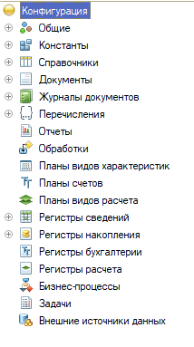

Перед началом работы создайте в конфигураторе общий модуль СкладСервер. Он понадобится для хранения общих функций. Создадим общий модуль один раз, чтобы хранить в нём общие функции. Это избавит от дублирования кода и позволит вызывать логику с клиента через сервер.

1. В дереве метаданных найдите ветку Общие → Общие модули.

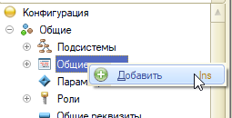

2. Нажмите Добавить.
3. Имя: `СкладСервер`.
4. На закладке Свойства установите флаги:
- Сервер (галочка)
- Вызов сервера (галочка)
5. В поле Синоним напишите: "Серверные функции склада".

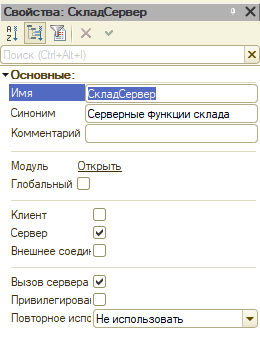

Зачем это? В этом модуле мы будем хранить функции, которые работают с данными (читают и пишут регистры). Они должны выполняться на сервере, чтобы не тащить все данные на клиент.

Перед каждым блоком сохраняйте конфигурацию (**F7**) и при необходимости обновляйте структуру БД.

---

## Шаг 1 — справочники

Справочники в 1С — это прикладные объекты конфигурации, предназначенные для хранения условно-постоянной информации, которая многократно используется в учётных процессах: например, списки контрагентов, номенклатуры, сотрудников. Они образуют основу нормативно-справочной базы системы и позволяют структурировать данные по иерархиям, группам и элементам, обеспечивая единообразие ввода и ссылок в других объектах.

Реквизиты в справочниках — это поля, описывающие характеристики каждого элемента справочника: наименование, код, принадлежность к группе, дополнительные атрибуты вроде ИНН или артикула. Они задают структуру записи, определяют типы данных и правила заполнения, а также участвуют в построении отчётов и отборов, формируя смысловое наполнение справочника и связывая его с другими объектами конфигурации.

Сначала создаём справочники, чтобы типы ссылок на них были доступны для других объектов (в том числе для констант).

В дереве метаданных найдите Справочники и нажимайте "Добавить".

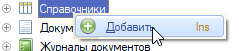

### `Склады`

1. **Справочники** → Добавить → `Склады`.
2. Длина наименования — 100. Иерархия — **не иерархический** (просто оставьте галочку снятой).
3. Платформа создаст формы списка и элемента автоматически. Ничего не меняйте.

Вернитесь к константе ОсновнойСклад и исправьте тип на СправочникСсылка.Склады.

В режиме 1С:Предприятие создайте элемент "Основной" и укажите его в константе `ОсновнойСклад`.

### `Номенклатура`

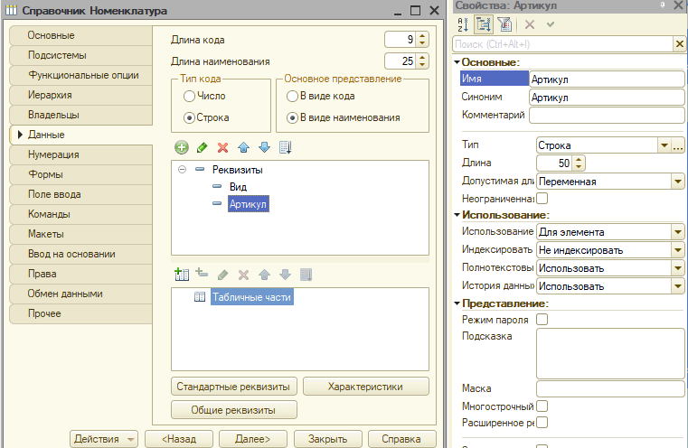

1. **Справочники** → Добавить → `Номенклатура`.
2. Реквизиты:
   - `Вид` — тип `ПеречислениеСсылка.ВидыНоменклатуры`;
   - `Артикул` — `Строка`, 50.
3. При необходимости включите **иерархию групп и элементов** (папки "Группа" и элементы товаров). Установите галочку, чтобы можно было создавать группы (папки).

> Важно: тип `ПеречислениеСсылка.ВидыНоменклатуры` пока не существует. Это нормально: платформа позволит сохранить метаданные, но в режиме Предприятия нельзя будет выбрать значение, пока не создано перечисление.

| Свойство | Значение для учебной базы |
|----------|---------------------------|
| Иерархический | По желанию — да, для тренировки групп |
| Подчинение | Нет (отдельная тема — подчинённый справочник) |
| Предопределённые | Необязательно; удобны для шаблонов "УслугаПрочая" |

**Предопределённый элемент** создаётся в метаданных и всегда доступен по имени в коде: `Справочники.Номенклатура.УслугаДоставки`.

Чтобы добавлять реквизиты, нажимайте на зелёный плюсик.

---

## Шаг 2 — константы и перечисление

Константы служат для хранения единичных значений, которые редко меняются, но критически важны для работы всей информационной базы — например, название организации, основной склад, валюта учёта. В отличие от справочников, константа не предполагает множества записей: это одиночное хранилище настроек верхнего уровня, к которому обращаются различные модули и алгоритмы для получения актуальных параметров ведения учёта.

Перечисления — это объекты метаданных, фиксирующие ограниченный набор предопределённых значений, не подлежащих свободному редактированию пользователем: статусы заказа, виды операций, типы договоров. Они обеспечивают контроль целостности данных за счёт жёсткого списка вариантов, исключают произвольный ввод и упрощают логику обработки, поскольку программный код может опираться на заранее известные значения.

Теперь, когда справочники созданы, можно корректно задать типы для констант и перечислений. Константа хранит одно значение для всей базы. Мы будем использовать её как склад по умолчанию.

### Константа `ОсновнойСклад`

В дереве метаданных найдите Константы.

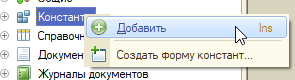

1. **Константы** → Добавить → имя `ОсновнойСклад`.
2. Тип значения — `СправочникСсылка.Склады`
3. Синоним — "Основной склад".

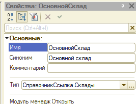

На закладке Данные в поле Тип нажмите кнопку выбора (три точки) - именно там и выбирается из списка в окне "СправочникСсылка.Склады.".

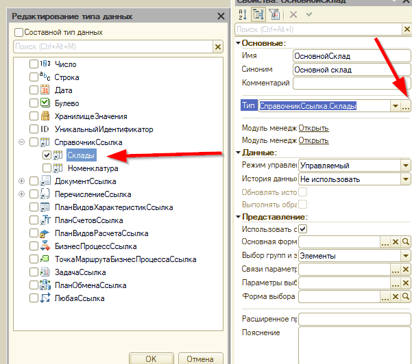

> Если пытаться задать тип `СправочникСсылка.Склады` до создания справочника, платформа не даст выбрать тип. Сначала создаём объект, потом на него ссылаемся.


### Перечисление `ВидыНоменклатуры`

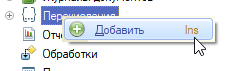

Перечисление — это фиксированный набор значений. Мы создадим два вида: "Товар" и "Услуга". В дереве метаданных найдите Перечисления.

1. **Перечисления** → Добавить → `ВидыНоменклатуры`.
2. На вкладке **Данные** добавьте значения: `Товар`, `Услуга`. Для добавления нажмите на зелёный плюсик (или клавишу Ins).

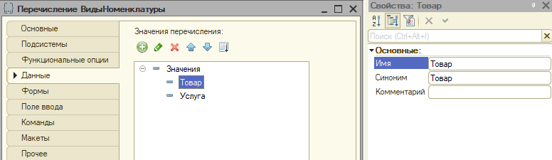

Перечисления задают закрытый список вариантов без отдельного справочника.

---


## Шаг 3 — регистр накопления `ОстаткиТоваров`

Регистр накопления — это механизм учёта количественных и стоимостных остатков и оборотов, ориентированный на агрегацию данных по измерениям и ресурсам: например, остатки товаров на складах или взаиморасчёты с контрагентами. Он поддерживает расчёт итогов на любой момент времени, автоматически формирует срезы и обороты, а его структура оптимизирована для быстрых запросов по остаткам и движениям, что делает его ключевым инструментом складского и финансового учёта.

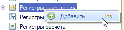

1. **Регистры накопления** → Добавить → `ОстаткиТоваров`.
2. Вид регистра — **Остатки**.
3. Измерения:
   - `Склад` — `СправочникСсылка.Склады`;
   - `Номенклатура` — `СправочникСсылка.Номенклатура`.
4. Ресурс:
   - `Количество` — тип `Число`, длина 15, точность 3.

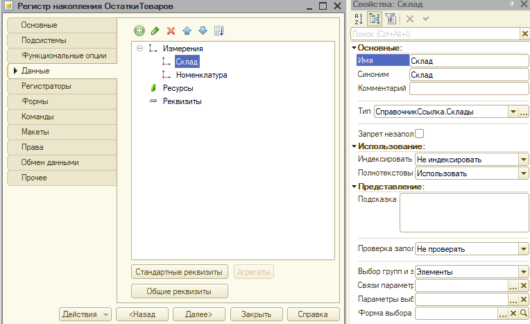

Регистр будет хранить **сколько** какой номенклатуры на каком складе.

---

### Регистр сведений `ЦеныНоменклатуры`

Регистр сведений — это универсальный инструмент хранения произвольных сведений, изменяющихся во времени и привязанных к набору измерений: курсы валют, цены номенклатуры, ставки налогов, графики работы. В отличие от регистра накопления, он не ориентирован на расчёт остатков, а фиксирует состояние параметров на определённые даты, позволяя хранить историю изменений и получать актуальные значения на любой момент, что востребовано в нормативно-справочном и параметрическом учёте.

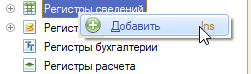

1. **Регистры сведений** → `ЦеныНоменклатуры`.
2. Периодичность — **в пределах дня** (или месяц — для учебной базы достаточно дня).
3. Измерение:
- `Номенклатура` — `СправочникСсылка.Номенклатура`.
4. Ресурсы:
- `Цена` — `Число`, 15.2.
5. Период — `Дата` (платформа добавляет автоматически при периодичности).

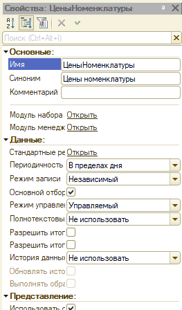

> Уникальность записи в регистре сведений определяется комбинацией измерений и периода. При периодичности «в пределах дня» запись уникальна по `Номенклатура + День`. Если попытаться записать две цены на одну номенклатуру в один день, будет ошибка уникальности.

Подробнее о срезах — [Регистры 1С — записи, срезы, остатки](124.md).

---

## Шаг 4 — документ `ПоступлениеТоваров`

Документ в 1С — это объект, отражающий хозяйственную операцию или событие, имеющее юридическую и учётную значимость: поступление товара, реализация, платёж, начисление зарплаты. Он содержит реквизиты, описывающие суть операции, и формирует движения в регистрах, фиксируя факт изменения состояния учёта. Документы обеспечивают хронологическую фиксацию событий, поддерживают проведение и отмену, а также служат основанием для формирования первичных печатных форм и отчётности.

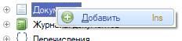

1. **Документы** → Добавить → `ПоступлениеТоваров`.
2. На закладке **Движения** отметьте регистр `ОстаткиТоваров` (вид движения — **Приход**).
3. Реквизиты шапки:
   - `Склад` — `СправочникСсылка.Склады`;
   - `Комментарий` — `Строка`, 200.
4. **Табличная часть** `Товары`:
   - `Номенклатура` — `СправочникСсылка.Номенклатура`;
   - `Количество` — `Число`, 15.3;
   - `Цена` — `Число`, 15.2 (для расчёта суммы и записи в регистр цен).
5. На закладке **Ввод на основании** можно оставить пустым для этого практикума.
6. На закладке **Журналы документов** добавьте документ в подходящий журнал (или создайте новый журнал `СкладскиеДокументы`).

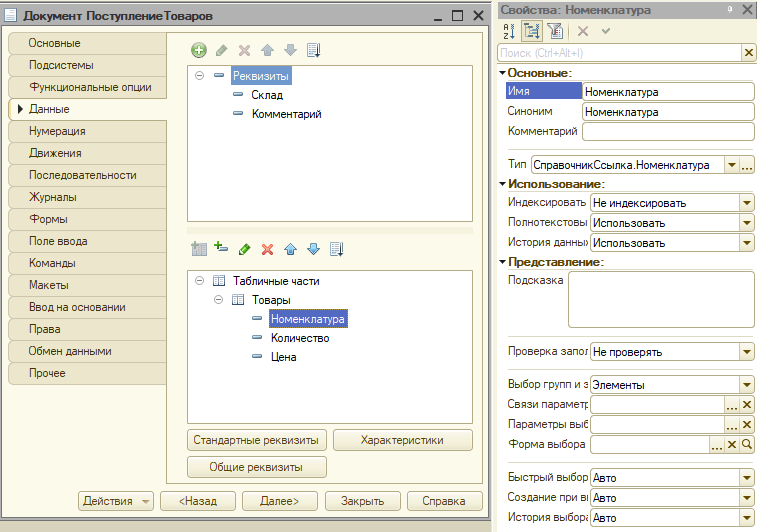

---

### Ввод на основании

На закладке **Ввод на основании** можно разрешить создавать, например, "Расход" из "Поступления" — для учебного склада достаточно знать, что механизм копирует шапку и строки.

---

### Журнал документов

Журнал документов — это интерфейсный объект, предоставляющий пользователю сводное представление списка документов с возможностью отбора, сортировки и группировки по различным критериям. Он объединяет документы разных видов в единую ленту событий, упрощает навигацию и контроль исполнения, а также служит точкой входа для просмотра, редактирования и печати документов, формируя удобную рабочую среду для оперативного учёта.

**Журналы документов** → Добавить → включите `ПоступлениеТоваров` — единый список документов в интерфейсе.

---

## Шаг 5 — проведение в модуле объекта

Проведение — это процесс фиксации хозяйственной операции в учётной системе, в ходе которого документ формирует движения в регистрах накопления и сведений, обновляет остатки, рассчитывает итоги и фиксирует состояние учёта на конкретную дату. Оно включает проверку корректности данных, контроль остатков, распределение сумм и запись результатов, превращая описание операции в фактические изменения учётной базы и обеспечивая непротиворечивость данных.

Модуль объекта — это программная часть, привязанная к конкретному объекту метаданных (документу, справочнику, регистру) и содержащая логику его поведения: обработчики событий, методы проверки, алгоритмы проведения, правила заполнения. Он инкапсулирует бизнес-правила, относящиеся к жизненному циклу объекта, и обеспечивает реакцию на действия пользователя или системные события, реализуя индивидуальную логику обработки данных для каждого типа объектов.

Откройте **модуль объекта** документа `ПоступлениеТоваров`. Нужно реализовать два ключевых обработчика:

- `ПередЗаписью` — проверка корректности данных;
- `ОбработкаПроведения` — формирование движений по регистрам.

<ExternalCodeEmbed example="bsl/bsl-527-1121-001" title="Шаг 5 — проведение в модуле объекта" minHeight={426} />

---

### Проверка в `ПередЗаписью`

```bsl
Процедура ПередЗаписью(Отказ, РежимЗаписи, РежимПроведения)

    Если НЕ ЗначениеЗаполнено(Склад) Тогда
        Сообщить("Укажите склад.");
        Отказ = Истина;
        Возврат;
    КонецЕсли;

    // Проверка строк табличной части
    Для Каждого СтрокаТЧ Из Товары Цикл
        Если НЕ ЗначениеЗаполнено(СтрокаТЧ.Номенклатура) Тогда
            Сообщить("В строке " + СтрокаТЧ.НомерСтроки + " не указана номенклатура.");
            Отказ = Истина;
            Возврат;
        КонецЕсли;
        Если СтрокаТЧ.Количество <= 0 Тогда
            Сообщить("В строке " + СтрокаТЧ.НомерСтроки + " количество должно быть больше 0.");
            Отказ = Истина;
            Возврат;
        КонецЕсли;
    КонецЦикла;

КонецПроцедуры
```

---

### Формирование движений в ОбработкаПроведения

```bsl
Процедура ОбработкаПроведения(Отказ, Режим)

    Движения.ОстаткиТоваров.Записывать = Истина;

    Для Каждого СтрокаТЧ Из Товары Цикл

        Движение = Движения.ОстаткиТоваров.Добавить();
        Движение.ВидДвижения = ВидДвиженияНакопления.Приход;
        Движение.Период = Дата;
        Движение.Склад = Склад;
        Движение.Номенклатура = СтрокаТЧ.Номенклатура;
        Движение.Количество = СтрокаТЧ.Количество;

        // Дополнительно: запишем цену в регистр сведений
        ЗаписатьЦенуНаДату(СтрокаТЧ.Номенклатура, СтрокаТЧ.Цена, Дата);

    КонецЦикла;

КонецПроцедуры
```

---

### Вызов общей функции из модуля

Функция `ЗаписатьЦенуНаДату` находится в общем модуле `СкладСервер`:

```bsl
// В общем модуле СкладСервер
Функция ЗаписатьЦенуНаДату(Номенклатура, Цена, ДатаЦены) Экспорт

    НаборЗаписей = РегистрыСведений.ЦеныНоменклатуры.СоздатьНаборЗаписей();
    НаборЗаписей.Отбор.Номенклатура.Установить(Номенклатура);
    НаборЗаписей.Отбор.Период.Установить(НачалоДня(ДатаЦены));

    НоваяЗапись = НаборЗаписей.Добавить();
    НоваяЗапись.Номенклатура = Номенклатура;
    НоваяЗапись.Период = НачалоДня(ДатаЦены);
    НоваяЗапись.Цена = Цена;

    Попытка
        НаборЗаписей.Записать();
    Исключение
        Сообщить("Не удалось записать цену: " + ОписаниеОшибки());
        ВызватьИсключение;
    КонецПопытки;

    Возврат Цена;

КонецФункции

```

> Обратите внимание: функция объявлена как `Экспорт`, а в модуле объекта документа вызывается напрямую, потому что у модуля стоит флаг «Вызов сервера».

Сохраните конфигурацию, обновите БД, введите документ в 1С:Предприятие и **проведите**. Остатки проверьте запросом из [Регистры 1С — записи, срезы, остатки](124.md).

---

## Шаг 6 — подсистема и интерфейс

Подсистема — это структурный элемент конфигурации, группирующий объекты по функциональному назначению и определяющий навигацию в пользовательском интерфейсе: например, подсистемы «Продажи», «Закупки», «Зарплата и кадры». Она формирует разделы меню, организует доступ к формам и командам, задаёт визуальную структуру приложения и позволяет разграничивать функциональные блоки, делая интерфейс понятным и удобным для разных категорий пользователей.

1. Подсистемы → Добавить → Склад. Синоним — «Склад».
2. В состав подсистемы включите:
- справочники: `Склады`, `Номенклатура`;
- документ: `ПоступлениеТоваров`;
- регистры: `ОстаткиТоваров`, `ЦеныНоменклатуры`;
- константу: `ОсновнойСклад`.
3. В командном интерфейсе подсистемы проверьте, что включены команды:
- «Открыть список» для справочников;
- «Создать» для документа;
- «Провести» (обычно включается автоматически, если у документа есть проведение).
4. Сохраните и обновите БД.

Теперь в режиме «1С:Предприятие» появится раздел «Склад» с нужными объектами.

---

## Шаг 7 — роли (минимум)

Роли — это механизмы управления правами доступа, определяющие, какие действия и над какими объектами может выполнять пользователь: просмотр, редактирование, проведение, удаление, формирование отчётов. Они задают набор разрешений на уровне объектов и операций, обеспечивают разделение обязанностей и безопасность данных, а в сочетании с профилями и группами позволяют гибко настраивать доступ в зависимости от должностных функций и задач сотрудников.

1. **Роли** → Добавить → `Кладовщик`.
2. ПДля каждого объекта выставьте права:
- на справочники: чтение, добавление, изменение;
- на документ: чтение, добавление, проведение, отмена проведения;
- на регистры: чтение и запись (обязательно, иначе проведение завершится ошибкой прав).
3. **Пользователи** → создайте тестового пользователя и назначьте ему роль `Кладовщик`.
4. Проверьте, что пользователь может открыть раздел «Склад», создать документ и провести его.

Без прав объект не откроется даже при знании имени формы.

---

## Шаг 8 — проверка работы

1. Создайте документ `ПоступлениеТоваров`:
- выберите склад `Основной`;
- добавьте строки с номенклатурой;
- укажите количество и цену.
2. Проведите документ.
3. Проверьте:
- движения в регистре `ОстаткиТоваров`;
- запись цены в регистр `ЦеныНоменклатуры`.
4. Сформируйте отчёт или сделайте запрос к регистру, чтобы убедиться, что остатки совпадают с суммами поступлений.

---

## Схема связей

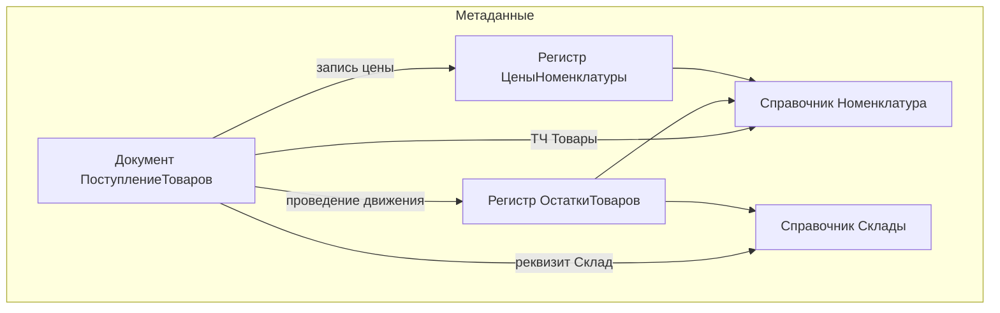

---

## Связанные материалы

- [Архитектура](112.md) · [Объекты](117.md) · [Формы](122.md) · [Регистры](124.md)
