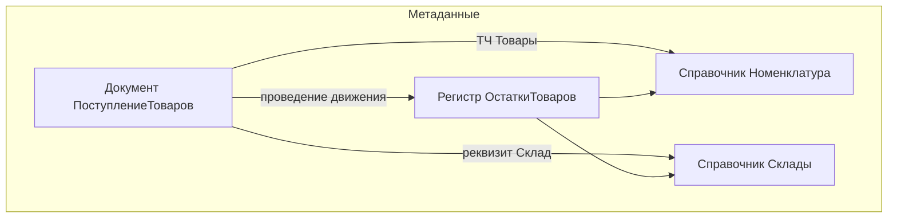

import OneCPlatformEmulator from '@site/src/components/OneCPlatformEmulator.jsx';

# Конфигурирование — мини-склад

<div class="article-tags">
  <span class="tag tag-required">ОБЯЗАТЕЛЬНО</span>
  <span class="tag tag-beginner">ДЛЯ НОВИЧКОВ</span>
</div>

<span class="complexity-badge">Разработчику</span>

<OneCPlatformEmulator focus="metadata" />

---

## Зачем этот практикум

Практикум вводит **метаданные** — объекты конфигуратора, из которых собирается прикладное решение. Путь на универсальном примере **«мини-склад»**: номенклатура, поступление товара, остатки на складе.

После практикума вы сможете:

- создать справочник, документ и регистр накопления в пустой базе;
- связать документ с регистром через **проведение**;
- разместить объекты в **подсистеме** и выдать права **роли**.

Теория объектов — в [112.md](112.md); программное проведение — в [117.md](117.md); чтение остатков — в [124.md](124.md).

<div class="callout callout--info">
  <div class="callout-title">Имена объектов</div>
  В примерах — латиница без пробелов (<code>Номенклатура</code>, <code>ПоступлениеТоваров</code>). Синонимы задавайте по-русски для интерфейса.
</div>

---

## Исходные условия

1. Установлена платформа **8.3** с конфигуратором ([первая программа](121.md)).
2. Создана **пустая** файловая информационная база «УчебныйСклад».
3. Конфигурация открыта в режиме **Конфигуратор** → дерево метаданных слева.

Перед каждым блоком сохраняйте конфигурацию (**F7**) и при необходимости обновляйте структуру БД.

---

## Шаг 1 — константы и перечисление

### Константа `ОсновнойСклад`

1. **Константы** → Добавить → имя `ОсновнойСклад`.
2. Тип значения — `СправочникСсылка.Склады` (склад создадим на шаге 2; тип можно задать после).
3. Синоним — «Основной склад».

Константа хранит **одно** значение на всю базу (настройка по умолчанию).

### Перечисление `ВидыНоменклатуры`

1. **Перечисления** → Добавить → `ВидыНоменклатуры`.
2. На вкладке **Данные** добавьте значения: `Товар`, `Услуга`.

Перечисления задают закрытый список вариантов без отдельного справочника.

---

## Шаг 2 — справочники

### `Склады`

1. **Справочники** → Добавить → `Склады`.
2. Длина наименования — 100. Иерархия — **не иерархический** (пока).
3. Платформа создаст формы списка и элемента автоматически.

В режиме 1С:Предприятие создайте элемент «Основной» и укажите его в константе `ОсновнойСклад`.

### `Номенклатура`

1. **Справочники** → Добавить → `Номенклатура`.
2. Реквизиты:
   - `Вид` — тип `ПеречислениеСсылка.ВидыНоменклатуры`;
   - `Артикул` — `Строка`, 50.
3. При необходимости включите **иерархию групп и элементов** (папки «Группа» и элементы товаров).

| Свойство | Значение для учебной базы |
|----------|---------------------------|
| Иерархический | По желанию — да, для тренировки групп |
| Подчинение | Нет (отдельная тема — подчинённый справочник) |
| Предопределённые | Необязательно; удобны для шаблонов «УслугаПрочая» |

**Предопределённый элемент** создаётся в метаданных и всегда доступен по имени в коде: `Справочники.Номенклатура.УслугаДоставки`.

---

## Шаг 3 — регистр накопления `ОстаткиТоваров`

1. **Регистры накопления** → Добавить → `ОстаткиТоваров`.
2. Вид регистра — **Остатки**.
3. Измерения:
   - `Склад` — `СправочникСсылка.Склады`;
   - `Номенклатура` — `СправочникСсылка.Номенклатура`.
4. Ресурс:
   - `Количество` — `Число`, 15.3.

Регистр будет хранить **сколько** какой номенклатуры на каком складе.

### Регистр сведений `ЦеныНоменклатуры`

1. **Регистры сведений** → `ЦеныНоменклатуры`.
2. Периодичность — **в пределах дня** (или месяц — для учебной базы достаточно дня).
3. Измерение `Номенклатура`, ресурс `Цена` (число).

Подробнее о срезах — [124.md](124.md).

---

## Шаг 4 — документ `ПоступлениеТоваров`

1. **Документы** → Добавить → `ПоступлениеТоваров`.
2. Включите **проведение**.
3. На закладке **Движения** отметьте регистр `ОстаткиТоваров` (приход).
4. Реквизиты шапки:
   - `Склад` — `СправочникСсылка.Склады`;
   - `Комментарий` — `Строка`, 200.
5. **Табличная часть** `Товары`:
   - `Номенклатура` — ссылка на номенклатуру;
   - `Количество` — число;
   - `Цена` — число (для отчётов; в остатки пойдёт только количество).

### Ввод на основании

На закладке **Ввод на основании** можно разрешить создавать, например, «Расход» из «Поступления» — для учебного склада достаточно знать, что механизм копирует шапку и строки.

### Журнал документов

**Журналы документов** → Добавить → включите `ПоступлениеТоваров` — единый список документов в интерфейсе.

---

## Шаг 5 — проведение в модуле объекта

Откройте **модуль объекта** документа `ПоступлениеТоваров` и добавьте обработчик:

```bsl
Процедура ОбработкаПроведения(Отказ, РежимПроведения)

    Движения.ОстаткиТоваров.Записывать = Истина;

    Для Каждого СтрокаТЧ Из Товары Цикл

        Если НЕ ЗначениеЗаполнено(СтрокаТЧ.Номенклатура) Тогда
            Продолжить;
        КонецЕсли;

        Движение = Движения.ОстаткиТоваров.Добавить();
        Движение.ВидДвижения = ВидДвиженияНакопления.Приход;
        Движение.Период = Дата;
        Движение.Склад = Склад;
        Движение.Номенклатура = СтрокаТЧ.Номенклатура;
        Движение.Количество = СтрокаТЧ.Количество;

    КонецЦикла;

КонецПроцедуры
```

Проверка перед проведением — в `ПередЗаписью` или отдельной функции: пустой склад, нулевое количество, дубли строк.

```bsl
Процедура ПередЗаписью(Отказ, РежимЗаписи, РежимПроведения)

    Если НЕ ЗначениеЗаполнено(Склад) Тогда
        Сообщить("Укажите склад");
        Отказ = Истина;
        Возврат;
    КонецЕсли;

КонецПроцедуры
```

Сохраните конфигурацию, обновите БД, введите документ в 1С:Предприятие и **проведите**. Остатки проверьте запросом из [124.md](124.md).

---

## Шаг 6 — подсистема и интерфейс

1. **Подсистемы** → `Склад` (синоним «Склад»).
2. В состав подсистемы включите: `Номенклатура`, `Склады`, `ПоступлениеТоваров`, константу, регистры (для отчётов).
3. У **командного интерфейса** основной подсистемы добавьте навигацию к справочникам и документу.

Пользователь увидит раздел «Склад» в панели разделов.

---

## Шаг 7 — роли (минимум)

1. **Роли** → `Кладовщик`.
2. Права — чтение/добавление/изменение для объектов подсистемы «Склад».
3. **Пользователи** информационной базы → назначьте роль тестовому пользователю.

Без прав объект не откроется даже при знании имени формы.

---

## Шаг 8 — общие объекты

| Объект | Назначение |
|--------|------------|
| **Общий модуль** | Общие функции (`ЦенаНаДату`, форматирование); флаги Сервер / Клиент |
| **Параметры сеанса** | Значения на время сеанса (текущий склад, организация) |
| **Определяемые типы** | Псевдоним составного типа для повторного использования |
| **Общие реквизиты** | Один реквизит сразу у многих объектов (например, `Организация`) |
| **Обработка / Отчёт** | Сервисные операции и печать — [126.md](126.md) |

На этапе «мини-склад» достаточно одного **общего модуля** `СкладСервер` с флагом **Сервер** и экспортной функцией расчёта суммы документа.

---

## Схема связей



---

## Расширение практикума

| Уровень | Задача |
|---------|--------|
| Базовый | Документ «СписаниеТоваров» с видом движения **Расход** |
| Средний | Подчинённый справочник «МестаХранения» владельцем `Склады` |
| Сложный | Отчёт на СКД — остатки из виртуальной таблицы `Остатки` |

---

## Лаборатория — 90 минут

| Время | Действие | Критерий готовности |
|-------|----------|---------------------|
| 0–15 | Константа, перечисление, справочник `Склады` | Элемент склада создан |
| 15–30 | Справочник `Номенклатура`, 3 элемента | Список открывается в Предприятии |
| 30–45 | Регистр `ОстаткиТоваров`, документ с ТЧ | Обновление БД без ошибок |
| 45–60 | `ОбработкаПроведения`, тестовое проведение | Движения видны в регистре |
| 60–75 | Подсистема, командный интерфейс | Раздел «Склад» в меню |
| 75–90 | Запрос остатков из [124.md](124.md) | Остаток = сумма поступлений |

---

## Проверка себя

- Чем константа отличается от справочника?
- Зачем документу свойство «Проведение»?
- Что произойдёт с регистром при отмене проведения?
- Где писать код — в модуле объекта или модуле формы?

---

## Связанные материалы

- [Архитектура](112.md) · [Объекты](117.md) · [Формы](122.md) · [Регистры](124.md)
