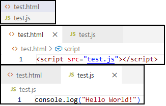
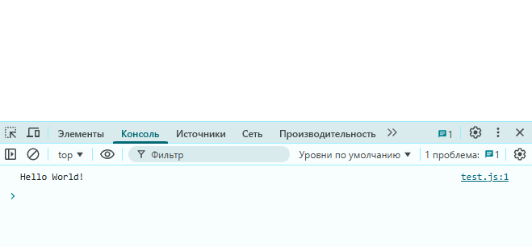
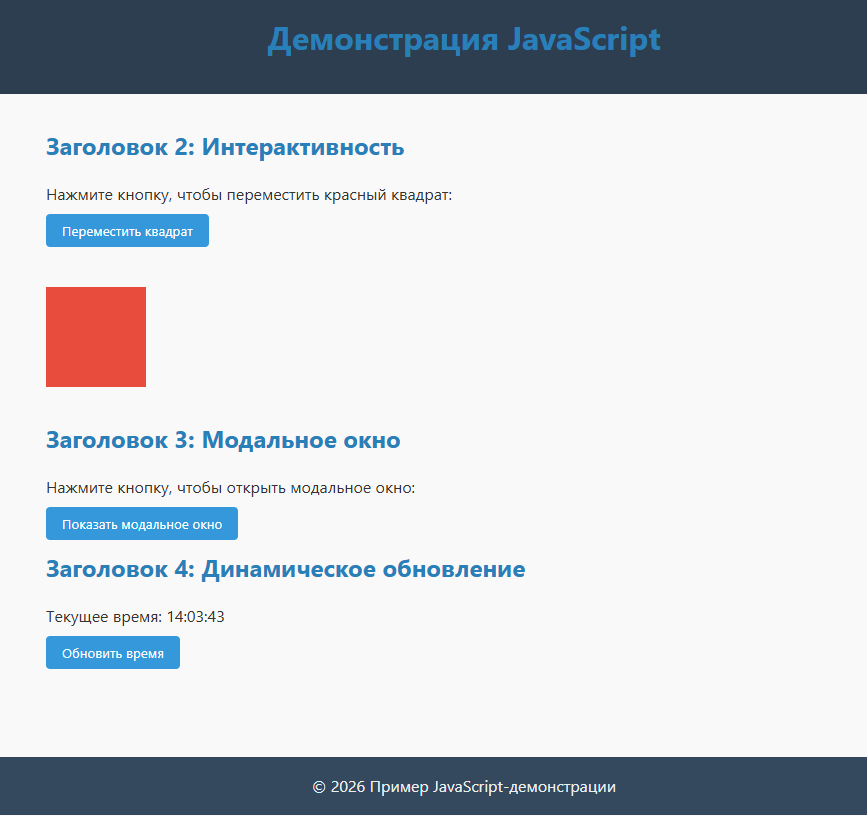
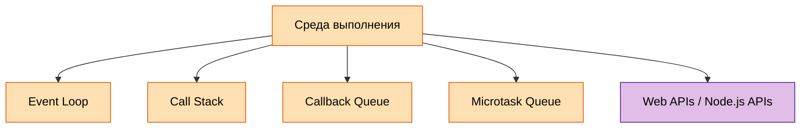
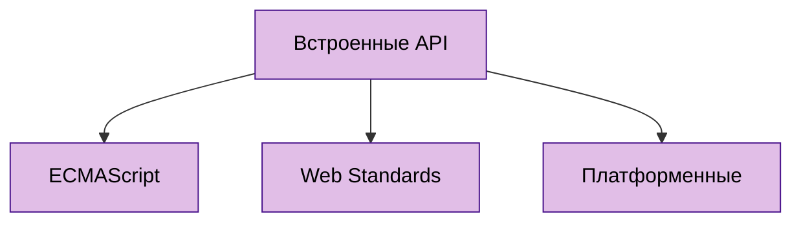
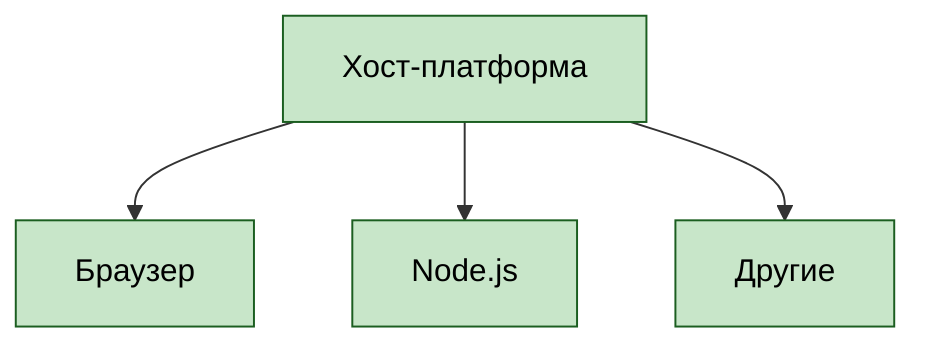
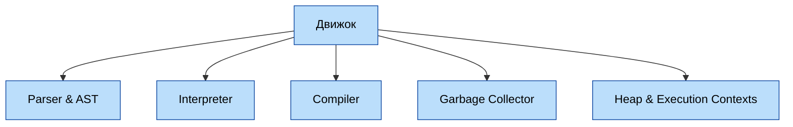

---
title: Основы JavaScript
tags: [beginner, advanced, required, engineer, developer, architector]
description: Язык веб-разработки. Как он работает?
---

# Основы JavaScript

<div class="article-tags">
  <span class="tag tag-required">ОБЯЗАТЕЛЬНО</span>
  <span class="tag tag-beginner">ДЛЯ НОВИЧКОВ</span>
  <span class="tag tag-advanced">НЕ ДЛЯ НОВИЧКОВ</span>
  <span class="tag tag-inprogress">В РАЗРАБОТКЕ</span>
</div>
<span class="complexity-badge">Разработчику</span>
<span class="complexity-badge">Архитектору</span>

## Основы JavaScript

### Язык программирования JS

★ **JavaScript (JS)** – язык программирования, который делает веб-страницы интерактивными. Как мы убедились ранее, HTML отвечает за разметку и структуру страницы, CSS – за внешний вид, а JS добавляет динамику – анимации, обработку действий пользователя, загрузку данных без перезагрузки страницы и много другое. JS может выступать как соединителем клиентской (фронтенд) части с серверной (бэкенд), вызывать сервисы, отправлять данные, запускать процессы.

Нашим первым языком программирования будет JavaScript, ведь он легко понимается в связке с HTML и CSS, которые мы как раз изучили. Но некоторые моменты могут быть непонятными - но они станут яснее, когда изучим ООП.

Поначалу все путают *JavaScript* и *Java* - но они никак не связаны, несмотря на название. Воспринимайте сразу так:
- *Java* - **серверный мультиплатформенный бэкенд язык объектно-ориентированного программирования**,
- *JavaScript* - **фронтенд язык программирования веб-приложений**. 

Запомните - ни в коем случае не называйте что-то на Java как JS, и что-то на JS как Java, даже в бытовых сокращениях - покажете плохой уровень знаний.

---

### С чего начать?

В самом начале JS покажется довольно легким - для него не нужно ничего устанавливать, можно простым текстовым редактором написать скрипт и вуаля - уже работает прямо в любом современном браузере. 

Как правило, в учебниках встречается подход «а давайте сразу напишем и запустим». Но нет, не торопитесь, давайте изучим основы.

К примеру, можно создать пустой `html`-файл, с единственным тегом:

```html
<script src="test.js"></script>
```

Затем, в той же папке, создать простой файл с расширением `.js`:

```JavaScript
console.log("Hello World!")
``` 



Открыв `html`-файл через браузер, затем перейдя в консоль разработчика, мы сразу увидим результат:



---

### Запуск программы на JavaScript

Сам по себе код — это текст, который мы напишем, а программа, которая выполняется на основе нашего кода называется скриптом. Мы просто можем сохранить скрипт как файл, открыть его - и он запускается прямо в браузере, работая построчно, что и является его интерпретируемостью, без компиляции. Это означает, что когда вы напишете код, не будет никакой ошибки компиляции - ошибку вы встретите в самой программе, когда запустите и доберётесь до нужной логики.

Почему начинать мы будем именно с него? Во-первых, он *безопасный*, простой и не требует низкоуровневого доступа к памяти или процессору. Во-вторых, он *работает в браузере* - а мы как раз изучили веб-языки HTML и CSS. И в третьих, *для его запуска не потребуется никакой настройки* - браузер и текстовый редактор у вас наверняка есть, можно прямо сейчас встроить код в страницу и запустить.

Да куда уж там. Даже здесь можно его запустить:

```jsx live
function Greeting() {
  return "Это возвращаемое значение - можете попробовать написать что-то своё!";
}
```

Теперь давайте посмотрим визуально на результат.

Создайте файл `jsdemo.html` и вставьте в него этот код:

```HTML
<!DOCTYPE html>
<html lang="ru">
<head>
  <meta charset="UTF-8" />
  <meta name="viewport" content="width=device-width, initial-scale=1.0" />
  <title>Пример JavaScript</title>
  <style>
    /* Общие стили */
    * {
      margin: 0;
      padding: 0;
      box-sizing: border-box;
      font-family: 'Segoe UI', Tahoma, sans-serif;
    }

    body {
      background-color: #f9f9f9;
      color: #333;
      line-height: 1.6;
    }

    header {
      background-color: #2c3e50;
      color: white;
      padding: 1rem 2rem;
      text-align: center;
    }

    main {
      padding: 2rem;
      max-width: 900px;
      margin: 0 auto;
    }

    h1, h2, h3 {
      margin-bottom: 1rem;
      color: #2980b9;
    }

    .btn {
      background-color: #3498db;
      color: white;
      border: none;
      padding: 0.5rem 1rem;
      margin: 0.5rem 0;
      cursor: pointer;
      border-radius: 4px;
      transition: background-color 0.3s ease;
    }

    .btn:hover {
      background-color: #2980b9;
    }

    .animated-box {
      width: 100px;
      height: 100px;
      background-color: #e74c3c;
      margin: 2rem 0;
      transition: transform 0.5s ease;
    }

    .animated-box.moved {
      transform: translateX(200px);
    }

    footer {
      background-color: #34495e;
      color: #ecf0f1;
      text-align: center;
      padding: 1rem;
      margin-top: 3rem;
    }

    /* Модальное окно */
    .modal {
      display: none;
      position: fixed;
      z-index: 1000;
      left: 0;
      top: 0;
      width: 100%;
      height: 100%;
      background-color: rgba(0, 0, 0, 0.6);
    }

    .modal-content {
      background-color: white;
      margin: 10% auto;
      padding: 2rem;
      border-radius: 8px;
      width: 80%;
      max-width: 500px;
      text-align: center;
    }

    .close-btn {
      background-color: #e74c3c;
      color: white;
      border: none;
      padding: 0.3rem 0.6rem;
      margin-top: 1rem;
      cursor: pointer;
      border-radius: 4px;
    }
  </style>
</head>
<body>
  <header>
    <h1>Демонстрация JavaScript</h1>
  </header>

  <main>
    <h2>Заголовок 2: Интерактивность</h2>
    <p>Нажмите кнопку, чтобы переместить красный квадрат:</p>
    <button id="moveBtn" class="btn">Переместить квадрат</button>
    <div id="box" class="animated-box"></div>

    <h2>Заголовок 3: Модальное окно</h2>
    <p>Нажмите кнопку, чтобы открыть модальное окно:</p>
    <button id="openModalBtn" class="btn">Показать модальное окно</button>

    <h2>Заголовок 4: Динамическое обновление</h2>
    <p>Текущее время: <span id="timeDisplay">—</span></p>
    <button id="updateTimeBtn" class="btn">Обновить время</button>
  </main>

  <!-- Модальное окно -->
  <div id="myModal" class="modal">
    <div class="modal-content">
      <h3>Модальное окно</h3>
      <p>Это простое модальное окно, созданное с помощью JavaScript.</p>
      <button id="closeModalBtn" class="close-btn">Закрыть</button>
    </div>
  </div>

  <footer>
    <p>&copy; 2026 Пример JavaScript-демонстрации</p>
  </footer>

  <script>
    // Перемещение квадрата
    const box = document.getElementById('box');
    const moveBtn = document.getElementById('moveBtn');

    moveBtn.addEventListener('click', () => {
      box.classList.toggle('moved');
    });

    // Модальное окно
    const modal = document.getElementById('myModal');
    const openModalBtn = document.getElementById('openModalBtn');
    const closeModalBtn = document.getElementById('closeModalBtn');

    openModalBtn.addEventListener('click', () => {
      modal.style.display = 'block';
    });

    closeModalBtn.addEventListener('click', () => {
      modal.style.display = 'none';
    });

    // Закрытие модального окна при клике вне его содержимого
    window.addEventListener('click', (event) => {
      if (event.target === modal) {
        modal.style.display = 'none';
      }
    });

    // Обновление времени
    const timeDisplay = document.getElementById('timeDisplay');
    const updateTimeBtn = document.getElementById('updateTimeBtn');

    function updateTime() {
      const now = new Date();
      timeDisplay.textContent = now.toLocaleTimeString();
    }

    updateTimeBtn.addEventListener('click', updateTime);
    updateTime(); // Инициализация времени при загрузке
  </script>
</body>
</html>
```

Сохраните, и откройте этот `jsdemo.html` в браузере.

Перед вами откроется демонстрационная страница:



Затем:
1. Попробуйте нажать кнопку.
2. Вы увидите, как переместится красный квадрат - это было сделано скриптом.
3. Нажмите кнопку ниже, чтобы увидеть модальное окно - тоже JavaScript.
4. Нажмите кнопку для обновления времени - JavaScript получил данные и подставил в элемент.

То есть, именно такие "оживления" и делают страницы лучше. Мы видим в этом коде JavaScript-функционал в виде изменения класса элемента для запуска CSS-анимации, открытие и закрытие модального окна, обработку кликов по фону модального окна и конечно динамическое обновление содержимого.

Разберём код. Сначала - HTML:
- `<!DOCTYPE html>` — указывает браузеру, что это HTML5-документ.
- `<html lang="ru">` — задаёт язык содержимого как русский, что важно для доступности и SEO.
- `<head>` содержит метаданные: кодировку, адаптацию под мобильные устройства и заголовок вкладки.
- `<body>` — всё, что отображается пользователю.
- `<header>` — шапка с заголовком.
- `<main>` — основное содержимое: три раздела с кнопками и интерактивными элементами.
- `<footer>` — нижний колонтитул с копирайтом.

Интерактивные элементы включают в себя:
- Кнопки с уникальными `id`: `#moveBtn`, `#openModalBtn`, `#updateTimeBtn`.
- Элементы, которые изменяются скриптом: `#box`, `#myModal`, `#timeDisplay`.

Эти `id` позволяют точно адресовать элементы из JavaScript.

Затем стили. Они организованы по принципу **компонентного подхода**: каждый блок (хедер, кнопка, модальное окно) имеет собственный набор правил.
- `box-sizing: border-box` — упрощает расчёт размеров элементов.
- `transition` — обеспечивает плавную анимацию (например, перемещение квадрата).
- `.modal { display: none; }` — модальное окно изначально скрыто.
- Позиционирование модального окна через `position: fixed` и `z-index: 1000` гарантирует, что оно будет поверх всего контента.
- При наведении на кнопку (`:hover`) меняется цвет фона — это улучшает UX.
- Цветовая палитра (синий, красный, серый) создаёт чёткий визуальный иерархический порядок.


Скрипт расположен в конце `<body>`, чтобы гарантировать, что все DOM-элементы уже загружены.

#### Перемещение квадрата

```javascript
const box = document.getElementById('box');
const moveBtn = document.getElementById('moveBtn');

moveBtn.addEventListener('click', () => {
  box.classList.toggle('moved');
});
```
- `getElementById()` — получает ссылку на DOM-элемент.
- `addEventListener('click', ...)` — назначает обработчик события клика.
- `classList.toggle('moved')` — добавляет класс `.moved`, если его нет, и убирает, если есть.
- В CSS класс `.moved` определяет `transform: translateX(200px)`, что смещает квадрат вправо.

Это пример **управления состоянием через CSS-классы**, а не прямое изменение стилей в JS — лучшая практика.

---

#### Модальное окно

```javascript
const modal = document.getElementById('myModal');
// ...

openModalBtn.addEventListener('click', () => {
  modal.style.display = 'block';
});

closeModalBtn.addEventListener('click', () => {
  modal.style.display = 'none';
});

window.addEventListener('click', (event) => {
  if (event.target === modal) {
    modal.style.display = 'none';
  }
});
```
- Открытие/закрытие происходит через изменение свойства `display`.
- Дополнительный обработчик на `window` позволяет закрыть окно кликом **вне его содержимого** (`event.target === modal` означает, что клик произошёл именно на затемнённом фоне, а не на самом окне).

Это стандартный паттерн реализации модального окна без использования сторонних библиотек.

---

#### Динамическое обновление времени

```javascript
function updateTime() {
  const now = new Date();
  timeDisplay.textContent = now.toLocaleTimeString();
}

updateTimeBtn.addEventListener('click', updateTime);
updateTime(); // вызов при загрузке
```
- `new Date()` — создаёт объект с текущей датой и временем.
- `toLocaleTimeString()` — форматирует время в соответствии с локалью пользователя (например, `14:35:22`).
- `textContent` — безопасно обновляет текстовое содержимое, не затрагивая HTML.

Первоначальный вызов `updateTime()` при загрузке страницы гарантирует, что время отображается сразу, а не только после нажатия кнопки.

---


## Архитектура JavaScript

### Возможности

Подробности про JS можно узнать здесь https://metanit.com/web/javascript/ и здесь https://developer.mozilla.org/ru/docs/Web/JavaScript

Также можно отметить отличный учебник тут https://learn.javascript.ru/

Чит-лист - https://cheatsheets.zip/javascript

Какие возможности предоставляет JavaScript?
	- *менять содержимое, структуру и стиль страницы после её загрузки*;
	- *делать веб-интерфейсы живыми и отзывчивыми без необходимости перезагрузки*;
	- *реагировать на действия пользователя: клики, прокрутку, наведение, набор текста, жесты и т.д.*;
	- *получать немедленную обратную связь, улучшая опыт взаимодействия*;
	- *получать новые данные с сервера и обновлять части страницы без полной перерисовки*;
	- *хранить, изменять и синхронизировать информацию о текущем состоянии приложения*;
	- *возможность запрашивать данные у других систем, отправлять запросы, обрабатывать ответы*;
	- *читать и изменять структуру HTML, манипулировать CSS, создавать новые элементы*;
	- *выполнять операции вне блокирующего потока выполнения*;
	- *строить анимации, игры, визуализации данных и интерактивные графики*;
	- *сохранять информацию на стороне клиента, чтобы использовать её между сессиями или работать автономно*;
	- *переопределять стандартное поведение браузера, создавать собственные правила и логику*.
	
	
<div class="callout callout--tip">
  <div class="callout-title">Интересный факт</div>
JavaScript не связан с Java. В 1995 году язык создал Брендан Эйх в компании Netscape (кстати, создали JS всего за 10 дней!). Первоначально его назвали Mocha, затем LiveScript, но в тот момент язык Java от Sun Microsystems набирал огромную популярность, и маркетологи решили «подружить» два языка названиями, хотя технически они никак не связаны, у них самостоятельные синтаксисы и особенности.
Часть «скрипт» прямо указывала на задание разработчика – «Сделай язык, похожий на Java, но лёгкий для скриптов.»
</div>

JavaScript позволяет выполнять:
	- динамическое изменение страницы – добавление, удаление, изменение элементов без перезагрузки (к примеру, переключение вкладок с контентом);
	- обработку событий (клики, наведение курсора, ввод текста);
	- работу с API (отправку и загрузку данных при обмене с сервером);
	- анимации и визуальные эффекты (плавные переходы, игры, интерактивные карты);
	- валидацию форм (проверку введённых данных перед отправкой).

★ **Главные особенности JavaScript**

	- Интерпретируемость и JIT-компиляция – выполнение кода построчно (правда, современные движки оптимизируют скорость выполнения различными способами);
	- Динамическая типизация – типы данных определяются во время выполнения, переменная может быть числом, а потом строкой (хотя есть TypeScript, который делает типизацию строгой);
	- Асинхронность и событийная модель – JS не блокирует страницу, ожидая ответа от сервера, вместо этого он использует функционал асинхронности – колбэки (callback), промисы (Promise) и async/await;
	- Работа в браузере и за его пределами – изначально был браузерным, но с появлением Node.js появилась возможность использовать JS на сервере;
	- Прототипное наследование – в отличие от классического ООП (как в Java, мы ещё об этом поговорим), JS использует прототипы для организации кода.

---

### Среда выполнения

**Среда выполнения** — это совокупность компонентов, которые обеспечивают выполнение JavaScript-кода. В отличие от многих языков, где программа просто запускается и выполняется последовательно, JavaScript использует асинхронную модель, основанную на событиях и очередях. Эта модель позволяет выполнять неблокирующие операции, такие как сетевые запросы, таймеры или взаимодействие с пользователем, не останавливая основной поток выполнения.

Основные компоненты среды выполнения JavaScript:

- **Event Loop** — центральный механизм координации;
- **Call Stack** — стек вызовов функций;
- **Callback Queue** — очередь макрозадач;
- **Microtask Queue** — очередь микрозадач;
- **Web APIs / Node.js APIs** — внешние интерфейсы, предоставляемые окружением.



**Call Stack** — это структура данных, которая отслеживает, какие функции выполняются в данный момент. Каждый раз, когда вызывается функция, она помещается («пушится») в стек. Когда функция завершает выполнение, она удаляется («попается») из стека.

Пример:
```javascript
function first() {
  console.log("Первая");
}

function second() {
  first();
  console.log("Вторая");
}

second();
```

Порядок работы Call Stack:
1. `second()` → добавляется в стек;
2. внутри `second()` вызывается `first()` → добавляется в стек;
3. `first()` завершается → удаляется из стека;
4. `second()` завершается → удаляется из стека.

Если стек переполняется (например, при бесконечной рекурсии), возникает ошибка `RangeError: Maximum call stack size exceeded`.


JavaScript сам по себе не умеет работать с сетью, файловой системой, таймерами или DOM. Эти возможности предоставляются **внешней средой**:

- В браузере — **Web APIs** (`setTimeout`, `fetch`, `addEventListener`, `localStorage` и др.);
- В Node.js — **Node.js APIs** (`fs`, `http`, `process`, `setImmediate` и др.).

Когда код вызывает, например, `setTimeout`, он передаёт задачу в соответствующий API. Сам JavaScript не ждёт завершения этой операции — он продолжает выполнение следующих строк. По завершении асинхронная операция помещает колбэк в одну из очередей.

**Callback Queue**, также называемая **Task Queue** или **Macro Task Queue**, содержит колбэки, связанные с такими операциями, как:

- `setTimeout`;
- `setInterval`;
- обработка событий DOM (клик, ввод и т.п.);
- сетевые запросы (`fetch`, `XMLHttpRequest`);
- ввод/вывод в Node.js.

Эти задачи считаются «макрозадачами». Они обрабатываются **по одной за раз** после того, как Call Stack полностью освобождается.

**Microtask Queue** содержит более приоритетные задачи, которые выполняются **сразу после завершения текущего скрипта**, но **до обработки следующей макрозадачи**.

Примеры микрозадач:
- `Promise.then()`, `Promise.catch()`, `Promise.finally()`;
- `queueMicrotask()`;
- изменение `MutationObserver`.

Микрозадачи обрабатываются **полностью** — то есть, если во время выполнения одной микрозадачи появляется другая, она тоже будет выполнена до перехода к макрозадачам.

Пример:
```javascript
console.log("1");

setTimeout(() => console.log("2"), 0);

Promise.resolve().then(() => console.log("3"));

console.log("4");
```

Результат:
```
1
4
3
2
```

Пояснение:
- `"1"` и `"4"` — синхронный код;
- `Promise.then()` — микрозадача → выполняется сразу после синхронного кода;
- `setTimeout` — макрозадача → выполняется только после полной обработки микрозадач.

**Event Loop** — это бесконечный цикл, который координирует работу всех компонентов:

1. Выполняется весь синхронный код (заполняется и опустошается Call Stack);
2. После завершения синхронного кода Event Loop проверяет **Microtask Queue** и выполняет все микрозадачи;
3. Затем Event Loop берёт **одну задачу** из **Callback Queue** (макрозадачу) и выполняет её;
4. После выполнения макрозадачи снова обрабатываются все микрозадачи (если появились);
5. Цикл повторяется.

Такой порядок гарантирует, что микрозадачи (например, промисы) всегда имеют приоритет над макрозадачами (например, таймерами).


```javascript
console.log("A");

setTimeout(() => console.log("B"), 0);

Promise.resolve().then(() => {
  console.log("C");
  setTimeout(() => console.log("D"), 0);
});

Promise.resolve().then(() => console.log("E"));

setTimeout(() => console.log("F"), 0);

console.log("G");
```

Порядок выполнения:
1. Синхронный код: `"A"`, `"G"`;
2. Микрозадачи: `"C"`, `"E"` (все микрозадачи выполняются подряд);
   - во время выполнения `"C"` в Callback Queue добавляется `"D"`;
3. Макрозадачи (по одной):
   - `"B"`;
   - `"F"`;
   - `"D"`.

Итоговый вывод:
```
A
G
C
E
B
F
D
```


---

### Встроенные API JS

**Встроенные API JavaScript** — это набор готовых объектов, функций и интерфейсов, доступных разработчику без необходимости подключать внешние библиотеки. Эти API делятся на три категории: **ECMAScript**, **Web Standards** и **Платформенные**. Все они предоставляют базовые инструменты для работы с данными, асинхронностью, сетью, хранением, отладкой и другими задачами.

| Категория         | Стандарт | Доступность       | Примеры                     |
|-------------------|----------|-------------------|-----------------------------|
| **ECMAScript**    | ECMA-262 | Везде             | `Promise`, `Map`, `Reflect` |
| **Web Standards** | W3C/WHATWG | Только в браузере | `fetch`, `localStorage`, `IndexedDB` |
| **Платформенные** | Нет      | Зависит от среды  | `console`, `setTimeout`, `atob` |



Важно понимать, что:
- Код, использующий **ECMAScript**, можно запускать в любом JS-движке;
- Код с **Web Standards** работает только в браузере (или совместимой среде);
- **Платформенные API** могут отличаться: например, `setTimeout` есть и в браузере, и в Node.js, но `localStorage` — только в браузере.

**ECMAScript** — это официальный стандарт языка JavaScript, определяющий его синтаксис, семантику и встроенные объекты. Он описывает поведение языка независимо от среды выполнения (браузер, Node.js и т.д.).

Ключевые компоненты ECMAScript:

- **Глобальные объекты**: `Object`, `Array`, `String`, `Number`, `Boolean`, `Function`, `Date`, `RegExp`, `Error`.
- **Структуры данных**: `Map`, `Set`, `WeakMap`, `WeakSet`.
- **Асинхронность**: `Promise`, `async`/`await`.
- **Метапрограммирование**: `Proxy`, `Reflect`.
- **Работа с типами**: `Symbol`, `BigInt`.
- **Функциональные утилиты**: `JSON`, `Math`, `Intl`.

Примеры:
```javascript
// Map — структура данных с ключами любого типа
const userRoles = new Map();
userRoles.set("admin", "full");
userRoles.set("guest", "read");

// Promise — обработка асинхронных операций
fetchData()
  .then(Данные => console.log(Данные))
  .catch(err => console.error(err));

// Reflect — безопасный доступ к свойствам объекта
const obj = { x: 1 };
console.log(Reflect.get(obj, "x")); // 1
```

Эти API работают одинаково в любом окружении, где реализован стандарт ECMAScript.

**Web Standards** — это API, стандартизированные организациями **WHATWG** и **W3C** для работы в веб-среде. Они доступны только в браузерах (или в средах, имитирующих браузер, например, JSDOM).

Основные группы Web Standards API:

#### Сеть и коммуникация
- `fetch()` — современная замена `XMLHttpRequest` для HTTP-запросов;
- `WebSocket` — двунаправленное соединение в реальном времени;
- `EventSource` — получение серверных событий по протоколу SSE.

#### Хранение данных
- `localStorage` / `sessionStorage` — хранение строковых данных на клиенте;
- `IndexedDB` — полноценная клиентская база данных с поддержкой транзакций и индексов;
- `Cache API` — управление кэшем для Service Worker и offline-режима.

#### Работа с DOM и событиями
- `document.querySelector()`, `addEventListener()`, `MutationObserver`;
- `CustomEvent`, `AbortController`.

#### Мультимедиа и устройство
- `CanvasRenderingContext2D`, `WebGLRenderingContext`;
- `AudioContext`, `MediaRecorder`;
- `Geolocation`, `Navigator`, `Screen`.

Пример:
```javascript
// Fetch API — отправка запроса
fetch("/api/users")
  .then(res => res.json())
  .then(users => console.log(users));

// IndexedDB — работа с локальной БД
const request = indexedDB.open("MyDB", 1);
request.onsuccess = event => {
  const db = event.target.result;
  const tx = db.transaction("users", "readonly");
  const store = tx.objectStore("users");
  store.getAll().onsuccess = e => console.log(e.target.result);
};
```

Эти API строго регулируются спецификациями и обеспечивают единообразное поведение между браузерами.

**Платформенные API** — это глобальные функции и объекты, предоставляемые конкретной средой выполнения (браузером или Node.js), но **не входящие в официальные стандарты ECMAScript или Web Standards**. Тем не менее, они широко распространены и считаются де-факто стандартными.

Примеры в браузере:
- `console` — вывод сообщений в консоль разработчика;
- `setTimeout` / `setInterval` — планирование выполнения кода;
- `atob` / `btoa` — кодирование и декодирование Base64;
- `escape` / `unescape` (устаревшие, но всё ещё существуют).

Примеры в Node.js:
- `process` — информация о процессе;
- `Buffer` — работа с бинарными данными;
- `global` — глобальный объект (аналог `window` в браузере).

Примеры использования:
```javascript
// console — отладка
console.log("Сообщение");
console.warn("Предупреждение");
console.error(new Error("Ошибка"));

// setTimeout — отложенное выполнение
setTimeout(() => {
  console.log("Прошла секунда");
}, 1000);

// atob — декодирование Base64
const encoded = "SGVsbG8gd29ybGQh";
const decoded = atob(encoded); // "Hello world!"
```

Хотя эти API не стандартизированы как часть языка, они поддерживаются всеми основными платформами и активно используются в повседневной разработке.


---

### Хост-платформа

**Хост-платформа** — это среда, в которой выполняется JavaScript-код и которая предоставляет ему доступ к внешним возможностям: файловой системе, сети, DOM, процессам и другим ресурсам. Сам по себе язык JavaScript не содержит встроенных средств для работы с такими функциями. Он получает их от хост-платформы через глобальные объекты и API.

Основные хост-платформы:
- **Браузер** — среда выполнения веб-приложений;
- **Node.js** — среда выполнения на стороне сервера;
- **Другие** — Deno, Bun, Electron, Cloudflare Workers и другие специализированные среды.

| Платформа         | Глобальный объект | Модули        | Доступ к файлам | Сеть       | DOM | Потоки |
|-------------------|-------------------|---------------|------------------|------------|-----|--------|
| Браузер           | `window`          | ES Modules    | Нет (только через input) | `fetch`    | Да  | Web Workers |
| Node.js           | `global`          | CommonJS / ES | `fs`             | `http`     | Нет | `worker_threads` |
| Deno              | `globalThis`      | ES Modules    | `Deno.readFile`  | `fetch`    | Нет | Web Workers |
| Bun               | `globalThis`      | ES Modules    | `Bun.file`       | `fetch`    | Нет | Web Workers |
| Electron (renderer)| `window`          | CommonJS / ES | Только через main| `fetch`    | Да  | Web Workers |
| Cloudflare Workers| `globalThis`      | ES Modules    | Нет              | `fetch`    | Нет | Нет |



**Браузер** — самая распространённая хост-платформа для JavaScript. Он предоставляет доступ к веб-странице, пользовательскому интерфейсу, сетевым запросам и фоновым задачам.

**DOM** — программный интерфейс для представления и взаимодействия с HTML- или XML-документами. Через DOM можно читать, изменять, создавать и удалять элементы страницы.

Пример:
```javascript
const heading = document.createElement("h1");
heading.textContent = "Привет из JavaScript!";
document.body.appendChild(heading);
```

**BOM** — набор объектов, описывающих окружение браузера. Основной объект — `window`, который также служит глобальным объектом в браузере.

Важные свойства и методы:
- `window.location` — информация о текущем URL;
- `window.navigator` — данные об устройстве и браузере;
- `window.history` — управление историей навигации;
- `window.alert()`, `window.prompt()` — диалоговые окна.

Пример:
```javascript
console.log(navigator.userAgent); // строка с информацией о браузере
window.location.href = "https://example.com"; // переход на другую страницу
```

**Web Workers** позволяют выполнять JavaScript-код в фоновом потоке, не блокируя основной UI-поток. Это полезно для тяжёлых вычислений.

Пример:
```javascript
// main.js
const worker = new Worker("worker.js");
worker.postMessage("Начать вычисления");
worker.onmessage = (event) => {
  console.log("Результат:", event.Данные);
};

// worker.js
self.onmessage = (event) => {
  const result = heavyComputation();
  self.postMessage(result);
};
```

**Service Workers** — скрипты, работающие в фоне, независимо от веб-страницы. Они перехватывают сетевые запросы, управляют кэшем и позволяют реализовать offline-режим и push-уведомления.

Пример регистрации:
```javascript
if ("serviceWorker" in navigator) {
  navigator.serviceWorker.register("/sw.js")
    .then(reg => console.log("SW зарегистрирован", reg))
    .catch(err => console.error("Ошибка регистрации SW", err));
}
```

**Node.js** — среда выполнения JavaScript вне браузера, основанная на движке V8. Она предназначена для серверной разработки и предоставляет доступ к файловой системе, сетевым сокетам, переменным окружения и другим системным ресурсам.

В отличие от браузера (`window`), в Node.js глобальный объект называется `global`. Однако большинство полезных API доступны напрямую без префикса.

Объект `process` предоставляет информацию о текущем процессе и средства управления им.

Примеры:
```javascript
console.log(process.version); // версия Node.js
console.log(process.env.NODE_ENV); // переменные окружения
process.exit(0); // завершение процесса
```

Node.js использует систему CommonJS для загрузки модулей. Стандартные модули встроены в платформу.

Пример:
```javascript
const fs = require("fs");
const http = require("http");

fs.readFile("file.txt", "utf8", (err, Данные) => {
  if (err) throw err;
  console.log(Данные);
});

const server = http.createServer((req, res) => {
  res.end("Hello from Node.js!");
});
server.listen(3000);
```

**Buffer** — объект для работы с бинарными данными. Он необходим при чтении файлов, работе с сетевыми пакетами или шифрованием.

Пример:
```javascript
const buf = Buffer.from("Привет", "utf8");
console.log(buf.toString("base64")); // UHJpdmV0
```

Встроенные модули
- `fs` — работа с файловой системой;
- `path` — манипуляции с путями;
- `os` — информация о системе;
- `net`, `http`, `https` — сетевые протоколы;
- `child_process` — запуск дочерних процессов;
- `events` — система событий (EventEmitter).


Помимо браузера и Node.js, существуют альтернативные среды выполнения JavaScript, каждая со своими особенностями.

#### Deno

**Deno** — современная среда выполнения, созданная автором Node.js. Она включает TypeScript «из коробки», безопасна по умолчанию и предоставляет унифицированный API через глобальное пространство имён `Deno`.

Пример:
```typescript
// Чтение файла в Deno
const Данные = await Deno.readTextFile("file.txt");
console.log(Данные);

// Запрос разрешения происходит автоматически при первом запуске
```

Особенности:
- Нет `require` — используется ES-модули (`import`);
- Безопасность: скрипты не имеют доступа к файловой системе или сети без явного разрешения;
- Встроенный инструментарий: форматирование, тестирование, документация.

#### Bun

**Bun** — высокопроизводительная среда выполнения, написанная на Zig. Она совместима с Node.js API, но значительно быстрее.

Пример:
```javascript
// Bun предоставляет глобальный объект `Bun`
const file = await Bun.file("Данные.json");
const text = await file.text();
console.log(text);
```

Особенности:
- Встроенный bundler, тест-раннер и пакетный менеджер;
- Полная поддержка `fetch`, `WebSocket`, `Web Crypto`;
- Совместимость с npm-пакетами.

#### Electron

**Electron** объединяет Chromium и Node.js, позволяя создавать кроссплатформенные десктопные приложения на веб-технологиях.

Особенности:
- Два типа процессов: **main** (Node.js) и **renderer** (браузер);
- Межпроцессное взаимодействие через `ipcRenderer` и `ipcMain`.

Пример отправки сообщения из renderer в main:
```javascript
// renderer.js
const { ipcRenderer } = require("electron");
ipcRenderer.send("ping", "Привет из UI!");

// main.js
const { ipcMain } = require("electron");
ipcMain.on("ping", (event, message) => {
  console.log(message); // "Привет из UI!"
  event.reply("pong", "Ответ из main!");
});
```

#### Cloudflare Workers

**Cloudflare Workers** — серверлесс-платформа, исполняющая JavaScript (и WebAssembly) на границе сети (edge). Код запускается ближе к пользователю, обеспечивая минимальную задержку.

Особенности:
- Использует стандартные Web API (`fetch`, `Request`, `Response`);
- Нет доступа к файловой системе или долгоживущему состоянию;
- Поддержка Durable Objects для хранения состояния.

Пример:
```javascript
export default {
  async fetch(request) {
    return new Response("Привет из Cloudflare Worker!", {
      headers: { "Content-Type": "text/plain" }
    });
  }
};
```

---

## Движок браузера

### Что такое движок браузера?

**Движок JavaScript** — это программная система, которая преобразует исходный код на языке JavaScript в исполняемые инструкции процессора и управляет выполнением программы. Он является центральным компонентом среды выполнения и обеспечивает корректную, безопасную и производительную работу кода.

В отличие от языков вроде C++ или Java, JS не требует отдельной компиляции перед запуском. Это сделано для удобства веб-разработки: код должен выполняться сразу в браузере у любого пользователя. Однако для работы требуется движок.

Современные браузеры используют движки JavaScript, которые:
	- анализируют код (выполняя парсинг);
	- компилируют код «на лету» (JIT-компиляция);
	- оптимизируют выполнение для скорости.

К примеру, в Chrome (как и в Node.js) используется V8, в FireFox – SpiderMonkey, а в Safari – JavaScriptCore. Именно движки позволяют JS работать очень быстро, почти как настоящий компилируемый язык.

Современные движки (например, **V8**, **SpiderMonkey**, **JavaScriptCore**) состоят из нескольких взаимосвязанных подсистем:

- **Parser & AST** — разбор и построение абстрактного синтаксического дерева;
- **Interpreter** — интерпретация кода пошагово;
- **Compiler** — JIT-компиляция для повышения производительности;
- **Garbage Collector** — автоматическое освобождение памяти;
- **Heap & Execution Contexts** — управление данными и контекстами выполнения.




### Parser & AST

**Parser** (парсер) — это компонент, который выполняет **лексический и синтаксический анализ** входного JavaScript-кода.

1. **Лексический анализ** разбивает исходный текст на токены — минимальные значимые единицы: ключевые слова (`if`, `function`), идентификаторы (`x`, `myVar`), операторы (`+`, `===`), литералы (`42`, `"hello"`) и т.д.
2. **Синтаксический анализ** строит на основе токенов **AST** (Abstract Syntax Tree, абстрактное синтаксическое дерево) — древовидную структуру, отражающую грамматическую структуру программы.

Пример:
```javascript
let x = 10 + 5;
```
Преобразуется в AST, где:
- корень — `VariableDeclaration`;
- дочерний узел — `VariableDeclarator`;
- правая часть — `BinaryExpression` с операндами `10` и `5`.

Это дерево становится основой для дальнейшей обработки: интерпретации, компиляции или оптимизации.

---

### Interpreter

**Interpreter** (интерпретатор) — это компонент, который **выполняет код напрямую**, шаг за шагом, без предварительной компиляции в машинный код.

В движке **V8** используется интерпретатор под названием **Ignition**. Он:
- читает байт-код (промежуточное представление, полученное из AST);
- выполняет его по инструкциям;
- собирает профилировочную информацию (например, какие функции вызываются часто, какие типы аргументов используются).

Преимущества интерпретатора:
- быстрый запуск программы;
- низкое потребление памяти на начальном этапе;
- возможность сбора данных для последующей оптимизации.

Недостаток — сравнительно низкая скорость выполнения по сравнению с нативным кодом.

---

### Compiler

**Compiler** (компилятор) в движке JavaScript реализует **JIT-компиляцию** (Just-In-Time compilation) — компиляцию «на лету», во время выполнения программы.

В V8 основной оптимизирующий компилятор называется **TurboFan** (ранее использовался Crankshaft, теперь устарел). Он:
- получает профилировочные данные от Ignition;
- выбирает «горячие» функции (часто вызываемые);
- генерирует высокооптимизированный машинный код, учитывающий фактические типы данных;
- заменяет интерпретируемую версию функции на скомпилированную.

Пример:
```javascript
function add(a, b) {
  return a + b;
}
```
Если функция `add` вызывается тысячи раз с числами, TurboFan создаст специализированную версию, которая работает напрямую с числами, минуя проверки типов.

Такой подход сочетает **гибкость интерпретации** и **производительность компиляции**.

---

### Garbage Collector

**Garbage Collector** (сборщик мусора) — это подсистема, которая **автоматически освобождает память**, занятую объектами, которые больше не используются программой.

В V8 используется сборщик под названием **Orinoco**, реализующий **инкрементальную и параллельную сборку мусора**. Он работает по принципу **достижимости**:
- все объекты, достижимые из корневых ссылок (глобальный объект, текущие переменные в стеке), считаются «живыми»;
- остальные объекты помечаются как «мёртвые» и удаляются.

Основные алгоритмы:
- **Scavenger** — для молодого поколения объектов (быстрая очистка);
- **Mark-Sweep** и **Mark-Compact** — для старого поколения (поиск и дефрагментация).

Сборка мусора происходит **фоново**, чтобы минимизировать паузы в выполнении программы.

---

### Heap & Execution Contexts

#### Heap (куча)

**Heap** — это область памяти, где хранятся все **динамически создаваемые объекты**: массивы, функции, строки, пользовательские объекты. В отличие от стека, куча имеет неограниченный (в рамках системы) размер и управляется сборщиком мусора.

#### Execution Contexts (контексты выполнения)

**Контекст выполнения** — это внутренняя структура, которая создаётся при запуске глобального кода или функции. Она содержит:
- **Lexical Environment** — привязку имён переменных к их значениям;
- **This Binding** — значение ключевого слова `this`;
- **Outer Environment** — ссылку на внешний лексический контекст (для замыканий).

Типы контекстов:
- **Глобальный контекст** — создаётся один раз при запуске скрипта;
- **Функциональный контекст** — создаётся при каждом вызове функции;
- **Блочный контекст** — создаётся при входе в блок с `let`/`const` (начиная с ES6).

Контексты формируют **цепочку областей видимости**, которая определяет, как JavaScript разрешает имена переменных.

---

### Взаимодействие компонентов

Поток выполнения выглядит так:

1. Исходный код → **Parser** → AST;
2. AST → **Ignition** → байт-код + профилирование;
3. Байт-код выполняется → если функция «горячая» → **TurboFan** → оптимизированный машинный код;
4. Все создаваемые объекты размещаются в **Heap**;
5. При необходимости **Garbage Collector** освобождает память;
6. Каждый вызов функции создаёт новый **Execution Context**, который помещается в стек контекстов.

Эта архитектура обеспечивает **баланс между скоростью запуска, потреблением памяти и производительностью выполнения**, что делает JavaScript пригодным как для простых скриптов, так и для сложных веб-приложений.

---