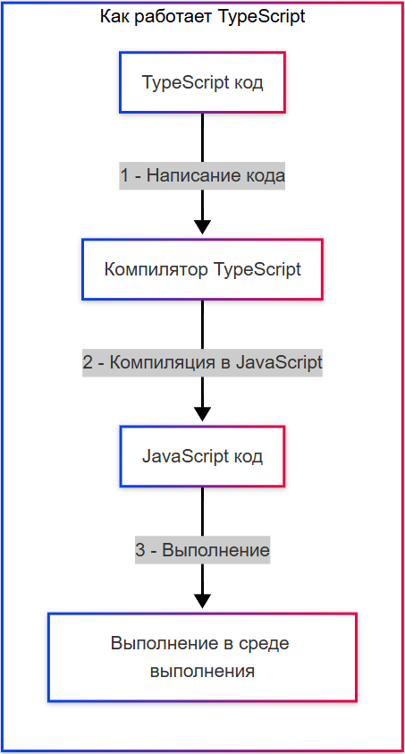

# TypeScript

<div class="article-tags">
  <span class="tag tag-required">ОБЯЗАТЕЛЬНО</span>
  <span class="tag tag-beginner">ДЛЯ НОВИЧКОВ</span>
</div>

<span class="complexity-badge">Разработчику</span>
<span class="complexity-badge">Архитектору</span>

## TypeScript

### Что такое TypeScript?

TypeScript — это язык программирования, разработанный компанией Microsoft. Он представляет собой строго типизированное надмножество языка JavaScript, которое компилируется в обычный JavaScript. Его основная цель — повысить надежность, масштабируемость и поддерживаемость кода, особенно в крупных и сложных приложениях, где JavaScript сам по себе может стать источником трудноуловимых ошибок.



#### Пример кода на JavaScript

JavaScript является динамически типизированным языком. Компилятор или интерпретатор не проверяет типы данных до момента выполнения программы. Переменные могут хранить значения любого типа, и их тип может измениться в процессе работы скрипта.

```javascript
// Объявление переменной без указания типа
let user = {
    name: "Алексей",
    age: 30
};

// Функция принимает аргументы без описания их типов
function greet(person) {
    // Операция сложения работает корректно, если person.name строка
    console.log("Привет, " + person.name);
    
    // Если передать число вместо объекта, ошибка возникнет только во время запуска
    if (person.age > 18) {
        return "Взрослый";
    }
    return "Недостаточно лет";
}

// Вызов функции с правильными данными
greet(user);

// Изменение типа переменной (допустимо в JS)
user = 42; 

// Попытка вызвать метод .name у числа вызовет ошибку Runtime Error
// console.log(user.name); // Ошибка: Cannot read property 'name' of number
```

#### Пример кода на TypeScript

TypeScript добавляет статическую систему типов поверх синтаксиса JavaScript. Разработчик явно указывает типы данных для переменных, параметров функций и возвращаемых значений. Проверка типов происходит на этапе компиляции, что позволяет обнаруживать ошибки еще до запуска программы.

```typescript
// Интерфейс описывает структуру ожидаемых данных
interface User {
    name: string;
    age: number;
}

// Переменная имеет явный тип User
let user: User = {
    name: "Алексей",
    age: 30
};

// Функция принимает объект строго определенного типа
function greet(person: User): string {
    console.log("Привет, " + person.name);
    
    if (person.age > 18) {
        return "Взрослый";
    }
    return "Недостаточно лет";
}

// Вызов функции с правильными данными
const result = greet(user);
console.log(result);

// Попытка изменить тип переменной приведет к ошибке компиляции
// user = 42; // Ошибка TS2322: Тип "number" не может быть присвоен типу "User".

// Попытка вызвать функцию с неверным аргументом также вызовет ошибку компиляции
// greet(42); // Ошибка TS2345: Аргумент типа "number" не может быть присвоен параметру типа "User".
```

#### Наглядные отличия

**Структура данных**

В JavaScript структура объекта создается автоматически при создании литерала. В TypeScript требуется предварительное определение контракта через интерфейс или тип. Это определяет правила использования данных.

**Проверка типов**

JavaScript переносит проверку целостности данных на момент выполнения. Ошибки возникают в рантайме, когда программа уже запущена. TypeScript выполняет проверку на этапе сборки кода. Компилятор блокирует создание файла, если обнаружены несоответствия типов.

**Гибкость и безопасность**

JavaScript допускает изменение типа переменной в любой момент времени. Это дает гибкость, но создает риски непредсказуемого поведения программы. TypeScript фиксирует тип переменной после объявления. Переменная сохраняет свой тип на протяжении всего жизненного цикла. Это обеспечивает предсказуемость логики приложения.

**Обработка ошибок**

В примере с JavaScript попытка обращения к несуществующему свойству числа приводит к падению программы с сообщением об ошибке выполнения. В примере с TypeScript компилятор запрещает такую операцию заранее. Код просто не будет скомпилирован, пока разработчик не исправит несоответствие.

**Инструментарий разработки**

Среда разработки для TypeScript предлагает подсказки по автозаполнению на основе объявленных типов. Редактор показывает точную информацию о доступных свойствах объектов. Среда для JavaScript предоставляет подсказки только на основе контекста текущего файла и внешних библиотек.

---

### История и разработка

TypeScript был разработан в Microsoft под руководством Андерса Хейльсберга, известного также как создатель языков Delphi и C#. Первый публичный релиз состоялся в октябре 2012 года. Он был создан как ответ на растущую сложность и масштабы JavaScript-приложений, особенно на стороне клиента (браузера) и сервера (Node.js). В отличие от чистого JavaScript, TypeScript предлагает статическую типизацию и другие инструменты, характерные для более традиционных языков программирования, таких как C# или Java, что позволяет разработчикам строить более надежные и понятные системы. TypeScript является проектом с открытым исходным кодом (open source), что означает, что его исходный код доступен для изучения, модификации и участия в разработке со стороны сообщества. Microsoft, несмотря на то, что инициировала проект, активно сотрудничает с внешними разработчиками и поддерживает его развитие. Это делает TypeScript результатом усилий международного сообщества.

### TypeScript как надмножество JavaScript

Термин "надмножество" означает, что TypeScript включает в себя весь синтаксис и функциональность JavaScript и добавляет к ним свои собственные возможности. Любой действительный код на JavaScript также является действительным кодом на TypeScript. Это позволяет разработчикам постепенно внедрять TypeScript в уже существующие JavaScript-проекты без необходимости переписывать всё с нуля. Основное нововведение TypeScript — это **статическая типизация**. Это значит, что типы переменных, параметров функций, возвращаемых значений и других элементов кода можно (и рекомендуется) указывать при написании кода. Компилятор TypeScript проверяет соответствие типов **до выполнения** программы, что позволяет выявить потенциальные ошибки на этапе компиляции, а не в процессе выполнения, как это часто бывает в JavaScript.

### Проблемы JavaScript и зачем нужен TypeScript

JavaScript — это динамически типизированный язык. Это означает, что тип переменной определяется в момент присвоения значения, и может меняться в процессе выполнения программы. Это придает языку гибкость, но одновременно создает ряд проблем:
1.  **Отсутствие Type Safety (безопасности типов):** Невозможно гарантировать, что переменная будет содержать ожидаемый тип данных. Это может привести к ошибкам во время выполнения.
2.  **Динамические типы:** Поскольку типы определяются во время выполнения, среда выполнения должна выполнять дополнительную работу для определения типа и выполнения операций, что потенциально может сказаться на производительности.
3.  **Отсутствие внятного автодополнения:** IDE (интегрированная среда разработки) может испытывать трудности с предоставлением точных подсказок по автодополнению, особенно для сложных объектов, если структура неочевидна из кода.
4.  **Невозможность рефакторинга:** Переименование свойства объекта или параметра функции может быть трудоемким и рискованным процессом, так как нет гарантии, что все места использования будут корректно обновлены, особенно если код не покрыт тестами.
5.  **Невозможность понять структуры данных:** В больших проектах бывает сложно быстро разобраться в структуре передаваемых между функциями или классами данных.

### Статическая типизация и её важность

Статическая типизация — это система, при которой типы переменных и выражений проверяются на этапе **компиляции** (до выполнения). Это контрастирует с динамической типизацией, где проверка происходит во время **выполнения**. Важность статической типизации заключается в следующем:
1.  **Раннее обнаружение ошибок:** Множество ошибок, связанных с несовместимостью типов (например, попытка вызвать метод строки на числе), выявляются еще до запуска программы.
2.  **Повышение надежности кода:** Благодаря проверкам типов, код становится более предсказуемым и устойчивым к опечаткам и логическим ошибкам.
3.  **Улучшение поддержки IDE:** Компилятор и IDE могут использовать информацию о типах для предоставления более точного автодополнения, навигации по коду, поиска ссылок и безопасного рефакторинга.
4.  **Самодокументирование кода:** Явное указание типов делает код более понятным и документированным, позволяя другим разработчикам быстрее понять, какие данные ожидаются и возвращаются функциями и методами.

### Утиная типизация в JavaScript и структурная типизация в TypeScript

- **Утиная типизация (Duck Typing):** Это концепция, часто ассоциируемая с динамически типизированными языками, включая JavaScript. Принцип гласит: "Если это выглядит как утка, плавает как утка и крякает как утка, то это, вероятно, утка". В контексте программирования это означает, что объект считается совместимым с определённым "интерфейсом", если он имеет *все требуемые свойства и методы*, независимо от его реального типа или наследования.
- **Структурная типизация (Structural Typing):** Это система, принятая в TypeScript. Совместимость типов определяется *структурой* типа (его полями и методами), а не его именем (номинальная типизация). Это позволяет использовать утиную типизацию, но на этапе компиляции, обеспечивая безопасность типов. TypeScript проверяет, содержит ли один тип все члены другого типа, и если да, считает их совместимыми. Это делает TypeScript гибким, как JavaScript, но при этом безопасным, как статически типизированные языки.

### Проектирование типов, принцип надежности, закон Лисков (LSP)

- **Проектирование типов:** Это процесс создания системы типов, которая точно моделирует доменную область приложения. Хорошо спроектированные типы помогают выразить намерения разработчика, ограничить возможные состояния данных и сделать ошибки невозможными или легкоуловимыми. Это включает в себя использование интерфейсов, объединений типов, литеральных типов и других инструментов TypeScript.
- **Принцип надежности:** В контексте TypeScript, это означает создание кода, который ведет себя предсказуемо и не вызывает ошибок времени выполнения из-за проблем с типами. Статическая типизация — ключевой инструмент для достижения этой надежности.
- **Закон подстановки Барбары Лисков (LSP):** Один из принципов SOLID. Он гласит, что объекты подтипа должны быть взаимозаменяемы с объектами их базового типа. В TypeScript это связано с совместимостью типов и наследованием. Если класс B наследует от класса A, то экземпляр B можно использовать везде, где ожидается A, без нарушения корректности программы.

### Типобезопасность (Type Safety)

Типобезопасность — это свойство системы типов, которое предотвращает ошибки, связанные с неправильным использованием типов данных. В типобезопасном языке, как TypeScript, компилятор (или интерпретатор) гарантирует, что операции выполняются только над значениями подходящих типов. Это исключает такие ошибки, как попытка вызвать несуществующий метод, сложить строку с числом неявно, или передать неправильный тип в функцию. TypeScript достигает типобезопасности за счет строгой проверки типов на этапе компиляции.

### Типы и значения

- **Тип:** Это множество допустимых значений и набор операций, которые можно с ними выполнить. Например, тип `number` включает в себя все числовые значения (целые, дробные, положительные, отрицательные, специальные значения `NaN`, `Infinity`) и операции, такие как сложение (`+`), вычитание (`-`), вызов методов (`toFixed`).
- **Значение:** Это конкретный экземпляр данных. Например, `42`, `"hello"`, `true` — это конкретные *значения*. `42` является *значением* типа `number`, `"hello"` — *значением* типа `string`, `true` — *значением* типа `boolean`.

### TypeScript и Node.js

TypeScript не обязательно требует Node.js для своей работы, но Node.js часто используется в качестве среды выполнения для *компилятора TypeScript* (`tsc`) и для запуска скомпилированного JavaScript-кода на сервере. Компилятор TypeScript (`tsc`) сам по себе является приложением Node.js. Поэтому, чтобы установить и использовать `tsc`, обычно требуется установленный Node.js. Однако, TypeScript-код может быть скомпилирован в JavaScript, который затем выполняется в браузере, не требуя Node.js на стороне пользователя.

### Модульность и библиотеки в TypeScript

TypeScript полностью поддерживает стандарты модульности JavaScript (ES2015 modules, CommonJS). Это позволяет разбивать код на независимые, переиспользуемые части (модули), импортировать и экспортировать функции, классы, интерфейсы и другие элементы. Это делает код более организованным и управляемым. Также TypeScript предоставляет мощную систему для работы с внешними библиотеками JavaScript. С помощью файлов деклараций типов (`.d.ts`) можно получить типобезопасное взаимодействие с библиотеками, которые изначально написаны на JavaScript. Репозиторий `DefinitelyTyped` содержит огромное количество готовых файлов деклараций для популярных библиотек.

### Компилятор TypeScript

Компилятор TypeScript (`tsc`) — это основная программа командной строки, которая преобразует код, написанный на TypeScript, в код, совместимый с JavaScript. Он выполняет несколько ключевых задач: проверку типов, транспиляцию (преобразование синтаксиса в более старую версию JavaScript), генерацию артефактов сборки (JavaScript-файлов, файлов деклараций, карт кода) и, опционально, может управлять процессом сборки проекта.

### Архитектура компиляции

Процесс компиляции можно условно разделить на несколько этапов:

1.  **Лексический анализ (Tokenization):** Исходный код `.ts` файла разбивается на логические "единицы" — токены (например, ключевые слова `function`, `class`, идентификаторы, операторы, скобки).
2.  **Синтаксический анализ (Parsing):** Из токенов строится Абстрактное Синтаксическое Дерево (AST) — внутреннее представление структуры кода, которое компилятор использует для дальнейшей обработки.
3.  **Проверка типов (Type Checking):** Это уникальная и ключевая особенность TypeScript. На этом этапе компилятор анализирует AST, используя информацию об объявленных типах, переменных, функциях, классах и т. д., чтобы проверить, соответствуют ли операции в коде этим типам. Например, проверяется, что строка не складывается с числом неявно, что вызывается существующий метод с правильными аргументами и т. д. Это происходит **до выполнения** кода.
4.  **Эмиссия (Emitting / Transpilation):** Компилятор генерирует выходные файлы (обычно `.js`, но также `.d.ts` и `.js.map`). В процессе эмиссии TypeScript-специфичный синтаксис (такой как аннотации типов, интерфейсы, дженерики, декораторы) удаляется или трансформируется в стандартный JavaScript, понятный среде выполнения (браузеру или Node.js). Например, аннотация `: number` у параметра функции исчезает, а `class` может быть преобразован в `function` и `prototype` в зависимости от целевой версии JavaScript (см. опцию `target`).

### Ключевые компоненты и флаги компилятора

- **`tsc` (TypeScript Compiler):** Команда для запуска компилятора. Ее можно вызывать с различными флагами и аргументами.
- **`tsconfig.json`:** Это файл конфигурации проекта TypeScript. Он указывает компилятору, какие файлы нужно включить в проект (`include`, `exclude`), где находятся файлы деклараций (`typeRoots`, `types`), какую версию JavaScript нужно использовать в качестве цели (`target`), какую систему модулей использовать (`module`), включать ли строгую проверку типов (`strict`) и множество других опций. Использование `tsconfig.json` — стандартный способ управления настройками компиляции в проекте.
- **`target`:** Определяет версию ECMAScript, в которую будет транспилирован исходный TypeScript-код. Возможные значения: `es3`, `es5`, `es2015`, `es2016`, `es2017`, `es2018`, `es2019`, `es2020`, `es2021`, `esnext`. Выбор цели зависит от среды выполнения. Например, для поддержки старых браузеров может использоваться `es5`, а для современных Node.js приложений — `es2018` или `es2020`.
- **`module`:** Определяет, как будут транспилированы модульные системы TypeScript (`import`, `export`). Возможные значения: `commonjs` (для Node.js), `amd` (для RequireJS), `es2015`/`es2020`/`esnext` (для нативных ES-модулей), `umd` (универсальный формат), `Система` (для SystemJS). Выбор зависит от системы сборки или загрузчика модулей, используемой в проекте.
- **`lib`:** Позволяет указать, какие встроенные API (например, DOM, ES6 Collections, `Promise`) будут доступны в целевой среде выполнения. Это нужно для компилятора, чтобы знать, какие типы можно использовать без необходимости их полифила. Например, для браузерного приложения может быть указано `["es2015", "dom"]`, а для Node.js — `["es2015"]`.
- **`outDir`:** Указывает каталог, в который будут помещены скомпилированные JavaScript-файлы.
- **`rootDir`:** Указывает корневой каталог исходных файлов TypeScript. Компилятор использует это для определения структуры каталогов в выходной директории.
- **`declaration` (`d`):** Если включено, компилятор генерирует файлы деклараций (`.d.ts`) для каждого скомпилированного файла TypeScript. Эти файлы описывают публичный API модуля (типы, интерфейсы, классы, функции) и необходимы для использования библиотеки, написанной на TypeScript, в других TypeScript-проектах.
- **`sourceMap` (`sourcemap`):** Если включено, компилятор генерирует файлы карты кода (`.js.map`). Эти файлы позволяют отображать код, отлаживаемый в браузере или другом инструменте, обратно на исходный TypeScript-код, что значительно упрощает отладку.
- **`strict`:** Включает группу флагов, обеспечивающих максимально строгую проверку типов. Включает `noImplicitAny`, `strictNullChecks`, `strictFunctionTypes`, `strictBindCallApply`, `strictPropertyInitialization`, `noImplicitThis`, `useUnknownInCatchVariables`. Использование `strict` рекомендуется для повышения надежности кода.
- **`noImplicitAny`:** Выдает ошибку, если компилятору не удается вывести тип и он вынужден использовать `any`.
- **`strictNullChecks`:** Включает строгую проверку на `null` и `undefined`. Переменная типа `string`, например, не может быть присвоена `null` или `undefined` без явного указания этого в типе (например, `string | null`).
- **`allowJs`:** Позволяет компилятору включать в проект файлы JavaScript (`.js`) наряду с TypeScript (`.ts`).
- **`checkJs`:** При использовании `allowJs` позволяет выполнять проверку типов и в файлах JavaScript.
- **`moduleResolution`:** Определяет алгоритм, по которому компилятор разрешает пути импорта (`import`). Наиболее распространенный вариант — `"node"`, который использует ту же логику, что и Node.js.

### `tsserver` (TypeScript Server)

`tsserver` — это изолированный (отдельный) процесс, который запускается в фоне. Его основная цель — обеспечить быструю и эффективную работу редакторов кода (например, VS Code) и IDE при работе с TypeScript. Он предоставляет такие функции, как:

- **Автодополнение (IntelliSense):** Предлагает доступные методы, свойства, типы на основе текущего контекста.
- **Навигация по коду:** Переход к определению переменной, функции, типа.
- **Поиск ссылок:** Показывает, где используется тот или иной элемент кода.
- **Переименование:** Безопасное переименование переменных, функций, классов с обновлением всех ссылок.
- **Рефакторинг:** Предлагает и выполняет шаблонные операции изменения кода.
- **Диагностика в реальном времени:** Показывает ошибки и предупреждения по мере ввода кода, не дожидаясь запуска `tsc`.

`Tsserver` загружает и кэширует информацию о проекте (AST, типы), что позволяет ему быстро отвечать на запросы редактора, даже в больших проектах. Он отслеживает изменения файлов и обновляет свою модель проекта соответствующим образом.

### Языковые службы (Language Services)

Под "языковыми службами" понимаются функции, предоставляемые TypeScript-компилятором (в частности, через `tsserver`) для интеграции с редакторами и IDE. Это включает в себя:

- **Проверку типов** и предоставление информации об ошибках.
- **Инспекцию кода** (например, поиск определений, сигнатур функций).
- **Навигацию по коду** (Go to Definition, Find All References).
- **Рефакторинг** и **автозаполнение**.

Эти службы реализуются компилятором и доступны через его API, что позволяет разработчикам плагинов и поддержке языка в редакторах использовать мощные возможности TypeScript.

### Транспиляция и проверка кода на наличие ошибок

Транспиляция — это процесс преобразования исходного кода из одного языка в другой, часто с сохранением семантики, но с целью совместимости с другой средой. В случае TypeScript, это означает:

- Преобразование современного синтаксиса (например, `async/await`, деструктуризация, `class`) в синтаксис, поддерживаемый целевой версией JavaScript (заданной в `target`).
- Удаление аннотаций типов, интерфейсов, псевдонимов типов и другого синтаксиса, специфичного для TypeScript.
- Генерация JavaScript-кода, который может быть выполнен в браузере или Node.js.

Проверка кода на ошибки происходит **во время компиляции**. Это ключевое отличие от JavaScript, где многие ошибки выявляются **во время выполнения**. TypeScript анализирует типы и структуру кода *до* выполнения, что позволяет:

- Выявлять ошибки типов (например, вызов метода, которого нет у типа).
- Проверять корректность использования `null` и `undefined` (при включении `strictNullChecks`).
- Обнаруживать несуществующие свойства объектов.
- Обеспечивать более безопасное рефакторинг (например, переименование метода не сломает вызовы в других местах, если типы указаны корректно).

Если компилятор находит ошибки типов, он выдаст предупреждения (если `noEmitOnError` не установлен в `true`), но по умолчанию все равно сгенерирует JavaScript-файл. Однако наличие ошибок означает, что код потенциально небезопасен.

### Типы данных в TS такие же как в JS?

Не совсем. TypeScript *включает в себя* все типы данных, существующие в JavaScript, но *добавляет* к ним свои собственные, специфичные для системы типов. Это позволяет моделировать более сложные и безопасные структуры данных.

- **Примитивы (те же, что в JS):**
	- `number` (все числа, включая `NaN`, `Infinity`)
	- `string` (строки)
	- `boolean` (`true` / `false`)
	- `symbol` (уникальные идентификаторы)
	- `bigint` (целые числа произвольной длины)
	- `undefined`
	- `null` (хотя в строгом режиме `strictNullChecks` он рассматривается как отдельный тип)
- **Объекты (те же, что в JS):**
    *   `object` (все, что не является примитивом, включая массивы, функции, обычные объекты)
    *   `Function` (специальный подтип `object`)
- **Типы, специфичные для TypeScript:**
	- `any` (отключает проверку типов, использовать с осторожностью)
	- `unknown` (безопасная альтернатива `any`, требует проверки перед использованием)
	- `never` (тип для функций, которые никогда не возвращают значение (например, выбрасывают исключение))
	- `void` (тип для функций, которые ничего не возвращают явно (`return;` или `return undefined;`))
	- **Объединения (Union Types):** `string | number` (значение может быть строкой ИЛИ числом)
	- **Пересечения (Intersection Types):** `User & Admin` (объект должен иметь свойства и `User`, и `Admin`)
	- **Интерфейсы и псевдонимы типов (`type`):** Позволяют определять сложные структуры типов.
	- **Типы литералов:** `'exact_string'`, `42`, `true` (указывает конкретное значение)
	- **Массивы:** `number[]` или `Array<number>`
	- **Кортежи:** `[string, number]` (массив фиксированной длины с известными типами на каждой позиции)
	- **Enum (Перечисления):** `enum Color { Red, Green, Blue }` (ограниченный набор именованных значений)
	- **Функции:** `(a: number, b: number) => number` (сигнатура функции)
	- **Дженерики (Generics):** `Array<T>`, `Promise<T>` (позволяют создавать типы, параметризованные другими типами)

Таким образом, TypeScript *расширяет* систему типов JavaScript, делая её статической и более выразительной.

### Основные типы - number, string, boolean, object, array, tuples, enum

- **number:** Представляет все числовые значения в JavaScript (целые, дробные, `NaN`, `Infinity`).
    ```ts
    let a: number = 1;
    let b: number = -10;
    let c: number = 3.5;
    let d: number = 10_000; // Числовой разделитель для читаемости
    ```
- **string:** Представляет строковые значения.
    ```ts
    let a: string = 'A';
    let b: string = "B";
    let c: string = `Template ${a}`; // Шаблонная строка
    ```
- **boolean:** Представляет логические значения `true` или `false`.
    ```ts
    let a: boolean = true;
    let b: boolean = false;
    ```
- **object:** Тип, представляющий любой не-примитивный объект. Обычно используется не сам по себе, а для указания, что переменная *не* является примитивом.
    ```ts
    let a: object = { x: 1 }; // Объект
    let b: object = [1, 2, 3]; // Массив - тоже объект
    let c: object = new Date(); // Объект Date - тоже объект
    // Но let d: object = 42; // Ошибка, number - примитив
    ```
- **array:** Тип для массивов. Можно указать тип элементов.
    ```ts
    let numbers: number[] = [1, 2, 3]; // Массив чисел
    let names: Array<string> = ["Alice", "Bob"]; // Массив строк (альтернативный синтаксис)
    let mixed: (string | number)[] = ["one", 2]; // Массив с разными типами (Union Type)
    ```
- **tuples (Кортежи):** Массивы фиксированной длины, где тип каждого элемента на конкретной позиции известен.
    ```ts
    let person: [string, number] = ["Alice", 30]; // [Имя: строка, Возраст: число]
    // person = [30, "Alice"]; // Ошибка: неправильный порядок типов
    // person = ["Bob"]; // Ошибка: недостаточно элементов
    // person = ["Charlie", 25, true]; // Ошибка: слишком много элементов
    ```
- **enum (Перечисления):** Позволяет задать именованный набор констант.
    ```ts
    enum Direction {
      Up,    // 0 по умолчанию
      Down,  // 1
      Left,  // 2
      Right  // 3
    }
    let currentDirection: Direction = Direction.Up; // Тип Direction, значение Direction.Up

    enum Status {
      Success = "SUCCESS", // Можно задать строковые значения
      Error = "ERROR"
    }
    let result: Status = Status.Success;
    ```

### Обязательно ли указывать тип `let name: type` (и только ли при объявлении? а при присвоении или использовании?)

Типы в TypeScript можно указывать явно, но это не всегда обязательно.

1.  **При объявлении:** `let name: string;` - Явно указывается, что `name` будет строкой. Пока переменной не присвоено значение, её внутреннее состояние может быть `undefined`, но тип объявлен как `string`. Позже можно присвоить только строку.
2.  **При объявлении с инициализацией:** `let name = "Alice";` - Компилятор *выводит* тип `name` как `string` на основе значения `"Alice"`. Явное указание типа не требуется.
3.  **При присвоении:** `name = 42;` - Если `name` объявлена как `string` (явно или через вывод), то присвоение числа `42` вызовет ошибку типов.
4.  **При использовании:** `console.log(name.length);` - Компилятор знает, что `name` это `string` (из объявления или вывода), и предоставляет доступ к методам `string`, таким как `length`.

Типы указываются **при объявлении** переменной, параметра функции, возвращаемого значения функции и т. д. Компилятор затем **выводит** типы для выражений и переменных на основе контекста и ранее объявленных/выведенных типов. Явное указание типа нужно, когда компилятор не может его вывести или когда вы хотите сузить тип (например, указать литеральный тип `'specific'` вместо `string`).

**Типы для объектов** `(function test(object: { property: type }))` **и вложенных объектов**

Тип объекта можно указать inline (встроенно) в сигнатуре функции или определить отдельно через `interface` или `type`.

- **Inline (внутри функции):**
    ```ts
    function printUser(user: { name: string; age: number }) {
      console.log(`Name: ${user.name}, Age: ${user.age}`);
    }

    // Вызов с объектом, соответствующим структуре
    printUser({ name: "Alice", age: 30 }); // OK
    // printUser({ name: "Bob" }); // Ошибка: нет свойства 'age'
    ```
- **Вложенные объекты:**
    ```ts
    function processConfig(config: { server: { host: string; port: number }; debug: boolean }) {
      console.log(`Connecting to ${config.server.host}:${config.server.port}, Debug: ${config.debug}`);
    }

    processConfig({
      server: { host: "localhost", port: 8080 }, // Вложенный объект
      debug: true
    }); // OK
    ```
- **Определение через** `interface` **или** `type`:
    ```ts
    interface ServerConfig {
      host: string;
      port: number;
    }

    interface AppConfig {
      server: ServerConfig; // Используем другой интерфейс
      debug: boolean;
    }

    function processConfig(config: AppConfig) {
      // ...
    }
    ```

### Вся проверка типов выполняется на уровне TS

Проверка типов в TypeScript происходит **во время компиляции**, то есть до выполнения JavaScript-кода. Компилятор анализирует TypeScript-код, используя информацию о типах, и выдает ошибки, если обнаруживает несоответствия (например, сложение строки с объектом). Эти ошибки не позволяют сгенерировать JavaScript-код (если не отключена опция `noEmitOnError`), или генерируется код, но с предупреждениями. Это позволяет выявлять ошибки на стадии написания кода, а не во время выполнения.

**Указание типов в функциях `(parameter: type)` и возвращаемого значения `(function(): type)`**

Типы параметров и возвращаемого значения функции можно указывать как в обычных функциях, так и в стрелочных функциях.

- **Параметры:** `function myFunc(param1: string, param2: number) { ... }` - Типы параметров указываются после их имени через `:`.
- **Возвращаемое значение:** `function myFunc(): boolean { ... }` - Тип возвращаемого значения указывается после списка параметров через `:`.
    ```ts
    function add(a: number, b: number): number {
      return a + b; // Компилятор проверит, что возвращается число
    }

    const multiply = (x: number, y: number): number => {
      return x * y;
    };

    // Стрелочная функция с телом {}
    const greet = (name: string): string => {
      return `Hello, ${name}`;
    };

    // Стрелочная функция с выражением (неявный return)
    const square = (n: number): number => n * n;
    ```
    Если возвращаемый тип не указан, компилятор старается его **вывести** на основе `return` выражений внутри функции.

### Продвинутые типы

TypeScript предоставляет мощные инструменты для создания сложных и выразительных типов.

- **Высшие типы** (any, unknown и неявно заданные типы, а также почему `any` не надо юзать):
    - `any`: Отключает проверку типов для значения. Позволяет делать с ним всё, что угодно. Это нарушает безопасность типов и может привести к ошибкам времени выполнения. Использовать `any` следует как можно реже, только когда действительно невозможно описать тип иначе (и даже тогда, стоит попытаться).
    - `unknown`: Безопасная альтернатива `any`. Значение типа `unknown` нельзя использовать напрямую до тех пор, пока не будет выполнена *проверка типа* (type guard), которая сужает его до более конкретного типа.
    - **Неявно заданные типы:** Это когда компилятор не может вывести тип и вынужден использовать `any` (например, для параметров функции без аннотации или для переменных, инициализированных `null` или `undefined`, если не включен `strict` режим). Опция `noImplicitAny` помогает выявить такие места и обязывает указать тип явно.

- **Примитивные типы и составные типы:**
    - **Примитивные:** `string`, `number`, `boolean`, `symbol`, `bigint`, `undefined`, `null`.
    - **Составные (Compound Types):** Это типы, создаваемые из других типов, например, объединения (`|`), пересечения (`&`), массивы (`T[]`), объекты `{ prop: Type }`, функции `(arg: T) => R`.

- **Супертипы, объектные типы, обобщённые и условные типы:**
    - **Супертипы:** Тип `A` является супертипом типа `B`, если `B` можно использовать везде, где ожидается `A`. Это важно для понимания наследования и совместимости. В структурной типизации это определяется формой (набором свойств/методов), а не именем.
    - **Объектные типы:** `{ name: string; age: number }` - тип, описывающий структуру объекта.
    - **Обобщённые типы (Generics):** Позволяют создавать типы и функции, параметризованные другими типами, делая их более переиспользуемыми и типобезопасными. Пример: `Array<T>`, `Promise<T>`, `function identity<T>(arg: T): T`.
    - **Условные типы:** Позволяют выбирать тип в зависимости от условия. Форма: `SomeType extends OtherType ? TrueType : FalseType`. Используются для создания сложных маппингов типов. Пример: `NonNullable<T>`, `ReturnType<T>`, `Extract<T, U>`.

- **Связи типов (Подтипы, Супертипы, Вариантность):**
    - **Подтипы/Супертипы:** Как описано выше. В TypeScript используется структурная типизация, поэтому `{ a: number }` является подтипом `{ a: number; b?: string }`.
    - **Вариантность:** Описывает, как отношение подтипов распространяется на сложные типы, содержащие другие типы, например, `Array<A>` и `Array<B>`, или `(x: A) => R` и `(x: B) => R`.
        - **Ковариантность:** `A <: B` означает `Container<A> <: Container<B>` (например, для возвращаемых значений функций).
        - **Контрвариантность:** `A <: B` означает `Container<B> <: Container<A>` (например, для типов параметров функций).
        - **Инвариантность:** `Container<A>` и `Container<B>` не связаны, даже если `A <: B` (например, для типов параметров методов в классах, или для `Array<T>` в строгом смысле).
        - **Бивариантность:** Редко используется, означает, что работает и ковариантность, и контрвариантность (потенциально небезопасно).

- **Вариантность, ковариантность, инвариантность, контрвариантность, бивариантность в TS:**
    - **Объекты/Классы:** Ковариантны в типах свойств (только для чтения/поля, не для методов, если они изменяют состояние).
    - **Массивы:** Инвариантны. `number[]` не является подтипом `string[]` и наоборот, даже если `number` и `string` связаны.
    - **Функции:** Контрвариантны в типах параметров и ковариантны в типе возвращаемого значения. `(x: Animal) => string` является подтипом `(x: Dog) => string`, если `Dog <: Animal`.
    - **Дженерики:** По умолчанию инвариантны. Поведение можно настроить с помощью условных типов и `infer`.

- **Уточнение типов (Type Narrowing): Как TypeScript "сужает" тип на основе проверок** (typeof (к примеру `if(typeof name == 'string')` **как проверка внешних данных на валидные типы), instanceof, in, строгого равенства):**
    Это процесс, при котором компилятор TypeScript, на основе логических проверок в коде, определяет, что тип переменной в определенной ветке кода является более *узким*, чем он был ранее.
    - `typeof`: Проверяет тип примитива.
        ```ts
        function processValue(value: string | number) {
          if (typeof value === 'string') {
            // В этой ветке TypeScript знает, что value - это string
            console.log(value.toUpperCase()); // OK
          } else {
            // Здесь value - это number
            console.log(value.toFixed(2)); // OK
          }
        }
        ```
    - `instanceof`: Проверяет, является ли объект экземпляром класса.
        ```ts
        if (error instanceof TypeError) {
          // error теперь типа TypeError
        }
        ```
    - `in`: Проверяет, существует ли свойство в объекте.
        ```ts
        interface Bird { type: 'bird'; fly(): void; }
        interface Dog { type: 'dog'; bark(): void; }

        function act(animal: Bird | Dog) {
          if ('fly' in animal) {
            // animal - это Bird
            animal.fly();
          } else {
            // animal - это Dog
            animal.bark();
          }
        }
        ```
    - Строгое равенство (`===`, `!==`): Помогает сузить литеральные типы.
        ```ts
        type Status = "success" | "error";
        function handleStatus(s: Status) {
          if (s === "success") {
            // s теперь "success"
          }
        }
        ```

- **Декларация типа, файл с расширением** `.d.ts`, **внешние декларации переменных, типов, модулей:**
    - **Файл** `.d.ts`: Файл, содержащий только объявления типов (без реализации). Используется для описания типов стороннего JavaScript-кода или API.
    - **Декларация типа** (`declare`): Ключевое слово `declare` используется в `.d.ts` файлах или в режиме скриптов для указания, что переменная, функция, класс и т.д. существуют в JavaScript-коде, но не определены в текущем TypeScript-файле.
        ```ts
        // types.d.ts
        declare let process: {
          env: { [key: string]: string | undefined };
        };
        ```
    - **Внешние декларации:** `declare var`, `declare function`, `declare class`, `declare namespace`, `declare module`.

- **TSC-УСТАНОВКИ: ТИПЫ И** `TYPEROOTS` **(ИСТОЧНИКИ ТИПОВ)**:
    - `types`: В `tsconfig.json` позволяет явно указать, *какие* пакеты с типами (из `node_modules/@types` или `typeRoots`) должны быть включены. Если не указано, компилятор ищет все пакеты в `@types`.
    - `typeRoots`: В `tsconfig.json` позволяет указать *каталоги*, где компилятор будет искать пакеты с типами (вместо стандартного `node_modules/@types`).

- **Объявление типов**: `string`, `number`, `boolean`, `any`, `unknown`, `void`:
    Это основные встроенные типы TypeScript, как описано выше. Их можно использовать для аннотации переменных, параметров, возвращаемых значений.

- **Аннотирование типов и псевдонимы типов** (`type`):
    - **Аннотирование:** `let variable: TypeName;` - прямое указание типа.
    - **Псевдоним типа** (`type`): Позволяет создать имя для существующего типа.
        ```ts
        type Age = number;
        type Person = { name: string; age: Age };
        let user: Person = { name: "Alice", age: 30 };
        ```

- **Совместимость, согласование, имитация номинальных типов, утверждения типов, ненулевые утверждения и прочие утверждения:**
    - **Совместимость:** Правила, по которым TypeScript определяет, можно ли использовать один тип в месте другого. Основано на структурной типизации.
    - **Согласование (Assignability):** Можно ли присвоить значение одного типа другому.
    - **Имитация номинальных типов:** Использование уникальных символов (`unique symbol`) или пересечений с объектами-маркерами для создания типов, которые не совместимы, несмотря на одинаковую структуру (см. раздел "Имитация номинальных типов" в книге).
    - **Утверждения типов** (`as`, `<>`): Явное указание компилятору, что значение имеет определенный тип. Используется, когда разработчик знает больше, чем компилятор. Опасно, если используется неправильно.
        ```ts
        let someValue: any = "this is a string";
        let strLength: number = (someValue as string).length;
        ```
    - **Ненулевое утверждение** (`!`): Указывает, что значение не равно `null` или `undefined`, несмотря на его тип.
        ```ts
        let possiblyNull: string | null = getString();
        console.log(possiblyNull!.toUpperCase()); // OK, если вы уверены, что не null
        ```
    - **Утверждения явного присваивания** (`!`): Используется при объявлении переменной, чтобы сообщить компилятору, что она будет инициализирована позже (например, внутри `if` или в другой функции), избегая ошибки `not initialized`.
        ```ts
        let userName!: string; // Компилятор не будет жаловаться на использование до инициализации
        initializeUser(); // Где-то здесь userName получает значение
        console.log(userName); // OK
        ```

- **Работа с переменными, функциями, классами:**
    Это общее понятие, охватывающее использование типов при объявлении и использовании этих элементов. Примеры выше уже демонстрируют это.

- **Классы: Наследование** (`extends`), **модификаторы доступа** (`public`, `private`, `protected`), `readonly`, **абстрактные классы** (`abstract`), **статические методы:**
    - **extends:** Позволяет одному классу наследовать свойства и методы другого.
    - **public, private, protected:**
        - `public`: Доступно везде (по умолчанию).
        - `private`: Доступно только внутри класса, в котором объявлено.
        - `protected`: Доступно внутри класса и его подклассов.
    - **readonly:** Позволяет инициализировать свойство только при объявлении или в конструкторе. После этого его нельзя изменить.
    - **abstract:** Ключевое слово для создания абстрактных классов и методов. Абстрактный класс нельзя инстанцировать напрямую, только наследовать. Абстрактные методы должны быть реализованы в подклассах.
    - **Статические методы:** Методы, принадлежащие классу, а не экземпляру (`static methodName() { ... }`).

- **Сигнатуры индексов, опциональные свойства** (`?`), `readonly`.
    - **Сигнатуры индексов:** `{ [key: string]: number }` - позволяет объекту иметь произвольное количество свойств с ключами указанного типа и значениями указанного типа.
    - **Опциональные свойства (`?`):** `prop?: type` - свойство может отсутствовать в объекте.
    - **`readonly`:** `readonly prop: type` - свойство можно только читать, не изменять после инициализации.

- **Литеральные типы:**
    Тип, который представляет *ровно одно* значение: строку, число или булево. Полезны для ограничения допустимых значений.
    ```ts
    type Direction = "up" | "down" | "left" | "right";
    type StatusCode = 200 | 400 | 404 | 500;
    ```

- **typeof, void:**
    - typeof: Оператор JavaScript, возвращающий строку, описывающую тип значения. В TypeScript используется для уточнения типов и в аннотациях типов (например, `let b: typeof a;`).
    - void: Тип, обычно используемый как возвращаемый тип функций, которые ничего не возвращают явно (`return;` или `return undefined;`).

- **Перечисления** (`enum`):
    Как описано выше. Способ дать имена наборам числовых или строковых значений.

- **Использование в браузере и Node.js:**
    TypeScript компилируется в JavaScript, который затем выполняется в браузере или Node.js. Настройка `target` и `lib` в `tsconfig.json` должна соответствовать возможностям среды выполнения. Для браузеров часто используется `target: es5` или `es2015` и `lib: ["es2015", "dom"]`. Для Node.js `target` зависит от версии Node.js, `lib` обычно `["es2015"]` или выше.
	
	TypeScript не *требует* Node.js для своей *работы* как язык (его можно компилировать и выполнять в других средах, например, в браузере), но Node.js часто используется в качестве среды выполнения для *компилятора TypeScript* (`tsc`) и для запуска скомпилированного JavaScript-кода на сервере. Компилятор TypeScript (`tsc`) сам по себе является приложением Node.js. Поэтому, чтобы установить и использовать `tsc`, обычно требуется установленный Node.js. Однако, TypeScript-код может быть скомпилирован в JavaScript, который затем выполняется в браузере, не требуя Node.js на стороне пользователя.
	
	TypeScript полностью поддерживает стандарты модульности JavaScript (ES2015 modules, CommonJS). Это позволяет разбивать код на независимые, переиспользуемые части (модули), импортировать и экспортировать функции, классы, интерфейсы и другие элементы. Это делает код более организованным и управляемым. Также TypeScript предоставляет мощную систему для работы с внешними библиотеками JavaScript. С помощью файлов деклараций типов (`.d.ts`) можно получить типобезопасное взаимодействие с библиотеками, которые изначально написаны на JavaScript. Репозиторий `DefinitelyTyped` содержит огромное количество готовых файлов деклараций для популярных библиотек.


- **Контекстная типизация: Как TypeScript может выводить типы параметров на основе контекста (например, в callback'ах).**
    Компилятор может выводить типы на основе *контекста*, в котором выражение используется. Особенно полезно для функций обратного вызова.
    ```ts
    function callWithNumber(callback: (n: number) => void) {
      callback(42); // Передаём число
    }

    callWithNumber(function(n) { // TypeScript выводит, что 'n' - это number
      console.log(n.toFixed()); // OK
    });

    callWithNumber(n => console.log(n.toFixed())); // Вывод работает и для стрелочных функций
    ```

- **Интерфейсы и типы** (`interface`, `type`):
    - `interface`: Основной способ определения формы объектов. Поддерживает наследование (`extends`), слияние деклараций (declaration merging).
    - `type`: Более общий способ создания псевдонимов для типов, включая объединения, примитивы, объекты, кортежи и т. д. Не поддерживает наследование так же напрямую, как `interface`.

- **this в функциях/методах: Типизация this.**
    В функциях, особенно в методах классов, `this` может быть непредсказуемым. TypeScript позволяет указать ожидаемый тип `this` как *первый* неявный параметр функции.
    ```ts
    class MyClass {
      name: string;
      constructor(name: string) { this.name = name; }

      // Указываем, что 'this' внутри метода должен быть типа MyClass
      greet(this: MyClass) {
        console.log(`Hello, ${this.name}`);
      }
    }
    ```

- **Классы**: `class`, `constructor`, `extends`, `implements`:
    - `class`: Основной синтаксис для определения классов.
    - `constructor`: Специальный метод для инициализации экземпляра.
    - `extends`: Для наследования от другого класса.
    - `implements`: Для указания, что класс *реализует* один или несколько интерфейсов (должен содержать все члены, определённые в интерфейсе).

- **Расширение типов и прочие манипуляции с типами, служебные типы:**
    - **Расширение:** В основном через `interface` (слияние) или `type` (пересечения `&`).
    - **Манипуляции:** Использование условных типов, отображённых типов, ключевых слов `keyof`, `typeof`, `infer`.
    - **Служебные типы (Utility Types):** Предопределённые обобщённые типы для распространённых операций: `Partial<T>`, `Required<T>`, `Pick<T, K>`, `Omit<T, K>`, `Record<K, T>`, `ReturnType<F>`, `Parameters<F>` и другие.

### Дженерики (Generics): `<T>`

Дженерики позволяют создавать компоненты (функции, классы, интерфейсы, типы) которые работают с *разными типами*, сохраняя при этом информацию о типе и обеспечивая типобезопасность.

- **Синтаксис:** `<T>` или `<T, U, V>`. `T`, `U`, `V` - параметры типа. Их можно назвать как угодно, но `T` (Type), `U`, `K` (Key), `V` (Value) - общепринятые имена.
- **Пример функции:**
    ```ts
    function identity<T>(arg: T): T {
      return arg; // Возвращаем значение того же типа, что и получили
    }

    let output1 = identity<string>("myString"); // Явно указываем T = string
    let output2 = identity(42); // Компилятор выводит T = number
    ```
- **Пример класса:**
    ```ts
    class Container<T> {
      private value: T;

      constructor(value: T) {
        this.value = value;
      }

      getValue(): T {
        return this.value;
      }

      setValue(value: T): void {
        this.value = value;
      }
    }

    let stringContainer = new Container<string>("Hello");
    let numContainer = new Container(123); // T выведен как number
    ```
- **Ограничения (Constraints):** Можно ограничить, какие типы могут быть переданы в дженерик, используя `extends`.
    ```ts
    interface Lengthwise {
      length: number;
    }

    function logProperty<T extends Lengthwise>(obj: T): void {
      console.log(obj.length); // OK, потому что T обязан иметь .length
    }

    logProperty("abc"); // OK, string имеет length
    logProperty([1, 2, 3]); // OK, array имеет length
    // logProperty(42); // Ошибка: number не имеет length
    ```

### Декораторы

Декораторы - это *экспериментальная* возможность TypeScript, позволяющая добавлять аннотации и метапрограммирование к объявлениям классов, методов, свойств, параметров и аксессоров. Они реализуются как специальные функции, вызываемые компилятором. На момент TypeScript 5.6 декораторы официально стандартизованы в ES2025, но реализация в TypeScript может отличаться от старой экспериментальной версии. Использование требует включения флага `experimentalDecorators` в `tsconfig.json` (для старой версии) или `decoratorMetadata` и `emitDecoratorMetadata` (для новых возможностей, если используется рефлексия). Они не компилируются в JavaScript по умолчанию, как аннотации в Java. Их часто используют в фреймворках (например, Angular).

### Типы кортежей

Кортежи (`tuple`) - это тип, представляющий массив с фиксированной длиной и известными типами элементов на каждой позиции.

*   **Синтаксис:** `[Type1, Type2, ...]`
*   **Пример:**
    ```ts
    let x: [string, number];
    x = ["hello", 10]; // OK
    // x = [10, "hello"]; // Ошибка
    // x = ["hello"]; // Ошибка
    // x = ["hello", 10, true]; // Ошибка

    // Деструктуризация
    const [str, num] = x;
    // str: string, num: number
    ```
- **Опциональные элементы (начиная с TS 3.0):** `[Type1, Type2?, Type3?]` - элементы после первого опционального становятся опциональными.
- **Оставшиеся элементы (rest):** `[string, ...number[]]` - кортеж с первым элементом `string`, а затем любое количество `number`.

**Синтаксис**

Синтаксис TypeScript включает весь синтаксис JavaScript, а также дополнительные элементы для аннотации типов и определения типов:

- Аннотации типов: `: TypeName` (переменные, параметры, возвращаемые значения).
- Объявление типов: `type TypeName = ...`, `interface InterfaceName { ... }`.
- Дженерики: `<T>`.
- Модификаторы доступа: `public`, `private`, `protected`.
- Ключевые слова: `abstract`, `readonly`, `enum`, `namespace`, `declare`, `keyof`, `typeof`, `infer`, `in`.
- Специальные типы: `any`, `unknown`, `never`, `void`.

**Как мигрировать с JS на TS - добавить TSC в проект, начать проверку типов, перенести в TS файл за файлом (переименование файлов в `.ts`), установить декларации типов для зависимостей, включить режим `strict` (активация строгости)**

Это подробно описано в разделе "Поэтапная миграция из JavaScript в TypeScript" в книге Бориса Черного (Глава 11).

1.  **Добавить TSC:** Установить `typescript` как devDependency (`npm install typescript --save-dev`) и создать `tsconfig.json`.
2.  **Включить `allowJs`:** Позволить компилятору читать `.js` файлы.
3.  **(Опционально) Включить `checkJs`:** Начать проверять типы в `.js` файлах.
4.  **(Опционально) Добавлять JSDoc:** Для улучшения вывода типов в `.js` файлах.
5.  **Переименовывать файлы:** `.js` `->` `.ts` (или `.tsx` для JSX). Исправлять ошибки типов по мере перехода.
6.  **Установить `@types`:** Для зависимостей, у которых нет встроенных деклараций типов (`npm install @types/package-name --save-dev`).
7.  **Включить `strict`:** По возможности, постепенно включать флаги строгости (`noImplicitAny`, `strictNullChecks` и т. д.).

### `Definitely Typed`

Это центральный репозиторий (`@DefinitelyTyped`) для файлов деклараций типов (`*.d.ts`) сторонних JavaScript-библиотек. Эти пакеты публикуются на npm под префиксом `@types/`. Например, `@types/react`, `@types/node`. Это позволяет использовать сторонние библиотеки в TypeScript-проектах с типобезопасностью.

### Функции-генераторы и Итераторы

- **Функции-генераторы:** Функции, определённые с `function*`, которые могут "приостанавливать" своё выполнение с помощью `yield` и возвращать `Iterator` (или `AsyncIterator` для `async function*`). Позволяют создавать ленивые последовательности.
    ```ts
    function* fibonacci(): Iterator<number> {
      let a = 0, b = 1;
      while (true) {
        yield a;
        [a, b] = [b, a + b];
      }
    }

    const fib = fibonacci();
    console.log(fib.next().value); // 0
    console.log(fib.next().value); // 1
    console.log(fib.next().value); // 1
    console.log(fib.next().value); // 2
    ```
- **Итераторы:** Объекты, реализующие протокол итерации (метод `next()` или символ `Symbol.iterator`). Позволяют перебирать коллекции (массивы, `Map`, `Set`, строки и т. д.) с помощью `for...of`.

**Примеси (Mixins): Как добавлять функциональность классам композиционно, а не через наследование.**

Примеси - это шаблон программирования, позволяющий "смешивать" (composing) функциональность в классы без использования множественного наследования (которое TypeScript не поддерживает). Реализуется через функции, которые принимают конструктор класса и возвращают новый класс, расширяющий переданный и добавляющий новую функциональность. Это часто делается с использованием дженериков и `declare`.

### `TypeORM`

Это библиотека для TypeScript (и JavaScript), реализующая шаблон Object-Relational Mapping (ORM). Она позволяет работать с реляционными базами данных (PostgreSQL, MySQL, MariaDB, SQLite, MS SQL Server, Oracle) и MongoDB, используя классы TypeScript и декораторы для описания сущностей (таблиц). `TypeORM` предоставляет типобезопасный интерфейс для выполнения запросов, миграций и управления сущностями.

---
