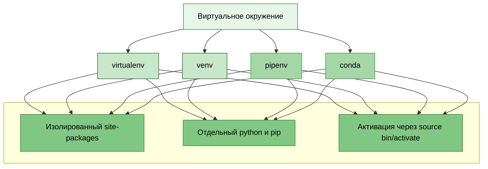
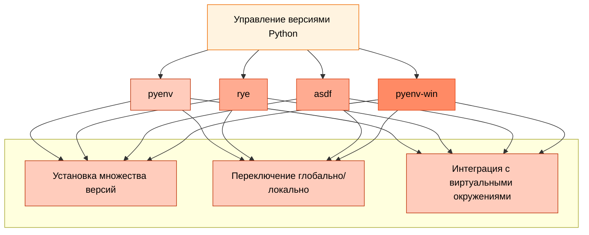

---
title: Виртуальные окружения и управление зависимостями
tags: [beginner, advanced, required, engineer, developer, architector]
description: Управление изолированной средой и зависимостями проекта.
---

# Виртуальные окружения и управление зависимостями

<div class="article-tags">
  <span class="tag tag-required">ОБЯЗАТЕЛЬНО</span>
  <span class="tag tag-beginner">ДЛЯ НОВИЧКОВ</span>
  <span class="tag tag-advanced">НЕ ДЛЯ НОВИЧКОВ</span>
  <span class="tag tag-inprogress">В РАЗРАБОТКЕ</span>
</div>
<span class="complexity-badge">Разработчику</span>
<span class="complexity-badge">Архитектору</span>

## Окружения

### Что такое окружение?

> Окружение — это изолированный "карман" на компьютере, где живёт конкретная версия Python и его библиотеки именно для одного проекта.

То есть - да, вы можете использовать несколько версий Python одновременно. Если ставить всё в систему глобально — будет ад. Вторая версия перезапишет первую, и первый проект сломается.

Окружение решает эту проблему:
- У каждого проекта — свой карман с нужными версиями
- Они не конфликтуют друг с другом
- Системный Python остаётся чистым.

```bash
# Создал карман для проекта
python -m venv my_project_env

# Залез в него
source my_project_env/bin/activate  # (my_project_env) появится в консоли

# Теперь всё, что устанавливаешь — только сюда
pip install pandas  # живёт только в этом кармане

# Вышел из кармана
deactivate
```

Окружение нужно, чтобы проекты не срались между собой и ты мог спокойно работать, не боясь что-то сломать. Это как у каждого члена семьи своя комната, а не все живут в одной куче.

---

Одним из ключевых аспектов профессиональной разработки на Python является корректное управление окружением — изолированной средой, в которой устанавливаются зависимости проекта. Без этого возникают конфликты между версиями библиотек, несовместимости с системными пакетами и проблемы при развёртывании (deployment). В этой главе мы подробно рассмотрим понятие окружения, его назначение и основные инструменты для его управления.

**Окружение (environment)** — это изолированная среда выполнения Python-приложения, включающая свою копию интерпретатора (или ссылку на него), отдельную директорию с установленными пакетами и независимый sys.path.

Представьте: один проект использует Django 3.2, а другой — Django 5.0. Если установить оба глобально, они перезапишут друг друга. Окружение позволяет каждому проекту иметь свои зависимости без конфликтов.

Существуют два основных типа окружений:
	- Виртуальные окружения (virtual environments) — изолируют зависимости.
	- Инструменты управления версиями Python (Python version managers) — позволяют переключаться между разными версиями самого интерпретатора.

---

### Конфликт версий

Конфликт версий возникает, когда два или более проекта требуют разных версий одной библиотеки, установленных в одну и ту же среду. Например, проект А использует библиотеку `requests` версии 2.28.0 с определённым API, а проект Б требует версию 2.31.0, где часть методов изменена или удалена. При глобальной установке вторая версия перезапишет первую, и проект А перестанет работать корректно.

Типичные сценарии конфликтов:

| Сценарий | Пример | Последствие |
|----------|--------|-------------|
| Прямой конфликт зависимостей | Проект 1 требует `Django==3.2`, проект 2 требует `Django==5.0` | Одна версия перезаписывает другую при установке |
| Транзитивный конфликт | Библиотека А требует `numpy>=1.20`, библиотека Б требует `numpy<1.20` | Установка обеих библиотек невозможна в одном окружении |
| Конфликт системных пакетов | Системный пакетный менеджер установил `cryptography` версии 3.4, а приложение требует 4.0+ | Обновление через `pip` может нарушить работу системных утилит |

Конфликты проявляются в виде ошибок импорта, исключений `AttributeError` при вызове несуществующих методов, или неожиданного поведения из-за изменений в логике библиотеки между версиями.

---

### Несовместимости с системными пакетами

Системные пакеты — это компоненты, установленные через менеджер пакетов операционной системы (apt, yum, pacman, Homebrew). Они обслуживают работу самой ОС и её утилит. Примеры: `python3-distutils` в Ubuntu, `python3-tk` для поддержки Tkinter.

Несовместимость возникает при одновременном управлении одной библиотекой через два канала:

```bash
# Системная установка через apt
sudo apt install python3-numpy

# Попытка обновить через pip
pip install --upgrade numpy
```

Последствия:
- Системные утилиты, зависящие от конкретной версии библиотеки, могут перестать работать
- Обновление через `pip` может нарушить целостность пакетной базы ОС
- При обновлении системы через `apt upgrade` изменения от `pip` будут перезаписаны

Рекомендуемый подход — полностью изолировать проектные зависимости от системных пакетов с помощью виртуальных окружений. Системный Python используется только как база для создания изолированных сред.

---

### Изолированная среда выполнения

Изолированная среда выполнения — это каталог файловой системы, содержащий минимальный набор компонентов для запуска Python-кода с собственными зависимостями. Среда включает:

- Символическую ссылку или копию интерпретатора Python
- Отдельный каталог `site-packages` для установленных пакетов
- Собственную переменную окружения `PYTHONPATH`
- Изолированные исполняемые файлы `pip`, `python`

При активации среды переменные окружения изменяются так, что команды `python` и `pip` ссылаются на компоненты внутри каталога среды, а не на глобальные системные версии.

Пример структуры виртуального окружения:

```
myenv/
├── bin/                     # Исполняемые файлы (Linux/macOS)
│   ├── python -> python3.11
│   ├── python3 -> python3.11
│   ├── python3.11
│   ├── pip
│   ├── pip3
│   └── activate             # Скрипт активации
├── lib/
│   └── python3.11/
│       └── site-packages/   # Каталог зависимостей
└── pyvenv.cfg               # Конфигурация среды
```

На Windows структура аналогична, но каталог `bin/` называется `Scripts/`, а исполняемые файлы имеют расширение `.exe`.

---

## Создание окружения

### Стандартный способ через venv

```bash
# Создание окружения в текущей директории
python -m venv env

# Создание с указанием конкретной версии интерпретатора
python3.11 -m venv env-py311

# Создание с копированием интерпретатора вместо символических ссылок
python -m venv --copies env-copied
```

После создания активируйте окружение:

```bash
# Linux/macOS
source env/bin/activate

# Windows PowerShell
.\env\Scripts\Activate.ps1

# Windows cmd
.\env\Scripts\activate.bat
```

Признак успешной активации — префикс имени окружения в приглашении терминала: `(env) user@host:~/project$`.

### Создание через virtualenv (для старых версий Python)

```bash
# Установка инструмента один раз глобально
pip install virtualenv

# Создание окружения
virtualenv env-legacy

# Создание с указанием версии интерпретатора
virtualenv -p python3.8 env-py38
```

### Создание через Poetry

```bash
# Инициализация проекта с созданием окружения
poetry new myproject
cd myproject
poetry env use python3.11

# Или для существующего проекта
poetry env use $(which python3.11)
```

Poetry автоматически создаёт и управляет окружением при первом вызове `poetry install`.

## Удаление окружения

Виртуальное окружение — это обычный каталог файловой системы. Его удаление не требует специальных команд.

```bash
# Деактивация текущего окружения (если активно)
deactivate

# Удаление каталога окружения
rm -rf env          # Linux/macOS
rmdir /s env        # Windows cmd
Remove-Item -Recurse -Force env  # Windows PowerShell
```

Важные замечания:
- Перед удалением убедитесь, что окружение деактивировано
- Удаление не затрагивает исходный код проекта — только зависимости в `site-packages`
- Если окружение управлялось через Poetry, используйте `poetry env remove python3.11` для корректного удаления

## Обнаружение существующих окружений

Виртуальные окружения не регистрируются в центральном реестре. Их наличие определяется по файловой структуре проектов.

### Поиск окружений в текущем проекте

```bash
# Поиск каталогов с признаками окружения
find . -name "pyvenv.cfg" -type f 2>/dev/null

# Альтернативный поиск по структуре каталогов
find . -type d -name "bin" -exec test -f "{}/python" \; -print 2>/dev/null | sed 's|/bin||'
```

### Проверка активного окружения

```bash
# Путь к текущему интерпретатору
which python
# Пример вывода: /home/user/project/env/bin/python

# Проверка переменной VIRTUAL_ENV
echo $VIRTUAL_ENV
# При активном окружении выводит путь к нему

# Список установленных пакетов (работает только в активированном окружении)
pip list --local
```

### Управление окружениями через менеджеры

| Инструмент | Команда просмотра окружений | Команда просмотра версий Python |
|------------|-----------------------------|---------------------------------|
| Poetry     | `poetry env list`           | `poetry env list --full-path`   |
| pyenv      | —                           | `pyenv versions`                |
| conda      | `conda env list`            | `conda info --envs`             |

Poetry хранит окружения в системном каталоге (обычно `~/.cache/pypoetry/virtualenvs`), а не внутри проекта. Поэтому поиск через `find` не покажет их — требуется использовать команду `poetry env list`.


## Виртуальные окружения

Виртуальные окружения:



---

## Инструменты управления версиями

Инструменты управления версиями Python:



---

Рассмотрим основные инструменты.

### venv

venv — это встроенный модуль Python (начиная с версии 3.3), предназначенный для создания лёгких виртуальных окружений.
```bash
python -m venv myenv
```
Эта команда создаст директорию myenv/, содержащую:
	- bin/ (на Linux/macOS) или Scripts/ (на Windows) — исполняемые файлы (python, pip).
	- lib/ — установленные пакеты.
	- pyvenv.cfg — конфигурация окружения.

Активация производится так:
```
# Linux/macOS
source myenv/bin/activate

# Windows
myenv\Scripts\activate
```
После активации вы увидите (myenv) в командной строке — это означает, что все последующие команды pip install будут влиять только на это окружение.

Деактивация - deactivate.

---

### virtualenv

virtualenv — сторонняя библиотека, предшественник venv. Обеспечивает те же функции, но с дополнительными возможностями. Установка:
```bash
pip install virtualenv
```

Использование:
```
virtualenv myenv
source myenv/bin/activate  # Linux/macOS
```
Для новых проектов рекомендуется использовать venv, так как он «родной». virtualenv актуален в legacy-системах.

---

### pipenv

pipenv — это инструмент, объединяющий pip и virtualenv в единую систему с поддержкой lock-файлов, графа зависимостей и автоматического управления окружением.

Установка:
```bash
pip install pipenv
```

Инициализация проекта:
```bash
cd myproject
pipenv install
```

Это создаст:
	- Pipfile — замена requirements.txt, содержит прямые зависимости.
	- Pipfile.lock — зафиксированные версии всех пакетов (включая транзитивные), гарантирует воспроизводимость.

Установка пакетов:
```bash
pipenv install requests        # Добавит в [packages]
pipenv install pytest --dev    # Добавит в [dev-packages]
```

Активация оболочки:
```bash
pipenv shell
```

Это автоматически активирует виртуальное окружение.

Запускать команды уже так:
```bash
pipenv run python script.py
```

---

### pyenv

pyenv решает другую задачу: он позволяет устанавливать и переключаться между разными версиями интерпретатора Python.

Зачем это нужно?
	- Проект A требует Python 3.8.
	- Проект B использует новейшие фичи Python 3.12.
	- Системный Python — 3.9.

pyenv позволяет иметь все три и переключаться по необходимости.

---

### pyproject.toml

pyproject.toml — это конфигурационный файл, стандартизированный в PEP 518 и PEP 621, который заменяет собой комбинацию setup.py, setup.cfg, requirements.txt.

---

## Практический пример полного цикла работы

```bash
# 1. Создание проекта
mkdir analysis-tool
cd analysis-tool

# 2. Создание окружения
python -m venv .venv

# 3. Активация
source .venv/bin/activate  # Linux/macOS

# 4. Обновление инструментов внутри окружения
pip install --upgrade pip setuptools wheel

# 5. Установка зависимостей
pip install pandas numpy matplotlib requests

# 6. Фиксация зависимостей
pip freeze > requirements.txt

# 7. Работа с проектом
python main.py

# 8. Деактивация
deactivate

# 9. Удаление окружения при необходимости
rm -rf .venv
```

Типичная практика — называть каталог окружения `.venv` и добавлять его в `.gitignore`. Это позволяет команде использовать единый подход к управлению зависимостями, сохраняя при этом окружение вне системы контроля версий.

---