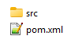
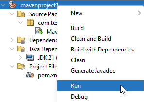
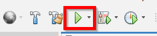
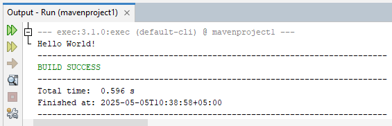
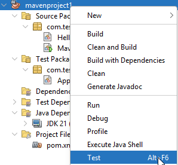
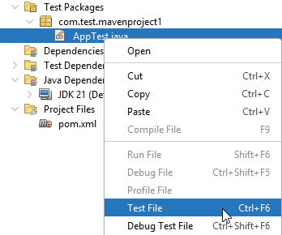
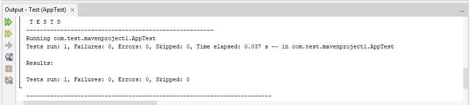
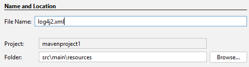
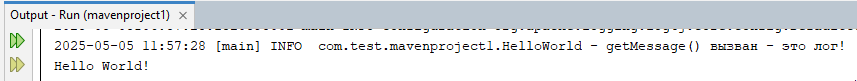
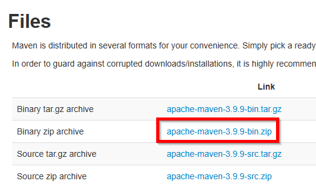

---
title: Первая программа на Java
tags: [beginner, advanced, required, engineer, developer, architector]
description: Гайд по установке и настройке с написанием первой программы и её запуском.
---

# Первая программа на Java

<div class="article-tags">
  <span class="tag tag-required">ОБЯЗАТЕЛЬНО</span>
  <span class="tag tag-beginner">ДЛЯ НОВИЧКОВ</span>
  <span class="tag tag-advanced">НЕ ДЛЯ НОВИЧКОВ</span>
  <span class="tag tag-inprogress">В РАЗРАБОТКЕ</span>
</div>
<span class="complexity-badge">Разработчику</span>
<span class="complexity-badge">Архитектору</span>

## Первая программа на Java

<div class="callout callout--tip">
  <div class="callout-title">Практическое задание</div>
Выполните нижеследующее задание.
</div>


А теперь давайте немного попрактикуемся и посмотрим, как выглядит работа с Java. Пройдитесь и выполните все действия по алгоритму, но на каждом шаге старайтесь исследовать то, что на экране, чтобы понимать.

---

### Алгоритм написания базовой программы на Java

1. Установите **Apache NetBeans** и запустите (на рабочем столе будет ярлык).
2. Выберите **«New Project»** (или File – New Project).
3. Выберите **«Java with Maven»** (в списке шаблонов – Maven – Java Application).
4. Заполните сведения о проекте:
	- *Project Name: mavenproject1* – можете задать своё имя;
	- *Project Location* – выберите папку, где будет храниться проект;
	- *Project Folder* – укажет путь к проекту;
	- *Artifact Id* – название проекта;
	- *Group Id* – название группы – назовите, с учётом правил, которые мы изучили выше, к примеру, назовём «com.test»;
	- *Version* – это будет версия, которая добавится к названию исполняемого файла и запишется в метаданные;
	- *Package* – опционально, по умолчанию будет groupId.projectName.
5. Проверьте всё и нажмите *Finish* – IDE подготовит проект.
6. В левой части окна будет структура проекта:


Если мы перейдём к папке с проектом, увидим следующее:



7. В правой части окна будет код со стандартным шаблоном:
```java
package com.test.mavenproject1;

public class Mavenproject1 {

    public static void main(String[] args) {
        System.out.println("Hello World!");
    }
}
```

8. Чтобы запустить проект, нужно нажать правой кнопкой мыши на проекте в структуре и выбрать **«Run»** или нажать зеленую кнопку на панели инструментов:




9. Если всё успешно – то в нижней части окна в панели **Output** будет полная информация о процессе сборки, и вывод исполнения команды. Наша программа просто должна вывести сообщение **«Hello World!»**, и это мы можем увидеть именно там:



10. Если переименовать проект или изменить свойства без рефакторинга, может быть ошибка в панели **Output** – и если ошибка говорит о том, что не может найти main class (который и нужен для запуска), то нужно исправить **pom.xml** и пересобрать проект. Там указывается то, что мы заполняли в пункте 4.

11. Сборка проекта выполняется через кнопку с иконкой молотка на панели инструментов, или через правую кнопку мыши на проекте и **«Build»** (построить проект), **«Clean and Build»** (с очисткой). Успешная сборка показывает в **Output** *«BUILD SUCCESS»*.

12. Исполняемый файл будет только после сборки, в папке **«target»**:


---

### Добавление юнит-теста

Усложним задачу – теперь добавим юнит-тест к нашему проекту.

13. Начинаем с добавления зависимости в **pom.xml**. Мы хотим добавить **JUnit**, поэтому в элемент `<project>`, после `<properties>`, добавляем `<dependencies>`:
```xml
<project xmlns="http://maven.apache.org/POM/4.0.0" xmlns:xsi="http://www.w3.org/2001/XMLSchema-instance" xsi:schemaLocation="http://maven.apache.org/POM/4.0.0 http://maven.apache.org/xsd/maven-4.0.0.xsd">
    <modelVersion>4.0.0</modelVersion>
    <groupId>com.test</groupId>
    <artifactId>mavenproject1</artifactId>
    <version>1.0</version>
    <packaging>jar</packaging>
    <properties>
        <project.build.sourceEncoding>UTF-8</project.build.sourceEncoding>
        <maven.compiler.release>21</maven.compiler.release>
        <exec.mainClass>com.test.mavenproject1.Mavenproject1</exec.mainClass>
    </properties>
    <dependencies>
        <dependency>
            <groupId>org.junit.jupiter</groupId>
            <artifactId>junit-jupiter</artifactId>
            <version>5.10.0</version>
            <scope>test</scope>
        </dependency>
    </dependencies>
</project>
```

Нас интересует:
	- *groupId* - org.junit.jupiter;
	- *artifactId* - junit-jupiter;’
	- *version* - 5.10.0 (можно, конечно, и новее);
	- *scope* – test (это означает, что библиотека будет доступна только при тестировании).

14. Не забываем сохранять файлы после завершения создания или редактирования. Теперь нам нужно создать класс для теста. NetBeans автоматически создаёт папку `src/test/java` при сохранении *pom.xml*, но если этого не произошло – создаём через ПКМ по проекту и *«New»* - *«Folder»*. Для интереса, эту структуру можно воссоздать и через файловую систему, создав «матрёшку» из папок – «`\src\test\java\com\test\mavenproject1`»:


Мы получим в структуре **«Test Packages»**:


15. Создадим новый файл, через ПКМ на **Test Packages** – назовём его `AppTest.java`:
	- New – Java Class;
	- Class Name – AppTest;
	- Location – Test Packages.

16. Откроем новый файл и добавим туда код:
```java
package com.test.mavenproject1;

import static org.junit.jupiter.api.Assertions.*;
import org.junit.jupiter.api.Test;

public class AppTest {
    @Test
    public void testHelloWorldOutput() {
        String expected = "Hello World!";
        String actual = HelloWorld.getMessage();
        assertEquals(expected, actual);
    }
}
```

Что здесь произошло:
	- `package` – наш пакет;
	- `import` – импортируемая библиотека JUnit;
	- `@Test` – аннотация, что здесь у нас тест;
	- `public void testHelloWorldOutput()` – метод для тестирования – именно в нём мы можем проверить поведение программы, допустим, вынеся логику из Main;
	- `String expected` – переменная ожидаемого результата, то есть, что должно быть;
	- `String actual` – переменная фактического результата, то есть, что вышло в итоге;
	- `assertEquals` – expected сравнивается на равенство с actual.

Но нам понадобится изменить и основной класс.

17. В `Mavenproject1.java` вносим изменения, чтобы сделать основной класс тестируемым:
```java
package com.test.mavenproject1;

public class Mavenproject1 {

    public static void main(String[] args) {
        System.out.println(HelloWorld.getMessage());
    }
}
```

Здесь мы указываем, что `System.out.println` выведет не прямо указанный тут текст `Hello World!`, а именно то, что значение надо получить через `getMessage()` из класса `HelloWorld`. Но этого класса у нас нет – нужно создать.

18. Создаём новый класс `HelloWorld.java` в **Source Packages** и добавляем туда код:

```java
package com.test.mavenproject1;

public class HelloWorld {
    public static String getMessage() {
        return "Hello World!";
    }
}
```

Это и есть метод `getMessage()`, который возвращает значение «Hello World». Это простой пример, как один класс может не содержать в себе нужную информацию, а получить из другого класса, но с условием – метод публичный – именно поэтому мы добавляем `public` к классу и методу – так работает инкапсуляция. Собственно, метод `getMessage()` и будет тестироваться.

19. Чтобы запустить тесты, нужно нажать ПКМ на проекте и выбрать «Test» или ПКМ на `AppTest.java` и выбрать «Test File»:




20. В окне **Output** мы увидим результаты тестов:



---

### Добавление логирования

И ещё одна тренировка. Добавим логирование. Используем **Apache Log4j 2**.

21. Как и в прошлый раз, добавим в `pom.xml` зависимости для нашего логирования:
```xml
 <dependency>
     <groupId>org.apache.logging.log4j</groupId>
     <artifactId>log4j-api</artifactId>
     <version>2.24.3</version>
 </dependency>
 <dependency>
     <groupId>org.apache.logging.log4j</groupId>
     <artifactId>log4j-core</artifactId>
     <version>2.24.3</version>
 </dependency>
```

22. В директории `src/main/` создаём папку `resources`, а в ней – файл с названием «`log4j2.xml`», с следующим содержимым:
```xml
<?xml version="1.0" encoding="UTF-8"?>
<Configuration status="INFO">
    <Appenders>
        <Console name="Console" target="SYSTEM_OUT">
            <PatternLayout pattern="%d{yyyy-MM-dd HH:mm:ss} [%t] %-5level %logger{36} - %msg%n"/>
        </Console>
    </Appenders>
    <Loggers>
        <Root level="debug">
            <AppenderRef ref="Console"/>
        </Root>
    </Loggers>
</Configuration>
```

Файл можно создать через New – Other – XML – XML Document:


Внимательно с названием папки и файла – строго как указано выше:



Как можно понять из содержимого, этот файл создаёт конфигурацию для вывода логов в консоль с определённым форматом по шаблону в PatternLayout.

23. Внесём изменения в `HelloWorld.java`:
```java
package com.test.mavenproject1;

import org.apache.logging.log4j.LogManager;
import org.apache.logging.log4j.Logger;

public class HelloWorld {
    private static final Logger logger = LogManager.getLogger(HelloWorld.class);
    
    public static String getMessage() {
        logger.info("getMessage() вызван – это лог!");
        return "Hello World!";
    }
}
```

Здесь мы импортировали пакеты `log4j` через `import`, создали логирование – приватная переменная-метод `logger`, и в наш метод `getMessage()` к имеющейся логике добавили логирование с выводом текста.

24. Проверим работу через тест или просто запустив через Run:



В окне вывода мы увидим **INFO** – и текст по формату, как мы указали в xml-файле конфигурации, а также текст, который мы ввели в `logger.info()`.

Так можно логировать важные действия в процессе работы.

25. Если столкнулись с ошибками в коде `HelloWorld.java`, значит некорректно подключена конфигурация, либо нужно перезагрузить проект через ПКМ по проекту – **Reload Project** – в этот момент происходит обновление всех компонентов проекта, в том числе пакетов. Если и обновление не помогло – можно выполнить **Build with Dependencies**, чтобы собрать билд с учётом зависимостей.


Этого пока достаточно. Если вы успешно проделали это шаги, вы:
	- ознакомились с IDE NetBeans;
	- настроили pom.xml;
	- успешно собрали и запустили программу;
	- подключили пакеты и добавили JUnit;
	- написали модульный тест (юнит-тест);
	- добавили логирование при помощи Log4j.

Но это запуск программы через IDE.

---

### Запуск вне IDE

Так, у нас есть программа. Как её запустить вне IDE? Ответ – настроить Maven.

1. Добавляем в pom.xml новый тег `<build>`:
```xml
    <build>
        <plugins>
            <plugin>
                <groupId>org.apache.maven.plugins</groupId>
                <artifactId>maven-shade-plugin</artifactId>
                <version>3.5.0</version>
                <executions>
                    <execution>
                        <phase>package</phase>
                        <goals>
                            <goal>shade</goal>
                        </goals>
                        <configuration>
                            <transformers>
                                <transformer implementation="org.apache.maven.plugins.shade.resource.ManifestResourceTransformer">
                                    <mainClass>com.test.mavenproject1.Mavenproject1</mainClass>
                                </transformer>
                            </transformers>
                        </configuration>
                    </execution>
                </executions>
            </plugin>
        </plugins>
    </build>
```

Это конфигурация для Maven.

2. Переходим на сайт `maven.apache.org` и скачиваем архив с maven:



3. Создадим для себя папку для разработки (обычно создают что-то вроде `C:\devtools`) и распакуем Maven туда. Пример пути:
```
C:\devtools\apache-maven-3.9.9.
```

4. Добавим переменную окружения:
На примере Windows
```
- Система 
– Дополнительные параметры системы 
– Переменные среды 
– найти PATH 
– Изменить 
– и добавить C:\devtools\apache-maven-3.9.9\bin.
```
Это нужно, чтобы терминал понимал, что за «mvn» мы пишем. Для проверки можно открыть командную строку и написать `mvn --version`, и, если версия отобразится – значит всё сделали правильно.

5. Скачиваем и устанавливаем Java SE Разработка Kit – скачать можно с официального сайта - `oracle.com/th/java/technologies/downloads/`
При установке запоминаем путь, куда устанавливается JDK – к примеру, `C:\Program Files\Java\jdk-24\`

6. Проверяем, есть ли переменная среда JAVA_HOME и равна ли она `C:\Program Files\Java\jdk-24\` (так система будет понимать, где JDK).
К слову, другие IDE, допустим, IDEA, как раз просят показать, где находится JDK и предоставляют удобные инструменты для конфигурации Maven.

7. Теперь можно гарантированно работать с Maven даже через командную строку. Переходим к папке проекта и в командной строке вводим «mvn clean package» для сборки проекта.
После сборки мы получаем файл в папке с проектом – к примеру, «`mavenproject1\target\mavenproject1-1.0.jar`».

8. Проверяем, есть ли Java на компьютере – вводим java -version в командной строке, и, если видим информацию – значит, всё готово к работе.

9. Переходим в командной строке к папке с проектом и вводим команду:
```bash
java -jar target/mavenproject1-1.0.jar
```

Таким образом мы даём команду запустить исполняемый файл и видим наши логи и Hello World!

Именно так и работает принцип – программа запускается через JVM – система запускает Java, и запускает исполняемый файл. Можно, конечно, собрать exe или bat, к примеру, который выполнит команду по запуску файла jar, или использовать специальные менеджеры, вроде JBoss.

---
