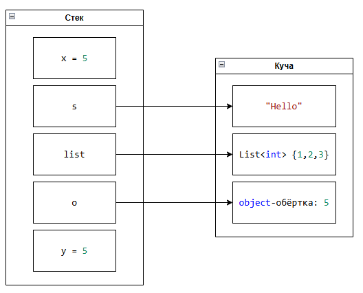

# Стек и куча

<div class="article-tags">
  <span class="tag tag-required">ОБЯЗАТЕЛЬНО</span>
  <span class="tag tag-beginner">ДЛЯ НОВИЧКОВ</span>
</div>

<span class="complexity-badge">Разработчику</span>
<span class="complexity-badge">Архитектору</span>

## Стек и куча

### Хранение данных

Как мы помним, данные записываются в объекты и хранятся в памяти, а платформа управляет этой памятью благодаря возможностям языка. И именно для фиксации и структурирования объектов и используются различные типы данных.

В .NET (и в большинстве языков с управляемой памятью) используется две основные области памяти для хранения данных:
	- **Стек (stack)** - хранит локальные переменные, параметры методов, адреса возврата. Он управляется автоматически, и доступ к нему быстрый.
	- **Куча (heap)** - хранит объекты (ссылочные типы), динамические данные. Управление кучей выполняется через сборщик мусора (GC).

---

### Стек

Значимые типы в основном хранятся в стеке. Почему в основном? Потому что есть исключение - если значимый тип — поле в классе, он хранится в куче, потому что весь объект — в куче.

Получается так:

| Тип данных | Категория | Хранение |
|-----------|----------|---------|
| `int`, `long`, `short` (целые числа) | Значимый (`struct`) | Стек (если локальная переменная); Куча (если поле в классе) |
| `byte` (двоичные данные) | Значимый (`struct`) | Стек (если локальная переменная); Куча (если поле в классе) |
| `float`, `double`, `decimal` (числа с запятой) | Значимый (`struct`) | Стек (локальная); Куча (в классе) |
| `char` (символ) | Значимый (`struct`) | Стек (локальная); Куча (в классе) |
| `bool` (булево) | Значимый (`struct`) | Стек (локальная); Куча (в классе) |
| `string` (строка) | Ссылочный (`class`) | Стек (ссылка); Куча (сам объект) |
| `object` (объект) | Ссылочный (`class`) | Стек (ссылка); Куча (объект) |
| `struct` (структура) | Значимый (`struct`) | Стек (если локальная переменная); Куча (если поле в классе) |
| `class` (класс) | Ссылочный (`class`) | Стек (ссылка); Куча (объект) |
| `enum` (перечисление) | Значимый (обёртка над `int` и пр.) | Стек (локальная); Куча (в классе) |
| `array` (массив) | Ссылочный | Стек (ссылка); Куча (весь массив) |
| `delegate` | Ссылочный (`class`) | Стек (ссылка); Куча (объект) |
| `interface` | Ссылочный (по ссылке) | Стек (ссылка); Куча (реализующий объект) |
| `ValueTuple` (кортеж) | Значимый (`struct`) | Стек (локальная); Куча (в классе) |
| Анонимные типы | Ссылочный (`class`) | Стек (ссылка); Куча (объект) |

Стек работает по принципу **LIFO (Last In, First Out)**, каждый вызов метода создаёт **кадр стека (stack frame)**, где хранятся локальные переменные, параметры и адрес возврата (куда вернуться после завершения).

К примеру у нас есть три метода:
```csharp
static void Main()
{
    int a = 10;
    MethodA();
}

static void MethodA()
{
    int b = 20;
    MethodB();
}

static void MethodB()
{
    int c = 30;
}
```
Во время выполнения MethodB() стек будет следующим:
```csharp
[ MethodB: c = 30     ] ← вершина стека
[ MethodA: b = 20     ]
[ Main:    a = 10     ]
```
При завершении MethodB её кадр удаляется — c исчезает.

Благодаря этому в стеке очень быстрый доступ и автоматическое освобождение при выходе из метода. Есть ограничение размера (обычно 1-8 МБ).

---

### Куча

Куча чуть сложнее. Управление в ней осуществляется через **сборщик мусора (Garbage Collector, GC)**. Объекты в куче не удаляются сразу после выхода из области видимости. GC сам решает, когда объект больше не нужен, и освобождает память.

Значимые и ссылочные типы связываются через object или интерфейсы. Этот процесс связи включает в себя упаковку (boxing) и распаковку (unboxing).

Boxing — преобразование значимого типа в ссылочный. Когда значимый тип присваивается переменной типа object или интерфейсу, он копируется в кучу, и создаётся ссылка на него.
```csharp

int i = 123;          // i — в стеке
object o = i;         // Boxing: i копируется в кучу, o — ссылка на него
```
При таком раскладе, в куче создаётся объект-обёртка с копией значения i, а переменная o (в стеке) получает ссылку на этот объект.

Unboxing — обратное преобразование. Преобразование object обратно в значимый тип.
```csharp
int j = (int)o;       // Unboxing: копирование из кучи в стек
```
Здесь проверяется, что объект в куче - действительно int, и значение копируется из кучи в стек.

При таких преобразованиях главное учесть те самые ограничения размеров переменных, ведь C# строго типизирован. К примеру, нельзя сделать распаковку int как long. Также важно учесть то, что это дорогие в части ресурсов операции - выделение памяти, проверка типа, копирование данных - всё это в критичных по производительности участках (например, циклах) может принести проблемы производительности.

И если мы возьмём пример:
```csharp
class Program
{
    static void Main()
    {
        int x = 5;                    // x — в стеке
        string s = "Hello";           // s (ссылка) — в стеке; "Hello" — в куче
        List<int> list = new List<int> { 1, 2, 3 }; // list — ссылка в стеке; объект — в куче
        object o = x;                 // Boxing: x копируется в кучу, o — ссылка
        int y = (int)o;               // Unboxing: значение копируется обратно в стек
    }
}
```
То визуально это будет так:



Хранение в стеке порой не навсегда. Локальные переменные удаляются при выходе из метода. Но если вы захватите переменную в **замыкание (closure)** — она может быть «перемещена» в кучу (через создание объекта-обёртки). Также стоить отметить, что массивы значимых типов всё равно будут в куче - сам массив в куче, а ссылка в стеке. Точнее, элементы массива в куче, внутри объекта массива.

---