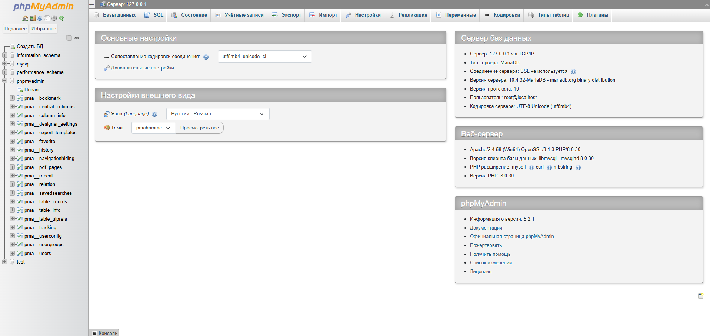

---
title: Настройка веб-сервера для работы с PHP
tags: [beginner, advanced, required, engineer, developer, architector]
---

# Настройка веб-сервера для работы с PHP

<div class="article-tags">
  <span class="tag tag-required">ОБЯЗАТЕЛЬНО</span>
  <span class="tag tag-beginner">ДЛЯ НОВИЧКОВ</span>
  <span class="tag tag-advanced">НЕ ДЛЯ НОВИЧКОВ</span>
  <span class="tag tag-inprogress">В РАЗРАБОТКЕ</span>
</div>
<span class="complexity-badge">Разработчику</span>
<span class="complexity-badge">Архитектору</span>

## Конфигурация сервера для PHP

Сложнейшая часть в работе с серверами включает их настройку и администрирование. В крупных проектах такая роль отводится отдельному администратору, однако PHP-разработчик вынужден разбираться в серверной логике, без этого никак.

### Механизм загрузки конфигурации

Интерпретатор PHP получает настройки из файла конфигурации **php.ini**. 

Процесс считывания этого файла зависит от способа запуска интерпретатора и типа интерфейса взаимодействия с веб-сервером, известного как **SAPI**.

Серверные модули загружают конфигурацию **один раз** в момент старта веб-сервера. 
 
Версии для CGI и командной строки CLI обращаются к файлу конфигурации при каждом запуске скрипта.
 
---

### Порядок поиска файла конфигурации

Система выполняет поиск файла php.ini в строго определённой последовательности. Приоритет имеет расположение, указанное в параметрах самого SAPI-модуля. Для веб-сервера Apache это директива `PHPIniDir`. Для интерфейсов CGI и CLI используется параметр командной строки `-c`.

Следующим уровнем проверки служит переменная окружения **PHPRC**. Значение этой переменной указывает путь к директории или конкретному файлу конфигурации.

Операционная система Windows использует **реестр** для хранения путей к конфигурации. Корневой ключ реестра зависит от разрядности операционной системы и версии PHP. 

Установка 32-разрядной версии PHP на 32-разрядную Windows или 64-разрядной версии на 64-разрядную Windows активирует раздел реестра `HKEY_LOCAL_MACHINE\SOFTWARE\PHP`. 

Установка 32-разрядной версии PHP на 64-разрядную Windows направляет поиск в раздел `HKEY_LOCAL_MACHINE\SOFTWARE\WOW6432Node\PHP`.

Система проверяет разделы реестра с учётом версии продукта. Поиск ведётся по ключам с полной версией `x.y.z`, затем по мажорной и минорной версии `x.y`, и в конце по мажорной версии `x`. Первый найденный ключ, содержащий значение `IniFilePath`, определяет расположение файла php.ini.

Значение `IniFilePath` в разделах `HKEY_LOCAL_MACHINE\SOFTWARE\PHP` или `HKEY_LOCAL_MACHINE\SOFTWARE\WOW6432Node\PHP` задаёт прямой путь к файлу конфигурации. Эта возможность доступна только в операционной системе Windows.

При отсутствии явных указаний система обращается к текущей рабочей директории. Это правило действует для всех интерфейсов, кроме CLI. Для серверных модулей следующим кандидатом становится директория веб-сервера. В остальных случаях на Windows проверка идёт в директории установки PHP.

Финальным этапом поиска служит системная директория операционной системы Windows, такая как `C:\windows` или `C:\winnt`. На других платформах путь определяется опцией времени компиляции `--with-config-file-path`.

Интерпретатор поддерживает специфичные для интерфейса файлы конфигурации. Вместо стандартного php.ini система может использовать файл **php-SAPI.ini**. Название SAPI определяется функцией `php_sapi_name()`. Примеры таких файлов включают `php-cli.ini` для командной строки и `php-apache.ini` для модуля Apache. При наличии файла для конкретного интерфейса он имеет приоритет над общим файлом.

---

### Уровни доступа к директивам

Каждая директива в файле конфигурации обладает определённым **уровнем доступа**, определяющим место её изменения. 

	- Уровень `INI_SYSTEM` разрешает изменение только в главном файле php.ini или через реестр Windows. 

	- Уровень `INI_PERDIR` допускает настройку в файлах httpd.conf, .htaccess или файлах .user.ini. 

	- Уровень `INI_ALL` позволяет изменять параметр в любом месте, включая runtime через функцию `ini_set()`. 

	- Уровень `INI_USER` предполагает изменение только в пользовательских скриптах во время выполнения.
	
---

## Управление ресурсами интерпретатора

Конфигурация определяет границы использования вычислительных ресурсов для каждого запроса. Эти параметры обеспечивают стабильность работы сервера и предотвращают исчерпание памяти или времени процессора одним скриптом.

### Лимиты памяти и времени выполнения

Директива `memory_limit` устанавливает максимальный объём оперативной памяти, доступный для выделения скрипту. Значение указывается в байтах с поддержкой суффиксов `K`, `M` и `G`. Типичные значения для современных приложений находятся в диапазоне от `128M` до `512M`. Превышение этого лимита приводит к завершению выполнения скрипта с фатальной ошибкой.

Параметр `max_execution_time` ограничивает длительность выполнения скрипта в секундах. Отсчёт времени начинается после успешного запуска скрипта и не включает время на инициализацию системы или ожидание внешних ресурсов, таких как базы данных или сетевые запросы, если они не блокируют поток выполнения. Значение `0` отключает ограничение по времени.

Директива `max_input_time` задаёт максимальное время в секундах, отводимое на парсинг входных данных, таких как переменные `GET`, `POST` и файлы. Это значение актуально для скриптов, обрабатывающих большие объёмы входящей информации.

---

### Обработка загружаемых данных и входных потоков

Параметр `post_max_size` определяет максимальный размер данных, принимаемых через метод POST. Это значение включает в себя все поля формы и загружаемые файлы. Размер POST-запроса не должен превышать этот лимит, иначе данные будут отброшены, и массив `$_POST` останется пустым.

Директива `upload_max_filesize` ограничивает размер одного загружаемого файла. Значение этого параметра должно быть меньше или равно `post_max_size`. Для одновременной загрузки нескольких файлов система также учитывает параметр `max_file_uploads`, который задаёт максимальное количество файлов в одном запросе. По умолчанию это значение равно `20`.

Параметр `enable_post_data_reading` управляет возможностью чтения сырых данных POST-запроса. Включение этой опции позволяет скрипту получать доступ к потоку `php://input`. Отключение этой функции может потребоваться для специфичных сценариев проксирования запросов.

Директива `variables_order` определяет порядок регистрации суперглобальных массивов переменных окружения, GET, POST, Cookie и Server. Строка `EGPCS` задаёт стандартный приоритет регистрации. Изменение порядка влияет на перезапись переменных с одинаковыми именами из разных источников.

---

## Расширения PHP в среде XAMPP

Расширения PHP представляют собой динамически подключаемые библиотеки, расширяющие базовую функциональность интерпретатора. В XAMPP они управляются через конфигурационный файл `php.ini`, расположенный в каталоге установки (например, `xampp\php\php.ini` для Windows).

### Принцип работы динамических расширений

Расширения загружаются интерпретатором при старте процесса PHP. В конфигурации используется директива:

```
extension=имя_модуля
```

Для модулей вне стандартного каталога расширений указывается абсолютный путь:

```
extension=/путь/к/библиотеке.so
```

В XAMPP каталог расширений определяется параметром `extension_dir` в `php.ini`. Для Windows это обычно `ext\`, для Linux/macOS — `lib/php/extensions/`.

### Структура конфигурации в XAMPP

В приведённом фрагменте конфигурации:

- Расширения без точки с запятой в начале строки активны и будут загружены
- Расширения с точкой с запятой закомментированы и не загружаются

Пример активного расширения:
```
extension=mbstring
```

Пример неактивного:
```
;extension=gd
```

---

### Назначение ключевых расширений из конфигурации

#### Обязательные для веб-разработки

- **mbstring** — поддержка многобайтовых кодировок (UTF-8), необходима для корректной работы с текстом на разных языках
- **fileinfo** — определение MIME-типа файлов по содержимому
- **curl** — выполнение HTTP-запросов к внешним сервисам
- **openssl** — криптографические операции, HTTPS-соединения

#### Работа с базами данных

- **mysqli** — нативный драйвер для MySQL с поддержкой процедурного и объектного интерфейса
- **pdo_mysql**, **pdo_sqlite**, **pdo_pgsql** — реализации интерфейса PDO для соответствующих СУБД
- **sqlite3** — встроенная поддержка локальной СУБД SQLite

#### Вспомогательные модули

- **bz2** — сжатие и распаковка данных в формате Bzip2
- **exif** — чтение метаданных из изображений (требует предварительной загрузки `mbstring`)
- **gettext** — интернационализация приложений через PO/MO-файлы

---

### Особенности XAMPP на разных платформах

#### Windows

- Расширения поставляются в виде DLL-файлов в каталоге `xampp\php\ext\`
- Имена файлов соответствуют шаблону `php_<модуль>.dll`
- Современный синтаксис `extension=модуль` автоматически преобразуется к полному имени файла

#### Linux/macOS

- Расширения поставляются как `.so`-файлы
- Каталог расширений обычно указан относительно корня установки XAMPP

---

### Как управлять расширениями?

1. **Активация расширения**: уберите точку с запятой перед директивой `extension=...` и перезапустите веб-сервер
2. **Проверка загрузки**: используйте функцию `phpinfo()` или выполните `php -m` в консоли
3. **Зависимости модулей**: некоторые расширения требуют предварительной загрузки других (например, `exif` зависит от `mbstring`)
4. **Производительность**: каждое активное расширение увеличивает время запуска PHP и потребление памяти; активируйте только необходимые модули
5. **Безопасность**: отключайте расширения, предоставляющие доступ к системным ресурсам (например, `ffi`), если они не используются в проекте

---

### Расширения, требующие дополнительной настройки

Некоторые модули из закомментированного списка требуют установки внешних библиотек:
- **gd** — для обработки изображений (требует libgd)
- **intl** — для локализации (требует ICU)
- **oci8** — для работы с Oracle Database (требует Instant Client)
- **ldap** — для интеграции с каталогами LDAP (требует OpenLDAP)

В XAMPP эти библиотеки часто включены в дистрибутив, но могут потребовать ручной активации и настройки путей.

---

### Версионная совместимость

Расширения привязаны к конкретной версии PHP. При обновлении PHP в XAMPP необходимо использовать расширения, скомпилированные для этой версии. Использование библиотек от другой версии приведёт к ошибкам загрузки модуля.

---

## Регистрация ошибок и логирование

Система предоставляет гибкие инструменты для контроля за возникновением ошибок и ведением журналов событий. Настройка этих параметров зависит от стадии разработки или промышленной эксплуатации.

### Отображение сообщений об ошибках

Директива `display_errors` управляет выводом текстов ошибок непосредственно в тело HTTP-ответа. Включение этой опции удобно на этапе разработки для оперативного анализа проблем. В производственной среде рекомендуется отключать отображение ошибок пользователю для предотвращения утечки чувствительной информации о структуре приложения и сервера.

Параметр `display_startup_errors` контролирует показ ошибок, возникающих на этапе запуска самого интерпретатора PHP. Эти сообщения часто содержат информацию о проблемах с расширениями или конфигурацией ядра. Значение по умолчанию в современных версиях установлено в 1, что требует явного отключения в боевых системах.

Директива `error_reporting` задаёт уровень детализации сообщаемых ошибок. Битовая маска позволяет фильтровать уведомления, предупреждения, фатальные ошибки и другие типы событий. Использование константы E_ALL обеспечивает регистрацию всех возможных событий, кроме строго определённых исключений в зависимости от версии языка.

---

### Запись в журналы и форматирование

Параметр `log_errors` активирует запись сообщений об ошибках в системный журнал или файл, указанный в директиве `error_log`. Путь к файлу журнала может быть абсолютным или относительным. Специальное значение `syslog` направляет сообщения в системный логгер операционной системы.

Директива `error_log_mode` устанавливает права доступа к создаваемому файлу журнала в восьмеричном формате. Значение `0o644` обеспечивает чтение файла владельцем и группой, и только чтение для остальных пользователей. Эта опция доступна начиная с версии `8.2.0`.

Параметр `log_errors_max_len` ограничивает максимальную длину записи одной ошибки в журнале. Это предотвращает заполнение диска чрезмерно длинными сообщениями, содержащими, например, большие фрагменты стека вызовов или данных.

Директива `ignore_repeated_errors` запрещает дублирование одинаковых сообщений об ошибках в журнале в рамках одного скрипта. Схожий параметр `ignore_repeated_source` игнорирует повторение ошибок из одного и того же файла и строки кода.

Параметр `html_errors` активирует форматирование сообщений об ошибках с использованием HTML-тегов. Это улучшает читаемость ошибок при просмотре в браузере. Директивы `docref_root и docref_ext` добавляют ссылки на документацию языка рядом с описанием функции, вызвавшей ошибку.

---

## Оптимизация выполнения кода

Модуль **OPcache** повышает производительность приложений за счёт сохранения предварительно скомпилированного байт-кода в общей памяти. Это исключает необходимость загрузки и парсинга скриптов при каждом запросе.

### Базовые настройки кэширования

Директива `opcache.enable` активирует механизм кэширования для веб-сервера. Отдельный параметр `opcache.enable_cli` управляет работой кэша для интерфейса командной строки. По умолчанию кэширование в CLI отключено для избежания конфликтов при одновременном выполнении разных скриптов.

Параметр `opcache.memory_consumption` выделяет объём оперативной памяти для хранения кэша скриптов. Значение указывается в мегабайтах. Достаточный размер памяти предотвращает частую очистку кэша и перезапись данных. Типичные значения варьируются от `128` до `512 МБ` в зависимости от количества файлов в проекте.

Директива `opcache.interned_strings_buffer` задаёт размер памяти для хранения строковых констант. Механизм интернирования строк позволяет хранить одинаковые строки в единственном экземпляре, экономя память и ускоряя сравнение.

Параметр `opcache.max_accelerated_files` определяет максимальное количество ключей скриптов в хэш-таблице кэша. Рекомендуется выбирать значение, превышающее количество файлов в проекте, с запасом для будущих изменений. Доступные значения представляют собой степени двойки.

Директива `opcache.max_wasted_percentage` устанавливает порог процента «потерянной» памяти, при достижении которого инициируется перезапуск кэша. Потерянной считается память, занятая удалёнными или обновлёнными скриптами, которые ещё не были вытеснены.

---

### Валидация и обновление кэша

Параметр `opcache.validate_timestamps` контролирует проверку времени модификации файлов скриптов. Включение этой опции обеспечивает автоматическое обновление кэша при изменении исходного кода. Отключение проверки значительно повышает производительность в производственной среде, однако требует ручного сброса кэша при развёртывании новых версий.

Директива `opcache.revalidate_freq` задаёт частоту проверки временных меток файлов в секундах. Значение `0` означает проверку при каждом запросе. Увеличение интервала снижает нагрузку на файловую систему.

Параметр `opcache.file_update_protection` устанавливает задержку в секундах между моментом изменения файла и его попаданием в кэш. Это предотвращает кэширование неполных файлов во время процесса загрузки новой версии по сети или через FTP.

Директива `opcache.revalidate_path` включает учёт полного пути к файлу при проверке актуальности кэша. Это полезно в средах, где одни и те же файлы могут быть доступны через разные символические ссылки.

---

### Продвинутые функции и JIT компиляция

Директива `opcache.save_comments` сохраняет комментарии `_docblock_` в кэше. Отключение этой опции экономит память, однако может нарушить работу библиотек, использующих аннотации для мета-программирования или маппинга объектов.

Параметр `opcache.fast_shutdown` ускоряет завершение работы скрипта за счёт пропуска стандартной процедуры освобождения памяти. Вместо этого используется механизм сборщика мусора операционной системы.

Директива `opcache.preload` позволяет загружать указанные файлы в память при старте сервера. Эти файлы становятся доступными всем скриптам без необходимости повторного подключения. Параметр `opcache.preload_user` задаёт пользователя, от имени которого выполняется предзагрузка, что важно для соблюдения прав доступа к файлам.

Механизм **JIT (Just-In-Time)** компиляции преобразует **байт-код** в **машинные инструкции** процессора во время выполнения. Директива `opcache.jit` управляет режимом работы JIT. Режим `tracing` обеспечивает компиляцию часто исполняемых участков кода на основе анализа профиля выполнения.

Параметр `opcache.jit_buffer_size` выделяет память для хранения скомпилированного машинного кода. Отсутствие выделенной памяти отключает JIT, даже если сам режим активирован. Размер буфера зависит от сложности алгоритмов в приложении.

Настройки `opcache.jit_hot_loop`, `opcache.jit_hot_func` и `opcache.jit_hot_return` определяют пороговые значения счётчиков вызовов для инициирования компиляции циклов, функций и операторов возврата. Тонкая настройка этих параметров позволяет адаптировать работу JIT под специфику нагрузки приложения.

Директива `opcache.jit_max_root_traces` ограничивает максимальное количество корневых трассировок для компиляции. Параметр `opcache.jit_max_side_traces` задаёт лимит для побочных трассировок. Превышение этих лимитов приводит к отказу от дальнейшей компиляции новых участков кода.

Параметр `opcache.huge_code_pages` инструктирует систему использовать огромные страницы памяти для кода. Это снижает нагрузку на TLB процессора и может повысить производительность на системах с большим объёмом кэша. Поддержка этой функции зависит от операционной системы и прав доступа пользователя.

---

## Пример файла конфигурации

Файл php.ini представляет собой текстовый документ, содержащий директивы настройки интерпретатора. Каждая строка файла содержит либо комментарий, либо директиву с присвоенным значением. Комментарии начинаются с точки с запятой. Директивы записываются в формате `ключ=значение`. Секции файла группируются по функциональному назначению.

Ниже представлен образец файла, включающий ключевые параметры для серверной среды. Значения подобраны для обеспечения баланса между производительностью и безопасностью.

```
[PHP]
engine = On
short_open_tag = Off
precision = 14
output_buffering = 4096
zlib.output_compression = Off
implicit_flush = Off
serialize_precision = -1
open_basedir = /var/www/html:/tmp
disable_functions = exec,passthru,shell_exec,Система,proc_open,popen,curl_exec,curl_multi_exec,parse_ini_file,show_source
disable_classes =
request_order = "GP"
register_argc_argv = Off
auto_globals_jit = On
post_max_size = 64M
auto_prepend_file =
auto_append_file =
default_mimetype = "text/html"
default_charset = "UTF-8"
doc_root =
user_dir =
enable_dl = Off
file_uploads = On
upload_max_filesize = 64M
max_file_uploads = 20
allow_url_fopen = On
allow_url_include = Off
default_socket_timeout = 60
cli_server.color = On

[Date]
date.timezone = "Europe/Moscow"

[filter]
filter.default = unsafe_raw
filter.default_flags =

[iconv]
iconv.input_encoding = UTF-8
iconv.internal_encoding = UTF-8
iconv.output_encoding = UTF-8

[intl]
intl.default_locale =
intl.error_level = E_WARNING

[sqlite3]
sqlite3.extension_dir =

[Pcre]
pcre.backtrack_limit = 1000000
pcre.recursion_limit = 100000
pcre.jit = 1

[Pdo]
pdo_odbc.connection_pooling = strict

[Pdo_mysql]
pdo_mysql.default_socket =

[Phar]
phar.readonly = On
phar.require_hash = On
phar.cache_list =

[mail function]
SMTP = localhost
smtp_port = 25
mail.add_x_header = Off
mail.log = /var/log/php_mail.log

[SQL]
sql.safe_mode = Off

[ODBC]
odbc.allow_persistent = On
odbc.check_persistent = On
odbc.max_persistent = -1
odbc.max_links = -1
odbc.defaultlrl = 4096
odbc.defaultbinmode = 1

[MySQLi]
mysqli.max_persistent = -1
mysqli.allow_persistent = On
mysqli.max_links = -1
mysqli.default_port = 3306
mysqli.default_socket =
mysqli.default_host =
mysqli.default_user =
mysqli.default_pw =
mysqli.reconnect = Off

[mysqlnd]
mysqlnd.collect_statistics = On
mysqlnd.collect_memory_statistics = Off

[OCI8]
oci8.connection_class =
oci8.max_persistent = -1
oci8.persistent_timeout = -1
oci8.ping_interval = 60
oci8.privileged_connect = Off
oci8.statement_cache_size = 20

[PostgreSQL]
pgsql.allow_persistent = On
pgsql.auto_reset_persistent = Off
pgsql.max_persistent = -1
pgsql.max_links = -1
pgsql.ignore_notice = 0
pgsql.log_notice = 0

[bcmath]
bcmath.scale = 0

[browscap]
browscap =

[Session]
session.save_handler = files
session.save_path = "/var/lib/php/sessions"
session.use_strict_mode = 1
session.use_cookies = 1
session.use_only_cookies = 1
session.name = PHPSESSID
session.auto_start = 0
session.cookie_lifetime = 0
session.cookie_path = /
session.cookie_domain =
session.cookie_httponly = 1
session.cookie_secure = 1
session.cookie_samesite = Lax
session.serialize_handler = php
session.gc_probability = 1
session.gc_divisor = 1000
session.gc_maxlifetime = 1440
session.referer_check =
session.cache_limiter = nocache
session.cache_expire = 180
session.use_trans_sid = 0
session.sid_length = 32
session.trans_sid_tags = "a=href,area=href,frame=src,form="
session.trans_sid_hosts =
session.hash_function = 0
session.hash_bits_per_character = 5
url_rewriter.tags =
url_rewriter.hosts =
session.upload_progress.enabled = 1
session.upload_progress.cleanup = 1
session.upload_progress.prefix = "upload_progress_"
session.upload_progress.name = "PHP_SESSION_UPLOAD_PROGRESS"
session.upload_progress.freq = "1%"
session.upload_progress.min_freq = "1"
session.lazy_write = 1

[Assertion]
zend.assertions = -1

[COM]
com.autoregister_typelib = Off
com.autoregister_casesensitive = On
com.autoregister_verbose = Off
com.dotnet_version =

[mbstring]
mbstring.language = Neutral
mbstring.encoding_translation = Off
mbstring.http_input =
mbstring.http_output =
mbstring.internal_encoding = UTF-8
mbstring.substitute_character = none
mbstring.func_overload = 0
mbstring.strict_detection = Off
mbstring.http_output_conv_mimetypes = "^(text/|application/xhtml\+xml)"

[gd]
gd.jpeg_ignore_warning = 1

[exif]
exif.encode_unicode = ISO-8859-15
exif.decode_unicode_motorola = UCS-2BE
exif.decode_unicode_intel = UCS-2LE
exif.encode_jis =
exif.decode_jis_motorola = JIS
exif.decode_jis_intel = JIS

[Tidy]
tidy.default_config =
tidy.clean_output = Off

[soap]
soap.wsdl_cache_enabled = 1
soap.wsdl_cache_dir = "/tmp"
soap.wsdl_cache_ttl = 86400
soap.wsdl_cache_limit = 5

[sysvshm]
sysvshm.init_mem = 10000

[ldap]
ldap.max_links = -1

[dba]
dba.default_handler =

[opcache]
opcache.enable = 1
opcache.enable_cli = 0
opcache.memory_consumption = 256
opcache.interned_strings_buffer = 16
opcache.max_accelerated_files = 20000
opcache.max_wasted_percentage = 10
opcache.use_cwd = 1
opcache.validate_timestamps = 0
opcache.revalidate_freq = 60
opcache.revalidate_path = 0
opcache.save_comments = 1
opcache.fast_shutdown = 1
opcache.enable_file_override = 0
opcache.optimization_level = 0x7FFEBFFF
opcache.inherited_hack = 0
opcache.dups_fix = 0
opcache.blacklist_filename =
opcache.max_file_size = 0
opcache.consistency_checks = 0
opcache.force_restart_timeout = 180
opcache.error_log =
opcache.log_verbosity_level = 1
opcache.preferred_memory_model =
opcache.protect_memory = 0
opcache.restrict_api =
opcache.file_update_protection = 2
opcache.huge_code_pages = 1
opcache.lockfile_path = /tmp
opcache.opt_debug_level = 0
opcache.file_cache =
opcache.file_cache_only = 0
opcache.file_cache_consistency_checks = 1
opcache.file_cache_fallback = 1
opcache.validate_permission = 0
opcache.validate_root = 0
opcache.preload = /var/www/html/preload.php
opcache.preload_user = www-Данные
opcache.jit = tracing
opcache.jit_buffer_size = 256M
opcache.jit_debug = 0
opcache.jit_bisect_limit = 0
opcache.jit_prof_threshold = 0.005
opcache.jit_max_root_traces = 1024
opcache.jit_max_side_traces = 128
opcache.jit_max_exit_counters = 8192
opcache.jit_hot_loop = 64
opcache.jit_hot_func = 127
opcache.jit_hot_return = 8
opcache.jit_hot_side_exit = 8
opcache.jit_blacklist_root_trace = 16
opcache.jit_blacklist_side_trace = 8
opcache.jit_max_loop_unrolls = 8
opcache.jit_max_recursive_calls = 2
opcache.jit_max_recursive_returns = 2
opcache.jit_max_polymorphic_calls = 2

[curl]
curl.cainfo =

[openssl]
openssl.cafile =
openssl.capath =

[local_session_options]
session.cookie_httponly = 1
session.cookie_secure = 1
```

### Разбор директив безопасности и доступа

Параметр `open_basedir` ограничивает доступ скриптов к файловой системе. Указание путей `/var/www/html` и `/tmp` разрешает работу только внутри директории сайта и временной папки. Попытки доступа за пределы этих каталогов завершаются ошибкой.

Директива `disable_functions` запрещает выполнение конкретных функций языка. Список содержит команды работы с оболочкой и сетью. Исключение этих функций из доступного набора повышает защищенность сервера от выполнения произвольного кода.

Параметр `allow_url_fopen` разрешает открытие удаленных файлов как локальных. Включение этой опции требуется для работы многих библиотек. Параметр `allow_url_include` остается выключенным для предотвращения подключения удаленных скриптов.

Настройка `expose_php` позволяет через установку значения `Off` скрывать версию PHP в заголовках ответа. Это усложняет задачу злоумышленникам при поиске уязвимостей конкретной версии.

---

### Управление сессиями и cookie

Секция `[Session]` содержит настройки хранения данных сессии. Параметр `session.save_handler = files` указывает на хранение в файлах. Путь `session.save_path` ведет в директорию `/var/lib/php/sessions`.

Параметр `session.use_strict_mode = 1` активирует строгий режим проверки идентификаторов сессии. Сервер отвергает неинициализированные идентификаторы. Это предотвращает фиксацию сессии злоумышленником.

Настройки cookie обеспечивают безопасность передачи идентификатора. `session.cookie_httponly = 1` запрещает доступ к cookie через JavaScript. `session.cookie_secure = 1` требует передачи cookie только по защищенному протоколу HTTPS. `session.cookie_samesite = Lax` защищает от CSRF-атак путем ограничения отправки cookie на кросс-доменные запросы.

Параметры `session.gc_probability` и `session.gc_divisor` определяют вероятность запуска сборщика мусора. Значения 1 и 1000 создают вероятность 0.1% при каждом запросе. Параметр `session.gc_maxlifetime` устанавливает время жизни сессии в секундах.

---

### Настройка кэширования OPcache

Секция `[opcache]` управляет встроенным кэшем байт-кода. Параметр `opcache.enable = 1` активирует модуль. `opcache.enable_cli = 0` отключает кэширование для командной строки, так как скрипты CLI обычно выполняются одноразово.

Параметр `opcache.memory_consumption = 256` выделяет 256 мегабайт оперативной памяти для хранения кэша. Этого объема достаточно для крупных проектов. `opcache.interned_strings_buffer = 16` выделяет память для строковых констант.

Параметр `opcache.max_accelerated_files = 20000` задает количество файлов в хэш-таблице. Значение превышает количество файлов в типичном проекте для избежания коллизий. `opcache.max_wasted_percentage = 10` определяет порог перезапуска кэша при фрагментации.

Настройка `opcache.validate_timestamps = 0` отключает проверку времени изменения файлов. Это требует ручного сброса кэша при обновлении кода, однако значительно повышает производительность. Параметр `opcache.revalidate_freq = 60` задает интервал проверки при включенной валидации.

Параметр `opcache.jit` = tracing активирует JIT-компиляцию в режиме трассировки. `opcache.jit_buffer_size = 256M` выделяет память для машинного кода. Это ускоряет выполнение вычислительно сложных задач.

Параметр `opcache.preload` указывает путь к файлу предзагрузки. Скрипт `preload.php` загружается в память при старте сервера. Параметр `opcache.preload_user = www-Данные` задает владельца процесса для соблюдения прав доступа.

---

### Обработка ошибок и логирование

Параметр `zend.assertions = -1` отключает утверждения assert в производственной среде. Это исключает накладные расходы на проверку условий. В среде разработки значение устанавливается в 1 для отладки.

Настройка `mail.log = /var/log/php_mail.log` направляет логи функции mail в отдельный файл. Это позволяет отслеживать попытки отправки почты скриптами.

Параметр `error_reporting` через установку значения `E_ALL | E_STRICT` обеспечивает полный отчет об ошибках. В производственной среде значение корректируется для скрытия уведомлений уровня Notice.

---

### Работа с базами данных

Секции `[MySQLi]`, `[Pdo_mysql]` и `[mysqlnd]` содержат настройки подключения к базам данных. Параметр `mysqli.default_port = 3306` устанавливает стандартный порт MySQL.

Параметр `mysqli.allow_persistent = On` разрешает постоянные соединения. Это снижает накладные расходы на установление соединения при каждом запросе. Параметр mysqli.reconnect = Off отключает автоматическое переподключение, так как это поведение может скрыть проблемы сети.

Настройка `mysqlnd.collect_statistics = On` включает сбор статистики драйвером. Параметр `mysqlnd.collect_memory_statistics = Off` отключает сбор статистики памяти для экономии ресурсов.

Секция `[PostgreSQL]` содержит аналогичные параметры для работы с PostgreSQL. Параметр `pgsql.allow_persistent = On` разрешает постоянные соединения. `pgsql.log_notice = 0` отключает логирование уведомлений сервера баз данных.

---

### Кодировки и локаль

Секция `[Date]` устанавливает часовой пояс. `date.timezone = "Europe/Moscow"` задает московское время. Все функции работы с датой используют этот пояс по умолчанию.

Секция `[mbstring]` управляет многобайтовыми кодировками. `mbstring.internal_encoding = UTF-8` устанавливает внутреннюю кодировку. `mbstring.func_overload = 0` отключает перегрузку стандартных функций, так как это поведение считается устаревшим.

Параметр `default_charset = "UTF-8"` задает кодировку HTTP-ответа. Браузеры используют это значение для отображения текста.

---

### Ограничения загрузки и выполнения

Параметр `post_max_size = 64M` ограничивает размер POST-запроса. `upload_max_filesize = 64M` ограничивает размер одного файла. Значения совпадают для обеспечения консистентности. `max_file_uploads = 20` ограничивает количество файлов в одном запросе.

Параметр `max_execution_time` через установку значения 30 ограничивает время выполнения скрипта 30 секундами. Для долгоживущих процессов значение увеличивается или устанавливается в 0.

Параметр `memory_limit` через установку значения 256M ограничивает потребление памяти скриптом. Превышение лимита завершает выполнение скрипта.

---

### Сетевые параметры и сокеты

Параметр `default_socket_timeout = 60` устанавливает таймаут для сетевых операций. Это предотвращает бесконечное ожидание ответа от удаленных серверов.

Секция `[curl]` содержит параметр `curl.cainfo`. Указание пути к файлу сертификатов CA обеспечивает проверку SSL-сертификатов при HTTPS-запросах.

Секция `[openssl]` содержит параметры `openssl.cafile` и `openssl.capath`. Эти директивы дублируют настройки сертификатов для функций OpenSSL.

---

### Системные параметры и расширения

Параметр `enable_dl = Off` запрещает загрузку расширений во время выполнения. Это повышает безопасность, так как скрипт не может динамически подключать неизвестные модули.

Параметр `register_argc_argv = Off` отключает регистрацию переменных командной строки для веб-запросов. Это экономит ресурсы парсинга.

Параметр `auto_globals_jit = On` активирует создание суперглобальных массивов только при обращении к ним. Это снижает потребление памяти на запрос.

Секция `[Phar]` управляет архивами PHP. `phar.readonly = On` запрещает создание и изменение Phar-архивов через функции PHP. Это предотвращает модификацию исполняемых архивов скриптами.

Секция `[soap]` содержит настройки кэширования WSDL. `soap.wsdl_cache_enabled = 1` активирует кэш. `soap.wsdl_cache_dir = "/tmp"` указывает директорию для хранения кэша. `soap.wsdl_cache_ttl = 86400` устанавливает время жизни кэша в секундах.

---

### Интеграция с веб-сервером

Файл конфигурации взаимодействует с настройками веб-сервера. Веб-сервер передает переменные окружения в интерпретатор. Интерпретатор применяет директивы php.ini к каждому запросу.

Параметр `cgi.fix_pathinfo = 1` обеспечивает корректную обработку путей CGI. Веб-сервер Nginx передает скрипту путь к файлу через переменную `SCRIPT_FILENAME`.

Параметр `fastcgi.impersonate = 0` обеспечивает выполнение скриптов от имени пользователя веб-сервера. Установка значения 1 позволяет имперсонацию пользователей в среде IIS.

---

### Валидация и фильтрация данных

Секция `[filter]` содержит настройки фильтрации. `filter.default = unsafe_raw` устанавливает фильтр по умолчанию. Это требует явного указания фильтров в коде для обработки входных данных.

Параметр `request_order = "GP"` устанавливает порядок заполнения массива `$_REQUEST`. В массив попадают только переменные `GET` и `POST`. Переменные `COOKIE` исключаются из этого массива для повышения безопасности.

---

### Работа с архивами и сжатием

Параметр `zlib.output_compression = Off` отключает сжатие вывода на уровне PHP. Веб-сервер Nginx или Apache выполняет сжатие более эффективно. Включение этой опции создает двойное сжатие при неправильной настройке сервера.

Параметр `output_buffering = 4096` активирует буферизацию вывода. Размер буфера составляет 4096 байт. Это позволяет модифицировать заголовки после начала вывода контента.

---

### Расширения и модули

Секции `[iconv]`, `[intl]`, `[sqlite3]`, `[ldap]`, `[dba]` содержат настройки соответствующих расширений. Отсутствие значений означает использование настроек по умолчанию.

Параметр `extension_dir` указывает путь к директории с бинарными файлами расширений. Веб-сервер загружает расширения при старте.

Параметр `zend_extension` используется для подключения отладчиков и ускорителей, таких как Xdebug или OPcache. OPcache подключается через директиву `opcache.enable`.

---

### Логирование и отладка

Параметр `log_errors = On` активирует запись ошибок в лог. Параметр `error_log` указывает путь к файлу журнала.

Параметр `display_errors = Off` предотвращает утечку информации о структуре приложения.

Параметр `html_errors = On` форматирует ошибки в виде HTML-ссылок. Это удобно для отладки в браузере.

---

### Специфичные настройки окружения

Параметр `sys_temp_dir` указывает директорию для временных файлов системы. Это значение используется функциями работы с временными данными.

Параметр `session.upload_progress.enabled = 1` активирует отслеживание прогресса загрузки. Это позволяет клиентским скриптам отображать прогресс-бар при загрузке больших файлов.

Параметр `unserialize_callback_func` указывает функцию обратного вызова при десериализации неизвестных классов. Это предотвращает уязвимости десериализации.

Параметр `unserialize_max_depth = 4096` ограничивает глубину вложенности массивов при десериализации. Это защищает от атак переполнения стека.

---

### Завершение конфигурации

Файл заканчивается секцией `[local_session_options]`. Эта секция демонстрирует возможность переопределения параметров сессии в конце файла. Параметры `session.cookie_httponly` и `session.cookie_secure` дублируются для явного указания настроек безопасности.

Комментарии в файле служат документацией для администратора. Они поясняют назначение групп параметров. Изменение значений требует перезапуска веб-сервера или пула процессов PHP-FPM для вступления в силу.

---

## Apache HTTP Server

### Архитектура веб-сервера

**Apache HTTP Server** представляет собой программное обеспечение для организации доступа к веб-контенту через сетевые протоколы. Сервер обрабатывает входящие запросы от браузеров клиентов и возвращает запрошенные ресурсы в формате HTML, изображений, стилей или скриптов. 

Архитектура системы построена на модульном принципе, позволяющем подключать функциональные расширения по мере необходимости. **Ядро сервера** отвечает за базовую обработку соединений, а **модули** реализуют специфические задачи вроде шифрования, аутентификации или сжатия данных.

Рабочий процесс сервера включает несколько этапов обработки запроса:
1. Клиент устанавливает TCP-соединение с сервером на порту 80 или 443.
2. Apache принимает соединение и считывает заголовки HTTP-запроса. 
3. Система анализирует запрошенный ресурс, применяет правила конфигурации и определяет способ обработки. 
4. Статические файлы передаются напрямую, динамические запросы направляются интерпретаторам PHP или другим обработчикам. 
5. Сервер формирует HTTP-ответ с кодом состояния, заголовками и телом сообщения, затем закрывает соединение или сохраняет его для повторного использования.

### Конфигурационный файл httpd.conf

Файл `httpd.conf` содержит основные директивы управления поведением веб-сервера. 

Директивы располагаются в контекстах: глобальный контекст, виртуальные хосты, каталоги и файлы. 

Глобальные настройки определяют параметры работы всего сервера, включая порты прослушивания, пути к документам и логи, ограничения ресурсов.

Директива `ServerRoot` указывает корневую директорию установки Apache. Параметр `Listen` задает IP-адреса и порты для приёма соединений. Директива `DocumentRoot` определяет путь к файлам, доступным через веб. Блок `<Directory>` применяет настройки к конкретным путям файловой системы, включая права доступа, возможности выполнения скриптов и переопределение конфигурации через файлы `.htaccess`.

Пример конфигурации базового виртуального хоста:

```
<VirtualHost *:80>
    ServerName example.com
    ServerAlias www.example.com
    DocumentRoot "C:/xampp/htdocs/example"
    
    <Directory "C:/xampp/htdocs/example">
        Options Indexes FollowSymLinks
        AllowOverride All
        Require all granted
    </Directory>
    
    ErrorLog "logs/example-error.log"
    CustomLog "logs/example-access.log" combined
</VirtualHost>
```

Директива `AllowOverride` регулирует использование файлов `.htaccess` для переопределения настроек. Значение `All` разрешает любые директивы, `None` запрещает переопределение, конкретные значения ограничивают набор доступных команд. Параметр `Require` управляет контролем доступа на основе IP-адресов, аутентификации или других условий.

### Настройка SSL в httpd-ssl.conf

Файл `httpd-ssl.conf` отвечает за конфигурацию защищённых соединений по протоколу HTTPS. Модуль `mod_ssl` реализует поддержку шифрования трафика с использованием сертификатов `X.509` и протоколов `TLS`. Конфигурация включает параметры сертификатов, наборы шифров и политики безопасности соединений.

Директива `SSLEngine on` активирует обработку HTTPS-запросов в виртуальном хосте. Параметры `SSLCertificateFile` и `SSLCertificateKeyFile` указывают пути к файлам сертификата и приватного ключа. Цепочка промежуточных сертификатов задаётся через `SSLCertificateChainFile`. Набор разрешённых шифров контролируется директивой `SSLCipherSuite`, которая принимает строку с перечнем алгоритмов в порядке приоритета.

Пример настройки SSL для виртуального хоста:

```
<VirtualHost *:443>
    ServerName example.com
    DocumentRoot "C:/xampp/htdocs/example"
    
    SSLEngine on
    SSLCertificateFile "conf/ssl.crt/server.crt"
    SSLCertificateKeyFile "conf/ssl.key/server.key"
    
    SSLProtocol all -SSLv2 -SSLv3
    SSLCipherSuite HIGH:MEDIUM:!aNULL:!MD5
    
    <Directory "C:/xampp/htdocs/example">
        Options Indexes FollowSymLinks
        AllowOverride All
        Require all granted
    </Directory>
</VirtualHost>
```

Параметр `SSLProtocol` отключает устаревшие версии протоколов SSL, уязвимые к атакам. Директива `SSLCipherSuite` исключает слабые алгоритмы шифрования, обеспечивая защиту передаваемых данных. Опция `SSLHonorCipherOrder` передаёт серверу право выбора шифра из предложенных клиентом, что усиливает контроль над параметрами соединения.

### Специфика httpd-xampp.conf

Файл `httpd-xampp.conf` содержит настройки, специфичные для сборки XAMPP. Конфигурация включает алиасы для служебных инструментов, ограничения доступа по умолчанию и интеграцию компонентов пакета. Директивы этого файла переопределяют базовые настройки Apache для обеспечения удобства локальной разработки.

Алиас `/xampp` предоставляет доступ к панели управления и документации через веб-интерфейс. Блок `<LocationMatch>` ограничивает доступ к служебным путям, разрешая соединения только с локального хоста. Директивы `Alias` и `Directory` связывают URL-адреса с физическими путями к файлам инструментов XAMPP.

Пример конфигурации алиаса для phpMyAdmin:

```
Alias /phpmyadmin "C:/xampp/phpMyAdmin/"
<Directory "C:/xampp/phpMyAdmin">
    AllowOverride AuthConfig
    Require local
    Require ip 192.168.1
</Directory>
```

Параметр `Require local` разрешает доступ только с адреса 127.0.0.1 и ::1. Добавление `Require ip` расширяет список доверенных адресов для доступа из локальной сети. Конфигурация по умолчанию обеспечивает базовую защиту служебных интерфейсов от внешних подключений.

### Модульная система и обработчики

Apache использует модули для расширения функциональности без изменения ядра. Модули подключаются через директиву `LoadModule` в конфигурационном файле. Модуль `mod_php` интегрирует интерпретатор PHP, обрабатывая файлы с расширениями `.php`. Модуль `mod_rewrite` реализует механизм переписывания URL для создания дружественных адресов.

Обработчики файлов определяются директивой `AddHandler` или `SetHandler`. Обработчик `application/x-httpd-php` передаёт файлы интерпретатору PHP. Обработчик `server-status` активирует страницу состояния сервера для мониторинга. Директива `FilesMatch` применяет настройки к файлам по регулярному выражению имени.

Пример настройки обработчика PHP:

```
<FilesMatch "\.php$">
    SetHandler application/x-httpd-php
</FilesMatch>

AddType application/x-httpd-php .php
AddType application/x-httpd-php-source .phps
```

Система виртуальных хостов позволяет размещать несколько сайтов на одном сервере. Каждый виртуальный хост имеет собственный `ServerName`, `DocumentRoot` и набор директив. Apache выбирает хост на основе заголовка `Host` в запросе клиента. Конфигурация виртуальных хостов упрощает разработку нескольких проектов на локальной машине.

---

## MySQL в составе XAMPP

### Архитектура сервера баз данных

**MySQL** представляет собой систему управления реляционными базами данных с клиент-серверной архитектурой. 

Серверная часть обрабатывает запросы на языке SQL, управляет хранением данных и обеспечивает контроль доступа. Клиентские приложения подключаются к серверу через сетевой протокол или локальный сокет для выполнения операций с данными.

Ядро MySQL включает подсистемы оптимизации запросов, управления транзакциями и репликации. Планировщик запросов анализирует структуру данных и статистику для выбора эффективного плана выполнения. Менеджер транзакций обеспечивает атомарность, согласованность, изоляцию и долговечность операций. Система репликации поддерживает синхронизацию данных между несколькими серверами.

### Конфигурация my.ini

Файл `my.ini` содержит параметры запуска и работы сервера MySQL. Секция `[mysqld]` определяет настройки серверной части, секция `[client]` задаёт параметры клиентских подключений. Параметры включают порты, пути к данным, размеры буферов и политики безопасности.

Директива `port` устанавливает номер TCP-порта для приёма соединений. Параметр `basedir` указывает корневую директорию установки MySQL. Опция `datadir` определяет путь к файлам баз данных. Размер буфера ключей задаётся параметром `key_buffer_size`, влияющим на производительность операций с индексами MyISAM.

Пример базовой конфигурации:

```
[mysqld]
port=3306
basedir="C:/xampp/mysql"
datadir="C:/xampp/mysql/Данные"
tmpdir="C:/xampp/tmp"
character-set-server=utf8mb4
collation-server=utf8mb4_unicode_ci

[client]
port=3306
default-character-set=utf8mb4
```

Параметр `character-set-server` задаёт кодировку по умолчанию для новых баз данных и таблиц. Значение `utf8mb4` поддерживает полный набор символов Unicode, включая эмодзи и специальные знаки. Опция `collation-server` определяет правила сортировки и сравнения строк.

### Управление пользователями и привилегиями

Система прав доступа MySQL основана на учётных записях пользователей и наборах привилегий. Пользователь определяется комбинацией имени и хоста подключения. Привилегии назначаются на уровне сервера, базы данных, таблицы или столбца. Команда `GRANT` предоставляет права, команда `REVOKE` отзывает их.

Пример создания пользователя с правами на базу данных:

```sql
CREATE USER 'developer'@'localhost' IDENTIFIED BY 'secure_password';
GRANT SELECT, INSERT, UPDATE, DELETE ON project_db.* TO 'developer'@'localhost';
FLUSH PRIVILEGES;
```

Привилегия `SELECT` разрешает чтение данных, `INSERT` позволяет добавлять записи, `UPDATE` изменяет существующие строки, `DELETE` удаляет данные. Права на уровне базы данных распространяются на все таблицы внутри неё. Команда `FLUSH PRIVILEGES` применяет изменения в системе прав доступа без перезапуска сервера.

### Движки хранения данных

MySQL поддерживает несколько движков хранения с различными характеристиками. Движок InnoDB обеспечивает поддержку транзакций, внешних ключей и блокировок на уровне строк. Движок MyISAM предлагает быстрое чтение и полнотекстовый поиск без поддержки транзакций. Выбор движка влияет на производительность и возможности базы данных.

Создание таблицы с указанием движка:

```sql
CREATE TABLE users (
    id INT AUTO_INCREMENT PRIMARY KEY,
    username VARCHAR(50) NOT NULL,
    email VARCHAR(100) UNIQUE,
    created_at TIMESTAMP DEFAULT CURRENT_TIMESTAMP
) ENGINE=InnoDB DEFAULT CHARSET=utf8mb4;
```

Параметр `ENGINE` выбирает движок хранения для таблицы. Опция `DEFAULT CHARSET` задаёт кодировку данных таблицы. Автоматическое увеличение идентификатора реализуется через `AUTO_INCREMENT`. Ограничение `UNIQUE` обеспечивает уникальность значений в столбце `email`.

---

## FileZilla Server

### Назначение FTP-сервера

**FileZilla Server** предоставляет сервис передачи файлов по протоколам **FTP**, **FTPS** и **SFTP**. Сервер принимает подключения от клиентов, аутентифицирует пользователей и выполняет операции с файлами на диске. Протокол FTP использует два канала: управляющий для команд и данных для передачи содержимого.

Архитектура сервера включает модули аутентификации, управления сессиями и логирования. Модуль аутентификации проверяет учётные данные пользователей против базы данных или системных записей. Менеджер сессий отслеживает активные подключения и ресурсы. Система логирования фиксирует события для аудита и отладки.

### Конфигурация пользователей и прав доступа

Интерфейс управления FileZilla Server позволяет создавать учётные записи и настраивать права доступа. Пользователь определяется именем и паролем, опционально привязывается к IP-адресам. Права доступа задаются на уровне директорий с возможностью чтения, записи, удаления и создания папок.

Пример конфигурации пользователя через интерфейс:

```
User: ftp_user
Password: ********
Home directory: C:/xampp/htdocs/uploads

Directory access:
C:/xampp/htdocs/uploads - Read, Write, Delete, Create
C:/xampp/htdocs/public - Read only
```

Параметр `Home directory` устанавливает корневую директорию для пользователя. Права доступа к поддиректориям переопределяют общие настройки. Опция `Read only` разрешает только скачивание файлов, комбинация `Read, Write, Delete, Create` предоставляет полный доступ.

### Настройка безопасных соединений

Протокол FTPS расширяет FTP поддержкой шифрования через TLS. Сервер требует наличия SSL-сертификата для установки защищённого соединения. Клиент проверяет сертификат и согласовывает параметры шифрования перед передачей данных.

Конфигурация FTPS в FileZilla Server:

```
Enable FTP over TLS support: Yes
Certificate file: C:/xampp/FileZillaFTP/ssl/server.crt
Private key file: C:/xampp/FileZillaFTP/ssl/server.key
Require explicit FTP over TLS: Yes
```

Параметр `Require explicit FTP over TLS` обязывает клиентов использовать шифрование для аутентификации. Передача учётных данных и файлов происходит в зашифрованном виде. Сертификат может быть самоподписанным для локального использования или выданным центром сертификации для публичного доступа.

### Логирование и мониторинг

Система логирования записывает события подключений, аутентификации и операций с файлами. Логи помогают анализировать активность пользователей, выявлять ошибки и расследовать инциденты безопасности. Уровень детализации настраивается от базовых событий до полного трассирования команд.

Пример записи в журнале:

```
(2025-02-17 14:30:22) ftp_user - Connected from 192.168.1.100
(2025-02-17 14:30:23) ftp_user - Authenticated successfully
(2025-02-17 14:30:25) ftp_user - Uploaded file report.pdf (2048576 bytes)
(2025-02-17 14:30:28) ftp_user - Disconnected
```

Запись содержит временную метку, имя пользователя, событие и дополнительные параметры. Анализ логов позволяет отслеживать объёмы передачи, время сессий и источники подключений. Ротация логов предотвращает переполнение диска старыми записями.

---

## Mercury Mail Server

### Компоненты почтовой системы

**Mercury Mail Transport Система** реализует сервисы электронной почты для локальных сетей и разработки. Система включает модули SMTP для отправки, POP3 и IMAP для приёма сообщений, а также веб-интерфейс для управления. Архитектура поддерживает обработку входящих и исходящих потоков писем с фильтрацией и маршрутизацией.

Модуль SMTP принимает сообщения от клиентов и пересылает их получателям или внешним серверам. Модули POP3 и IMAP предоставляют доступ к почтовым ящикам для чтения и управления сообщениями. Веб-интерфейс позволяет администрировать пользователей, домены и очереди сообщений через браузер.

### Конфигурация доменов и пользователей

Настройка Mercury начинается с определения локальных доменов и учётных записей. Домен связывается с директорией хранения почты пользователей. Пользователь определяется именем, паролем и квотой на объём ящика.

Пример конфигурации домена:

```
Domain: local.test
Root directory: C:/xampp/Mailroot/local.test

Users:
admin - Password: ******** - Quota: 100 MB
developer - Password: ******** - Quota: 50 MB
```

Параметр `Root directory` указывает путь к файлам почты домена. Квота ограничивает максимальный объём сообщений пользователя. Система автоматически отклоняет письма при превышении лимита.

### Настройка SMTP-ретрансляции

Функция ретрансляции позволяет Mercury пересылать сообщения внешним серверам. Конфигурация включает параметры аутентификации и шифрования для безопасной доставки. Ретрансляция полезна для отправки уведомлений из веб-приложений через внешний почтовый сервис.

Пример настройки ретрансляции:

```
Smart host: smtp.external.com:587
Authentication: Required
Username: relay_user@local.test
Password: ********
Use TLS: Yes
```

Параметр `Smart host` задаёт адрес внешнего SMTP-сервера. Аутентификация требуется большинством провайдеров для предотвращения спама. Шифрование TLS защищает учётные данные и содержимое писем при передаче.

### Фильтрация и обработка сообщений

Система фильтров Mercury анализирует входящие и исходящие сообщения по заданным правилам. Правила проверяют заголовки, адресата, размер и содержимое писем. Действия включают доставку, отклонение, перенаправление или добавление заголовков.

Пример правила фильтрации:

```
Rule: Block large attachments
Condition: Attachment size > 10 MB
Action: Reject message with error "Attachment too large"

Rule: Tag external mail
Condition: Sender domain != local.test
Action: Add header X-External: Yes
```

Условия правила используют операторы сравнения и логические связки. Действия выполняются последовательно при совпадении условия. Система фильтров помогает контролировать поток почты и применять политики безопасности.

---

## Apache Tomcat

### Архитектура Java-сервлетов

**Apache Tomcat** реализует спецификации **Java Servlet** и **JavaServer Pages** для выполнения веб-приложений на платформе Java. 

Контейнер сервлетов управляет жизненным циклом компонентов, обрабатывает HTTP-запросы и обеспечивает изоляцию приложений. Архитектура включает коннекторы для приёма соединений, движок для обработки запросов и хосты для виртуальных доменов.

Коннектор HTTP принимает запросы на указанном порту и передаёт их движку **Catalina**. Движок определяет целевое веб-приложение по URI и передаёт запрос соответствующему контексту. Контейнер сервлетов создаёт экземпляры сервлетов, вызывает методы обработки и формирует ответ. Пул потоков обеспечивает параллельную обработку множественных запросов.

### Структура веб-приложения

Веб-приложение для Tomcat представляет собой директорию или **WAR-архив** с определённой структурой. 

Корневая директория содержит статические ресурсы HTML, CSS, JavaScript. Директория `WEB-INF` хранит конфигурацию, классы и библиотеки приложения.

Пример структуры приложения:

```
myapp/
├── index.html
├── css/
│   └── style.css
├── js/
│   └── app.js
└── WEB-INF/
    ├── web.xml
    ├── classes/
    │   └── com/example/Servlet.class
    └── lib/
        └── library.jar
```

Файл `web.xml` описывает сервлеты, фильтры, слушатели и параметры инициализации. Директория `classes` содержит скомпилированные Java-классы приложения. Директория `lib` включает JAR-библиотеки зависимостей.

### Конфигурация server.xml

Файл server.xml определяет глобальные настройки сервера Tomcat. Элемент `<Server>` представляет экземпляр сервера, `<Service>` группирует коннекторы и движок. Элемент `<Connector>` настраивает параметры приёма соединений, `<Host>` определяет виртуальный хост.

Пример конфигурации коннектора:

```xml
<Connector port="8080"
           protocol="HTTP/1.1"
           connectionTimeout="20000"
           redirectPort="8443"
           URIEncoding="UTF-8"
           maxThreads="200"
           minSpareThreads="25"/>
```

Атрибут `port` задаёт номер порта для HTTP-запросов. Параметр `connectionTimeout` устанавливает время ожидания неактивного соединения в миллисекундах. Опция `URIEncoding` определяет кодировку для разбора параметров запроса. Параметры `maxThreads` и `minSpareThreads` регулируют размер пула потоков обработки.

### Развёртывание приложений

Tomcat поддерживает несколько способов развёртывания веб-приложений. Копирование WAR-файла в директорию `webapps` запускает автоматическое извлечение и регистрацию приложения. Контекстная конфигурация в server.xml или отдельном XML-файле позволяет задать параметры развёртывания.

Пример контекстной конфигурации:

```xml
<Context path="/myapp"
         docBase="C:/apps/myapp"
         reloadable="true"
         crossContext="false">
    <Resource name="jdbc/MyDB"
              auth="Container"
              type="javax.sql.DataSource"
              driverClassName="com.mysql.jdbc.Driver"
              url="jdbc:mysql://localhost:3306/mydb"
              username="appuser"
              password="********"
              maxTotal="20"
              maxIdle="10"/>
</Context>
```

Атрибут `path` определяет URI контекста приложения. Параметр `docBase` указывает физический путь к файлам приложения. Опция `reloadable` включает автоматическую перезагрузку при изменении классов. Элемент `<Resource>` описывает пул соединений с базой данных для использования приложением.

### Управление сессиями и безопасностью

Tomcat предоставляет механизмы управления сессиями пользователей и аутентификации. 

Менеджер сессий хранит данные состояния между запросами в памяти, базе данных или распределённом хранилище. 

Конфигурация сессии включает таймаут неактивности и параметры сохранения.

Пример настройки сессии в web.xml:

```xml
<session-config>
    <session-timeout>30</session-timeout>
    <cookie-config>
        <http-only>true</http-only>
        <secure>true</secure>
    </cookie-config>
    <tracking-mode>COOKIE</tracking-mode>
</session-config>
```

Параметр `session-timeout` задаёт время жизни сессии в минутах. Флаг `http-only` запрещает доступ к куки сессии через JavaScript, снижая риск XSS-атак. Опция `secure` требует передачи куки только по HTTPS. Параметр `tracking-mode` определяет способ отслеживания сессии через куки или URL.

---

## phpMyAdmin

### Веб-интерфейс для СУБД



**phpMyAdmin** представляет собой программное решение с открытым исходным кодом, написанное на языке программирования PHP. 

Основная задача инструмента заключается в предоставлении **графического интерфейса** для администрирования систем управления базами данных **MySQL**. 

Приложение функционирует в среде веб-браузера, что обеспечивает доступ к инструментам управления данными через стандартные сетевые протоколы. Пользователь получает возможность взаимодействовать с сервером баз данных удаленно, используя лишь браузер и сеть Интернет или локальную сеть.

Инструмент обеспечивает выполнение административных задач сервера MySQL без необходимости прямого ввода текстовых SQL-команд в консоль. Интерфейс предоставляет визуальные элементы управления для создания, изменения и удаления объектов базы данных. Разработчики веб-приложений используют данный инструмент для повседневной работы со структурой данных, содержимым таблиц и правами доступа пользователей. Популярность решения среди специалистов обусловлена удобством управления СУБД MySQL через веб-оболочку.

Распространение проекта осуществляется в соответствии с лицензией GNU General Public License. Лицензионные условия разрешают свободное использование, модификацию и интеграцию кода в сторонние разработки. Многие сборщики программных комплексов включают phpMyAdmin в состав своих дистрибутивов. Примерами таких комплексов служат XAMPP, Denwer, AppServ, Open Server. Интеграция обеспечивает готовность среды разработки к работе с базами данных сразу после установки основного пакета.

### Взаимодействие компонентов

Работа системы строится на взаимодействии трех основных компонентов:
- веб-сервера, 
- интерпретатора PHP,
- сервера баз данных. 

**Веб-сервер** принимает запросы от браузера пользователя и передает их скриптам phpMyAdmin. 

**Интерпретатор PHP** обрабатывает логику приложения, формирует SQL-запросы и отправляет их на сервер MySQL. 

**Сервер баз данных** выполняет полученные команды и возвращает результаты обратно в скрипт. PHP-скрипт обрабатывает данные и формирует HTML-страницу для отображения в браузере клиента.

Такая архитектура позволяет размещать инструмент администрирования на том же сервере, где располагается база данных, либо на удаленной машине с сетевым доступом. Связь между phpMyAdmin и MySQL может осуществляться через локальный сокет или сетевое соединение TCP/IP. Выбор метода соединения зависит от конфигурации сервера и требований безопасности. Приложение поддерживает работу с расширениями mysqli, представляющими улучшенную версию расширения для работы с MySQL в PHP. Использование актуальных расширений обеспечивает стабильность соединения и доступ к новым функциям СУБД.

### Истоки и создание

Инициатором создания проекта выступил немецкий разработчик Тобиас Ратшиллер. Основой для разработки послужило приложение `MySQL-Webadmin`, появившееся в 1997 году. Принципы построения интерфейса и логики работы наследовали идеи предшествующего решения. Аналогичный подход к созданию инструментов администрирования применил проект phpPgAdmin для работы с СУБД PostgreSQL. Ранние версии заложили фундамент для дальнейшего расширения функциональности и поддержки новых стандартов.

### Современная поддержка

С 2001 года руководство проектом перешло к Марку Делислу. Совместная работа с Оливером Мюллером и Лоик Шапо ознаменовала начало нового этапа развития phpMyAdmin. Марк Делисл занимает позицию администратора проекта и внес наибольший вклад в написание программного кода. Основными помощниками в поддержке и развитии системы выступают Михал Чигарж, Себастьян Мендель и Герман ван Ринк. Команда разработчиков обеспечивает регулярное обновление функционала и устранение уязвимостей безопасности.

Начиная с версии 3.0.0, проект сосредоточился на поддержке актуальных версий программного обеспечения. Инициатива GoPHP5 определила требования к минимальной версии PHP и MySQL для работы приложения. Для запуска phpMyAdmin 3.0.0 и выше требуется наличие PHP 5.2 и MySQL 5. Вторая ветка скрипта версии 2.x продолжает развитие для использования со старыми версиями PHP и MySQL. Поддержка данной ветки включает закрытие найденных уязвимостей без добавления новых функций. Такой подход обеспечивает безопасность пользователей устаревших систем при сохранении стабильности работы.

### Управление структурой данных

Инструмент предоставляет полный спектр операций для управления объектами базы данных. 

Пользователь получает возможность создавать, просматривать, редактировать и удалять базы данных, таблицы, представления, столбцы и индексы. 

Интерфейс позволяет копировать, переименовывать и изменять параметры существующих объектов. 

Система предлагает варианты конфигурации сервера для проведения технического обслуживания баз данных и таблиц. Функция проверки ссылочной целостности доступна для таблиц типа MyISAM.

Поддержка таблиц InnoDB включает работу с внешними ключами. Система отслеживает изменения в базах данных, таблицах и представлениях. Пользователь может создавать графические схемы расположения элементов базы данных в формате PDF. Визуализация структуры помогает анализировать связи между таблицами и планировать изменения схемы данных. Инструмент предлагает автоматическое создание сложных запросов через интерфейс **Query-by-example (QBE)**. Система самостоятельно соединяет требуемые таблицы на основе установленных связей.

### Работа с SQL-запросами

Интерфейс содержит поле для ввода и выполнения произвольных **SQL-команд**. Пользователь может редактировать текст запроса, запускать выполнение и сохранять часто используемые команды в закладки. Система поддерживает выполнение пакетных запросов, содержащих несколько инструкций подряд. Результаты выполнения отображаются в виде таблиц с возможностью навигации по страницам вывода. Приложение показывает несколько наборов результатов при выполнении хранимых процедур или запросов, возвращающих данные из нескольких источников.

Функция закладок позволяет сохранять тексты запросов для быстрого доступа в будущем. Пользователь присваивает имя закладке и вызывает её через меню инструмента. Система подставляет сохраненный текст в поле ввода SQL. Редактирование запроса перед выполнением остается доступным для любой закладки. Возможность выполнения запросов напрямую обеспечивает гибкость работы для опытных пользователей, предпочитающих текстовый ввод команд.

### Импорт и экспорт данных

Система поддерживает загрузку текстовых файлов в таблицы базы данных. Пользователь может импортировать данные и структуру MySQL из файлов форматов OpenDocument, XML, CSV и SQL. Импорт из таблиц OpenDocument обеспечивает совместимость с офисными пакетами. Обработка ZIP-архивов требует наличия соответствующего расширения PHP. Система отображает прогресс загрузки файлов при наличии поддержки со стороны веб-сервера.

Экспорт данных осуществляется в различные форматы для дальнейшего использования. Доступны форматы CSV, XML, PDF, ISO/IEC 26300 (OpenDocument Text и Spreadsheet), Microsoft Word 2000 и LaTeX. Создание резервных копий таблиц выполняется через функцию дампа. Пользователь выбирает объекты для экспорта и формат вывода. Система генерирует файл, содержащий SQL-инструкции для воссоздания структуры и данных. Такой файл служит для переноса базы данных на другой сервер или восстановления после сбоя.

### Версии PHP и сервера

Для работы приложения требуется версия PHP 7.2.5 или новее. Интерпретатор должен поддерживать сессии, стандартную библиотеку PHP (SPL), функции хеширования, ctype и JSON. Наличие этих компонентов обеспечивает базовую функциональность скриптов и обработку данных. Расширение mbstring рекомендуется к установке по соображениям производительности. Работа с многобайтовыми кодировками требует наличия данной библиотеки для корректного отображения текста.

Веб-сервер должен обеспечивать передачу файлов и обработку PHP-скриптов. Настройка директив `php.ini` влияет на размер загружаемых файлов и время выполнения скриптов. Параметр `allow_url_open` или расширение `curl` требуется для проверки актуальной версии phpMyAdmin. Система обращается к удаленному ресурсу для получения информации о новых релизах. Отсутствие доступа к сети ограничивает функцию автоматического уведомления об обновлениях.

### Необходимые расширения

Расширение `openssl` рекомендуется при использовании аутентификации на основе куки. Данный метод аутентификации установлен по умолчанию в настройках безопасности. Шифрование данных сеанса защищает учетные данные пользователя при передаче по сети. Расширение GD2 требуется для отображения встроенных миниатюр изображений JPEG с сохранением пропорций. Функция трансформации данных позволяет отображать содержимое BLOB-полей как изображения или ссылки для скачивания.

Расширение `libxml` необходимо для поддержки импорта файлов XML и таблиц OpenDocument. Обработка структурированных данных требует наличия парсера XML в среде выполнения PHP. Расширение `zip` обеспечивает поддержку загрузки архивированных файлов. Функция отображения прогресс-бара при загрузке требует дополнительной конфигурации веб-сервера. Система использует доступные механизмы браузера и сервера для визуализации процесса передачи данных.

### Поддерживаемые базы данных

Приложение поддерживает базы данных, совместимые с протоколом MySQL. Минимальная требуемая версия MySQL составляет 5.5 или новее. Система обеспечивает полную совместимость с СУБД MariaDB версии 5.5 и выше. Использование актуальных версий сервера баз данных гарантирует работу всех функций инструмента. Поддержка устаревших версий серверов ограничена возможностями расширения `mysqli`.

Инструмент создает, редактирует, вызывает, экспортирует и удаляет хранимые процедуры и функции. 

Работа с событиями и триггерами включает создание, редактирование, экспорт и удаление объектов. 

Система отображает список событий и триггеров в структуре базы данных. Пользователь получает доступ к коду объектов и параметрам их выполнения. Управление этими объектами через интерфейс упрощает поддержку сложной логики работы базы данных.

### Базовые настройки

Конфигурационный файл определяет параметры подключения и поведения приложения. Пользователь задает настройки сервера соединения, включая хост, порт и метод аутентификации. `Generic settings` позволяют настроить общее поведение интерфейса и параметры безопасности. Опции аутентификации на основе куки регулируют время жизни сеанса и параметры шифрования. Настройка панели навигации определяет отображение списка баз данных и таблиц в боковом меню.

**Основная панель** содержит настройки отображения структуры базы данных и режима просмотра. 

Режим просмотра регулирует количество строк на странице и поведение ссылок. 
Режим редактирования определяет интерфейс для изменения содержимого ячеек таблицы. Настройки экспорта и импорта задают форматы по умолчанию и параметры сжатия. Вкладки отображения позволяют выбрать стиль меню и расположение элементов управления.

### Методы аутентификации

Система поддерживает несколько методов проверки подлинности пользователя. Метод `cookie` требует ввода имени пользователя и пароля на странице входа. Данные передаются в зашифрованном виде при наличии расширения `openssl`. Метод `http` использует стандартные механизмы аутентификации веб-сервера. Выбор метода зависит от политики безопасности и конфигурации сервера.

**Настройка прав доступа** пользователей MySQL осуществляется через интерфейс phpMyAdmin. Пользователь может добавлять, редактировать и удалять учетные записи. Система позволяет назначать привилегии на уровне сервера, базы данных, таблицы или столбца. Интерфейс отображает текущие права пользователя в виде списка флагов. Изменение прав вступает в силу немедленно после сохранения настроек. Управление учетными записями через веб-интерфейс упрощает администрирование прав доступа.

### Настройка интерфейса

**Параметры отображения** включают настройки темы оформления и шрифтов. Пользователь может выбрать готовую тему или настроить цвета элементов вручную. Менеджер тем позволяет загружать и активировать сторонние оформления. Настройки текстовых полей регулируют размер и поведение элементов ввода. Параметры окна SQL-запроса определяют размер поля ввода и подсветку синтаксиса.

Настройки веб-сервера включают пути к директориям для загрузки, сохранения и импорта файлов. Указание корректных путей обеспечивает работу функций обмена данными. Различные параметры отображения регулируют вид таблиц и списков. Заголовки страниц могут содержать имя сервера и базы данных для удобства навигации. Настройки консоли разработчика предоставляют доступ к дополнительным инструментам отладки. Параметры по умолчанию для трансформаций задают способ отображения специальных типов данных.

### Методы аутентификации

Система предлагает несколько способов проверки подлинности пользователей при входе. Режим `config` хранит имя пользователя и пароль в конфигурационном файле на сервере. Данный метод обеспечивает автоматический вход без запроса учетных данных, однако требует ограничения доступа к файлу конфигурации на уровне файловой системы. Режим `http` использует механизмы аутентификации веб-сервера. Браузер запрашивает логин и пароль через стандартное диалоговое окно перед передачей запроса к скрипту.

Режим `cookie` представляет собой стандартный метод входа. Пользователь вводит имя пользователя и пароль MySQL на странице входа phpMyAdmin. Приложение создает зашифрованную куки-сессию для хранения данных аутентификации на время сеанса. Данные передаются на сервер баз данных напрямую без сохранения в конфигурационных файлах скрипта. Выбор метода зависит от уровня доверия к серверу и требований политики безопасности организации.

### Шифрование и защита сеанса

Использование режима аутентификации `cookie` требует настройки секрета Blowfish. Секрет представляет собой произвольную строку символов, используемую для шифрования данных куки. Длина строки должна составлять не менее 32 символов для обеспечения стойкости шифрования. Конфигурационный файл хранит данный секрет в параметре `$cfg['blowfish_secret']`. Отсутствие секрета блокирует работу режима cookie.

Передача данных между браузером и сервером требует использования протокола **HTTPS**. Шифрование транспортного уровня защищает учетные данные и содержимое баз данных от перехвата в сети. Веб-сервер должен иметь действительный SSL-сертификат. 

Принудительное включение HTTPS настраивается через параметры конфигурации или правила веб-сервера. Передача данных по незашифрованному каналу HTTP exposes информацию для чтения третьими лицами.

### Ограничение доступа

Конфигурация позволяет ограничивать доступ к инструменту по IP-адресу. Параметр `$cfg['AllowRoot']` регулирует возможность входа под пользователем root. Параметр `$cfg['AllowNoPassword']` запрещает вход без пароля. Список доверенных прокси-серверов настраивается для корректного определения реального IP-адреса клиента. `Whitelist` IP-адресов снижает риск несанкционированного доступа из внешних сетей.

Функция **двухфакторной аутентификации** добавляет второй уровень проверки. Пользователь вводит пароль и код из приложения аутентификации или получает его по SMS. Поддержка данного режима требует наличия расширений PHP для работы с QR-кодами и шифрованием. Включение двухфакторной аутентификации защищает учетную запись при компрометации пароля.

### Назначение базы данных pmadb

Расширенный функционал требует выделения отдельной базы данных для хранения метаданных. База данных обычно называется pmadb и содержит набор служебных таблиц. Хранение настроек в отдельной базе позволяет сохранять предпочтения пользователей на стороне сервера. Функции закладок, истории запросов и отслеживания изменений работают только при наличии данного хранилища.

Конфигурационный файл содержит параметры подключения к хранилищу конфигурации. Параметр `$cfg['Servers'][$i]['pmadb']` указывает имя базы данных. Параметр `$cfg['Servers'][$i]['user']` и `$cfg['Servers'][$i]['password']` задают учетные данные для доступа. Специальный пользователь `pmadb` имеет права только на служебные таблицы. Разделение прав доступа изолирует служебные данные от пользовательских баз.

### Структура служебных таблиц

Набор таблиц включает структуры для хранения закладок, отношений и истории. Таблица `pma__bookmark` хранит тексты сохраненных SQL-запросов. Таблица `pma__relation` хранит информацию о связях между таблицами для движков без поддержки внешних ключей. Таблица `pma__table_info` содержит отображаемые имена и описания полей. Таблица `pma__history` сохраняет историю выполненных запросов для каждого пользователя.

Таблица `pma__userconfig` хранит настройки интерфейса для конкретного пользователя. Параметры включают размер шрифта, тему оформления и состояние панелей. Таблица `pma__users` и `pma__usergroups` реализуют управление правами внутри phpMyAdmin. Администратор назначает пользователей в группы с определенным набором разрешений. Таблица `pma__tracking` отслеживает изменения структуры и данных таблиц.

### Настройка доступа к хранилищу

Скрипт создания таблиц поставляется в составе дистрибутива. Файл `create_tables.sql` содержит инструкции для создания структуры базы данных. Выполнение скрипта требует прав суперпользователя или владельца базы данных. После создания таблиц необходимо назначить права пользователю pmadb на чтение и запись. Команда GRANT обеспечивает необходимый уровень доступа к таблицам базы pmadb.

Проверка работоспособности хранилища осуществляется через главную страницу инструмента. Система отображает статус каждой служебной таблицы. Отсутствие доступа к таблицам отключает зависимые функции интерфейса. Сообщение об ошибке указывает на проблему с правами или именем базы данных. Корректная настройка хранилища раскрывает полный потенциал инструмента администрирования.

### MIME-типы и отображение

Система определяет тип содержимого поля базы данных через MIME-типы. Пользователь назначает тип вручную через интерфейс редактирования структуры таблицы. Назначение типа влияет на способ отображения данных в режиме просмотра. Поле с типом `image/jpeg` отображается как встроенное изображение в браузере. Поле с типом `text/plain` отображается как обычный текст.

Функция трансформации изменяет представление данных без изменения содержимого. Примером служит отображение бинарных данных BLOB в виде ссылки для скачивания. Трансформация может преобразовывать текст в ссылку или форматировать числовые значения. Выбор функции трансформации происходит в настройках столбца таблицы. Применение трансформаций улучшает восприятие специфических типов данных.

### Встроенные функции преобразования

Библиотека включает набор готовых функций для обработки содержимого полей. Функция `Image_JPEG_Inline` встраивает изображение непосредственно в страницу результата. Функция `Image_JPEG_Link` создает ссылку на файл изображения. Функция `Text_Plain_External` загружает содержимое текстового файла из внешней директории. Функция `Number_Format` добавляет разделители тысяч к числовым значениям.

Пользователь имеет возможность создавать собственные функции трансформации. Файл функции размещается в директории `libraries/classes/Plugins/Transformations`. Класс функции должен наследовать базовый класс трансформации. Метод `applyTransformation` определяет логику обработки данных. Регистрация функции делает её доступной в списке выбора интерфейса.

### Настройка параметров трансформации

Каждая функция трансформации принимает набор входных параметров. Параметры передаются в виде строки, разделенной запятыми. Примером служит установка ширины и высоты для миниатюр изображений. Параметры могут включать имена классов CSS для стилизации вывода. Сохранение параметров осуществляется в метаданных таблицы.

Отключение трансформации возвращает отображение данных к исходному виду. Режим `raw Данные` показывает содержимое поля в исходном формате. Переключение режимов просмотра доступно через меню настроек столбца. Гибкость настройки позволяет адаптировать вывод под конкретные задачи анализа данных.

### Внутренние отношения таблиц

Движок MyISAM не поддерживает внешние ключи на уровне СУБД. phpMyAdmin реализует механизм внутренних отношений для визуализации связей. Информация о связях хранится в таблице `pma__relation` хранилища конфигурации. Пользователь указывает связующие поля через интерфейс Designer. Система использует эти данные для построения схем и автоматического соединения таблиц в запросах.

Движок InnoDB поддерживает внешние ключи нативно. Система считывает информацию о связях напрямую из мета данных MySQL. Отображение связей происходит автоматически без дополнительной настройки. Инструмент предлагает визуальное представление связей при просмотре структуры таблицы. Цветовая индикация выделяет связанные поля в списке столбцов.

### Конструктор схем

Инструмент `Designer` предоставляет интерфейс для работы с расположением таблиц. Пользователь перетаскивает таблицы на холсте для удобного размещения. Линии связей отображаются между связанными полями разных таблиц. Координаты размещения сохраняются в таблице `pma__table_coords`. Сохранение позволяет восстановить вид схемы при следующем открытии.

Экспорт схемы осуществляется в формате PDF. Генерация документа использует библиотеку TCPDF или аналогичную. Пользователь выбирает масштаб, ориентацию страницы и набор таблиц. Система рассчитывает расположение элементов на странице. Полученный файл содержит графическое представление структуры базы данных.

### Проверка целостности

Функция проверки ссылочной целостности доступна для таблиц MyISAM. Система анализирует данные в связанных полях на соответствие отношениям. Отчет указывает на записи, нарушающие установленные связи. Удаление или изменение таких записей может потребовать ручного вмешательства. Для таблиц InnoDB проверка осуществляется на уровне СУБД при модификации данных.

Визуализация связей упрощает понимание структуры сложных баз данных. Аналитик видит зависимости между сущностями без изучения кода запросов. Документирование структуры через схемы помогает новым разработчикам войти в проект. Актуализация схем требует регулярного сохранения изменений после модификации таблиц.

### Интерфейс консоли

Консоль представляет собой панель для ввода запросов в нижней части экрана. Элемент остается видимым при навигации между страницами инструмента. История запросов сохраняется в течение сеанса работы. Пользователь может свернуть или развернуть панель консоли по желанию. Доступ к консоли ускоряет выполнение последовательных операций.

Ввод запроса в консоль не требует перехода на вкладку SQL. Результат выполнения отображается во всплывающем окне или основной панели. Поддержка синтаксической подсветки облегчает чтение кода. Автодополнение имен таблиц и полей снижает количество опечаток. Консоль принимает многострочные запросы для сложных операций.

### Управление закладками

Функция закладок сохраняет тексты часто используемых запросов. Пользователь присваивает метке имя и переменные для подстановки. Переменные обозначаются символом вопроса в тексте запроса. При выполнении закладки система запрашивает значения для переменных. Хранение закладок требует наличия таблицы `pma__bookmark`.

Доступ к закладкам осуществляется через меню базы данных или консоли. Список показывает все сохраненные запросы для текущего пользователя. Редактирование закладки изменяет текст и параметры сохранения. Удаление закладки убирает её из списка доступных шаблонов. Группировка закладок по базам данных упорядочивает хранение шаблонов.

### История операций

Система ведет журнал выполненных запросов для каждого пользователя. История хранится в таблице `pma__history` хранилища конфигурации. Запись содержит текст запроса, время выполнения и статус результата. Просмотр истории позволяет восстановить ранее выполненные команды. Фильтрация истории по базе данных или таблице ускоряет поиск нужного запроса.

Очистка истории осуществляется вручную через настройки профиля. Удаление записей освобождает место в базе данных pmadb. Хранение истории помогает аудиту действий администратора баз данных. Анализ частоты выполнения запросов выявляет оптимизационные возможности. Данные истории используются для отладки логики работы приложения.

### Параметры загрузки файлов

Веб-сервер ограничивает размер загружаемых файлов через директивы PHP. Параметр `upload_max_filesize` задает максимальный размер одного файла. Параметр `post_max_size` ограничивает общий размер POST-запроса. Время выполнения скрипта регулируется директивой `max_execution_time`. Превышение лимитов прерывает процесс импорта данных.

Инструмент поддерживает загрузку сжатых архивов формата gzip, bzip2 и zip. Распаковка происходит в процессе обработки файла скриптом. Использование сжатия уменьшает объем передаваемых данных по сети. Время распаковки добавляется к общему времени выполнения операции. Файлы большого размера требуют увеличения лимитов сервера.

### Настройки экспорта данных

Пользователь выбирает метод экспорта: быстрый или пользовательский. Быстрый метод выгружает всю базу данных в формате SQL. Пользовательский метод позволяет выбрать таблицы, структуры и данные отдельно. Опция добавления `DROP TABLE` обеспечивает чистоту восстановления данных. Опция `IF NOT EXISTS` предотвращает ошибки при повторном импорте.

Форматы вывода включают SQL, CSV, XML, JSON и другие. Выбор формата зависит от цели использования файла экспорта. Формат SQL подходит для миграции между серверами MySQL. Формат CSV подходит для импорта в табличные процессоры. Кодировка символов выбирается в соответствии с требованиями целевой системы.

### Обработка больших объемов данных

Импорт файлов большого размера требует специальной конфигурации. Режим `chunked` разбивает файл на части для последовательной обработки. Каждая часть отправляется отдельным запросом к серверу. Прогресс-бар отображает статус выполнения операции. Прерывание связи позволяет возобновить загрузку с места остановки.

Оптимизация запросов при импорте ускоряет процесс заполнения таблиц. Отключение проверок внешних ключей на время импорта снижает накладные расходы. Команда `SET FOREIGN_KEY_CHECKS=0` временно снимает ограничения целостности. Включение проверок после импорта гарантирует корректность данных. Использование транзакций обеспечивает атомарность операций вставки.

---