# Какой язык программирования выбрать

  ОБЯЗАТЕЛЬНО
  ДЛЯ НОВИЧКОВ

Разработчику
Архитектору

---

## Какой язык программирования выбрать

В интернете каждый год публикуют одни и те же рейтинги: "Python победил", "JavaScript нужен всем", "C# умер". На практике **подходящий язык — тот, который решает вашу задачу** в конкретной экосистеме, команде и инфраструктуре. Эта статья — главный хаб [раздела 5](/encyclopedia/5-languages/intro): карта языков, деревья решений по направлениям, маршруты обучения и ответы на типичные вопросы новичка.

**Язык программирования** — формальный способ записать инструкции для компьютера. Как код превращается в работающую программу — в [Что такое код и как он работает](/encyclopedia/4-code-dev/4-02-chto-takoe-kod-i-kak-on-rabotaet/1). Общая классификация по парадигмам, компиляции и типизации — в [Классификации языков в IT](/encyclopedia/1-basics/1-24-osnovnye-yazyki/intro). Здесь — **прикладной выбор**: куда идти за вебом, данными, мобильными приложениями, автоматизацией, играми и системным кодом.

| Что вы ищете | Куда перейти |
|--------------|--------------|
| Первый язык для старта | [Главное правило для старта](#главное-правило-для-старта) |
| Конкретное направление (веб, mobile, ML) | [Деревья решений по направлениям](#деревья-решений-по-направлениям) |
| Сроки обучения | [Маршруты обучения по языкам](#маршруты-обучения-по-стартовым-языкам) |
| Второй язык после базы | [Выбор второго языка](#выбор-второго-языка) |
| Контекст команды или компании | [Стартап, enterprise и исследования](#контекст-команды-и-компании) |
| Быстрые ответы | [FAQ](#faq--часто-задаваемые-вопросы) |

  
Как пользоваться этой статьёй

  

  Не читайте всё подряд. Определите <strong>цель на 6–12 месяцев</strong>, откройте соответствующее дерево решений, выберите <strong>один</strong> язык из таблицы старта и пройдите intro → первую программу в энциклопедии. Вернитесь сюда, когда будете выбирать фреймворк или второй язык.

---

### Главное правило для старта

**Новичку нужен один язык до конца базового маршрута** — тот, на котором вы доведёте первый проект до конца, а не очередной лидер рейтинга.

Рекомендуемые точки входа (в любом порядке, но **один за раз**):

| Язык | Почему для старта | Рынок и экосистема | Раздел |
|------|-------------------|--------------------|--------|
| **Python** | Простой синтаксис, REPL, данные, скрипты, учебные материалы | Огромный спрос в data/ML, DevOps-скрипты, backend; много junior-вакансий в аналитике и автоматизации | [5.02 Python](/encyclopedia/5-languages/5-02-python/intro) |
| **JavaScript** | Браузер + Node.js, мгновенный визуальный результат | Доминирует во frontend; Node.js — fullstack и стартапы; npm — крупнейший реестр пакетов | [5.01 JavaScript](/encyclopedia/5-languages/5-01-javascript/intro) |
| **C#** | Строгая типизация, отличный IDE, игры (Unity), .NET | Сильный enterprise на Windows и cloud; Unity — массовый вход в gamedev | [5.05 C#](/encyclopedia/5-languages/5-05-csharp/intro) |
| **Java** | Классика enterprise, Android, понятная ООП-модель | Банки, ERP, Android (legacy), Spring — де-факто стандарт JVM-backend | [5.03 Java](/encyclopedia/5-languages/5-03-java/intro) |

После первой рабочей программы и базового синтаксиса можно сравнивать второй язык — не раньше.

**TypeScript** ([5.10 TypeScript](/encyclopedia/5-languages/5-10-typescript/intro)) логичен **после** JavaScript: те же runtime и экосистема, но со [статической проверкой типов](/encyclopedia/1-basics/1-09-dannye-i-informatsiya/4). На рынке frontend и Node-backend TypeScript часто указан в вакансиях рядом с JavaScript.

  
Рейтинги TIOBE и GitHub — не инструкция

  

  Рейтинги показывают <strong>масштаб экосистемы</strong>, а не ваш личный маршрут. Python может быть первым в списке, но если цель — только iOS-приложения, старт с <a href="/encyclopedia/5-languages/5-14-swift/intro">Swift</a> или <a href="/encyclopedia/5-languages/5-22-dart/intro">Dart (Flutter)</a> осмысленнее. Сначала задача, потом язык.

---

### Что влияет на выбор

Выбор языка — это не только синтаксис. На практике решают пять факторов:

| Фактор | Что проверить | Пример |
|--------|---------------|--------|
| **Задача** | Какой продукт вы строите | Сайт в браузере → JS/TS; мобильное iOS → Swift |
| **Экосистема** | Библиотеки, фреймворки, инструменты сборки | ML → Python + PyTorch; JVM-bank → Java + Spring |
| **Рынок труда** | 10–20 вакансий в вашем регионе | Если 80% просят Java — это сигнал, не приговор |
| **Команда** | Что уже используют коллеги | В стартапе на Rails учить PHP с нуля — лишняя трение |
| **Инфраструктура** | ОС, хостинг, лицензии | Windows AD → PowerShell; Linux CI → Bash + Docker |

**Runtime** — среда, где код выполняется (браузер, JVM, Node.js, интерпретатор Python). **Фреймворк** — готовый каркас приложения (Django, Spring, Phoenix). Язык и фреймворк связаны, но это разные уровни: сначала язык и базовый синтаксис, затем один фреймворк под задачу.

---

### Профильные и сложные языки

| Категория | Языки | Комментарий |
|-----------|-------|-------------|
| **Профильные** | R, Julia, 1C, Smalltalk, Groovy | Сильны в узкой области; учить, когда задача уже определена |
| **Инженерные / сложные** | C++, Rust | Память, производительность, долгая кривая обучения |
| **Функциональные JVM/BEAM** | Haskell, Scala, Elixir, Clojure | Мощная теория; лучше после базы в [функциональном программировании](/encyclopedia/5-languages/5-17-haskell/2) |
| **Legacy / энтузиасты** | C, Assembler, Pascal, Fortran, COBOL, Lisp, VB, Perl, Objective-C | Историческая ценность, сопровождение, образование |

C++ ([5.06](/encyclopedia/5-languages/5-06-cpp/intro)) и Rust ([5.13](/encyclopedia/5-languages/5-13-rust/intro)) требуют понимания памяти, сборки, ABI и отладки низкого уровня — это объективный порог входа. Начинать с них имеет смысл, если цель — [системное программирование](/encyclopedia/5-languages/5-06-cpp/intro) и вы готовы к медленному старту.

---

### Грейды, ответственность и доход

Зарплата зависит не только от языка, но и от грейда, региона, домена и способности доводить задачи до продакшена.

| Грейд | Что обычно ожидают | Типичный диапазон по РФ |
|-------|---------------------|--------------------------|
| **Junior** | Выполняет задачи с ревью и поддержкой ментора, умеет искать информацию, закрывает простые баги и фичи | ~80 000–120 000 ₽ |
| **Middle** | Самостоятельно ведёт задачу от постановки до релиза, понимает влияние изменений на БД, API и соседние сервисы | ~150 000–250 000 ₽ |
| **Senior** | Проектирует решения, отвечает за архитектурные компромиссы, делает код-ревью, снижает риски команды | ~300 000–450 000+ ₽ |
| **Lead / Architect** | Формирует технический курс команды, распределяет зоны ответственности, совмещает разработку и управление | Очень зависит от компании и зоны ответственности |

Термины этого раздела

- **грейд** — уровень профессиональной зрелости разработчика
- **продакшен** — рабочая среда, где системой пользуются реальные люди
- **код-ревью** — проверка изменений коллегами до релиза
- **архитектурный компромисс** — осознанный выбор между скоростью, стоимостью, надёжностью и простотой

Практический вывод для новичка

- в первые 6–12 месяцев выгоднее укреплять фундамент
- полезнее довести 1–2 проекта до рабочего состояния
- смена языков без завершённых проектов почти всегда замедляет рост

---

### Что не брать первым языком без явной цели

Для первого входа в IT обычно не выбирают системные и низкоуровневые инструменты.

- Assembler
- C
- C++
- Rust
- HDL-языки (Verilog/VHDL)

Почему это сложно на старте

- одновременно приходится учить синтаксис, память, сборку и отладку
- первый заметный результат обычно получается позже
- без понятной цели сложнее удерживать мотивацию

Термины

- **низкоуровневый язык** — язык ближе к устройству памяти и инструкциям процессора
- **HDL** — языки описания цифровой логики, например Verilog и VHDL

Для первой траектории чаще подходят

- [Python](/encyclopedia/5-languages/5-02-python/intro)
- [JavaScript](/encyclopedia/5-languages/5-01-javascript/intro)
- [PHP](/encyclopedia/5-languages/5-07-php/intro)
- [Java](/encyclopedia/5-languages/5-03-java/intro)

Затем уже можно переходить в низкоуровневый стек под конкретную цель, например embedded, highload или системную разработку.

---

### Карта языков раздела 5

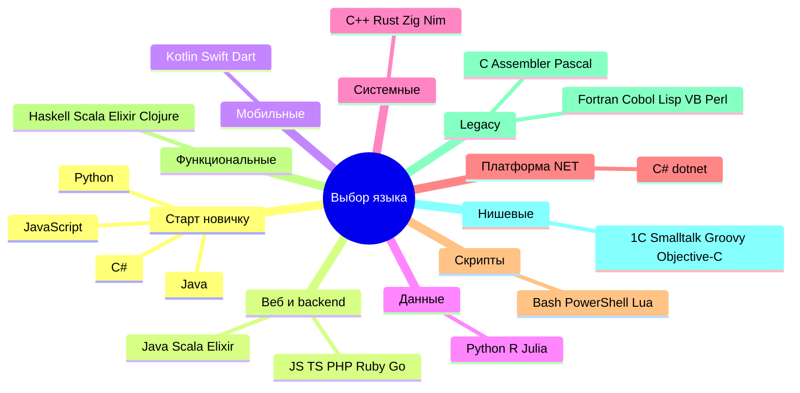

## Деревья решений по направлениям

Ниже — пошаговые схемы для каждого популярного направления. Начните с блока, близкого к вашей цели, и дойдите до конкретного языка и статьи в энциклопедии.

---

### Веб — frontend

**Frontend** — часть сайта, которая работает в браузере: разметка, стили, интерактив. Подробнее — [Фронтенд и бэкенд](/encyclopedia/1-basics/1-23-frontend-i-bekend/intro), [HTML](/encyclopedia/3-data-markup/3-09-html/intro), [CSS](/encyclopedia/3-data-markup/3-10-css/intro).

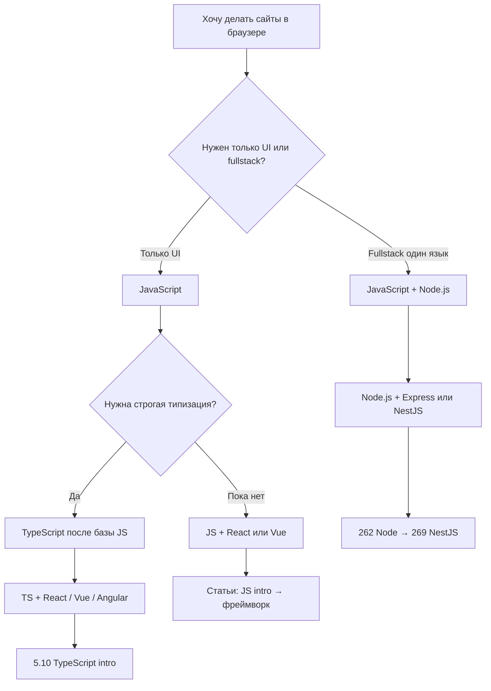

| Роль | Основные языки | Типичный стек | Рынок и экосистема |
|------|----------------|---------------|-------------------|
| **Frontend** | JavaScript, TypeScript | React, Vue, Svelte, Angular | Максимальный спрос на UI; TypeScript — стандарт в крупных командах |
| **Fullstack JS** | JavaScript/TS | Next.js, Nuxt, Remix + API | Стартапы и продуктовые команды; один язык на клиенте и сервере |
| **Legacy enterprise UI** | JavaScript, TypeScript | Angular, Ext JS | Крупные корпоративные SPA |

**Маршрут в энциклопедии для frontend:**

- [5.01 JavaScript — intro](/encyclopedia/5-languages/5-01-javascript/intro)
- [Экосистема JS](/encyclopedia/5-languages/5-01-javascript/3-ecosystem/intro)
- [React](/encyclopedia/5-languages/5-01-javascript/3-ecosystem/2-frontend-frameworks/1-react/intro), [Vue](/encyclopedia/5-languages/5-01-javascript/3-ecosystem/2-frontend-frameworks/2-vue/intro), [Angular](/encyclopedia/5-languages/5-01-javascript/3-ecosystem/2-frontend-frameworks/3-angular/intro)
- После базы — [5.10 TypeScript](/encyclopedia/5-languages/5-10-typescript/intro)

  
Frontend без JavaScript невозможен

  

  HTML и CSS задают структуру и вид, но интерактив (клики, формы, SPA) — на JavaScript. Даже если backend на Python или Java, frontend почти всегда включает JS или TS. Исключения — серверный рендер без клиентской логики (HTMX, классические формы).

---

### Веб — backend

**Backend** — серверная логика, API, база данных, авторизация. Язык backend выбирают по экосистеме фреймворков, найму и совместимости с инфраструктурой.

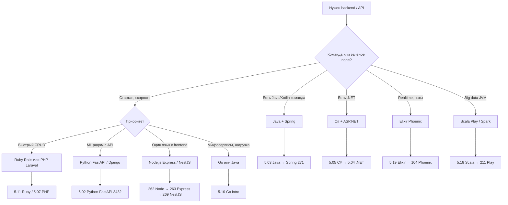

| Язык | Фреймворк | Сильные стороны | Контекст рынка |
|------|-----------|-----------------|----------------|
| **Python** | Django, FastAPI | ML-интеграция, прототипы, admin из коробки | Стартапы, data-команды, внутренние сервисы |
| **Java** | Spring Boot | Enterprise, банки, стабильность JVM | Крупный бизнес, долгоживущие системы |
| **JavaScript/TS** | Express, NestJS, Fastify | Fullstack, JSON API, WebSocket | Продуктовые команды, SaaS |
| **Go** | Gin, Echo, std net/http | Микросервисы, один бинарник, простота деплоя | DevOps-ориентированные компании, cloud-native |
| **PHP** | Laravel, Symfony | CMS, shared-хостинг, быстрый веб | Фриланс, WordPress-экосистема, SMB |
| **Ruby** | Rails | CRUD, convention over configuration | Продуктовые стартапы (исторически сильны) |
| **C#** | ASP.NET Core | Windows + Azure, Blazor | Enterprise .NET, игры + backend в одной экосystem |
| **Elixir** | Phoenix | Realtime, отказоустойчивость BEAM | Чаты, live-обновления, телеком |
| **Scala** | Play, Akka | JVM + FP, Spark | Big data, финтех с высокой нагрузкой |

Ссылки на первые программы фреймворков:

- [Django](/encyclopedia/5-languages/5-02-python/3011)
- [FastAPI](/encyclopedia/5-languages/5-02-python/3432)
- [Spring Framework](/encyclopedia/5-languages/5-03-java/271)
- [Laravel](/encyclopedia/5-languages/5-07-php/1431)
- [Ruby on Rails](/encyclopedia/5-languages/5-11-ruby/21)
- [Node.js](/encyclopedia/5-languages/5-01-javascript/3-ecosystem/1-runtime-node/262)
- [Express](/encyclopedia/5-languages/5-01-javascript/3-ecosystem/1-runtime-node/263)
- [NestJS](/encyclopedia/5-languages/5-01-javascript/3-ecosystem/1-runtime-node/269)
- [Phoenix](/encyclopedia/5-languages/5-19-elixir/104)
- [Play Framework](/encyclopedia/5-languages/5-18-scala/211)

---

### Мобильная разработка

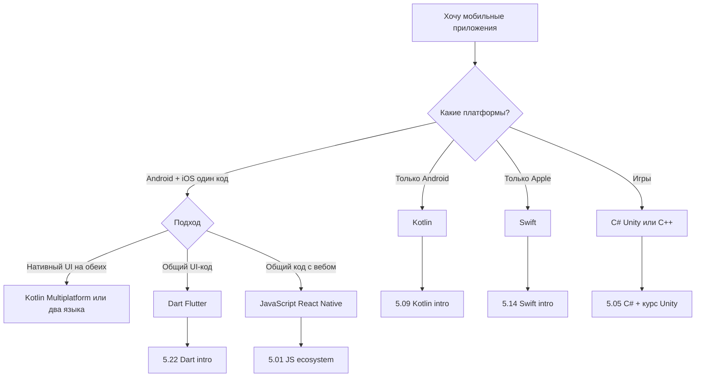

| Язык | Стек | Раздел | Рынок |
|------|------|--------|-------|
| **Kotlin** | Android (официально), KMP | [5.09 Kotlin](/encyclopedia/5-languages/5-09-kotlin/intro) | Стандарт новых Android-проектов |
| **Swift** | iOS, iPadOS, macOS, watchOS | [5.14 Swift](/encyclopedia/5-languages/5-14-swift/intro) | Обязателен для нативного Apple-стека |
| **Dart** | Flutter (Android + iOS + web + desktop) | [5.22 Dart](/encyclopedia/5-languages/5-22-dart/intro) | Кроссплатформа UI, один код базы |
| **Java** | Legacy Android | [5.03 Java](/encyclopedia/5-languages/5-03-java/intro) | Сопровождение старых кодовых баз |
| **Objective-C** | Legacy iOS/macOS | [5.30 Objective-C](/encyclopedia/5-languages/5-30-objective-c/intro) | Поддержка старых Apple-проектов |
| **C#** | Unity, .NET MAUI | [5.05 C#](/encyclopedia/5-languages/5-05-csharp/intro) | Игры и кроссплатформа .NET |
| **JavaScript/TS** | React Native, Expo | [5.01 JS](/encyclopedia/5-languages/5-01-javascript/intro) | Команды с сильным web-бекграундом |

  
Flutter или нативный стек

  

  <strong>Flutter (Dart)</strong> ускоряет выход на две платформы с одной кодовой базой UI. <strong>Kotlin + Swift</strong> дают максимальную интеграцию с платформенными API и дизайн-гайдами. Для первого приложения Flutter часто проще; для карьеры в крупной mobile-команде нативные языки остаются базой.

---

### Данные, аналитика и ML

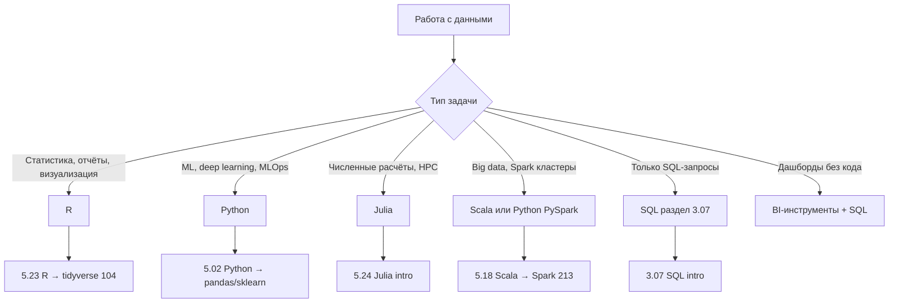

| Язык | Сильные стороны | Связь с энциклопедией | Экосистема |
|------|-----------------|----------------------|------------|
| **Python** | pandas, scikit-learn, PyTorch, Jupyter | [анализ данных](/encyclopedia/3-data-markup/3-11-analiz-dannyh/intro), [5.02 Python](/encyclopedia/5-languages/5-02-python/intro) | Де-факто стандарт ML и data engineering |
| **R** | статистика, tidyverse, ggplot2 | [5.23 R](/encyclopedia/5-languages/5-23-r/intro), [tidyverse](/encyclopedia/5-languages/5-23-r/104) | Академия, биостата, финансовая аналитика |
| **Julia** | численные методы, скорость | [5.24 Julia](/encyclopedia/5-languages/5-24-julia/intro), [Pkg и Plots](/encyclopedia/5-languages/5-24-julia/104) | Научные расчёты, когда Python медленен |
| **Scala** | Apache Spark, big data | [Spark на Scala](/encyclopedia/5-languages/5-18-scala/213) | Кластерная обработка petabyte-масштаба |
| **SQL** | запросы к БД | [раздел SQL](/encyclopedia/3-data-markup/3-07-sql/intro) | Обязателен вместе с любым языком выше |

Выбор по задаче:

- **чистая статистика и отчёты** — R
- **ML-пайплайны и продакшен моделей** — Python
- **тяжёлые численные расчёты на одной машине** — Julia
- **распределённая обработка данных** — Scala + Spark или Python PySpark

---

### Системное программирование и производительность

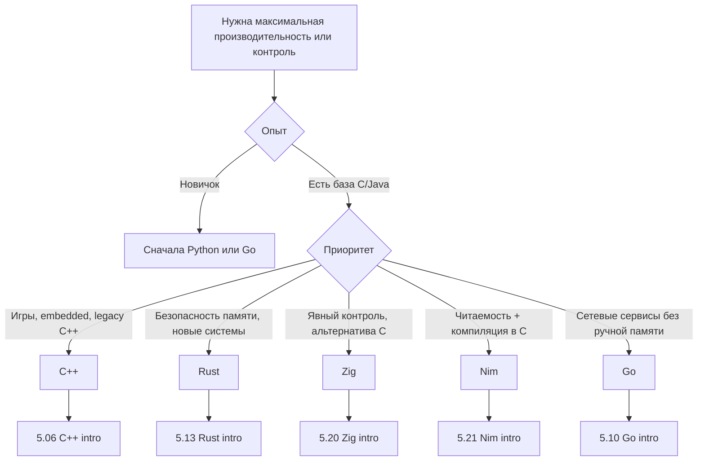

| Язык | Уровень | Комментарий | Типичный найм |
|------|---------|-------------|---------------|
| **C** | Низкий | Основа ОС и runtime; [legacy-раздел](/encyclopedia/5-languages/5-16-starye-yazyki/c-language/intro) | Embedded, драйверы, POSIX |
| **C++** | Низкий + абстракции | Игры, HFT, embedded — [5.06 C++](/encyclopedia/5-languages/5-06-cpp/intro) | Gamedev, finance, automotive |
| **Rust** | Безопасность памяти | Системы, WASM, инфраструктура — [5.13 Rust](/encyclopedia/5-languages/5-13-rust/intro) | Cloud infra, security, WebAssembly |
| **Zig** | Явный контроль | Альтернатива C — [5.20 Zig](/encyclopedia/5-languages/5-20-zig/intro) | Системный софт, энтузиасты |
| **Nim** | Компиляция в C | Баланс читаемости и скорости — [5.21 Nim](/encyclopedia/5-languages/5-21-nim/intro) | Нишевые high-perf утилиты |
| **Go** | GC, goroutines | Сетевые сервисы без ручной памяти — [5.10 Go](/encyclopedia/5-languages/5-10-go/intro) | DevOps, cloud, микросервисы |
| **Assembler** | Железо | Драйверы, RE — [раздел](/encyclopedia/5-languages/5-16-starye-yazyki/assembler/intro) | Очень узкая специализация |

---

### Enterprise и корпоративные системы

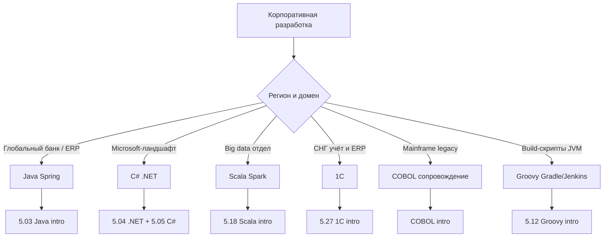

| Язык | Типичный контекст | Экосистема | Карьера |
|------|-------------------|------------|---------|
| **Java** | Банки, ERP, Spring | Spring Boot, Maven/Gradle, JVM | Стабильный спрос, долгие проекты |
| **C# / .NET** | Windows, Azure, корпоративные приложения | ASP.NET, Entity Framework, MAUI | Enterprise Microsoft-стек |
| **Scala** | Big data, высоконагруженные JVM-сервисы | Play, Akka, Spark | Финтех, data platform teams |
| **COBOL** | Legacy mainframe | Сопровождение — [COBOL](/encyclopedia/5-languages/5-16-starye-yazyki/Cobol/intro) | Нишевый, но критичный для банков |
| **1C** | Учёт и ERP в СНГ | Платформа 1С — [5.27 1С](/encyclopedia/5-languages/5-27-1s/intro) | Региональный рынок РФ/СНГ |
| **Groovy** | Jenkins, Gradle, скрипты JVM | [5.12 Groovy](/encyclopedia/5-languages/5-12-groovy/intro) | DevOps в Java-организациях |

---

### Игры и интерактив

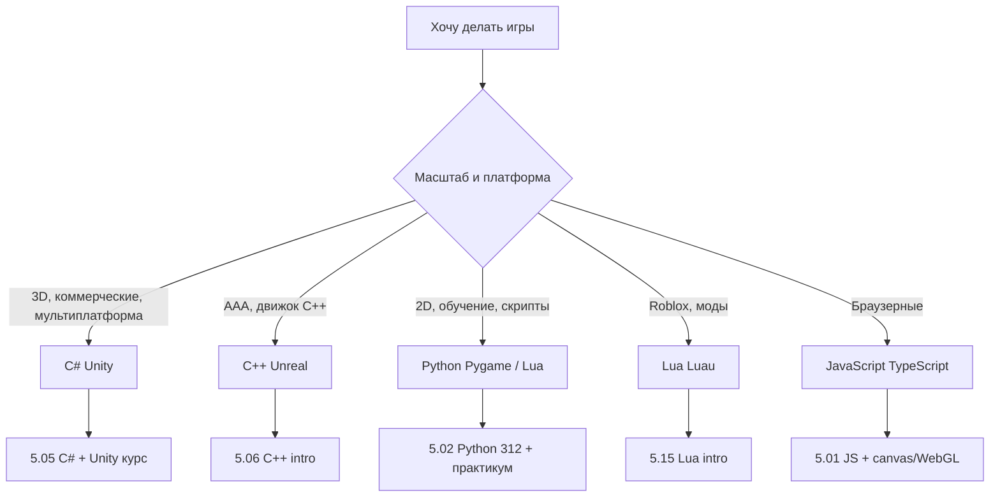

| Язык | Стек | Раздел | Примечание |
|------|------|--------|------------|
| **C#** | Unity | [5.05 C#](/encyclopedia/5-languages/5-05-csharp/intro), [Unity курс](/encyclopedia/9-spinoff/9-04-razrabotka-igr/3) | Самый доступный вход в коммерческий gamedev |
| **C++** | Unreal Engine | [5.06 C++](/encyclopedia/5-languages/5-06-cpp/intro) | Высокий порог, AAA-студии |
| **Python** | Pygame, учебные проекты | [игры на Python](/encyclopedia/5-languages/5-02-python/312) | Без Unity/Unreal, для обучения алгоритмам |
| **Lua / Luau** | Roblox, встраивание в движки | [5.15 Lua](/encyclopedia/5-languages/5-15-lua-i-luau/intro) | Скриптинг уровней и модов |
| **JavaScript/TS** | Phaser, Three.js, web-игры | [5.01 JS](/encyclopedia/5-languages/5-01-javascript/intro) | Браузер без установки |
| **Rust** | Bevy, движки на Rust | [5.13 Rust](/encyclopedia/5-languages/5-13-rust/intro) | Растущая indie-сцена |

---

### Скрипты и автоматизация

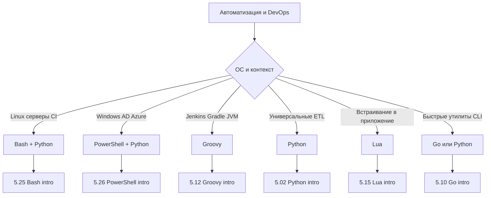

| Язык | Где применяют | Раздел |
|------|---------------|--------|
| **Bash** | Linux/macOS, CI, серверы | [5.25 Bash](/encyclopedia/5-languages/5-25-bash/intro) |
| **PowerShell** | Windows, AD, Azure | [5.26 PowerShell](/encyclopedia/5-languages/5-26-powershell/intro) |
| **Python** | Универсальные скрипты, ETL, Ansible | [5.02 Python](/encyclopedia/5-languages/5-02-python/intro) |
| **Lua / Luau** | Встраивание, игры, Roblox | [5.15 Lua](/encyclopedia/5-languages/5-15-lua-i-luau/intro) |
| **Groovy** | Jenkins, Gradle, скрипты JVM | [5.12 Groovy](/encyclopedia/5-languages/5-12-groovy/intro) |
| **Perl** | Legacy CGI, текстовая обработка | [5.29 Perl](/encyclopedia/5-languages/5-29-perl/intro) |

На Windows для администрирования чаще **PowerShell**; на Linux-серверах — **Bash** плюс Python для сложной логики.

---

### Legacy и исторические языки

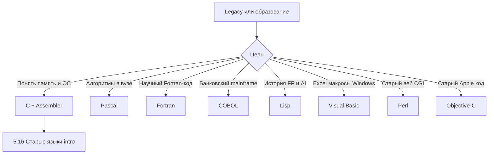

Раздел [5.16 Старые языки](/encyclopedia/5-languages/5-16-starye-yazyki/intro):

| Язык | Практическая ценность сегодня | Раздел |
|------|-------------------------------|--------|
| **C** | Понимание памяти, POSIX, embedded | [C intro](/encyclopedia/5-languages/5-16-starye-yazyki/c-language/intro) |
| **Assembler** | Архитектура CPU, оптимизация | [Assembler](/encyclopedia/5-languages/5-16-starye-yazyki/assembler/intro) |
| **Pascal** | Алгоритмы, образование | [Pascal](/encyclopedia/5-languages/5-16-starye-yazyki/Pascal/intro) |
| **Fortran** | Научные расчёты legacy | [Fortran](/encyclopedia/5-languages/5-16-starye-yazyki/Fortran/intro) |
| **COBOL** | Сопровождение банковских систем | [COBOL](/encyclopedia/5-languages/5-16-starye-yazyki/Cobol/intro) |
| **Lisp** | Макросы, история AI | [Lisp](/encyclopedia/5-languages/5-16-starye-yazyki/Lisp/intro) |
| **Visual Basic** | Legacy Windows, VBA в Excel | [Visual Basic](/encyclopedia/5-languages/5-16-starye-yazyki/visual-basic/intro) |
| **Perl** | Legacy скрипты, bioinformatics | [5.29 Perl](/encyclopedia/5-languages/5-29-perl/intro) |
| **Objective-C** | Legacy iOS/macOS | [5.30 Objective-C](/encyclopedia/5-languages/5-30-objective-c/intro) |

Эти языки ценны для **глубины систем и истории вычислений**; первый язык для новичка обычно выбирают из Python, JavaScript, C# или Java.

## Расширенные таблицы по направлениям

### Desktop и кроссплатформа

| Язык | Платформа | Примечание | Экосистема UI |
|------|-----------|------------|---------------|
| **C# / .NET** | Windows, кроссплатформа | WPF, MAUI, Avalonia — [5.04 .NET](/encyclopedia/5-languages/5-04-platforma-dotnet/intro) | Сильная интеграция с Visual Studio |
| **Java** | JVM | JavaFX, Swing | Кроссплатформенность через JVM |
| **C++** | Нативно | Qt, высокая производительность | [5.06 C++](/encyclopedia/5-languages/5-06-cpp/intro) |
| **Python** | Кроссплатформа | Tkinter, PyQt; прототипы | [5.02 Python](/encyclopedia/5-languages/5-02-python/intro) |
| **Swift** | macOS, iOS | Нативный UI Apple | [5.14 Swift](/encyclopedia/5-languages/5-14-swift/intro) |
| **Dart** | Кроссплатформа | Flutter для UI на всех платформах | [5.22 Dart](/encyclopedia/5-languages/5-22-dart/intro) |
| **JavaScript/TS** | Electron, Tauri | Обёртка web-технологий | VS Code, Slack, Discord |

---

### Функциональные языки

| Язык | Платформа | Когда выбирают | Раздел |
|------|-----------|----------------|--------|
| **Haskell** | GHC, чистый FP | Корректность, компиляторы, финтех | [5.17 Haskell](/encyclopedia/5-languages/5-17-haskell/intro), [монады](/encyclopedia/5-languages/5-17-haskell/8) |
| **Scala** | JVM | FP + ООП, Spark, Play | [5.18 Scala](/encyclopedia/5-languages/5-18-scala/intro) |
| **Elixir** | BEAM | Отказоустойчивость, realtime, Phoenix | [5.19 Elixir](/encyclopedia/5-languages/5-19-elixir/intro) |
| **Clojure** | JVM | Lisp на JVM, immutable data | [5.28 Clojure](/encyclopedia/5-languages/5-28-clojure/intro) |
| **Lisp** | История FP | Образование, энтузиасты | [Lisp](/encyclopedia/5-languages/5-16-starye-yazyki/Lisp/intro) |

---

### Нишевые и специализированные

| Язык | Ниша | Раздел |
|------|------|--------|
| **Smalltalk** | ООП-истоки, live programming | [5.08 Smalltalk](/encyclopedia/5-languages/5-08-smalltalk/intro) |
| **Groovy** | JVM-скрипты, Gradle | [5.12 Groovy](/encyclopedia/5-languages/5-12-groovy/intro) |
| **1C** | Бухгалтерия и учёт в РФ/СНГ | [5.27 1С](/encyclopedia/5-languages/5-27-1s/intro) |
| **Dart** | Flutter UI | [5.22 Dart](/encyclopedia/5-languages/5-22-dart/intro) |
| **Ruby** | Rails, DSL, скрипты | [5.11 Ruby](/encyclopedia/5-languages/5-11-ruby/intro) |
| **PHP** | CMS, веб-хостинг | [5.07 PHP](/encyclopedia/5-languages/5-07-php/intro) |

---

## Маршруты обучения по стартовым языкам

Ниже — ориентиры **неделя 1**, **месяц 1**, **месяц 3** для четырёх рекомендованных точек входа. Темп индивидуален; важнее **запускать код локально**, а не пролистывать теорию.

---

### Python — маршрут новичка

| Период | Цели | Материалы энциклопедии |
|--------|------|------------------------|
| **Неделя 1** | Установка Python, REPL, `print`, переменные, типы, `if`/`for`, первая программа из файла | [5.02 intro](/encyclopedia/5-languages/5-02-python/intro), первая программа в разделе |
| **Месяц 1** | Функции, списки/словари, файлы, venv, pip, один CLI-проект (todo, конвертер) | Основы синтаксиса, [шпаргалка](/encyclopedia/5-languages/5-02-python/38) |
| **Месяц 3** | ООП базово, pytest, один веб или data-мини-проект | [FastAPI 3432](/encyclopedia/5-languages/5-02-python/3432) или pandas; [Django 3011](/encyclopedia/5-languages/5-02-python/3011) |

**Неделя 1 — по дням (пример):**

- День 1–2: установка, `python --version`, REPL, арифметика и строки
- День 3–4: переменные, `if`, циклы `for`/`while`
- День 5–6: функции `def`, списки
- День 7: мини-скрипт (калькулятор BMI, guess the number)

**Месяц 1 — вехи:**

- Неделя 2: словари, множества, работа с файлами `.txt` / `.json`
- Неделя 3: venv, `pip install`, структура папки проекта
- Неделя 4: проект на 200–400 строк с README

**Месяц 3 — вехи:**

- Освоить один инструмент: FastAPI **или** Django **или** pandas
- Написать 3–5 автотестов
- Выложить проект на GitHub (см. [Git intro](/encyclopedia/4-code-dev/4-13-osnovy-raboty-s-git/intro))

  
Python и данные

  

  Если цель — ML или аналитика, после месяца 1 добавьте <strong>Jupyter</strong> и <strong>pandas</strong>, но не пропускайте основы: без понимания функций и структур данных библиотеки превращаются в копипасту. См. <a href="/encyclopedia/3-data-markup/3-11-analiz-dannyh/intro">анализ данных</a>.

---

### JavaScript — маршрут новичка

| Период | Цели | Материалы |
|--------|------|-----------|
| **Неделя 1** | Браузерная консоль, переменные, функции, DOM (кнопка меняет текст) | [5.01 intro](/encyclopedia/5-languages/5-01-javascript/intro) |
| **Месяц 1** | Node.js, npm, модули, async/await, простой HTTP | [Node 262](/encyclopedia/5-languages/5-01-javascript/3-ecosystem/1-runtime-node/262), [npm 265](/encyclopedia/5-languages/5-01-javascript/3-ecosystem/1-runtime-node/265) |
| **Месяц 3** | React или Vue + Express API **или** NestJS | [React intro](/encyclopedia/5-languages/5-01-javascript/3-ecosystem/2-frontend-frameworks/1-react/intro), [Express 263](/encyclopedia/5-languages/5-01-javascript/3-ecosystem/1-runtime-node/263), [NestJS 269](/encyclopedia/5-languages/5-01-javascript/3-ecosystem/1-runtime-node/269) |

**Неделя 1 — по дням:**

- День 1–2: DevTools Console, `let`/`const`, типы, операторы
- День 3–4: функции, стрелочные функции, массивы `map`/`filter`
- День 5–6: DOM — `querySelector`, события `click`
- День 7: страница с интерактивным списком задач (без фреймворка)

**Месяц 1 — вехи:**

- Установить Node.js LTS, `node hello.js`, REPL Node
- `package.json`, `npm run dev`
- Мини API на `http.createServer` или Express

**Месяц 3 — вехи:**

- Один frontend-фреймворк (React рекомендуется по спросу)
- Связка frontend + backend ([fullstack 264](/encyclopedia/5-languages/5-01-javascript/3-ecosystem/1-runtime-node/264))
- Опционально: [TypeScript intro](/encyclopedia/5-languages/5-10-typescript/intro)

---

### C# — маршрут новичка

| Период | Цели | Материалы |
|--------|------|-----------|
| **Неделя 1** | .NET SDK, `dotnet new`, типы, циклы, методы | [5.05 C# intro](/encyclopedia/5-languages/5-05-csharp/intro), [5.04 .NET](/encyclopedia/5-languages/5-04-platforma-dotnet/intro) |
| **Месяц 1** | Классы, LINQ, консольное приложение, отладка в VS / Rider | Основы ООП в разделе C# |
| **Месяц 3** | ASP.NET Web API **или** Unity 2D проект | [Unity курс](/encyclopedia/9-spinoff/9-04-razrabotka-igr/3) |

**Неделя 1 — по дням:**

- День 1–2: установка SDK, `dotnet --version`, Hello World
- День 3–4: `int`, `string`, `bool`, `if`, `for`, `foreach`
- День 5–6: методы, массивы, `List<T>`
- День 7: консольная викторина или калькулятор

**Месяц 1 — вехи:**

- Классы, свойства, конструкторы
- Обработка исключений `try/catch`
- Мини-проект: учёт расходов или телефонная книга

**Месяц 3 — вехи:**

- Ветка **веб**: ASP.NET Core REST + Swagger
- Ветка **игры**: Unity — сцена, физика, один уровень
- Публикация на GitHub

---

### Java — маршрут новичка

| Период | Цели | Материалы |
|--------|------|-----------|
| **Неделя 1** | JDK, `javac`/`java` или IDE, типы, циклы, методы | [5.03 Java intro](/encyclopedia/5-languages/5-03-java/intro) |
| **Месяц 1** | Классы, коллекции, Maven/Gradle, JUnit | Основы Java в разделе |
| **Месяц 3** | Spring Boot REST **или** Android Hello | [Spring 271](/encyclopedia/5-languages/5-03-java/271), [Kotlin 5.09](/encyclopedia/5-languages/5-09-kotlin/intro) для нового Android |

**Неделя 1 — по дням:**

- День 1–2: JDK 17+, первая программа `public class Main`
- День 3–4: примитивы, `String`, условия
- День 5–6: массивы, `ArrayList`, циклы
- День 7: методы, простой класс `Student` или `Product`

**Месяц 1 — вехи:**

- Инкапсуляция, интерфейсы (базово)
- Сборка Maven, структура `src/main/java`
- 3–5 unit-тестов JUnit

**Месяц 3 — вехи:**

- Spring Boot: CRUD API + H2/PostgreSQL
- Или Android: Activity + RecyclerView (Kotlin предпочтительнее для новых проектов)

---

## Если хотите X — начните с Y

Практические сценарии для быстрого выбора. Каждый сценарий предполагает **один язык до первого завершённого проекта**.

| Если хотите… | Начните с… | Затем изучите… | Статья |
|--------------|------------|----------------|--------|
| Сайт с кнопками и формами в браузере | JavaScript | HTML, CSS, React | [5.01 JS](/encyclopedia/5-languages/5-01-javascript/intro) |
| REST API для мобильного приложения | Python (FastAPI) или Node.js | SQL, Docker | [FastAPI](/encyclopedia/5-languages/5-02-python/3432), [Node 262](/encyclopedia/5-languages/5-01-javascript/3-ecosystem/1-runtime-node/262) |
| Работу в банке на JVM | Java | Spring, SQL | [5.03 Java](/encyclopedia/5-languages/5-03-java/intro) |
| Azure и корпоративный .NET | C# | ASP.NET, Entity Framework | [5.05 C#](/encyclopedia/5-languages/5-05-csharp/intro) |
| Telegram-бота | Python | aiogram или python-telegram-bot | [5.02 Python](/encyclopedia/5-languages/5-02-python/intro) |
| Парсинг сайтов и ETL | Python | requests, BeautifulSoup, pandas | [5.02 Python](/encyclopedia/5-languages/5-02-python/intro) |
| Нейросети и ML | Python | PyTorch/scikit-learn, linear algebra | [5.02 Python](/encyclopedia/5-languages/5-02-python/intro) |
| iOS-приложение в App Store | Swift | SwiftUI, Xcode | [5.14 Swift](/encyclopedia/5-languages/5-14-swift/intro) |
| Android-приложение | Kotlin | Jetpack Compose | [5.09 Kotlin](/encyclopedia/5-languages/5-09-kotlin/intro) |
| Одно приложение на Android и iOS | Dart | Flutter | [5.22 Dart](/encyclopedia/5-languages/5-22-dart/intro) |
| 3D-игру без C++ | C# | Unity | [Unity курс](/encyclopedia/9-spinoff/9-04-razrabotka-igr/3) |
| Микросервис с одним бинарником | Go | Docker, gRPC | [5.10 Go](/encyclopedia/5-languages/5-10-go/intro) |
| WordPress или Laravel-сайт | PHP | Laravel, MySQL | [5.07 PHP](/encyclopedia/5-languages/5-07-php/intro) |
| Стартап за выходные (CRUD) | Ruby | Rails | [5.11 Ruby](/encyclopedia/5-languages/5-11-ruby/intro) |
| Чат с тысячами онлайн-пользователей | Elixir | Phoenix Channels | [Phoenix 104](/encyclopedia/5-languages/5-19-elixir/104) |
| Spark и big data | Scala | Spark, Kafka | [5.18 Scala](/encyclopedia/5-languages/5-18-scala/intro) |
| Скрипты на Linux-сервере | Bash | затем Python | [5.25 Bash](/encyclopedia/5-languages/5-25-bash/intro) |
| Администрирование Windows | PowerShell | Azure CLI | [5.26 PowerShell](/encyclopedia/5-languages/5-26-powershell/intro) |
| Моды в Roblox | Luau | Roblox Studio | [5.15 Lua](/encyclopedia/5-languages/5-15-lua-i-luau/intro) |
| 1С-франчайзи в РФ | 1C | платформа 1С:Предприятие | [5.27 1С](/encyclopedia/5-languages/5-27-1s/intro) |
| Системный софт без GC | Rust (после базы) | cargo, ownership | [5.13 Rust](/encyclopedia/5-languages/5-13-rust/intro) |
| Высокопроизводительные игры | C++ (после базы) | Unreal, CMake | [5.06 C++](/encyclopedia/5-languages/5-06-cpp/intro) |
| Статистику и ggplot2 | R | tidyverse | [5.23 R](/encyclopedia/5-languages/5-23-r/intro) |
| Научные расчёты быстрее Python | Julia | Plots.jl | [5.24 Julia](/encyclopedia/5-languages/5-24-julia/intro) |
| Type-safe enterprise API на Node | TypeScript | NestJS | [269 NestJS](/encyclopedia/5-languages/5-01-javascript/3-ecosystem/1-runtime-node/269) |
| Legacy mainframe | COBOL (узкая ниша) | JCL, сопровождение | [COBOL](/encyclopedia/5-languages/5-16-starye-yazyki/Cobol/intro) |
| FP и доказательство корректности | Haskell (после базы) | монады, QuickCheck | [5.17 Haskell](/encyclopedia/5-languages/5-17-haskell/intro) |
| Lisp и макросы на JVM | Clojure | Leiningen/deps | [5.28 Clojure](/encyclopedia/5-languages/5-28-clojure/intro) |

## Контекст команды и компании

Язык в вакансии — следствие **истории продукта**, а не абстрактного "лучшего" выбора. Три типичных контекста:

### Стартап и продуктовая команда

| Характеристика | Типичный стек | Языки |
|----------------|---------------|-------|
| Быстрый MVP | Rails, Laravel, Next.js, Django | Ruby, PHP, JS/TS, Python |
| Мало людей, fullstack | Один язык на клиенте и сервере | JavaScript/TypeScript |
| Mobile + web | Flutter или React Native | Dart, JS/TS |
| Переписывание legacy | Постепенная миграция | Новый сервис на Go/Python, старый на Java |

**Совет новичку:** в стартапе ценят **скорость доставки фич** и широту навыков. JavaScript/Python/Ruby дают быстрый результат. Go подключают, когда упираются в производительность или сложность деплоя.

### Enterprise и крупный бизнес

| Характеристика | Типичный стек | Языки |
|----------------|---------------|-------|
| Банки, страхование | Spring, Oracle/PostgreSQL, Kafka | Java, иногда Scala |
| Microsoft-ландшафт | Azure, Active Directory, SharePoint | C#, PowerShell |
| Долгие контракты | Строгие процессы, code review, QA | Java, C#, иногда COBOL (legacy) |
| Big data platform | Spark, Airflow, data lake | Scala, Python |

**Совет новичку:** Java и C# — предсказуемый путь в корпорацию. Требуют терпения к шаблонному коду, Maven/Gradle, Spring или .NET DI. Зато процессы обучения часто формализованы.

### Исследования, академия, open source

| Характеристика | Типичный стек | Языки |
|----------------|---------------|-------|
| ML research | Jupyter, PyTorch, LaTeX | Python |
| Статистика | RStudio, tidyverse | R |
| Компиляторы, PLT | GHC, papers | Haskell, OCaml-родственные идеи |
| Научные расчёты | HPC кластеры | Fortran (legacy), Julia, Python |
| Системное OSS | kernels, databases | C, Rust, Go |

**Совет новичку:** Python и R закрывают большинство исследовательских задач. Haskell и Julia — когда уже есть математическая база и конкретная мотивация.

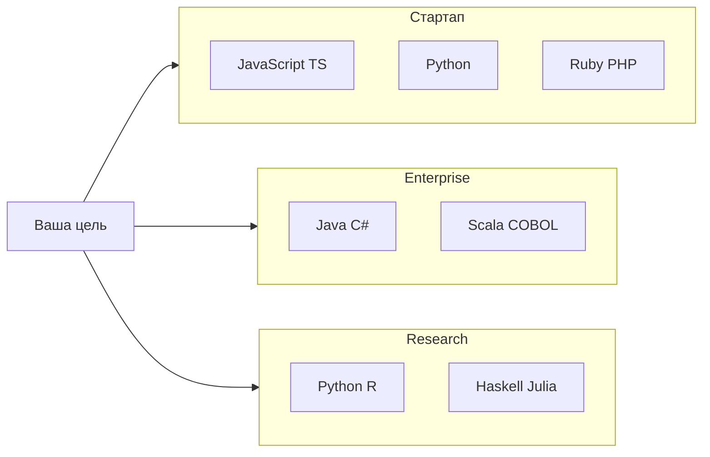

  
Язык команды важнее рейтинга

  

  Если вы уже в проекте на <strong>Elixir</strong>, учить параллельно <strong>Go</strong> "потому что модно" — распыление сил. Сначала продуктивность в стеке команды, второй язык — когда появится новая задача или смена проекта.

---

## Выбор второго языка

Второй язык имеет смысл, когда первый **доведён до рабочего проекта** (intro и синтаксис уже позади). Цель второго — расширить **модель мышления** или **рынок**, продолжая опираться на опыт первого.

### Матрица "первый → второй"

| Первый язык | Логичный второй | Зачем |
|-------------|-----------------|-------|
| Python | JavaScript | Fullstack, веб-UI, Node API |
| Python | Go | Production-сервисы, performance без C++ |
| Python | Rust | Системные расширения, WASM |
| JavaScript | TypeScript | Типы (если ещё не TS) |
| JavaScript | Python | ML, data, scripting |
| Java | Kotlin | Android, лаконичный JVM |
| Java | Scala | FP, Spark |
| Java | Go | Микросервисы рядом с монолитом |
| C# | TypeScript | Fullstack в .NET + SPA |
| C# | C++ | Unity + native plugins |
| Ruby | Elixir | Похожий продуктовый дух, BEAM |
| PHP | JavaScript | Современный frontend к Laravel |
| Go | Rust | Когда Go не хватает контроля |
| Haskell | Scala или OCaml-идеи | Прикладной FP на JVM |

### Признаки, что пора ко второму языку

- Вы пишете первый язык **без постоянного googling синтаксиса** базовых конструкций
- Есть **1–2 завершённых проекта** в портфолио
- Новая задача **явно лучше** решается другим runtime (например, browser UI после Python CLI)
- В вакансиях мечты стабильно фигурирует второй язык

### Признаки, что второй язык **рано**

- Путаете синтаксис `for`, объявление функций, импорт модулей
- Ни одного проекта не довели до "можно показать на собеседовании"
- Учите второй язык, чтобы **отложить** сложность первого (прокрастинация)

---

## Практический алгоритм выбора

### Шаг 1. Определите цель на 6–12 месяцев

| Цель | Первый язык |
|------|-------------|
| Сайты и интерактив в браузере | JavaScript → TypeScript |
| Автоматизация, данные, ML | Python |
| Мобильные приложения Android | Kotlin |
| Мобильные iOS | Swift |
| Кроссплатформа UI | Dart (Flutter) |
| Игры на Unity | C# |
| Корпоративный backend | Java или C# |
| Системы и performance | C++ или Rust (после базы) |
| 1С-разработка в СНГ | 1C |
| DevOps и скрипты | Bash/PowerShell + Python |

### Шаг 2. Проверьте вакансии в вашем регионе

Откройте 10–20 объявлений по выбранному направлению. Обратите внимание на:

- **Язык** (Java, Python, JS)
- **Фреймворк** (Spring, Django, React)
- **Инфраструктура** (AWS, Kubernetes, 1С)
- **Уровень** (junior часто допускает "знание основ + портфолио")

Если 80% требуют **Java + Spring**, а вы учите только **Ruby**, это допустимый выбор — но важно понимать рынок и планировать второй стек при необходимости. Зарплатные диапазоны сильно зависят от региона и уровня; ориентируйтесь на **экосистему и объём вакансий**, а не на один пост в блоге.

### Шаг 3. Пройдите один маршрут до конца

1. [Что такое код](/encyclopedia/4-code-dev/4-02-chto-takoe-kod-i-kak-on-rabotaet/1) — общая база
2. Intro выбранного языка → **первая программа** → основы синтаксиса
3. Один мини-проект (CLI, CRUD, калькулятор)
4. Только потом — фреймворк (Rails, Spring, Phoenix, Play, NestJS, Laravel, Django)

### Шаг 4. Не смешивайте правила разных языков

На одной неделе не сравнивайте **ownership в Rust**, **ленивость в Haskell** и **prototype chain в JavaScript**. Сначала закрепите одну модель выполнения.

### Шаг 5. Зафиксируйте стек письменно

Запишите в README или заметку:

- Язык и версия runtime
- Редактор и расширения
- Менеджер пакетов (npm, pip, cargo)
- Целевой фреймворк и срок (например, "Spring через 8 недель")

---

## Частые ошибки при выборе языка

| Ошибка | Последствие | Что делать |
|--------|-------------|------------|
| Выбор языка "из рейтинга" | Нет мотивации и проекта | Привязать к задаче из таблицы [Если хотите X](#если-хотите-x--начните-с-y) |
| Сразу 3 языка | Путаница в синтаксисе | Один язык до первого проекта |
| Прыжок в C++/Rust без базы | Frustration, бросание | Python/JS/C#/Java сначала |
| Игнор экосистемы | Знание синтаксиса без сборки проекта | npm, pip, cargo, mix, sbt — по разделу языка |
| Вайб-кодинг без запуска | Иллюзия знания | Запускать каждый пример локально |
| Фреймворк до синтаксиса | Непонимание ошибок компилятора | Intro → первая программа → потом Django/Spring |
| Выбор dead stack для цели | Сложный найм | Проверить 20 вакансий в регионе |
| "Выучу всё сразу" fullstack | Поверхностность | Frontend **или** backend глубже, затем второй слой |
| Копирование конфигов без чтения | Чёрный ящик в package.json / pom.xml | Разбирать каждую добавленную зависимость |
| Смена языка каждые 2 недели | Нет портфолио | Минимум 6–8 недель на одном языке |

Про копипасту без понимания — [вайб-кодинг](/encyclopedia/6-ai/6-07-vayb-koding-i-neurokontent/1). ИИ полезен для объяснений, но [генерация кода](/encyclopedia/6-ai/6-04-modeli-i-instrumenty/117) не заменяет запуск и отладку.

### Ошибки по направлениям

**Веб:** учить React до HTML/CSS; игнорировать HTTP и REST; не понимать CORS ([fullstack 264](/encyclopedia/5-languages/5-01-javascript/3-ecosystem/1-runtime-node/264)).

**Data/ML:** прыгать в нейросети без pandas и линейной алгебры; не учить SQL.

**Mobile:** начинать с Flutter, не понимая жизненный цикл Activity/ViewController.

**Enterprise:** учить Spring до Java core; копировать `@Autowired` без понимания DI.

**Games:** покупать ассеты Unity, не написав ни одного скрипта на C#.

**DevOps:** писать 500-строчный Bash вместо Python; хранить секреты в скриптах.

  
Ошибка архитектора и тимлида

  

  Выбирать язык по <strong>личной симпатии</strong>, игнорируя навыки команды и стоимость найма. Новый сервис на Nim в команде из 20 Java-разработчиков — осознанный риск, а не "модный эксперимент" без бюджета на обучение.

---

## Рынок труда и экосистема — общий контекст

Конкретные цифры зарплат быстро устаревают и сильно зависят от города, удалёнки и уровня. Надёжнее смотреть на **объём вакансий**, **стек в описании** и **долговечность экосистемы**.

### Как читать вакансии

| Поле в объявлении | Что извлечь | Действие |
|-------------------|-------------|----------|
| Язык | Java, Python, JS | Основной маршрут обучения |
| Фреймворк | Spring, React, Django | Цель после 1–2 месяцев базы |
| БД | PostgreSQL, MongoDB | Параллельно учить [SQL](/encyclopedia/3-data-markup/3-07-sql/intro) |
| Cloud | AWS, Azure, GCP | Инфраструктура, не язык |
| Domain | fintech, gamedev, 1С | Уточняет нишевые языки |

### Объём экосистем по направлениям (качественно)

| Направление | Высокий спрос | Средний спрос | Нишевый, но стабильный |
|-------------|---------------|---------------|------------------------|
| Web frontend | JavaScript, TypeScript | — | Ext JS (enterprise legacy) |
| Web backend | Java, Python, JS/TS, C# | Go, PHP, Ruby | Elixir, Scala |
| Mobile | Kotlin, Swift | Dart (Flutter) | Objective-C (legacy) |
| Data / ML | Python | R, SQL | Julia |
| DevOps / SRE | Python, Go, Bash | PowerShell | Groovy (CI) |
| Enterprise | Java, C# | Scala | COBOL, 1С |
| Systems | C++, Rust | Go, Zig | Nim, Assembler |
| Games | C# (Unity), C++ | Lua | Rust (indie) |

### Попарное сравнение для выбора

**Python и JavaScript**

| Критерий | Python | JavaScript |
|----------|--------|------------|
| Первая программа | REPL, CLI | Браузер + Node |
| Типизация | Динамическая (optional mypy) | Динамическая (+ TS) |
| Домены | Data, ML, scripts, API | Web UI, fullstack, mobile RN |
| Менеджер пакетов | pip, uv | npm, pnpm |
| Типичный фреймворк | Django, FastAPI | React, Express, NestJS |

**Java и C#**

| Критерий | Java | C# |
|----------|------|-----|
| Runtime | JVM | .NET CLR |
| Enterprise | Spring everywhere | ASP.NET, Azure |
| Mobile | Android legacy | MAUI, Unity |
| IDE | IntelliJ IDEA | Visual Studio, Rider |
| Open source | Полностью | Core open, экосистема mixed |

**Go и Rust**

| Критерий | Go | Rust |
|----------|-----|------|
| Порог входа | Средний | Высокий |
| Память | GC | Ownership, borrow checker |
| Сборка | Быстрая | Дольше, cargo |
| Типичная роль | Microservices, CLI, DevOps | Systems, WASM, infra tools |
| Фреймворк web | Gin, Echo, std | Axum, Actix |

**Kotlin и Swift**

| Критерий | Kotlin | Swift |
|----------|--------|-------|
| Платформа | Android, KMP | Apple ecosystem |
| Interop | Java 100% | Objective-C legacy |
| UI toolkit | Compose | SwiftUI |
| Альтернатива | Flutter (Dart) | Flutter (Dart) |

**Ruby и PHP**

| Критерий | Ruby | PHP |
|----------|------|-----|
| Флагман | Rails | Laravel |
| Hosting | PaaS (Heroku-style) | Shared hosting, WordPress |
| Скорость MVP | Очень высокая | Высокая |
| Рынок 2020-х | Уже, продуктовый | Массовый веб, CMS |

**Elixir и Node.js**

| Критерий | Elixir | Node.js |
|----------|--------|---------|
| Runtime model | BEAM actors | Event loop single-thread |
| Сильная сторона | Fault tolerance, realtime | JSON API, npm ecosystem |
| Web framework | Phoenix | Express, NestJS |
| Типичный кейс | Chat, live dashboards | CRUD SaaS, SSR |

---

## Дополнительные маршруты обучения

Помимо четырёх универсальных стартов, иногда первым языком выбирают **Kotlin**, **Go** или **Swift** — когда цель уже узкая.

### Kotlin — если цель только Android

| Период | Цели | Материалы |
|--------|------|-----------|
| **Неделя 1** | Android Studio, первая Activity, layout XML или Compose preview | [5.09 Kotlin intro](/encyclopedia/5-languages/5-09-kotlin/intro) |
| **Месяц 1** | Kotlin syntax, coroutines basics, RecyclerView или LazyColumn | Статьи раздела Kotlin |
| **Месяц 3** | Мини-app в Play Internal Testing, Room DB, ViewModel | Jetpack libraries |

Kotlin interoperates с Java — в enterprise Android-командах полезно **читать** Java-примеры из старых туториалов.

### Go — если цель DevOps или microservices

| Период | Цели | Материалы |
|--------|------|-----------|
| **Неделя 1** | `go mod init`, structs, interfaces, `go run` | [5.10 Go intro](/encyclopedia/5-languages/5-10-go/intro) |
| **Месяц 1** | HTTP server std lib, goroutines, channels basics | Статьи Go раздела |
| **Месяц 3** | REST API + Docker, один CLI tool с cobra | [Go intro](/encyclopedia/5-languages/5-10-go/intro) |

Go проще Rust для первого **compiled** языка после Python/JavaScript.

### Swift — если цель только Apple

| Период | Цели | Материалы |
|--------|------|-----------|
| **Неделя 1** | Xcode, Swift Playgrounds, variables, optionals | [5.14 Swift intro](/encyclopedia/5-languages/5-14-swift/intro) |
| **Месяц 1** | SwiftUI List, NavigationStack, `@State` | Swift раздел |
| **Месяц 3** | App Store Connect test build, Core Data or SwiftData basics | Apple HIG |

Нужен Mac для полноценной разработки под iOS — учитывайте железо до старта.

---

## Словарь терминов для новичка

| Термин | Простое объяснение |
|--------|-------------------|
| **Runtime** | Программа, которая выполняет ваш код (Node, JVM, Python interpreter) |
| **Компилятор** | Переводит весь код в машинный или байткод до запуска (javac, rustc) |
| **Интерпретатор** | Выполняет код построчно или по блокам (python, node для JS) |
| **JIT** | Just-In-Time — компиляция во время работы (JVM HotSpot, JavaScript V8) |
| **GC** | Garbage Collection — автоматическое освобождение памяти (Java, Go, Python) |
| **Статическая типизация** | Типы проверяются до запуска (Java, Rust, TypeScript) |
| **Динамическая типизация** | Типы определяются при выполнении (Python, JavaScript) |
| **Парадигма** | Стиль программирования: ООП, функциональный, процедурный |
| **Фреймворк** | Каркас приложения с conventions (Rails, Spring, Phoenix) |
| **Библиотека** | Набор функций, которые вы вызываете (requests, lodash) |
| **Package manager** | Установка зависимостей (npm, pip, cargo, mix) |
| **REPL** | Интерактивная консоль для экспериментов |
| **API** | Интерфейс для общения программ (REST, GraphQL) |
| **ORM** | Объектно-реляционное отображение таблиц БД на классы |
| **Middleware** | Прослойка обработки HTTP-запроса (логирование, auth) |
| **Microservices** | Много маленьких сервисов вместо одного монолита |
| **Monolith** | Одно большое приложение со всей логикой |
| **Legacy** | Старый код, который ещё поддерживают и нельзя быстро переписать |
| **Fullstack** | Frontend + backend одним разработчиком |
| **DevOps** | Автоматизация сборки, деплоя, мониторинга |

Подробнее о типах данных — [данные и информация](/encyclopedia/1-basics/1-09-dannye-i-informatsiya/4). О парадигмах — [классификация языков](/encyclopedia/1-basics/1-24-osnovnye-yazyki/intro).

---

## Сравнение фреймворков backend — когда что учить

| Фреймворк | Язык | Стиль | Лучше для | Статья |
|-----------|------|-------|-----------|--------|
| **Express** | JS | Minimal | Обучение HTTP, маленькие API | [263](/encyclopedia/5-languages/5-01-javascript/3-ecosystem/1-runtime-node/263) |
| **NestJS** | TS | Structured, DI | Enterprise Node, команды из Java | [269](/encyclopedia/5-languages/5-01-javascript/3-ecosystem/1-runtime-node/269) |
| **Fastify** | JS | Fast, schema | High-throughput API | [Node 26](/encyclopedia/5-languages/5-01-javascript/3-ecosystem/1-runtime-node/26) |
| **Django** | Python | Batteries included | Admin, CMS, monolith web | [3011](/encyclopedia/5-languages/5-02-python/3011) |
| **FastAPI** | Python | Async, OpenAPI | ML API, microservices | [3432](/encyclopedia/5-languages/5-02-python/3432) |
| **Flask** | Python | Micro | Прототипы, учебные API | Python раздел |
| **Spring Boot** | Java | Enterprise | Banks, large teams | [271](/encyclopedia/5-languages/5-03-java/271) |
| **ASP.NET Core** | C# | Microsoft stack | Azure, corporate | [5.04 .NET](/encyclopedia/5-languages/5-04-platforma-dotnet/intro) |
| **Laravel** | PHP | MVC, Eloquent | Web agencies, startups | [1431](/encyclopedia/5-languages/5-07-php/1431) |
| **Rails** | Ruby | Convention | Product MVPs | [21](/encyclopedia/5-languages/5-11-ruby/21) |
| **Gin** | Go | Minimal router | Cloud native services | Go раздел |
| **Phoenix** | Elixir | Realtime | LiveView, channels | [104](/encyclopedia/5-languages/5-19-elixir/104) |
| **Play** | Scala | MVC JVM | Web + same lang as Spark | [211](/encyclopedia/5-languages/5-18-scala/211) |

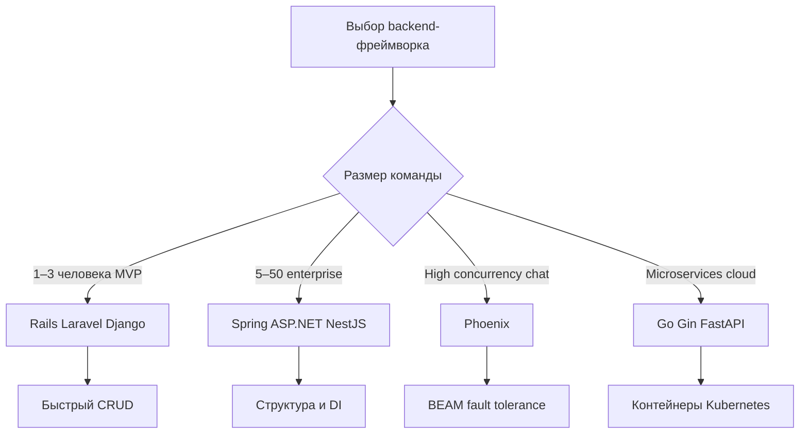

---

## Сравнение frontend-стеков

| Стек | Язык | Когда выбирают | Раздел |
|------|------|----------------|--------|
| **React** | JS/TS | Максимальный рынок, SPA, RN | [React intro](/encyclopedia/5-languages/5-01-javascript/3-ecosystem/2-frontend-frameworks/1-react/intro) |
| **Vue** | JS/TS | Постепенное внедрение, Asia/EU teams | [Vue intro](/encyclopedia/5-languages/5-01-javascript/3-ecosystem/2-frontend-frameworks/2-vue/intro) |
| **Angular** | TS | Enterprise forms, large apps | [Angular intro](/encyclopedia/5-languages/5-01-javascript/3-ecosystem/2-frontend-frameworks/3-angular/intro) |
| **Svelte** | JS | Малый bundle, простота | JS ecosystem |
| **Next.js** | TS | SSR, SEO, fullstack React | [Meta-frameworks](/encyclopedia/5-languages/5-01-javascript/3-ecosystem/3-meta-frameworks/intro) |
| **Blazor** | C# | .NET teams без JS | [5.05 C#](/encyclopedia/5-languages/5-05-csharp/intro) |
| **Flutter Web** | Dart | Общий код с mobile | [5.22 Dart](/encyclopedia/5-languages/5-22-dart/intro) |

**Порядок изучения frontend:**

1. HTML + CSS базово ([3.09](/encyclopedia/3-data-markup/3-09-html/intro), [3.10](/encyclopedia/3-data-markup/3-10-css/intro))
2. JavaScript без фреймворка (DOM, fetch)
3. Один фреймворк (React чаще всего по вакансиям)
4. TypeScript
5. Meta-framework (Next.js) при необходимости SSR

---

## Специальные карьерные треки

### Data Engineer

| Этап | Навык | Язык/инструмент |
|------|-------|-----------------|
| 1 | SQL advanced | SQL |
| 2 | ETL scripts | Python |
| 3 | Spark / Airflow | Python, иногда Scala |
| 4 | Cloud storage | AWS S3, GCS (концепции) |

Старт: [Python](/encyclopedia/5-languages/5-02-python/intro) + [SQL](/encyclopedia/3-data-markup/3-07-sql/intro) + [анализ данных](/encyclopedia/3-data-markup/3-11-analiz-dannyh/intro).

### ML Engineer

| Этап | Навык | Язык/инструмент |
|------|-------|-----------------|
| 1 | Python + numpy/pandas | Python |
| 2 | scikit-learn | Python |
| 3 | PyTorch или TensorFlow | Python |
| 4 | MLOps (Docker, API) | Python FastAPI |

Старт: Python обязателен. R — для статистики, production ML в большинстве компаний строят на Python.

### DevOps / Platform Engineer

| Этап | Навык | Язык/инструмент |
|------|-------|-----------------|
| 1 | Shell automation | Bash или PowerShell |
| 2 | Scripting | Python |
| 3 | Services | Go |
| 4 | IaC | HCL Terraform (не язык раздела 5) |

Старт: [Bash](/encyclopedia/5-languages/5-25-bash/intro) или [PowerShell](/encyclopedia/5-languages/5-26-powershell/intro) + [Python](/encyclopedia/5-languages/5-02-python/intro).

### Security Engineer

| Этап | Навык | Язык/инструмент |
|------|-------|-----------------|
| 1 | Scripting для анализа логов | Python |
| 2 | Understanding memory bugs | C, затем Rust |
| 3 | Web vulns | JavaScript, PHP (reading code) |

Старт: Python, параллельно основы [C](/encyclopedia/5-languages/5-16-starye-yazyki/c-language/intro) для понимания exploits.

### Game Developer (indie)

| Этап | Навык | Язык/инструмент |
|------|-------|-----------------|
| 1 | Unity basics | C# |
| 2 | Game loops, physics | C# |
| 3 | Shaders (optional) | HLSL/ShaderLab |
| 4 | Multiplayer (optional) | C# + networking libs |

Старт: [C#](/encyclopedia/5-languages/5-05-csharp/intro) + [Unity курс](/encyclopedia/9-spinoff/9-04-razrabotka-igr/3). Альтернатива без движка — [Python Pygame](/encyclopedia/5-languages/5-02-python/312).

---

## Мифы о языках — короткая проверка реальностью

| Миф | Реальность |
|-----|------------|
| "Один язык на всю карьеру" | Смена 2–3 языков за карьеру нормальна |
| "Python медленный — значит бесполезен" | Медленнее C++, но быстрее разработки; ML и web на нём в production |
| "JavaScript — игрушка" | Пowers Netflix, LinkedIn frontend, Node backends |
| "Java мёртв" | Доминирует в enterprise и Android legacy |
| "PHP умер" | WordPress + Laravel держат огромный сегмент веба |
| "Нужен только алгоритмический язык из вуза" | Промышленный стек = язык + фреймворк + SQL + Git |
| "Rust заменит всё" | Растёт в infra, mass hiring пока у Java/Go/Python |
| "Low-code заменит программистов" | Ускоряет прототипы; сложная логика остаётся на коде |
| "AI пишет код — язык не важен" | Без понимания runtime AI генерирует хрупкие решения — [вайб-кодинг](/encyclopedia/6-ai/6-07-vayb-koding-i-neurokontent/1) |
| "Выучу 10 языков за год" | Рекрутеры смотрят глубину и проекты |

---

## Чек-лист самопроверки перед сменой языка

Ответьте честно "да" или "нет":

1. Я могу написать функцию с параметрами и циклом без подсказки
2. Я понимаю сообщение об ошибке компилятора или интерпретатора
3. Я пользовался git commit и push хотя бы раз
4. У меня есть проект, который запускается на другом компьютере (README с инструкцией)
5. Я читал чужой код на этом языке и мог его изменить

Если меньше 3 "да" — **рано** менять язык. Углубите текущий.

---

## Историческая перспектива — почему языков так много

Языки появлялись под **конкретные ограничения эпохи**:

| Эпоха | Язык | Задача, которую решали |
|-------|------|------------------------|
| 1950–60s | Fortran, COBOL, Lisp | Научные расчёты, бизнес, AI research |
| 1970s | C, Pascal | Unix, системное программирование, обучение |
| 1980–90s | C++, Java, Perl | OOP, безопасность памяти (GC), web CGI |
| 1995–2000 | JavaScript, PHP, Ruby | Web browser, dynamic pages |
| 2000–10s | C#, Go, Scala | .NET platform, cloud simplicity, JVM FP |
| 2010–20s | Rust, Kotlin, Swift, TypeScript | Memory safety, mobile, Apple, typed JS |
| 2020s | Julia, Zig, Elixir boom | HPC, C alternative, realtime web |

Понимание истории помогает не бояться **legacy**: COBOL в банке — актив с decades of business rules и критичной бизнес-логикой.

Раздел [5.16 Старые языки](/encyclopedia/5-languages/5-16-starye-yazyki/intro) и [Smalltalk](/encyclopedia/5-languages/5-08-smalltalk/intro) показывают, откуда взялись IDE, OOP и live debugging.

---

## Работа с ИИ при выборе и изучении языка

| Допустимо | Опасно |
|-----------|--------|
| Сравнить стеки для вашей задачи | Доверять "лучший язык 2026" без контекста |
| Объяснение ошибки построчно | Копировать 200 строк без запуска |
| Генерация тестовых данных | Commit secrets в репозиторий |
| Перевод документации | Выдавать AI-код за свой на собеседовании |

Рекомендуемые статьи: [генерация кода](/encyclopedia/6-ai/6-04-modeli-i-instrumenty/117), [вайб-кодинг](/encyclopedia/6-ai/6-07-vayb-koding-i-neurokontent/1), [нейрослоп](/encyclopedia/6-ai/6-07-vayb-koding-i-neurokontent/2).

  
Промпт для ИИ при выборе языка

  

  Сформулируйте: "Моя цель — [конкретный продукт], регион — [город/remote], опыт — [ноль/есть Python]. Сравни 2 языка по экосистеме, порогу входа и типичным junior-вакансиям. Без общих фраз." Затем сверьте ответ с деревьями решений в этой статье и реальными вакансиями.

---

## ORM и доступ к данным — что учить рядом с языком

Почти любой backend работает с базой данных. Язык определяет **популярные ORM**, но [SQL](/encyclopedia/3-data-markup/3-07-sql/intro) остаётся общим знаменателем.

| ORM / tool | Язык | Стиль | Статья |
|------------|------|-------|--------|
| **Prisma** | TypeScript | Schema-first, migrations | [2691 Prisma](/encyclopedia/5-languages/5-01-javascript/3-ecosystem/1-runtime-node/2691) |
| **Drizzle** | TypeScript | SQL-like, lightweight | [2692 Drizzle](/encyclopedia/5-languages/5-01-javascript/3-ecosystem/1-runtime-node/2692) |
| **SQLAlchemy** | Python | Mature, flexible | Python раздел |
| **Django ORM** | Python | Integrated with admin | [Django 3011](/encyclopedia/5-languages/5-02-python/3011) |
| **Hibernate / JPA** | Java | Enterprise standard | Java Spring статьи |
| **Entity Framework** | C# | .NET integrated | [5.04 .NET](/encyclopedia/5-languages/5-04-platforma-dotnet/intro) |
| **Eloquent** | PHP | Laravel bundled | [Laravel 1431](/encyclopedia/5-languages/5-07-php/1431) |
| **ActiveRecord** | Ruby | Rails bundled | [Rails 21](/encyclopedia/5-languages/5-11-ruby/21) |
| **Ecto** | Elixir | Functional, changesets | [Phoenix 104](/encyclopedia/5-languages/5-19-elixir/104) |

**Порядок:** SQL SELECT/JOIN → драйвер или ORM в выбранном языке → миграции → индексы и EXPLAIN.

---

## TypeScript — маршрут после JavaScript

TypeScript не заменяет JavaScript — он **расширяет** его типами. Отдельный маршрут для тех, кто прошёл 2–4 недели JS.

| Период | Цели | Материалы |
|--------|------|-----------|
| **Неделя 1** | `tsc`, базовые типы, interfaces, union types | [5.10 TS intro](/encyclopedia/5-languages/5-10-typescript/intro) |
| **Месяц 1** | Generics basics, strict mode, типизация API responses | TS раздел, [декораторы 23](/encyclopedia/5-languages/5-10-typescript/23) |
| **Месяц 3** | NestJS или typed React; eslint + prettier | [269 NestJS](/encyclopedia/5-languages/5-01-javascript/3-ecosystem/1-runtime-node/269) |

**Неделя 1 TS — по дням:**

- День 1–2: установка TypeScript, `tsc`, compile to JS
- День 3–4: `interface`, `type`, optional `?`
- День 5–6: arrays, tuples, function signatures
- День 7: переписать один JS-файл на TS с `strict: true`

---

## Нишевые языки раздела 5 — когда они уместны

### Clojure (5.28)

| Аспект | Детали |
|--------|--------|
| Платформа | JVM, Lisp-синтаксис |
| Сильные стороны | Immutable data, macros, concurrency |
| Когда учить | После Java или другого JVM-языка |
| Рынок | Узкий, data-heavy JVM shops |
| Раздел | [5.28 Clojure intro](/encyclopedia/5-languages/5-28-clojure/intro) |

### Perl (5.29)

| Аспект | Детали |
|--------|--------|
| История | Доминировал в CGI и text processing 1990-х |
| Сегодня | Legacy scripts, bioinformatics, системное администрирование |
| Когда учить | При поддержке существующего Perl-кода |
| Раздел | [5.29 Perl intro](/encyclopedia/5-languages/5-29-perl/intro) |

### Objective-C (5.30)

| Аспект | Детали |
|--------|--------|
| Платформа | Legacy iOS, macOS до Swift |
| Сегодня | Mixed codebases, поддержка старых приложений |
| Когда учить | После Swift, если job требует maintenance |
| Раздел | [5.30 Objective-C intro](/encyclopedia/5-languages/5-30-objective-c/intro) |

### Zig (5.20) и Nim (5.21)

| Язык | Позиционирование | Старт |
|------|------------------|-------|
| **Zig** | Явная альтернатива C, comptime | После C или системного опыта — [5.20](/encyclopedia/5-languages/5-20-zig/intro) |
| **Nim** | Python-like syntax → C performance | После Python, если нужна скорость — [5.21](/encyclopedia/5-languages/5-21-nim/intro) |

---

## Региональный контекст (СНГ и remote)

| Регион / формат | Частые языки | Комментарий |
|-----------------|--------------|-------------|
| Remote global | JS, Python, Java, Go | Стек как в EU/US вакансиях |
| РФ/СНГ enterprise | Java, C#, 1С, Python | 1С — отдельная линия карьеры |
| РФ стартапы | JS/TS, Python, PHP | Laravel и Bitrix-сегмент |
| EU corporate | Java, C#, TS | GDPR-aware backend |
| US West Coast | JS/TS, Python, Go | Product + cloud |
| Freelance global | PHP, JS, Python | WordPress, Laravel, Django |

[1С](/encyclopedia/5-languages/5-27-1s/intro) — это отдельная профессия с сертификацией и франчайзи. Выбирайте этот путь осознанно, если цель связана с бухгалтерией и ERP в регионе.

---

## Примеры портфолио-проектов по языку

Один завершённый проект лучше пяти незаконченных tutorials.

| Язык | Идея проекта | Демонстрирует |
|------|--------------|---------------|
| Python | CLI трекер привычек + SQLite | Файлы, БД, argparse |
| JavaScript | Weather app (open API + DOM) | fetch, async |
| JavaScript/Node | REST API заметок + JWT | Express, auth |
| TypeScript | Todo SPA + typed API client | TS, React |
| Java | Spring Boot library CRUD | JPA, REST |
| C# | Unity 2D platformer | Game loop, physics |
| Kotlin | Android notes app | Room, Compose |
| Swift | iOS counter + UserDefaults | SwiftUI |
| Go | URL shortener + Redis | HTTP, concurrency |
| PHP | Laravel blog | MVC, Eloquent |
| Ruby | Rails bookmark manager | Scaffolding, REST |
| Rust | CLI `grep` clone | Ownership, files |

Каждый проект: README с установкой, скриншот или gif, 3+ commits в Git.

---

## Связь с другими разделами энциклопедии

| Раздел | Зачем при выборе языка |
|--------|------------------------|
| [4. Код и разработка](/encyclopedia/4-code-dev/code-dev) | Git, отладка, тесты — независимо от языка |
| [1.23 Frontend и backend](/encyclopedia/1-basics/1-23-frontend-i-bekend/intro) | Роли в вебе |
| [3.07 SQL](/encyclopedia/3-data-markup/3-07-sql/intro) | Обязательное дополнение |
| [1.26 Карьера в IT](/encyclopedia/1-basics/1-26-karera-v-it-i-mify/intro) | Мифы и ожидания |
| [6. AI](/encyclopedia/6-ai/6-01-vvedenie-v-ii/intro) | ИИ как помощник, не замена базы |
| [9.04 Разработка игр](/encyclopedia/9-spinoff/9-04-razrabotka-igr/intro) | Unity, Pygame, практикумы |

---

## Краткая шпаргалка — выбор за 60 секунд

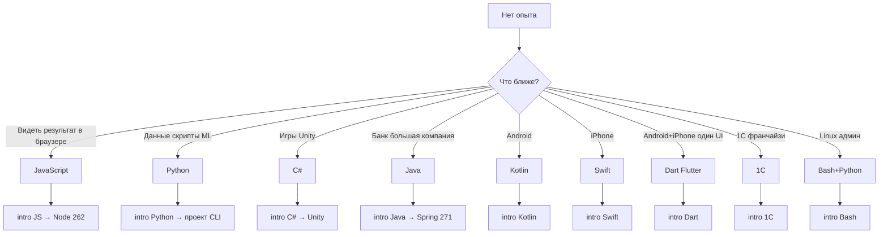

| Вопрос себе | Ответ → язык |
|-------------|--------------|
| Хочу сайт с анимациями | JavaScript |
| Хочу Telegram-бота | Python |
| Хочу работу в банке JVM | Java |
| Хочу Azure корпорацию | C# |
| Хочу indie игру | C# Unity |
| Хочу только скрипты на сервере | Bash + Python |
| Хочу WASM/systems после базы | Rust |
| Хочу статистику в университете | R |

---

## FAQ — часто задаваемые вопросы

  
Вопрос. Какой язык программирования лучше всего для новичка в 2025–2026 году?

  
Ответ. Универсального "лучшего" нет. Для большинства подойдут <strong>Python</strong>, <strong>JavaScript</strong>, <strong>C#</strong> или <strong>Java</strong> — выберите по цели из [таблицы старта](#главное-правило-для-старта) и пройдите один маршрут до проекта.

  
Вопрос. Python или JavaScript — что выбрать первым?

  
Ответ. <strong>JavaScript</strong>, если хотите сайты и мгновенный результат в браузере. <strong>Python</strong>, если интересны данные, ML, скрипты и backend без UI. Оба — отличный первый язык; не учите параллельно.

  
Вопрос. Нужно ли учить TypeScript сразу вместо JavaScript?

  
Ответ. Обычно <strong>сначала JavaScript</strong> (1–4 недели базы), затем [TypeScript intro](/encyclopedia/5-languages/5-10-typescript/intro). TS — надмножество JS; без понимания JS ошибки типов будут непонятны.

  
Вопрос. Java или C# для enterprise-карьеры?

  
Ответ. Зависит от региона и сектора. <strong>Java + Spring</strong> — глобальные банки и JVM-ландшафт. <strong>C# + .NET</strong> — Microsoft/Azure и часть корпораций. Откройте вакансии в вашем городе и сравните количество.

  
Вопрос. Go или Rust для backend?

  
Ответ. <strong>Go</strong> — быстрее вход, GC, микросервисы, DevOps ([5.10 Go](/encyclopedia/5-languages/5-10-go/intro)). <strong>Rust</strong> — контроль памяти и безопасность, дольше учить ([5.13 Rust](/encyclopedia/5-languages/5-13-rust/intro)). Для первого системного языка после Python часто берут Go.

  
Вопрос. Kotlin или Java для Android?

  
Ответ. <strong>Kotlin</strong> — официальный выбор Google для новых проектов ([5.09 Kotlin](/encyclopedia/5-languages/5-09-kotlin/intro)). Java нужен для чтения legacy-кода. Новичку на Android — Kotlin.

  
Вопрос. Flutter (Dart) или нативная разработка?

  
Ответ. <strong>Flutter</strong> — один код UI для Android и iOS ([5.22 Dart](/encyclopedia/5-languages/5-22-dart/intro)). <strong>Kotlin + Swift</strong> — максимальная интеграция с платформой. Flutter быстрее для solo и MVP; крупные mobile-команды часто нативны.

  
Вопрос. PHP ещё актуален?

  
Ответ. Да для <strong>WordPress, Laravel, shared-хостинга</strong> и большого legacy-веба ([5.07 PHP](/encyclopedia/5-languages/5-07-php/intro)). Меньше hype, чем у Node, но стабильный спрос в SMB и фрилансе.

  
Вопрос. Ruby on Rails мёртв?

  
Ответ. Нет, но ниша уже, чем у Python/Node. Rails силён для <strong>продуктовых CRUD и стартапов</strong> ([5.11 Ruby](/encyclopedia/5-languages/5-11-ruby/intro)). Проверьте вакансии в вашем регионе перед выбором.

  
Вопрос. Стоит ли учить C++ первым языком?

  
Ответ. Обычно <strong>нет</strong>. C++ оправдан, если цель — gamedev AAA, embedded или HFT и вы готовы к месяцам основ. Иначе начните с Python/C#/Java, затем [5.06 C++](/encyclopedia/5-languages/5-06-cpp/intro).

  
Вопрос. Haskell как первый язык — хорошая идея?

  
Ответ. Для большинства — <strong>нет</strong>. [Haskell](/encyclopedia/5-languages/5-17-haskell/intro) ценен после базы в любом императивном языке и курса дискретной математики. Исключение — академическая программа, где FP идёт с первого семестра.

  
Вопрос. Сколько языков нужно знать junior-разработчику?

  
Ответ. <strong>Один хорошо</strong> + SQL + базовый Git. "Знаю 5 языков по чуть-чуть" хуже, чем один язык с 2 проектами. Второй язык — после employment или чёткой цели.

  
Вопрос. Обязателен ли SQL отдельно от языка программирования?

  
Ответ. Да. Почти любой backend и аналитика требуют [SQL](/encyclopedia/3-data-markup/3-07-sql/intro). ORM (Hibernate, Prisma) не заменяют понимание запросов.

  
Вопрос. Node.js — это отдельный язык?

  
Ответ. Нет. <strong>Node.js</strong> — runtime для <strong>JavaScript</strong> вне браузера. Язык один — JS (часто TS). См. [Node.js 262](/encyclopedia/5-languages/5-01-javascript/3-ecosystem/1-runtime-node/262).

  
Вопрос. .NET и C# — это одно и то же?

  
Ответ. <strong>C#</strong> — язык. <strong>.NET</strong> — платформа (runtime, BCL, SDK). Пишут на C#, запускают на .NET. См. [5.04 .NET](/encyclopedia/5-languages/5-04-platforma-dotnet/intro) и [5.05 C#](/encyclopedia/5-languages/5-05-csharp/intro).

  
Вопрос. JVM — значит только Java?

  
Ответ. Нет. На JVM работают <strong>Kotlin, Scala, Groovy, Clojure</strong>. Java — самый массовый, но экосистема общая (Maven, часть библиотек).

  
Вопрос. Elixir и Erlang — нужен ли Erlang отдельно?

  
Ответ. Для прикладной разработки достаточно <strong>Elixir</strong> и [Phoenix](/encyclopedia/5-languages/5-19-elixir/104). Erlang — underlying BEAM; Elixir компилируется туда. [5.19 Elixir intro](/encyclopedia/5-languages/5-19-elixir/intro).

  
Вопрос. R или Python для аналитики?

  
Ответ. <strong>R</strong> — статистика, ggplot2, academia ([5.23 R](/encyclopedia/5-languages/5-23-r/intro)). <strong>Python</strong> — универсальнее (ETL + ML + веб). В industry чаще Python; в биостате — R.

  
Вопрос. Julia заменит Python в data science?

  
Ответ. В массовом найме — нет. [Julia](/encyclopedia/5-languages/5-24-julia/intro) нишево силён в численных расчётах. Python остаётся default для ML и pipelines.

  
Вопрос. 1С — это программирование или конфигурация?

  
Ответ. И то, и другое. Платформа 1С:Предприятие с собственным языком и IDE. Сильный <strong>региональный рынок</strong> в СНГ ([5.27 1С](/encyclopedia/5-languages/5-27-1s/intro)).

  
Вопрос. Bash или PowerShell на Windows?

  
Ответ. На Windows для админки — <strong>PowerShell</strong> ([5.26](/encyclopedia/5-languages/5-26-powershell/intro)). Bash через WSL/Git Bash — для Linux-паритета и CI. Оба полезны DevOps-инженеру.

  
Вопрос. Можно ли с ChatGPT выбрать язык за меня?

  
Ответ. ИИ поможет сравнить стеки, но не знает ваш регион, команду и мотивацию. Используйте деревья решений здесь + 10 локальных вакансий. Не копируйте сгенерированный код без запуска — [вайб-кодинг](/encyclopedia/6-ai/6-07-vayb-koding-i-neurokontent/1).

  
Вопрос. Objective-C ещё нужен?

  
Ответ. Для <strong>новых</strong> Apple-проектов — Swift. [Objective-C](/encyclopedia/5-languages/5-30-objective-c/intro) — сопровождение legacy и mixed codebases.

  
Вопрос. Perl, COBOL, Fortran — есть ли смысл учить?

  
Ответ. Только при <strong>конкретной работе</strong> или академическом интересе. [5.16 Legacy](/encyclopedia/5-languages/5-16-starye-yazyki/intro), [Perl](/encyclopedia/5-languages/5-29-perl/intro), [COBOL](/encyclopedia/5-languages/5-16-starye-yazyki/Cobol/intro).

  
Вопрос. NestJS или Express для Node backend?

  
Ответ. <strong>Express</strong> — минимализм, быстрый старт ([263](/encyclopedia/5-languages/5-01-javascript/3-ecosystem/1-runtime-node/263)). <strong>NestJS</strong> — структура, DI, TypeScript, enterprise-стиль ([269](/encyclopedia/5-languages/5-01-javascript/3-ecosystem/1-runtime-node/269)). После [Node 262](/encyclopedia/5-languages/5-01-javascript/3-ecosystem/1-runtime-node/262).

  
Вопрос. Django или FastAPI на Python?

  
Ответ. <strong>Django</strong> — full admin, ORM, batteries included ([3011](/encyclopedia/5-languages/5-02-python/3011)). <strong>FastAPI</strong> — async API, OpenAPI, микросервисы ([3432](/encyclopedia/5-languages/5-02-python/3432)). Для первого веб-проекта Django часто проще; для чистого API — FastAPI.

  
Вопрос. Spring Boot без Java core — можно?

  
Ответ. Технически можно скопировать tutorial, но на собеседовании и в отладке не хватит основ OOP, коллекций и исключений. Сначала [Java intro](/encyclopedia/5-languages/5-03-java/intro), затем [Spring 271](/encyclopedia/5-languages/5-03-java/271).

  
Вопрос. Smalltalk и Clojure — зачем они в энциклопедии?

  
Ответ. <strong>Smalltalk</strong> — история ООП и live programming ([5.08](/encyclopedia/5-languages/5-08-smalltalk/intro)). <strong>Clojure</strong> — практичный Lisp на JVM ([5.28](/encyclopedia/5-languages/5-28-clojure/intro)). Не старт для новичка, но важны для широты кругозора.

  
Вопрос. Когда переходить от языка к фреймворку?

  
Ответ. После <strong>первого самостоятельного проекта</strong> без фреймворка (CLI или простой HTTP). Ориентир — 4–8 недель базы. См. [шаг 3 алгоритма](#шаг-3-пройдите-один-маршрут-до-конца).

  
Вопрос. Язык из универа (Pascal) — выбросить и учить Python?

  
Ответ. Алгоритмическое мышление из Pascal переносится. Для карьеры добавьте <strong>прикладной</strong> язык из таблицы старта. Pascal полезен для понимания структур ([Pascal intro](/encyclopedia/5-languages/5-16-starye-yazyki/Pascal/intro)).

## Кейсы выбора языка — реальные сценарии

Ниже — восемь типичных ситуаций. Для каждой указаны контекст, выбранный язык, альтернативы и ссылка на маршрут в энциклопедии. Используйте кейсы как шаблон: сопоставьте свой возраст опыта, регион и цель с ближайшим сценарием.

### Кейс 1 — студент без опыта, хочет в веб

**Контекст.** Второй курс, цель — стажировка frontend через 8–10 месяцев. Есть базовый HTML из курса вуза.

**Выбор.** JavaScript → TypeScript → React.

**Почему не Python.** Python силён в data, но для UI в браузере всё равно понадобится JavaScript. Параллельное обучение двух языков на старте замедлит прогресс.

**Альтернативы.** PHP + Laravel — если цель только backend CMS и регион с WordPress-хостингом.

**Маршрут.**

1. [5.01 JavaScript intro](/encyclopedia/5-languages/5-01-javascript/intro)
2. [HTML](/encyclopedia/3-data-markup/3-09-html/intro), [CSS](/encyclopedia/3-data-markup/3-10-css/intro)
3. [Node 262](/encyclopedia/5-languages/5-01-javascript/3-ecosystem/1-runtime-node/262)
4. [React intro](/encyclopedia/5-languages/5-01-javascript/3-ecosystem/2-frontend-frameworks/1-react/intro)
5. Портфолио: todo-app, weather-app, pet-project с API

**Ошибки в этом кейсе.** Прыжок в React до понимания DOM; игнор Git; копирование компонентов без запуска локально.

---

### Кейс 2 — аналитик Excel, переход в data

**Контекст.** 3 года в финансах, макросы VBA, цель — junior data analyst.

**Выбор.** Python + SQL.

**Почему.** pandas, Jupyter, интеграция с BI; SQL обязателен для любого backend данных.

**Альтернативы.** R — если команда уже на tidyverse и academia-статистика ([5.23 R](/encyclopedia/5-languages/5-23-r/intro)).

**Маршрут.**

1. [5.02 Python intro](/encyclopedia/5-languages/5-02-python/intro)
2. [SQL intro](/encyclopedia/3-data-markup/3-07-sql/intro)
3. pandas, matplotlib; мини-проект ETL из CSV
4. Опционально: [FastAPI](/encyclopedia/5-languages/5-02-python/3432) для простого API

**Ошибки.** Сразу PyTorch без pandas; пренебрежение типами данных и NULL в SQL.

---

### Кейс 3 — системный администратор Windows

**Контекст.** AD, Azure, скрипты для пользователей, цель — DevOps / platform engineer.

**Выбор.** PowerShell + Python + Bash (WSL).

**Почему.** PowerShell — нативная автоматизация Windows ([5.26](/encyclopedia/5-languages/5-26-powershell/intro)); Python — Ansible, boto3, универсальные утилиты; Bash — CI и Linux-серверы.

**Альтернативы.** Только Bash — боль на Windows без WSL; только Go — дольше вход для скриптов.

**Маршрут.**

1. [PowerShell intro](/encyclopedia/5-languages/5-26-powershell/intro)
2. [Python intro](/encyclopedia/5-languages/5-02-python/intro)
3. [Bash intro](/encyclopedia/5-languages/5-25-bash/intro)
4. Docker, Git, один pipeline в GitHub Actions

---

### Кейс 4 — junior Java в аутсорсе

**Контекст.** Первое место работы, стек Spring + PostgreSQL, legacy monolith.

**Выбор.** Углублять Java, параллельно Kotlin для чтения Android-модулей.

**Почему.** Смена на Node "для моды" не ускорит карьеру в текущей команде.

**Маршрут.**

1. [Java intro](/encyclopedia/5-languages/5-03-java/intro)
2. [Spring 271](/encyclopedia/5-languages/5-03-java/271)
3. [SQL](/encyclopedia/3-data-markup/3-07-sql/intro)
4. Через 6–12 месяцев — [Kotlin](/encyclopedia/5-languages/5-09-kotlin/intro) при задаче на Android

---

### Кейс 5 — indie-разработчик игр

**Контекст.** Solo, 2D/3D, нужен быстрый прототип, нет команды C++.

**Выбор.** C# + Unity.

**Почему.** Визуальный редактор, Asset Store, один язык для gameplay ([Unity курс](/encyclopedia/9-spinoff/9-04-razrabotka-igr/3)).

**Альтернативы.** C++ + Unreal — когда есть опыт и цель AAA; [Lua/Luau](/encyclopedia/5-languages/5-15-lua-i-luau/intro) для Roblox.

**Маршрут.**

1. [C# intro](/encyclopedia/5-languages/5-05-csharp/intro)
2. Unity — movement, collision, UI
3. Один законченный уровень в itch.io

---

### Кейс 6 — стартап fullstack solo founder

**Контекст.** MVP SaaS за 3 месяца, один разработчик, нужны web + API + deploy.

**Выбор.** TypeScript + Next.js (или Nuxt) fullstack.

**Почему.** Один язык, богатая экосистема, быстрый CRUD, Vercel/Node hosting.

**Альтернативы.** Ruby on Rails — быстрее CRUD, меньше frontend-контроля; Django — если команда Python.

**Маршрут.**

1. [JavaScript intro](/encyclopedia/5-languages/5-01-javascript/intro)
2. [TypeScript intro](/encyclopedia/5-languages/5-10-typescript/intro)
3. [Node 262](/encyclopedia/5-languages/5-01-javascript/3-ecosystem/1-runtime-node/262)
4. Next.js или [fullstack 264](/encyclopedia/5-languages/5-01-javascript/3-ecosystem/1-runtime-node/264)

---

### Кейс 7 — embedded и IoT после C в вузе

**Контекст.** Знает C, указатели, Makefile; цель — firmware + безопасность.

**Выбор.** C (продолжить) → Rust для новых модулей.

**Почему.** Legacy на C; Rust даёт memory safety без GC ([5.13 Rust](/encyclopedia/5-languages/5-13-rust/intro)).

**Альтернативы.** C++ — если команда уже на STL/Boost; Zig — экспериментальный стек.

**Маршрут.**

1. [C intro](/encyclopedia/5-languages/5-16-starye-yazyki/c-language/intro)
2. [Rust intro](/encyclopedia/5-languages/5-13-rust/intro)
3. [WASM 619](/encyclopedia/4-code-dev/4-02-chto-takoe-kod-i-kak-on-rabotaet/619) для симуляторов в браузере

---

### Кейс 8 — 1С-франчайзи в регионе СНГ

**Контекст.** Бухгалтерия, внедрение ERP, клиенты на 1С:Предприятие.

**Выбор.** Платформа 1С как основной язык ([5.27 1С](/encyclopedia/5-languages/5-27-1s/intro)).

**Почему.** Региональный рынок, сертификация 1С, типовые конфигурации.

**Дополнительно.** SQL, базовый Python для интеграций и ETL.

**Ошибки.** Игнорировать SQL; учить Java "на всякий случай" вместо углубления в 1С.

---

## Подготовка к собеседованию по выбору стека

Собеседование редко спрашивает "какой язык лучше". Чаще проверяют **понимание trade-offs** и **опыт на одном языке**. Ниже — типичные темы и как отвечать, опираясь на материал этой статьи.

### Вопросы про первый язык

| Вопрос интервьюера | Сильный ответ | Слабый ответ |
|--------------------|---------------|--------------|
| Почему вы выбрали Python? | Связал с целью data/ETL, показал проект pandas | "Потому что первый в TIOBE" |
| JavaScript или TypeScript? | JS для основ, TS для масштаба команды и типов | "TS потому что модно" |
| Сколько языков знаете? | Один глубоко + SQL + Git; второй в процессе | Перечисление 7 языков без проектов |

### Вопросы про trade-offs backend

| Тема | Что показать | Материал |
|------|--------------|----------|
| Монолит на Java | Spring, транзакции, найм | [5.03 Java](/encyclopedia/5-languages/5-03-java/intro) |
| Микросервис Go | Один бинарник, goroutines | [5.10 Go](/encyclopedia/5-languages/5-10-go/intro) |
| Realtime Elixir | BEAM, fault tolerance | [5.19 Elixir](/encyclopedia/5-languages/5-19-elixir/intro) |
| CRUD стартап | Rails/Laravel/Django скорость | Соответствующий раздел 5 |

### System design и язык

На system design язык вторичен, но спрашивают:

- **Почему не переписали monolith на Rust?** — стоимость команды, time-to-market, риски.
- **Когда WASM?** — hot path CPU-bound в браузере ([619](/encyclopedia/4-code-dev/4-02-chto-takoe-kod-i-kak-on-rabotaet/619)).
- **Polyglot microservices** — Go для gateway, Python для ML-сервиса — осознанное разделение.

### Портфолио под язык

| Язык | Минимум для junior | Бонус |
|------|-------------------|-------|
| JavaScript/TS | 2 frontend или 1 fullstack | Тесты, CI, README с архитектурой |
| Python | CLI + API или Jupyter EDA | Docker, pytest coverage |
| Java | Spring CRUD + SQL | OpenAPI, integration tests |
| C# | ASP.NET API или Unity demo | Swagger, unit tests |
| Go | REST + Docker | grpc, benchmarks |
| Kotlin | Android app 3 экрана | Jetpack Compose, MVVM |

### Красные флаги на собеседовании

- Не можете объяснить, **почему** выбрали язык проекта в резюме.
- Путаете runtime и язык, например Node.js и JavaScript.
- Нет ни одного **запущенного** репозитория.
- Утверждаете, что "PHP мёртв" или "JavaScript заменит backend" без контекста задачи.

---

## Матрицы сравнения языков

### Кривая обучения (субъективно, 1 — легко, 5 — сложно)

| Язык | Синтаксис | Экосистема | Tooling | Отладка | Итого |
|------|-----------|------------|---------|---------|-------|
| Python | 1 | 2 | 2 | 2 | Низкий порог |
| JavaScript | 2 | 3 | 2 | 3 | Средний (async) |
| C# | 2 | 3 | 1 | 2 | Низкий–средний |
| Java | 3 | 3 | 3 | 2 | Средний |
| Go | 2 | 2 | 2 | 2 | Средний |
| Rust | 4 | 3 | 3 | 4 | Высокий |
| C++ | 5 | 4 | 4 | 5 | Очень высокий |
| Haskell | 5 | 4 | 3 | 4 | Очень высокий |
| Elixir | 3 | 3 | 3 | 3 | Средний–высокий |

### Типизация и парадигмы

| Язык | Типизация | Парадигма | GC | Компиляция |
|------|-----------|-----------|-----|------------|
| Python | Динамическая | Мульти | Да | Интерпретатор + байт-код |
| JavaScript | Динамическая | Мульти | Да | JIT в браузере/Node |
| TypeScript | Статическая (structural) | Мульти | Да | Transpile → JS |
| Java | Статическая | ООП + FP libs | Да (JVM) | JVM байт-код |
| C# | Статическая | ООП + FP | Да (.NET) | IL → JIT/AOT |
| Go | Статическая | Императивная | Да | AOT бинарник |
| Rust | Статическая | Императивная + FP | Нет | AOT |
| C++ | Статическая | Мульти | Нет (manual) | AOT |
| Elixir | Динамическая | Функциональная | Да (BEAM) | BEAM байт-код |
| Haskell | Статическая | Чистый FP | Да | GHC native |

### Экосистема и реестры пакетов

| Язык | Менеджер пакетов | Реестр | Lock-файл | Статья |
|------|------------------|--------|-----------|--------|
| JavaScript | npm / pnpm | npmjs.com | package-lock.json | [621](/encyclopedia/4-code-dev/4-02-chto-takoe-kod-i-kak-on-rabotaet/621) |
| Python | pip / uv / poetry | PyPI | uv.lock / poetry.lock | [621](/encyclopedia/4-code-dev/4-02-chto-takoe-kod-i-kak-on-rabotaet/621) |
| Rust | cargo | crates.io | Cargo.lock | [621](/encyclopedia/4-code-dev/4-02-chto-takoe-kod-i-kak-on-rabotaet/621) |
| Go | go mod | proxy.golang.org | go.sum | [621](/encyclopedia/4-code-dev/4-02-chto-takoe-kod-i-kak-on-rabotaet/621) |
| Java | Maven / Gradle | Maven Central | gradle.lockfile | [621](/encyclopedia/4-code-dev/4-02-chto-takoe-kod-i-kak-on-rabotaet/621) |
| C# | NuGet | nuget.org | packages.lock.json | [621](/encyclopedia/4-code-dev/4-02-chto-takoe-kod-i-kak-on-rabotaet/621) |
| PHP | composer | packagist.org | composer.lock | [621](/encyclopedia/4-code-dev/4-02-chto-takoe-kod-i-kak-on-rabotaet/621) |
| Ruby | bundler | rubygems.org | Gemfile.lock | [621](/encyclopedia/4-code-dev/4-02-chto-takoe-kod-i-kak-on-rabotaet/621) |

Менеджеры **версий runtime** (Node, Python) — отдельно: [620](/encyclopedia/4-code-dev/4-02-chto-takoe-kod-i-kak-on-rabotaet/620).

### Backend — сравнение по задачам

| Задача | Python | Node/TS | Java | Go | PHP | Elixir |
|--------|--------|---------|------|-----|-----|--------|
| Быстрый REST MVP | FastAPI ★★★ | Express ★★★ | Spring ★★ | Gin ★★★ | Laravel ★★★ | Phoenix ★★ |
| Enterprise интеграции | ★★ | ★★ | ★★★ | ★★ | ★★ | ★★ |
| CPU-bound на одном сервере | ★ | ★ | ★★ | ★★★ | ★ | ★★ |
| WebSocket / realtime | ★★ | ★★ | ★★ | ★★ | ★★ | ★★★ |
| ML рядом с API | ★★★ | ★★ | ★★ | ★ | ★ | ★ |
| Найм junior (глобально) | ★★★ | ★★★ | ★★★ | ★★ | ★★ | ★ |

Оценки относительные; проверяйте регион через вакансии.

### Mobile — сравнение подходов

| Подход | Язык | Плюсы | Минусы |
|--------|------|-------|--------|
| Native Android | Kotlin | Jetpack, Google support | Только Android |
| Native iOS | Swift | SwiftUI, Apple APIs | Только Apple |
| Cross-platform | Dart/Flutter | Один UI-код | Platform channels |
| Cross-platform | JS/React Native | Web-навыки | Bridge performance |
| Legacy | Java / Obj-C | Старый код | Новые фичи медленнее |

### Data и ML

| Язык | ETL | ML training | Визуализация | Production API |
|------|-----|-------------|--------------|----------------|
| Python | ★★★ | ★★★ | ★★★ | FastAPI ★★★ |
| R | ★★ | ★★ | ★★★ | ★ |
| Julia | ★★ | ★★ | ★★ | ★★ |
| Scala | Spark ★★★ | ★★ | ★ | ★★ |
| SQL | ★★★ | — | ★★ | — |

---

## Ресурсы для обучения по языкам

Официальная документация и курсы — дополнение к [разделу 5](/encyclopedia/5-languages/intro), а не замена. Сначала intro и первая программа в энциклопедии, затем внешние материалы.

### Python

| Ресурс | Тип | Ссылка |
|--------|-----|--------|
| Официальный tutorial | Документация | [docs.python.org/tutorial](https://docs.python.org/3/tutorial/) |
| Real Python | Статьи | [realpython.com](https://realpython.com/) |
| Энциклопедия | База | [5.02 Python intro](/encyclopedia/5-languages/5-02-python/intro) |
| FastAPI docs | Фреймворк | [fastapi.tiangolo.com](https://fastapi.tiangolo.com/) |

### JavaScript и TypeScript

| Ресурс | Тип | Ссылка |
|--------|-----|--------|
| MDN JavaScript | Справочник | [developer.mozilla.org/JavaScript](https://developer.mozilla.org/en-US/docs/Web/JavaScript) |
| Node.js docs | Runtime | [nodejs.org/docs](https://nodejs.org/docs/latest/api/) |
| TypeScript handbook | Язык | [typescriptlang.org/docs](https://www.typescriptlang.org/docs/) |
| React docs | UI | [react.dev](https://react.dev/) |
| Энциклопедия | База | [5.01 JS intro](/encyclopedia/5-languages/5-01-javascript/intro) |

### Java и Kotlin

| Ресурс | Тип | Ссылка |
|--------|-----|--------|
| Oracle Java Tutorials | Язык | [docs.oracle.com/javase/tutorial](https://docs.oracle.com/javase/tutorial/) |
| Spring Guides | Backend | [spring.io/guides](https://spring.io/guides) |
| Kotlin docs | Язык | [kotlinlang.org/docs](https://kotlinlang.org/docs/home.html) |
| Android Developers | Mobile | [developer.android.com](https://developer.android.com/) |
| Энциклопедия | База | [5.03 Java](/encyclopedia/5-languages/5-03-java/intro) |

### C# и .NET

| Ресурс | Тип | Ссылка |
|--------|-----|--------|
| Microsoft Learn C# | Язык | [learn.microsoft.com/dotnet/csharp](https://learn.microsoft.com/en-us/dotnet/csharp/) |
| ASP.NET Core | Web | [learn.microsoft.com/aspnet/core](https://learn.microsoft.com/en-us/aspnet/core/) |
| Unity Learn | Gamedev | [learn.unity.com](https://learn.unity.com/) |
| Энциклопедия | База | [5.05 C#](/encyclopedia/5-languages/5-05-csharp/intro) |

### Go, Rust, системные

| Ресурс | Тип | Ссылка |
|--------|-----|--------|
| Go Tour | Интерактив | [go.dev/tour](https://go.dev/tour/) |
| The Rust Book | Язык | [doc.rust-lang.org/book](https://doc.rust-lang.org/book/) |
| Rust by Example | Примеры | [doc.rust-lang.org/rust-by-example](https://doc.rust-lang.org/rust-by-example/) |
| Энциклопедия Go | База | [5.10 Go intro](/encyclopedia/5-languages/5-10-go/intro) |
| Энциклопедия Rust | База | [5.13 Rust intro](/encyclopedia/5-languages/5-13-rust/intro) |

### Функциональные и нишевые

| Язык | Ресурс | Ссылка |
|------|--------|--------|
| Elixir | Hexdocs Getting Started | [hexdocs.pm/elixir](https://hexdocs.pm/elixir/introduction.html) |
| Haskell | Learn You a Haskell | [learnyouahaskell.com](https://learnyouahaskell.com/) |
| Scala | Scala Docs | [docs.scala-lang.org](https://docs.scala-lang.org/) |
| R | R for Data Science | [r4ds.hadley.nz](https://r4ds.hadley.nz/) |
| PHP | Laravel Docs | [laravel.com/docs](https://laravel.com/docs) |
| Ruby | Rails Guides | [guides.rubyonrails.org](https://guides.rubyonrails.org/) |

### Общие навыки (для любого языка)

| Тема | Материал |
|------|----------|
| Git | [4.13 Git intro](/encyclopedia/4-code-dev/4-13-osnovy-raboty-s-git/intro) |
| SQL | [3.07 SQL intro](/encyclopedia/3-data-markup/3-07-sql/intro) |
| HTTP и сеть | [2.03 Сеть](/encyclopedia/2-system-network/2-03-set-i-internet/intro) |
| Терминал | [2.05 Терминал](/encyclopedia/2-system-network/2-05-terminal/intro) |
| Менеджеры версий | [620](/encyclopedia/4-code-dev/4-02-chto-takoe-kod-i-kak-on-rabotaet/620) |
| Пакетные менеджеры | [621](/encyclopedia/4-code-dev/4-02-chto-takoe-kod-i-kak-on-rabotaet/621) |
| Карьера | [1.26 Карьера в IT](/encyclopedia/1-basics/1-26-karera-v-it-i-mify/intro) |
| Советы новичку | [1.12](/encyclopedia/1-basics/1-12-sovety-dlya-novichka/intro) |

---

## FAQ — расширенный блок (второй проход)

  
Вопрос. Стоит ли учить два языка параллельно на курсах?

  
Ответ. На интенсиве иногда дают JS + SQL — это нормально. Два <strong>полноценных</strong> языка программирования параллельно на первом месяце — нет. SQL и Git не считаются вторым языком.

  
Вопрос. Как язык связан с зарплатой?

  
Ответ. Сильнее влияют <strong>уровень</strong>, регион, домен (финтех, gamedev) и продуктовые навыки. Язык — фильтр вакансий. Смотрите объём вакансий и требования к роли, затем сравнивайте карьерные траектории по грейдам.

  
Вопрос. Low-code заменит программистов?

  
Ответ. Low-code закрывает простые CRUD и прототипы. Сложная логика, интеграции, performance и безопасность остаются за кодом. Выбор языка для карьеры low-code не отменяет.

  
Вопрос. WebAssembly — отдельный язык?

  
Ответ. Нет. WASM — <strong>формат байт-кода</strong>. Пишут на Rust, C++, AssemblyScript и компилируют. См. [619 WASM](/encyclopedia/4-code-dev/4-02-chto-takoe-kod-i-kak-on-rabotaet/619).

  
Вопрос. Как выбрать между Vue и React?

  
Ответ. Оба на JavaScript/TS. <strong>React</strong> — больше вакансий глобально. <strong>Vue</strong> — проще вход, силён в Азии и части EU. Выберите один, не оба на старте. [React](/encyclopedia/5-languages/5-01-javascript/3-ecosystem/2-frontend-frameworks/1-react/intro), [Vue](/encyclopedia/5-languages/5-01-javascript/3-ecosystem/2-frontend-frameworks/2-vue/intro).

  
Вопрос. Нужен ли Assembly для карьеры?

  
Ответ. Для большинства ролей — нет. Полезен для [reverse engineering](/encyclopedia/5-languages/5-16-starye-yazyki/assembler/intro), понимания CPU и оптимизации после C/C++.

  
Вопрос. Zig или Rust для системного кода?

  
Ответ. <strong>Rust</strong> — зрелая экосистема, найм, WASM. <strong>Zig</strong> — альтернатива C, меньше рынок ([5.20 Zig](/encyclopedia/5-languages/5-20-zig/intro)). Для карьеры чаще Rust; Zig — осознанная ниша.

  
Вопрос. Можно ли сменить язык через 2 года карьеры?

  
Ответ. Да. Паттерны, Git, SQL, HTTP переносятся. Планируйте 3–6 месяцев на productivity в новом стеке и pet-project в резюме.

  
Вопрос. Groovy обязателен для DevOps?

  
Ответ. Для Jenkins Pipeline и Gradle — часто достаточно читать и править Groovy ([5.12](/encyclopedia/5-languages/5-12-groovy/intro)). Писать с нуля — реже, чем Python/Bash.

  
Вопрос. Lua только для игр?

  
Ответ. Нет. Redis scripting, nginx, embedded конфиги, Roblox Luau ([5.15](/encyclopedia/5-languages/5-15-lua-i-luau/intro)). Лёгкий язык для встраивания.

  
Вопрос. Как проверить, что язык "мой"?

  
Ответ. Через 4–6 недель: вы довели мини-проект, ошибки компилятора понятны, есть желание добавить фичу — не бросить. Если только frustration — попробуйте другой из таблицы старта, но не третий параллельно.

  
Вопрос. Nim и Crystal — стоит ли смотреть?

  
Ответ. [Nim](/encyclopedia/5-languages/5-21-nim/intro) — compiled utilities, маленький рынок. Crystal — Ruby-like syntax, ниша. Для первого языка — нет.

  
Вопрос. Как язык связан с open source?

  
Ответ. JavaScript, Python, Rust, Go — огромные OSS-экосистемы. Участие в issues/PR ускоряет обучение и резюме. Выберите язык с активным GitHub-сообществом под вашу цель.

  
Вопрос. F# или C# на .NET?

  
Ответ. <strong>C#</strong> — массовый найм и Unity. F# — FP на .NET, ниша. Новичку на .NET — C# ([5.05](/encyclopedia/5-languages/5-05-csharp/intro)).

  
Вопрос. Что учить после SQL?

  
Ответ. ORM вашего стека (SQLAlchemy, Hibernate, Prisma) — но только после ручных JOIN. Затем индексы, транзакции, миграции.

---

## Региональные особенности рынка (ориентиры)

Рынок меняется; всегда проверяйте 15–20 актуальных вакансий. Таблица — типичные паттерны, не закон.

| Регион / контекст | Частые языки | Редкие, но востребованные |
|-------------------|--------------|---------------------------|
| Глобальный remote | JS/TS, Python, Go | Rust, Elixir |
| EU enterprise | Java, C#, Python | Scala, Kotlin |
| US startups | JS/TS, Python, Go | Ruby (ниша) |
| СНГ аутсорс | Java, C#, JS, Python | 1С, PHP |
| СНГ продукт | Python, Go, JS, PHP | — |
| Mobile studios | Kotlin, Swift, Dart | — |
| Gamedev | C#, C++ | Lua, Rust (indie) |
| Data / ML hubs | Python, R, SQL | Julia, Scala |

---

## Чек-лист смены направления (смена языка)

Если через год решили сменить стек (например, PHP → Go):

1. Запишите причину одним предложением (performance, найм, интерес).
2. Оставьте текущий язык на поддержке проектов — не "забывайте" резко.
3. Выделите 5–10 часов в неделю на новый язык **6 месяцев**.
4. Один pet-project на новом стеке в портфолио.
5. Обновите резюме: честно указать уровень (junior в Go при senior PHP — нормально).
6. На собеседовании объясните **transferable skills**: HTTP, SQL, CI, code review.

---

## Словарь для обсуждения стека с командой

| Термин | Как использовать в разговоре |
|--------|------------------------------|
| Runtime | "Наш runtime — Node 22 LTS, не путать с Deno" |
| Framework | "Backend на Spring, не меняем язык — меняем модуль" |
| Polyglot | "Polyglot repo: Python ML + Go API — осознанно" |
| Legacy | "Legacy на PHP 7 — новый сервис на Laravel 11" |
| Greenfield | "Greenfield — можем выбрать Go, если команда готова" |
| LTS | "Берём Node LTS, не latest, для стабильности CI" |
| Lock file | "Коммитим package-lock — без споров в CI" |

---

---

## Сводная таблица всех языков раздела 5

| № | Язык / платформа | Раздел | Уровень входа | Типичная роль |
|---|------------------|--------|---------------|---------------|
| 5.01 | JavaScript | [intro](/encyclopedia/5-languages/5-01-javascript/intro) | Низкий | Frontend, Node backend |
| — | TypeScript | [intro](/encyclopedia/5-languages/5-10-typescript/intro) | После JS | Typed web, NestJS |
| 5.02 | Python | [intro](/encyclopedia/5-languages/5-02-python/intro) | Низкий | Data, ML, scripts, API |
| 5.03 | Java | [intro](/encyclopedia/5-languages/5-03-java/intro) | Средний | Enterprise, Android legacy |
| 5.04 | Платформа .NET | [intro](/encyclopedia/5-languages/5-04-platforma-dotnet/intro) | Средний | Runtime для C#/F# |
| 5.05 | C# | [intro](/encyclopedia/5-languages/5-05-csharp/intro) | Низкий–средний | .NET, Unity |
| 5.06 | C++ | [intro](/encyclopedia/5-languages/5-06-cpp/intro) | Высокий | Games, systems, embedded |
| 5.07 | PHP | [intro](/encyclopedia/5-languages/5-07-php/intro) | Низкий–средний | Web, CMS, Laravel |
| 5.08 | Smalltalk | [intro](/encyclopedia/5-languages/5-08-smalltalk/intro) | Специализированный | Education, history |
| 5.09 | Kotlin | [intro](/encyclopedia/5-languages/5-09-kotlin/intro) | Средний | Android, KMP |
| 5.10 | Go | [intro](/encyclopedia/5-languages/5-10-go/intro) | Средний | Microservices, DevOps |
| 5.11 | Ruby | [intro](/encyclopedia/5-languages/5-11-ruby/intro) | Низкий–средний | Rails, scripting |
| 5.12 | Groovy | [intro](/encyclopedia/5-languages/5-12-groovy/intro) | После Java | Gradle, Jenkins |
| 5.13 | Rust | [intro](/encyclopedia/5-languages/5-13-rust/intro) | Высокий | Systems, WASM |
| 5.14 | Swift | [intro](/encyclopedia/5-languages/5-14-swift/intro) | Средний | Apple platforms |
| 5.15 | Lua / Luau | [intro](/encyclopedia/5-languages/5-15-lua-i-luau/intro) | Низкий | Games, embedding |
| 5.16 | Legacy (C, Asm, …) | [intro](/encyclopedia/5-languages/5-16-starye-yazyki/intro) | Разный | Maintenance, education |
| 5.17 | Haskell | [intro](/encyclopedia/5-languages/5-17-haskell/intro) | Высокий | FP, research |
| 5.18 | Scala | [intro](/encyclopedia/5-languages/5-18-scala/intro) | Высокий | Spark, Play, JVM FP |
| 5.19 | Elixir | [intro](/encyclopedia/5-languages/5-19-elixir/intro) | Средний–высокий | Realtime, Phoenix |
| 5.20 | Zig | [intro](/encyclopedia/5-languages/5-20-zig/intro) | Высокий | Systems, C alternative |
| 5.21 | Nim | [intro](/encyclopedia/5-languages/5-21-nim/intro) | Средний–высокий | Compiled utilities |
| 5.22 | Dart | [intro](/encyclopedia/5-languages/5-22-dart/intro) | Средний | Flutter |
| 5.23 | R | [intro](/encyclopedia/5-languages/5-23-r/intro) | Средний (аналитика) | Statistics |
| 5.24 | Julia | [intro](/encyclopedia/5-languages/5-24-julia/intro) | Средний (численные) | Scientific computing |
| 5.25 | Bash | [intro](/encyclopedia/5-languages/5-25-bash/intro) | Низкий (админы) | Linux shell |
| 5.26 | PowerShell | [intro](/encyclopedia/5-languages/5-26-powershell/intro) | Низкий (Windows) | Windows admin |
| 5.27 | 1С | [intro](/encyclopedia/5-languages/5-27-1s/intro) | Специализированный | ERP СНГ |
| 5.28 | Clojure | [intro](/encyclopedia/5-languages/5-28-clojure/intro) | Высокий | JVM Lisp |
| 5.29 | Perl | [intro](/encyclopedia/5-languages/5-29-perl/intro) | Средний | Legacy scripting |
| 5.30 | Objective-C | [intro](/encyclopedia/5-languages/5-30-objective-c/intro) | Средний | Legacy Apple |

### Подразделы legacy 5.16

| Язык | Раздел |
|------|--------|
| C | [c-language intro](/encyclopedia/5-languages/5-16-starye-yazyki/c-language/intro) |
| Assembler | [assembler intro](/encyclopedia/5-languages/5-16-starye-yazyki/assembler/intro) |
| Pascal | [Pascal intro](/encyclopedia/5-languages/5-16-starye-yazyki/Pascal/intro) |
| Fortran | [Fortran intro](/encyclopedia/5-languages/5-16-starye-yazyki/Fortran/intro) |
| COBOL | [Cobol intro](/encyclopedia/5-languages/5-16-starye-yazyki/Cobol/intro) |
| Lisp | [Lisp intro](/encyclopedia/5-languages/5-16-starye-yazyki/Lisp/intro) |
| Visual Basic | [visual-basic intro](/encyclopedia/5-languages/5-16-starye-yazyki/visual-basic/intro) |

### Ключевые статьи по фреймворкам

| Фреймворк | Язык | Статья |
|-----------|------|--------|
| Node.js | JavaScript | [262](/encyclopedia/5-languages/5-01-javascript/3-ecosystem/1-runtime-node/262) |
| Express | JavaScript | [263](/encyclopedia/5-languages/5-01-javascript/3-ecosystem/1-runtime-node/263) |
| NestJS | TypeScript | [269](/encyclopedia/5-languages/5-01-javascript/3-ecosystem/1-runtime-node/269) |
| React | JavaScript | [React intro](/encyclopedia/5-languages/5-01-javascript/3-ecosystem/2-frontend-frameworks/1-react/intro) |
| Django | Python | [3011](/encyclopedia/5-languages/5-02-python/3011) |
| FastAPI | Python | [3432](/encyclopedia/5-languages/5-02-python/3432) |
| Spring | Java | [271](/encyclopedia/5-languages/5-03-java/271) |
| Laravel | PHP | [1431](/encyclopedia/5-languages/5-07-php/1431) |
| Rails | Ruby | [21](/encyclopedia/5-languages/5-11-ruby/21) |
| Phoenix | Elixir | [104](/encyclopedia/5-languages/5-19-elixir/104) |
| Play | Scala | [211](/encyclopedia/5-languages/5-18-scala/211) |
| Spark | Scala | [213](/encyclopedia/5-languages/5-18-scala/213) |

---

## Навигация по разделу 5

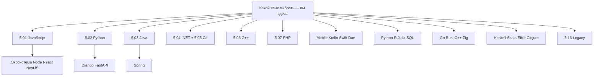

---

## Расширенный FAQ — 30 вопросов новичка

### Выбор первого языка

**Python или JavaScript для абсолютного нуля?**
JavaScript даёт мгновенный результат в браузере без установки (DevTools). Python проще читать и лучше для данных. Оба — отличный старт; выберите по ближайшему проекту.

**C# хорош для первого языка?**
Да, особенно если цель — игры ([Unity](/encyclopedia/9-spinoff/9-04-razrabotka-igr/3)) или Windows/.NET. Строгая типизация дисциплинирует с первого дня.

**Стоит ли начинать с TypeScript?**
После базового JavaScript. Синтаксис TS = JS + типы; без понимания JS замыкания и `async` в TS будут непонятны.

**Java "слишком много boilerplate" — это правда?**
Современный Java (records, var, pattern matching) короче классического enterprise-кода. Для Android и Spring Java по-прежнему стандарт.

**Go как первый язык?**
Возможен, но экосистема веба и учебных материалов для новичков уже, чем у Python/JS. Go логичен, если цель — backend-микросервисы и вы готовы к минималистичному языку.

### Карьера и рынок

**Какой язык "больше платят"?**
Зарплата зависит от **роли, региона и опыта**, не от синтаксиса. Java/Kotlin (Android), Go (infra), Python (ML) и TypeScript (fullstack) стабильно востребованы. Смотрите вакансии локально.

**Нужно ли знать English?**
Для документации, Stack Overflow и части вакансий — да, хотя бы чтение. Код и API почти всегда на английском.

**Low-code заменит программистов?**
Low-code закрывает простые CRUD; сложная логика, интеграции и performance по-прежнему требуют кода. См. [карьера в IT](/encyclopedia/1-basics/1-26-karera-v-it-i-mify/intro).

### Второй и третий язык

**Когда учить второй язык?**
После **одного завершённого проекта** на первом — CRUD, CLI или мобильный экран с деплоем.

**Какой второй язык после Python?**
Для веб — JavaScript. Для performance — Go или Rust. Для JVM-команды — Java или Kotlin.

**Сколько языков нужно знать?**
1–2 **глубоко** лучше, чем 5 поверхностно. Работодатели смотрят на проекты и стек команды.

### Технические мифы

**"Компилируемые быстрее — значит лучше"?**
Для CLI-утилиты — да. Для веб-CRUD узкое место — БД и сеть, не язык.

**"Функциональные языки — только для академиков"?**
Elixir и Scala активно в production (WhatsApp, Twitter history, финтех). Haskell — ниша, но ценен для моделирования.

**"PHP мёртв"?**
WordPress, Laravel и Symfony держат огромную долю веба. [PHP — о разделе](/encyclopedia/5-languages/5-07-php/intro).

**"Ruby умер после Rails hype"?**
Rails жив в продуктовых командах; [Hotwire](/encyclopedia/5-languages/5-11-ruby/25) обновил стек.

### Инструменты

**IDE или блокнот?**
VS Code / JetBrains для серьёзной работы. Блокнот — только на первых 50 строках.

**Нужен ли Linux?**
Для серверной разработки — желательно WSL2 или Linux VM. Для Unity/Swift/iOS — macOS. Windows + WSL покрывает большинство сценариев.

**Git обязателен с первого дня?**
Да. [Основы Git](/encyclopedia/4-code-dev/4-13-osnovy-raboty-s-git/intro) — параллельно с первым языком.

---

## Кейсы выбора — 12 сценариев

### Сценарий 1 — "Хочу сайт-визитку"

| Шаг | Действие |
|-----|----------|
| Язык | HTML/CSS + минимальный JS |
| Фреймворк | Не нужен или [Astro](/encyclopedia/5-languages/5-01-javascript/3-ecosystem/2-frontend-frameworks/287) |
| Время | 2–4 недели |

### Сценарий 2 — "Хочу SaaS с подписками"

| Шаг | Действие |
|-----|----------|
| Frontend | TypeScript + React |
| Backend | Python [FastAPI](/encyclopedia/5-languages/5-02-python/3432) или Node [NestJS](/encyclopedia/5-languages/5-01-javascript/3-ecosystem/1-runtime-node/269) |
| БД | PostgreSQL + [SQL](/encyclopedia/3-data-markup/3-07-sql/intro) |

### Сценарий 3 — "Хочу в Android-стudio"

| Шаг | Действие |
|-----|----------|
| Язык | [Kotlin](/encyclopedia/5-languages/5-09-kotlin/intro) |
| Альтернатива | Flutter + [Dart](/encyclopedia/5-languages/5-22-dart/intro) для iOS одновременно |

### Сценарий 4 — "Хочу iOS-приложение"

| Шаг | Действие |
|-----|----------|
| Язык | [Swift](/encyclopedia/5-languages/5-14-swift/intro) + [SwiftUI](/encyclopedia/5-languages/5-14-swift/271) |
| Публикация | [TestFlight и App Store](/encyclopedia/5-languages/5-14-swift/272) |

### Сценарий 5 — "Data Science"

| Шаг | Действие |
|-----|----------|
| Язык | [Python](/encyclopedia/5-languages/5-02-python/392) |
| Дополнительно | SQL, Jupyter |
| Статистика | [R + tidyverse](/encyclopedia/5-languages/5-23-r/104) |

### Сценарий 6 — "Игры AAA"

| Шаг | Действие |
|-----|----------|
| Движок | Unity (C#) или Unreal (C++) |
| Язык | [C#](/encyclopedia/5-languages/5-05-csharp/intro) для старта проще |

### Сценарий 7 — "DevOps / SRE"

| Шаг | Действие |
|-----|----------|
| Скрипты | [Bash](/encyclopedia/5-languages/5-25-bash/intro), [Python](/encyclopedia/5-languages/5-02-python/intro) |
| Сервисы | [Go](/encyclopedia/5-languages/5-10-go/intro) |
| Автоматизация Windows | [PowerShell](/encyclopedia/5-languages/5-26-powershell/intro) |

### Сценарий 8 — "1С-программист в регионе"

| Шаг | Действие |
|-----|----------|
| Язык | [1С](/encyclopedia/5-languages/5-27-1s/intro) |
| Дополнительно | SQL, базовый Python для интеграций |

### Сценарий 9 — "Realtime чат 100k пользователей"

| Шаг | Действие |
|-----|----------|
| Backend | [Elixir + Phoenix](/encyclopedia/5-languages/5-19-elixir/104) |
| Альтернатива | Node + Redis, Go + websockets |

### Сценарий 10 — "Big Data инженер"

| Шаг | Действие |
|-----|----------|
| Язык | [Scala + Spark](/encyclopedia/5-languages/5-18-scala/213) |
| База | Python для ETL, SQL |

### Сценарий 11 — "Embedded / IoT"

| Шаг | Действие |
|-----|----------|
| Язык | C → [C++](/encyclopedia/5-languages/5-06-cpp/intro) или [Rust](/encyclopedia/5-languages/5-13-rust/intro) |
| Платформа | Зависит от чипа |

### Сценарий 12 — "CMS для клиента за неделю"

| Шаг | Действие |
|-----|----------|
| Стек | [WordPress](/encyclopedia/5-languages/5-07-php/164) или [Laravel](/encyclopedia/5-languages/5-07-php/1431) |
| Язык | PHP |

---

## Матрица "задача → язык → статья"

| Задача | Язык | Первая статья |
|--------|------|---------------|
| REST API типизированный | TypeScript | [NestJS](/encyclopedia/5-languages/5-01-javascript/3-ecosystem/1-runtime-node/269) |
| ORM в Node | TypeScript | [Prisma](/encyclopedia/5-languages/5-01-javascript/3-ecosystem/1-runtime-node/2691) |
| Лёгкий frontend | JavaScript | [Svelte](/encyclopedia/5-languages/5-01-javascript/3-ecosystem/2-frontend-frameworks/286) |
| Документационный сайт | JavaScript | [Astro](/encyclopedia/5-languages/5-01-javascript/3-ecosystem/2-frontend-frameworks/287) |
| Сборка frontend | JavaScript | [Vite](/encyclopedia/5-languages/5-01-javascript/3-ecosystem/2-frontend-frameworks/288) |
| Python deps | Python | [Poetry/uv](/encyclopedia/5-languages/5-02-python/391) |
| ML pipeline | Python | [Python для ML](/encyclopedia/5-languages/5-02-python/392) |
| Java microservice | Java | [Quarkus](/encyclopedia/5-languages/5-03-java/309), [Micronaut](/encyclopedia/5-languages/5-03-java/310) |
| Java DTO | Java | [Records](/encyclopedia/5-languages/5-03-java/312) |
| Symfony app | PHP | [Symfony](/encyclopedia/5-languages/5-07-php/163) |
| Rails modern UI | Ruby | [Hotwire](/encyclopedia/5-languages/5-11-ruby/25) |
| Rails tests | Ruby | [RSpec](/encyclopedia/5-languages/5-11-ruby/26) |
| Flutter state | Dart | [Provider/Riverpod](/encyclopedia/5-languages/5-22-dart/312) |
| Haskell effects | Haskell | [Монады](/encyclopedia/5-languages/5-17-haskell/8) |
| Haskell build | Haskell | [Cabal/Stack](/encyclopedia/5-languages/5-17-haskell/9) |
| JVM web Scala | Scala | [Play](/encyclopedia/5-languages/5-18-scala/211) |
| Actors | Scala | [Akka](/encyclopedia/5-languages/5-18-scala/212) |
| WASM в браузере | Rust/C++ | [WebAssembly](/encyclopedia/4-code-dev/4-02-chto-takoe-kod-i-kak-on-rabotaet/619) |
| Несколько Node на ПК | любой | [Менеджеры версий](/encyclopedia/4-code-dev/4-02-chto-takoe-kod-i-kak-on-rabotaet/620) |
| npm/pip/cargo | любой | [Пакетные менеджеры](/encyclopedia/4-code-dev/4-02-chto-takoe-kod-i-kak-on-rabotaet/621) |

---

## Таймлайны обучения — детализация по неделям

### JavaScript — 12 недель до junior pet-project

| Неделя | Тема | Материал |
|--------|------|----------|
| 1 | Синтаксис, DevTools | [JS intro](/encyclopedia/5-languages/5-01-javascript/intro) |
| 2 | DOM, события | практика в браузере |
| 3 | async/await, fetch | |
| 4 | Node.js, npm | [262](/encyclopedia/5-languages/5-01-javascript/3-ecosystem/1-runtime-node/262) |
| 5 | Express REST | [263](/encyclopedia/5-languages/5-01-javascript/3-ecosystem/1-runtime-node/263) |
| 6 | TypeScript база | [TS intro](/encyclopedia/5-languages/5-10-typescript/intro) |
| 7–8 | React или Vue | ecosystem |
| 9 | Тесты, lint | |
| 10–12 | Pet-project CRUD + deploy | |

### Python — 12 недель

| Неделя | Тема | Материал |
|--------|------|----------|
| 1–2 | Синтаксис, venv | [16](/encyclopedia/5-languages/5-02-python/16) |
| 3 | Файлы, JSON | |
| 4 | requests, API | |
| 5–6 | FastAPI или Django | [3432](/encyclopedia/5-languages/5-02-python/3432) |
| 7 | SQL + ORM | |
| 8 | pytest | |
| 9–12 | Pet-project + Docker | |

  
Таймлайн не догма

  

  12 недель при 10–15 часах в неделю. При 5 часах умножайте сроки на 2. Главное — <strong>регулярность</strong>, не скорость.
  

---

## Что дальше

- Выбрали язык — откройте **intro** и **первую программу** соответствующего подраздела
- Нужна теория парадигм — [Классификация языков](/encyclopedia/1-basics/1-24-osnovnye-yazyki/intro)
- Нужен контекст фронтенда/бэкенда — [1.23](/encyclopedia/1-basics/1-23-frontend-i-bekend/intro)
- Общие идеи разработки — [Код и разработка](/encyclopedia/4-code-dev/code-dev)
- Карьера и мифы — [карьера в IT](/encyclopedia/1-basics/1-26-karera-v-it-i-mify/intro)
- Советы новичку — [1.12](/encyclopedia/1-basics/1-12-sovety-dlya-novichka/intro)
- Оглавление раздела — [5. Языки intro](/encyclopedia/5-languages/intro)

**Чек-лист перед углублением:**

- [ ] Цель на 6–12 месяцев записана одним предложением
- [ ] Просмотрено 10+ вакансий в регионе
- [ ] Выбран **один** язык из таблицы старта
- [ ] Открыт intro языка и первая программа
- [ ] Настроены редактор, runtime, менеджер пакетов
- [ ] Запланирован мини-проект на 2–4 недели

Один язык, один завершённый маршрут, один работающий проект — лучшая инвестиция времени на старте. Вернитесь к этой статье, когда будете выбирать фреймворк, второй язык или менять направление — деревья решений и FAQ обновляются вместе с [разделом 5](/encyclopedia/5-languages/intro).

---

## Дополнительные ресурсы по экосистемам

### JavaScript и TypeScript

- [Node.js — серверный JS](/encyclopedia/5-languages/5-01-javascript/3-ecosystem/1-runtime-node/26)
- [NestJS](/encyclopedia/5-languages/5-01-javascript/3-ecosystem/1-runtime-node/269), [Prisma](/encyclopedia/5-languages/5-01-javascript/3-ecosystem/1-runtime-node/2691)
- [Svelte](/encyclopedia/5-languages/5-01-javascript/3-ecosystem/2-frontend-frameworks/286), [Astro](/encyclopedia/5-languages/5-01-javascript/3-ecosystem/2-frontend-frameworks/287), [Vite](/encyclopedia/5-languages/5-01-javascript/3-ecosystem/2-frontend-frameworks/288)

### Python

- [Poetry и uv](/encyclopedia/5-languages/5-02-python/391)
- [Python для ML](/encyclopedia/5-languages/5-02-python/392)
- [Django](/encyclopedia/5-languages/5-02-python/3011), [FastAPI](/encyclopedia/5-languages/5-02-python/3432)

### JVM и functional

- [Quarkus](/encyclopedia/5-languages/5-03-java/309), [Micronaut](/encyclopedia/5-languages/5-03-java/310), [Records](/encyclopedia/5-languages/5-03-java/312)
- [Play](/encyclopedia/5-languages/5-18-scala/211), [Akka](/encyclopedia/5-languages/5-18-scala/212), [Spark](/encyclopedia/5-languages/5-18-scala/213)
- [Phoenix](/encyclopedia/5-languages/5-19-elixir/104)

### Инфраструктура разработчика

- [WebAssembly](/encyclopedia/4-code-dev/4-02-chto-takoe-kod-i-kak-on-rabotaet/619)
- [Менеджеры версий](/encyclopedia/4-code-dev/4-02-chto-takoe-kod-i-kak-on-rabotaet/620)
- [Пакетные менеджеры](/encyclopedia/4-code-dev/4-02-chto-takoe-kod-i-kak-on-rabotaet/621)

---
