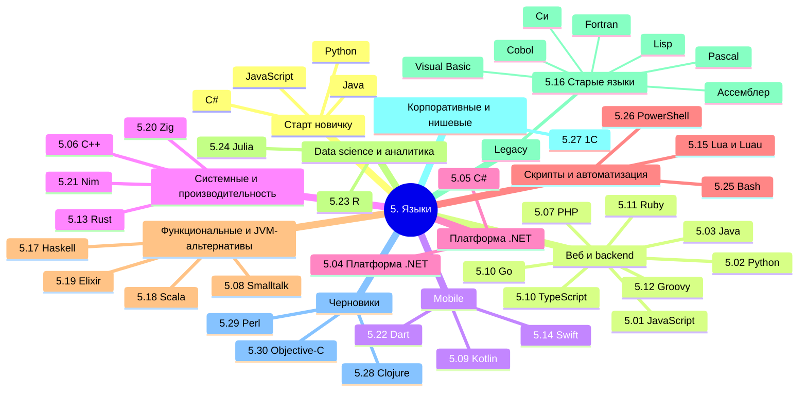

  ОБЯЗАТЕЛЬНО
  ДЛЯ НОВИЧКОВ

import DocCardList from '@theme/DocCardList';

---

## О разделе

<DocCardList />

Мы изучили, как пишут программы, теперь пора посмотреть, на чём пишут.

  
Как читать разделы языков

  

  Общие идеи (компиляция, память, ООП, зависимости) — в ["Код и разработка"](/encyclopedia/4-code-dev/code-dev).

  Краткие идиоматичные записи (обмен переменных, срезы, включения) — [однострочные приёмы](/encyclopedia/4-code-dev/4-02-chto-takoe-kod-i-kak-on-rabotaet/614) и [шпаргалка для Python](/encyclopedia/5-languages/5-02-python/38).

  В вводных статьях языков сложные механизмы по возможности даются **сначала на русском псевдокоде**, затем — синтаксисом конкретного языка (блоки "Справочно на …"). На старте **выберите один язык для старта**, пройдите intro → первую программу — **затем переходите дальше** (фреймворк, смежный стек, второй язык). Не смешивайте на одной неделе правила владения, GC и типов разных языков. Обзор всех языков и выбор направления — [Какой язык программирования выбрать](./kak-vybrat-yazyk-programmirovaniya.md).

  

Что используется для фронтенда, что для бэкенда — какие инструменты и технологии нужны в разных областях. Бэкенд-сервисы чаще упаковывают в **контейнеры** или ВМ — см. [четыре модели развёртывания](/encyclopedia/1-basics/1-035-bazovaya-informatika/508#chetiryre-modeli-razvertyvaniya) (это про инфраструктуру, а не про JVM).

Для учебных игр на коде без движка Unity/Unreal — [Разработка игр на Python](/encyclopedia/5-languages/5-02-python/312), [короткие мини-игры Pygame с разбором](/lab/Примеры/1132), [Minecraft — команды и datapack](/lab/Примеры/1142) (Java Edition, без IDE) и сквозные проекты в [Практикуме разработки игр](/encyclopedia/9-spinoff/9-04-razrabotka-igr/praktikum-razrabotki-igr/intro) (Python/Pygame, [Java Survivors](/encyclopedia/9-spinoff/9-04-razrabotka-igr/praktikum-razrabotki-igr/8), [Приключения Урала Батыра](https://spirzen.github.io/OnlineCardGame/) на [TypeScript](/encyclopedia/5-languages/5-10-typescript/intro)). Для **Unity + C#** — [курс в редакторе](/encyclopedia/9-spinoff/9-04-razrabotka-igr/3) и [готовые MonoBehaviour в Lab](/lab/Примеры/1136).

При изучении языка ИИ уместен для объяснений и черновика, но [вайб-кодинг](/encyclopedia/6-ai/6-07-vayb-koding-i-neurokontent/1) (копипаста без понимания синтаксиса и runtime) тормозит прогресс. Практика с проверкой — [Генерация кода](/encyclopedia/6-ai/6-04-modeli-i-instrumenty/117); про однотипный "пустой" вывод — [нейрослоп](/encyclopedia/6-ai/6-07-vayb-koding-i-neurokontent/2).

Технически, языки по большей части универсальны. Они обычно появляются с определённой целью (JavaScript для оживления страниц, C/C++ для системного программирования, а Java чтобы обезопасить и упростить разработку), но в дальнейшем развиваются, получая новый функционал, новые фичи и возможности.

В интернете часто можно найти громкие заголовки вроде "Какой язык программирования выбрать?" И почти всегда вы встретите от года в год одно и то же - Python лучше всех, JavaScript и Java нужны везде, а C# никому не нужен. Но не всё так просто — разбор по задачам: [Какой язык программирования выбрать](./kak-vybrat-yazyk-programmirovaniya.md).

---
