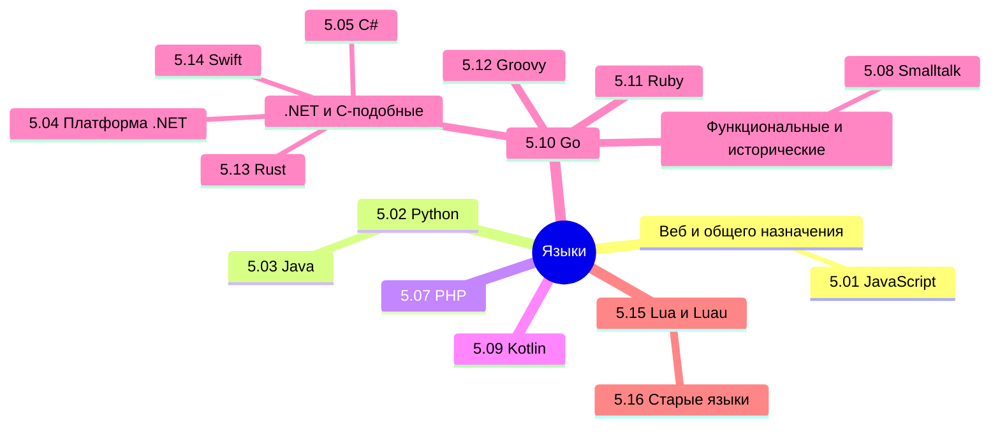

  ОБЯЗАТЕЛЬНО
  ДЛЯ НОВИЧКОВ

import DocCardList from '@theme/DocCardList';

## О разделе

<DocCardList />

Мы изучили, как пишут программы, теперь пора посмотреть, на чём пишут. Что используется для фронтенда, что для бэкенда - какие инструменты и технологии нужны в разных областях.

Технически, языки по большей части универсальны. Они обычно появляются с определённой целью (JavaScript для оживления страниц, C/C++ для системного программирования, а Java чтобы обезопасить и упростить разработку), но в дальнейшем развиваются, получая новый функционал, новые фичи и возможности.

В интернете часто можно найти громкие заголовки вроде «Какой язык программирования выбрать?» И почти всегда вы встретите от года в год одно и то же - Python лучше всех, JavaScript и Java нужны везде, а C# никому не нужен. Но не всё так просто.

---