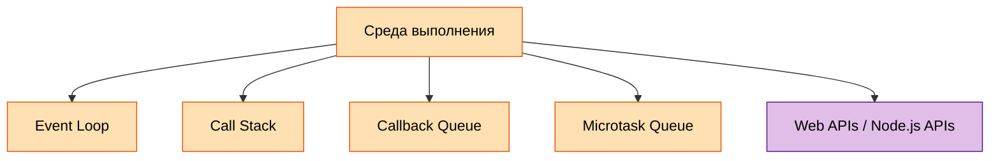
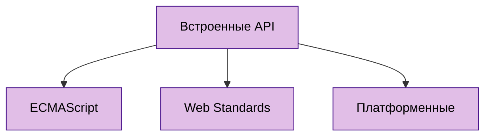
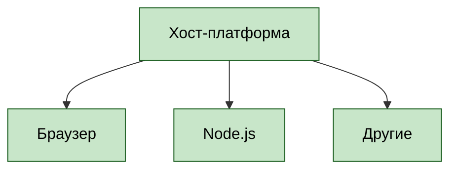
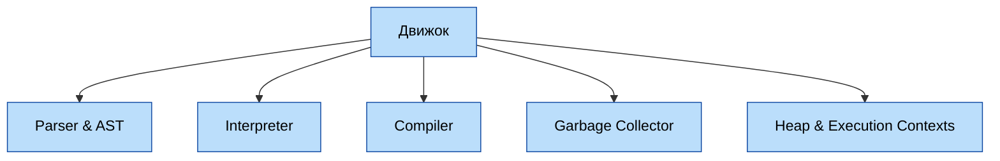

---
title: 5.01. Основы JavaScript
---

# 5.01. Основы JavaScript

<div class="article-tags">
  <span class="tag tag-required">ОБЯЗАТЕЛЬНО</span>
  <span class="tag tag-beginner">ДЛЯ НОВИЧКОВ</span>
  <span class="tag tag-advanced">НЕ ДЛЯ НОВИЧКОВ</span>
  <span class="tag tag-inprogress">В РАЗРАБОТКЕ</span>
</div>
<span class="complexity-badge">Разработчику</span>
<span class="complexity-badge">Архитектору</span>

## Основы JavaScript

★ **JavaScript (JS)** – язык программирования, который делает веб-страницы интерактивными. Как мы убедились ранее, HTML отвечает за разметку и структуру страницы, CSS – за внешний вид, а JS добавляет динамику – анимации, обработку действий пользователя, загрузку данных без перезагрузки страницы и много другое. JS может выступать как соединителем клиентской (фронтенд) части с серверной (бэкенд), вызывать сервисы, отправлять данные, запускать процессы.

Нашим первым языком программирования будет JavaScript, ведь он легко понимается в связке с HTML и CSS, которые мы как раз изучили. Но некоторые моменты могут быть непонятными - но они станут яснее, когда изучим ООП.

Поначалу все путают *JavaScript* и *Java* - но они никак не связаны, несмотря на название. Воспринимайте сразу так - *Java* - **серверный мультиплатформенный бэкенд язык объектно-ориентированного программирования**, а *JavaScript* - **фронтенд язык программирования веб-приложений**. Запомните - ни в коем случае не называйте что-то на Java как JS, и что-то на JS как Java, даже в бытовых сокращениях - покажете плохой уровень знаний. 

В самом начале JS покажется довольно легким - для него не нужно ничего устанавливать, можно простым текстовым редактором написать скрипт и вуаля - уже работает прямо в любом современном браузере. Как правило, в учебниках встречается подход «а давайте сразу напишем и запустим». Но нет, не торопитесь, давайте изучим основы.

Сам по себе код — это текст, который мы напишем, а программа, которая выполняется на основе нашего кода называется скриптом. Мы просто можем сохранить скрипт как файл, открыть его - и он запускается прямо в браузере, работая построчно, что и является его интерпретируемостью, без компиляции. Это означает, что когда вы напишете код, не будет никакой ошибки компиляции - ошибку вы встретите в самой программе, когда запустите и доберётесь до нужной логики.

Почему начинать мы будем именно с него? Во-первых, он *безопасный*, простой и не требует низкоуровневого доступа к памяти или процессору. Во-вторых, он *работает в браузере* - а мы как раз изучили веб-языки HTML и CSS. И в третьих, *для его запуска не потребуется никакой настройки* - браузер и текстовый редактор у вас наверняка есть, можно прямо сейчас встроить код в страницу и запустить.

Да куда уж там. Даже здесь можно его запустить:

```jsx live
function Greeting() {
  return "Это возвращаемое значение - можете попробовать написать что-то своё!";
}
```

Подробности про JS можно узнать здесь https://metanit.com/web/javascript/ и здесь https://developer.mozilla.org/ru/docs/Web/JavaScript

Также можно отметить отличный учебник тут https://learn.javascript.ru/

Чит-лист - https://cheatsheets.zip/javascript

Какие возможности предоставляет JavaScript?
	- *менять содержимое, структуру и стиль страницы после её загрузки*;
	- *делать веб-интерфейсы живыми и отзывчивыми без необходимости перезагрузки*;
	- *реагировать на действия пользователя: клики, прокрутку, наведение, набор текста, жесты и т.д.*;
	- *получать немедленную обратную связь, улучшая опыт взаимодействия*;
	- *получать новые данные с сервера и обновлять части страницы без полной перерисовки*;
	- *хранить, изменять и синхронизировать информацию о текущем состоянии приложения*;
	- *возможность запрашивать данные у других систем, отправлять запросы, обрабатывать ответы*;
	- *читать и изменять структуру HTML, манипулировать CSS, создавать новые элементы*;
	- *выполнять операции вне блокирующего потока выполнения*;
	- *строить анимации, игры, визуализации данных и интерактивные графики*;
	- *сохранять информацию на стороне клиента, чтобы использовать её между сессиями или работать автономно*;
	- *переопределять стандартное поведение браузера, создавать собственные правила и логику*.
	
	
<div class="callout callout--tip">
  <div class="callout-title">Интересный факт</div>
JavaScript не связан с Java. В 1995 году язык создал Брендан Эйх в компании Netscape (кстати, создали JS всего за 10 дней!). Первоначально его назвали Mocha, затем LiveScript, но в тот момент язык Java от Sun Microsystems набирал огромную популярность, и маркетологи решили «подружить» два языка названиями, хотя технически они никак не связаны, у них самостоятельные синтаксисы и особенности.
Часть «скрипт» прямо указывала на задание разработчика – «Сделай язык, похожий на Java, но лёгкий для скриптов.»
</div>

Среда выполнения включает в себя:
	- Event Loop;
	- Call Stack;
	- Callback Queue;
	- Microtask Queue;
	- Web APIs/Node.js APIs.

Подробнее их изучим позже.



Встроенные API JS включают:
	- ECMAScript — встроенные объекты и функции стандарта (Promise, Map, Reflect и др.).
	- Web Standards — API, стандартизированные WHATWG/W3C (Fetch, Storage, IndexedDB).
	- Платформенные — нелексифицированные, но широко доступные (console, setTimeout, atob).



Хост-платформа включает:
	- Браузер — DOM, BOM, Web Workers, Service Workers.
	- Node.js — process, require, Buffer, модули fs, net, http.
	- Другие — Deno (Deno namespace), Bun (Bun API), Electron (ipcRenderer), Cloudflare Workers.




В отличие от языков вроде C++ или Java, JS не требует отдельной компиляции перед запуском. Это сделано для удобства веб-разработки: код должен выполняться сразу в браузере у любого пользователя. Однако для работы требуется движок.

Современные браузеры используют движки JavaScript, которые:
	- анализируют код (выполняя парсинг);
	- компилируют код «на лету» (JIT-компиляция);
	- оптимизируют выполнение для скорости.
К примеру, в Chrome (как и в Node.js) используется V8, в FireFox – SpiderMonkey, а в Safari – JavaScriptCore. Именно движки позволяют JS работать очень быстро, почти как настоящий компилируемый язык.

Движок включает в себя:
	- Parser & AST — лексический и синтаксический анализ.
	- Interpreter — базовое исполнение (Ignition в V8).
	- Compiler — JIT-компиляция (TurboFan, Crankshaft устарел).
	- Garbage Collector — сборка «мёртвых» объектов (Orinoco в V8).
	- Heap & Execution Contexts — управление памятью и контекстами выполнения (глобальный, функциональный, блочный).



JavaScript позволяет выполнять:
	- динамическое изменение страницы – добавление, удаление, изменение элементов без перезагрузки (к примеру, переключение вкладок с контентом);
	- обработку событий (клики, наведение курсора, ввод текста);
	- работу с API (отправку и загрузку данных при обмене с сервером);
	- анимации и визуальные эффекты (плавные переходы, игры, интерактивные карты);
	- валидацию форм (проверку введённых данных перед отправкой).

★ **Главные особенности JavaScript**

	- Интерпретируемость и JIT-компиляция – выполнение кода построчно (правда, современные движки оптимизируют скорость выполнения различными способами);
	- Динамическая типизация – типы данных определяются во время выполнения, переменная может быть числом, а потом строкой (хотя есть TypeScript, который делает типизацию строгой);
	- Асинхронность и событийная модель – JS не блокирует страницу, ожидая ответа от сервера, вместо этого он использует функционал асинхронности – колбэки (callback), промисы (Promise) и async/await;
	- Работа в браузере и за его пределами – изначально был браузерным, но с появлением Node.js появилась возможность использовать JS на сервере;
	- Прототипное наследование – в отличие от классического ООП (как в Java, мы ещё об этом поговорим), JS использует прототипы для организации кода.

