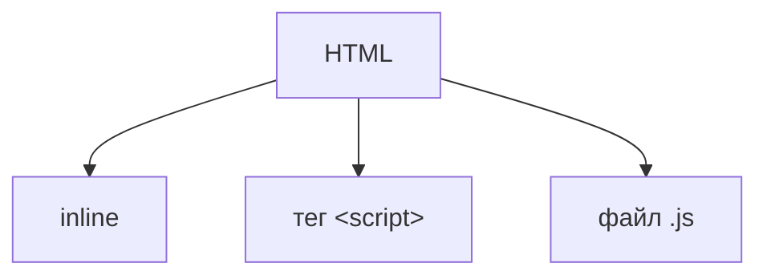

---
title: Структура и подключение JavaScript-кода
---

# Структура и подключение JavaScript-кода

<div class="article-tags">
  <span class="tag tag-required">ОБЯЗАТЕЛЬНО</span>
  <span class="tag tag-beginner">ДЛЯ НОВИЧКОВ</span>
  <span class="tag tag-advanced">НЕ ДЛЯ НОВИЧКОВ</span>
  <span class="tag tag-inprogress">В РАЗРАБОТКЕ</span>
</div>
<span class="complexity-badge">Разработчику</span>
<span class="complexity-badge">Архитектору</span>

## Подключение и структура кода

### Способы подключения скриптов



JavaScript можно добавить на страницу трёмя способами:
- как значение атрибута в теге (inline);
- как отдельный тег `<script>`;
- как отдельный файл в формате `.js`.

### Встроенный скрипт (inline)

**Встроенный скрипт (inline)** – прямо внутри HTML, путём указания функции сразу после события в теге (однако это загромождает HTML):

```html
<button onclick="alert('Привет!')">Нажми меня</button>
```
Встроенный скрипт работает благодаря интеграции всех возможностей в современных браузерах, позволяя не добавлять обширный скрипт для простых активностей. К примеру, если страница простая и не несёт в себе глубокой логики, работы с данными и задача лишь добавить немного «специй» к элементу – выполняется просто добавление выполнения функции в соответствующий тег.

Таким образом, мы получаем JavaScript возможность внутри HTML-тега.

Но использовать этот метод не рекомендуется, если задач много – допустим, если будет несколько десятков кнопок на странице, и у каждой будет расписан скрипт внутри атрибутов тегов кнопок – будет страшный и плохо читаемый код.

---

### Код внутри тега `script`

**Внутри** `<script>` в HTML – код пишется в качестве содержимого тега:

```html
<script>
  console.log("Этот код выполнится сразу!");
</script>
```
Этот подход отличается от предыдущего тем, что скрипт – это содержимое тега `<script>` - все необходимые функции вписываются между открывающим и закрывающим тегом. Он подойдёт для случаев, когда на странице немного логики, и её можно упаковать в одном месте.

Тегов `<script>` на странице может быть много, но, если они разбросаны по всему коду страницы, расположены в разных местах – читать будет очень сложно. Если понадобится поменять что-то, что используется везде – можно упустить фрагмент, или где-то поломать логику.

Если строк кода в теге много (понятие растяжимое, но, к примеру, больше двадцати), то лучше выделить отдельным файлом.

---

### Подключение внешнего файла

**Подключение внешнего файла** – самый лучший вариант, когда JS-код пишется в отдельном файле с расширением .js, а в HTML указывается путь к этому файлу:

```JavaScript
<script src="script.js" defer></script>
```


Таким образом, к HTML-файлу добавляется ещё один файл, содержащий код. Он работает аналогично тегу `<script>`, но его содержимым будет являться ссылка на файл (в атрибуте «src». Если файл расположен в той же папке, что и HTML, можно просто указать, к примеру «script.js». Если же файл в другой папке, или размещён на каком-то сетевом ресурсе, то нужно указать путь к файлу (ссылку). Так, если страниц и скриптом много, они распределяются по папке согласно структуре, задуманной проектировщиком сайта. В самом JS-файле же, какие-либо открывающие/закрывающие теги не требуются. Просто код.

И только в самом начале разработки страницы «пустые», что может создать иллюзию безопасности в стиле «потом разберусь!». 

Нет! Любой продукт со временем наращивает функционал, расширяясь, улучшаясь. Поначалу это «Привет!», а потом понадобится менять значение текста, а затем и локализовать на другие языки, добавлять дополнительную логику – вот поэтому лучше выделить код отдельно. А на практике, задачи совсем сложнее, и язык ппредоставляет гораздо больше возможностей.

---

### Выполнение кода

Скрипт выполняется в соответствии с кодом, указанным в файле/теге, и чтобы машина поняла человекочитаемый код, компиляция выполняется силами движка JS, который встроен в браузер.


JavaScript использует JIT-компиляцию.

**JIT-компиляция (Just-In-Time)** – компиляция «на лету», когда движок JS (например, V8) не компилирует весь код заранее, а делает это во время выполнения:
	- сначала код выполняется построчно (медленно) – это интерпретация;
	- потом движок находит «горячие» участки (часто выполняемый код) – это профилирование;
	- «горячие» участки компилируются в машинный код для ускорения – это оптимизированная компиляция;
	- если предположения движка оказались неверными, код возвращается к интерпретации – это деоптимизация.

---

### Правила хорошего JS-кода

Хороший JS-код должен быть:
	- читаемым (с отступами и комментариями);
	- модульным (разбит на логические блоки);
	- избегающим глобальных переменных (чтобы не было конфликтов).

**Читаемость** – понятие, конечно, субъективное, и если для новичка может быть что-то вполне читабельным, то для синьора – неприемлемо, либо наоборот. Здесь влияет и стиль написания, и стандарты в компании разработчика, и пожелания заказчика, и даже опыт программиста. Но принципа следует придерживаться следующего – дочерние элементы и строки лучше выделять отступом:

```JavaScript
уровень 1
уровень 1 {
    уровень 2 {
        уровень 3
    } //закрывающие символы уровня 2
} //закрывающие символы уровня 1
```


Модульность подразумевает разделение по функциям, без «свалки». Словом, если у нас есть три функции, монолитно (едино) написали бы мы так:

```JavaScript
функция {
    действие1;
    действие2;
    действие3;
}
```
Но если на практике это будет нечитабельно – это раз, и в случае разбора ошибок – вылетит вся функция, даже если ошибочно было лишь действие2. А если нам в другой части кода пригодится функционал действия3, то удобнее будет вызвать функцию, которая выполняет только действие3. Вот и весь смысл. Ведь намного удобнее разбираться в таком подходе:

```JavaScript
функция1 {
    действие1;
}

функция2 {
    действие2;
}

функция3 {
    действие3;
}
```

---

### Структура кода

Код состоит из следующих компонентов:
	- импорты, которые указывают, какие дополнительные модули используются (если они нужны);
	- константы и настройки – то, что будет использоваться в функциях;
	- основные функции, содержащие логику;
	- обработчики событий;
	- инициализаторы;
	- комментарии.

Все эти компоненты мы разберём позднее. Но для начала, нам нужно увидеть, как это выглядит на практике:

```JavaScript
// так выглядит однострочный комментарий
/*
а вот так – 
многострочный комментарий
*/

// 1. Импорты
import { func } from './module.js';

// 2. Константы и настройки
const API_URL = "https://api.example.com";

// 3. Основные функции
function fetchData(url) {
  // ... логика загрузки данных
}

// 4. Обработчики событий для соответствующих объектов
document.getElementById("btn").addEventListener("click", () => {
  fetchData(API_URL);
});

// 5. Инициализация (запуск кода после загрузки страницы)
document.addEventListener("DOMContentLoaded", () => {
  console.log("Страница загружена!");
});
```

