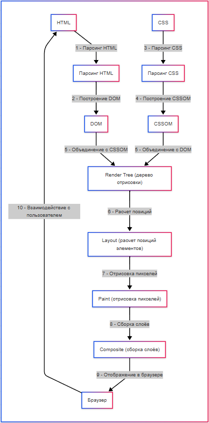

---
title: 5.01. Работа и применение
---

# 5.01. Работа и применение

<div class="article-tags">
  <span class="tag tag-required">ОБЯЗАТЕЛЬНО</span>
  <span class="tag tag-beginner">ДЛЯ НОВИЧКОВ</span>
  <span class="tag tag-advanced">НЕ ДЛЯ НОВИЧКОВ</span>
  <span class="tag tag-inprogress">В РАЗРАБОТКЕ</span>
</div>
<span class="complexity-badge">Разработчику</span>
<span class="complexity-badge">Архитектору</span>

## Работа и применение

```
Лексическая структура
Ключевые слова и зарезервированные идентификаторы
Чувствительность к регистру
Комментарии, пробелы, табуляция
Юникод и кодировка

```

★ **Как работать с JavaScript?**

1. Анализ задачи – сначала нужно понять, что должен делать скрипт? Анимация, вывод информации, обработка – всё, что требуется.
2. Разбить на подзадачи, к примеру сначала надо получить данные с сервера, потом их отобразить в таблице, а затем добавить фильтрацию. Превратить одно действие в несколько, и так до мельчайших деталей, создавая алгоритм.
3. Написание функции для каждой задачи – каждой задаче (подзадаче) пишется код, который использует соответствующие инструменты языка для реализации логики.
4. Тестирование в консоли – разработчик открывает страницу в браузере, включает консоль разработчика, и затем пытается воспроизвести логику – к примеру, нажимает на кнопку, наблюдает за процессом и анализирует результат.
5. Рефакторинг – улучшение читаемости и оптимизация. Если в процессе тестирования выяснилось, что всё работает, как надо, нужно посмотреть на свой код, и оценить – в первую очередь, читабельность и модульность. Откладывать этот шаг нельзя, как и недооценивать.

Сама логика работает не только по принципу «сделай это действие», но также и включает в себя проверку условий, обработку событий и повторяемость действий.

Проверка условий работает как развилка – если условие выполняется, то одна дорога, если не выполняется – другая.

Обработка событий работает по принципу – «наступило событие - тогда выполняем!». Самый простой пример – нажатие кнопки.

Повторяемость – это циклы и обращение к функциям/методам, когда мы можем использовать «действие3» снова и снова.

Итого, логика в JavaScript строится на:
	- условных операторах (`if`, `else`, `switch`);
	- циклах (`for`, `while`, `do…while`);
	- функциях (чистые функции, методы).

Пример:
```JavaScript
if (userAge >= 18) {
    console.log("Доступ разрешён");
  } else {
    console.log("Доступ запрещён");
  }
```
Здесь программа проверяет переменную `userAge`, и если (`if`) её значение будет больше или равно 18, то доступ разрешён, иначе (`else`) – запрещён. Это простейшая развилка, которая демонстрирует работу оператора. Команда `console.log` выводит текст на экран. Но пока не погружайтесь в ключевые слова – их мы изучим позже.

Так, логика проверок, обработок и повторяемости нам ясна. 

Чем же JS ближе к веб-страницам и стилям? Конечно, это придание «живости» скелету страницы. JavaScript используется для создания анимаций. Простые анимации можно, конечно, использовать в CSS (`transition`, `@keyframes`), но сложная интерактивность обеспечивается именно через JS.

Браузер работает с JavaScript по следующим этапам:
	- парсинг HTML (анализ содержимого страницы);
	- построение DOM (структуры элементов страницы с соблюдением иерархии);
	- парсинг CSS и построение CSSOM (структура стилей, селекторов);
	- объединение DOM + CSSOM – создание Render Tree (иерархия отрисовки);
	- layout (reflow) – расчет позиций элементов;
	- paint – отрисовка пикселей;
	- composite – сборка слоёв.

Звучит сложно. Но эти термины лишь раскрывают алгоритм, когда художник сначала определяет ключевые элементы, распределяет их (композирует), рисуя эскиз, затем уже детализирует и раскрашивает. Словом, сначала строим скелет, затем наполняем мясом и вдыхаем жизнь при запуске.
```
Разложили объекты HTML → построили объектную модель DOM → разложили объекты CSS → построили объектную модель CSSOM →расставили объекты → отрисовали → собрали.
```



Теперь же, понимая, как всё работает целиком, перейдём к сердцу JS – видимости и функциям.
