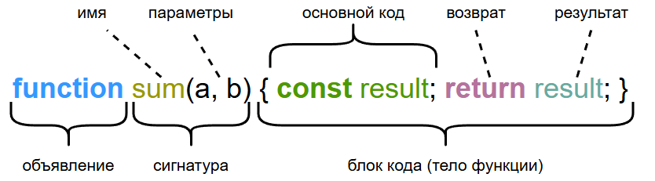

---
title: 5.01. Функции
---

# 5.01. Функции

## Функции

```
Функции как объекты первого класса
Неявный return
Контекст this в стрелочных функциях
```


★ **Функция** – это блок кода, который выполняет конкретную задачу и может быть повторно использован. Это как мини-программа внутри основной программы.

Как выглядит функция:
```JavaScript
function имяФункции(аргументы) {
    // Тело функции (код, который выполняется при вызове)
    return результат; // Необязательно
  }
```
Что здесь указано?
	- `function` – это ключевое слово, зарезервированное в языке JS для указания, что сейчас будет функция;
	- `имяФункции` – это любой набор слов и символов (начинать нужно строчной буквой, ни в коем случае не Прописной и не 1цифрой), который придумывает программист. Поменять можно в любое время, но если где-то идёт обращение к функции, важно поменять и обращение;
	- `аргументы` – это входные данные, которые принимает функция, словно пакет документов, требуемый в регистратуре – чтобы работать, функция должна знать исходные данные. Их можно и не указывать, тогда скобки с аргументами будут пустыми `()`;
	- `тело функции` – это код, который включает в себя почти любой набор кода, который представляет собой суть функции, её всю логику;
	- `return` – ключевое слово для указания, что сейчас будет возвращаемый результат.

Пример создания:
```JavaScript
// Функция для сложения двух чисел
function sum(a, b) {
    const result = a + b;
    return result; // Возвращаем результат
  }
```
Как можно заметить при разборе:
	- функция называется sum;
	- функция принимает аргументы a и b, следовательно, вызывая её, нужно будет указать значения, где первое значение до запятой будет равным `a`, второе – `b`;
	- код включает в себя константу (ключевое слово `const`) с именем `result`;
	- константа `result` равна `a + b`;
	- результат, который вернёт функция – это то, чему равна константа `result`.



Так, мы получаем некую функцию, которая суммирует аргументы. И если нам, в какой-то момент, понадобится сложить какие-то два значения, теперь мы можем просто вызывать нашу функцию, сообщим ей значения в виде аргументов.

Пример вызова:
```JavaScript
const total = sum(2, 3); // Вызов функции с аргументами 2 и 3
console.log(total); // 5
```
Здесь мы выполняем какую-то логику, и объявляем константу с именем `total`, которая равна результату выполнения функции `sum(a, b)`. Указав имя функции и значения аргументов, мы можем даже ссылаться на нашу константу, зная, что она всегда будет равна `5` в нашем случае. И выводим на консоль значение этой константы, выполнив `console.log(total)`.

Ещё раз – повторим, что такое вызов. Понятно, что функция что-то выполняет в своём теле. Но она не запустится сама по себе, а значит кто-то должен её запустить. Этот «запуск» называется вызовом – функцию нужно вызвать. Вызов функции – это момент, когда функция начинает выполнять свой код. Вызов происходит по имени функции с круглыми скобками (и аргументами, если они есть):
```JavaScript
// Создали функцию
function greet() {
    console.log("Привет!");
  }
  
  // Вызвали её 3 раза
  greet(); // "Привет!"
  greet(); // "Привет!"
  greet(); // "Привет!"

```
Вызывать функции можно сколько угодно раз и когда угодно. Именно тут и раскрывается смысл декомпозиции – нужно разбивать всё на подзадачи и для каждой создавать функции, которые могут пригодиться и упростить код.

Так, мы имеем два понятия - **объявление (создание)** функции и её **вызов**.

В JavaScript существует три способа объявления функции:

1) **Function Declaration Statement** - используется ключевое слово function, затем указывается имя функции, параметры, тело и возвращаемое значение:
```JavaScript
function <имя> (<Параметры>) {
    <тело>
    return <возвращаемое значение>
}
```
2) **Function Definition Expression** - функция-выражение, или анонимная функция. Здесь подразумевается, что имени у функции нет:
```JavaScript
function (<параметры>) {
    <тело>
    return <возвращаемое значение>
}
```
Это удобно, когда нужно создать «вспомогательную функцию», допустим, для передачи в качестве аргумента или записи в переменную. Можно сделать как переменную и получить похожий на вызов синтаксис:
```JavaScript
let sum = function(a, b) { return a + b }
let x = sum(2, 2)
```
3) **Стрелочные функции (или функции-стрелки)** - анонимно, без фигурных скобок, с использованием «`=>`» стрелки:
```JavaScript
let <имяПеременной> = (<параметры>) => <тело функции>;
```
Они позволяют сокращать синтаксис функций, заменяя «`{ return result}`» на «`=> result`». Это может быть сложно новичку, но их смысл проще, чем кажется:

Представим, что у нас есть a и b:
```JavaScript
let a = 1;
let b = 2;
```
И нам нужно получить сумму, записав в результат:
```JavaScript
let result = sum(a, b);

function sum(a, b) {
    return a + b;
}
```
Мы объявили переменную `result`, которая равна результату выполнения функции `sum`, принимающей аргументы `a` и `b`, суммирующей их и возвращающей результат. Но можно её записать короче:
```JavaScript
let result = (a, b) => a + b;
```


То есть мы указали аргументы, и буквально упростили функцию, указав её в одной строке. Но для новичка может быть не столь легко читать такие функции. А теперь, если не поняли, перечитайте и подумайте. Принцип таков:
```JavaScript
переменная = (аргумент1, аргумент2) => выражение;
```
С функциями можно делать многие другие вещи.


Функции бывают нескольких видов:

1. **Чистая функция (Pure Function)** – всегда возвращает одинаковый результат для одних и тех же аргументов, и не изменяет внешние переменные.
```JavaScript
// Чистая функция
function multiply(a, b) {
    return a * b; // Только возвращает результат
  }
  
  console.log(multiply(2, 5)); // Всегда 10
```
Чистой она называется, потому что она независима и даёт результат, строго выполняя свою задачу. Всегда проще представить себе обычные арифметические операции – отличный пример. Выше мы создали чистую функцию `multiply(a, b)`, и в отличие от sum, она умножает `a` на `b`. Потом, можем вывести в консоль значение, равное результату функции `multiply` с аргументами `2` и `5`.

2. **Метод** – функция, которая является свойством объекта и работает с его данными.
```JavaScript
const user = {
    name: "Дарт Вейдер",
    // Метод объекта
    sayHi() {
      console.log(`Привет, я ${this.name}!`);
    }
  };
  
  user.sayHi(); // "Привет, я Дарт Вейдер!"
```
В примере выше у нас есть объект – user, константа, у которой есть свойство `name`, равное какому-то значению, и самое главное – внутри объекта user есть функция `sayHi()`.

Она находится внутри объекта, следовательно, просто так к ней не обратиться – она зависима и принадлежит объекту user.
Поэтому, вызывая эту функцию `sayHi`, мы должны указать сначала путь к этой функции – название объекта-владельца. Владелец и свойство/функция разделяются точкой – в нашем случае, это `user.sayHi()`.

Скобки всегда указываются в функциях и методах, даже если аргументов нет. В роли аргументов могут выступать не только явно указанные данные, но и переменные/константы:
```JavaScript
function greet(name) {
    console.log(`Привет, ${name}!`);
  }
  
  greet("Йода"); // "Привет, Йода!"
  greet("Падме"); // "Привет, Падме!"
```
После того, как функция выполнит свою работу, она должна что-то вернуть, какой-то результат. «return» возвращает результат (если его нет, функция вернёт неопределённое значение – `undefined`):
```JavaScript
function checkAge(age) {
    if (age >= 18) {
      return "Доступ разрешён";
    } else {
      return "Доступ запрещён";
    }
  }
  
  console.log(checkAge(20)); // "Доступ разрешён"
```
Важно: имя функции должно быть глаголом (сделать, получить) и на английском языке – `getData`, `calculateSum`. Логика не должна смешиваться – одна функция-одна задача. И чистые функции, конечно, предпочтительнее.

### Каррирование

Например, есть такое понятие как каррирование — это процесс преобразования функции от нескольких аргументов в последовательность функций, каждая из которых принимает по одному аргументу.

Вместо того, чтобвы вызывать функцию так:
```JavaScript
add(1, 2, 3)
```
Мы сможем вызывать так:
```JavaScript
add(1)(2)(3)
```
И в дальнейшем это позволит нам «замораживать» аргументы, без необходимости передавать все три. Пример:
```JavaScript
let addOne = add(1);
let addOneAndTwo = addOne(2);
let result = addOneAndTwo(3);
```
Шаблон таков - у нас есть функция:
```JavaScript
function add(a, b, c) {
    return a + b + c;
}
```
Мы создаём функцию curry, которая принимает исходную функцию и возвращает её каррированную версию:
```JavaScript
function curry(fn) {
    return function curried(...args) {
        // Если передали достаточно аргументов — вызываем исходную функцию
        if (args.length >= fn.length) {
            return fn.apply(this, args);
        } else {
            // Иначе возвращаем функцию, которая ждёт остальные аргументы
            return function (...nextArgs) {
                return curried.apply(this, args.concat(nextArgs));
            }
        }
    };
}
```
Пояснение. `fn.length` это значение количества параметров у исходной функции (например, `add(a,b,c)` соответственно имеет `fn.length === 3`, т.е. три параметра). В `…args` мы собираем все переданные аргументы, и если их хватает - вызываем fn. Если не хватает, то возвращаем новую функцию, которая запомнит текущие фрагменты и дождётся остальных.

Пример, который мы привели выше `(curry(fn))` это непростая функция, но более универсальная, способная работать с любым количеством аргументов. Можно сделать и более простой шаблон:
```JavaScript
function curry3(f) {
    return function(a) {
        return function(b) {
            return function(c) {
                return f(a, b, c);
            };
        };
    };
}

// Использование:
const curriedAdd = curry3(add);
curriedAdd(1)(2)(3); // → 6
```
Это не так универсально, но может быть нагляднее - здесь три аргумента. Есть и более современные способы, к примеру, при совмещении стрелочных функций и каррирования:
```JavaScript
const curry = (fn) => (...args) =>
    args.length >= fn.length
        ? fn(...args)
        : (...nextArgs) => curry(fn)(...args, ...nextArgs);
```
Работает абсолютно так же, просто сделано в другом стиле.

Каррирование позволяет частично применять фунции, создавать специализированные функции без дублирования кода. Нужно взять функцию, обернуть её (как мы сделали в let addOne, к примеру), и затем вызывать.

