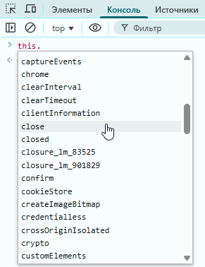
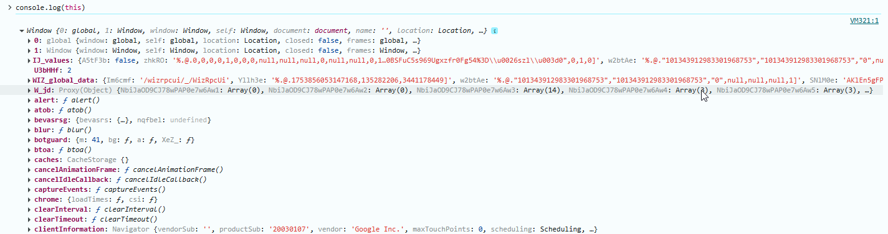

---
title: 5.01. Работа с объектами
---

# 5.01. Работа с объектами

<div class="article-tags">
  <span class="tag tag-required">ОБЯЗАТЕЛЬНО</span>
  <span class="tag tag-beginner">ДЛЯ НОВИЧКОВ</span>
  <span class="tag tag-advanced">НЕ ДЛЯ НОВИЧКОВ</span>
  <span class="tag tag-inprogress">В РАЗРАБОТКЕ</span>
</div>
<span class="complexity-badge">Разработчику</span>
<span class="complexity-badge">Архитектору</span>

## Работа с объектами

```
Создание объектов: литералы, Object.create(), конструкторы
Свойства: геттеры, сеттеры, дескрипторы
Прототипное наследование
Object и его методы (keys, values, entries, assign, defineProperty и др.)
Function как конструктор функций
Синтаксис class
Конструктор: constructor
Наследование: extends
Статические методы и поля: static
Приватные и публичные поля
Статические блоки инициализации
super в методах и конструкторах

```

В JavaScript, с появлением ES6 (2015) используется «синтаксический сахар» над прототипным наследованием – классы. Это позволяет писать код в более привычном ООП-стиле. Благодаря классам, может быть создан объект (некоторые объекты уже создаются – элементы DOM), и можно получить доступ к свойствам или методам класса. К примеру, можно вызвать класс.метод() и сразу вызывать уже существующие стандартные возможности, а также создавать свои.

Объект JavaScript может быть пользовательским (со своими свойствами и методами) или объектом DOM.

Их можно расширять при помощи миксинов (путем объединения свойств и методов из одного или нескольких исходных объектов). Микс - смешивать, смешивают поведение нескольких в один объект.


К примеру, так выглядит базовый объект:
```JavaScript
// Базовый объект
const Объект = {
    имя: "Основной объект",
    метод() {
        console.log("Это метод основного объекта.");
    }
};
```
Если обратиться через название объекта и точку, можно получать свойства и вызывать методы - `Объект.имя` или `Объект.метод()`.

Вышеприведенный пример называется простым созданием объекта (литерал):
```JavaScript
let obj = {
    key: "value",
    anotherKey: "AnotherValue"
};
```
Это более сложный тип данных, который можно записать в переменную и придать ему свойства в виде «`ключ: “значение”`». Это может быть, к примеру, пользователь с присущими ему именем, Email и возрастом:
```JavaScript
let user = {
    name: "Тимур",
    email: "timur@mail.com",
    age: 30
};
```
Почему это называется простым созданием? Потому что есть более сложное - с использованим классов или через функцию конструктор.

Можно создать функцию для того, чтобы создавать объекты по шаблону лишь путем вызова метода-конструктора, которому нужно лишь передать аргументы (соответствующие значениям) и функция сама создаст объект:
```JavaScript
function Объект(значение) {
  this.ключ = значение;
  this.другойКлюч = "значение по умолчанию";
}

let obj1 = new Объект("привет");
let obj2 = new Объект("мир");

console.log(obj1); // { ключ: "привет", другойКлюч: "значение по умолчанию" }
```
Конструктор будет выступать в роли метода, создающего объект, а команда new означает создание нового объекта. Важно не путать с простым литералом, ведь new Объект это именно функция, а не сам объект.

Объекты нужны для создания комплексного набора данных с разными типами, и при работе с JS в крупных системах, как правило, работа с объектами неизбежна. Важное отличие от примитивов в том, что они работают ссылочно, благодаря чему переменная лишь ссылается на объект. Ссылаться на объект `user` могут несколько переменных, что позволяет не копировать все значение целиком - память будет использоваться как для одного набора данных. Но давайте пока не будем в это погружаться. Это станет понятно позднее.

У объекта могут быть методы - особые функции, которые являются свойством объекта и хранятся в нём. К примеру, мы сделали объект «собака»:
```JavaScript
let собака = {
  имя: "Тарзан",
  лает: function() {
    console.log(this.имя + " говорит: Гав-гав!");
  }
};
```
Здесь «лает» является методом объекта «собака». И «`this`» — это ключевое слово, которое ссылается на сам объект «собака». В дальнейшем мы просто можем вызывать метод через точку:
```JavaScript
собака.лает(); // "Тарзан говорит: Гав-гав!"
```
В ES6 появился и более удобный способ:
```JavaScript
let собака = {
  имя: "Тарзан",
  лает() {
    console.log(this.имя + " говорит: Гав-гав!");
  },
  ест(еда) {
    console.log(this.имя + " ест " + еда);
  }
};

собака.лает(); // Гав-гав!
собака.ест("корм"); // Тарзан ест корм
```
Причем метод можно добавить и позднее, не обязательно при создании объекта. К примеру, сначала создать объект, потом добавить метод и вызывать его:
```JavaScript
let кот = {
  имя: "Барсик"
};

// Добавляем метод позже
кот.мяукает = function() {
  console.log(this.имя + " говорит: Мяу!");
};

кот.мяукает(); // "Барсик говорит: Мяу!"
```
`this` — это ссылка на объект, который вызывает функцию. Это называется контекст выполнения - this определяется в момент вызова функции, а не при её создании и зависит от способа вызова функции.

Если вызывать `this` в методе объекта, то `this` = сам объект. В больших проектах работа с объектами позволит использовать автодополнение в браузере или IDE, когда можно будет указать «кот.» и IDE выведет доступные свойства и методы.

Ранее мы упоминали, что существует деструктивное присваивание — это может быть применено и к объектам. Пример:
```JavaScript
let user = { name: "Боб", age: 30 };

let { name, age } = user;

console.log(name); // "Боб"
console.log(age);  // 30
```


`prototype` — это механизм наследования в JavaScript, основанный на цепочке прототипов (prototype chain). Каждая функция в JS имеет свойство `prototype`, которое используется, когда функция используется как конструктор (с new).

`prototype` — это свойство функции-конструктора.

`__proto__` — это свойство объекта, указывающее на его прототип (устаревшее, но работает; современный аналог — `Object.getPrototypeOf()`).

`superclass` — это родительский класс, от которого наследуется другой класс (дочерний, или подкласс).

Этот термин чаще используется в контексте классов (ES6+) и наследования через `extends`.


В JavaScript очень часто приходится работать с объектами, чья структура неочевидна — это может быть объект из API, библиотеки, фреймворка (React, Vue, Express), или даже this в сложной цепочке вызовов. И на практике сталкиваться можно с непониманием того, что есть у объекта. Узнать, какие свойства или методы есть у объекта, можно несколькими способами.

1. **Консоль**. Можно открыть консоль в инструментах разработчика (DevTools, F12), поставить точку останова на нужной строке и запустить выполнение кода. После этого, в консоли можно просто написать `this` и поставить точку - после точки будет отображено всё возможное - так работает автодополнение:



2. **Дерево объекта**. Также можно в браузере написать `console.log(myObject)`; - после чего в консоли браузера увидим интерактивное дерево объекта - по нему можно кликать, раскрывать свойства, смотреть методы.



А если написать `console.dir(myObject)` — это покажет только свойства и методы, без лишней информации. Можете открыть любой сайт и попробовать протестировать, написав `console.log(this)` или `console.dir(this)`. Если навести мышкой на объект - подсказка покажет тип и структуру.

Если при поиске объекта, к примеру `myObject.test()` получаем ошибку «`Uncaught TypeError: myObject.test is not a function`», значит такой функции нет. А если напишем `myObject.test`, но такого свойства нет, то получим `undefined` - «неопределенно».

3. Можно использовать методы для перечисления свойств, что позволит программно узнать, что внутри объекта:
	- `Object.keys(obj)` вернёт массив собственных перечисляемых свойств (`[‘name’, ‘age’]`);
	- `Object.values(obj)` вернёт массив значений свойств (`[‘Тимур’, ‘30’]`);
	- `Object.entries(obj)` вернет свойства целиком (`[‘name’, ‘Тимур’]`, `[‘age’, ‘30’]`);
	- `for…in` позволит перебирать свойства, к примеру:
```JavaScript
for (let key in user) {
    console.log(key, user[key]);
}
```
	- `Object.getOwnPropertyNames(obj)` покажет все собственные свойства, включая неперечисляемые;
	- `Reflect.ownKeys(obj)` покажет все собственные ключи, включая символы (Symbol) и неперечисляемые.
	
4. **VS Code и другие IDE**. Если объект имеет типизацию (например, JSDoc, TypeScript или встроен в JS (базовый объект), то VS Code покажет подсказки при наведении и автодополнении. К примеру:
```JavaScript
const arr = [1, 2, 3];
arr. // → сразу выпадает список методов: push, pop, map, filter и т.д.
```
Если же объект из библиотеки или фреймворка, то разумеется, сначала следует прочитать документацию, которая всегда описывает структуру объектов. И опять же, можно смотреть в консоли, как описано выше.

Мы можем создать миксины:
```JavaScript
// Миксин 1
const Миксин1 = {
    миксин1Метод() {
        console.log("Это метод из Миксина 1.");
    }
};
// Миксин 2
const Миксин2 = {
    миксин2Метод() {
        console.log("Это метод из Миксина 2.");
    }
};
```
Теперь это два «дополнительных объекта», которые имеют свои методы миксин1Метод() и миксин2Метод().

После этого мы можем либо использовать `Object.assign`, чтобы скопировать свойства и методы из Миксин1 и Миксин2 в Объект:
```JavaScript
// Применяем миксины напрямую через Object.assign
Object.assign(Объект, Миксин1, Миксин2);

// Используем расширенный объект
Объект.метод(); // Это метод основного объекта.
Объект.миксин1Метод(); // Это метод из Миксина 1.
Объект.миксин2Метод(); // Это метод из Миксина 2.
```
…либо использовать функцию смешивания:
```JavaScript
// Функция для смешивания (применения миксинов)
function применитьМиксины(целевойОбъект, ...миксины) {
    миксины.forEach(миксин => {
        Object.assign(целевойОбъект, миксин);
    });
}
// Применяем миксины к объекту
применитьМиксины(Объект, Миксин1, Миксин2);
```
Функция смешивания актуальна как посредник для случаев, когда объектов может быть несколько и нужно часто применять их к разным объектам, или когда работа ведётся с большим количеством миксинов. Она используется для упрощения процесса объединения свойств и методов из нескольких миксинов в один объект.
```JavaScript
// Применяем миксины к объектам
применитьМиксины(Объект1, Миксин1, Миксин2);
применитьМиксины(Объект2, Миксин1);
// Используем расширенные объекты
Объект1.метод(); // Это метод первого объекта.
Объект1.миксин1Метод(); // Это метод из Миксина 1.
Объект1.миксин2Метод(); // Это метод из Миксина 2.
Объект2.метод(); // Это метод второго объекта.
Объект2.миксин1Метод(); // Это метод из Миксина 1.
// Объект2.миксин2Метод(); // Ошибка: метод миксин2Метод не определён, так как Миксин2 не был применён.
```

**Объявление класса**:
```JavaScript
class Person {
    // Конструктор (вызывается при создании объекта)
    constructor(name, age) {
      this.name = name; // Свойство
      this.age = age;
    }
  
    // Метод
    greet() {
      return `Привет, я ${this.name}!`;
    }
  }
```
**Создание объекта (экземпляра класса)**:
```JavaScript
const person = new Person('Том', 25);
console.log(person.greet()); // "Привет, я Том!"
```
**Свойства** – это переменные, принадлежащие объекту/классу.

**Публичные свойства** доступны извне класса:
```JavaScript
class Car {
    constructor(brand) {
      this.brand = brand; // Публичное свойство
    }
  }
  
  const myCar = new Car('Toyota');
  console.log(myCar.brand); // "Toyota"
```
**Приватные свойства** (с префиксом `#`) доступны только внутри класса:
```JavaScript
class User {
    #password; // Приватное свойство
  
    constructor(login, password) {
      this.login = login;
      this.#password = password;
    }
  }
  
  const user = new User('admin', '12345');
  console.log(user.#password); // Ошибка!
```
**Статические свойства (static)** принадлежат классу, а не экземплярам:
```JavaScript
class MathUtils {
    static PI = 3.14; // Статическое свойство
  }
  
  console.log(MathUtils.PI); // 3.14
```

★ **Методы** – это функции, принадлежащие классу/объекту.

Публичные методы, как и свойства, доступны извне. Приватные методы, как и свойства, доступны внутри класса и имеют префикс `#`.

★ **Пример** – класс для работы с API:
```JavaScript
class ApiClient {
    constructor(baseUrl) {
      this.baseUrl = baseUrl;
    }
  
    async get(endpoint) {
      const response = await fetch(`${this.baseUrl}/${endpoint}`);
      return response.json();
    }
  
    async post(endpoint, data) {
      const response = await fetch(`${this.baseUrl}/${endpoint}`, {
        method: 'POST',
        body: JSON.stringify(data)
      });
      return response.json();
    }
  }
  
  // Использование
  const api = new ApiClient('https://api.example.com');
  api.get('users').then(users => console.log(users));
```

### Базовые объекты

```
Глобальные свойства
globalThis
Infinity, NaN, undefined

Глобальные функции
eval() (опасности)
isFinite(), isNaN()
Парсинг: parseInt(), parseFloat()
Кодирование URI: encodeURI, encodeURIComponent, decodeURI, decodeURIComponent
Устаревшие: escape(), unescape()

Фундаментальные объекты
Boolean, Symbol, Error и его подтипы:
EvalError, RangeError, ReferenceError, SyntaxError, TypeError, URIError
AggregateError, SuppressedError
InternalError (non-standard)

```

★ **Базовые встроенные объекты**

JavaScript предоставляет стандартные объекты-конструкторы для работы с разными типами данных:

| Объект | Описание | Пример использования |
|-----|---------|---------|
|`Array`	|Работа с массивами	|`[1, 2, 3].map(x => x * 2)`
|`Boolean`	|Логические значения	|`new Boolean(true)`
|`Math`	|Математические операции	|`Math.PI, Math.random()`
|`Number`	|Числа и методы	|`Number.parseInt("42")`
|`String`	|Строки и методы	|`"Hello".toUpperCase()`
|`Global`	|Глобальные функции	|`isNaN(), eval()`

★ **Массив** – основные методы:

| Метод | Описание | Пример |
|-----|---------|---------|
|`push() / pop()`	|Добавить/удалить элемент в конец	|`arr.push(4) → [1,2,3,4]`
|`shift() / unshift()`	|Удалить/добавить в начало	|`arr.unshift(0) → [0,1,2,3]`
|`slice()`	|Копирует часть массива	|`arr.slice(1,3) → [2,3]`
|`splice()`	|Удаляет/заменяет элементы	|`arr.splice(1,1) → [1,3]`
|`map()`	|Преобразует массив	|`[1,2].map(x => x*2) → [2,4]`
|`filter()`	|Фильтрует элементы	|`[1,2,3].filter(x => x>1) → [2,3]`
|`reduce()`	|Сворачивает массив в одно значение	|`[1,2].reduce((a,b) => a+b) → 3`
|`find()`	|Находит первый подходящий элемент	|`[1,2,3].find(x => x>1) → 2`
|`sort()`	|Сортирует массив	|`[3,1].sort() → [1,3]`
|`forEach(fn)`	|Выполняет функцию для каждого элемента (ничего не возвращает)	|`arr.forEach(el => console.log(el))`
|`includes(value)`	|Проверяет, есть ли элемент в массиве	|`[1,2].includes(2) → true`
|`indexOf(value)`	|Возвращает индекс элемента или -1, если не найден	|`[1,2,3].indexOf(2) → 1`
|`some(fn)`	|Проверяет, существует ли хотя бы один подходящий элемент	|`[1,2].some(x => x > 1) → true`
|`every(fn)`	|Проверяет, все ли элементы соответствуют условию	|`[2,3].every(x => x > 1) → true`
|`join(separator)`	|Преобразует массив в строку с указанным разделителем	|`[1,2,3].join('-') → "1-2-3"`
|`reverse()`	|Разворачивает массив (мутирует оригинал)	|`[1,2,3].reverse() → [3,2,1]`
|`flat(n)`	|Расплющивает вложенные массивы на n уровней	|`[1, [2, [3]]].flat(2) → [1,2,3]`
|`isArray()`(статический)	|Проверяет, является ли значение массивом	|`Array.isArray([1]) → true`

★ **Числа** – основные методы и свойства:

| Метод/ Свойство | Описание | Пример |
|-----|---------|---------|
|`Number.parseInt()`	|Преобразует строку в целое число	|`parseInt("42") → 42`
|`Number.parseFloat()`	|Преобразует в дробное число	|`parseFloat("3.14") → 3.14`
|`toFixed(n)`	|Округляет до n знаков после запятой	|`3.1415.toFixed(2) → "3.14"`
|`toString()`	|Преобразует число в строку	|`42.toString() → "42"`
|`Math.random()`	|Случайное число от 0 до 1	|`Math.random() → 0.123`
|`Math.round()`	|Округление до ближайшего целого	|`Math.round(3.6) → 4`
|`Math.floor(x)`	|Округляет вниз до целого	|`Math.floor(3.9) → 3`
|`Math.ceil(x)`	|Округляет вверх до целого	|`Math.ceil(3.1) → 4`
|`Math.trunc(x)`	|Убирает дробную часть, не округляя	|`Math.trunc(3.9) → 3`
|`Number.isNaN(value)`	|Проверяет, является ли значение NaN	|`Number.isNaN(NaN) → true`
|`Number.isFinite(value)`	|Проверяет, является ли значение конечным числом	|`Number.isFinite(Infinity) → false`
|`Number.isInteger(value)`	|Проверяет, является ли число целым	|`Number.isInteger(42) → true`
|`Math.pow(x, y)`	|Возводит x в степень y	|`Math.pow(2, 3) → 8`
|`Math.sqrt(x)`	|Квадратный корень из числа	|`Math.sqrt(16) → 4`
|`Math.min(...values)`	|Находит минимальное число	|`Math.min(1, 2, 3) → 1`
|`Math.max(...values)`	|Находит максимальное число	|`Math.max(1, 2, 3) → 3`
|`Number.MIN_VALUE`	|Минимально возможное положительное число	|`Number.MIN_VALUE → 5e-324`
|`Number.MAX_VALUE`	|Максимально возможное число	|`Number.MAX_VALUE → 1.7976...e+308`

★ **Строки** – основные методы:

| Метод | Описание | Пример |
|-----|---------|---------|
|`length`	|Длина строки	|`"hello".length → 5`
|`toUpperCase()`	|Преобразует в верхний регистр	|`"Hi".toUpperCase() → "HI"`
|`toLowerCase()`	|Преобразует в нижний регистр	|`"Hi".toLowerCase() → "hi"`
|`includes()`	|Проверяет наличие подстроки	|`"hello".includes("ell") → true`
|`split()`	|Разделяет строку в массив	|`"a,b,c".split(",") → ["a","b","c"]`
|`trim()`	|Удаляет пробелы с обоих концов	|`" hi ".trim() → "hi"`
|`replace()`	|Заменяет подстроку	|`"hi".replace("i", "ello") → "hello"`
|`indexOf(substring)`	|Возвращает индекс первого вхождения подстроки, или -1, если не найдено	|`"hello".indexOf("e") → 1`
|`lastIndexOf(substring)`	|Возвращает индекс последнего вхождения подстроки	|`"abacaba".lastIndexOf("a") → 6`
|`slice(start, end?)`	|Возвращает часть строки между начальным и конечным индексами (не включая конец)	|`"hello".slice(1,4) → "ell"`
|`substring(start, end?)`	|То же, что и slice, но не поддерживает отрицательные значения	|`"hello".substring(1,4) → "ell"`
|`charAt(index)`	|Возвращает символ по указанному индексу	|`"hello".charAt(0) → "h"`
|`startsWith(prefix)`	|Проверяет, начинается ли строка с указанной подстроки	|`"hello".startsWith("he") → true`
|`endsWith(suffix)`	|Проверяет, заканчивается ли строка указанной подстрокой	|`"hello".endsWith("lo") → true`
|`repeat(count)`	|Повторяет строку заданное число раз	|`"ha".repeat(3) → "hahaha"`

★ **Глобальные функции** – функции, которые доступны в глобальной области видимости:

| Функция | Описание | Пример |
|-----|---------|---------|
|`isNaN()`	|Проверяет, является ли значение NaN	|`isNaN("text") → true`
|`parseInt()`	|Аналог `Number.parseInt()`	|`parseInt("42px") → 42`
|`parseFloat()`	|Аналог `Number.parseFloat()`	|`parseFloat("3.14.15") → 3.14`
|`eval()`	|Выполняет строку как код (опасно!)	|`eval("2+2") → 4`
|`encodeURI()`	|Кодирует URL	|`encodeURI("https://сайт.рф") → "https://%D1%81%D0%B0%D0%B9%D1%82.%D1%80%D1%84"`

★ **Работа с датами (Date)**

Date – объект, который используется для работы с временем.
```JavaScript
const now = new Date(); // Текущая дата

console.log(now.getFullYear()); // Год (2023)
console.log(now.getMonth());    // Месяц (0-11)
console.log(now.getDate());     // День месяца (1-31)
console.log(now.getHours());    // Часы (0-23)
console.log(now.toLocaleString()); // "12.01.2023, 14:30:00"
```

### DOM

★ **DOM (Document Object Model)**

DOM – программное представление HTML-документа в виде дерева объектов. Объект Document представляет собой весь HTML-документ и является корневым узлом дерева DOM. Он предоставляет методы и свойства для взаимодействия с содержимым страницы: поиска элементов, создания новых узлов, изменения содержимого, управления стилями и многим другим.

Основные сущности DOM:

| Сущность | Описание |
|-----|---------|
|`Document`	|Корень DOM (весь документ)
|`Element`	|HTML-элемент
|`Attr`	|Атрибут элемента
|`Text`	|Текстовый узел
|`Comment`	|Комментарий
|`DocumentFragment`	|Легковесный «контейнер» для DOM
|`Node`	|Базовый класс для всех узлов
|`NodeList`	|Коллекция узлов
|`NamedNodeMap`	|Коллекция атрибутов элемента

★ **Свойства Document**:

| Свойство | Описание | Пример |
|-----|---------|---------|
|`document.documentElement`	Ссылка на корневой элемент `<html>`	|`document.documentElement.tagName → "HTML"`
|`document.head`	|Ссылка на элемент `<head>`	|`document.head.appendChild(myScript)`
|`document.body`	|Ссылка на элемент `<body>`	|`document.body.innerHTML = "<h1>Привет</h1>"`
|`document.title`	|Получает или устанавливает заголовок страницы (`<title>`)	|`document.title = "Новая страница"`
|`document.URL`	|Возвращает полный URL текущего документа	|`console.log(document.URL)`
|`document.location`	|Объект Location, содержащий информацию о текущем адресе	|`document.location.href`
|`document.links`	|Коллекция всех гиперссылок (`<a>`) на странице	|`document.links[0].href`
|`document.images`	|Коллекция всех изображений (``) на странице	|`document.images.length`
|`document.forms`	|Коллекция всех форм на странице	|`document.forms.loginForm`

Методы поиска элементов:

| Метод | Пример | Возвращает |
|-----|---------|---------|
|`getElementById()`	|`document.getElementById('app')`	|Один Element
|`getElementsByClassName()`	|`document.getElementsByClassName('item')`	|HTMLCollection
|`getElementsByTagName()`	|`document.getElementsByTagName('div')`	|HTMLCollection
|`querySelector()`	|`document.querySelector('.btn')`	|Первый подходящий Element
|`querySelectorAll()`	|`document.querySelectorAll('p')`	|NodeList

Методы создания элементов:
	- createElement() – создаёт элемент;
	- createTextNode() –создаёт текстовый узел; 
	- createComment() – создаёт комментарий.


★ **Свойства Element**:

| Свойство | Значение |
|-----|---------|
|`element.id`	|значение атрибута id
|`element.className`	|строка классов (`class="..."`)
|`element.classList`	|объект для работы с классами (методы: add(), remove(), toggle())
|`element.innerHTML`	|HTML-содержимое
|`element.textContent`	|текст (без HTML-тегов)
|`element.style`	|доступ к CSS-стилям

★ **Методы**:

| Метод | Пример | Действие |
|-----|---------|---------|
|getAttribute()	|`div.getAttribute('data-id')`	|Получить атрибут
|setAttribute()	|`div.setAttribute('data-test', '123')`	|Установить атрибут
|removeAttribute()	|`div.removeAttribute('hidden')`	|Удалить атрибут
|append() / prepend()	|`div.append(newElement)`	|Добавить элемент
|remove()	|`div.remove()`	|Удалить элемент
|closest()	|`div.closest('.parent')`	|Найти ближайший родительский элемент


### Прочие объекты

```
Структурированные данные
ArrayBuffer, SharedArrayBuffer
DataView
Atomics
JSON


Управление памятью
WeakRef
FinalizationRegistry

Абстракции управления
Iterator, AsyncIterator
Promise
Generator, GeneratorFunction
AsyncGenerator, AsyncGeneratorFunction
AsyncFunction
DisposableStack, AsyncDisposableStack

Рефлексия
Reflect
Proxy

Интернационализация
Intl
Intl.Collator, DateTimeFormat, DisplayNames, DurationFormat, ListFormat, Locale, NumberFormat, PluralRules, RelativeTimeFormat, Segmenter

```

★ **Браузерные объекты**

Браузерные объекты – объекты, предоставляемые для работы с окружением:

| Объект | Описание |
|-----|---------|
|Window	|Глобальный объект (вкладка браузера)
|Navigator	|Информация о браузере
|Screen	|Данные об экране
|History	|Управление историей
|Location	|URL страницы

Свойства Window:

| Свойства | Описание | Пример |
|-----|---------|---------|
|window.innerWidth	|Ширина области просмотра (px)	|`window.innerWidth → 1200`
|window.innerHeight	|Высота области просмотра (px)	|`window.innerHeight → 800`
|window.outerWidth	|Ширина всего окна браузера (px)	|`window.outerWidth → 1400`
|window.outerHeight	|Высота всего окна браузера (px)	|`window.outerHeight → 900`
|window.location	|Объект Location (URL страницы)	|`window.location.href`
|window.document	|Объект Document (DOM)	|`window.document.title`
|window.localStorage	|Локальное хранилище данных	|`window.localStorage.setItem('key', 'value')`

Методы:

| Метод | Описание | Пример |
|-----|---------|---------|
|window.alert()	|Показывает alert-окно	|`window.alert("Привет!")`
|window.open()	|Открывает новое окно/вкладку	|`window.open("https://google.com")`
|window.scrollTo()	|Прокручивает страницу	|`window.scrollTo(0, 100)`
|window.setTimeout()	|Выполняет код с задержкой	|`setTimeout(() => {}, 1000)`
|window.fetch()	|Отправляет HTTP-запрос	|`fetch("https://api.example.com")`

★ Графика: Canvas

Объект CanvasRenderingContext2D позволяет рисовать на `<canvas>`:
```JavaScript
const canvas = document.getElementById('myCanvas');
const ctx = canvas.getContext('2d');

ctx.fillStyle = 'red';
ctx.fillRect(10, 10, 100, 100); // Рисуем красный квадрат
```JavaScript

Работа с файлами и системой

В браузере и Node.js есть объекты для работы с файлами, сетью и процессами.

В браузере:

File API: Чтение файлов через `<input type= "file">`:
```JavaScript
const fileInput = document.querySelector('input[type="file"]');
fileInput.addEventListener('change', (e) => {
  const file = e.target.files[0];
  console.log(file.name); // Имя файла
});
```

Основные методы/свойства File API:
	- files – список выбранных файлов;
	- FileReader – чтение содержимого файла;
	- Blob – бинарные данные файла.

В Node.js:

	- File System (fs): чтение/запись файлов – readFile, writeFile, promises;
	- HTTP/NET: создание серверов – createServer, request;
	- Buffer/Stream: работа с бинарными данными – Buffer.from(), stream.pipe();
	- Process: процессы – argv, cwd, exit.

И да, метода JSON.statham() нет. Вроде бы.

