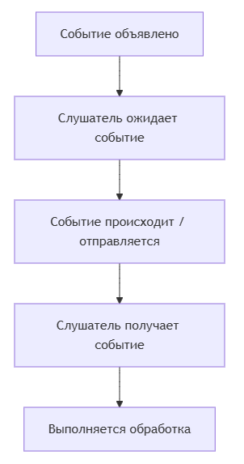

---
title: 5.01. События
---

# 5.01. События

<div class="article-tags">
  <span class="tag tag-required">ОБЯЗАТЕЛЬНО</span>
  <span class="tag tag-beginner">ДЛЯ НОВИЧКОВ</span>
  <span class="tag tag-advanced">НЕ ДЛЯ НОВИЧКОВ</span>
  <span class="tag tag-inprogress">В РАЗРАБОТКЕ</span>
</div>
<span class="complexity-badge">Разработчику</span>
<span class="complexity-badge">Архитектору</span>

## События

**Событие** — это сигнал о том, что что-то произошло. Например: пользователь кликнул по кнопке, загрузилась страница, или же вы сами «выстрелили» событие программно, чтобы уведомить другие части приложения об определённом действии.
 
Все события в JavaScript происходят в контексте DOM (Document Object Model) и передаются через объект Event, который содержит информацию о типе события, его состоянии и дополнительных данных.

Существует множество встроенных событий, которые можно использовать:
1. События мыши:
	- click — клик мышью
	- mouseover / mouseout — наведение/уход курсора
	- mousedown / mouseup — нажатие/отпускание кнопки мыши
2. Клавиатурные события:
	- keydown — нажата клавиша
	- keyup — клавиша отпущена
3. Формы:
	- submit — отправка формы
	- focus / blur — фокус на элементе / потеря фокуса
	- change — изменение значения элемента формы
4. UI-события:
	- resize — изменение размера окна
	- scroll — прокрутка страницы

Чтобы работать с событиями, нужно понять их жизненный цикл:
	- Создание события — создаётся объект события.
	- Инициация события — событие отправляется (dispatch).
	- Прослушивание события — другой код ожидает его и реагирует.

JavaScript позволяет создавать пользовательские события с помощью конструктора CustomEvent:
```JavaScript
const myEvent = new CustomEvent('myCustomEvent', {
  detail: {
    message: 'Привет! Это событие!',
    userId: 1001
  }
});
```
Отправка события:
```JavaScript
window.dispatchEvent(myEvent);
```
window используется здесь как глобальный объект, но события можно отправлять и на конкретные DOM-элементы.

Чтобы реагировать на событие, нужно добавить обработчик события с помощью метода addEventListener().

```JavaScript
window.addEventListener('myCustomEvent', (event) => {
  console.log("Получено событие:", event.type);
  const { message, userId } = event.detail;
  console.log(`Сообщение: ${message}, Пользователь ID: ${userId}`);
});
```

Важно: убедитесь, что обработчик добавлен до отправки события. Иначе он может его «не поймать».

Вы можете привязывать обработчики не только к window, но и к любым DOM-элементам:
```JavaScript
const button = document.getElementById('myButton');

button.addEventListener('click', () => {
  console.log('Кнопка нажата!');
});
```
Также можно отправлять кастомные события именно на элементы:
```JavaScript
const customClick = new CustomEvent('customClick', {
  detail: { info: 'Это наш собственный клик' }
});

button.dispatchEvent(customClick);
```
Методы:
	- addEventListener(type, handler) — добавляет обработчик
	- removeEventListener(type, handler) — удаляет обработчик
	- dispatchEvent(event) — отправляет событие

Свойства объекта event:
	- type — тип события
	- target — элемент, на котором произошло событие
	- currentTarget — элемент, на котором сработал обработчик
	- detail — данные, переданные в кастомном событии



