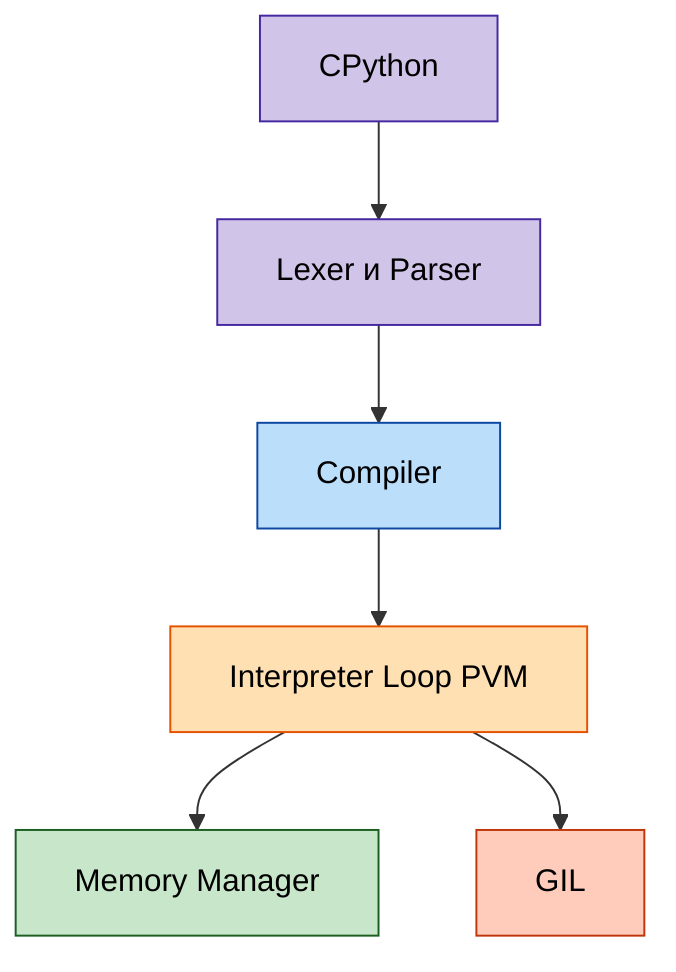
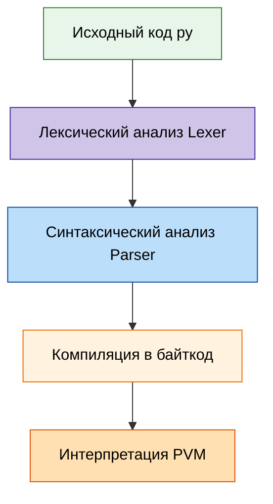

---
title: 5.02. Архитектура Python
---

# 5.02. Архитектура Python

<div class="article-tags">
  <span class="tag tag-required">ОБЯЗАТЕЛЬНО</span>
  <span class="tag tag-beginner">ДЛЯ НОВИЧКОВ</span>
  <span class="tag tag-advanced">НЕ ДЛЯ НОВИЧКОВ</span>
  <span class="tag tag-inprogress">В РАЗРАБОТКЕ</span>
</div>
<span class="complexity-badge">Разработчику</span>
<span class="complexity-badge">Архитектору</span>

## Архитектура Python

**Python** — это целая экосистема, включающая интерпретатор, систему модулей, стандартную библиотеку, менеджеры зависимостей и различные реализации.

Центральной реализацией Python является **CPython** — эталонная и наиболее распространённая реализация, написанная на C. Именно её вы скачиваете с официального сайта python.org , именно она используется в подавляющем большинстве проектов, от скриптов до масштабируемых сервисов.

Работа CPython включает следующие компоненты:
	- Lexer и Parser — разбор синтаксиса.
	- Compiler — компилятор, его задача - генерация байткода.
	- Interpreter Loop (PVM) — виртуальная машина для выполнения байткода.
	- Memory Manager — управление памятью через счётчик ссылок и сборщик мусора.
	- Global Interpreter Lock (GIL) — механизм, ограничивающий выполнение байткода одним потоком одновременно. Это ограничивает параллелизм в CPU-bound задачах, но не мешает эффективному использованию асинхронности и многопроцессорности.



---

Альтернативные реализации, такие как **PyPy** (с JIT-компиляцией), **Jython** (для JVM) и **IronPython** (.NET), предлагают другие компромиссы, но CPython остаётся стандартом де-факто.

CPython — это интерпретатор и полная система выполнения, включающая, как мы выяснили, парсер, компилятор в байт-код, виртуальную машину PVM, менеджер памяти, сборщик мусора и GIL. Давайте подробнее.

---

Процесс запуска Python-скрипта проходит через несколько этапов:





1. Лексический анализ (Lexer). На первом шаге исходный код (`*.py`) разбивается на лексемы — минимальные значимые единицы: ключевые слова, операторы, идентификаторы, строки и т.д.
Например, строка x = 5 + 3 превращается в последовательность: `[ID(x), ASSIGN, INT(5), PLUS, INT(3)]`.
2. Синтаксический анализ (Parser). Лексемы передаются парсеру, который строит абстрактное синтаксическое дерево (AST) — иерархическую структуру, отражающую логику программы. Это дерево становится основой для дальнейшей компиляции.
3. Компиляция в байткод. Из AST генерируется байткод — платформо-независимый набор инструкций, предназначенный для выполнения на виртуальной машине Python (PVM). Байткод сохраняется в файлах .pyc в папке `__pycache__`.
```python
import dis
def hello():
    return "Hello"

dis.dis(hello)
# Выход:
#   2           0 LOAD_CONST               1 ('Hello')
#               2 RETURN_VALUE

```
4. Интерпретация байткода (PVM). Байткод выполняется на Python Virtual Machine (PVM) — цикле, который читает и исполняет инструкции по одной. PVM — это часть CPython, написанная на C, и именно она обеспечивает кроссплатформенность.

Повторим: хотя Python часто называют «интерпретируемым», он всё же компилируется в байткод, что делает его гибридной системой, близкой к Java или .NET.
5. Управление памятью. Память в Python управляется автоматически:
	- Счётчик ссылок — основной механизм: каждый объект хранит количество ссылок на него. Когда оно достигает нуля, объект немедленно удаляется.
	- Сборщик мусора (GC) — дополняет систему, обнаруживая и удаляя циклические ссылки, которые счётчик не может обработать.
Объекты живут в private heap — закрытой области памяти, управляемой интерпретатором. Разработчик не имеет прямого доступа к указателям.
6. Global Interpreter Lock (GIL). GIL — это мьютекс (взаимное исключение), который гарантирует, что только один поток одновременно выполняет байткод. Это означает, что даже на многопроцессорных системах CPU-bound задачи не могут быть параллельны в рамках одного процесса.
Что это значит на практике?
	- Для I/O-bound задач (сетевые запросы, файлы, базы данных) асинхронность (async/await) и многопоточность остаются эффективными.
	- Для CPU-bound задач (расчёты, обработка массивов) необходимо использовать многопроцессорность (multiprocessing) или переходить на PyPy.

GIL является компромиссом ради простоты и производительности в типичных сценариях. Его удаление — предмет активных дискуссий (PEP 703).

Теперь вернёмся к уровню выше. Одним из ключевых преимуществ Python является его модульная архитектура, позволяющая организовывать код в повторно используемые компоненты.

Модуль — это файл с расширением .py, содержащий код: функции, классы, переменные, выражения.
```python
# math_utils.py
def add(a, b):
    return a + b

PI = 3.14159
```
Импорт:
```python
import math_utils
print(math_utils.add(2, 3))  # 5

from math_utils import PI
print(PI)  # 3.14159
```
Каждый модуль — это пространство имён (namespace). Имена модулей должны быть в стиле snake_case. При импорте модуль выполняется один раз и кэшируется в sys.modules.

Код можно организовать в иерархию через пакеты.

**Пакет** — это каталог, содержащий файл `__init__.py` (может быть пустым), который сообщает интерпретатору, что каталог является пакетом.

Структура:
```
my_package/
    __init__.py
    module_a.py
    subpackage/
        __init__.py
        module_b.py
```
Импорт:
```python
import my_package.module_a
from my_package.subpackage import module_b
```
Файл `__init__.py` может содержать код инициализации пакета, экспорт нужных сущностей через `__all__`, предварительный импорт модулей для удобства.

Python поставляется с мощной стандартной библиотекой, часто называемой «batteries included». Вот ключевые модули:

| Модуль | Назначение |
|-----|---------|
|os	|Работа с операционной системой: файлы, пути, переменные окружения.
|sys	|Доступ к параметрам интерпретатора:argv,path,exit().
|json	|Сериализация/десериализация JSON.
|csv	|Чтение и запись CSV-файлов.
|datetime	|Работа с датами и временем.
|random	|Генерация случайных чисел.
|math	|Математические функции:sin,log,sqrt.
|string	|Константы и методы для работы со строками.
|email	|Создание и разбор email-сообщений.
|http	|Работа с HTTP: клиент (client), сервер (server).
|ssl	|Поддержка SSL/TLS для безопасного соединения.
|tkinter	|Создание графических интерфейсов (GUI).

Эти модули не требуют установки и доступны в любом окружении Python.

Для управления внешними библиотеками используются менеджеры пакетов и репозитории. Их вкратце мы уже упоминали.

PyPI — Python Package Index, центральный репозиторий сторонних пакетов. Официальный сайт: pypi.org. Имеется возможность поиска через `pip search <название>`. Примеры популярных пакетов: requests, flask, numpy, pandas.

pip — утилита командной строки для установки, обновления и удаления пакетов. Работает она так:
```bash
pip install requests
pip install -r requirements.txt
pip freeze > requirements.txt
pip uninstall package_name
```
Существуют альтернативные менеджеры - conda, poetry, uv, pip-tools.

Не путайте PyPI и PyPy. PyPy - альтернатива CPython, написанная на подмножестве RPython, включающая JIT-компилятор (Just-In-Time), что даёт в 4–10 раз повышение производительности в CPU-bound задачах. Она совместима с большинством CPython-кода, однако не поддерживает все C-расширения (например, pandas работает, но медленнее).

Jython - реализация Python для JVM (Java Virtual Machine), позволяющая использовать Java-библиотеки напрямую. Нет GIL, можно использовать многопоточность Java, но отстаёт от актуальных версий Python. Как можно понять, это для интеграции с Java-системами.

IronPython - реализация для .NET Framework. Имеется интеграция с C#, ASP.NET, WPF и взаимодействие с .NET-библиотеками, для Windows-среды.

MicroPython оптимизирован для микроконтроллеров (ESP32, Raspberry Pi Pico), с минимальным объёмом памяти и поддержкой GPIO, I2C, UART. Для IoT и встраиваемых систем.
