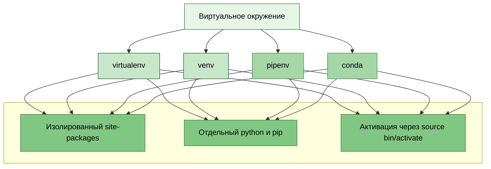
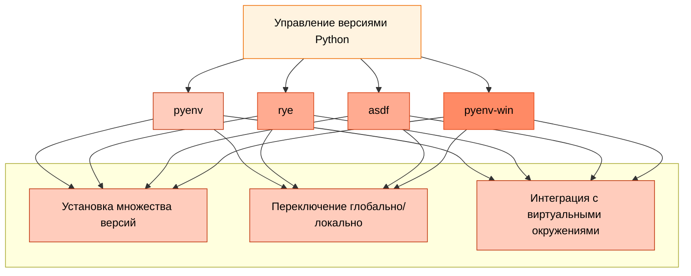

---
title: 5.02. Окружения
---

# 5.02. Окружения

<div class="article-tags">
  <span class="tag tag-required">ОБЯЗАТЕЛЬНО</span>
  <span class="tag tag-beginner">ДЛЯ НОВИЧКОВ</span>
  <span class="tag tag-advanced">НЕ ДЛЯ НОВИЧКОВ</span>
  <span class="tag tag-inprogress">В РАЗРАБОТКЕ</span>
</div>
<span class="complexity-badge">Разработчику</span>
<span class="complexity-badge">Архитектору</span>

### Окружения

Одним из ключевых аспектов профессиональной разработки на Python является корректное управление окружением — изолированной средой, в которой устанавливаются зависимости проекта. Без этого возникают конфликты между версиями библиотек, несовместимости с системными пакетами и проблемы при развёртывании (deployment). В этой главе мы подробно рассмотрим понятие окружения, его назначение и основные инструменты для его управления.

**Окружение (environment)** — это изолированная среда выполнения Python-приложения, включающая свою копию интерпретатора (или ссылку на него), отдельную директорию с установленными пакетами и независимый sys.path.

Представьте: один проект использует Django 3.2, а другой — Django 5.0. Если установить оба глобально, они перезапишут друг друга. Окружение позволяет каждому проекту иметь свои зависимости без конфликтов.

Существуют два основных типа окружений:
	- Виртуальные окружения (virtual environments) — изолируют зависимости.
	- Инструменты управления версиями Python (Python version managers) — позволяют переключаться между разными версиями самого интерпретатора.

---


Виртуальные окружения:



---

Инструменты управления версиями Python:



---

Рассмотрим основные инструменты.

1. venv — это встроенный модуль Python (начиная с версии 3.3), предназначенный для создания лёгких виртуальных окружений.
```bash
python -m venv myenv
```
Эта команда создаст директорию myenv/, содержащую:
	- bin/ (на Linux/macOS) или Scripts/ (на Windows) — исполняемые файлы (python, pip).
	- lib/ — установленные пакеты.
	- pyvenv.cfg — конфигурация окружения.

Активация производится так:
```
# Linux/macOS
source myenv/bin/activate

# Windows
myenv\Scripts\activate
```
После активации вы увидите (myenv) в командной строке — это означает, что все последующие команды pip install будут влиять только на это окружение.

Деактивация - deactivate.

2. virtualenv — сторонняя библиотека, предшественник venv. Обеспечивает те же функции, но с дополнительными возможностями. Установка:
```bash
pip install virtualenv
```
Использование:
```
virtualenv myenv
source myenv/bin/activate  # Linux/macOS
```
Для новых проектов рекомендуется использовать venv, так как он «родной». virtualenv актуален в legacy-системах.

3. pipenv — это инструмент, объединяющий pip и virtualenv в единую систему с поддержкой lock-файлов, графа зависимостей и автоматического управления окружением.

Установка:
```bash
pip install pipenv
```
Инициализация проекта:
```bash
cd myproject
pipenv install
```
Это создаст:
	- Pipfile — замена requirements.txt, содержит прямые зависимости.
	- Pipfile.lock — зафиксированные версии всех пакетов (включая транзитивные), гарантирует воспроизводимость.

Установка пакетов:
```bash
pipenv install requests        # Добавит в [packages]
pipenv install pytest --dev    # Добавит в [dev-packages]
```
Активация оболочки:
```bash
pipenv shell
```
Это автоматически активирует виртуальное окружение.

Запускать команды уже так:
```bash
pipenv run python script.py
```

4. pyenv решает другую задачу: он позволяет устанавливать и переключаться между разными версиями интерпретатора Python.

Зачем это нужно?
	- Проект A требует Python 3.8.
	- Проект B использует новейшие фичи Python 3.12.
	- Системный Python — 3.9.

pyenv позволяет иметь все три и переключаться по необходимости.

5. pyproject.toml — это конфигурационный файл, стандартизированный в PEP 518 и PEP 621, который заменяет собой комбинацию setup.py, setup.cfg, requirements.txt.
