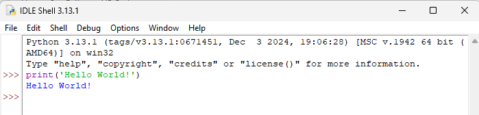

---
title: Первая программа на Python
---

# Первая программа на Python

<div class="article-tags">
  <span class="tag tag-required">ОБЯЗАТЕЛЬНО</span>
  <span class="tag tag-beginner">ДЛЯ НОВИЧКОВ</span>
  <span class="tag tag-advanced">НЕ ДЛЯ НОВИЧКОВ</span>
  <span class="tag tag-inprogress">В РАЗРАБОТКЕ</span>
</div>
<span class="complexity-badge">Разработчику</span>
<span class="complexity-badge">Архитектору</span>

## Первая программа

### Установка и настройка среды

Python является свободным программным обеспечением с открытым исходным кодом, поддерживаемым сообществом и организацией Python Software Foundation (PSF). Официальный репозиторий дистрибутивов расположен по адресу python.org . Именно с этого сайта рекомендуется загружать интерпретатор, поскольку дистрибутивы проверяются на целостность, собираются официальной командой разработчиков CPython и исключается риск загрузки модифицированных или заражённых версий интерпретатора, что возможно при использовании сторонних зеркал или пакетных менеджеров неизвестного происхождения.

Дистрибутивы доступны для всех основных платформ: Windows, macOS и большинства дистрибутивов Linux. На сайте представлены как последние стабильные версии, так и предрелизные сборки (alpha, beta, release candidates), предназначенные для тестирования. При выборе версии следует ориентироваться на актуальную стабильную ветку (на момент написания — Python 3.13.x). Версии Python 2.x официально устарели (end-of-life с 1 января 2020 года) и не должны использоваться в новых проектах.

После установки Python представляет собой комплекс программных компонентов, объединённых в единую исполняемую среду. Ниже приведено описание ключевых элементов, входящих в состав стандартной установки.

Основной компонент — интерпретатор python.exe (Windows) или python (Unix-подобные системы), реализованный на языке C и известный как CPython. Это эталонная реализация языка Python, определяющая поведение спецификации языка. Интерпретатор выполняет парсинг исходного кода (лексический и синтаксический анализ), компиляцию в байт-код, выполнение байт-кода на виртуальной машине PVM и управление памятью через сборщик мусора (garbage collector), использующий комбинацию подсчёта ссылок и циклического детектора.

Интерпретатор не является традиционным компилятором, преобразующим код в машинные инструкции напрямую. Вместо этого он работает по модели «интерпретируемый язык с компиляцией на лету»: каждый .py-файл компилируется в .pyc (байт-код), который затем выполняется PVM.

В состав дистрибутива входит IDLE (Integrated Development and Learning Environment) — простая IDE, написанная на Tkinter. Она предназначена в первую очередь для обучения и прототипирования. IDLE предоставляет интерактивную оболочку (REPL), позволяющую выполнять выражения по одному; редактор с подсветкой синтаксиса, автозавершением и возможностью отладки; возможность запуска скриптов с отображением вывода и ошибок.



Хотя IDLE не используется в профессиональной разработке из-за ограниченных возможностей, она остаётся полезным инструментом для новичков и диагностики проблем, так как не требует дополнительных зависимостей.
Одна из ключевых особенностей Python — богатая стандартная библиотека (stdlib), включающая модули для работы с файловой системой, сетью, сериализацией, многопоточностью, регулярными выражениями и т.д. Эти модули устанавливаются вместе с интерпретатором и доступны без дополнительных действий.

---

## Процесс установки

Давайте рассмотрим процесс установки.

### Windows

На Windows установка осуществляется через графический установщик (.exe). Ключевой момент - нужно отметить опцию «Add Python to PATH», чтобы интерпретатор был доступен из любого каталога через терминал. 

Установщик может автоматически использовать Microsoft Store (начиная с Python 3.9), но рекомендуется скачивать дистрибутив напрямую с python.org, чтобы иметь полный контроль над окружением. После установки создаются ярлыки на IDLE и Python (Command Line).

### macOS

Для macOS доступны два основных пути:
	- Официальный установщик от python.org — устанавливает Python в `/Library/Frameworks/Python.framework/`, что позволяет избежать конфликтов с системным Python (который используется самой macOS и может быть удалён или изменён при обновлении ОС).
	- Через пакетные менеджеры (Homebrew) — brew install python устанавливает Python в `/usr/local/bin/` (или в `~/.brew` при ARM). Этот способ удобен для управления несколькими версиями.

Системный Python (`/usr/bin/python3`) не рекомендуется модифицировать.

### Linux

На большинстве дистрибутивов Linux Python уже предустановлен, но часто в минимальной конфигурации. Для полноценной разработки необходимо установить дополнительные пакеты:
```
# Ubuntu/Debian
sudo apt install python3 python3-pip python3-venv python3-dev

# Fedora
sudo dnf install python3 python3-pip python3-virtualenv
```
Здесь:
	- python3 — интерпретатор.
	- python3-pip — менеджер пакетов.
	- python3-venv — модуль для создания виртуальных окружений.
	- python3-dev — заголовочные файлы, необходимые для компиляции расширений на C.

---

### PATH

После установки необходимо убедиться, что интерпретатор корректно добавлен в **переменную окружения PATH**. Это можно сделать, выполнив в терминале:

```bash
python --version
```

Команда должна вернуть строку вида Python 3.x.y. 

Если команда не распознаётся, это указывает на то, что Python не добавлен в PATH, либо установлен некорректно. 

>Переменная PATH — это системная переменная, содержащая список директорий, в которых операционная система ищет исполняемые файлы при вводе команды в терминале. 

При установке Python с отметкой `"Add Python to PATH"`, путь к исполняемому файлу (например, `C:\Python312\` на Windows или `/usr/local/bin/` на Unix) добавляется в этот список.

Это позволяет запускать python из любого каталога, выполнять скрипты через python script.py и использовать pip без указания полного пути. 

Также можно запустить интерактивный режим, написав python, что вызовет REPL с приглашением `>>>`, где можно выполнять Python-выражения.

---

### pip

С версии Python 3.4 pip входит в состав дистрибутива по умолчанию. Это инструмент командной строки для установки, обновления и удаления сторонних пакетов из репозитория PyPI (Python Package Index). Его наличие означает, что пользователь может сразу начать работу с внешними библиотеками.

Когда вы выполняете команду: `pip install requests`, происходит следующее:
	- pip обращается к PyPI (`https://pypi.org` ) — центральному репозиторию пакетов Python.
	- Находит последнюю совместимую версию пакета `requests` и его зависимости.
	- Скачивает архив (обычно `.whl` или `.tar.gz`).
	- Распаковывает и устанавливает файлы в директорию site-packages.

Путь к `site-packages` зависит от системы и типа установки:
	- Windows: `C:\Users\<user>\AppData\Local\Programs\Python\Python312\Lib\site-packages`
	- macOS (python.org): `/Library/Frameworks/Python.framework/Versions/3.12/lib/python3.12/site-packages`
	- Linux (system-wide): `/usr/local/lib/python3.12/site-packages`
	- Virtual environment: `<venv_dir>/lib/python3.12/site-packages`

Путь можно узнать, выполнив:
```python
import site
print(site.getsitepackages())
```
или для текущего пользователя:
```python
print(site.getusersitepackages())
```

Установка пакетов без виртуального окружения (в глобальное `site-packages`) может привести к конфликтам версий между проектами. Поэтому рекомендуется всегда использовать изолированные окружения.

---

## Выполнение кода и запуск

Существует несколько способов выполнения Python-кода. Выбор зависит от контекста: разработка, отладка, автоматизация, производственное развертывание.

### Через командную строку

**Через командную строку**:
```python
python script.py
```
Интерпретатор загружает файл, компилирует его в байт-код (сохраняя .pyc в `__pycache__/` при необходимости), и выполняет. Аргументы передаются через sys.argv.

### IDLE

В IDLE можно:
	- Написать код в редакторе и нажать F5 (Run Module) — файл сохраняется и выполняется в интерактивной оболочке.
	- Вводить команды напрямую в оболочке (REPL) — удобно для тестирования.

### Из IDE

IDE (PyCharm, VS Code и др.) предоставляют кнопку Run, которая:
	- Сохраняет файл.
	- Формирует команду запуска (возможно, с параметрами, переменными окружения, путями к интерпретатору).
	- Запускает процесс и перехватывает stdout/stderr.
	- Отображает результат в панели вывода.

### Как исполняемый файл

На Unix-подобных системах можно сделать скрипт исполняемым:
```
chmod +x script.py
```
и добавить шебанг в первую строку:
```
#!/usr/bin/env python3
```
После этого скрипт можно запускать как `./script.py`.

### Через модуль -m

Некоторые пакеты запускаются как модули:
```bash
python -m http.server 8000
```
Это вызывает `__main__.py` внутри пакета http.server.

### Онлайн-интерпретаторы

Сервисы вроде repl.it, Google Colab, Jupyter Notebook (в облаке) позволяют выполнять Python-код в браузере. 

Они используют серверные Docker-контейнеры с предустановленным Python и библиотеками. Преимущество — отсутствие необходимости локальной установки; недостаток — ограничения по ресурсам, безопасности и доступу к файловой системе.


Программировать, конечно, легче через IDE. 

---

### VS Code

**Visual Studio Code** — текстовый редактор с мощной экосистемой расширений. Для поддержки Python используется расширение Python, разрабатываемое Microsoft. Оно обеспечивает подсветку синтаксиса и автозавершение, интеграцию с отладчиком, поддержку виртуальных окружений, запуск и выполнение фрагментов кода, интеграцию с Jupiter Notebook, линтинг и форматирование.

Расширение работает следующим образом:
	- При открытии .py-файла активируется интерпретатор Python, выбранный пользователем (можно выбрать через команду Python: Select Interpreter).
	- Запускается языковой сервер (по умолчанию — Pylance), который анализирует код в фоне, строит AST (абстрактное синтаксическое дерево), предоставляет навигацию по символам, типам и рефакторинг.
	- При запуске скрипта VS Code формирует команду вида python path/to/script.py и выполняет её в интегрированном терминале.
	- Отладка осуществляется через debugpy, который запускается как отдельный процесс и взаимодействует с редактором по протоколу DAP (Debug Adapter Protocol).
	
---

## Создание программы

После установки и настройки среды разработки следующий шаг — написание и запуск первой программы. В этом разделе рассматриваются три типовых сценария, отражающих различные подходы к созданию простейшего скрипта print("Hello World!") в разных средах.

### Сценарий 1. Запуск print("Hello World!") в IDLE

1. **Запуск IDLE**.

На Windows: через меню «Пуск» найдите IDLE (Python 3.x) и запустите.

На macOS/Linux: в терминале выполните «idle3» или «`python3 -m idlelib.idle`». Откроется окно интерактивной оболочки (REPL) с приглашением `>>>`.

2. **Создание нового файла**. Чтобы написать программу, а не просто выполнить команду в REPL:
	- Перейдите в меню File → New File.
	- Откроется пустое окно редактора.

3. **Написание кода**. Введите следующую строку:
```python
print("Hello World!")
```
Это выражение вызывает встроенную функцию print, которая выводит переданную строку в поток стандартного вывода (stdout).

4. **Сохранение файла**. 
	- Выберите File → Save As…
	- Укажите имя файла, например, hello.py.
	- Убедитесь, что расширение .py присутствует.
	- Сохраните в удобное место (например, на рабочем столе).

5. **Запуск программы**. 
В меню выберите Run → Run Module (или нажмите F5). Если файл ещё не сохранён, IDLE запросит сохранение. После запуска в окне оболочки (REPL) появится:
```python
Hello World!
>>> 
```
Программа выполняется в том же процессе, что и оболочка. Переменные, определённые в скрипте, остаются доступными после завершения (если нет `if __name__ == '__main__':`).

Отладка возможна через встроенный отладчик (Debug → Debugger), но используется редко. Так, можно сказать что IDLE подходит для обучения, но не рекомендуется для сложных проектов из-за ограниченной производительности и функциональности.

### Сценарий 2. Запуск print("Hello World!") и input() в VS Code.

1. Установка необходимых компонентов. Убедитесь, что:
	- установлен Python (проверьте: python --version);
	- установлено расширение Python от Microsoft (в Marketplace: ms-python.python);
	- активирован интерпретатор (нижняя панель должна показывать выбранную версию Python).

2. Создание файла:
	- откройте директорию проекта (например, first_program);
	- создайте новый файл: Ctrl+N → Ctrl+S → укажите имя hello.py.

3. Написание кода. Введите следующий код:
```python
print("Hello World!")
input("Нажмите Enter для завершения...")
```

Функция input() останавливает выполнение программы до ввода символа (в данном случае — Enter). Это предотвращает мгновенное закрытие окна вывода при запуске.

4. **Запуск программы**.

Существует несколько способов:

**Вариант A**: Через кнопку "Run" (вверху справа). Нажмите зелёную стрелку в правом верхнем углу VS Code автоматически выполнит python /path/to/hello.py и результат отобразится в интегрированном терминале (внизу).

**Вариант B**: Через контекстное меню. Щёлкните правой кнопкой по редактору → Run Python File in Terminal, и аналогично запускается команда в терминале.

**Вариант C**: Вручную в терминале. Откройте встроенный терминал (`Ctrl+``) и выполните: «python hello.py».

Вы увидите:
```
Hello World!
Нажмите Enter для завершения...
```
После нажатия Enter программа завершится, и управление вернётся в терминал.

Если input() не работает в режиме "Run", возможно, используется консоль, не поддерживающая ввод. В этом случае следует запускать скрипт в обычном терминале.

5. **Отладка**.
Попробуйте добавить следующий код и самостоятельно его отладить:
```python
x = 1
test = "Test"

def main():
    print("Hello World!")
    y = 12
    print(y)
    input("Нажмите Enter для завершения...")
    
    

if __name__ == "__main__":
    main()
```
Поставьте точку остановы на print("Hello World!") и запустите отладку:


Точка остановы устанавливается в крайней левой части около номера строки. Красная точка означает, что точка установлена (1).
 
Слева вы можете увидеть детали отладки (2) - переменные (локальные и глобальные). В нашем случае глобальной будет x, а локальной - y.

В центре будет панель управления отладкой (3), позволяющая переходить по шагам выполнения.

---

### Сценарий 3. Создание программы как проекта в PyCharm

**PyCharm** — полнофункциональная IDE от JetBrains, ориентированная на серьёзную разработку. Она предоставляет глубокую интеграцию с Python, системой сборки, отладчиком и инструментами управления проектами.

PyCharm Community Edition бесплатен и поддерживает чистый Python. Professional Edition (платный) добавляет веб-разработку, научные библиотеки, удалённые интерпретаторы.

1. Создание нового проекта.
	- Установите и запустите PyCharm.
	- Выберите New Project и укажите тип проекта Pure Python.
	- Укажите расположение, например, ~/projects/hello_world
	- Выберите интерпретатор - установленный Python (локальный или виртуальный).
	- Нажмите Create.

PyCharm создаст структуру проекта c файлом main.py и .idea (служебный файл).

2. Редактирование кода.

Откройте main.py. 

По умолчанию он может содержать шаблон. Замените его на:
```python
def main():
    print("Hello World!")
    input("Нажмите Enter для завершения...")

if __name__ == "__main__":
    main()
```
Объяснение структуры
	- `if __name__ == "__main__":` — условие, которое истинно только при прямом запуске файла, а не при импорте как модуля.
	- `main()` — функция, содержащая логику программы. Такой стиль позволяет легко тестировать и переиспользовать код.

3. Запуск программы.

Нажмите зелёную стрелку рядом с функцией main или в правом верхнем углу. PyCharm создаст конфигурацию запуска (Run Configuration), где имя main, а скрипт main.py. Рабочей директорией будет корень проекта.

Программа запускается в панели Run, где отображается вывод:
```
Hello World!
Нажмите Enter для завершения...
```

4. Отладка (опционально):
	- Установите точку останова (щелчок слева от номера строки).
	- Нажмите Debug (зелёный жучок).
	- Программа остановится на указанной строке.
	- В нижней панели отображаются локальные переменные, стек вызовов, и возможность пошагового выполнения. 

---