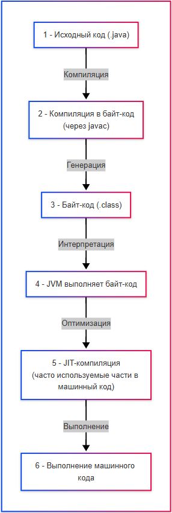

---
title: Основы языка Java
---

# Основы языка Java

<div class="article-tags">
  <span class="tag tag-required">ОБЯЗАТЕЛЬНО</span>
  <span class="tag tag-beginner">ДЛЯ НОВИЧКОВ</span>
  <span class="tag tag-advanced">НЕ ДЛЯ НОВИЧКОВ</span>
  <span class="tag tag-inprogress">В РАЗРАБОТКЕ</span>
</div>
<span class="complexity-badge">Разработчику</span>
<span class="complexity-badge">Архитектору</span>

## Как работает Java?

### Основы языка

★ **Java** – один из самых знаменитых объектно-ориентированных языков программирования, разработанный компанией Sun Microsystems, а нынче принадлежащий корпорации Oracle. 

Язык сочетает строгую типизацию, автоматическое управление памятью и кроссплатформенность за счёт выполнения байт-кода на виртуальной машине. Основная философия языка выражена в девизе «написал один раз — запускай где угодно».

Sun Microsystems создала язык в рамках проекта Green для программирования бытовой электроники. Первоначальное название проекта — Oak. Позже команда переориентировала разработку на интернет-приложения, сменив название на Java. В 2010 году корпорация Oracle приобрела Sun Microsystems вместе со всеми её активами, включая права на Java.

Oracle Corporation — американская технологическая компания, специализирующаяся на разработке программного обеспечения, баз данных и облачных решений. После приобретения Sun Microsystems Oracle стала владельцем платформы Java, определяет стратегию развития языка и выпускает официальные дистрибутивы.

После изучения этой главы обязательно почитайте документацию Java, через официальный сайт - https://docs.oracle.com/en/java/, а также OpenJDK - https://openjdk.org/. Может пригодится также https://metanit.com/java и рубрика Java на Хабре.

Чит-лист - https://cheatsheets.zip/java

---

### Состав дистрибутива Java

Дистрибутивы Java поставляются в трёх основных вариантах:

**JDK (Java Development Kit)** — полный комплект разработчика. Включает:
- Компилятор javac для преобразования исходного кода в байт-код
- Виртуальную машину JVM для выполнения байт-кода
- Стандартные библиотеки классов (java.lang, java.util, java.io и другие)
- Отладчик jdb
- Утилиты для работы с архивами (jar), документацией (javadoc), профилированием
- Заголовочные файлы для нативной разработки

**JRE (Java Runtime Environment)** — среда выполнения. Содержит:
- Виртуальную машину JVM
- Стандартные библиотеки классов
- Поддержку безопасности и локализации
- Ресурсы для запуска готовых приложений

**JVM (Java Virtual Machine)** — программная машина, выполняющая байт-код Java. Состоит из:
- Загрузчика классов (Class Loader), отвечающего за поиск и загрузку .class-файлов
- Области памяти: кучи (Heap) для объектов, стека (Stack) для вызовов методов, метод-области (Method Area) для метаданных классов
- Механизма выполнения: интерпретатора для построчного выполнения и JIT-компилятора
- Сборщика мусора (Garbage Collector) для автоматического освобождения памяти
- Системы безопасности с проверкой байт-кода и управлением правами

Каждая операционная система имеет собственную реализацию JVM. Oracle предоставляет официальные сборки для Windows, Linux, macOS. Альтернативные реализации включают OpenJDK (открытое ядро), Adoptium, Amazon Corretto, Azul Zulu.

При установке дистрибутива Java создаётся корневая директория, содержащая подкаталоги:

- `bin` — исполняемые файлы (`java`, `javac`, `jar`, `jdb`)
- `lib` — библиотеки платформы
- `jmods` — модули для компиляции собственных runtime
- `conf` — конфигурационные файлы
- `legal` — лицензионная информация

Типичные пути установки:
- Windows: `C:\Program Files\Java\jdk-21`
- Linux: `/usr/lib/jvm/java-21-openjdk`
- macOS: `/Library/Java/JavaVirtualMachines/jdk-21.jdk/Contents/Home`

Для глобального использования команд java и javac требуется настроить переменную PATH. Пример для Linux/macOS в файле ~/.bashrc или ~/.zshrc:

```bash
export JAVA_HOME=/usr/lib/jvm/java-21-openjdk
export PATH=$JAVA_HOME/bin:$PATH
```

После изменения требуется перезагрузить оболочку или выполнить:

```bash
source ~/.bashrc
```

Проверка установки:

```bash
java -version
javac -version
```

Переменная JAVA_HOME используется сборочными системами (Maven, Gradle) и серверами приложений для определения расположения JDK.


---

### Как работает Java

Java представляет собой компилируемый язык программирования. Программа требует чёткой организации файлов и каталогов. Минимальная структура проекта:

```
my-project/
├── src/
│   └── main/
│       └── java/
│           └── com/
│               └── example/
│                   └── HelloWorld.java
├── bin/
│   └── com/
│       └── example/
│           └── HelloWorld.class
└── lib/
    └── dependencies.jar
```

Каждый класс размещается в файле с именем, совпадающим с именем класса. Каталоги отражают пакетную структуру. Например, класс `com.example.HelloWorld` должен находиться в файле `src/main/java/com/example/HelloWorld.java`.

Компиляция с сохранением структуры пакетов:

```
javac -d bin src/main/java/com/example/HelloWorld.java
```

Флаг `-d` указывает корневую директорию для размещения скомпилированных классов с сохранением иерархии пакетов.

Проект Java включает:

- Исходные файлы (.java) с реализацией классов и интерфейсов
- Ресурсы: конфигурации, шаблоны, статические файлы
- Файлы сборки: pom.xml для Maven или build.gradle для Gradle
- Описание зависимостей: перечень библиотек и их версий
- Скрипты запуска и развёртывания
- Документация в формате Javadoc
- Тесты в отдельной директории src/test/java

Современные проекты используют системы сборки для автоматизации компиляции, управления зависимостями и упаковки.

Для запуска программы требуется только наличие совместимой JVM на целевой платформе. Это позволяет запускать один и тот же скомпилированный код на разных операционных системах без перекомпиляции.

> Виртуальная машина Java — программная платформа, выполняющая байт-код независимо от операционной системы.

Программы на Java транслируются в байт-код Java, выполняемый **виртуальной машиной Java – JVM**. Таким образом, процесс в Java таков:
1. Исходный код пишется программистом и сохраняется в формате .java;
2. Исходный код (.java) компилируется в байт-код (.class) с помощью javac;
3. JVM запускает байт-код и интерпретирует его построчно.
4. JIT-компиляция - часто используемые части кода компилируются в машинный код.
5. Процессор выполняет машинный код.

Упакованный исполняемый файл генерируется в формате **.jar**. Он включает в себя **.class** и **ресурсы**. 



Файл с расширением .jar (Java ARchive) представляет собой архив в формате ZIP, содержащий:
- Скомпилированные классы (.class)
- Ресурсы: изображения, конфигурационные файлы, шрифты
- Метаданные в каталоге META-INF/, включая манифест MANIFEST.MF
- Зависимости и вложенные библиотеки

Манифест определяет точку входа приложения через атрибут Main-Class. Пример содержимого манифеста:

```
Manifest-Version: 1.0
Main-Class: com.example.MainApplication
Class-Path: lib/dependency1.jar lib/dependency2.jar
```

Архивы JAR упрощают распространение приложений. Для запуска используется команда:

```
java -jar приложение.jar
```

JIT-компиляция повышает производительность выполнения. Виртуальная машина отслеживает частоту вызова методов и участков кода. Горячие участки (hot spots) компилируются в нативный машинный код процессора. Результат кэшируется для повторного использования. Современные JVM используют адаптивную оптимизацию: чем чаще выполняется код, тем агрессивнее применяются оптимизации. Это позволяет достичь производительности, близкой к нативным языкам вроде C++.


---

### Возможности Java

Какие возможности предоставляет Java?
	- *писать программы, которые могут работать автономно, без необходимости переписывать логику под разные платформы*;
	- *создание игр, движков, IDE, утилит, билд-систем и других технически сложных продуктов*;
	- *строить сервисы, обрабатывающие тысячи запросов в секунду, такие как онлайн-магазины, платежные шлюзы, транспортные системы*;
	- *разрабатывать ERP, CRM, HRM, банковские системы, где важна надёжность и долгосрочная поддержка*;
	- *реализации бизнес-логики, алгоритмов обработки данных, аналитики, правил, проверок и других процессов, требующих точности и структуры*;
	- *обрабатывать большие объёмы информации благодаря оптимизациям JVM и богатым коллекциям*;
	- *создавать защищённые окружения для выполнения кода, особенно важное свойство в корпоративных и облачных системах*;
	- *выполнять несколько задач одновременно, используя все доступные ресурсы процессора*;
	- *взаимодействовать с базами данных, файлами, сетью, API, датчиками, внешними библиотеками*;
	- *разделение кода на модули, библиотеки, фреймворки, что позволяет строить сложные архитектуры с чёткими границами ответственности*;
	- *находить ошибки ещё на этапе компиляции, повышая надёжность и предсказуемость кода*;
	- *автоматическое освобождение памяти, что снижает риск утечек и ошибок управления ресурсами*.
	
	
<div class="callout callout--tip">
  <div class="callout-title">Интересный факт</div>
В начале 90-х годов группа инженеров в Sun Microsystems начала проект под названием Green Project с целью создать язык для умных бытовых устройств. Но рынок электроники был не готов. И вместо этого они адаптировали язык под интернет, сделав его безопасным, в отличие от C++.
</div>

---

### Компоненты Java


★ **Основные компоненты Java**:
	- JDK (Java Development Kit) – набор инструментов для разработки (компилятор, JVM, библиотеки);
	- JRE (Java Runtime Environment) – набор инструментов для запуска программ (JVM + стандартные библиотеки);
	- JVM (Java Virtual Machine) – виртуальная машина, выполняющая байт-код.
	- javac – компилятор, который превращает .java в .class.

Компиляция одного файла:

```
javac HelloWorld.java
```

Результат — файл HelloWorld.class в той же директории.

Компиляция с указанием выходной директории:

```
javac -d bin src/com/example/HelloWorld.java
```

Компиляция нескольких файлов:

```
javac src/com/example/*.java
```

Компиляция с зависимостями из JAR-архивов:

```
javac -cp "lib/*" src/com/example/App.java
```

После компиляции запуск программы:

```
java -cp bin com.example.HelloWorld
```

---

### Особенности синтаксиса

★ **Синтаксис Java** отличается явным объявлением типов, а сам язык является объектно-ориентированным (углубимся позднее). Основные черты синтаксиса:

| Особенность | Пример |
|-----|---------|
|Объявление переменной	|`int age = 25;`
|Метод	|`public void greet() { System.out.println("Hello"); }`
|Условия	|`if (age > 18) { ... }`
|Циклы	|`for (int i = 0; i < 5; i++) { ... }`
|Классы и объекты	|`class Person { }, Person p = new Person();`
|Интерфейсы	|`interface Runnable { void run(); }`
|Обобщения	|`List<String> names = new ArrayList<>();`

Каждая программа на Java состоит из классов и методов. Минимальная программа на Java **должна** иметь **один класс** и **метод main**. Java требует, чтобы каждая программа была внутри класса. Имя файла должно совпадать с именем публичного класса.
```java
public class HelloWorld {
    public static void main(String[] args) {
        System.out.println("Привет, мир!");
    }
}
```

---

### Метод main

★ **Метод main** – точка входа в любую программу Java. Именно с него начинается выполнение программы.

> Точка входа — метод, с которого начинается выполнение программы. 

Синтаксис:
```java
public static void main(String[] args) {
    // код программы
}
```

Как можно заметить, у метода main есть ряд ключевых слов:
	- `public` – метод доступен извне;
	- `static` – метод может быть вызван без создания объекта;
	- `void` – не возвращает значение;
	- `String[] args` – параметры командной строки.

Пример минимальной программы:

```java
public class Application {
    public static void main(String[] args) {
        System.out.println("Запуск приложения");
        if (args.length > 0) {
            System.out.println("Первый аргумент: " + args[0]);
        }
    }
}
```

Запуск с аргументами:

```
java com.example.Application привет мир
```

В массиве `args` будут строки `"привет"` и `"мир"`.

---


### Библиотеки

★ **Библиотеки в Java** – преднастроенные модули, расширяющие функциональность Java. Они могут быть частью JDK или сторонними.

Библиотеки в Java поставляются в виде JAR-файлов. Подключение выполняется через:

**Ручное управление:**
1. Скачивание JAR-файла с официального сайта или репозитория
2. Размещение в директории `lib/` проекта
3. Указание в classpath при компиляции и запуске:

```
javac -cp "lib/*:bin" src/com/example/App.java
java -cp "lib/*:bin" com.example.App
```

**Системы сборки:**
Maven использует файл `pom.xml`:

```xml
<dependencies>
    <dependency>
        <groupId>com.google.code.gson</groupId>
        <artifactId>gson</artifactId>
        <version>2.10.1</version>
    </dependency>
</dependencies>
```

Gradle использует `build.gradle`:

```gradle
dependencies {
    implementation 'com.google.code.gson:gson:2.10.1'
}
```

Системы сборки автоматически загружают зависимости из центрального репозитория Maven Central и разрешают транзитивные зависимости.

Стандартные библиотеки (входят в JDK):

| Группа | Что включает |
|-----|---------|
|java.lang	|Базовые классы (Object, String, Math)
|java.util	|Коллекции (List, Map, Set), даты, генератор случайных чисел
|java.io / java.nio	|Работа с файлами и потоками
|java.net	|Работа с сетью
|java.time	|Новые даты и время (с Java 8+)
|javax.swing / java.awt	|Графические интерфейсы
|java.sql	|Работа с базами данных через JDBC

Примеры сторонних библиотек:

| Название | Назначение |
|-----|---------|
|Apache Commons	|Утилиты для работы со строками, коллекциями, IO и др.
|Guava (Google)	|Расширения стандартных возможностей
|Jackson / Gson	|Работа с JSON
|Log4j / SLF4J	|Логирование
|Lombok	|Автоматизация геттеров, сеттеров, конструкторов
|OkHttp / Retrofit	|HTTP-запросы
|RxJava	|Реактивное программирование
|Joda-Time	|Альтернатива java.util.Date (до Java 8)

---


### Фреймворки

Фреймворки подключаются аналогично библиотекам — через системы управления зависимостями. Например, подключение Spring Boot в Maven:

```xml
<parent>
    <groupId>org.springframework.boot</groupId>
    <artifactId>spring-boot-starter-parent</artifactId>
    <version>3.2.0</version>
</parent>

<dependencies>
    <dependency>
        <groupId>org.springframework.boot</groupId>
        <artifactId>spring-boot-starter-web</artifactId>
    </dependency>
</dependencies>
```

Фреймворк предоставляет готовую архитектуру, шаблоны проектирования и инструменты для ускорения разработки. Приложение наследует структуру и правила фреймворка, реализуя только бизнес-логику.


★ **Фреймворки в Java** – готовые архитектурные решения, которые упрощают разработку приложений. В Java существуют множество популярных фреймворков для разных задач:

| Название | Назначение |
|-----|---------|
|Spring	|Полный набор решений для enterprise-приложений (Spring Boot, Spring MVC, Spring Security, Spring Data и др.)
|Hibernate / JPA	|ORM (объектно-реляционное отображение), работа с БД
|Vaadin / JavaFX	|Разработка GUI-приложений
|Apache Struts / Play Framework	|Web-разработка
|Micronaut / Quarkus	|Легковесные фреймворки для микросервисов и облачных приложений
|JUnit / TestNG	|Юнит-тестирование
|Jakarta EE / Jakarta EE 9+	|Платформа для корпоративной разработки (ранее Java EE)

---

### Инструменты

★ **Инструменты в Java** – специальные средства для разработки, сборки, тестирования и деплоя (развёртывания):

| Инструмент | Назначение |
|-----|---------|
|JDK (Java Development Kit)	|Комплект разработчика, включающий компилятор, JVM, библиотеки
|JRE (Java Runtime Environment)	|Среда выполнения, содержит JVM и стандартные библиотеки
|JVM (Java Virtual Machine)	|Виртуальная машина, которая выполняет Java-байткод
|IDE (IntelliJ IDEA, Eclipse, NetBeans)	|Интегрированные среды разработки
|Maven / Gradle	|Системы управления зависимостями и сборки проекта
|JUnit / Mockito	|Инструменты для тестирования
|SonarQube	|Анализ качества кода
|Docker / Kubernetes	|Контейнеризация и оркестрация микросервисов
|Tomcat / Jetty / WildFly	|Серверы приложений для запуска Java-веб-приложений

---

### Применение Java

★ **Сфера применения**

Java – универсальный язык, и применяется во множестве областей:

| Сфера | Примеры |
|-----|---------|
|Backend-разработка	|Серверные приложения, REST API, микросервисы
|Android-разработка	|Приложения для мобильных устройств
|Web-приложения	|Сервлеты, JSP, JSF, Spring MVC
|Корпоративные системы (Enterprise)	|Банки, страховые компании, ERP-системы
|Big Data & Analytics	|Apache Hadoop, Spark, Flink
|Научные вычисления и моделирование	|Распределённые вычисления, численные методы
|Игры	|Minecraft
|IoT (Интернет вещей)	|Устройства с ограниченными ресурсами, управление датчиками
|Облачные сервисы	|AWS, Google Cloud, Azure поддерживают Java-сервисы

Учитывая, что Java при появлении сразу сделал акцент на безопасности, за него сразу «ухватился» почти весь финансовый сектор, и поэтому в серьёзных организациях, в том числе сфере финтеха, можно встретить многолетние тонны кода на Java.

<div class="callout callout--tip">
  <div class="callout-title">Интересный факт</div>
Изначально язык назывался Oak (Дуб) – в честь дерева, которое росло за окном Джеймса Гослинга, но позднее выяснилось, что Oak уже зарегистрирован торговой маркой другой компании. Название выбрали заново, прогуливаясь возле кафе – кто-то пил кофе «Ява», и название всплыло само собой – Java. 
</div>

---