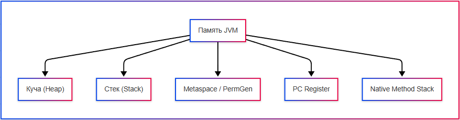

---
title: 5.03. JVM, память и потоки
---

# 5.03. JVM, память и потоки

<div class="article-tags">
  <span class="tag tag-required">ОБЯЗАТЕЛЬНО</span>
  <span class="tag tag-beginner">ДЛЯ НОВИЧКОВ</span>
  <span class="tag tag-advanced">НЕ ДЛЯ НОВИЧКОВ</span>
  <span class="tag tag-inprogress">В РАЗРАБОТКЕ</span>
</div>
<span class="complexity-badge">Разработчику</span>
<span class="complexity-badge">Архитектору</span>

## JVM, память и потоки

★ **JVM – виртуальная машина**, которая загружает, интерпретирует и выполняет байт-код. Она обеспечивает платформенную независимость. Разные ОС имеют разные реализации JVM, но байт-код остаётся одинаковым.

**JIT (Just-In-Time) компилятор** — это компонент JVM, который компилирует байт-код в машинный код непосредственно во время выполнения программы, а не до старта приложения. Его задача — улучшить производительность, оптимизируя код, исходя из реальных условий работы программы. 

JIT компилирует только те части кода, которые реально исполняются, и может применять различные оптимизации для ускорения работы приложения.

 Это позволяет сочетать гибкость интерпретируемого байт-кода и производительность нативного кода.
 
JVM делит память на несколько логических частей (областей):
	- Куча (Heap) – хранение объектов Java;
	- Стек (Stack) – хранение локальных переменных и вызовов методов;
	- Metaspace / PermGen – хранение метаданных классов, методов, полей;
	- PC Register – указывает текущую выполняемую инструкцию для каждого потока;
	- Native Method Stack – для выполнения native-методов (например, C/C++).



★ **Куча** – это основная область памяти для хранения объектов. Управление памятью здесь осуществляется сборщиком мусора (Garbage Collector). 

Куча делится на:
	- Young Generation (Eden, Survivor);
	- Old Generation.

Таким образом, создавая объект через new, объект создаётся в куче.

У каждого потока есть свой собственный стек. Стек содержит локальные переменные и вызовы методов (в виде фреймов). После выхода из метода стек автоматически очищается. К примеру, создавая метод и переменную внутри метода, переменная будет храниться в стеке.

**Пул строк** — это специальная область памяти в heap, где хранятся уникальные строковые литералы. При создании строки через String s = "hello", JVM проверяет, есть ли уже такая строка в пуле. Если есть, то возвращается ссылка на существующий объект, если нет, то создаётся новый и добавляется в пул.

Это экономит память и ускоряет сравнение строк с помощью ==, так как строки из пула имеют одинаковую ссылку. Для добавления строки в пул вручную используют метод intern().

★ **Metaspace** заменил PermGen в Java 8+. Хранит описание классов, статические данные и методы. Располагается в native-памяти, а не в куче. В отличие от PermGen, Metaspace может динамически расширяться.

Java автоматически управляет выделением и освобождением памяти через **сборщик мусора (Garbage Collector)**. Когда объект становится недостижим (нет ссылок на него), он помечается как «мусор». И GC периодически освобождает память.

Таким образом, объект проходит свой жизненный цикл.

★ **Жизненный цикл объекта**:
1. Создание: new Object();
2. Использование: вызов методов, работа с полями;
3. Неиспользуемый: нет активных ссылок;
4. Кандидат на удаление: GC помечает его;
5. Удалён: память освобождается.

Когда выполняется какое-то действие, оно выполняется в потоке. Java поддерживает многопоточность – способность выполнять несколько потоков одновременно. Это обеспечивает повышение производительности (особенно на многоядерных процессорах), улучшение пользовательского опыта (фоновые задачи), эффективную обработку параллельных задач.

★ **Как создать поток?**
Есть два основных способа – наследование от Thread и реализация Runnable:

1. Наследование от Thread:
```java
class MyThread extends Thread {
    public void run() {
        System.out.println("Поток запущен");
    }
}

MyThread t = new MyThread();
t.start(); // запускает новый поток
```
2. Реализация Runnable:
```java
class MyRunnable implements Runnable {
    public void run() {
        System.out.println("Поток запущен");
    }
}

Thread t = new Thread(new MyRunnable());
t.start();
```
Предпочтительнее использовать Runnable, так как это позволяет разделить логику и поток.

Таким образом, благодаря многопоточности, мы можем использовать несколько ядер, а приложения не будут зависать во время долгих операций.

Потоки тоже имеют свой жизненный цикл из состояний:
	- New – создан, но ещё не запущен;
	- Runnable – готов к выполнению или уже выполняется;
	- Blocked / Waiting – ожидает завершения другого потока или блокировки;
	- Timed Waiting – ожидает ограниченное время (например, sleep());
	- Terminated – завершил работу.

При работе с общими ресурсами могут возникнуть проблемы: гонки данных, неконсистентность состояния. Решение – синхронизация.
Синхронизированный метод:
```java
public synchronized void increment() {
    count++;
}
```
Синхронизированный блок:
```java
synchronized (lockObject) {
    count++;
}
```
Синхронизировать можно класс - synchronized(MyClass.class), при этом блокировка класса влияет на все экземпляры этого класса.

А можно объект - synchronized(this).

**Важно**: Поток — это не процесс. Процесс имеет собственное адресное пространство, тогда как поток делит память с другими потоками. Потоки переключаются быстрее, но поток зависит от процесса.

**Java Memory Model (JMM)** — это набор правил, определённых в спецификации языка Java, которые описывают как потоки видят изменения переменных, сделанные другими потоками, когда изменения в памяти одного потока становятся видимыми другим и в каком порядке операции чтения/записи могут быть переупорядочены (компилятором, JVM, процессором).

У каждого потока есть своя локальная копия переменных (в кэше CPU или регистрах), все работают напрямую с общей оперативной памятью. Без JMM один поток может изменить переменную, а другой — никогда не увидеть это изменение, потому что читает старое значение из своего кэша. JMM решает эту проблему, давая гарантии согласованности при многопоточной работе.

Без модели памяти программы вели бы себя по-разному на разных платформах (Intel, ARM и т.д.), оптимизации компилятора могли бы сломать логику и невозможно было бы писать надёжные многопоточные приложения. JMM даёт предсказуемость: если правильно использовать synchronized, volatile, final, java.util.concurrent, то программа будет работать одинаково на всех JVM.

**Видимость (Visibility)** подразумевает, что изменение переменной в одном потоке должно становиться видимым другим потокам.
```java
// Без volatile — второй поток может никогда не увидеть изменения!
volatile boolean flag = false;

// Поток 1
flag = true;

// Поток 2
while (!flag) {
  // Может выполняться вечно, если нет volatile!
}
```
volatile гарантирует, что запись в переменную сразу попадает в основную память, а чтение всегда идёт из основной памяти, а не из кэша.

**Упорядоченность (Ordering)** это следующий аспект JMM. Компилятор и процессор могут переупорядочивать операции для оптимизации. Но JMM говорит: некоторые операции нельзя переставлять без потери корректности. Пример:
```java
int a = 0;
boolean ready = false;

// Поток 1
a = 42;           // 1
ready = true;     // 2 ← может быть выполнено ДО 1!

// Поток 2
if (ready) {
  System.out.println(a); // Может вывести 0 вместо 42!
}
```
Решение: использовать synchronized, volatile, или happens-before связи.

happens-before - ключевое понятие в JMM. Говорят, что операция A happens-before операции B — значит, A гарантированно видна и упорядочена перед B.

Примеры happens-before:
	- Внутри одного потока: код выполняется по порядку.
	- При выходе из synchronized блока → все изменения видны тому, кто войдёт в этот блок.
	- Запись в volatile переменную happens-before чтения этой переменной.
	- Запуск потока: действия в родительском потоке happen-before старту дочернего.
	- Завершение потока: его действия happen-before .join() в другом потоке.

Это механизм, который делает многопоточный код предсказуемым.

Похожий механизм есть в C# - называется он **.NET Memory Model**, поддерживает volatile, lock, Interlocked, MemoryBarrier. Также есть happens-before -подобные правила.

