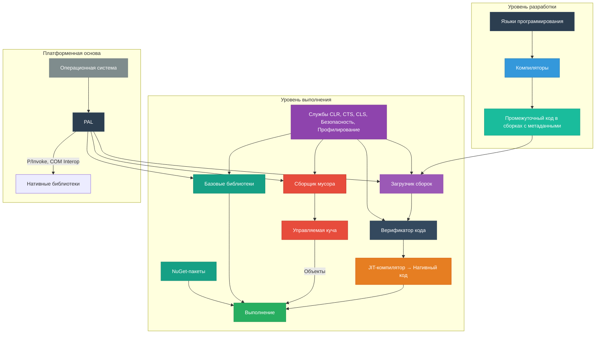

---
title: Архитектурные особенности .NET
---

# Архитектурные особенности .NET

<div class="article-tags">
  <span class="tag tag-required">ОБЯЗАТЕЛЬНО</span>
  <span class="tag tag-beginner">ДЛЯ НОВИЧКОВ</span>
  <span class="tag tag-advanced">НЕ ДЛЯ НОВИЧКОВ</span>
  <span class="tag tag-inprogress">В РАЗРАБОТКЕ</span>
</div>
<span class="complexity-badge">Разработчику</span>
<span class="complexity-badge">Архитектору</span>

## Архитектурные особенности .NET

Платформа .NET представляет собой целостную экосистему программных абстракций, обеспечивающих выполнение приложений в условиях строгой типизации, управляемого выполнения и кроссплатформенной переносимости. Её архитектура строится вокруг нескольких ключевых принципов: **платформенная независимость**, **языковая интероперабельность**, **безопасность выполнения**, **автоматизация управления ресурсами** и **модульность компонентов**. Ниже подробно раскрываются основные составляющие этой архитектуры, начиная с исторического и концептуального контекста и заканчивая механизмами низкоуровневого выполнения.



### Кроссплатформенность и переход к открытому программному обеспечению

Изначально платформа .NET была разработана корпорацией Microsoft как проприетарное решение, ориентированное исключительно на операционные системы семейства Windows. Первая версия, .NET Framework 1.0, появилась в 2002 году и включала в себя среду выполнения Common Language Runtime (CLR), базовую библиотеку классов (Base Class Library, BCL) и средства разработки. В течение следующих пятнадцати лет платформа развивалась эволюционно, но оставалась привязанной к Windows. Эта ограничивающая зависимость препятствовала широкому распространению .NET в областях, где доминировали Unix-подобные системы — например, веб-хостинг, облачные сервисы и высокопроизводительные вычисления.

Переломный момент наступил в 2014 году, когда Microsoft анонсировала проект .NET Core — полностью переписанную, модульную и кроссплатформенную реализацию .NET. Отличие .NET Core от классического .NET Framework заключалось в способности работать под Linux и macOS и в принципах построения: вместо монолитной установки использовалась система self-contained и framework-dependent деплоя, вместо глобального реестра зависимостей — локальные пакеты NuGet, вместо строгой привязки к версиям ОС — независимая модель обновлений. В 2016 году вышла первая стабильная версия .NET Core 1.0, а уже в 2019 году Microsoft официально объявила о прекращении поддержки .NET Framework как основной линейки развития и переходе на единую платформу — просто **.NET**, начиная с версии 5.0.

С тех пор платформа стала полностью open-source. Исходные коды основных компонентов — включая рантайм, компиляторы, базовые библиотеки и инструменты CLI — доступны в репозиториях под лицензией MIT на GitHub. Это не просто формальная открытость: сообщество активно участвует в обсуждении архитектурных решений через спецификации (например, ECMA-335 для CLI), внесении изменений, аудите кода и тестировании. Например, критически важные части рантайма, такие как сборщик мусора или JIT-компилятор, теперь проходят внешний ревью и дорабатываются как корпоративными командами, так и независимыми экспертами.

Кроссплатформенность достигается за счёт чёткого разделения *уровня абстракции* и *уровня реализации*. На уровне абстракции задаются интерфейсы компонентов, форматы файлов, семантика выполнения и правила взаимодействия. На уровне реализации — создаются специфичные для ОС модули: например, *PAL (Platform Abstraction Layer)* обеспечивает единообразный доступ к системным вызовам, будь то `CreateProcess` в Windows или `fork`/`exec` в Linux. Именно это позволяет одной и той же скомпилированной программе, написанной на C# или F#, исполняться без перекомпиляции на разных операционных системах, сохраняя при этом высокую степень совместимости поведения.

---

### .NET Standard

До появления .NET Core разработчики сталкивались с фрагментацией экосистемы: существовали .NET Framework (Windows), Xamarin (мобильные приложения), Unity (игровые движки), а также Silverlight и другие узкоспециализированные реализации. Каждая из них предоставляла собственную версию базовой библиотеки классов, зачастую с различным набором доступных API. Это делало невозможным написание одной библиотеки, которая бы работала везде без условной компиляции или дублирования кода.

Для решения этой проблемы была введена спецификация **.NET Standard**. Это не исполняемая платформа и не реализация — это *договорённость о минимальном наборе API*, которые должны поддерживаться любой совместимой реализацией .NET. Формально, .NET Standard — это список интерфейсов, классов и членов, сгруппированных по версиям (от 1.0 до 2.1). Чем выше версия, тем больше API включено. Например, .NET Standard 2.0 включает более 32 тысяч API и обеспечивает практически полную совместимость с .NET Framework 4.6.1, в то время как .NET Standard 1.0 содержит лишь базовые типы, подходящие для ограниченных сред вроде микроконтроллеров.

Механизм работает следующим образом: библиотека, скомпилированная под определённую версию .NET Standard (например, `netstandard2.0`), может быть использована в любой среде, заявившей совместимость с этой версией: .NET Core 2.0+, .NET 5+, Xamarin.iOS, Xamarin.Android, Unity (начиная с версии 2018.1) и другие. При этом конкретная реализация подставляет *собственную* реализацию заявленных API, оптимизированную под свою платформу.

Однако .NET Standard имеет свои ограничения. Во-первых, он не включает *все* API — только те, которые могут быть реализованы везде. Например, Windows-специфичные интерфейсы (COM, WPF, WinForms) в него не входят. Во-вторых, начиная с .NET 5, Microsoft рекомендует напрямую целиться в конкретные платформы (`net5.0`, `net6.0`, `net8.0`, `net9.0`), поскольку унификация достигла уровня, при котором различия между реализациями минимизированы. .NET Standard 2.1 остаётся актуальным только для совместимости с Xamarin и Unity, где переход на .NET 6+ ещё не завершён. Таким образом, .NET Standard сыграл важную роль в переходный период фрагментации, но сегодня уступает место единым целевым платформам.

---

### Эволюция версий .NET

Понимание архитектуры .NET невозможно без хронологического контекста, поскольку многие текущие решения — это результат многолетней итеративной оптимизации.

- **.NET Framework (2002–2019)**  
  Первая реализация платформы. Включала в себя:  
  - *CLR* (Common Language Runtime) — среду выполнения с JIT, GC и системой безопасности.  
  - *FCL* (Framework Class Library) — монолитную библиотеку, включающую базовые типы (коллекции, потоки, ввод-вывод) и высокоуровневые компоненты (ASP.NET Web Forms, Windows Forms, WPF, WCF, Workflow Foundation).  
  - Глубокую интеграцию с Windows: доступ к реестру, COM-взаимодействие, поддержка Windows Identity, служб и т.д.  
  Обновления поставлялись через Windows Update или отдельные инсталляторы и были привязаны к ОС. Совместное существование нескольких версий (2.0, 3.5, 4.x) в одной системе было возможно, но сопровождалось сложностями развертывания.

- **.NET Core (2016–2020)**  
  Полностью новая реализация, сфокусированная на производительности, модульности и кроссплатформенности:  
  - *CoreCLR* — облегчённая и оптимизированная версия CLR с улучшенным GC и JIT (RyuJIT).  
  - *CoreFX* — модульная базовая библиотека, поставляемая через NuGet.  
  - Поддержка Linux, macOS, Docker.  
  - Self-contained deployment: приложение включает в себя свой код и необходимые части рантайма, что исключает необходимость предварительной установки глобальной среды.  
  - Независимый цикл выпуска: новые версии каждые 12 месяцев, с LTS-ветками (Long-Term Support) каждые 2–3 года (например, 3.1, 6.0, 8.0).  
  - Отказ от устаревших технологий: Web Forms, WCF (серверная часть), Remoting, AppDomains (в классическом понимании), CAS (Code Access Security).

- **.NET 5 и выше (с 2020 года)**  
  Начиная с 5.0, Microsoft объединила .NET Core, Xamarin и Mono под единым именем **.NET**. Это техническое слияние:  
  - Единая кодовая база (рантайм, библиотеки, инструменты).  
  - Единая система целевых моникеров (Target Framework Monikers, TFM): `net5.0`, `net6.0`, `net8.0`, `net9.0`.  
  - Поддержка всех типов приложений: веб (ASP.NET Core), десктоп (WinForms, WPF — только под Windows), мобильные (MAUI), микросервисы, облачные функции, IoT, игры (через Unity).  
  - Непрерывное улучшение производительности: сокращение времени запуска, уменьшение потребления памяти, оптимизация GC для краткосрочных задач (например, в serverless-сценариях).  
  - Унификация инструментария: `dotnet` CLI заменяет собой `msbuild`, `nuget`, `dnx`, `xbuild` и другие утилиты.  

На момент 2025 года актуальная LTS-версия — .NET 10. Стратегия Microsoft заключается в сохранении обратной совместимости на уровне *бинарного контракта*: сборка, скомпилированная под `net6.0`, будет загружена и выполнена в среде .NET 9 без повторной компиляции, при условии, что она не использует устаревшие или удалённые API.

---

### Общая архитектурная модель

Архитектура .NET строится поверх стандарта **CLI (Common Language Infrastructure)** — международного стандарта, опубликованного ECMA (ECMA-335) и ISO/IEC (ISO/IEC 23271). Этот стандарт не привязан к конкретной реализации, языку или операционной системе. Он определяет *формальную модель выполнения*, включающую:

- формат исполняемых файлов (PE/COFF с дополнительными метаданными),  
- промежуточный язык (CIL, ранее называвшийся MSIL),  
- правила типизации и именования,  
- контракты взаимодействия компонентов,  
- модель безопасности и загрузки.

**CLR (Common Language Runtime)** — это *реализация* CLI, предоставляемая платформой .NET. Именно CLR отвечает за загрузку сборок, проверку их корректности, управление памятью, выполнение кода и обеспечение изоляции между приложениями. Можно сказать, что CLI — это спецификация, а CLR — её конкретная, производственная реализация (аналогично тому, как Java Language Specification реализуется JVM от Oracle, OpenJ9 и др.).

Внутри CLR выделяются три взаимосвязанные подсистемы, формирующие основу языковой независимости и межъязыкового взаимодействия:

#### Common Type System (CTS)

**Общая система типов (CTS)** — это набор правил, определяющих, *какие типы могут существовать в среде выполнения*, *как они описываются*, *как ведут себя при наследовании*, *как взаимодействуют при вызове методов*. CTS не требует, чтобы все языки реализовывали все её возможности, но гарантирует, что если компонент объявляет тип в соответствии с CTS, то любой другой совместимый язык сможет его корректно использовать.

CTS различает два основных вида типов:  
- **Значимые типы (value types)** — хранятся непосредственно в стеке или внутри содержащего объекта, копируются по значению. Примеры: `int`, `bool`, `DateTime`, а также пользовательские `struct`.  
- **Ссылочные типы (reference types)** — хранятся в управляемой куче, доступ к ним осуществляется через ссылку (указатель в терминах реализации). Примеры: `string`, `object`, `List<T>`, пользовательские `class`.

Ключевая особенность CTS — строгая иерархия наследования: все типы, без исключения, прямо или косвенно наследуются от базового типа `System.Object`. Это позволяет единообразно обрабатывать любой объект — вызывать `ToString()`, `Equals()`, `GetHashCode()`, выполнять упаковку (boxing) значимых типов. Кроме того, CTS поддерживает множественное наследование *интерфейсов*, но запрещает множественное наследование *классов*, что предотвращает известные проблемы (например, ромбовидное наследование) и упрощает анализ зависимостей.

CTS также определяет правила для:
- обобщений (generics), включая их инстанцирование во время выполнения,
- делегатов как типобезопасных указателей на методы,
- атрибутов как декларативных метаданных,
- перечислений как именованных наборов констант поверх базового целочисленного типа.

Важно понимать: CTS — это не просто каталог типов. Это *контракт поведения*. Например, спецификация требует, чтобы сравнение через `Equals()` было рефлексивным, симметричным и транзитивным. Это позволяет библиотекам (например, коллекциям или сериализаторам) полагаться на предсказуемое поведение объектов, даже если их реализация написана на другом языке.

#### Common Language Specification (CLS)

Если CTS описывает *максимально возможный* набор возможностей, то **CLS (Common Language Specification)** определяет *минимальный набор правил*, соблюдение которых гарантирует, что компонент будет взаимодействовать с кодом, написанным на любом другом CLS-совместимом языке.

CLS — это подмножество CTS. Например, в CLS запрещено:
- использовать идентификаторы, отличающиеся только регистром (так как Visual Basic не чувствителен к регистру),
- перегружать методы только по возвращаемому типу,
- использовать несовместимые модификаторы доступа (например, `protected internal` в C# требует аккуратного сопоставления с `Protected Friend` в VB.NET),
- применять указатели и небезопасный код вне специальных обёрток.

Для библиотек, предназначенных для широкого использования (например, пакетов в NuGet), рекомендуется декларировать CLS-совместимость с помощью атрибута `[assembly: CLSCompliant(true)]`. Компилятор в этом случае будет выдавать предупреждения при нарушении правил. Это не ограничивает разработчика в использовании всех возможностей CTS внутри закрытых модулей, но обеспечивает чистый и безопасный интерфейс для внешних потребителей.

Таким образом, CTS и CLS вместе создают основу для *языковой интероперабельности*: компонент, написанный на F# (с его мощной системой типов и вычислениями), может без проблем использоваться в приложении на C#, которое, в свою очередь, вызывает утилиты на PowerShell или скрипты на IronPython. При этом все участники общаются на одном уровне абстракции — уровне управляемых типов и метаданных.

---

### Common Language Runtime (CLR)

CLR — центральный компонент платформы .NET. Это сложная среда выполнения, обеспечивающая:

- загрузку и проверку сборок,  
- управление памятью и жизненным циклом объектов,  
- безопасность типов и выполнения,  
- поддержку многопоточности и синхронизации,  
- интеграцию с нативным кодом (P/Invoke, COM Interop),  
- профилирование и диагностику (через Profiling API и EventPipe).

#### Жизненный цикл приложения в CLR

1. **Загрузка сборки**  
   При запуске приложения (например, `dotnet MyApp.dll`) хост (например, `dotnet` CLI или IIS) инициирует загрузку главной сборки. CLR считывает её метаданные — таблицы типов, методов, полей, ссылок на другие сборки. Проверяется цифровая подпись (если есть), соответствие целевой платформы и версии рантайма.

2. **Верификация кода**  
   Перед выполнением код проходит статический анализ на соответствие правилам безопасного выполнения: проверяется корректность переходов по меткам, отсутствие выхода за границы массивов на уровне IL, корректность работы со стеком вызовов. Это делает невозможным большинство классических уязвимостей (например, buffer overflow), характерных для нативного кода.

3. **Компиляция и выполнение**  
   По мере вызова методов их IL-код компилируется в нативные инструкции процессора (x64, ARM64 и др.) с помощью JIT-компилятора. Полученный машинный код кэшируется в памяти и повторно используется при последующих вызовах. Это сочетание переносимости (IL) и производительности (нативный код).

4. **Управление памятью**  
   Все объекты, создаваемые приложением, размещаются в *управляемой куче*, контролируемой CLR. Разработчик не освобождает память вручную: за это отвечает сборщик мусора.

5. **Завершение**  
   При выходе из точки входа (метод `Main`) CLR инициирует корректное завершение: вызывает деструкторы (finalizers) для оставшихся объектов, освобождает ресурсы, выгружает домены приложений (в современных версиях — изолированные контексты), завершает потоки.

CLR спроектирован как *изолирующая среда*: несколько приложений могут выполняться в рамках одного процесса (например, в ASP.NET Core под Kestrel), но с полной изоляцией памяти, потоков и конфигурации. Это достигается за счёт *AssemblyLoadContext* — механизма динамической загрузки и выгрузки сборок, пришедшего на смену устаревшим AppDomain.

---

### Промежуточный язык (IL) и компиляция «точно в срок» (JIT)

Одним из фундаментальных решений архитектуры .NET является разделение этапа *компиляции* и *выполнения*. Исходный код (на C#, F#, VB.NET и др.) сначала транслируется компилятором (Roslyn для C#) в **IL (Intermediate Language)**, ранее именовавшийся MSIL (Microsoft Intermediate Language). IL — это платформенно-независимый, стек-ориентированный язык низкого уровня, близкий по выразительности к ассемблеру, но с сохранением всей типовой информации и метаданных.

#### Свойства IL:
- **Стек-ориентированность**: инструкции работают со стеком вычислений. Например, сложение двух целых выглядит как `ldc.i4 5`, `ldc.i4 3`, `add` — сначала загружаются константы на стек, затем `add` извлекает их, складывает и кладёт результат обратно.  
- **Типовая безопасность**: каждая инструкция проверяется на соответствие типам операндов. Нельзя, например, вызвать `callvirt` для несуществующего метода или передать строку туда, где ожидается число — такая сборка даже не загрузится.  
- **Метаданные**: каждая сборка включает в себя *таблицы метаданных*, описывающие все её типы, члены, параметры, атрибуты, ссылки. Это позволяет рефлексии, сериализации, динамической генерации кода работать без внешних схем или описаний.

IL не предназначен для непосредственного выполнения процессором. Его роль — служить *каноническим представлением* программы, независимым от архитектуры. Дальнейшая трансформация в машинный код происходит уже на целевой машине.

#### JIT-компиляция: принцип «точно в срок»

**Just-In-Time (JIT) компилятор** — компонент CLR, отвечающий за динамическую компиляцию IL-кода в нативные инструкции процессора *непосредственно перед первым вызовом метода*. Это ключевой механизм, обеспечивающий баланс между переносимостью и производительностью.

Процесс JIT-компиляции включает следующие этапы:

1. **Запрос метода**  
   При первом обращении к методу (например, вызове `list.Add(item)`) CLR проверяет, скомпилирован ли он уже. Если нет — передаёт управление JIT-компилятору.

2. **Анализ IL и метаданных**  
   JIT считывает IL-поток метода, используя метаданные для разрешения ссылок на типы и методы. На этом этапе выполняется *проверка типовой корректности* (verification), если сборка не помечена как `unsafe`.

3. **Генерация дерева промежуточных представлений (IR)**  
   IL преобразуется во внутреннее представление — обычно это SSA-форма (Static Single Assignment), удобная для оптимизаций.

4. **Оптимизации**  
   JIT применяет серию оптимизаций, специфичных для целевой архитектуры:  
   - устранение мёртвого кода,  
   - инлайнинг малых методов,  
   - свёртка констант,  
   - оптимизация ветвлений,  
   - векторизация (SIMD) для поддерживаемых CPU,  
   - профилируемая оптимизация (Tiered Compilation): сначала метод компилируется быстро, без глубоких оптимизаций (Tier 0), затем, если он вызывается часто, перекомпилируется с агрессивными оптимизациями (Tier 1).

5. **Генерация машинного кода**  
   Оптимизированный IR переводится в инструкции x64, ARM64 или другой целевой ISA. Код помещается в *кодовый кэш* в управляемой куче.

6. **Обновление таблицы вызовов**  
   В таблице методов (vtable) запись о вызове заменяется с «требуется JIT» на прямой адрес сгенерированного нативного кода. Последующие вызовы выполняются напрямую, без участия JIT.

Важное преимущество JIT — *адаптивность*. Код компилируется с учётом реальных характеристик системы: объёма кэша CPU, поддержки AVX-512, NUMA-топологии. Это делает .NET-приложения особенно эффективными в облачных средах, где конфигурация серверов может сильно различаться.

Альтернативой JIT является **AOT-компиляция (Ahead-Of-Time)**, доступная в .NET через:
- **Native AOT** (начиная с .NET 7 в preview, стабильно в .NET 8) — полная компиляция в статический нативный исполняемый файл без рантайма, для сценариев с жёсткими ограничениями по памяти и времени запуска (микроконтроллеры, serverless cold start).  
- **Crossgen2** — предварительная компиляция IL в нативный код при развёртывании (framework-dependent deployment), с сохранением возможности JIT-докомпиляции при необходимости. Используется в Azure Functions, ASP.NET Core образах.

JIT остаётся основным режимом выполнения по умолчанию, так как он обеспечивает наилучший баланс между скоростью запуска, размером развёртки и производительностью в установившемся режиме.

---

### Управление памятью и сборка мусора (Garbage Collection)

Одним из наиболее значимых архитектурных решений .NET является **автоматическое управление памятью**. Разработчик не обязан явно выделять или освобождать память под объекты — эту задачу берёт на себя подсистема **сборки мусора (Garbage Collector, GC)**, встроенная в CLR. Это фундаментальный механизм обеспечения *безопасности*, *стабильности* и *предсказуемости* поведения приложений. GC предотвращает такие классические ошибки, как утечки памяти, двойное освобождение, использование освобождённой памяти (use-after-free) и фрагментацию кучи.

#### Принципы работы GC

Сборщик мусора в .NET реализует **трекинг достижимости (tracing garbage collection)**: онпериодически определяет, какие объекты *достижимы* из корней выполнения (roots), и освобождает всё остальное.

##### Корни достижимости (GC Roots)
Это набор ссылок, которые считаются «живыми» по определению. К ним относятся:
- локальные переменные и параметры методов, находящихся в стеке вызовов активных потоков,
- статические поля классов,
- локальные и глобальные ссылки, удерживаемые нативным кодом через P/Invoke или COM Interop (`GCHandle`),
- объекты, ожидающие финализации (в очереди finalizer’ов),
- объекты, зарегистрированные в `ConditionalWeakTable`, `EventSource`, `DiagnosticSource` и других диагностических примитивах.

Все остальные объекты в управляемой куче достижимы *только опосредованно* — через цепочку ссылок от этих корней. Если такая цепочка разорвана (например, переменная вышла из области видимости, ссылка обнулена), объект становится недостижимым и подлежит сборке.

##### Этапы сборки мусора

1. **Остановка (Stop-the-world pause)**  
   Перед началом сборки GC приостанавливает *все управляемые потоки* приложения. Это необходимо для обеспечения консистентности состояния кучи: нельзя менять ссылки одновременно со сканированием. Остановка занимает микросекунды в случае малых сборок и миллисекунды — при полной сборке. Современные версии .NET (начиная с .NET Core 3.0) используют *фоновую сборку (background GC)*, которая выполняет большую часть работы параллельно с приложением, минимизируя паузы.

2. **Маркировка (Marking)**  
   GC рекурсивно проходит по всем объектам, достижимым из корней, и помечает их как «живые». Используется алгоритм обхода в ширину с помощью очереди. Для ускорения применяются оптимизации: карта карт (card table) отслеживает, какие области памяти были изменены с момента последней сборки, чтобы не сканировать всю кучу целиком.

3. **Планирование перемещения (Planning, только при компактификации)**  
   В случае сборки, включающей *компактификацию*, GC определяет, какие «живые» объекты будут перемещены в начало сегмента, чтобы устранить фрагментацию.

4. **Перемещение и обновление ссылок (Relocation)**  
   Объекты копируются в новую область памяти, а все ссылки на них (в стеке, статических полях, других объектах) обновляются. Это возможно благодаря тому, что CLR управляет *всеми* ссылками — в отличие от нативных указателей, GC-ссылки — это абстракции, которые могут быть транслированы.

5. **Освобождение (Sweeping)**  
   Участки памяти, содержащие только «мёртвые» объекты, помечаются как свободные и возвращаются в пул аллокатора.

6. **Возобновление потоков**  
   Управление возвращается приложению. Аллокатор теперь может использовать освобождённые блоки для новых объектов.

Весь этот цикл прозрачен для разработчика. Единственное, что может быть замечено — кратковременные паузы в ответе приложения, особенно под высокой нагрузкой. Однако в типичных серверных сценариях (ASP.NET Core, микросервисы) GC настроен так, чтобы эти паузы были минимальны и предсказуемы.

---

#### Поколения (Generations)

Для повышения эффективности GC использует эвристику **поколений**, основанную на наблюдении: *большинство объектов либо живут очень недолго (локальные переменные, временные коллекции), либо — очень долго (кеши, глобальные состояния)*.

Управляемая куча делится на три логических поколения:
- **Gen 0 (молодое поколение)** — место рождения всех новых объектов. Сборка в Gen 0 происходит часто (при каждом исчерпании аллокационного буфера) и быстро: проверяется только малая часть кучи. Большинство объектов здесь умирают и освобождаются без перемещения.
- **Gen 1 (среднее поколение)** — «буфер» между молодыми и долгоживущими объектами. Объекты, пережившие сборку Gen 0, повышаются до Gen 1. Сборка Gen 1 происходит реже и обычно совмещается со сборкой Gen 0.
- **Gen 2 (старшее поколение)** — содержит долгоживущие объекты (например, кэши, большие массивы, экземпляры сервисов в DI-контейнере). Сборка Gen 2 (так называемая *полная сборка*) выполняется редко — только при нехватке памяти или явном вызове `GC.Collect()`. Она самая затратная по времени и требует компактификации.

Такой подход позволяет GC быстро очищать краткосрочные объекты с минимальными накладными расходами, не трогая при этом «старую» память. Эффективность измеряется метрикой **Survival Rate** — процентом объектов, переживших сборку поколения. В хорошо спроектированных приложениях он составляет `<`10% для Gen 0 и `<`1% для Gen 1.

---

#### Режимы работы GC

Начиная с .NET Core, доступны два основных режима GC, выбираемых на этапе развёртывания (через переменную окружения `COMPlus_gcServer` или настройку проекта):

1. **Workstation GC (рабочая станция)**  
   По умолчанию используется в консольных и десктопных приложениях.  
   - Оптимизирован для низкой задержки и малого потребления памяти.  
   - Использует *один сегмент кучи на ядро* процессора.  
   - Поддерживает фоновую сборку (background GC), позволяющую продолжать выполнение приложения во время большей части Gen 2 сборки.  
   - Подходит для интерактивных приложений (WinForms, WPF), где важна отзывчивость.

2. **Server GC (серверный)**  
   Включается автоматически в ASP.NET Core, `dotnet run`, Docker-образах и приложениях, запущенных с `--server-gc`.  
   - Оптимизирован для высокой пропускной способности и масштабируемости под нагрузкой.  
   - Создаёт *отдельную кучу (и поток GC) на каждое ядро процессора*, что минимизирует contention.  
   - Аллокация происходит без блокировок благодаря thread-local allocation buffers (TLAB).  
   - Сборки в Gen 0/1 выполняются параллельно на всех ядрах.  
   - Обычно потребляет больше памяти, но обеспечивает более стабильную производительность под нагрузкой.

Выбор режима критичен для производительности. Например, запуск высоконагруженного API на Workstation GC может привести к увеличению latency на 20–30% по сравнению с Server GC.

---

#### Тонкая настройка и диагностика

Хотя GC спроектирован для «нулевой конфигурации», в продакшене часто требуется мониторинг и, при необходимости, тюнинг.

##### Важные настройки (через `runtimeconfig.json` или переменные окружения):
- `System.GC.HeapHardLimit` / `System.GC.HeapHardLimitPercent` — жёсткое ограничение объёма кучи (полезно в контейнерах с лимитами памяти).  
- `System.GC.RetainVM` — удерживать освобождённые сегменты в виртуальной памяти вместо их возврата ОС (снижает фрагментацию, но увеличивает RSS).  
- `System.GC.NoAffinitize` — отключить привязку потоков GC к ядрам (может помочь на виртуальных машинах с неправильной топологией NUMA).  
- `DOTNET_gcServer` — принудительный выбор Server GC.

##### Диагностические инструменты:
- **EventPipe / PerfView / dotnet-trace** — запись GC-событий: время пауз, размеры поколений, частота сборок.  
- **dotnet-gcdump** — снимок кучи для анализа утечек (какие объекты удерживают память).  
- **dotnet-counters** — мониторинг в реальном времени: `# Gen 0 Collections`, `% Time in GC`, `Allocated Bytes/second`.  
- **Visual Studio Diagnostic Tools / JetBrains dotMemory** — профилирование с визуализацией графов достижимости.

Пример диагностического вывода:
```
[12:34:56] Gen 0: 12 845 collections, avg pause 0.8 ms  
[12:34:56] Gen 1:    892 collections, avg pause 3.2 ms  
[12:34:56] Gen 2:     47 collections, avg pause 32.1 ms  
[12:34:56] % Time in GC: 1.4%  
[12:34:56] Heap size: 412 MB (Gen 0: 6 MB, Gen 1: 12 MB, Gen 2: 394 MB)
```
Нормальное значение `% Time in_GC` для серверного приложения — `<`3%. Значение `>`10% указывает на чрезмерные аллокации или утечки.

---

#### Особые случаи: `IDisposable`, финализаторы, `Span`

GC управляет *памятью*, но не другими *ресурсами* (дескрипторы файлов, сокеты, дескрипторы ОС, подключения к БД). Для их корректного освобождения используется паттерн **`IDisposable`** и метод `Dispose()`.

- Если тип владеет нативными ресурсами, он должен реализовывать `IDisposable`.  
- Вызов `Dispose()` должен быть *явным* (обычно через `using` или `try/finally`).  
- Финализатор (`~ClassName()`) — резервный механизм, вызываемый GC *асинхронно*, если `Dispose()` не был вызван. Он медленный, непредсказуемый и не гарантирован по времени — использовать его только как last resort.

Начиная с C# 7.2, для работы с буферами без аллокаций в куче введён тип **`Span<T>`** — ссылка на участок памяти (стек, неуправляемый буфер, срез массива) с проверками границ и без возможности утечки за пределы метода. Это позволяет писать высокопроизводительный код (парсинг, сериализация), полностью избегая GC-давления.

---