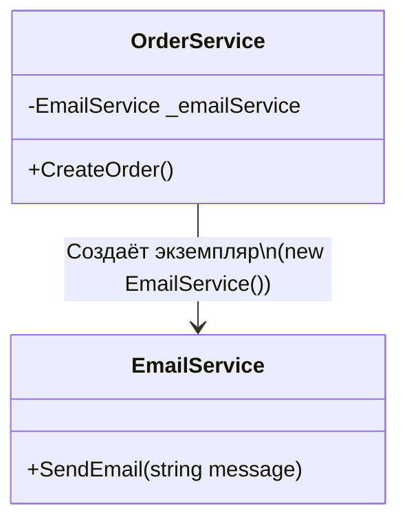
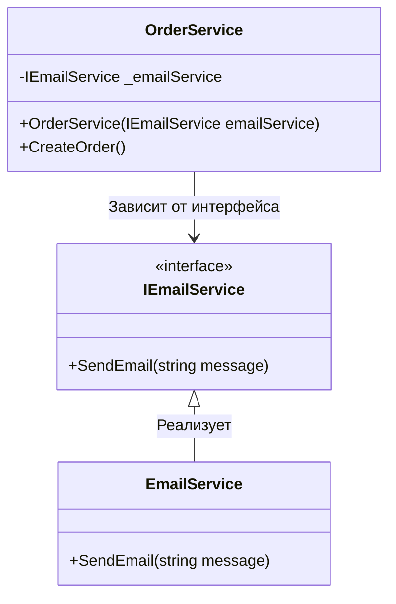

---
title: 5.04. Сборка в .NET
---

# 5.04. Сборка в .NET

# Раздел в разработке

## Сборка в .NET

```
Что такое сборка (assembly)
Манифест, метаданные, типы
EXE vs DLL
Подписанные и строго именованные сборки

```

★ Сервисы и builder

В .NET используется подход, основанный на Host и Builder. Это позволяет настраивать приложение через цепочку вызовов методов. Основной класс для создания приложения – это **WebApplicationBuilder** (для веб-приложений) и **HostApplicationBuilder** (для консольных приложений).

Пример:
```csharp
var builder = WebApplication.CreateBuilder(args);

// Настройка сервисов (например, регистрация зависимостей)
builder.Services.AddControllers();
builder.Services.AddSingleton<IMyService, MyService>();

// Построение приложения
var app = builder.Build();

// Настройка middleware
app.UseRouting();
app.MapControllers();

app.Run();
```

Здесь создаётся builder, и предоставляется доступ к различным частям конфигурации приложения, таким как:
	- `builder.Services` - для регистрации сервисов (DI контейнер).
	- `builder.Configuration` - для работы с конфигурацией (`appsettings.json`, переменные окружения и тд);
	- `builder.Logging` - для настройки логирования;
	- `builder.Environment` - для получения информации о среде выполнения (допустим, Development для разработки, Production для продуктивной среды).
	
Здесь подробнее остановимся на builder.Services - коллекция сервисов, которая используется для регистрации зависимостей в Dependency Injection контейнере. 

**DI** – это паттерн, который позволяет внедрять зависимости в классы, а не создавать их внутри класса.

Пример регистрации класса:
```csharp
builder.Services.AddSingleton<IMyService, MyService>();
```

	- `AddSingleton` - регистрирует сервис как синглтон (один экземпляр на всё приложение).
	- `IMyService` - интерфейс, который будет использоваться для внедрения зависимости.
	- `MyService` - реализация интерфейса.

Другие методы регистрации:
	- `AddTransient<TInterface, TImplementation>()`: Создает новый экземпляр сервиса каждый раз, когда он запрашивается.
	- `AddScoped<TInterface, TImplementation>()`: Создает один экземпляр сервиса для каждого HTTP-запроса (в веб-приложениях).

Но их мы рассмотрим чуть позже. Для начала, разберёмся, что за «сервис».

★ **Регистрация сервиса** – это процесс добавления класса или интерфейса в DI контейнер, чтобы он мог автоматически быть внедрён в другие классы. Это делается через методы AddSingleton, AddScoped, AddTransient.

★ **Сервис** – это просто класс, который выполняет какую-то задачу. Например, сервис для работы с БД, для отправки email или логирования.

★ **Dependency Injection (DI)** — это паттерн программирования, который позволяет «внедрять» зависимости (сервисы) в классы, вместо того чтобы создавать их внутри класса. Это делает код более гибким, тестируемым и поддерживаемым.

```
контейнер внедрения зависимостей (DI), принцип работы
```

Представим, что есть класс `OrderService`, который зависит от класса `EmailService` для отправки письма после создания класса. Если мы создаём объект `EmailService` внутри `OrderService`, то код будет жёстко связан с конкретной реализацией `EmailService`. Это называется жёсткой связью. И если захотим изменить `EmailService` на другой сервис, допустим, отправки SMS, то придётся изменять код `OrderService`. 



Это плохо.

```csharp
public class OrderService
{
    private EmailService _emailService;

    public OrderService()
    {
        _emailService = new EmailService(); // Жёсткая связь
    }

    public void CreateOrder()
    {
        // Логика создания заказа
        _emailService.SendEmail("Заказ создан!");
    }
}
```

DI решает эту проблему, позволяя передавать зависимости через конструктор. Вместо того, чтобы создавать объект `EmailService` внутри `OrderService`, вы передаёте его извне – это называется внедрением зависимостей.

```csharp
public interface IEmailService
{
    void SendEmail(string message);
}

public class EmailService : IEmailService
{
    public void SendEmail(string message)
    {
        Console.WriteLine($"Отправка email: {message}");
    }
}

public class OrderService
{
    private readonly IEmailService _emailService;

    public OrderService(IEmailService emailService) // Внедрение через конструктор
    {
        _emailService = emailService;
    }

    public void CreateOrder()
    {
        // Логика создания заказа
        _emailService.SendEmail("Заказ создан!");
    }
}
```

Теперь `OrderService` не зависит от конкретной реализации `EmailService`. Можно легко заменить `EmailService` на другой класс, реализующий интерфейс `IEmailService`.




★ Регистрация сервисов нужна, чтобы DI контейнер знал, какие классы и как создавать. 

**DI контейнер** – это специальный механизм, который автоматически создаёт объекты и внедряет их.

Алгоритм:
1) регистрация сервиса в DI контейнере;
2) когда запрашиваем сервис (через конструктор), DI контейнер создаёт объект и передаёт его туда, где он нужен.

В .NET есть три основных способа регистрации сервисов:
1. `AddSingleton` - создаётся один экземпляр сервиса на всё приложение. Подходит для сервисов, которые не хранят состояние или являются глобальными. DI создаёт один объект и сохраняет его.
2. `AddScoped` - создаётся один экземпляр сервиса на каждый HTTP-запрос (в веб-приложениях). Подходит для сервисов, которые зависят от данных запроса (например, работа с базовй данных). DI создаёт объект для каждого запроса.
3. `AddTransient` - создаётся один экземпляр сервиса каждый раз, когда он запрашивается. Подходит для легковесных сервисов, которые не хранят состояние. DI создаёт новый объект каждый раз.
