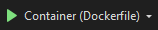
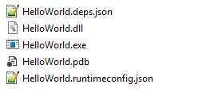
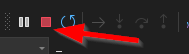
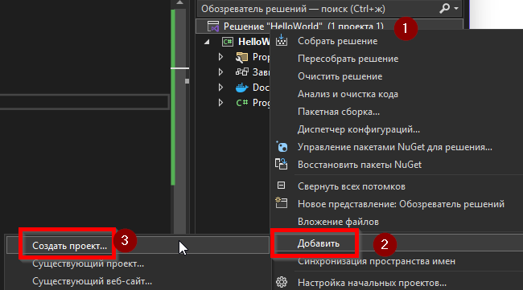
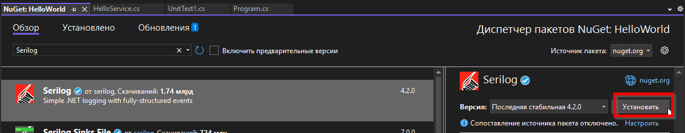
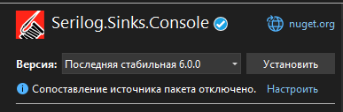
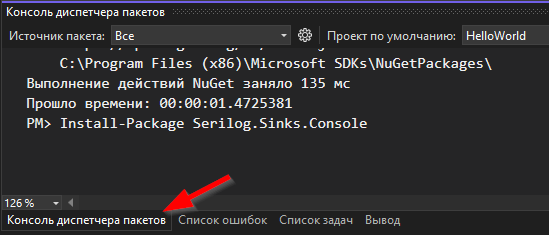
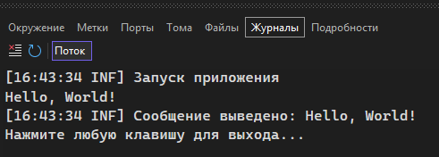

---
title: 5.05. Первая программа
---

# 5.05. Первая программа

<div class="article-tags">
  <span class="tag tag-required">ОБЯЗАТЕЛЬНО</span>
  <span class="tag tag-beginner">ДЛЯ НОВИЧКОВ</span>
  <span class="tag tag-advanced">НЕ ДЛЯ НОВИЧКОВ</span>
  <span class="tag tag-inprogress">В РАЗРАБОТКЕ</span>
</div>
<span class="complexity-badge">Разработчику</span>
<span class="complexity-badge">Архитектору</span>

## Первая программа

<div class="callout callout--tip">
  <div class="callout-title">Практическое задание</div>
Выполните нижеследующее задание.
</div>


А теперь давайте немного попрактикуемся и посмотрим, как выглядит работа с C#. Пройдитесь и выполните все действия по алгоритму, но на каждом шаге старайтесь исследовать то, что на экране, чтобы понимать.

1. Скачайте и установите Visual Studio:
	- Community – бесплатная;
	- Professional, Enterprise, Preview – платные.
2. Запустите Visual Studio.
3. Нажмите «Создание проекта».
4. Вам будет предложен целый ряд шаблонов – выберем «Консольное приложение (Майкрософт)».
5. Заполним атрибуты:
	- Имя проекта – HelloWorld;
	- Расположение – укажем папку для хранения проекта;
	- Имя решения – HelloWorld;
	- Можно включить галочку «Поместить решение и проект в одном каталоге». Ниже будет указано, в каком каталоге будет проект. Жмём «Далее».
	- Платформа – выбрать последнюю (к примеру, .NET 8.0);
	- Можем включить поддержку контейнера – но потребуется Docker.
	- Если включаем поддержку контейнера – выбираем ОС контейнера – Linux и тип сборки контейнера – Dockerfile. Создаём проект.
6. Справа будет обозреватель решений – это структура проекта. В нашем случае, мы имеем Program.cs – файл с кодом:
Console.WriteLine("Hello, World!");
7. Поскольку проект простой, нам даже ничего и не потребуется, уже можно запускать, нажав на кнопку запуска на панели инструментов – в моём случае, запуск с контейнером, поэтому будет написано «Dockerfile»:



8. Запуск выполнит сборку программы и отобразит в окне вывода результат:


9. Сборка выполняется через ПКМ по проекту или решению – «Собрать» (Build).

10. Если открыть папку решения в проводнике, мы увидим файлы проекта – Dockerfile, HelloWorld.csproj, HelloWorld.sln.


11. Собранная программа сохраняется по пути:
	- `HelloWorld\bin\Debug` – для Debug сборки (отладочная);
	- `HelloWorld\bin\Release` – для Release сборки (релизная);

12. Тип сборки меняется через панель инструментов:


13. По умолчанию, набор файлов будет содержать следующее:



14. Для запуска на Windows ничего не потребуется – достаточно открыть исполняемый файл HelloWorld.exe.
Но конкретно наша программа закроется сразу – это связано с тем, что в её коде ничего нет – после вывода текста Hello World! программа завершит свою работу.

Усложним задачу – добавим паузу перед закрытием консоли, и добавим юнит-тесты с использованием xUnit.

15. Изменим код – добавим к коду класс, метод, и ожидание нажатия клавиши:
```csharp
using System;

namespace HelloWorld
{
    class Program
    {
        static void Main(string[] args)
        {
            Console.WriteLine("Hello, World!");

            Console.WriteLine("Нажмите любую клавишу для выхода...");
            Console.ReadLine();
        }
    }
}
```
Теперь программа будет ждать нажатия клавиши после вывода текста, прежде чем закроется:


Для принудительного закрытия программы используем остановку на панели:



16. Добавим юнит-тест. В Visual Studio это будет ещё один проект в составе решения, поэтому нажимаем ПКМ на решении – Добавить – Новый проект:



17. Выбираем тип шаблона – Тестовый проект xUnit (Майкрософт).

18. Назовём проект «HelloWorld.Tests».

19. После создания Visual Studio автоматически создаст тестовый проект с файлом UnitTest1.cs.

20. Теперь нам нужно связать тестовый проект с основным. Для этого нажимаем ПКМ на тестовом проекте – Добавить – Ссылка на проект – выбираем наш проект HelloWorld – ОК.

21. Создадим отдельный класс. В основном проекте HelloWorld добавляем новый класс HelloService.cs:


Добавляем код в наш новый HelloService.cs
```csharp
namespace HelloWorld
{
    public class HelloService
    {
        public string GetMessage()
        {
            return "Hello, World!";
        }
    }
}
```

22. Изменим Program.cs, чтобы использовать новый класс:
```csharp
using System;

namespace HelloWorld
{
    class Program
    {
        static void Main(string[] args)
        {
            var service = new HelloService();
            Console.WriteLine(service.GetMessage());

            Console.WriteLine("Нажмите любую клавишу для выхода...");
            Console.ReadLine();
        }
    }
}
```

23. Пишем юнит-тест в UnitTest1.cs:
```csharp
using Xunit;
using HelloWorld;

namespace HelloWorld.Tests
{
    public class UnitTest1
    {
        [Fact]
        public void TestGetMessage_ReturnsHelloWorld()
        {
            // Arrange
            var service = new HelloService();

            // Act
            var result = service.GetMessage();

            // Assert
            Assert.Equal("Hello, World!", result);
        }
    }
}
```

24. Запускаем Test Explorer (Обозреватель тестов):


25. Запускаем все тесты и ждём результаты:


Усложним ещё. Теперь добавим инструменты логирования, к примеру, Serilog. Но здесь нам понадобится устанавливать дополнительные пакеты, так мы и познакомимся с NuGet.

26. Переходим в менеджер пакетов NuGet через ПКМ по основному проекту – Управление пакетами NuGet – Обзор – пишем Serilog – выбираем и устанавливаем:




27. Устанавливаем также Serilog.Sinks.Console:




Второй вариант – просто перейти в Package Manager Console (консоль менеджера пакетов):




И выполнить там команды:
```bash
Install-Package Serilog
Install-Package Serilog.Sinks.Console
```

28. Настроим логгер – для этого нам понадобится изменить Program.cs:
```csharp
using System;
using Serilog;

namespace HelloWorld
{
    class Program
    {
        static void Main(string[] args)
        {
            // Инициализация логгера
            Log.Logger = new LoggerConfiguration()
                .WriteTo.Console()
                .CreateLogger();

            try
            {
                Log.Information("Запуск приложения");

                var service = new HelloService();
                var message = service.GetMessage();
                Console.WriteLine(message);

                Log.Information("Сообщение выведено: {Message}", message);

                Console.WriteLine("Нажмите любую клавишу для выхода...");
                Console.ReadLine();
            }
            catch (Exception ex)
            {
                Log.Fatal(ex, "Ошибка при выполнении программы");
            }
            finally
            {
                Log.CloseAndFlush(); // Важно!
            }
        }
    }
}
```

28. При запуске мы увидим логи в консоли:



Вот так пишется программа на C#. 

Этого пока достаточно. Если вы успешно проделали эти шаги, вы:
	- ознакомились с IDE Visual Studio;
	- успешно собрали и запустили программу;
	- подключили пакеты и добавили xUnit;
	- написали модульный тест (юнит-тест);
	- добавили логирование при помощи Serilog;
	- а если вы ещё и справились c Docker – вы герой!

