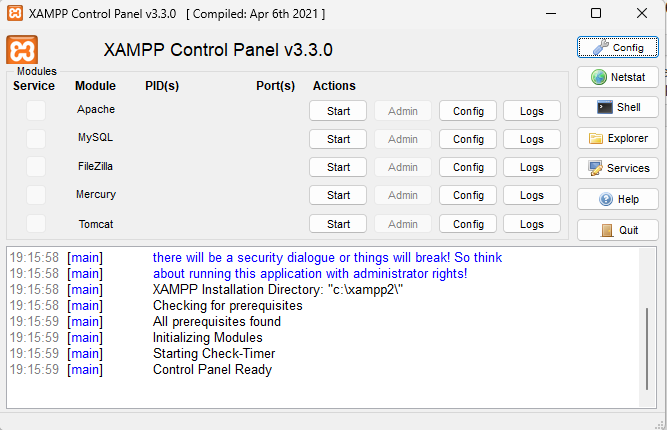

---
title: 5.07. Первая программа на PHP
---

# 5.07. Первая программа на PHP

## Первая программа на PHP

А теперь давайте немного попрактикуемся и посмотрим, как выглядит работа с PHP. Пройдитесь и выполните все действия по алгоритму, но на каждом шаге старайтесь исследовать то, что на экране, чтобы понимать.
1. Установка. Можно использовать:
	- XAMPP (рекомендуется) – пакет, содержащий Apache, MySQL, PHP и прочие полезные инструменты. Это, кстати, отличный вариант для изучения множества инструментов в комплекте.
	- PHP как отдельный пакет через официальный сайт php.net.

2. Рассмотрим XAMPP. После завершения установки можно запустить XAMPP Control Panel, который предоставит интерфейс управления серверами.



Панель управления даёт нам перечень инструментов, и около каждого из перечисленных есть Start (запуск), Admin, Config и Logs. Общие настройки в меню справа.

3. Запуск сервера. Нас интересует Apache – нажмём Start рядом с Apache, чтобы запустить веб-сервер, который будет выполнять PHP-скрипты. После успешного запуска будет указано, какие порты использует сервер, а в нижней части окна будет логирование информации.

4. Папка с файлами. Все PHP-файлы, как правило, размещаются в каталоге htdocs, который находится внутри папки, куда мы установили XAMPP – по умолчанию, `C:\xampp\htdocs\`. В этой папке мы создадим новую папку – myfirstphp, будет корнем нашего проекта.

5. Файл со скриптом. Создадим файл `index.php` внутри папки `myfirstphp`, откроем его в любом текстовом редакторе и добавим туда код:
```php
<?php
echo "Hello World!";
?>
```
В PHP всё начинается с тега `<?php`. Команда `echo` выводит текст на экран.

6. Запуск программы. Чтобы запустить скрипт, убедимся, что Apache запущен, откроем браузер и перейдём по адресу: 

http://localhost/myfirstphp

Мы должны увидеть `Hello World` в браузере. 

Вот и всё.

Альтернативный способ: CLI (командная строка), но сохраним тот же код в другом файле, `hello.php` и перейдём к нему в командной строке. 

Пример:
```bash
cd C:\xampp\htdocs\myfirstphp
```
Затем выполним:
```bash
php hello.php
```

Результат будет в консоли:


7. Если через командную строку не удалось запустить, значит нужно проверить работу PHP на компьютере. Нужно добавить PATH к системным переменным. 
```
Система – Дополнительные параметры системы – Переменные среды – Path – изменить – указать туда путь к нашему PHP.
```

Если мы установили XAMPP, то PHP будет по пути: `C:\xampp\php`

Если же PHP установлен отдельно – то нужно будет указать путь установки.

Можем попробовать усложнить скрипт. Попробуйте изменить код нашего `index.php` на следующий:
```php
<?php
$name = "Имя";
echo "Привет, $name!<br>";
echo "Сегодня: " . date("d.m.Y");
?>
```
Тогда мы получим переменную $name, которая будет выводиться, функцию `date()` для вывода текущей даты и конкатенацию строк с помощью точки.
