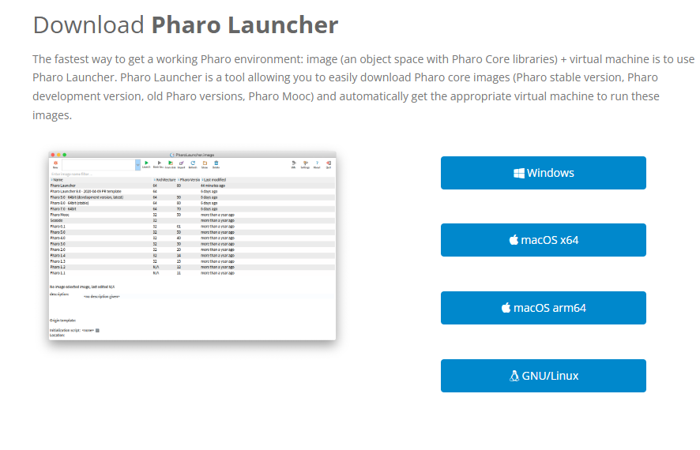
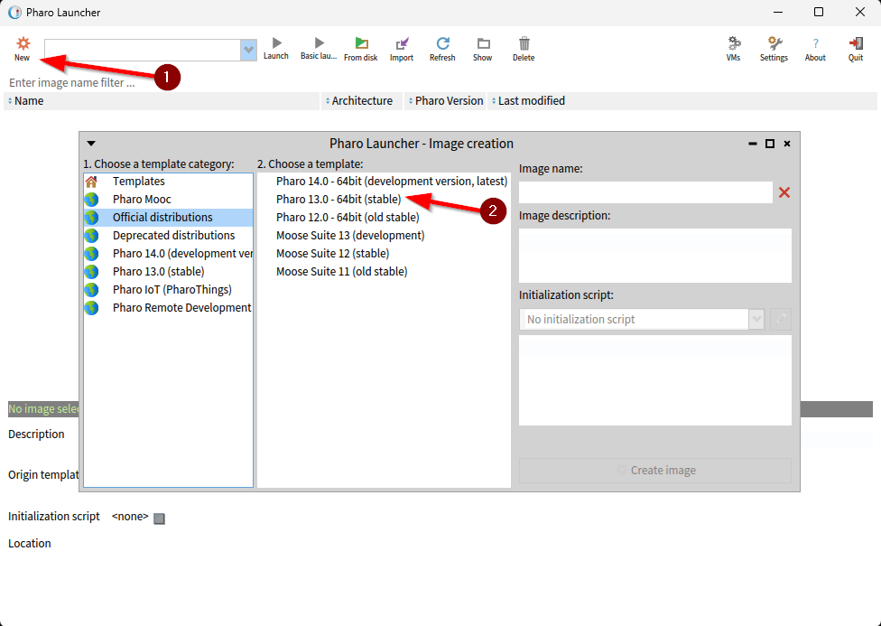
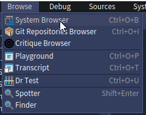
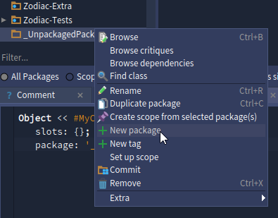
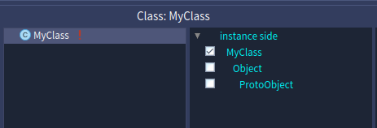

---
title: Первая программа на Smalltalk
tags: [beginner, advanced, required, engineer, developer, architector]
description: Гайд по установке и настройке с написанием первой программы и её запуском.
---

# Первая программа на Smalltalk

<div class="article-tags">
  <span class="tag tag-beginner">ДЛЯ НОВИЧКОВ</span>
  <span class="tag tag-advanced">НЕ ДЛЯ НОВИЧКОВ</span>
  <span class="tag tag-notrequired">НЕ ОБЯЗАТЕЛЬНО</span>
  <span class="tag tag-inprogress">В РАЗРАБОТКЕ</span>
</div>
<span class="complexity-badge">Разработчику</span>
<span class="complexity-badge">Архитектору</span>

## Первая программа на Smalltalk

Давайте «пощупаем» язык. Установим всё нужное и напишем первую программку на этом языке.

### Шаг 1: Установка Pharo на Windows

Smalltalk не устанавливается как обычный язык. У нас не будет gcc или dotnet. Вместо этого — образ системы (image) и виртуальная машина (VM). Нам нужен Pharo Launcher — удобный менеджер образов или просто Pharo Desktop — готовый пакет.

1. Перейдите на официальный сайт: https://pharo.org

Кстати, ссылка может быть недоступна в некоторых странах, так что главное - достаньте клиент.

2. Нажмите «Download» → «Pharo Launcher» for Windows.




3. Скачайте Pharo-Launcher-Win64.msi (установщик). Если работате на другой ОС, то выберете удобную под себя, запустите этот установщик и следуйте инструкциям. Установка там стандартная. После установки появится ярлык Pharo Launcher на рабочем столе. Потом нужно запустить программу.

### Шаг 2. Запуск.

После того, как запустите лаунчер, вы увидите список доступных версий. В нём нужно будет сначала нажать на «New» (1) а затем выбрать из списка стабильную версию. В моём случае это 13.



После выбора версии автоматически установится Image name, но можете и указать своё. Назовём его Test и нажмём Create Image. После этого начнётся скачивание образа с серверов. И потом запустится окно Pharo.

Это не IDE, это вся система целиком - с кодом, объектами, интерфейсом. Будет непривычно, возможно и запутаться, но смысл такой - вас приветствует мастер, который подскажет вам некоторые моменты и предложит выбрать тему оформления. Я выбрал тёмную. Затем вы просто закройте окно - учтите, что всё что происходит - будет внутри окна - это и есть виртуальная машина.

Для начала освойтесь - просмотрите имеющиеся вкладки, панели, инструменты. Нам понадобится вкладка Browse. А теперь поэтапно.


### Шаг 3. Работа с объектами.



Начнём с самого начала. Выберите вкладку Browse и откройте System Browser.

Перед вами откроется целый набор пакетов, среди которого можно запутаться. Но пока не торопитесь.

Начнём с создания класса.



Нажмите правой кнопкой мыши на левой панели, например в моём случае я нажал ПКМ на пакете _UnpackagedPackage из списка.

Затем нажмите New package, для добавления нового пакета. Так мы создадим пакет. Давайте назовём его MyApp.


Затем выберите созданный пакет MyApp в списке, и в соседней панели нажмите «New class», добавив новый класс в пакете.


Откроется редактор. 

В нём определяется класс (Class definition).

Как видите - это объект MyClass, который имеет определенный набор свойств.

Можете сразу нажать Ctrl+S или OK.



После создания класса можно его изучить. Сбоку будет иерархия. Нам нужно выбрать MyClass и нажать «New protocol», после чего выбрать «accessing».


Тело метода пишется в нижней части окна - там и находится редактор кода. 

Попробуйте добавить туда следующий код для нашего нового метода:
```
getMessage
    ^ 'Hello, World!'
```
И нажмите Ctrl+S, чтобы сохранить.

И всё, метод сразу доступен. Никакой пересборки.


Затем перейдите в Browse - Playground - и напишите:
```
(MyClass new getMessage)
```
После этого нажмите «Do it all» или Ctrl+P и увидите «Hello, World!».


Необычно и просто. На самом деле на практике нам не придётся работать с этим языком, но вы уже ознакомились с принципами работы, глубже можете погружаться лишь на свой вкус - но зато вы уже освоились с базой. Это очень легкий процесс создания объекта и метода к нему, а также исполнения. Разумеется, если речь пойдёт о крупных промышленных системах, возни там в тысячи раз больше.

На вкладках Playground вы можете посмотреть, из чего состоит такая простая команда вывода Hello World - в Items вы увидите значения $H, $e, $l, $l, $o, $, Character space, $W, $o, $r, $l, $d, $! - можно открыть любой элемент и изучить его, увидев его особенности:


Но если будете копаться, кроме удовлетворения собственного интереса, особо вам это ничего не даст. Пойдёмте дальше.
