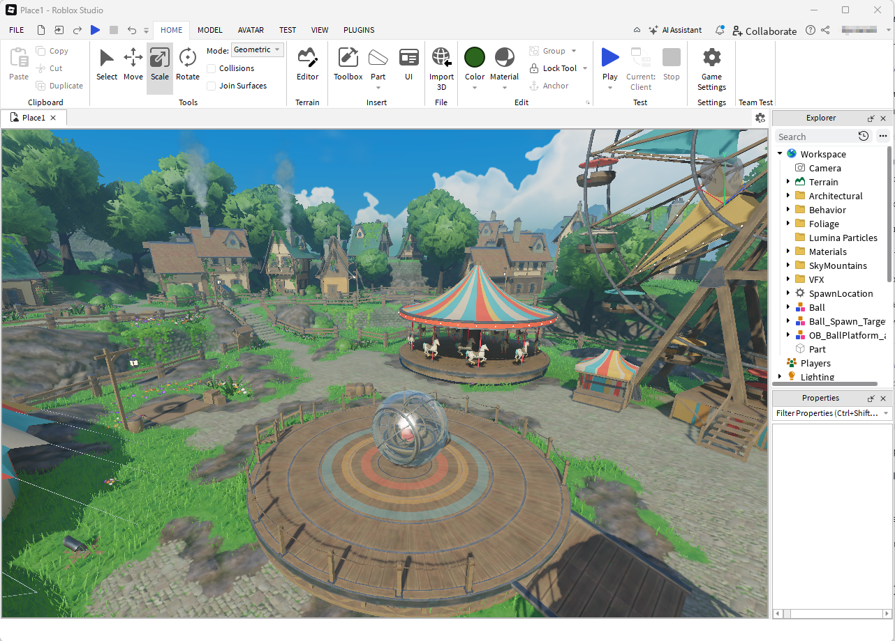
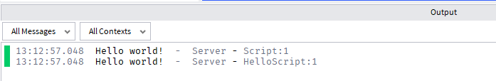

---
title: 5.15. Первая программа на Lua
---

# 5.15. Первая программа на Lua

<div class="article-tags">
  <span class="tag tag-beginner">ДЛЯ НОВИЧКОВ</span>
  <span class="tag tag-advanced">НЕ ДЛЯ НОВИЧКОВ</span>
  <span class="tag tag-notrequired">НЕ ОБЯЗАТЕЛЬНО</span>
  <span class="tag tag-inprogress">В РАЗРАБОТКЕ</span>
</div>
<span class="complexity-badge">Разработчику</span>
<span class="complexity-badge">Архитектору</span>

## Первая программа на Lua

Теперь, когда вы познакомились с историей, философией и экосистемой Lua, пришло время сделать первый шаг — написать и запустить простейшую программу. Мы рассмотрим несколько сценариев, чтобы показать разнообразие использования языка:

Запуск классического скрипта на чистом Lua через интерпретатор.
	- Работа с Roblox Studio — где используется диалект Luau.
	- Добавление типов в Luau (статическая проверка).
	- Запуск вне IDE — через командную строку.

### Сценарий 1. Простая локальная программа

Шаг 1. Установите Lua.

Для установки нам понадобится терминал:

1. Windows:
```bash
winget install DEVCOM.Lua
```
2. Linux (на примере Ubuntu):
```bash
sudo apt install lua5.4
```
3. macOS:
```bash
brew install lua
```
Также можете самостоятельно скачать исходники с https://www.lua.org и установить. Ещё один удобный вариант - использовать установщик Lua for Windows.

Для проверки установки можно написать в терминале «lua -v» и увидеть версию.

Шаг 2. Создайте файл hello.lua

Откройте любой текстовый редактор (VS Code, Notepad++, Sublime Text) и создайте файл с расширением .lua, со следующим содержимым:
```lua
print("Hello, World!")
```
Сохраните его, например, в папке `lua_projects/hello.lua`. 

Обратите внимание: никаких точек с запятой, фигурных скобок, классов или функций main. Это — вся программа.

Шаг 3: Запустите программу

Откройте терминал (командную строку), перейдите в папку с файлом и выполните:
```lua
lua hello.lua
```
Вы увидите «Hello, World!» - и всё. Так выводится текст - поздравляю, первая программа готова - интерпретатор прочитал файл, скомпилировал его в байт-код, выполнил инструкцию print() - встроенную функцию для вывода текста и завершил работу. Всё просто. Никаких сборок, артефактов, JAR-файлов.

Так работают скриптовые и интерпретируемые языки.

Теперь попробуем запустить скрипт с переменными и функциями. Создадим новый файл greet.lua и добавим туда следующий код:
```lua
-- Функция с параметром
local function greet(name)
    return "Hello, " .. name .. "!"
end

-- Вызов и вывод
local result = greet("Timur")
print(result)
```
В терминале запустите `lua greet.lua` - тогда вы увидите «Hello, Timur!»

### Сценарий 2: Roblox Studio

Теперь давайте перейдём к более реальной практике — особенно если вы будете обучать людей разработке игр. Roblox — один из самых массовых способов знакомства с программированием, и там используется Luau, диалект Lua.

Шаг 1: Установите Roblox Studio

Перейдите на https://www.roblox.com/create.

Скачайте и установите Roblox Studio - это бесплатно.

Зарегистрируйтесь и авторизуйтесь.

После установки запустите программу, откроется окно создания проекта.

Шаг 2: Туториал

При первом запуске Roblox Studio заботливо предложит вам пройти ознакомительное занятие - это довольно легко. Суть следующая:
1. Перед вами откроется сцена с картой фэнтезийного стиля.
2. Вам предложат сначала научиться управлять камерой и ориентироваться в пространстве (если вы играли хотя бы в одну игру на ПК, вы легко освоитесь, там обычное WASD управление).
3. Затем вам покажут панель с ассетами - внутриигровыми материалами (это готовые модели и объекты для создания игр). Наберите в поиске ball, и в центре карты увидите шар.
4. Нажав Play, вы сразу можете погрузиться в игру прямо в окне. Stop - вернуться в режим создания. Если вы подойдёте к шару, нажмите E и сядете в шар (как хомяк).
5. Затем вам предложат познакомиться с добавлением новых объектов - вам предложат добавить треугольный объект, и расширить его, превратив в трамплин.
6. Потом нужно будет настроить скорость шара в его свойствах - так вас познакомят с окном настройки свойств.
7. После настройки можно будет нажать Play, сесть в шар, разогнаться и с помощью трамплина попасть шаром в одну из мишеней.

Вот и всё, на этом ознакомительный курс будет завершён, а вам предложат поизучать карту и объекты на ней.



Но вам лучше попробовать создать новую карту. Создайте новый проект, выберите шаблон, например Baseplate (пустая карта с платформой) или Empty (совсем чистый проект). Назовите проект, например, HelloWorldGame, и нажмите Create.

Затем добавьте скрипт - в дереве объектов слева найдите Workspace или ServerScriptService, правой кнопкой мыши кликните и нажмите Insert Object - Script. Автоматически будет создан файл с именем Script и откроется встроенный редактор кода.


Там уже будет код:
```lua
print("Hello world!")
```
Сохраните скрипт (Ctrl + S). Назовите его, например, HelloScript.

Предварительно перейдите на вкладку «Script» и включите Output:


И тогда, после нажатия на Play (запуска игры), вы увидите в самом низу вывод консоли с тем самым текстом из команды print():



Roblox Studio содержит встроенную VM на основе Lua (с модификациями Luau).

Скрипты в ServerScriptService выполняются на сервере. print() выводит сообщение в консоль разработчика. При нажатии Play запускается симуляция — как настоящая игра.

Можете немного усложнить работу. Luau позволяет добавлять аннотации типов. Это помогает избежать ошибок при масштабировании. Измените код скрипта:
```lua
local message: string = "Hello with types!"
print(message)
```
Тогда вы увидите подсветку типов, и даже ошибку, если попробуете присвоить число строке. Потому что вы указали «string» - прямо закрепив тип данных переменной message.

Усложним? Давайте сделаем что-то более полезное, но простое - при появлении игрока в мире будет выводиться приветствие. Для этого измените скрипт:
```lua
-- Получаем сервис игроков
local Players = game:GetService("Players")

-- Обработчик входа игрока
local function onPlayerAdded(player)
    print(player.Name .. " joined the game!")
end

-- Подписываемся на событие
Players.PlayerAdded:Connect(onPlayerAdded)
```
Теперь при запуске вы увидите «`<Ваш ник> joined the game!`» в консоли. Это уже настоящая игровая логика: реакция на события, работа с API Roblox.

