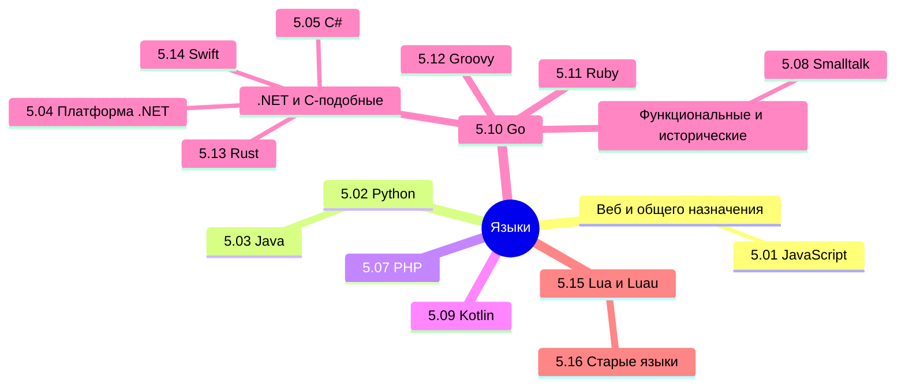

## О разделе

Мы изучили, как пишут программы, теперь пора посмотреть, на чём пишут. Что используется для фронтенда, что для бэкенда - какие инструменты и технологии нужны в разных областях.

Технически, языки по большей части универсальны. Они обычно появляются с определённой целью (JavaScript для оживления страниц, C/C++ для системного программирования, а Java чтобы обезопасить и упростить разработку), но в дальнейшем развиваются, получая новый функционал, новые фичи и возможности.

В интернете часто можно найти громкие заголовки вроде «Какой язык программирования выбрать?» И почти всегда вы встретите от года в год одно и то же - Python лучше всех, JavaScript и Java нужны везде, а C# никому не нужен. Но не всё так просто.

Вообще, лучше воспользуйтесь содержанием или перейдите к Базе знаний. Но для удобства, я размещу здесь ссылки на основные главы раздела:

## JavaScript

<ul>
  <li>
  <ul>
  JavaScript
  <li><a href="/encyclopedia/Языки/5.01.%20JavaScript/1">5.01. История JavaScript</a></li>
  <li><a href="/encyclopedia/Языки/5.01.%20JavaScript/101">5.01. Рекомендации по разработке на JavaScript</a></li>
  <li><a href="/encyclopedia/Языки/5.01.%20JavaScript/11">5.01. Основы JavaScript</a></li>
  <li><a href="/encyclopedia/Языки/5.01.%20JavaScript/12">5.01. Знаки препинания</a></li>
  <li><a href="/encyclopedia/Языки/5.01.%20JavaScript/121">5.01. Ключевые слова в JavaScript</a></li>
  <li><a href="/encyclopedia/Языки/5.01.%20JavaScript/122">5.01. Встроенные функции в JavaScript</a></li>
  <li><a href="/encyclopedia/Языки/5.01.%20JavaScript/13">5.01. Подключение и структура кода</a></li>
  <li><a href="/encyclopedia/Языки/5.01.%20JavaScript/14">5.01. Работа и применение</a></li>
  <li><a href="/encyclopedia/Языки/5.01.%20JavaScript/15">5.01. Видимость в JavaScript</a></li>
  <li><a href="/encyclopedia/Языки/5.01.%20JavaScript/16">5.01. Функции в JavaScript</a></li>
  <li><a href="/encyclopedia/Языки/5.01.%20JavaScript/17">5.01. Переменные в JavaScript</a></li>
  <li><a href="/encyclopedia/Языки/5.01.%20JavaScript/18">5.01. Типы данных в JS</a></li>
  <li><a href="/encyclopedia/Языки/5.01.%20JavaScript/19">5.01. Выражения и операторы</a></li>
  <li><a href="/encyclopedia/Языки/5.01.%20JavaScript/20">5.01. Циклы в JavaScript</a></li>
  <li><a href="/encyclopedia/Языки/5.01.%20JavaScript/21">5.01. Асинхронность в JavaScript</a></li>
  <li><a href="/encyclopedia/Языки/5.01.%20JavaScript/22">5.01. Работа с объектами</a></li>
  <li><a href="/encyclopedia/Языки/5.01.%20JavaScript/23">5.01. События</a></li>
  <li><a href="/encyclopedia/Языки/5.01.%20JavaScript/24">5.01. Консоль, отладка и боль</a></li>
  <li><a href="/encyclopedia/Языки/5.01.%20JavaScript/241">5.01. Встроенные типы ошибок</a></li>
  <li><a href="/encyclopedia/Языки/5.01.%20JavaScript/25">5.01. Инструменты и фреймворки</a></li>
  <li><a href="/encyclopedia/Языки/5.01.%20JavaScript/251">5.01. Справочник по JavaScript</a></li>
  <li><a href="/encyclopedia/Языки/5.01.%20JavaScript/26">5.01. Node</a></li>
  <li><a href="/encyclopedia/Языки/5.01.%20JavaScript/261">5.01. Справочник по Node</a></li>
  <li><a href="/encyclopedia/Языки/5.01.%20JavaScript/27">5.01. React</a></li>
  <li><a href="/encyclopedia/Языки/5.01.%20JavaScript/271">5.01. Справочник по React</a></li>
  <li><a href="/encyclopedia/Языки/5.01.%20JavaScript/28">5.01. Vue</a></li>
  <li><a href="/encyclopedia/Языки/5.01.%20JavaScript/281">5.01. Справочник по Vue.js</a></li>
  <li><a href="/encyclopedia/Языки/5.01.%20JavaScript/29">5.01. Angular</a></li>
  <li><a href="/encyclopedia/Языки/5.01.%20JavaScript/291">5.01. Справочник по Angular</a></li>
  <li><a href="/encyclopedia/Языки/5.01.%20JavaScript/30">5.01. TypeScript</a></li>
  <li><a href="/encyclopedia/Языки/5.01.%20JavaScript/301">5.01. Справочник по TypeScript</a></li>
  <li><a href="/encyclopedia/Языки/5.01.%20JavaScript/31">5.01. Ext JS</a></li>
  <li><a href="/encyclopedia/Языки/5.01.%20JavaScript/311">5.01. Справочник по Ext JS</a></li>
  <li><a href="/encyclopedia/Языки/5.01.%20JavaScript/32">5.01. Практика</a></li>
  <li><a href="/encyclopedia/Языки/5.01.%20JavaScript/998">5.01. Итоги</a></li>
  <li><a href="/encyclopedia/Языки/5.01.%20JavaScript/999">5.01. Чек-лист самопроверки</a></li>
  </ul>
  </li>
  
</ul>

## Python

<ul>
  
  <li>
  <ul>
  Python
  <li><a href="/encyclopedia/Языки/5.02.%20Python/1">5.02. Python</a></li>
  <li><a href="/encyclopedia/Языки/5.02.%20Python/101">5.02. Рекомендации по разработке на Python</a></li>
  <li><a href="/encyclopedia/Языки/5.02.%20Python/11">5.02. Архитектура Python</a></li>
  <li><a href="/encyclopedia/Языки/5.02.%20Python/12">5.02. Фреймворки</a></li>
  <li><a href="/encyclopedia/Языки/5.02.%20Python/121">5.02. Экосистема Python-приложений</a></li>
  <li><a href="/encyclopedia/Языки/5.02.%20Python/13">5.02. Окружения</a></li>
  <li><a href="/encyclopedia/Языки/5.02.%20Python/14">5.02. История</a></li>
  <li><a href="/encyclopedia/Языки/5.02.%20Python/15">5.02. Философия</a></li>
  <li><a href="/encyclopedia/Языки/5.02.%20Python/16">5.02. Первая программа</a></li>
  <li><a href="/encyclopedia/Языки/5.02.%20Python/17">5.02. Знаки препинания</a></li>
  <li><a href="/encyclopedia/Языки/5.02.%20Python/171">5.02. Ключевые слова в Python</a></li>
  <li><a href="/encyclopedia/Языки/5.02.%20Python/172">5.02. Встроенные функции в Python</a></li>
  <li><a href="/encyclopedia/Языки/5.02.%20Python/173">5.02. Магические методы в Python</a></li>
  <li><a href="/encyclopedia/Языки/5.02.%20Python/18">5.02. Алгоритмы и структуры</a></li>
  <li><a href="/encyclopedia/Языки/5.02.%20Python/19">5.02. Типы данных в Python</a></li>
  <li><a href="/encyclopedia/Языки/5.02.%20Python/20">5.02. Переменные в Python</a></li>
  <li><a href="/encyclopedia/Языки/5.02.%20Python/21">5.02. Работа с типами</a></li>
  <li><a href="/encyclopedia/Языки/5.02.%20Python/22">5.02. Коллекции</a></li>
  <li><a href="/encyclopedia/Языки/5.02.%20Python/23">5.02. Управляющие конструкции</a></li>
  <li><a href="/encyclopedia/Языки/5.02.%20Python/24">5.02. Функции</a></li>
  <li><a href="/encyclopedia/Языки/5.02.%20Python/25">5.02. Итераторы, генераторы и контекстные менеджеры</a></li>
  <li><a href="/encyclopedia/Языки/5.02.%20Python/26">5.02. ООП в Python</a></li>
  <li><a href="/encyclopedia/Языки/5.02.%20Python/27">5.02. Архитектура выполнения и управление памятью</a></li>
  <li><a href="/encyclopedia/Языки/5.02.%20Python/28">5.02. Исключения</a></li>
  <li><a href="/encyclopedia/Языки/5.02.%20Python/281">5.02. Список ошибок и исключений</a></li>
  <li><a href="/encyclopedia/Языки/5.02.%20Python/29">5.02. Асинхронность и многопоточность</a></li>
  <li><a href="/encyclopedia/Языки/5.02.%20Python/30">5.02. Django</a></li>
  <li><a href="/encyclopedia/Языки/5.02.%20Python/301">5.02. Справочник по Django</a></li>
  <li><a href="/encyclopedia/Языки/5.02.%20Python/31">5.02. Работа с данными и внешним миром</a></li>
  <li><a href="/encyclopedia/Языки/5.02.%20Python/32">5.02. Графика и игры</a></li>
  <li><a href="/encyclopedia/Языки/5.02.%20Python/321">5.02. Справочник по модулю Turtle</a></li>
  <li><a href="/encyclopedia/Языки/5.02.%20Python/33">5.02. Анализ данных и научные вычисления</a></li>
  <li><a href="/encyclopedia/Языки/5.02.%20Python/34">5.02. Веб и API</a></li>
  <li><a href="/encyclopedia/Языки/5.02.%20Python/341">5.02. Flask</a></li>
  <li><a href="/encyclopedia/Языки/5.02.%20Python/342">5.02. Справочник по Flask</a></li>
  <li><a href="/encyclopedia/Языки/5.02.%20Python/343">5.02. Разработка своего API</a></li>
  <li><a href="/encyclopedia/Языки/5.02.%20Python/35">5.02. Автоматизация и DevOps</a></li>
  <li><a href="/encyclopedia/Языки/5.02.%20Python/36">5.02. Справочник по Python</a></li>
  <li><a href="/encyclopedia/Языки/5.02.%20Python/998">5.02. Итоги</a></li>
  <li><a href="/encyclopedia/Языки/5.02.%20Python/999">5.02. Чек-лист самопроверки</a></li>
  </ul>
  </li>
  
</ul>

## Java

<ul>
  
  <li>
  <ul>
  Java
  <li><a href="/encyclopedia/Языки/5.03.%20Java/1">5.03. История Java</a></li>
  <li><a href="/encyclopedia/Языки/5.03.%20Java/101">5.03. Рекомендации по разработке на Java</a></li>
  <li><a href="/encyclopedia/Языки/5.03.%20Java/11">5.03. Основы языка</a></li>
  <li><a href="/encyclopedia/Языки/5.03.%20Java/110">5.03. Экосистема Java-приложений</a></li>
  <li><a href="/encyclopedia/Языки/5.03.%20Java/12">5.03. Структуры проекта</a></li>
  <li><a href="/encyclopedia/Языки/5.03.%20Java/121">5.03. Справочник по конфигурациям в Java</a></li>
  <li><a href="/encyclopedia/Языки/5.03.%20Java/13">5.03. Первая программа на Java</a></li>
  <li><a href="/encyclopedia/Языки/5.03.%20Java/14">5.03. Знаки препинания</a></li>
  <li><a href="/encyclopedia/Языки/5.03.%20Java/141">5.03. Ключевые слова в Java</a></li>
  <li><a href="/encyclopedia/Языки/5.03.%20Java/142">5.03. Встроенные функции в Java</a></li>
  <li><a href="/encyclopedia/Языки/5.03.%20Java/15">5.03. Типы данных в Java</a></li>
  <li><a href="/encyclopedia/Языки/5.03.%20Java/16">5.03. Основные элементы Java</a></li>
  <li><a href="/encyclopedia/Языки/5.03.%20Java/17">5.03. Операторы и циклы в Java</a></li>
  <li><a href="/encyclopedia/Языки/5.03.%20Java/18">5.03. ООП в Java</a></li>
  <li><a href="/encyclopedia/Языки/5.03.%20Java/19">5.03. Прочие особенности языка Java</a></li>
  <li><a href="/encyclopedia/Языки/5.03.%20Java/20">5.03. Библиотеки и утилиты</a></li>
  <li><a href="/encyclopedia/Языки/5.03.%20Java/21">5.03. Исключения</a></li>
  <li><a href="/encyclopedia/Языки/5.03.%20Java/211">5.03. Иерархия исключений в Java</a></li>
  <li><a href="/encyclopedia/Языки/5.03.%20Java/22">5.03. Работа с БД</a></li>
  <li><a href="/encyclopedia/Языки/5.03.%20Java/23">5.03. JVM, память и потоки</a></li>
  <li><a href="/encyclopedia/Языки/5.03.%20Java/24">5.03. Коллекции в Java</a></li>
  <li><a href="/encyclopedia/Языки/5.03.%20Java/25">5.03. JavaServer Faces</a></li>
  <li><a href="/encyclopedia/Языки/5.03.%20Java/26">5.03. JavaBean</a></li>
  <li><a href="/encyclopedia/Языки/5.03.%20Java/27">5.03. Spring</a></li>
  <li><a href="/encyclopedia/Языки/5.03.%20Java/28">5.03. Ключевые классы и интерфейсы Java</a></li>
  <li><a href="/encyclopedia/Языки/5.03.%20Java/3">5.03. Справочник по Java</a></li>
  <li><a href="/encyclopedia/Языки/5.03.%20Java/998">5.03. Итоги</a></li>
  <li><a href="/encyclopedia/Языки/5.03.%20Java/999">5.03. Чек-лист самопроверки</a></li>
  </ul>
  </li>
  
</ul>

## Платформа .NET

<ul>
  
  <li>
  <ul>
  Платформа .NET
  <li><a href="/encyclopedia/Языки/5.04.%20Платформа%20.NET/1">5.04. История .NET</a></li>
  <li><a href="/encyclopedia/Языки/5.04.%20Платформа%20.NET/11">5.04. Платформа .NET</a></li>
  <li><a href="/encyclopedia/Языки/5.04.%20Платформа%20.NET/12">5.04. Особенности архитектуры</a></li>
  <li><a href="/encyclopedia/Языки/5.04.%20Платформа%20.NET/13">5.04. Типы приложений в .NET</a></li>
  <li><a href="/encyclopedia/Языки/5.04.%20Платформа%20.NET/14">5.04. Сборка в .NET</a></li>
  <li><a href="/encyclopedia/Языки/5.04.%20Платформа%20.NET/15">5.04. Пакеты</a></li>
  <li><a href="/encyclopedia/Языки/5.04.%20Платформа%20.NET/16">5.04. Инструменты и среда разработки</a></li>
  <li><a href="/encyclopedia/Языки/5.04.%20Платформа%20.NET/17">5.04. NuGet и политика платформы</a></li>
  <li><a href="/encyclopedia/Языки/5.04.%20Платформа%20.NET/171">5.04. Microsoft ADO</a></li>
  <li><a href="/encyclopedia/Языки/5.04.%20Платформа%20.NET/172">5.04. Microsoft ASP</a></li>
  <li><a href="/encyclopedia/Языки/5.04.%20Платформа%20.NET/173">5.04. Экосистема .NET-приложений</a></li>
  <li><a href="/encyclopedia/Языки/5.04.%20Платформа%20.NET/18">5.04. F#</a></li>
  <li><a href="/encyclopedia/Языки/5.04.%20Платформа%20.NET/181">5.04. Справочник про F#</a></li>
  <li><a href="/encyclopedia/Языки/5.04.%20Платформа%20.NET/2">5.04. SignalR</a></li>
  <li><a href="/encyclopedia/Языки/5.04.%20Платформа%20.NET/998">5.04. Итоги</a></li>
  <li><a href="/encyclopedia/Языки/5.04.%20Платформа%20.NET/999">5.04. Чек-лист самопроверки</a></li>
  </ul>
  </li>
  
</ul>

## C#

<ul>
  
  <li>
  <ul>
  C#
  <li><a href="/encyclopedia/Языки/5.05.%20CSharp/1">5.05. C#</a></li>
  <li><a href="/encyclopedia/Языки/5.05.%20CSharp/101">5.05. Справочник по конфигурациям в C#</a></li>
  <li><a href="/encyclopedia/Языки/5.05.%20CSharp/102">5.05. Рекомендации по разработке на C#</a></li>
  <li><a href="/encyclopedia/Языки/5.05.%20CSharp/11">5.05. Знаки препинания</a></li>
  <li><a href="/encyclopedia/Языки/5.05.%20CSharp/111">5.05. Ключевые слова в C#</a></li>
  <li><a href="/encyclopedia/Языки/5.05.%20CSharp/112">5.05. Встроенные функции в C#</a></li>
  <li><a href="/encyclopedia/Языки/5.05.%20CSharp/12">5.05. Пространства имен</a></li>
  <li><a href="/encyclopedia/Языки/5.05.%20CSharp/13">5.05. Управляющие конструкции и логика</a></li>
  <li><a href="/encyclopedia/Языки/5.05.%20CSharp/14">5.05. Условные операции</a></li>
  <li><a href="/encyclopedia/Языки/5.05.%20CSharp/15">5.05. Исключения</a></li>
  <li><a href="/encyclopedia/Языки/5.05.%20CSharp/151">5.05. Иерархия исключений в C#</a></li>
  <li><a href="/encyclopedia/Языки/5.05.%20CSharp/16">5.05. Первая программа</a></li>
  <li><a href="/encyclopedia/Языки/5.05.%20CSharp/17">5.05. Переменные</a></li>
  <li><a href="/encyclopedia/Языки/5.05.%20CSharp/18">5.05. Типы данных</a></li>
  <li><a href="/encyclopedia/Языки/5.05.%20CSharp/19">5.05. Стек и куча</a></li>
  <li><a href="/encyclopedia/Языки/5.05.%20CSharp/20">5.05. Преобразование типов и типизация</a></li>
  <li><a href="/encyclopedia/Языки/5.05.%20CSharp/21">5.05. Работа с типами</a></li>
  <li><a href="/encyclopedia/Языки/5.05.%20CSharp/22">5.05. Обработка null</a></li>
  <li><a href="/encyclopedia/Языки/5.05.%20CSharp/23">5.05. Массивы и диапазоны</a></li>
  <li><a href="/encyclopedia/Языки/5.05.%20CSharp/24">5.05. Анонимные типы и кортежи</a></li>
  <li><a href="/encyclopedia/Языки/5.05.%20CSharp/25">5.05. ООП</a></li>
  <li><a href="/encyclopedia/Языки/5.05.%20CSharp/26">5.05. Обобщения</a></li>
  <li><a href="/encyclopedia/Языки/5.05.%20CSharp/27">5.05. Ковариантность, контравариантность, инвариантность</a></li>
  <li><a href="/encyclopedia/Языки/5.05.%20CSharp/28">5.05. Коллекции</a></li>
  <li><a href="/encyclopedia/Языки/5.05.%20CSharp/29">5.05. LINQ</a></li>
  <li><a href="/encyclopedia/Языки/5.05.%20CSharp/291">5.05. Справочник по LINQ</a></li>
  <li><a href="/encyclopedia/Языки/5.05.%20CSharp/30">5.05. Итераторы и yield</a></li>
  <li><a href="/encyclopedia/Языки/5.05.%20CSharp/31">5.05. Сериализация и парсинг</a></li>
  <li><a href="/encyclopedia/Языки/5.05.%20CSharp/32">5.05. Служебные классы</a></li>
  <li><a href="/encyclopedia/Языки/5.05.%20CSharp/33">5.05. Делегаты и события</a></li>
  <li><a href="/encyclopedia/Языки/5.05.%20CSharp/34">5.05. Расширения и вложенные типы</a></li>
  <li><a href="/encyclopedia/Языки/5.05.%20CSharp/35">5.05. Dependency Injection</a></li>
  <li><a href="/encyclopedia/Языки/5.05.%20CSharp/36">5.05. Лямбды, делегаты и отложенная инициализация</a></li>
  <li><a href="/encyclopedia/Языки/5.05.%20CSharp/37">5.05. Регулярные выражения</a></li>
  <li><a href="/encyclopedia/Языки/5.05.%20CSharp/38">5.05. Синтаксический сахар и нововведения</a></li>
  <li><a href="/encyclopedia/Языки/5.05.%20CSharp/39">5.05. Асинхронность, многопоточность и параллелизм</a></li>
  <li><a href="/encyclopedia/Языки/5.05.%20CSharp/40">5.05. .NET инфраструктура и метаданные</a></li>
  <li><a href="/encyclopedia/Языки/5.05.%20CSharp/41">5.05. Управление ресурсами и производительность</a></li>
  <li><a href="/encyclopedia/Языки/5.05.%20CSharp/42">5.05. Работа с сетью</a></li>
  <li><a href="/encyclopedia/Языки/5.05.%20CSharp/43">5.05. Безопасность</a></li>
  <li><a href="/encyclopedia/Языки/5.05.%20CSharp/44">5.05. Работа с БД и ORM</a></li>
  <li><a href="/encyclopedia/Языки/5.05.%20CSharp/45">5.05. Веб-разработка и интеграции</a></li>
  <li><a href="/encyclopedia/Языки/5.05.%20CSharp/451">5.05. ASP.NET</a></li>
  <li><a href="/encyclopedia/Языки/5.05.%20CSharp/452">5.05. Справочник по ASP.NET</a></li>
  <li><a href="/encyclopedia/Языки/5.05.%20CSharp/46">5.05. Популярные библиотеки для разных задач</a></li>
  <li><a href="/encyclopedia/Языки/5.05.%20CSharp/47">5.05. Пример работы бэкенда</a></li>
  <li><a href="/encyclopedia/Языки/5.05.%20CSharp/471">5.05. Справочник по C#</a></li>
  <li><a href="/encyclopedia/Языки/5.05.%20CSharp/998">5.05. Итоги</a></li>
  <li><a href="/encyclopedia/Языки/5.05.%20CSharp/999">5.05. Чек-лист самопроверки</a></li>
  </ul>
  </li>
  
</ul>

## C++

<ul>
  
  <li>
  <ul>
  C++
  <li><a href="/encyclopedia/Языки/5.06.%20C++/1">5.06. C++</a></li>
  <li><a href="/encyclopedia/Языки/5.06.%20C++/10">5.06. Экосистема C++-приложений</a></li>
  <li><a href="/encyclopedia/Языки/5.06.%20C++/101">5.06. Рекомендации по разработке на C++</a></li>
  <li><a href="/encyclopedia/Языки/5.06.%20C++/11">5.06. Типы данных C++</a></li>
  <li><a href="/encyclopedia/Языки/5.06.%20C++/12">5.06. Операторы C++</a></li>
  <li><a href="/encyclopedia/Языки/5.06.%20C++/13">5.06. Циклы C++</a></li>
  <li><a href="/encyclopedia/Языки/5.06.%20C++/14">5.06. ООП в C++</a></li>
  <li><a href="/encyclopedia/Языки/5.06.%20C++/15">5.06. Знаки препинания</a></li>
  <li><a href="/encyclopedia/Языки/5.06.%20C++/151">5.06. Ключевые слова в C++</a></li>
  <li><a href="/encyclopedia/Языки/5.06.%20C++/152">5.06. Встроенные функции в C++</a></li>
  <li><a href="/encyclopedia/Языки/5.06.%20C++/16">5.06. Переменные</a></li>
  <li><a href="/encyclopedia/Языки/5.06.%20C++/17">5.06. Функции</a></li>
  <li><a href="/encyclopedia/Языки/5.06.%20C++/18">5.06. Библиотеки</a></li>
  <li><a href="/encyclopedia/Языки/5.06.%20C++/19">5.06. Управление памятью в C++</a></li>
  <li><a href="/encyclopedia/Языки/5.06.%20C++/191">5.06. Иерархия исключений стандартной библиотеки C++</a></li>
  <li><a href="/encyclopedia/Языки/5.06.%20C++/20">5.06. Асинхронность и потоки</a></li>
  <li><a href="/encyclopedia/Языки/5.06.%20C++/21">5.06. Как пишут системы на C++</a></li>
  <li><a href="/encyclopedia/Языки/5.06.%20C++/22">5.06. Разработка игр с C++</a></li>
  <li><a href="/encyclopedia/Языки/5.06.%20C++/23">5.06. Работа с типами</a></li>
  <li><a href="/encyclopedia/Языки/5.06.%20C++/24">5.06. Работа с данными</a></li>
  <li><a href="/encyclopedia/Языки/5.06.%20C++/25">5.06. Работа с сетью</a></li>
  <li><a href="/encyclopedia/Языки/5.06.%20C++/26">5.06. Прочие особенности C++</a></li>
  <li><a href="/encyclopedia/Языки/5.06.%20C++/27">5.06. Qt</a></li>
  <li><a href="/encyclopedia/Языки/5.06.%20C++/3">5.06. Справочник по C++</a></li>
  <li><a href="/encyclopedia/Языки/5.06.%20C++/998">5.06. Итоги</a></li>
  <li><a href="/encyclopedia/Языки/5.06.%20C++/999">5.06. Чек-лист самопроверки</a></li>
  </ul>
  </li>
  
</ul>

## PHP

<ul>
  
  <li>
  <ul>
  PHP
  <li><a href="/encyclopedia/Языки/5.07.%20PHP/1">5.07. История PHP</a></li>
  <li><a href="/encyclopedia/Языки/5.07.%20PHP/10">5.07. Экосистема PHP-приложений</a></li>
  <li><a href="/encyclopedia/Языки/5.07.%20PHP/101">5.07. Рекомендации по разработке на PHP</a></li>
  <li><a href="/encyclopedia/Языки/5.07.%20PHP/11">5.07. PHP</a></li>
  <li><a href="/encyclopedia/Языки/5.07.%20PHP/111">5.07. Composer</a></li>
  <li><a href="/encyclopedia/Языки/5.07.%20PHP/112">5.07. Конфигурация сервера для PHP</a></li>
  <li><a href="/encyclopedia/Языки/5.07.%20PHP/113">5.07. Локальная среда разработки</a></li>
  <li><a href="/encyclopedia/Языки/5.07.%20PHP/12">5.07. Фреймворки</a></li>
  <li><a href="/encyclopedia/Языки/5.07.%20PHP/13">5.07. Первая программа на PHP</a></li>
  <li><a href="/encyclopedia/Языки/5.07.%20PHP/14">5.07. Знаки препинания, операторы и синтаксические символы в PHP</a></li>
  <li><a href="/encyclopedia/Языки/5.07.%20PHP/141">5.07. Ключевые слова в PHP</a></li>
  <li><a href="/encyclopedia/Языки/5.07.%20PHP/142">5.07. Встроенные функции в PHP</a></li>
  <li><a href="/encyclopedia/Языки/5.07.%20PHP/15">5.07. Laravel и шаблоны проектирования</a></li>
  <li><a href="/encyclopedia/Языки/5.07.%20PHP/16">5.07. Переменные и типы данных</a></li>
  <li><a href="/encyclopedia/Языки/5.07.%20PHP/17">5.07. Операторы и циклы</a></li>
  <li><a href="/encyclopedia/Языки/5.07.%20PHP/18">5.07. Функции</a></li>
  <li><a href="/encyclopedia/Языки/5.07.%20PHP/181">5.07. ООП в PHP</a></li>
  <li><a href="/encyclopedia/Языки/5.07.%20PHP/19">5.07. Иерархия исключений в PHP</a></li>
  <li><a href="/encyclopedia/Языки/5.07.%20PHP/20">5.07. Важные классы</a></li>
  <li><a href="/encyclopedia/Языки/5.07.%20PHP/21">5.07. Работа с БД</a></li>
  <li><a href="/encyclopedia/Языки/5.07.%20PHP/211">5.07. Готовые функции и константы PHP</a></li>
  <li><a href="/encyclopedia/Языки/5.07.%20PHP/998">5.07. Справочник по PHP</a></li>
  <li><a href="/encyclopedia/Языки/5.07.%20PHP/999">5.07. Итоги</a></li>
  <li><a href="/encyclopedia/Языки/5.07.%20PHP/999">5.07. Чек-лист самопроверки</a></li>
  </ul>
  </li>
  
</ul>

## Smalltalk

<ul>
  
  <li>
  <ul>
  Smalltalk
  <li><a href="/encyclopedia/Языки/5.08.%20Smalltalk/1">5.08. Smalltalk</a></li>
  <li><a href="/encyclopedia/Языки/5.08.%20Smalltalk/101">5.08. Рекомендации по разработке на Smalltalk</a></li>
  <li><a href="/encyclopedia/Языки/5.08.%20Smalltalk/11">5.08. Первая программа на Smalltalk</a></li>
  <li><a href="/encyclopedia/Языки/5.08.%20Smalltalk/2">5.08. История Smalltalk</a></li>
  <li><a href="/encyclopedia/Языки/5.08.%20Smalltalk/22">5.08. Философия языка</a></li>
  <li><a href="/encyclopedia/Языки/5.08.%20Smalltalk/3">5.08. Особенности синтаксиса</a></li>
  <li><a href="/encyclopedia/Языки/5.08.%20Smalltalk/33">5.08. Типы данных и переменные</a></li>
  <li><a href="/encyclopedia/Языки/5.08.%20Smalltalk/4">5.08. ООП в Smalltalk</a></li>
  <li><a href="/encyclopedia/Языки/5.08.%20Smalltalk/5">5.08. Справочник по Smalltalk</a></li>
  <li><a href="/encyclopedia/Языки/5.08.%20Smalltalk/998">5.08. Итоги</a></li>
  <li><a href="/encyclopedia/Языки/5.08.%20Smalltalk/999">5.08. Чек-лист самопроверки</a></li>
  </ul>
  </li>
  
</ul>

## Kotlin

<ul>
  
  <li>
  <ul>
  Kotlin
  <li><a href="/encyclopedia/Языки/5.09.%20Kotlin/1">5.09. История Kotlin</a></li>
  <li><a href="/encyclopedia/Языки/5.09.%20Kotlin/10">5.09. Экосистема Kotlin-приложений</a></li>
  <li><a href="/encyclopedia/Языки/5.09.%20Kotlin/101">5.09. Рекомендации по разработке на Kotlin</a></li>
  <li><a href="/encyclopedia/Языки/5.09.%20Kotlin/11">5.09. Основы языка</a></li>
  <li><a href="/encyclopedia/Языки/5.09.%20Kotlin/12">5.09. Типы данных и переменные</a></li>
  <li><a href="/encyclopedia/Языки/5.09.%20Kotlin/13">5.09. Операторы</a></li>
  <li><a href="/encyclopedia/Языки/5.09.%20Kotlin/14">5.09. Циклы</a></li>
  <li><a href="/encyclopedia/Языки/5.09.%20Kotlin/15">5.09. ООП в Kotlin</a></li>
  <li><a href="/encyclopedia/Языки/5.09.%20Kotlin/16">5.09. Знаки препинания</a></li>
  <li><a href="/encyclopedia/Языки/5.09.%20Kotlin/161">5.09. Ключевые слова в Kotlin</a></li>
  <li><a href="/encyclopedia/Языки/5.09.%20Kotlin/162">5.09. Встроенные функции в Kotlin</a></li>
  <li><a href="/encyclopedia/Языки/5.09.%20Kotlin/17">5.09. Синтаксис Kotlin</a></li>
  <li><a href="/encyclopedia/Языки/5.09.%20Kotlin/171">5.09. Иерархия исключений в Kotlin</a></li>
  <li><a href="/encyclopedia/Языки/5.09.%20Kotlin/18">5.09. Работа с БД в Kotlin</a></li>
  <li><a href="/encyclopedia/Языки/5.09.%20Kotlin/19">5.09. Важные классы и интерфейсы Kotlin</a></li>
  <li><a href="/encyclopedia/Языки/5.09.%20Kotlin/2">5.09. Первая программа на Kotlin</a></li>
  <li><a href="/encyclopedia/Языки/5.09.%20Kotlin/3">5.09. Справочник по Kotlin</a></li>
  <li><a href="/encyclopedia/Языки/5.09.%20Kotlin/998">5.09. Итоги</a></li>
  <li><a href="/encyclopedia/Языки/5.09.%20Kotlin/999">5.09. Чек-лист разработки</a></li>
  </ul>
  </li>
  
</ul>

## Go

<ul>
  
  <li>
  <ul>
  Go
  <li><a href="/encyclopedia/Языки/5.10.%20Go/1">5.10. Основы языка Go</a></li>
  <li><a href="/encyclopedia/Языки/5.10.%20Go/101">5.10. Рекомендации по разработке на Go</a></li>
  <li><a href="/encyclopedia/Языки/5.10.%20Go/11">5.10. История Go</a></li>
  <li><a href="/encyclopedia/Языки/5.10.%20Go/111">5.10. Экосистема Go-приложений</a></li>
  <li><a href="/encyclopedia/Языки/5.10.%20Go/12">5.10. Знаки препинания</a></li>
  <li><a href="/encyclopedia/Языки/5.10.%20Go/121">5.10. Ключевые слова в Go</a></li>
  <li><a href="/encyclopedia/Языки/5.10.%20Go/122">5.10. Встроенные функции в Go</a></li>
  <li><a href="/encyclopedia/Языки/5.10.%20Go/13">5.10. Особенности языка</a></li>
  <li><a href="/encyclopedia/Языки/5.10.%20Go/14">5.10. Синтаксис</a></li>
  <li><a href="/encyclopedia/Языки/5.10.%20Go/15">5.10. Сфера применения</a></li>
  <li><a href="/encyclopedia/Языки/5.10.%20Go/16">5.10. Типы данных и переменные</a></li>
  <li><a href="/encyclopedia/Языки/5.10.%20Go/17">5.10. Операторы и циклы</a></li>
  <li><a href="/encyclopedia/Языки/5.10.%20Go/18">5.10. Функции и методы</a></li>
  <li><a href="/encyclopedia/Языки/5.10.%20Go/19">5.10. Фреймворки</a></li>
  <li><a href="/encyclopedia/Языки/5.10.%20Go/191">5.10. Основные принципы обработки ошибок в Go</a></li>
  <li><a href="/encyclopedia/Языки/5.10.%20Go/20">5.10. Работа с БД</a></li>
  <li><a href="/encyclopedia/Языки/5.10.%20Go/21">5.10. Асинхронность</a></li>
  <li><a href="/encyclopedia/Языки/5.10.%20Go/22">5.10. Популярные проекты на Go</a></li>
  <li><a href="/encyclopedia/Языки/5.10.%20Go/23">5.10. Важные классы и интерфейсы</a></li>
  <li><a href="/encyclopedia/Языки/5.10.%20Go/3">5.10. Первая программа на Go</a></li>
  <li><a href="/encyclopedia/Языки/5.10.%20Go/998">5.10. Справочник по Go</a></li>
  <li><a href="/encyclopedia/Языки/5.10.%20Go/999">5.10. Итоги</a></li>
  <li><a href="/encyclopedia/Языки/5.10.%20Go/999">5.10. Чек-лист самопроверки</a></li>
  </ul>
  </li>
  
</ul>

## Ruby

<ul>
  
  <li>
  <ul>
  Ruby
  <li><a href="/encyclopedia/Языки/5.11.%20Ruby/1">5.11. Основы языка Ruby</a></li>
  <li><a href="/encyclopedia/Языки/5.11.%20Ruby/101">5.11. Рекомендации по разработке на Ruby</a></li>
  <li><a href="/encyclopedia/Языки/5.11.%20Ruby/11">5.11. ООП в Ruby</a></li>
  <li><a href="/encyclopedia/Языки/5.11.%20Ruby/12">5.11. История Ruby</a></li>
  <li><a href="/encyclopedia/Языки/5.11.%20Ruby/13">5.11. Знаки препинания</a></li>
  <li><a href="/encyclopedia/Языки/5.11.%20Ruby/14">5.11. Ключевые слова в Ruby</a></li>
  <li><a href="/encyclopedia/Языки/5.11.%20Ruby/15">5.11. Встроенные функции в Ruby</a></li>
  <li><a href="/encyclopedia/Языки/5.11.%20Ruby/16">5.11. Типы данных в Ruby</a></li>
  <li><a href="/encyclopedia/Языки/5.11.%20Ruby/17">5.11. Операторы и циклы в Ruby</a></li>
  <li><a href="/encyclopedia/Языки/5.11.%20Ruby/18">5.11. Фреймворки</a></li>
  <li><a href="/encyclopedia/Языки/5.11.%20Ruby/19">5.11. Работа с БД в Ruby</a></li>
  <li><a href="/encyclopedia/Языки/5.11.%20Ruby/20">5.11. Асинхронность</a></li>
  <li><a href="/encyclopedia/Языки/5.11.%20Ruby/21">5.11. Иерархия исключений в Ruby</a></li>
  <li><a href="/encyclopedia/Языки/5.11.%20Ruby/22">5.11. Важные классы и интерфейсы</a></li>
  <li><a href="/encyclopedia/Языки/5.11.%20Ruby/23">5.11. Популярные проекты на Ruby</a></li>
  <li><a href="/encyclopedia/Языки/5.11.%20Ruby/3">5.11. Первая программа на Ruby</a></li>
  <li><a href="/encyclopedia/Языки/5.11.%20Ruby/4">5.11. Ruby on Rails</a></li>
  <li><a href="/encyclopedia/Языки/5.11.%20Ruby/5">5.11. Справочник по Ruby</a></li>
  <li><a href="/encyclopedia/Языки/5.11.%20Ruby/6">5.11. Итоги</a></li>
  <li><a href="/encyclopedia/Языки/5.11.%20Ruby/7">5.11. Чек-лист самопроверки</a></li>
  </ul>
  </li>
  
</ul>

## Groovy

<ul>
  
  <li>
  <ul>
  Groovy
  <li><a href="/encyclopedia/Языки/5.12.%20Groovy/1">5.12. История Groovy</a></li>
  <li><a href="/encyclopedia/Языки/5.12.%20Groovy/101">5.12. Рекомендации по разработке на Groovy</a></li>
  <li><a href="/encyclopedia/Языки/5.12.%20Groovy/11">5.12. Основы языка</a></li>
  <li><a href="/encyclopedia/Языки/5.12.%20Groovy/12">5.12. Типы данных и переменные</a></li>
  <li><a href="/encyclopedia/Языки/5.12.%20Groovy/13">5.12. Операторы</a></li>
  <li><a href="/encyclopedia/Языки/5.12.%20Groovy/14">5.12. Циклы</a></li>
  <li><a href="/encyclopedia/Языки/5.12.%20Groovy/15">5.12. ООП</a></li>
  <li><a href="/encyclopedia/Языки/5.12.%20Groovy/151">5.12. Иерархия исключений в Groovy</a></li>
  <li><a href="/encyclopedia/Языки/5.12.%20Groovy/16">5.12. Прочие особенности</a></li>
  <li><a href="/encyclopedia/Языки/5.12.%20Groovy/17">5.12. Знаки препинания</a></li>
  <li><a href="/encyclopedia/Языки/5.12.%20Groovy/171">5.12. Ключевые слова в Groovy</a></li>
  <li><a href="/encyclopedia/Языки/5.12.%20Groovy/172">5.12. Встроенные функции в Groovy</a></li>
  <li><a href="/encyclopedia/Языки/5.12.%20Groovy/18">5.12. Синтаксис</a></li>
  <li><a href="/encyclopedia/Языки/5.12.%20Groovy/19">5.12. Работа с БД</a></li>
  <li><a href="/encyclopedia/Языки/5.12.%20Groovy/2">5.12. Первая программа на Groovy</a></li>
  <li><a href="/encyclopedia/Языки/5.12.%20Groovy/3">5.12. Справочник по Groovy</a></li>
  <li><a href="/encyclopedia/Языки/5.12.%20Groovy/998">5.12. Итоги</a></li>
  <li><a href="/encyclopedia/Языки/5.12.%20Groovy/999">5.12. Чек-лист самопроверки</a></li>
  </ul>
  </li>
  
</ul>

## Rust

<ul>
  
  <li>
  <ul>
  Rust
  <li><a href="/encyclopedia/Языки/5.13.%20Rust/1">5.13. История Rust</a></li>
  <li><a href="/encyclopedia/Языки/5.13.%20Rust/101">5.13. Рекомендации по разработке на Rust</a></li>
  <li><a href="/encyclopedia/Языки/5.13.%20Rust/11">5.13. Основы Rust</a></li>
  <li><a href="/encyclopedia/Языки/5.13.%20Rust/110">5.13. Экосистема Rust-приложений</a></li>
  <li><a href="/encyclopedia/Языки/5.13.%20Rust/111">5.13. Системное программирование на Rust</a></li>
  <li><a href="/encyclopedia/Языки/5.13.%20Rust/12">5.13. Знаки препинания</a></li>
  <li><a href="/encyclopedia/Языки/5.13.%20Rust/121">5.13. Ключевые слова в Rust</a></li>
  <li><a href="/encyclopedia/Языки/5.13.%20Rust/122">5.13. Встроенные функции в Rust</a></li>
  <li><a href="/encyclopedia/Языки/5.13.%20Rust/13">5.13. Типы данных и переменные</a></li>
  <li><a href="/encyclopedia/Языки/5.13.%20Rust/14">5.13. Операторы и циклы</a></li>
  <li><a href="/encyclopedia/Языки/5.13.%20Rust/15">5.13. ООП в Rust</a></li>
  <li><a href="/encyclopedia/Языки/5.13.%20Rust/16">5.13. Фреймворки</a></li>
  <li><a href="/encyclopedia/Языки/5.13.%20Rust/17">5.13. Работа с данными</a></li>
  <li><a href="/encyclopedia/Языки/5.13.%20Rust/18">5.13. Асинхронность</a></li>
  <li><a href="/encyclopedia/Языки/5.13.%20Rust/19">5.13. Основные принципы обработки ошибок в Rust</a></li>
  <li><a href="/encyclopedia/Языки/5.13.%20Rust/20">5.13. Важные классы и интерфейсы</a></li>
  <li><a href="/encyclopedia/Языки/5.13.%20Rust/21">5.13. Популярные проекты на Rust</a></li>
  <li><a href="/encyclopedia/Языки/5.13.%20Rust/3">5.13. Первая программа на Rust</a></li>
  <li><a href="/encyclopedia/Языки/5.13.%20Rust/998">5.13. Справочник по Rust</a></li>
  <li><a href="/encyclopedia/Языки/5.13.%20Rust/999">5.13. Итоги</a></li>
  <li><a href="/encyclopedia/Языки/5.13.%20Rust/999">5.13. Чек-лист самопроверки</a></li>
  </ul>
  </li>
  
</ul>

## Swift

<ul>
  
  <li>
  <ul>
  Swift
  <li><a href="/encyclopedia/Языки/5.14.%20Swift/1">5.14. История Swift</a></li>
  <li><a href="/encyclopedia/Языки/5.14.%20Swift/10">5.14. Экосистема Swift-приложений</a></li>
  <li><a href="/encyclopedia/Языки/5.14.%20Swift/101">5.14. Рекомендации по разработке на Swift</a></li>
  <li><a href="/encyclopedia/Языки/5.14.%20Swift/11">5.14. ООП в Swift</a></li>
  <li><a href="/encyclopedia/Языки/5.14.%20Swift/12">5.14. Основы Swift</a></li>
  <li><a href="/encyclopedia/Языки/5.14.%20Swift/13">5.14. Знаки препинания</a></li>
  <li><a href="/encyclopedia/Языки/5.14.%20Swift/14">5.14. Ключевые слова в Swift</a></li>
  <li><a href="/encyclopedia/Языки/5.14.%20Swift/15">5.14. Встроенные функции в Swift</a></li>
  <li><a href="/encyclopedia/Языки/5.14.%20Swift/16">5.14. Типы данных и переменные</a></li>
  <li><a href="/encyclopedia/Языки/5.14.%20Swift/17">5.14. Операторы и циклы</a></li>
  <li><a href="/encyclopedia/Языки/5.14.%20Swift/18">5.14. Фреймворки</a></li>
  <li><a href="/encyclopedia/Языки/5.14.%20Swift/19">5.14. Работа с данными</a></li>
  <li><a href="/encyclopedia/Языки/5.14.%20Swift/20">5.14. Асинхронность</a></li>
  <li><a href="/encyclopedia/Языки/5.14.%20Swift/21">5.14. Основные принципы обработки ошибок в Swift</a></li>
  <li><a href="/encyclopedia/Языки/5.14.%20Swift/3">5.14. Важные классы и интерфейсы</a></li>
  <li><a href="/encyclopedia/Языки/5.14.%20Swift/4">5.14. Популярные проекты на Swift</a></li>
  <li><a href="/encyclopedia/Языки/5.14.%20Swift/5">5.14. Первая программа на Swift</a></li>
  <li><a href="/encyclopedia/Языки/5.14.%20Swift/6">5.14. Жизненный цикл Swift-приложения</a></li>
  <li><a href="/encyclopedia/Языки/5.14.%20Swift/7">5.14. Справочник по Swift</a></li>
  <li><a href="/encyclopedia/Языки/5.14.%20Swift/8">5.14. Итоги</a></li>
  <li><a href="/encyclopedia/Языки/5.14.%20Swift/9">5.14. Чек-лист самопроверки</a></li>
  </ul>
  </li>
  
</ul>

## Lua и Luau

<ul>
  
  <li>
  <ul>
  Lua и Luau
  <li><a href="/encyclopedia/Языки/5.15.%20Lua%20и%20Luau/1">5.15. Lua и Luau</a></li>
  <li><a href="/encyclopedia/Языки/5.15.%20Lua%20и%20Luau/101">5.15. Рекомендации по разработке на Lua</a></li>
  <li><a href="/encyclopedia/Языки/5.15.%20Lua%20и%20Luau/11">5.15. Экосистема и фреймворки</a></li>
  <li><a href="/encyclopedia/Языки/5.15.%20Lua%20и%20Luau/12">5.15. История Lua</a></li>
  <li><a href="/encyclopedia/Языки/5.15.%20Lua%20и%20Luau/13">5.15. Первая программа на Lua</a></li>
  <li><a href="/encyclopedia/Языки/5.15.%20Lua%20и%20Luau/14">5.15. Знаки препинания</a></li>
  <li><a href="/encyclopedia/Языки/5.15.%20Lua%20и%20Luau/15">5.15. Ключевые слова в Lua</a></li>
  <li><a href="/encyclopedia/Языки/5.15.%20Lua%20и%20Luau/16">5.15. Встроенные функции в Lua</a></li>
  <li><a href="/encyclopedia/Языки/5.15.%20Lua%20и%20Luau/17">5.15. Типы данных и переменные</a></li>
  <li><a href="/encyclopedia/Языки/5.15.%20Lua%20и%20Luau/18">5.15. Управляющие конструкции</a></li>
  <li><a href="/encyclopedia/Языки/5.15.%20Lua%20и%20Luau/19">5.15. Функции</a></li>
  <li><a href="/encyclopedia/Языки/5.15.%20Lua%20и%20Luau/20">5.15. Метатаблицы и метаметоды</a></li>
  <li><a href="/encyclopedia/Языки/5.15.%20Lua%20и%20Luau/21">5.15. Модули и организация кода</a></li>
  <li><a href="/encyclopedia/Языки/5.15.%20Lua%20и%20Luau/22">5.15. Работа с памятью и сборка мусора</a></li>
  <li><a href="/encyclopedia/Языки/5.15.%20Lua%20и%20Luau/23">5.15. Асинхронность и сопрограммы</a></li>
  <li><a href="/encyclopedia/Языки/5.15.%20Lua%20и%20Luau/24">5.15. Архитектура выполнения и встраиваемость</a></li>
  <li><a href="/encyclopedia/Языки/5.15.%20Lua%20и%20Luau/3">5.15. Luau</a></li>
  <li><a href="/encyclopedia/Языки/5.15.%20Lua%20и%20Luau/4">5.15. Справочник по Lua</a></li>
  <li><a href="/encyclopedia/Языки/5.15.%20Lua%20и%20Luau/5">5.15. Итоги</a></li>
  <li><a href="/encyclopedia/Языки/5.15.%20Lua%20и%20Luau/6">5.15. Чек-лист самопроверки</a></li>
  </ul>
  </li>
  
</ul>

## Старые языки

<ul>
  
  <li>
  <ul>
  Старые языки
  <li><a href="/encyclopedia/Языки/5.16.%20Старые%20языки/1">5.16. О старых языках</a></li>
  <li><a href="/encyclopedia/Языки/5.16.%20Старые%20языки/998">5.16. Итоги</a></li>
  <li><a href="/encyclopedia/Языки/5.16.%20Старые%20языки/999">5.16. Чек-лист самопроверки</a></li>
  </ul>
  </li>
  
</ul>

### Cobol

<ul>
  
  <li>
  <ul>
  Cobol
  <li><a href="/encyclopedia/Языки/5.16.%20Старые%20языки/Cobol/1">5.16. История языка</a></li>
  <li><a href="/encyclopedia/Языки/5.16.%20Старые%20языки/Cobol/2">5.16. Основы языка</a></li>
  <li><a href="/encyclopedia/Языки/5.16.%20Старые%20языки/Cobol/3">5.16. Архитектура COBOL</a></li>
  <li><a href="/encyclopedia/Языки/5.16.%20Старые%20языки/Cobol/4">5.16. Типы данных</a></li>
  <li><a href="/encyclopedia/Языки/5.16.%20Старые%20языки/Cobol/5">5.16. Управляющие конструкции и операторы</a></li>
  <li><a href="/encyclopedia/Языки/5.16.%20Старые%20языки/Cobol/6">5.16. Функции</a></li>
  <li><a href="/encyclopedia/Языки/5.16.%20Старые%20языки/Cobol/7">5.16. Первая программа</a></li>
  <li><a href="/encyclopedia/Языки/5.16.%20Старые%20языки/Cobol/711">5.16. Справочник по Cobol</a></li>
  </ul>
  </li>
  
</ul>

### Fortran

<ul>
  
  <li>
  <ul>
  Fortran
  <li><a href="/encyclopedia/Языки/5.16.%20Старые%20языки/Fortran/1">5.16. История языка</a></li>
  <li><a href="/encyclopedia/Языки/5.16.%20Старые%20языки/Fortran/2">5.16. Основы языка</a></li>
  <li><a href="/encyclopedia/Языки/5.16.%20Старые%20языки/Fortran/3">5.16. Архитектура</a></li>
  <li><a href="/encyclopedia/Языки/5.16.%20Старые%20языки/Fortran/4">5.16. Типы данных</a></li>
  <li><a href="/encyclopedia/Языки/5.16.%20Старые%20языки/Fortran/5">5.16. Управляющие конструкции и операторы</a></li>
  <li><a href="/encyclopedia/Языки/5.16.%20Старые%20языки/Fortran/6">5.16. Функции</a></li>
  <li><a href="/encyclopedia/Языки/5.16.%20Старые%20языки/Fortran/7">5.16. Первая программа</a></li>
  <li><a href="/encyclopedia/Языки/5.16.%20Старые%20языки/Fortran/8">5.16. Особенности функционального программирования</a></li>
  <li><a href="/encyclopedia/Языки/5.16.%20Старые%20языки/Fortran/811">5.16. Справочник по языку Fortran</a></li>
  </ul>
  </li>
  
</ul>

### Lisp

<ul>
  
  <li>
  <ul>
  Lisp
  <li><a href="/encyclopedia/Языки/5.16.%20Старые%20языки/Lisp/1">5.16. История языка</a></li>
  <li><a href="/encyclopedia/Языки/5.16.%20Старые%20языки/Lisp/2">5.16. Основы языка</a></li>
  <li><a href="/encyclopedia/Языки/5.16.%20Старые%20языки/Lisp/3">5.16. Архитектура</a></li>
  <li><a href="/encyclopedia/Языки/5.16.%20Старые%20языки/Lisp/4">5.16. Типы данных</a></li>
  <li><a href="/encyclopedia/Языки/5.16.%20Старые%20языки/Lisp/5">5.16. Управляющие конструкции и операторы</a></li>
  <li><a href="/encyclopedia/Языки/5.16.%20Старые%20языки/Lisp/6">5.16. Функции</a></li>
  <li><a href="/encyclopedia/Языки/5.16.%20Старые%20языки/Lisp/7">5.16. Первая программа</a></li>
  <li><a href="/encyclopedia/Языки/5.16.%20Старые%20языки/Lisp/8">5.16. Особенности функционального программирования в Lisp</a></li>
  <li><a href="/encyclopedia/Языки/5.16.%20Старые%20языки/Lisp/811">5.16. Справочник по Lisp</a></li>
  </ul>
  </li>
  
</ul>

### Pascal

<ul>
  
  <li>
  <ul>
  Pascal
  <li><a href="/encyclopedia/Языки/5.16.%20Старые%20языки/Pascal/1">5.16. История языка</a></li>
  <li><a href="/encyclopedia/Языки/5.16.%20Старые%20языки/Pascal/2">5.16. Основы языка</a></li>
  <li><a href="/encyclopedia/Языки/5.16.%20Старые%20языки/Pascal/3">5.16. Архитектура</a></li>
  <li><a href="/encyclopedia/Языки/5.16.%20Старые%20языки/Pascal/4">5.16. Типы данных</a></li>
  <li><a href="/encyclopedia/Языки/5.16.%20Старые%20языки/Pascal/5">5.16. Управляющие конструкции и операторы</a></li>
  <li><a href="/encyclopedia/Языки/5.16.%20Старые%20языки/Pascal/6">5.16. Функции</a></li>
  <li><a href="/encyclopedia/Языки/5.16.%20Старые%20языки/Pascal/7">5.16. Первая программа</a></li>
  <li><a href="/encyclopedia/Языки/5.16.%20Старые%20языки/Pascal/711">5.16. Справочник по Pascal</a></li>
  </ul>
  </li>
  
</ul>

### Visual Basic

<ul>
  
  <li>
  <ul>
  Visual Basic
  <li><a href="/encyclopedia/Языки/5.16.%20Старые%20языки/Visual%20Basic/1">5.16. История языка</a></li>
  <li><a href="/encyclopedia/Языки/5.16.%20Старые%20языки/Visual%20Basic/2">5.16. Основы языка</a></li>
  <li><a href="/encyclopedia/Языки/5.16.%20Старые%20языки/Visual%20Basic/3">5.16. Архитектура</a></li>
  <li><a href="/encyclopedia/Языки/5.16.%20Старые%20языки/Visual%20Basic/4">5.16. Типы данных</a></li>
  <li><a href="/encyclopedia/Языки/5.16.%20Старые%20языки/Visual%20Basic/5">5.16. Управляющие конструкции и операторы</a></li>
  <li><a href="/encyclopedia/Языки/5.16.%20Старые%20языки/Visual%20Basic/6">5.16. Функции</a></li>
  <li><a href="/encyclopedia/Языки/5.16.%20Старые%20языки/Visual%20Basic/7">5.16. Первая программа</a></li>
  <li><a href="/encyclopedia/Языки/5.16.%20Старые%20языки/Visual%20Basic/711">5.16. Справочник по Visual Basic</a></li>
  </ul>
  </li>
  
</ul>

### Ассемблер

<ul>
  
  <li>
  <ul>
  Ассемблер
  <li><a href="/encyclopedia/Языки/5.16.%20Старые%20языки/Ассемблер/1">5.16. История языка</a></li>
  <li><a href="/encyclopedia/Языки/5.16.%20Старые%20языки/Ассемблер/2">5.16. Основы языка</a></li>
  <li><a href="/encyclopedia/Языки/5.16.%20Старые%20языки/Ассемблер/3">5.16. Архитектура</a></li>
  <li><a href="/encyclopedia/Языки/5.16.%20Старые%20языки/Ассемблер/4">5.16. Типы данных</a></li>
  <li><a href="/encyclopedia/Языки/5.16.%20Старые%20языки/Ассемблер/5">5.16. Управляющие конструкции и операторы</a></li>
  <li><a href="/encyclopedia/Языки/5.16.%20Старые%20языки/Ассемблер/6">5.16. Функции и команды</a></li>
  <li><a href="/encyclopedia/Языки/5.16.%20Старые%20языки/Ассемблер/7">5.16. Первая программа</a></li>
  <li><a href="/encyclopedia/Языки/5.16.%20Старые%20языки/Ассемблер/711">5.16. Справочник по Ассемблеру</a></li>
  </ul>
  </li>
  
</ul>

### Си

<ul>
  
  <li>
  <ul>
  Си
  <li><a href="/encyclopedia/Языки/5.16.%20Старые%20языки/Си/1">5.16. История языка Си</a></li>
  <li><a href="/encyclopedia/Языки/5.16.%20Старые%20языки/Си/2">5.16. Основы языка</a></li>
  <li><a href="/encyclopedia/Языки/5.16.%20Старые%20языки/Си/211">5.16. Инструментальная цепочка</a></li>
  <li><a href="/encyclopedia/Языки/5.16.%20Старые%20языки/Си/212">5.16. Преобразование кода в программу</a></li>
  <li><a href="/encyclopedia/Языки/5.16.%20Старые%20языки/Си/213">5.16. Стандарты Си</a></li>
  <li><a href="/encyclopedia/Языки/5.16.%20Старые%20языки/Си/3">5.16. Архитектура</a></li>
  <li><a href="/encyclopedia/Языки/5.16.%20Старые%20языки/Си/311">5.16. Компиляторы</a></li>
  <li><a href="/encyclopedia/Языки/5.16.%20Старые%20языки/Си/4">5.16. Типы данных</a></li>
  <li><a href="/encyclopedia/Языки/5.16.%20Старые%20языки/Си/411">5.16. Структура</a></li>
  <li><a href="/encyclopedia/Языки/5.16.%20Старые%20языки/Си/5">5.16. Управляющие конструкции и операторы</a></li>
  <li><a href="/encyclopedia/Языки/5.16.%20Старые%20языки/Си/6">5.16. Функции</a></li>
  <li><a href="/encyclopedia/Языки/5.16.%20Старые%20языки/Си/7">5.16. Первая программа</a></li>
  <li><a href="/encyclopedia/Языки/5.16.%20Старые%20языки/Си/711">5.16. Примеры простых игр на Си</a></li>
  <li><a href="/encyclopedia/Языки/5.16.%20Старые%20языки/Си/712">5.16. Системное программирование на Си</a></li>
  <li><a href="/encyclopedia/Языки/5.16.%20Старые%20языки/Си/8">5.16. Справочник по Си</a></li>
  </ul>
  </li>
  
</ul>

## Haskell

<ul>
  
  <li>
  <ul>
  Haskell
  <li><a href="/encyclopedia/Языки/5.17.%20Haskell/1">5.17. История языка</a></li>
  <li><a href="/encyclopedia/Языки/5.17.%20Haskell/2">5.17. Основы языка</a></li>
  <li><a href="/encyclopedia/Языки/5.17.%20Haskell/3">5.17. Архитектура</a></li>
  <li><a href="/encyclopedia/Языки/5.17.%20Haskell/4">5.17. Типы данных</a></li>
  <li><a href="/encyclopedia/Языки/5.17.%20Haskell/5">5.17. Управляющие конструкции и операторы</a></li>
  <li><a href="/encyclopedia/Языки/5.17.%20Haskell/6">5.17. Функции</a></li>
  <li><a href="/encyclopedia/Языки/5.17.%20Haskell/7">5.17. Первая программа</a></li>
  </ul>
  </li>
  
</ul>

## Scala

<ul>
  
  <li>
  <ul>
  Scala
  <li><a href="/encyclopedia/Языки/5.18.%20Scala/1">5.18. История языка</a></li>
  <li><a href="/encyclopedia/Языки/5.18.%20Scala/2">5.18. Основы языка</a></li>
  <li><a href="/encyclopedia/Языки/5.18.%20Scala/3">5.18. Архитектура</a></li>
  <li><a href="/encyclopedia/Языки/5.18.%20Scala/4">5.18. Типы данных</a></li>
  <li><a href="/encyclopedia/Языки/5.18.%20Scala/5">5.18. Управляющие конструкции и операторы</a></li>
  <li><a href="/encyclopedia/Языки/5.18.%20Scala/6">5.18. Функции</a></li>
  <li><a href="/encyclopedia/Языки/5.18.%20Scala/7">5.18. Первая программа</a></li>
  </ul>
  </li>
  
</ul>

## Elixir

<ul>
  
  <li>
  <ul>
  Elixir
  <li><a href="/encyclopedia/Языки/5.19.%20Elixir/1">5.19. История языка</a></li>
  <li><a href="/encyclopedia/Языки/5.19.%20Elixir/2">5.19. Основы языка</a></li>
  <li><a href="/encyclopedia/Языки/5.19.%20Elixir/3">5.19. Архитектура</a></li>
  <li><a href="/encyclopedia/Языки/5.19.%20Elixir/4">5.19. Типы данных</a></li>
  <li><a href="/encyclopedia/Языки/5.19.%20Elixir/5">5.19. Управляющие конструкции и операторы</a></li>
  <li><a href="/encyclopedia/Языки/5.19.%20Elixir/6">5.19. Функции</a></li>
  <li><a href="/encyclopedia/Языки/5.19.%20Elixir/7">5.19. Первая программа</a></li>
  </ul>
  </li>
  
</ul>

## Zig

<ul>
  
  <li>
  <ul>
  Zig
  <li><a href="/encyclopedia/Языки/5.20.%20Zig/1">5.20. История языка</a></li>
  <li><a href="/encyclopedia/Языки/5.20.%20Zig/2">5.20. Основы языка</a></li>
  <li><a href="/encyclopedia/Языки/5.20.%20Zig/3">5.20. Архитектура</a></li>
  <li><a href="/encyclopedia/Языки/5.20.%20Zig/4">5.20. Типы данных</a></li>
  <li><a href="/encyclopedia/Языки/5.20.%20Zig/5">5.20. Управляющие конструкции и операторы</a></li>
  <li><a href="/encyclopedia/Языки/5.20.%20Zig/6">5.20. Функции</a></li>
  <li><a href="/encyclopedia/Языки/5.20.%20Zig/7">5.20. Первая программа</a></li>
  </ul>
  </li>
  
</ul>

## Nim

<ul>
  
  <li>
  <ul>
  Nim
  <li><a href="/encyclopedia/Языки/5.21.%20Nim/1">5.21. История языка</a></li>
  <li><a href="/encyclopedia/Языки/5.21.%20Nim/2">5.21. Основы языка</a></li>
  <li><a href="/encyclopedia/Языки/5.21.%20Nim/3">5.21. Архитектура</a></li>
  <li><a href="/encyclopedia/Языки/5.21.%20Nim/4">5.21. Типы данных</a></li>
  <li><a href="/encyclopedia/Языки/5.21.%20Nim/5">5.21. Управляющие конструкции и операторы</a></li>
  <li><a href="/encyclopedia/Языки/5.21.%20Nim/6">5.21. Функции</a></li>
  <li><a href="/encyclopedia/Языки/5.21.%20Nim/7">5.21. Первая программа</a></li>
  </ul>
  </li>
  
</ul>

## Dart

<ul>
  
  <li>
  <ul>
  Dart
  <li><a href="/encyclopedia/Языки/5.22.%20Dart/1">5.22. История языка</a></li>
  <li><a href="/encyclopedia/Языки/5.22.%20Dart/2">5.22. Основы языка</a></li>
  <li><a href="/encyclopedia/Языки/5.22.%20Dart/3">5.22. Архитектура</a></li>
  <li><a href="/encyclopedia/Языки/5.22.%20Dart/311">5.22. Flutter</a></li>
  <li><a href="/encyclopedia/Языки/5.22.%20Dart/4">5.22. Типы данных</a></li>
  <li><a href="/encyclopedia/Языки/5.22.%20Dart/5">5.22. Управляющие конструкции и операторы</a></li>
  <li><a href="/encyclopedia/Языки/5.22.%20Dart/6">5.22. Функции</a></li>
  <li><a href="/encyclopedia/Языки/5.22.%20Dart/7">5.22. Первая программа</a></li>
  </ul>
  </li>
  
</ul>

## R

<ul>
  
  <li>
  <ul>
  R
  <li><a href="/encyclopedia/Языки/5.23.%20R/1">5.23. История языка</a></li>
  <li><a href="/encyclopedia/Языки/5.23.%20R/2">5.23. Основы языка</a></li>
  <li><a href="/encyclopedia/Языки/5.23.%20R/3">5.23. Архитектура</a></li>
  <li><a href="/encyclopedia/Языки/5.23.%20R/4">5.23. Типы данных</a></li>
  <li><a href="/encyclopedia/Языки/5.23.%20R/5">5.23. Управляющие конструкции и операторы</a></li>
  <li><a href="/encyclopedia/Языки/5.23.%20R/6">5.23. Функции</a></li>
  <li><a href="/encyclopedia/Языки/5.23.%20R/7">5.23. Первая программа</a></li>
  </ul>
  </li>
  
</ul>

## Julia

<ul>
  
  <li>
  <ul>
  Julia
  <li><a href="/encyclopedia/Языки/5.24.%20Julia/1">5.24. История языка</a></li>
  <li><a href="/encyclopedia/Языки/5.24.%20Julia/2">5.24. Основы языка</a></li>
  <li><a href="/encyclopedia/Языки/5.24.%20Julia/3">5.24. Архитектура</a></li>
  <li><a href="/encyclopedia/Языки/5.24.%20Julia/4">5.24. Типы данных</a></li>
  <li><a href="/encyclopedia/Языки/5.24.%20Julia/5">5.24. Управляющие конструкции и операторы</a></li>
  <li><a href="/encyclopedia/Языки/5.24.%20Julia/6">5.24. Функции</a></li>
  <li><a href="/encyclopedia/Языки/5.24.%20Julia/7">5.24. Первая программа</a></li>
  </ul>
  </li>
</ul>

Будут также и другие языки. Пока ещё проектирую.

Во-первых, запомните, что нужны все языки. Прошло уже то время, когда можно было бы знать только один язык и всё. Нет, вы изучите один язык, а другие узкие специалисты изучат, в отличие от вас, не только «ванильный» (базовый) язык, но и множество фреймворков, библиотек и ответвлений. Тогда шансов не будет. Поэтому если уж и изучать, то всё, и потом уже можно будет понять, что именно нравится больше.

Представьте, что вы изначально решили что вам нужен только Python (ведь он легче и популярнее, как пишут везде?), выбрали, но…как оказалось, таких же специалистов миллионы, и конкурировать сложно. Зато под руку попалась вакансия .NET разработчика, а вы даже не погружались в эту тему.

Если же вы изучите все, то без работы не останетесь, и будете независимы от «трендов». Учите всё.

Во-вторых, нужно понимать, что значит «знать язык». Если человек говорит «я умею программировать на Java», это не значит, что он знает его синтаксис и правила, нет. Это означает, что он умеет работать со Spring Boot, знаком хотя бы с несколькими фреймворками и библиотеками.

Как-то раз я затарился целым набором книг по программированию (около сотни), посвященной языкам JavaScript, Java, C#, Python. После прочтения, я понял, что ни в одной из них не погрузились так глубоко, как это нужно профессионалу - без фреймворков, без конкретных решений. JavaScript то и дело крутился вокруг DOM-дерева, C# вообще не рассказывает про MAUI, ASP.NET, WPF, и можно сказать контент везде одинаковый - это типы данных, операторы, циклы, исключения, коллекции, и основы ООП. Не хватало погружения в веб-сервисы, паттерны, десктопные/мобильные приложения, работу с памятью и потоками, и даже ORM. А ведь работать придётся именно с этим!

У вас не спросят, как работает switch, у вас спросят, какие поколения Garbage Collector-а вы знаете. И всё в таком духе. Поэтому, на собственном горьком опыте, я пишу, стараясь охватить то, что нужно.

Хотелось бы отметить, что если вам показалось, что какая-то деталь недостаточно раскрыта, это означает то, что вам нужно в неё погрузиться дополнительно, ведь о любом базовом классе или библиотеке можно писать килотоннами текста. Допустим, если вам понадобилось более углублённо изучить Angular, Spring или Swift, то придётся не просто искать литературу, а обратиться к англоязычной официальной (и «фанатской») документации. Я буду давать ссылки на ключевые источники, которые важно изучить. Будьте внимательны!

Данную книгу можно использовать как шпаргалку для программирования, чтобы уточнить способы реализации, определения и алгоритмы. К тому же, она должна оказать значительную поддержку на собеседованиях уровня от джуниора до синьора.

И да, не забудьте, что после изучения синтаксиса определённого языка, в идеале нужно попробовать написать несколько разных проектов с разными технологиями и подходами.

