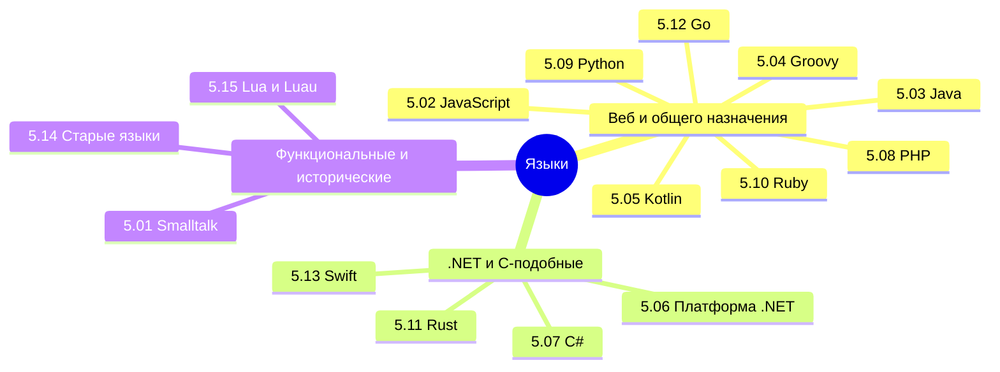

## Оглавление

Мы изучили, как пишут программы, теперь пора посмотреть, на чём пишут. Что используется для фронтенда, что для бэкенда - какие инструменты и технологии нужны в разных областях.

Технически, языки по большей части универсальны. Они обычно появляются с определённой целью (JavaScript для оживления страниц, C/C++ для системного программирования, а Java чтобы обезопасить и упростить разработку), но в дальнейшем развиваются, получая новый функционал, новые фичи и возможности.

В интернете часто можно найти громкие заголовки вроде «Какой язык программирования выбрать?» И почти всегда вы встретите от года в год одно и то же - Python лучше всех, JavaScript и Java нужны везде, а C# никому не нужен. Но не всё так просто.

Вообще, лучше воспользуйтесь содержанием или перейдите к Базе знаний. Но для удобства, я размещу здесь ссылки на основные главы раздела:

<ul>
  <li><a href="/it-knowledge-base/docs/Языки/5.01.%20Smalltalk/1">5.01. Smalltalk</a></li>
  Один из первых чисто объектно-ориентированных языков, реализующий принцип "всё — объект". Влияние на развитие парадигм ООП, среды разработки и динамических систем.
  
  <li><a href="/it-knowledge-base/docs/Языки/5.02.%20JavaScript/1">5.02. JavaScript</a></li>
  Язык сценариев, изначально предназначенный для веб-браузеров. Эволюция от простого скриптового инструмента до полноценной платформы (Node.js), поддержка асинхронности и функциональных паттернов.
  
  <li><a href="/it-knowledge-base/docs/Языки/5.03.%20Java/1">5.03. Java</a></li>
  Статически типизированный язык, ориентированный на переносимость благодаря виртуальной машине (JVM). Применение в корпоративных системах, Android-разработке, крупных серверных приложениях.
  
  <li><a href="/it-knowledge-base/docs/Языки/5.04.%20Groovy/1">5.04. Groovy</a></li>
  Динамический язык для JVM с синтаксисом, совместимым с Java. Используется для скриптинга, тестирования (Spock) и создания DSL. Поддерживает как императивный, так и функциональный стили.
  
  <li><a href="/it-knowledge-base/docs/Языки/5.05.%20Kotlin/1">5.05. Kotlin</a></li>
  Современный язык для JVM, Android и многоплатформенной разработки. Обеспечивает краткость кода, безопасность по ссылкам (null safety), совместимость с Java и поддержку корутин.
  
  <li><a href="/it-knowledge-base/docs/Языки/5.06.%20Платформа%20.NET/1">5.06. Платформа .NET</a></li>
  Многоязыковая среда выполнения от Microsoft. Включает Common Language Runtime (CLR), библиотеку классов (BCL) и поддержку языков C#, F#, VB.NET. Применяется в десктопных, веб- и облачных решениях.
  
  <li><a href="/it-knowledge-base/docs/Языки/5.07.%20CSharp/1">5.07. C#</a></li>
  Язык общего назначения, разработанный для платформы .NET. Эволюционирует с поддержкой функциональных возможностей, async/await, pattern matching, record types и других современных конструкций.
  
  <li><a href="/it-knowledge-base/docs/Языки/5.08.%20PHP/1">5.08. PHP</a></li>
  Язык, ориентированный на веб-разработку. Распространён в создании динамических сайтов и CMS. Отличается простотой внедрения, но требует внимания к архитектуре и безопасности.
  
  <li><a href="/it-knowledge-base/docs/Языки/5.09.%20Python/1">5.09. Python</a></li>
  Высокоуровневый интерпретируемый язык с акцентом на читаемость кода. Широко применяется в анализе данных, машинном обучении, автоматизации, веб-разработке и образовании.
  
  <li><a href="/it-knowledge-base/docs/Языки/5.10.%20Ruby/1">5.10. Ruby</a></li>
  Динамический, рефлексивный язык с гибким синтаксисом. Получил популярность благодаря фреймворку Ruby on Rails, способствующему быстрой разработке веб-приложений.
  
  <li><a href="/it-knowledge-base/docs/Языки/5.11.%20Rust/1">5.11. Rust</a></li>
  Системный язык, обеспечивающий безопасность памяти без сборщика мусора. Основан на концепции владения (ownership), используется в высоконагруженных и защищённых системах.
  
  <li><a href="/it-knowledge-base/docs/Языки/5.12.%20Go/1">5.12. Go</a></li>
  Язык от Google, ориентированный на простоту, производительность и конкурентность. Встроенная поддержка горутин и каналов делает его эффективным для микросервисов и распределённых систем.
  
  <li><a href="/it-knowledge-base/docs/Языки/5.13.%20Swift/1">5.13. Swift</a></li>
  Современный язык для разработки под экосистему Apple (iOS, macOS). Сочетает безопасность, высокую производительность и удобный синтаксис, заменяя устаревший Objective-C.
  
  <li><a href="/it-knowledge-base/docs/Языки/5.14.%20Старые%20языки/1">5.14. Старые языки</a></li>
  Старые языки - Ассемблер, Fortran, Си, Visual Basic, Cobol, Pascal, Lisp.
  
  <li><a href="/it-knowledge-base/docs/Языки/5.15.%20Lua%20и%20Luau/1">5.15. Lua и Luau</a></li>
  Язык скриптов Lua и его диалект Luau.
  
  <li><a href="/it-knowledge-base/docs/Языки/5.16.%20C++/1">5.16. C++</a></li>
  Классический язык системного программирования C++.
</ul>

Будут также и другие языки. Пока ещё проектирую.

Во-первых, запомните, что нужны все языки. Прошло уже то время, когда можно было бы знать только один язык и всё. Нет, вы изучите один язык, а другие узкие специалисты изучат, в отличие от вас, не только «ванильный» (базовый) язык, но и множество фреймворков, библиотек и ответвлений. Тогда шансов не будет. Поэтому если уж и изучать, то всё, и потом уже можно будет понять, что именно нравится больше.

Представьте, что вы изначально решили что вам нужен только Python (ведь он легче и популярнее, как пишут везде?), выбрали, но…как оказалось, таких же специалистов миллионы, и конкурировать сложно. Зато под руку попалась вакансия .NET разработчика, а вы даже не погружались в эту тему.

Если же вы изучите все, то без работы не останетесь, и будете независимы от «трендов». Учите всё.

Во-вторых, нужно понимать, что значит «знать язык». Если человек говорит «я умею программировать на Java», это не значит, что он знает его синтаксис и правила, нет. Это означает, что он умеет работать со Spring Boot, знаком хотя бы с несколькими фреймворками и библиотеками.

Как-то раз я затарился целым набором книг по программированию (около сотни), посвященной языкам JavaScript, Java, C#, Python. После прочтения, я понял, что ни в одной из них не погрузились так глубоко, как это нужно профессионалу - без фреймворков, без конкретных решений. JavaScript то и дело крутился вокруг DOM-дерева, C# вообще не рассказывает про MAUI, ASP.NET, WPF, и можно сказать контент везде одинаковый - это типы данных, операторы, циклы, исключения, коллекции, и основы ООП. Не хватало погружения в веб-сервисы, паттерны, десктопные/мобильные приложения, работу с памятью и потоками, и даже ORM. А ведь работать придётся именно с этим!

У вас не спросят, как работает switch, у вас спросят, какие поколения Garbage Collector-а вы знаете. И всё в таком духе. Поэтому, на собственном горьком опыте, я пишу, стараясь охватить то, что нужно.

Хотелось бы отметить, что если вам показалось, что какая-то деталь недостаточно раскрыта, это означает то, что вам нужно в неё погрузиться дополнительно, ведь о любом базовом классе или библиотеке можно писать килотоннами текста. Допустим, если вам понадобилось более углублённо изучить Angular, Spring или Swift, то придётся не просто искать литературу, а обратиться к англоязычной официальной (и «фанатской») документации. Я буду давать ссылки на ключевые источники, которые важно изучить. Будьте внимательны!

Данную книгу можно использовать как шпаргалку для программирования, чтобы уточнить способы реализации, определения и алгоритмы. К тому же, она должна оказать значительную поддержку на собеседованиях уровня от джуниора до синьора.

И да, не забудьте, что после изучения синтаксиса определённого языка, в идеале нужно попробовать написать несколько разных проектов с разными технологиями и подходами.

