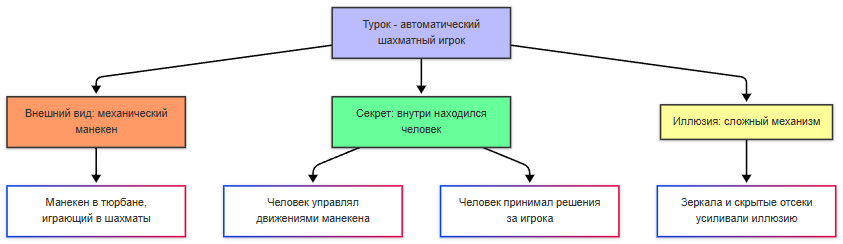
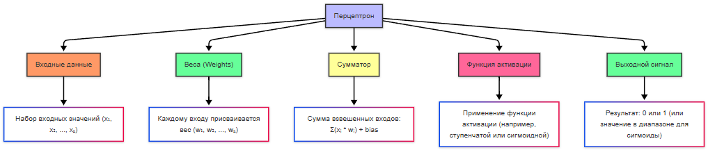
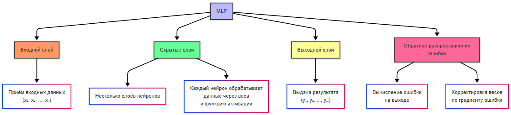
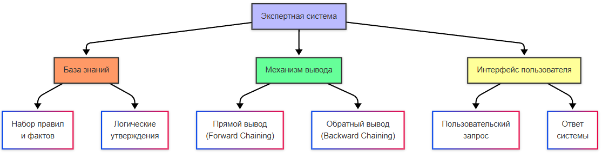
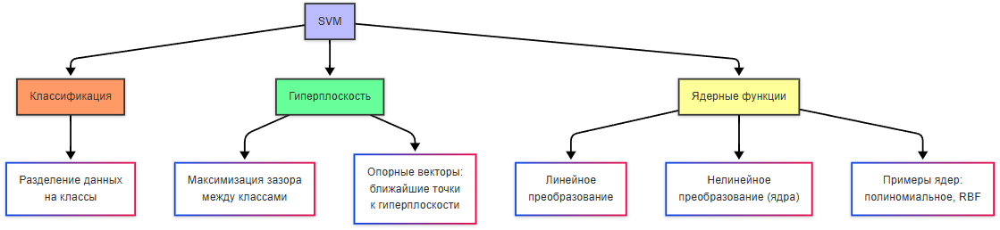

import ExternalPlayEmbed from '@site/src/components/ExternalPlayEmbed';


# История развития искусственного интеллекта

<div class="article-tags">

  <span class="tag tag-required">ОБЯЗАТЕЛЬНО</span>
  <span class="tag tag-beginner">ДЛЯ НОВИЧКОВ</span>
</div>

<span class="complexity-badge">Всем</span>

<ExternalPlayEmbed example="basics/tech-history-play" title="История технологий" minHeight={420} playProps={{ topic: 'ai-history' }} />

---

## История ИИ

### Перцептрон

Искусственный интеллект - понятие, которое пришло в индустрию намного раньше реального своего воплощения, ещё из области философии, а затем и массовой культуры. Человек всегда старался понять природу разума и создать его искусственный аналог.

> **Искусственный интеллект (ИИ)** — наука и технология создания машин (особенно компьютерных систем), способных выполнять задачи, требующие человеческого интеллекта: обучение, понимание языка, распознавание образов, принятие решений и др.

Ещё в древности люди задумывались о том, что такое разум, и можно ли его воссоздавать — этому способствовал сам процесс оживления неодушевлённых предметов, вроде скульптур, гомункулов, и наделение мышлением. И вопрос привёл к итогу - а реально ли создать механизм, аналогичный, или хотя бы приближённо напоминающий человеческий разум?

> Гомункул — историческое понятие из алхимии, означающее искусственно созданное существо, похожее на человека.

Прообразом ИИ является "Турок", автоматический шахматный игрок, созданный венгерским изобретателем Вольфгангом фон Кемпеленом в 1769 году. Это не ИИ - внутри находился человек, но у общества сильно разогрелся интерес. Потом, после изобретения механических калькуляторов и аналитических машин, появилась концепция программирования, и разумеется она предполагала, что в будущем прогресс технологий приведёт к обработке символов, музыки и текста.

> **Механический калькулятор** — устройство, выполняющее арифметические операции (сложение, вычитание, умножение) с помощью механических деталей (шестерён, рычагов). Предшественник современного компьютера (например, арифмометр или "Паскалина" Блеза Паскаля).

> **Аналитическая машина** — проект Чарльза Бэббиджа (XIX век), который считается концептуальным прообразом универсального программируемого компьютера. Имела все ключевые компоненты современного компьютера: арифметическое устройство ("мельница"), память ("склад"), устройство ввода/вывода и управление с помощью перфокарт.



В Дартмутском колледже в 1956 году был проведён семинар, который считается официальным рождением термина "искусственный интеллект" - участники семинара определили цель ИИ как создание машин, способных решать задачи, требующие человеческого интеллекта. И одним из первых таких успешных проектов стала программа Logic Theorist, которая могла доказывать математические теоремы, используя методы логического вывода. От простых вычислений это отличается логикой — это и есть мышление и рассуждение, что характерно интеллекту.

Идеи опередили железо: ЭВМ того времени по вычислительной мощности уступали современному карманному калькулятору, поэтому обучать большие нейросети на реальных данных было практически невозможно. Прорыв пришёл десятилетия спустя — с ростом памяти, GPU и объёмов цифровых данных.

> **Математическая теорема** — утверждение, истинность которого установлена путём доказательства, основанного на аксиомах и ранее доказанных теоремах. Это строгое, формально верифицируемое знание.

> **Мышление** — сложный процесс познавательной деятельности, включающий обработку информации, формирование понятий, решение задач, суждение и воображение.

> **Рассуждение** — компонент мышления, представляющий собой целенаправленный процесс вывода новых знаний, умозаключений или оценок на основе имеющихся предпосылок, правил и логики.

Учёные заметили, что мозг состоит из миллиардов нейронов, которые взаимодействуют через электрические сигналы. Каждый нейрон получает входные сигналы, обрабатывает их и передаёт выходной сигнал другим нейронам - такой процесс стал основой для создания искусственных моделей. 

Первая математическая модель нейрона была опубликована Уорреном Маккалоком и Уолтером Питтсом в 1943 году, описав, как нейрон может принимать входные данные, комбинировать их и выдавать результат. Хотя работа была чисто теоретической, она заложила основу. В 1958 году Фрэнк Розенблатт создал перцептрон - первую практическую модель искусственной нейронной сети. Он мог обучаться, распозначая простые образы - буквы и геометрические фигуры.

> **Перцептрон** — простейшая модель искусственного нейрона или однослойной нейронной сети.



---

### Зима ИИ и MLP

Но история распорядилась так, что энтузиазм погас - наступила "зима ИИ" - период снижения финансирования и интереса к исследованиям в области ИИ. В 1969 году Марвин Мински и Сеймур Пейперт опубликовали книгу "Perceptrons", в которой показали ограниченность однослойных перцептронов. Позднее, в 1980-х годах появились новые разработки - многослойные архитектуры и алгоритм распространения ошибки, которые позволили повысить уровень сложности решаемых задач.

Многослойные нейронные сети (MLP — Multilayer Perceptron) ввели скрытые слои между входными и выходными данными, что позволило обучаться распознавать **нелинейно** разделимые классы и более сложные паттерны (в отличие от однослойного перцептрона). Алгоритм обратного распространения ошибки (backpropagation) позволял эффективно обучать многослойные нейронные сети, корректируя веса на основе ошибок на выходе.

> **Многослойная нейронная сеть** — нейронная сеть, состоящая из последовательности слоёв искусственных нейронов (входной, один или несколько скрытых, выходной). Способна обучаться распознаванию сложных, нелинейных закономерностей, что недоступно однослойному перцептрону.

> **Алгоритм обратного распространения ошибки (Backpropagation)** — ключевой алгоритм обучения многослойных нейронных сетей. Вычисляет, как каждый вес сети влияет на итоговую ошибку, и корректирует веса в обратном направлении (от выхода ко входу), чтобы минимизировать эту ошибку.



---

### Экспертные системы

В 1980-х годах распространение получили экспертные системы - программы, которые имитировали знания экспертов в определённой области, используя правила и базы данных для решения задач - медицинская диагностика, инженерное проектирование. Это ещё были не нейросети, но это был важный шаг для развития прикладного ИИ.

> **Экспертная система** — компьютерная система, которая эмулирует способность эксперта-человека принимать решения в узкой предметной области. Состоит из базы знаний (правил и фактов) и механизма логического вывода.



Механизм вывода в экспертной системе осуществляет логический вывод на основе базы знаний. Прямой вывод - от фактов к выводам. Обратный вывод - от гипотезы к фактам. Пользователи же просто задавали вопросы и получали ответ от системы.

- *Логический вывод* — процесс получения новых логически вытекающих утверждений (заключений) из множества существующих утверждений (посылок) с помощью правил логики.
- *Прямой вывод* (или вывод от данных к цели) — стратегия логического вывода, при которой система начинает с известных фактов и применяет правила, пока не будет достигнута целевая цель. Работает "вперёд" от условий.
- *Обратный вывод* (или вывод от цели к данным) — стратегия, при которой система начинает с целевой гипотезы (что нужно доказать) и ищет правила и факты, которые могут её подтвердить. Работает "назад" от цели, часто используется в экспертных системах.

Символическая парадигма — это подход к созданию искусственного интеллекта, основанный на использовании формальных правил и символов. В этом подходе знания представляются в виде логических утверждений, правил и структур данных. Именно так работали экспертные системы и логические программы.

> **Формальные правила и символы** — основа символического ИИ. Символы представляют объекты или понятия, а правила определяют, как можно преобразовывать и комбинировать эти символы для получения новых знаний.

```
Символы → Правила → Вывод
```


---

### Смена парадигмы на вероятности

В 1990-х произошла смена парадигмы. Если раньше доминировала символическая, то теперь на первый план вышли статистические методы — это подходы к анализу данных, основанные на вероятностях и математической статистике. В отличие от символической парадигмы, статистические методы позволяют ИИ обучаться на данных, а не полагаться на заранее заданные правила. А это привело к какому выводу?

> **Статистический метод** — подход, который использует вероятностные модели и анализ данных для выявления закономерностей, предсказаний и принятия решений в условиях неопределённости. Лёг в основу машинного обучения.

Не нужно пытаться научить машину думать, нужно собрать статистику и выполнять анализ больших объёмов данных. Тогда не придётся писать сложные правила.

После этого ключевой областью исследования стало машинное обучение - вместо явного программирования систем, учёные начали разработку алгоритмов обучения на основе данных. Тогда появились такие инструменты, как деревья решений, метод опорных векторов и баесовские сети. Одним из первых практических применений стало распознавание образов - анализ изображений и видео, классификация рукописных символов и распознавания лиц (свёрточные нейронные сети).

> **Распознавание** — это процесс идентификации объектов, паттернов или информации в данных. Оно включает определение объектов, лиц или текста на фотографиях, преобразование устной речи в текст, анализ и понимание содержания текстовых данных.


Метод опорных векторов (SVM) — это алгоритм машинного обучения, используемый для задач классификации и регрессии. Он особенно эффективен для работы с высокоразмерными данными и малыми наборами данных. SVM строит гиперплоскость (в многомерном пространстве), которая разделяет данные на классы, и цель - найти такую гиперплоскость, которая максимизирует расстояние (зазор) между ближайшими точками разных классов (опорные векторы). Если данные не могут быть разделены линейно, SVM может использовать ядерные функции (например, полиномиальные или радиально-базисные), чтобы преобразовать данные в более высокое измерение, где они становятся линейно разделимыми.



> **Байесовская сеть** — это графическая модель, представляющая вероятностные зависимости между переменными. Она основана на теореме Байеса и используется для моделирования неопределённости и принятия решений. Байесовская сеть представляет собой ориентированный ациклический граф (DAG), где узлы — это случайные переменные, а рёбра — это условные зависимости между переменными. Теорема Байеса — это математическая формула, которая позволяет обновлять вероятности событий на основе новых данных. Она используется для работы с условными вероятностями.


> **Классификация** — это задача машинного обучения, в которой модель предсказывает метку класса для входных данных.

> **Линейная регрессия** — это один из самых простых и фундаментальных методов машинного обучения, используемый для решения задач регрессии (предсказания числовых значений). Она моделирует зависимость между входными переменными (признаками) и выходной переменной (целевой переменной) с помощью линейной функции.

> **Деревья решений** — это метод машинного обучения, который строит модель в виде дерева, где каждый узел представляет собой правило принятия решения, основанное на значениях входных признаков.

В 2000-х годах произошло сильное изменение мира - данные стали более доступными. Интернет сильно развивался, появились социальные сети, множество устройств и конечно - **Интернет вещей (IoT)**, который позволял использовать датчики и собирать информацию. Так появились большие данные - именно то, что требовалось для обучения. Развивались облачные технологии, увеличивалась вычислительная мощность, а ресурсы стали доступны более широкому кругу лиц. 

> **Анализ данных** — процесс исследования, очистки, преобразования и моделирования данных с целью извлечения полезной информации, формирования выводов и поддержки принятия решений.

> **Большие данные** — огромные массивы разнородных (структурированных и неструктурированных) данных, которые невозможно эффективно обрабатывать традиционными методами. Характеризуются "3V": Volume (объём), Velocity (скорость поступления), Variety (разнообразие).

В 2010-х появились важные достижения, такие как Word2Vec (алгоритм, который позволяет представлять слова в виде векторов в многомерном пространстве) и AlexNet (архитектура свёрточной нейронной сети).

> **Вектор** — это упорядоченный набор чисел, который можно представить как точку в многомерном пространстве. Слова, изображения, пользовательские предпочтения могут быть преобразованы в векторы. Многомерное пространство позволяет сравнивать объекты, вычислять расстояния между ними и находить схожие элементы.

---

### Генерация текста

Затем произошел скачок в обработке естественного языка (NLP). Появилась генерация текста, перевод языков и даже осмысленные диалоги, благодаря проектам GPT и BERT.

> **Естественный язык** — это язык, используемый людьми для общения (например, русский, английский). В отличие от формальных языков (например, программирование), естественные языки характеризуются неоднозначностью, контекстной зависимостью и богатством выражений. 

> **Обработка естественного языка (NLP)** — это область ИИ, которая занимается анализом, пониманием и генерацией текста.

> **GPT (Generative Pre-trained Transformer)** — это серия моделей, разработанных компанией OpenAI.

> **BERT (Bidirectional Encoder Representations from Transformers)** — это модель, разработанная Google, которая значительно улучшила качество понимания контекста в тексте.

---

#### Deep Blue и AlphaGo

Два знаковых матча показывают, как менялся подход к "умным" программам:

| | **Deep Blue (IBM, 1997)** | **AlphaGo (DeepMind, 2016)** |
|--|---------------------------|------------------------------|
| **Игра** | Шахматы | Го |
| **Масштаб вариантов** | Огромный, но перебираемый с эвристиками | Практически неперебираемый полным перебором |
| **Механизм** | Перебор ходов на текущей позиции, оценка позиции | Глубокие нейросети + обучение с подкреплением (миллионы партий с самой собой) |
| **Память о прошлом** | Нет: каждый ход — заново по текущей доске | Есть накопленная стратегия из self-play |
| **Урок** | Сила **расчёта** при полной информации | Сила **обучения на данных** там, где правила вручную не описать |

Deep Blue — классическая **реактивная машина**: она не "училась" на партиях Каспарова, а вычисляла лучший ход из миллионов вариантов. AlphaGo — уже **машинное обучение**: веса сети подстраивались по результатам игр. Подробнее о типах систем — в [Основных концепциях ИИ](/encyclopedia/6-ai/6-03-neyroseti/112).

После 2016 года развивались автономные системы — самоуправляемые автомобили, дроны и робототехника (Tesla, Waymo, Boston Dynamics). В 2020-х массово пошли большие языковые модели и их аналоги — тот ландшафт, который мы видим сегодня.

{/* sidebar-collections */}

---

## В подборках

Статья входит в [тематические подборки](/about/collections) и блок «С чего начать?» на [главной](/). Соседние шаги того же маршрута:

**История** — [Великие люди](/encyclopedia/9-spinoff/9-01-velikie-lyudi/1), [История развития интеграционных технологий](/encyclopedia/2-system-network/2-09-osnovy-integratsionnogo-vzaimodeystviya/114), [История развития аналитики в IT](/encyclopedia/7-project/7-04-analitika/1), [Развитие методологий разработки ПО](/encyclopedia/1-basics/1-07-nemnogo-o-proshlom/6), [История языка С](/encyclopedia/5-languages/5-16-starye-yazyki/c-language/1), [История ассемблерных языков](/encyclopedia/5-languages/5-16-starye-yazyki/assembler/1).

{/* /sidebar-collections */}

---
