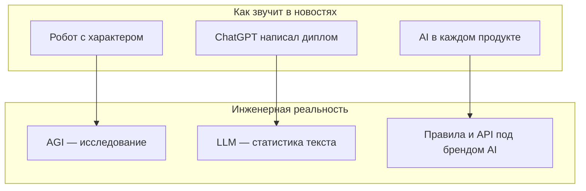
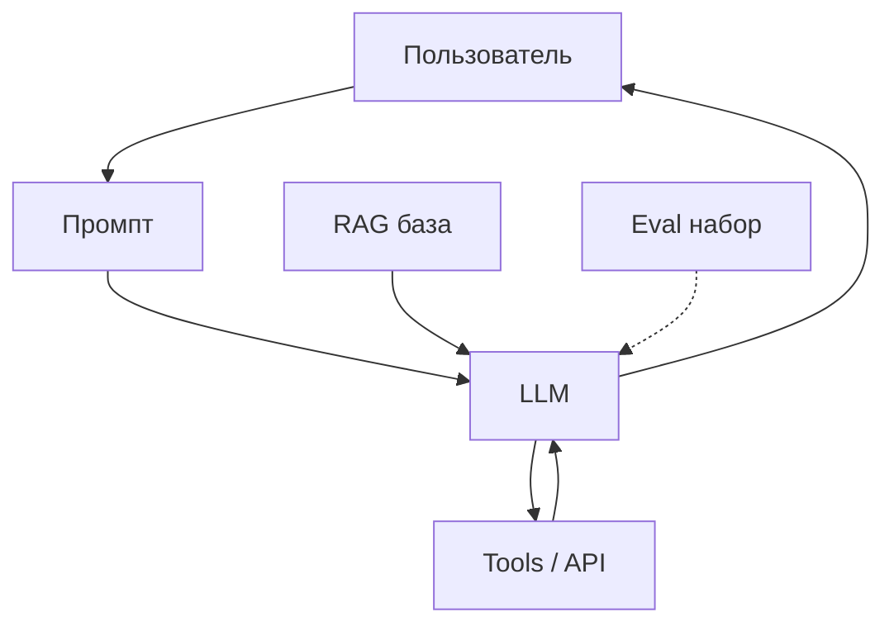
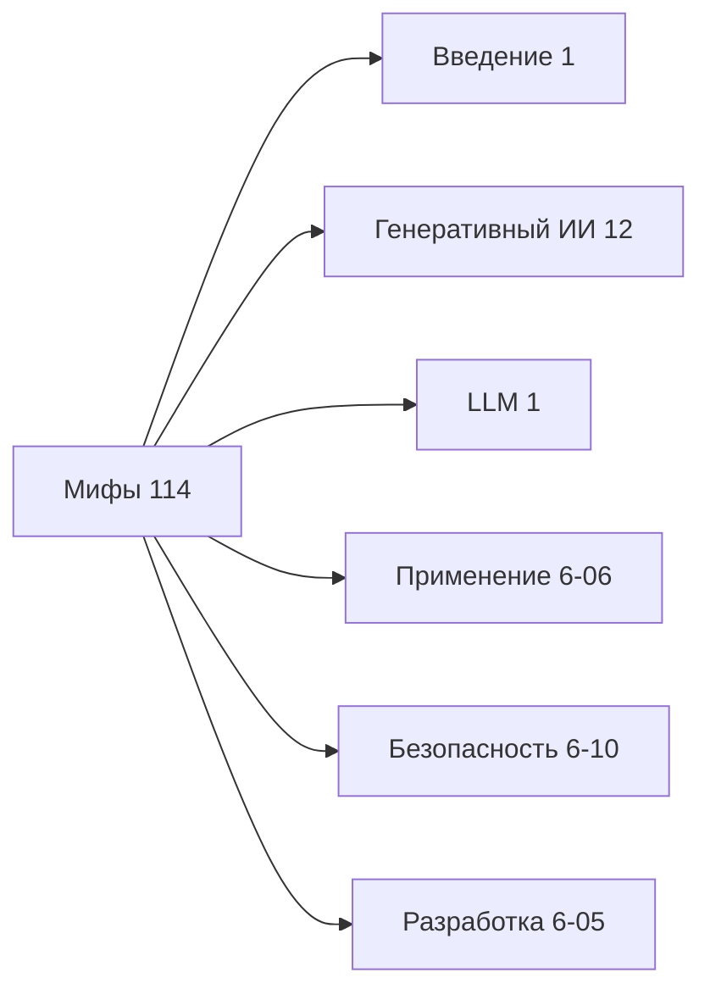
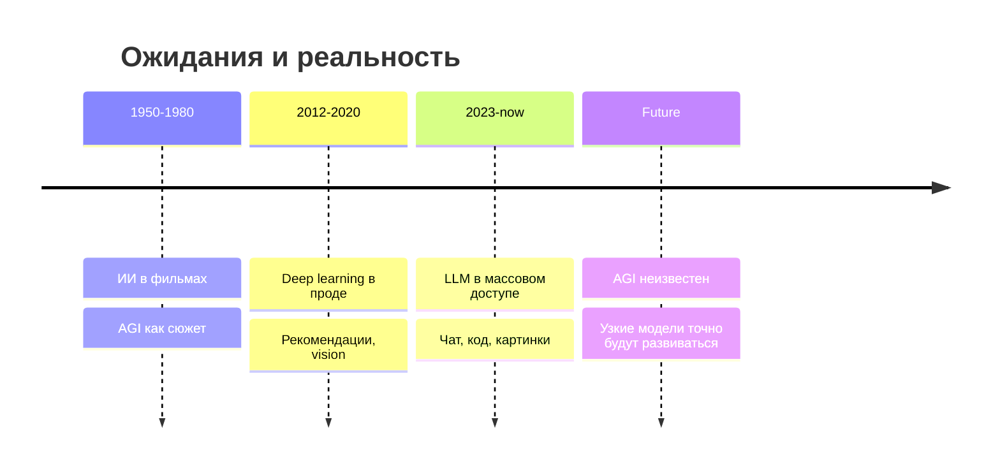
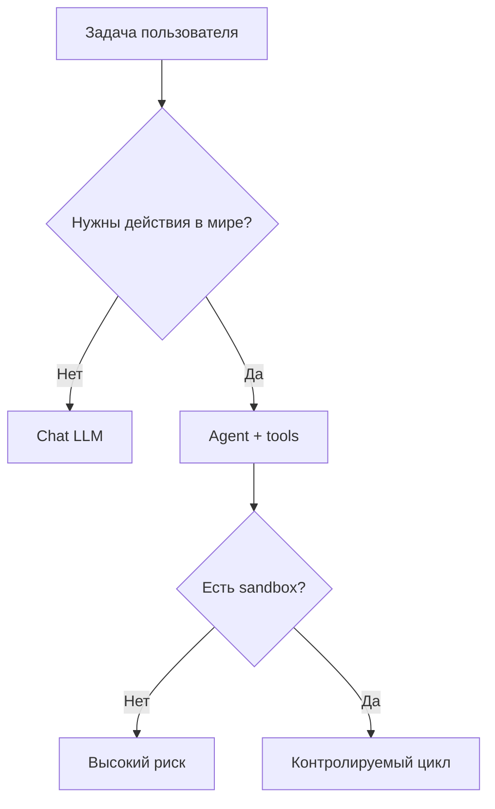

import ExternalPlayEmbed from '@site/src/components/ExternalPlayEmbed';

---

# Мифы и реальность ИИ

  ОБЯЗАТЕЛЬНО
  ДЛЯ НОВИЧКОВ

Всем

<ExternalPlayEmbed example="ai/myth-or-reality-quiz" title="Миф или реальность?" minHeight={420} />

---

Слово "ИИ" в новостях смешивает три разных смысла: фантастику про разумные машины, реальные программы на данных и рекламный ярлык на обычной автоматизации. Из-за этого новички ждут одного, а получают другое. Разочарование, лишние траты и опасные ошибки часто начинаются именно с неверной картины мира.

Эта статья собирает самые частые заблуждения и показывает, как проверять реальность за красивыми формулировками. Базовые определения — в [введении в ИИ](./1). Про работу и профессии — в [роли ИИ в трансформации профессий](/encyclopedia/6-ai/6-06-primenenie-ii/2). Про устройство моделей — в [больших языковых моделях](/encyclopedia/6-ai/6-04-modeli-i-instrumenty/1).

  
Краткий словарь

  

  <strong>ML</strong> (machine learning, машинное обучение) — программа учится на примерах и делает прогнозы на новых данных. 
  <strong>LLM</strong> (large language model, большая языковая модель) — нейросеть для текста; основа ChatGPT, Claude, DeepSeek и аналогов. 
  <strong>AGI</strong> (artificial general intelligence, общий искусственный интеллект) — гипотетический "человеческий" разум в машине; в продаже его нет. 
  <strong>Токен</strong> — кусок текста, с которым работает LLM; подробнее в [больших языковых моделях](/encyclopedia/6-ai/6-04-modeli-i-instrumenty/1). 
  <strong>Инференс</strong> — применение уже обученной модели к новому запросу (обычный чат). 
  <strong>Галлюцинация</strong> — правдоподобный, но ложный ответ модели.
  

---

## Три разных смысла слова "ИИ"

Когда вы слышите "искусственный интеллект", полезно сразу уточнить, о каком из трёх уровней идёт речь. От этого зависят ожидания, бюджет и риски.

| Смысл | Пример из культуры | Пример из жизни | Есть в продаже |
|-------|-------------------|-----------------|----------------|
| **AGI** — общий интеллект как у человека | Скайнет из "Терминатора", HAL 9000 | Исследовательские лаборатории, научные статьи | Нет |
| **Узкий ИИ** (ML, нейросети, LLM) | — | ChatGPT, фильтр спама, рекомендации в ленте, распознавание лиц | Да |
| **Маркетинговый "ИИ"** | — | "Умная" кнопка в приложении, "AI-фильтр" без модели | Часто внутри обычные правила if-else |

### Как новости усиливают путаницу

Типичный заголовок соединяет три разных факта в одну эмоцию:

- лаборатория опубликовала **benchmark** (тест качества модели);
- стартап добавил **кнопку "Ask AI"** в CRM;
- в соцсетях обсуждают **фильм про восстание машин**.

Benchmark — это измерение на заранее подготовленных задачах. Он не означает, что модель "понимает" мир как человек. Кнопка в CRM может быть простым вызовом чужого API. Фильм — художественный образ AGI, которого в продаже нет.

Если в описании продукта нет ни модели, ни данных, ни метрик качества — относитесь к слову "ИИ" на упаковке скептически. Подробнее про [AI-washing](/encyclopedia/6-ai/6-06-primenenie-ii/4).

### Мини-сценарий. Разбор рекламного слогана

**Ситуация.** В приложении для заметок появилась функция "AI Summary".

**Шаг 1.** Откройте документацию или FAQ продукта.

**Шаг 2.** Найдите ответы на вопросы:

- какая модель используется (название и версия);
- куда уходит текст заметки (облако, локально);
- сохраняются ли данные для обучения.

**Шаг 3.** Сравните с вашими требованиями к приватности — см. [политику данных](/encyclopedia/6-ai/6-10-bezopasnost-pri-rabote-s-ii/5).

**Шаг 4.** Если документации нет — считайте функцию "чёрным ящиком" и не отправляйте туда секреты.

---

## Откуда берутся мифы

Мифы о ИИ складываются из нескольких источников одновременно. Полезно видеть каждый отдельно.

| Источник | Что даёт аудитории | Типичная ошибка |
|----------|-------------------|-----------------|
| Кино и игры | Образ AGI с волей и целями | Ждать "личность" от чат-бота |
| Маркетинг | Слово AI на каждой второй функции | Думать, что внутри всегда нейросеть |
| Демо на конференциях | Идеальный сценарий без ошибок | Переносить на прод без тестов |
| Соцсети | Скриншот "идеального ответа" | Игнорировать провалы и галлюцинации |
| Хайп инвесторов | "Всё изменится за год" | Паника про "исчезновение профессий" |

Здоровый подход — отделять **демонстрацию** от **ежедневной работы**. Демо показывает лучший случай. В работе важны средний случай, худший случай и ответственность за ошибку.

---

## Миф 1. "ИИ думает и понимает как человек"

**LLM** (Large Language Model, большая языковая модель) на каждом шаге **предсказывает следующий токен** — следующий фрагмент текста — по статистике миллиардов страниц из интернета и книг. Ответ получается связным и полезным, потому что язык имеет устойчивые паттерны. Это статистика текста, сознание здесь не участвует.

### Что происходит внутри (упрощённо)

1. Ваш запрос режут на **токены** и превращают в числа.
2. Нейросеть считает вероятность каждого возможного следующего токена.
3. Выбирают токен (с учётом **temperature** и других параметров — см. [напоминалку по параметрам](/encyclopedia/6-ai/6-04-modeli-i-instrumenty/118)).
4. Добавляют его к контексту и повторяют, пока не сформируют ответ.

Модель не "видит" мир. Она работает только с тем текстом, который вы передали в **контекстное окно** — лимит токенов в одном запросе. Подробнее — [Контекст](./113).

| Кажется, что… | На деле |
|---------------|---------|
| Модель "знает" Python | Видела много кода при обучении; редкий API может перепутать |
| Модель "помнит" весь разговор | Видит только то, что помещается в контекстное окно |
| Модель "рассуждает" | Пишет текст в стиле рассуждения; см. [Reasoning-модели](/encyclopedia/6-ai/6-04-modeli-i-instrumenty/123) |
| Модель "понимает" вашу компанию | Знает только то, что вы явно вложили в промпт, RAG или файлы |

### Кейс. "Модель знает наш внутренний API"

**Факты.** Разработчик спросил ChatGPT про метод `legacySync()` в закрытом репозитории.

**Ответ модели.** Уверенное описание параметров и пример кода.

**Проверка.** Метода в репозитории не существовало — модель собрала правдоподобный текст из похожих названий в открытых проектах.

**Урок.** Закрытые системы модель "не знает", пока вы сами не подключите [RAG](/encyclopedia/6-ai/6-04-modeli-i-instrumenty/121) или не загрузите файлы.

### Что делать на практике

- факты — проверять по учебнику, документации, первоисточнику;
- код — запускать и тестировать;
- важные выводы — перепроверять человеком; см. [критический анализ результатов ИИ](/encyclopedia/6-ai/6-06-primenenie-ii/114);
- для узких знаний — подключать базу документов, а не полагаться на "память" модели.

---

## Миф 2. "Скоро появится Скайнет"

**AGI** — исследовательская цель и сюжет фильмов. Коммерческие системы решают **узкие** задачи: текст, картинки, классификация, рекомендации. Сами по себе они не ставят целей и не выходят в сеть без кода разработчика.

Образ "машины захватят мир" смешивает два разных сюжета:

- **фантастический AGI** с собственными целями;
- **реальные инструменты**, которые выполняют команды людей или кода.

Сегодня второе уже работает в продакшене. Первого в продаже нет, и сроки его появления — предмет споров исследователей, а не прайс-листа.

### Реальные риски сегодня

| Риск | Пример | Где читать |
|------|--------|------------|
| Утечка данных | Пароль или ПДн в бесплатном чате | [Политика данных](/encyclopedia/6-ai/6-10-bezopasnost-pri-rabote-s-ii/5) |
| Ошибочное решение | Человек поверил [галлюцинации](/encyclopedia/6-ai/6-06-primenenie-ii/114) | [Критический анализ](/encyclopedia/6-ai/6-06-primenenie-ii/114) |
| Опасное действие агента | [Агент](/encyclopedia/6-ai/6-04-modeli-i-instrumenty/116) с доступом к терминалу выполнил `rm -rf` | [Безопасность](/encyclopedia/6-ai/6-10-bezopasnost-pri-rabote-s-ii/1) |
| Deepfake и мошенничество | Подделка голоса руководителя | [Нейроконтент](/encyclopedia/6-ai/6-07-vayb-koding-i-neurokontent/intro) |
| Зависимость от одного провайдера | API подорожал, продукт встал | [Сколько стоит ИИ](/encyclopedia/6-ai/6-04-modeli-i-instrumenty/126) |

С этими рисками работают политики безопасности, юристы и инженерия — см. [безопасность при работе с ИИ](/encyclopedia/6-ai/6-10-bezopasnost-pri-rabote-s-ii/1).

### Кейс. Агент с доступом к файлам

**Ситуация.** Стартап подключил LLM-агента к папке проекта и дал право запускать shell-команды "для автоматизации".

**Что пошло не так.** Промпт пользователя был двусмысленным; агент интерпретировал "очисти временные файлы" как удаление каталога с бэкапами.

**Вывод.** Риск связан с **правами доступа и процессом**, а не с "восстанием машин". Нужны sandbox, подтверждение опасных команд и логирование — см. [AgentOps](/encyclopedia/6-ai/6-08-agentops/intro).

---

## Миф 3. "ИИ заменит все профессии через год"

ИИ ускоряет **отдельные задачи** внутри профессии. Целая профессия исчезает редко и обычно по многим причинам одновременно (рынок, регуляция, автоматизация без LLM).

### Что меняется по областям

| Область | Что делает ИИ хорошо | Что остаётся людям | Типичная ошибка ожиданий |
|---------|---------------------|-------------------|-------------------------|
| Разработка | Черновик кода, тесты, документация | Архитектура, ревью, ответственность за прод | "Copilot заменит senior" |
| Медицина | Подсказки по снимкам, черновики протоколов | Диагноз, ответственность, этика | "Модель поставит диагноз без врача" |
| Образование | Объяснения, черновики, примеры | Оценка мастерства, [академическая честность](/encyclopedia/6-ai/6-06-primenenie-ii/116) | "ChatGPT сдаст экзамен за всех" |
| Юриспруденция | Поиск по документам, черновики | Стратегия, ответственность перед судом | "LLM заменит адвоката" |
| Дизайн | Варианты макетов, мудборды | Бренд, исследование пользователей | "Генератор картинок = дизайнер" |
| Поддержка | FAQ, классификация обращений | Эскалация, эмпатия, нестандартные кейсы | "Бот закроет 100% тикетов" |

Подробнее — [роль ИИ в профессиях](/encyclopedia/6-ai/6-06-primenenie-ii/2).

### Пошаговый сценарий. Оценка "заменят ли мою роль"

**Шаг 1.** Выпишите 10 типичных задач вашей недели.

**Шаг 2.** Для каждой отметьте:

- повторяемость (шаблон или уникальный кейс);
- цена ошибки (низкая / высокая);
- нужна ли юридическая или медицинская ответственность.

**Шаг 3.** ИИ чаще забирает **повторяемые черновики** с низкой ценой ошибки при человеческой проверке.

**Шаг 4.** Задачи с высокой ответственностью остаются у людей, но меняется формат работы (меньше рутины, больше контроля качества).

**Шаг 5.** Обновите навыки: промпт + проверка фактов + инструменты ([API](/lab/Примеры/1149), [RAG](/encyclopedia/6-ai/6-04-modeli-i-instrumenty/121)).

---

## Миф 4. "Если модель говорит уверенно — значит, права"

**Галлюцинация** — правдоподобный, но **ложный** ответ: выдуманная ссылка, несуществующий метод API, "факт" без основания. Тон голоса с истинностью не связан. Модель оптимизировали на **правдоподобный текст**, а не на гарантированную истину.

### Виды галлюцинаций

| Тип | Как выглядит | Пример |
|-----|--------------|--------|
| Фактическая | Уверенная дата, имя, цифра | "Закон принят 14 марта 2019" — закона нет |
| Библиографическая | Ссылка на статью | DOI ведёт в никуда |
| Кодовая | Несуществующий метод | `client.fastSync()` в официальном SDK |
| Контекстная | Ответ про "ваш" проект | Детали, которых не было в промпте |
| Логическая | Красивая цепочка с ошибкой | Особенно в [reasoning-блоках](/encyclopedia/6-ai/6-04-modeli-i-instrumenty/123) |

### Красные флаги в ответе

Перепроверяйте, если в ответе есть:

- точные даты, номера законов, цитаты без источника;
- код, который вы не запускали;
- сведения о вашей закрытой системе, которой модель не видела;
- список "лучших" инструментов без ссылок на документацию;
- медицинские или юридические выводы без оговорки "нужен специалист".

### Кейс. Выдуманная судебная практика

**Запрос.** "Приведи три решения суда по спору X в РФ."

**Ответ.** Три номера дел с уверенными формулировками.

**Проверка.** Поиск по номерам дел — два не существуют, третий относится к другой теме.

**Урок.** Для права нужны базы данных и юрист, а не только LLM — см. [право в РФ](/encyclopedia/6-ai/6-06-primenenie-ii/115).

---

## Миф 5. "Надпись AI значит, что внутри нейросеть"

Под маркетинговым "ИИ" может скрываться несколько разных реализаций. Слово на упаковке не заменяет техническое описание.

| Что может быть внутри | Признаки | Как проверить |
|----------------------|----------|---------------|
| Настоящая ML-модель | Есть версия модели, метрики | Документация, whitepaper |
| Правила if-else | Одинаковый вход → одинаковый выход без "творчества" | Повторите запрос 20 раз |
| Чужой API | В сетевых запросах виден OpenAI/Anthropic | DevTools, политика subprocessors |
| Гибрид | Правила + маленькая модель | Описание pipeline |
| Чистая реклама | Нет API, нет модели, только слово AI | Скепсис |

### Вопросы вендору

- какая модель и версия;
- на каких данных обучали;
- какие метрики качества на **вашей** задаче;
- куда уходят пользовательские данные;
- кто ответственен за ошибку по договору.

Подробнее про маркетинговый ярлык — [AI-washing](/encyclopedia/6-ai/6-06-primenenie-ii/4) и [классификацию моделей](./112).

---

## Миф 6. "В бесплатный чат можно слать что угодно"

Публичные версии ChatGPT, Claude, DeepSeek и аналогов **могут использовать** ваши диалоги для улучшения модели, если вы не отключили это в настройках и не перешли на корпоративный тариф.

**Не отправляйте в free-чат**

- пароли, ключи API, содержимое `.env`;
- персональные данные клиентов (ФИО, телефоны, медкарты);
- исходный код закрытого продукта;
- коммерческие секреты и непубличные финансовые данные;
- сканы паспортов и договоров с персональными данными.

**Можно** (с осторожностью)

- учебные вопросы без секретов;
- обезличенные фрагменты кода;
- публичные тексты документации.

См. [ИИ в учёбе](/encyclopedia/6-ai/6-06-primenenie-ii/116), [политику данных](/encyclopedia/6-ai/6-10-bezopasnost-pri-rabote-s-ii/5), [право в РФ](/encyclopedia/6-ai/6-06-primenenie-ii/115).

### Сценарий. Разработчик и секрет в чате

**Шаг 1.** Нужно починить ошибку в коде, который использует `STRIPE_SECRET_KEY`.

**Шаг 2.** Копировать `.env` в ChatGPT Free — **нельзя**.

**Шаг 3.** Вместо этого:

- замените секрет на плейсхолдер `sk_test_XXXX`;
- опишите ошибку текстом;
- или используйте [локальную модель](/encyclopedia/6-ai/6-05-razrabotka-ii/113) / корпоративный контур.

**Шаг 4.** Если секрет уже утёк — **отзовите ключ** в панели провайдера и выпустите новый.

---

## Миф 7. "Модель запоминает каждое моё сообщение навсегда"

Обычный чат **не меняет веса** модели от вашей фразы. Текст попадает в **контекст текущей сессии** и, возможно, в логи провайдера по политике сервиса.

**Fine-tuning** (дообучение) — отдельный дорогой процесс на подготовленном наборе примеров. Это не "запомнить одну фразу из чата". См. [обучение на базе готовой модели](/encyclopedia/6-ai/6-02-mashinnoe-obuchenie/3).

| Механизм | Что происходит | Долговечность |
|----------|----------------|---------------|
| Контекст чата | Текст в рамках одного запроса/сессии | До лимита токенов |
| Логи провайдера | Хранение по политике сервиса | Зависит от тарифа |
| "Память" в продукте | Явно сохранённые факты | Пока не удалите |
| Custom GPT / файлы | Загруженные документы | Пока не обновите |
| Fine-tuning | Новые веса модели | Отдельный релиз модели |

Исключение — функции "память" в продукте или Custom GPT с загруженными файлами. Читайте политику сервиса.

---

## Миф 8. "Локальная модель = полная анонимность"

[Локальный запуск](/encyclopedia/6-ai/6-05-razrabotka-ii/113) через Ollama или LM Studio не отправляет промпт в облако — если вы сами не включили синхронизацию и не поставили расширения, которые шлют код наружу.

При этом остаются другие риски:

- модель всё равно может галлюцинировать;
- логи на диске и бэкапы — ваша ответственность;
- железо и электричество стоят денег — см. [сколько стоит ИИ](/encyclopedia/6-ai/6-04-modeli-i-instrumenty/126);
- слабая локальная модель может ошибаться чаще сильной облачной;
- плагины IDE иногда отправляют фрагменты кода на сервер — читайте настройки.

### Чек-лист локального контура

1. Отключена телеметрия и облачные фичи в клиенте.
2. Нет расширений браузера/IDE с отправкой кода наружу.
3. Диск с логами зашифрован или очищается по политике.
4. Есть план обновления модели (безопасность, качество).

---

## Миф 9. "Промпт-инженеру не нужен код"

Умение **сформулировать задачу** для LLM полезно всем. Шаблоны — [Prompt engineering — библиотека](/lab/Примеры/1150), теория — [Контекст](./113).

Для **продакшена** (рабочего сервиса для пользователей) нужны дополнительные слои:

- [API](/lab/Примеры/1149) и интеграция;
- [RAG](/encyclopedia/6-ai/6-04-modeli-i-instrumenty/121) по документам;
- eval (проверка качества на эталонных запросах);
- мониторинг стоимости и latency;
- [безопасность](/encyclopedia/6-ai/6-10-bezopasnost-pri-rabote-s-ii/intro);
- [function calling](/encyclopedia/6-ai/6-05-razrabotka-ii/123) для точных действий.

Каркас — [семь слоёв LLM-стека](/encyclopedia/6-ai/6-05-razrabotka-ii/119).

Промпт — только один из блоков схемы.

---

## Миф 10. "Программисты и математики больше не нужны"

ИИ ускоряет черновик и объяснения, но **не снимает** необходимость понимать код, систему и место ошибки. Риск [вайб-кодинга](/encyclopedia/6-ai/6-07-vayb-koding-i-neurokontent/1) — сломанный прод без понимания.

| Задача | Достаточно чата | Нужна инженерия |
|--------|----------------|-----------------|
| Объяснить синтаксис | Часто да | — |
| Написать скрипт на 20 строк | Часто да | Желательна проверка |
| Спроектировать микросервисы | Черновик идей | Да |
| Обучить свою модель | Нет | ML + математика |
| Запустить prod с SLA | Нет | DevOps, тесты, безопасность |

- Для **своих моделей** нужны ML и математика — см. [машинное обучение](/encyclopedia/6-ai/6-02-mashinnoe-obuchenie/1).
- Для **чата с GPT** достаточно логики, проверки фактов и базового [Python для API](/lab/Примеры/1149).

---

## Миф 11. "Большая модель всегда лучше маленькой"

Размер модели (число параметров) влияет на качество, но не единолично определяет результат.

| Фактор | Влияние |
|--------|---------|
| Задача | Для классификации спама хватит маленькой модели |
| Данные задачи | RAG + средняя модель часто побеждает голую giant-модель |
| Latency | Большая модель медленнее |
| Стоимость | Больше параметров → дороже инференс |
| Контекст | Длинный контекст важнее "бренда" модели для документов |

См. [как выбрать модель](/encyclopedia/6-ai/6-04-modeli-i-instrumenty/125).

---

## Миф 12. "ИИ объективен и без предубеждений"

Модель обучают на текстах людей. В данных есть стереотипы, перекосы выборки и устаревшие нормы. LLM может воспроизводить их в ответах.

**Что помогает**

- разнообразные источники в RAG;
- явные правила в system prompt;
- human review на чувствительных темах;
- тестовый набор (eval) с проверкой bias на ваших кейсах.

---

## Миф 13. "Open source модель = бесплатно и без ограничений"

Открытые веса (Llama, Mistral, Qwen и др.) снимают часть зависимости от одного вендора, но:

- **железо** и электричество платите вы;
- **лицензия** может запрещать коммерческое использование или требовать раскрытия;
- **качество** зависит от квантизации и размера;
- **безопасность** — ваши патчи и обновления.

См. [локальные модели](/encyclopedia/6-ai/6-05-razrabotka-ii/113) и [стоимость](/encyclopedia/6-ai/6-04-modeli-i-instrumenty/126).

---

## Миф 14. "ИИ заменит Google-поиск полностью"

LLM хорошо **синтезирует** ответ из того, что "видела" при обучении, но:

- не знает события после даты среза обучения (без browsing/tools);
- может выдумать источник;
- не показывает полный список страниц как поисковик.

Для актуальных фактов нужны **поиск + проверка** или [RAG](/encyclopedia/6-ai/6-04-modeli-i-instrumenty/121) / tools с доступом к интернету.

---

## Миф 15. "Достаточно одного промпта — и продукт готов"

Промпт — старт, не архитектура. Продукт включает:

- выбор модели и fallback при отказе API;
- лимиты токенов и бюджета;
- модерацию и фильтры;
- логирование без секретов;
- юридические тексты и согласие на обработку данных.

См. [разработку с ИИ](/encyclopedia/6-ai/6-05-razrabotka-ii/intro).

---

## Сводная таблица мифов

| № | Миф (кратко) | Реальность (кратко) | Действие |
|---|--------------|---------------------|----------|
| 1 | Думает как человек | Предсказывает токены | Проверять факты и код |
| 2 | Скоро AGI | Узкие задачи сегодня | Смотреть на права доступа |
| 3 | Все профессии исчезнут | Меняются задачи | Учиться работать с инструментом |
| 4 | Уверенный тон = правда | Галлюцинации | Источники, тесты |
| 5 | AI = нейросеть | Может быть правило | Спрашивать вендора |
| 6 | Free-чат безопасен | Логи и обучение | Не слать секреты |
| 7 | Запомнит навсегда | Контекст и политика | Читать настройки |
| 8 | Локально = анонимно | Логи и плагины | Чек-лист контура |
| 9 | Только промпт | Нужен стек | API, RAG, eval |
| 10 | Код не нужен | Нужен для prod | Инженерия и ML |
| 11 | Больше = лучше | Зависит от задачи | [Выбор модели](/encyclopedia/6-ai/6-04-modeli-i-instrumenty/125) |
| 12 | Объективен | Bias из данных | Eval и review |
| 13 | Open source free | Железо и лицензия | Считать TCO |
| 14 | Заменит поиск | Нужны источники | RAG / tools |
| 15 | Один промпт = продукт | Нужна система | [LLM-стек](/encyclopedia/6-ai/6-05-razrabotka-ii/119) |

---

## Кейсы из практики

### Кейс A. Студент и "готовый диплом"

**Ожидание.** ChatGPT напишет диплом, который примут без правок.

**Реальность.** Текст связный, но с выдуманными ссылками и слабой связью с методикой кафедры.

**Итог.** Нарушение [академической честности](/encyclopedia/6-ai/6-06-primenenie-ii/116), пересдача. ИИ — черновик и tutor, не автор.

### Кейс B. Малый бизнес и "AI-CRM"

**Ожидание.** "AI" сам ведёт клиентов.

**Реальность.** Внутри — шаблонные письма через API без CRM-интеграции.

**Итог.** Потрачен бюджет на маркетинг. Нужна была обычная автоматизация + человек на сложные сделки.

### Кейс C. Разработчик и "идеальный рефакторинг"

**Ожидание.** Модель перепишет legacy без регрессий.

**Реальность.** Код компилируется, тесты не покрыты, edge case сломан.

**Итог.** Рефакторинг принят только после тестов и ревью — см. [генерацию кода](/encyclopedia/6-ai/6-04-modeli-i-instrumenty/117).

### Кейс D. Медицинский симптом в чате

**Ожидание.** Быстрый диагноз.

**Реальность.** Правдоподобный, но опасный совет.

**Итог.** Обращение к врачу обязательно; LLM — справочник общих сведений, не клиника.

---

## Пошаговые сценарии проверки

### Сценарий 1. Новость "ИИ превзошёл человека"

1. Найдите **первоисточник** (статья, PDF benchmark).
2. Прочитайте, **на какой задаче** измеряли (узкая или общая).
3. Сравните с **вашим** use case.
4. Проверьте, не PR ли это компании перед раундом инвестиций.

### Сценарий 2. Покупка B2B "AI-платформы"

1. Запросите пилот на **ваших** данных.
2. Зафиксируйте метрики до/после (время, ошибки, стоимость).
3. Проверьте DPA и место хранения данных.
4. Сравните с альтернативой "обычная LLM + RAG" — см. [121](/encyclopedia/6-ai/6-04-modeli-i-instrumenty/121).

### Сценарий 3. Ребёнок и чат-бот

1. Объясните, что бот **не человек** и может ошибаться.
2. Запретите отправку адреса, школы, фото документов.
3. Используйте семейные/учебные режимы, если есть.
4. Обсуждайте ответы вместе — см. [ИИ в учёбе](/encyclopedia/6-ai/6-06-primenenie-ii/116).

---

## FAQ

### Можно ли "доверять" ChatGPT?

Доверять как **помощнику для черновиков** — да, с проверкой. Доверять как **источнику фактов без проверки** — нет.

### ИИ уже сознательный?

Нет. Современные системы не обладают сознанием в философском или медицинском смысле. Они выполняют вычисления над данными.

### Заменит ли ИИ программистов?

Сократит часть рутины и изменит требования к навыкам. Полная замена профессии маловероятна в обозримом горизонте — см. [миф 3](#миф-3-ии-заменит-все-профессии-через-год) и [роль в профессиях](/encyclopedia/6-ai/6-06-primenenie-ii/2).

### Безопасно ли учиться с LLM?

Да, если не сдавать чужой текст как свой и проверять факты. См. [ИИ в учёбе](/encyclopedia/6-ai/6-06-primenenie-ii/116).

### Чем отличается ML от LLM?

**ML** — общий подход обучения на данных. **LLM** — частный случай ML для текста. См. [введение](./1) и [классификацию](./112).

### Почему модель противоречит сама себе?

Разные прогоны с sampling дают разные токены. Для стабильности снижайте temperature — [118](/encyclopedia/6-ai/6-04-modeli-i-instrumenty/118).

### Нужен ли платный ChatGPT?

Для учёбы часто хватает free tier с лимитами. Для работы с длинным контекстом и сильными моделями — см. [стоимость](/encyclopedia/6-ai/6-04-modeli-i-instrumenty/126).

### Что такое AGI простыми словами?

Гипотетический интеллект, который решает **любые** интеллектуальные задачи на уровне человека. Такого продукта нет.

### Может ли модель "обидеться"?

Нет. Это стиль текста, имитирующий человеческие реакции. За ответом нет субъекта с эмоциями.

### Как объяснить ИИ ребёнку 10 лет?

"Программа, которая много читала тексты и научилась угадывать следующее слово. Она полезная, но может ошибаться — как калькулятор, если нажать не те кнопки."

---

## Чек-лист здравого скептицизма

1. Задача **узкая** (перевод, классификация) или заявлен "универсальный разум"?
2. Есть **измеримое качество** (метрики, A/B) или только красивое демо?
3. Кто **ответственен** за ошибку — человек или компания, а не "нейросеть"?
4. Куда **утекают данные** из чата?
5. Ответ **проверен** источником, запуском кода или экспертом?
6. Есть ли **plan B** при падении API?
7. Соответствует ли решение **закону** о персональных данных?
8. Понятна ли **полная стоимость** (токены, люди на проверке, железо)?

---

## Типичные ошибки новичков

| Ошибка | Последствие | Как исправить |
|--------|-------------|---------------|
| Слепо копировать код | Уязвимости в проде | Тесты, ревью |
| Одна модель на всё | Дорого и медленно | [Выбор модели](/encyclopedia/6-ai/6-04-modeli-i-instrumenty/125) |
| Игнорировать галлюцинации | Репутационный ущерб | [Критический анализ](/encyclopedia/6-ai/6-06-primenenie-ii/114) |
| Секреты в free-чат | Утечка ключей | Локально / enterprise |
| Ждать AGI | Паралич вместо автomation | Узкие задачи с ROI |

---

## Связь с другими разделами энциклопедии

- **Теория** — [генеративный ИИ](./12), [нейросети](/encyclopedia/6-ai/6-03-neyroseti/1);
- **Инструменты** — [модели и API](/encyclopedia/6-ai/6-04-modeli-i-instrumenty/intro);
- **Практика** — [lab/Примеры/1150](/lab/Примеры/1150), [1149](/lab/Примеры/1149);
- **Этика и право** — [115](/encyclopedia/6-ai/6-06-primenenie-ii/115), [116](/encyclopedia/6-ai/6-06-primenenie-ii/116).

---

## Куда читать дальше

- [Генеративный ИИ](./12) — текст, код, картинки;
- [Большие языковые модели](/encyclopedia/6-ai/6-04-modeli-i-instrumenty/1) — как устроен ChatGPT;
- [Как выбрать модель](/encyclopedia/6-ai/6-04-modeli-i-instrumenty/125) — облако или локально;
- [Reasoning-модели](/encyclopedia/6-ai/6-04-modeli-i-instrumenty/123) — когда "рассуждение" в модели оправдано;
- [Критический анализ](/encyclopedia/6-ai/6-06-primenenie-ii/114) — как не попасться на галлюцинацию;
- [Мифы в медиа и маркетинге](/encyclopedia/6-ai/6-06-primenenie-ii/4) — AI-washing.

---

## Глубже про каждый миф. Разбор для самостоятельной практики

Ниже — дополнительные упражнения. Их можно проходить по одному в неделю, сравнивая свои ожидания с тем, что показывает реальный эксперимент.

### Упражнение к мифу 1. "Понимание" языка

**Цель.** Увидеть разницу между связным текстом и знанием факта.

**Шаг 1.** Спросите модель про редкую функцию в библиотеке, которую вы **знаете**, что устарела (вы сами проверили в docs).

**Шаг 2.** Спросите ту же модель про **несуществующую** функцию с правдоподобным именем.

**Шаг 3.** Сравните уверенность тона в обоих ответах.

**Ожидаемый результат.** Тон часто одинаково уверенный. Вывод: связность текста отделена от истинности.

**Связанные материалы.** [Трансформеры и NLP](/encyclopedia/6-ai/6-09-transformery-i-nlp/1), [большие языковые модели](/encyclopedia/6-ai/6-04-modeli-i-instrumenty/1).

### Упражнение к мифу 2. Карта рисков без фантастики

Нарисуйте для своего проекта таблицу из трёх колонок:

| Действие системы | Кто даёт разрешение | Что будет при ошибке |
|------------------|---------------------|----------------------|
| Ответ в чате | Пользователь отправил промпт | Неверный совет |
| Вызов API | Код разработчика | Неверные данные в CRM |
| Shell-команда | Агент + права ОС | Потеря файлов |

Если в третьей колонке "катастрофа" — сначала убирайте права, потом добавляйте "умность". См. [агенты](/encyclopedia/6-ai/6-04-modeli-i-instrumenty/116).

### Упражнение к мифу 3. Декомпозиция профессии "аналитик"

| Подзадача | ИИ сегодня | Человек |
|-----------|------------|---------|
| Черновик SQL | Хорошо с проверкой | Ревью, оптимизация |
| Интервью стейкхолдера | Плохо | Основная работа |
| Презентация выводов | Черновик слайдов | Ответственность за решение |
| Согласование с legal | Нельзя без юриста | Обязательно |

Такую таблицу полезно построить для **своей** роли — не для абстрактного "всех профессий".

### Упражнение к мифу 4. Охота на галлюцинации

**Правило.** Любой ответ с числом, датой или URL — помечайте "не проверено", пока не проверите.

**Проверка URL**

1. Откройте ссылку в браузере.
2. Если 404 — зафиксируйте галлюцинацию в личном журнале ошибок модели.
3. Переформулируйте запрос с требованием "только если уверен; иначе скажи не знаю".

Модели можно **снизить** галлюцинации промптом, но не **обнулить** — см. [критический анализ](/encyclopedia/6-ai/6-06-primenenie-ii/114).

### Упражнение к мифу 5. Разбор "AI feature" в приложении

Выберите любое приложение на телефоне с надписью AI.

**Вопросы**

- Есть ли офлайн-режим (признак локальной модели)?
- Меняется ли ответ при повторе того же ввода?
- Есть ли в политике конфиденциальности упоминание OpenAI/Anthropic/Google?

Запишите вывод одним предложением: "Скорее всего внутри …".

### Упражнение к мифу 6. Классификация данных

Составьте три списка для своей работы или учёбы:

**Зелёный** — можно в публичный чат (обезличено).

**Жёлтый** — только enterprise / локально.

**Красный** — никогда в чужой облачный чат.

Примеры красного:

- seed-фразы криптокошельков;
- production database connection string;
- переписка клиента с NDA.

См. [безопасность 5](/encyclopedia/6-ai/6-10-bezopasnost-pri-rabote-s-ii/5).

### Упражнение к мифу 7. Где "живёт" ваш текст

После сессии в веб-чате ответьте письменно:

1. Что осталось **только у меня в голове**?
2. Что могло попасть в **логи провайдера**?
3. Что попало в **историю браузера**?

Если пункт 2 неизвестен — перечитайте Terms of Service выбранного сервиса.

### Упражнение к мифу 8. Аудит локальной установки

Если используете Ollama:

1. `ollama list` — какие модели скачаны.
2. Проверьте, не стоит ли IDE-плагин с "cloud enhance".
3. Убедитесь, что бэкап диска не уходит в публичное облако без шифрования.

Документация — [локальные модели](/encyclopedia/6-ai/6-05-razrabotka-ii/113).

### Упражнение к мифу 9. Минимальный prod-стек на бумаге

Нарисуйте блок-схему из пяти прямоугольников:

- UI
- Backend
- LLM API
- Vector DB (для RAG)
- Monitoring

Если какого-то блока нет — промпт alone не prod. Каркас — [119](/encyclopedia/6-ai/6-05-razrabotka-ii/119).

### Упражнение к мифу 10. "Объясни, как для junior"

Попросите модель объяснить сложный фрагмент **вашего** кода.

**Критерий успеха** — вы можете **своими словами** пересказать объяснение и указать, где в коде ошибка, если модель ошиблась.

Если пересказать не можете — [вайб-кодинг](/encyclopedia/6-ai/6-07-vayb-koding-i-neurokontent/1) уже начался.

---

## Мифы вокруг конкретных продуктов

### "ChatGPT знает всё на 2026 год"

У каждой модели есть **дата среза** обучения или ограничения browsing. Актуальные цены, законы и версии библиотек могут быть неверны. Для свежих данных — официальные docs + [поиск информации](/encyclopedia/1-basics/1-21-poisk-informatsii/intro).

### "Copilot пишет код без ошибок"

Copilot и аналоги ускоряют набор, но **не заменяют** тесты. Исследования показывают рост скорости и параллельно риск принятия уязвимого кода без ревью.

### "Midjourney нарисует готовый бренд"

Генератор даёт **изображение**, не trademark-пакет, не guideline, не согласование с юристом. Коммерческое использование — по лицензии сервиса.

### "Gemini в телефоне читает мысли"

On-device модели обрабатывают данные локально **только если** функция явно offline и политика это подтверждает. Облачные запросы — отдельный режим.

---

## Мифы про обучение и карьеру

| Миф | Реальность | Что учить |
|-----|------------|-----------|
| "Достаточно курса 2 недели по prompt" | Курс даёт старт | Практика + eval + проекты |
| "Data Science мёртв из-за AutoML" | AutoML закрывает baseline | Постановка задачи, данные, этика |
| "Нейросети выучил — senior ML" | Нужны данные, прод, MLOps | [ML раздел](/encyclopedia/6-ai/6-02-mashinnoe-obuchenie/intro) |
| "ИИ делает homework за всех" | Преподаватели адаптируют задания | Понимание, не только текст |

Карьерный контекст — [карьера в IT и мифы](/encyclopedia/1-basics/1-26-karera-v-it-i-mify/intro).

---

## Мифы про государство и регулирование

**Миф.** "Закон запретит ИИ, и все инструменты исчезнут."

**Реальность.** Регулирование обычно касается **опасных применений**, персональных данных и прозрачности. Инструменты остаются, меняются правила обработки данных.

**Миф.** "Если модель в облаке США — это автоматически нарушение закона РФ."

**Реальность.** Зависит от типа данных, договора, трансграничной передачи и мер защиты. Нужна юридическая оценка — см. [право](/encyclopedia/6-ai/6-06-primenenie-ii/115).

---

## Мифы про творчество и авторство

| Вопрос | Короткий ответ |
|--------|----------------|
| Кто автор текста от LLM? | Зависит от договора и jurisdction; часто — человек, редактировавший и публикующий |
| Можно ли продавать AI-картинку? | Смотрите лицензию генератора |
| Это плагиат? | Если сдать чужой/AI текст как свой в вузе — да, по правилам академической честности |

См. [нейроконтент](/encyclopedia/6-ai/6-07-vayb-koding-i-neurokontent/intro).

---

## Расширенный FAQ

### Отличается ли "ИИ" от "нейросети" в рекламе?

**ИИ** — широкий зонтик. **Нейросеть** — конкретная архитектура. В рекламе слова часто взаимозаменяют.

### Может ли модель "научиться" на одном моём исправлении в чате?

В обычном чате — нет, веса не обновляются. Исключения — явные функции feedback для продукта или отдельный fine-tuning.

### Правда ли, что закрытые модели умнее open source?

Зависит от версии и задачи. Top closed часто сильнее на общих бенчмарках; open source догоняет и выигрывает в кастомном контуре.

### Опасны ли "jailbreak" истории в TikTok?

Обход фильтров не делает модель "сознательной". Это инженерная игра с промптом; риск — неэтичное использование и утечка данных, которые вы сами вводите.

### Нужно ли бояться, что модель "запомнит" пароль и выдаст другому?

Другой пользователь не получит ваш пароль из вашей сессии. Риск — **логи провайдера** и **ваша** повторная отправка секрета.

### Чем миф отличается от ограничения?

**Миф** — неверное убеждение ("модель думает"). **Ограничение** — инженерный факт ("контекст 128k токенов").

### Как говорить с коллегой, который верит в AGI "через год"?

Спокойно разделите **фантастику**, **исследования** и **ваш sprint backlog**. Предложите измеримый эксперимент на узкой задаче с ROI.

### Помогает ли "режим эксперта" в чате?

Это стиль ответа в system prompt продукта, не отдельная всезнающая модель.

### ИИ заменит учителей?

Часть объяснений и проверки черновиков — да. Роль наставника, мотивации и оценки компетенций — у людей. См. [116](/encyclopedia/6-ai/6-06-primenenie-ii/116).

### Где граница между автоматизацией и ИИ?

**Автоматизация** — жёсткие правила. **ML** — поведение выводится из данных. **Маркетинг** — слово AI на обоих. См. [введение](./1).

---

## Таблица "ожидание → проверка → результат"

| Ожидание от заголовка новости | Как проверить за 30 минут | Здоровый результат |
|------------------------------|---------------------------|-------------------|
| "ИИ диагностирует рак лучше врачей" | Прочитать исходное исследование, размер выборки | Поддержка врача, не замена |
| "Стартап уволил 90% support" | Есть ли рост NPS, эскалации | Гибрид бот + люди |
| "Модель прошла bar exam" | Какой формат, closed book/open | Узкий тест, не AGI |
| "OpenAI выпустил AGI" | Есть ли продуктовая страница с API | Обычно новая модель для задач |

---

## Словарь маркетинговых слов

| Слово в рекламе | Часто означает | Спросить |
|-----------------|----------------|----------|
| Cognitive | LLM или правила | Модель? |
| Autonomous agent | Цикл prompt-tool | Какие права? |
| Human-like | Плавный текст | Метрики на моих данных? |
| Next-gen | Новая версия API | Changelog |
| Powered by AI | Вызов внешнего API | Subprocessors |

---

## Итоговая памятка на одну страницу

1. **ИИ в новостях** — три разных смысла; уточняйте, о каком речь.
2. **LLM** — статистика текста, не сознание.
3. **AGI** — нет в продаже; риски сегодня — данные, ошибки, права агентов.
4. **Профессии** — меняются задачи, не исчезают целиком за год.
5. **Уверенный тон** — не доказательство истины.
6. **AI на упаковке** — не доказательство нейросети.
7. **Free-чат** — не место для секретов.
8. **Память** — контекст и политика, не вечное обучение весов.
9. **Локально** — приватнее, но не волшебно.
10. **Промпт** — часть системы, не вся система.
11. **Код и math** — всё ещё нужны для серьёзных проектов.
12. **Проверяйте** — факты, код, право, медицину.

---

## Дополнительные кейсы

### Кейс E. Перевод договора

**Запрос.** Перевести NDA с английского на русский за минуту.

**Риск.** Юридически значимые термины переведены "почти правильно".

**Решение.** LLM — черновик; юрист — финал.

### Кейс F. "AI выбрал лекарство"

**Запрос.** Список препаратов при симптоме.

**Риск.** Противопоказания и дозировки галлюцинируют.

**Решение.** Только врач; LLM — не клинический инструмент.

### Кейс G. Генерация резюме

**Плюс.** Структура и формулировки.

**Минус.** Одинаковые шаблоны у тысяч кандидатов.

**Совет.** Редактировать факты и достижения вручную; не выдумывать опыт.

### Кейс H. ИИ в игровом NPC

**Миф.** "Живой персонаж с душой".

**Реality.** Сценарий + LLM для реплик в рамках lore; память ограничена дизайном квеста.

---

## Временная шкала ожиданий (упрощённо)

Не переносите точку "Future" на календарь релизов вашего продукта.

---

## Чек-лист перед публикацией AI-контента

1. Факты проверены?
2. Нет секретов компании?
3. Понятно читателю, что текст с участием ИИ (если требует политика)?
4. Нет медицинских/юридических обещаний?
5. Изображения — по лицензии генератора?

---

## Чек-лист перед покупкой "AI SaaS"

1. Пилот на ваших данных 2–4 недели.
2. SLA и цена при росте нагрузки.
3. Экспорт данных при уходе.
4. Кто владелец IP сгенерированного контента.
5. Соответствие [152-ФЗ](/encyclopedia/6-ai/6-06-primenenie-ii/115) и внутренним политикам.

---

## Связь мифов с безопасностью

| Миф | Дыра в безопасности | Мера |
|-----|---------------------|------|
| Free-чат безопасен | Утечка секретов | Enterprise / локально |
| Агент "сам разберётся" | RCE через shell | Sandbox |
| ИИ объективен | Discriminatory output | Moderation + eval |
| Локально = zero trust | Логи на диске | Шифрование |

Полный раздел — [6-10](/encyclopedia/6-ai/6-10-bezopasnost-pri-rabote-s-ii/intro).

---

## Мифы про экологию и энергию

**Миф.** "LLM не потребляет ресурсы, это же софт."

**Реальность.** Обучение giant-моделей — огромные GPU-часы; инференс в облаке тоже consumes энергию. Локальный inference на CPU — медленнее, но другой профиль затрат. См. [126](/encyclopedia/6-ai/6-04-modeli-i-instrumenty/126).

**Практика.** Не гоните reasoning-модель на каждый чих — см. [123](/encyclopedia/6-ai/6-04-modeli-i-instrumenty/123).

---

## Мифы про мультимодальность (звук, видео, картинки)

| Модальность | Типичный миф | Реальность |
|-------------|--------------|------------|
| Картинка | "Фото = правда" | Deepfake |
| Голос | "Это точно начальник" | Клон голоса |
| Видео | "Камера не врёт" | Синтетика кадров |

См. [генеративный ИИ](./12), [нейроконтент](/encyclopedia/6-ai/6-07-vayb-koding-i-neurokontent/intro).

---

## Мифы про данные и приватность (расширение)

### "Если удалил чат — данных не осталось"

Удаление истории в UI **не гарантирует** мгновенное стирание на всех серверах и бэкапах. Enterprise-контракты иногда фиксируют retention — срок хранения логов.

**Действия**

- не отправлять секреты с самого начала;
- для compliance — корпоративный tier с DPA;
- для R&D — локальный контур.

### "Anonymization = можно слать всё"

Обезличивание текста сложно: комбинация должности + города + редкой болезни часто **ре-идентифицирует** человека.

**Правило.** Если сомневаетесь — не отправляйте в публичный чат.

### "Модель не хранит — значит провайдер тоже"

Провайдер API может логировать запросы для abuse monitoring. Читайте **Data Processing Addendum**.

---

## Мифы про качество на русском языке

| Утверждение | Комментарий |
|-------------|-------------|
| "Русский хуже, модель бесполезна" | Зависит от модели; топ-модели 2024+ сильны |
| "Перевод без ошибок" | Юридический и технический текст — ревью |
| "Понимает сленг и мемы" | Может устареть или выдумать контекст |

Для критичных текстов — human review + глоссарий терминов в system prompt.

---

## Мифы про сравнение моделей между собой

**Миф.** "Одна таблица benchmark решает выбор навсегда."

**Реальность.** Benchmark — средний случай на чужом наборе. Ваш prod — ваши документы, ваш SLA, ваш бюджет.

**Алгоритм выбора**

1. 50 реальных запросов из прод-логов (без PII).
2. Прогон через 2–3 кандидата.
3. Оценка человеком + автоматические метрики.
4. Счёт токенов и latency.

См. [как выбрать модель](/encyclopedia/6-ai/6-04-modeli-i-instrumenty/125).

---

## Мифы про "zero-shot" и "few-shot"

**Zero-shot** — модель решает задачу без примеров в промпте, только инструкция.

**Few-shot** — вы даёте 2–5 примеров "вход → выход".

**Миф.** "Zero-shot всегда хватит."

**Реальность.** На нестандартном формате JSON или внутреннем жаргоне few-shot часто резко улучшает результат. Примеры — [1150](/lab/Примеры/1150).

---

## Мифы про embeddings и RAG

**Миф.** "RAG = модель больше не галлюцинирует."

**Реальность.** RAG снижает выдумывание **фактов из ваших документов**, но модель может неправильно **синтезировать** найденные куски.

**Проверки**

- цитирование chunk id в ответе;
- порог similarity при поиске;
- eval на вопросах с известным ответом в базе.

См. [RAG](/encyclopedia/6-ai/6-04-modeli-i-instrumenty/121).

---

## Мифы про agents и автономность

**Миф.** "Агент = сотрудник без зарплаты."

**Реальность.** Агент — цикл LLM + вызовы API под **вашим** кодом и **вашими** правами. См. [116](/encyclopedia/6-ai/6-04-modeli-i-instrumenty/116), [AgentOps](/encyclopedia/6-ai/6-08-agentops/intro).

---

## Мифы про обучение детей и подростков

| Возраст | Риск мифа | Совет родителю/учителю |
|---------|-----------|-------------------------|
| 8–11 | "Бот — друг" | Объяснить, что это программа |
| 12–15 | "Списать без последствий" | Правила школы + проверка понимания |
| 16–18 | "Профессия исчезнет" | Карьерное консультирование, проекты |

Материалы — [ИИ в учёбе](/encyclopedia/6-ai/6-06-primenenie-ii/116).

---

## Мифы в корпоративных презентациях

Типичные слайды и правда за ними:

| Слайд | Частая правда |
|-------|---------------|
| "AI-first company" | Добавили API в один модуль |
| "100% automation" | 60% с эскалацией на человека |
| "Proprietary AI" | Fine-tune open weights |
| "Real-time learning" | Batch retrain раз в квартал |

На встрече задайте один вопрос: **покажите метрику на наших данных**.

---

## Финальный FAQ (короткие ответы)

**Q.** Можно ли верить процентам в рекламе "на 40% быстрее"?

**A.** Только если методология A/B описана и на вашей когорте повторили.

**Q.** ИИ заменит поисковик Google?

**A.** Частично изменит интерфейс; проверка источников остаётся.

**Q.** Нужен ли GPU дома?

**A.** Для экспериментов с Ollama — желательен; для чата в облаке — нет.

**Q.** ChatGPT учится на моих сообщениях?

**A.** Зависит от тарифа и настроек; см. Terms.

**Q.** Что опаснее — галлюцинация или утечка?

**A.** Для бизнеса часто утечка; для медицины — ложный совет. Оба критичны.

**Q.** Стоит ли паниковать?

**A.** Нет. Стоит учиться и проверять — цель этой статьи.

---

## Заключение

Здоровое отношение к ИИ строится на **трёх опорах**:

- понимание, что commercial LLM — инструмент предсказания текста;
- проверка фактов и ответственность человека;
- скепсис к слову AI без модели, метрик и политики данных.

Мифы не исчезнут — маркетинг и кино сильнее учебников. Но вы можете быстро **классифицировать** claim и выбрать действие: проверить, спросить вендора, отказаться от секрета в чате, или почитать следующую статью энциклопедии.

---
