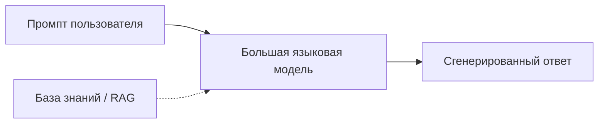

# Генеративный искусственный интеллект

  ОБЯЗАТЕЛЬНО
  ДЛЯ НОВИЧКОВ

Всем

**Генеративный ИИ** — класс моделей, которые **создают новые артефакты** (текст, изображение, код, аудио) по запросу, а не только присваивают метку классу. ChatGPT, Copilot, Midjourney, GitHub Copilot — сервисы **поверх** таких моделей. Базовые определения ИИ и ML — в [введении в раздел](/encyclopedia/6-ai/6-01-vvedenie-v-ii/1); здесь — устройство и ограничения генеративного стека.

---

## Чем генеративный ИИ отличается от "классического" ML

| Аспект | Классический ML (часто) | Генеративный ИИ (LLM и др.) |
|--------|-------------------------|-----------------------------|
| Выход | Класс, число, ранжирование | Текст, картинка, фрагмент кода |
| Обучение | Признаки → метка | Предсказание следующего токена / диффузия пикселей |
| Ошибки | Смещение метрик | "Галлюцинации" — правдоподобный, но неверный текст |
| Данные на входе | Таблица, логи | Промпт + опционально RAG-контекст |

Модель **не "знает факты"** как база данных: она воспроизводит статистические паттерны из обучающего корпуса. Поэтому для юридических, медицинских и финансовых решений нужны [проверка человеком](/encyclopedia/6-ai/6-06-primenenie-ii/3) и ссылки на источники.

---

## LLM - минимальная механика

**Большая языковая модель (LLM)** получает последовательность токенов (кусочков текста) и на каждом шаге выдаёт распределение вероятностей над следующим токеном. Декодирование (жадное, beam search, sampling с temperature) определяет "креативность" ответа.

Ключевые термины:

- **Контекстное окно** — сколько токенов модель "видит" за раз; длинные документы режут или суммаризируют.
- **Системный промпт** — инструкция роли ("ты помощник поддержки…"), задаётся разработчиком сервиса.
- **Temperature** — выше → разнообразнее и рискованнее; ниже → стабильнее и суше.

Инференс LLM требует GPU или специализированных чипов; обучение с нуля доступно единицам организаций — большинство команд **дообучают** или **подключают** готовые API.

---

## RAG - когда одной модели мало

**Retrieval-Augmented Generation (RAG)** — схема "сначала найти релевантные фрагменты в вашей базе, потом подставить их в промпт". Так снижают выдумывание фактов о **внутренних** документах (регламенты, API, тикеты).

Этапы RAG:

1. Индексация документов (chunking, эмбеддинги).
2. Поиск по запросу пользователя (векторный + иногда полнотекстовый).
3. Сборка промпта: вопрос + найденные цитаты.
4. Ответ LLM с требованием опираться на цитаты.

RAG не отменяет ошибки: плохой chunking или устаревшая база дают неверный контекст так же надёжно, как галлюцинация.

RAG — **слой знаний** в типовой архитектуре вместе с **MCP** (подключения) и **агентом** (действия). Сводная схема — [RAG, MCP и агенты — три слоя архитектуры](/encyclopedia/6-ai/6-04-modeli-i-instrumenty/121).

---

## Агенты

**Агент** — LLM + цикл "план → вызов инструмента → наблюдение". Инструменты: поиск, SQL, HTTP API, выполнение кода в песочнице. Подробнее — [Агенты ИИ](/encyclopedia/6-ai/6-04-modeli-i-instrumenty/116) и обзор [трёх слоёв](/encyclopedia/6-ai/6-04-modeli-i-instrumenty/121).

---

## Риски и ответственное использование

- **Конфиденциальность** — не вставляйте в публичный чат персональные данные и секреты компании без политики DLP.
- **Авторство и лицензии** — сгенерированный код может повторять чужие фрагменты; нужен review.
- **Зависимость от вендора** — модели и цены меняются; закладывайте абстракцию API.

Развёрнуто — в [ответственном использовании ИИ](/encyclopedia/6-ai/6-06-primenenie-ii/3) и [ИИ для топ-менеджмента и корпоративного ПО](/encyclopedia/6-ai/6-06-primenenie-ii/4).

---

## Практика на Microsoft Learn

После этой главы:

1. [Концепции ИИ](https://learn.microsoft.com/ru-ru/training/modules/get-started-ai-fundamentals/) (~40 мин)
2. [Генеративный ИИ и агенты — введение](https://learn.microsoft.com/ru-ru/training/modules/fundamentals-generative-ai/) (~37 мин)

Агент с доступом к терминалу выполняет команды от вашего имени — перед запуском сверяйтесь с [Опасными скриптами](/encyclopedia/8-infra-security/8-03-zabota-o-kode-i-dannyh/101). Архитектура — [6.04 / Агенты ИИ](/encyclopedia/6-ai/6-04-modeli-i-instrumenty/116).

Все ссылки — в [навигаторе Learn](/tools/documentation/6).

---

## Итоги

Генеративный ИИ — **статистическая генерация контента**, а не разум. LLM + RAG + агенты — инженерные паттерны продакшена 2020-х. Теория здесь, hands-on — на Learn и в ваших pet-проектах с API.

---
