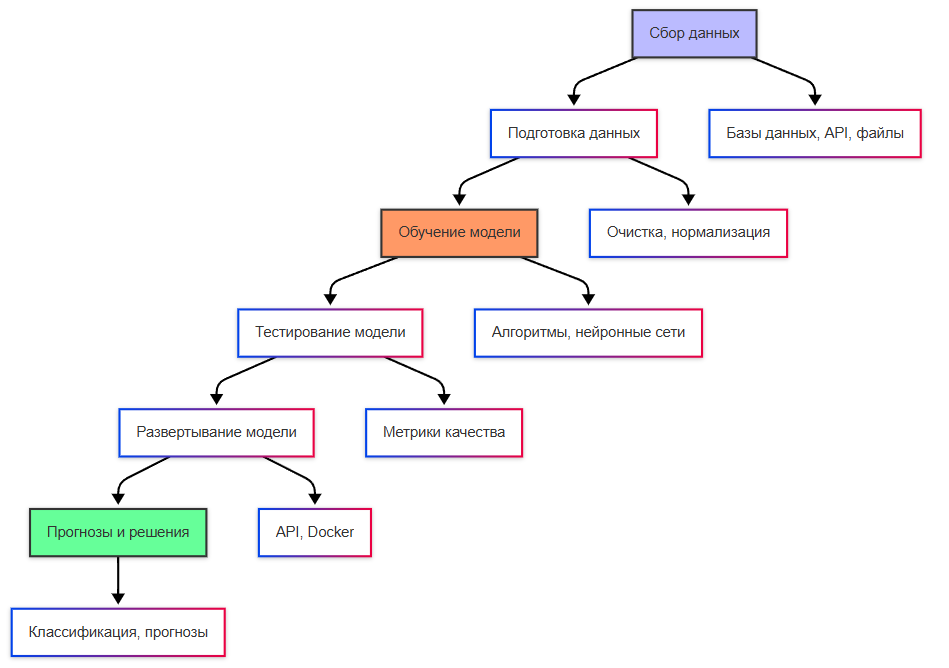

import TrainTestSplitDemo from '@site/src/components/TrainTestSplitDemo.jsx';
import NeuralNetworkDemo from '@site/src/components/NeuralNetworkDemo.jsx';

# Машинное обучение

<div class="article-tags">
  <span class="tag tag-required">ОБЯЗАТЕЛЬНО</span>
  <span class="tag tag-beginner">ДЛЯ НОВИЧКОВ</span>
</div>

<span class="complexity-badge">Всем</span>

## Машинное обучение

### Что такое машинное обучение?

**Машинное обучение** (Machine Learning, ML) — это область искусственного интеллекта, которая разрабатывает алгоритмы, способные извлекать знания из данных. Вместо явного программирования правил поведения, система самостоятельно находит закономерности в предоставленной информации и строит модели для решения задач.

Машинное обучение позволяет компьютерам адаптироваться к новым данным без изменения исходного кода программы. Это достигается через процесс обучения, в котором модель анализирует примеры и корректирует свои внутренние параметры.

Обучение нейросетей — это процесс настройки весов и параметров сети для выполнения конкретной задачи.

Это автоматическое извлечение знаний из данных без явного программирования правил.

---

### Типы машинного обучения

Машинное обучение делится на три основных подхода в зависимости от того, как предоставляются данные для обучения:
	- Обучение с учителем (supervised learning) - модель обучается на парах входных данных и целевых значений.
	- Обучение без учителя (unsupervised learning) - модель ищет скрытые паттерны в данных без целевых меток.
	- Обучение с подкреплением (reinforcement learning) - модель учится на основе взаимодействия с окружающей средой и получения наград.

<TrainTestSplitDemo />

<NeuralNetworkDemo />



#### Обучение с учителем

**Обучение с учителем** — это метод, при котором модель обучается на размеченных данных. Каждый пример входных данных сопровождается правильным ответом или меткой. Модель учится предсказывать выходные значения для новых, ранее неизвестных данных.

Примеры задач обучения с учителем:
- Классификация — определение категории объекта (спам или не спам, кошка или собака)
- Регрессия — предсказание числового значения (цена недвижимости, температура)

#### Обучение без учителя

**Обучение без учителя** — это метод, при котором модель работает с неразмеченными данными. Цель состоит в обнаружении скрытых структур, паттернов или группировок в информации.

Примеры задач обучения без учителя:
- Кластеризация — группировка похожих объектов
- Снижение размерности — сжатие данных с сохранением важной информации
- Обнаружение аномалий — выявление необычных паттернов

#### Обучение с подкреплением

**Обучение с подкреплением** — это метод, при котором агент учится принимать решения через взаимодействие с окружающей средой. Агент получает награды за правильные действия и штрафы за неправильные, постепенно оптимизируя свою стратегию поведения.

Примеры применения обучения с подкреплением:
- Игровые агенты (шахматы, го, видеоигры)
- Робототехника и автономное управление
- Торговые алгоритмы на финансовых рынках

#### Мини-пример — классификация от "А" до "Г"

Типичный цикл ML на табличных данных: разделить выборку → обучить → оценить на тесте.

```python
from sklearn.datasets import load_iris
from sklearn.model_selection import train_test_split
from sklearn.ensemble import RandomForestClassifier
from sklearn.metrics import accuracy_score

X, y = load_iris(return_X_y=True)
X_train, X_test, y_train, y_test = train_test_split(
    X, y, test_size=0.25, random_state=42, stratify=y
)

model = RandomForestClassifier(n_estimators=100, random_state=42)
model.fit(X_train, y_train)
y_pred = model.predict(X_test)

print(f"Accuracy на тесте: {accuracy_score(y_test, y_pred):.2f}")
```

Ожидаемо: accuracy близка к 1.0 на Iris — набор простой. На реальных данных метрики ниже; важно смотреть не только accuracy, но и precision/recall при дисбалансе классов.

---

### Датасеты и данные

#### Что такое датасет?

**Датасет** — это структурированный набор данных, используемый для обучения и оценки моделей машинного обучения. Датасет содержит информацию, необходимую для решения конкретной задачи, в формате, подходящем для обработки алгоритмами.

Данные важно разделять по типам - сложно организовать обучение с разными типами, беспорядочно перемешанными. При обучении, главное - понять, какие бывают типы (табличные, текст, изображения, временные ряды) и откуда их брать (встроенные датасеты, Kaggle, ETL-процессы).

Датасеты могут включать:
- Табличные данные (числа, категории)
- Текстовые документы
- Изображения и видео
- Аудиозаписи
- Временные ряды

#### Структура датасета

Датасет обычно разделяется на три части:

**Обучающий набор** — основная часть данных, используемая для обучения модели. Модель анализирует эти данные и настраивает свои параметры для минимизации ошибок.

**Валидационный набор** — промежуточный набор данных, используемый для настройки гиперпараметров модели и предотвращения переобучения. Модель не обучается на этих данных, но они помогают оценить качество во время обучения.

**Тестовый набор** — финальный набор данных, используемый для объективной оценки производительности модели после завершения обучения. Эти данные никогда не видели модель во время обучения.

Собственный датасет — это просто набор данных, который собирают буквально - ручками. Нужно понять задачу и собрать данные - из открытых источников, API, по сайтам.

#### Популярные датасеты

Существует множество стандартных датасетов, используемых для обучения и сравнения моделей:

**MNIST** — набор из 70 000 изображений рукописных цифр (0-9), каждый размером 28×28 пикселей. Используется для задач классификации изображений.

**CIFAR-10** — набор из 60 000 цветных изображений размером 32×32 пикселя, разделенных на 10 классов (самолеты, автомобили, птицы, кошки, олени, собаки, лягушки, лошади, корабли, грузовики).

**ImageNet** — масштабный датасет с более чем 14 миллионами изображений, размеченных по 20 000 категориям. Используется для задач компьютерного зрения.

**IMDb Reviews** — набор из 50 000 отзывов на фильмы с двоичной разметкой тональности (положительная или отрицательная).

**Wikipedia Text Corpus** — большая коллекция текстов из Википедии, используемая для обучения языковых моделей.

---

## Алгоритмы машинного обучения

### Линейные модели

#### Линейная регрессия

**Линейная регрессия** — это простейший алгоритм машинного обучения, который моделирует линейную зависимость между входными признаками и выходной переменной. Модель представляет собой прямую линию (в случае одного признака) или гиперплоскость (в случае множества признаков).

```python
from sklearn.linear_model import LinearRegression

import numpy as np

# Создаем данные
X = np.array([[1], [2], [3], [4], [5]])
y = np.array([2, 4, 5, 4, 5])

# Создаем и обучаем модель
model = LinearRegression()
model.fit(X, y)

# Предсказываем
predictions = model.predict([[6]])
print(f"Предсказание для значения 6: {predictions[0]}")
```

```csharp
// Пример линейной регрессии на C# с использованием ML.NET
using Microsoft.ML;
using Microsoft.ML.Data;

var mlContext = new MLContext();
var data = mlContext.Data.LoadFromTextFile<HouseData>("houses.csv", separatorChar: ',');
var pipeline = mlContext.Transforms.Concatenate("Features", "Size", "Rooms")
    .Append(mlContext.Regression.Trainers.Sdca());
var model = pipeline.Fit(data);
```

```java
// Пример линейной регрессии на Java с использованием Weka

import weka.classifiers.functions.LinearRegression;
import weka.core.Instances;
import weka.core.converters.ConverterUtils.DataSource;

DataSource source = new DataSource("houses.arff");
Instances data = source.getDataSet();
data.setClassIndex(data.numAttributes() - 1);

LinearRegression model = new LinearRegression();
model.buildClassifier(data);
```

Линейная регрессия используется для задач предсказания числовых значений, таких как прогнозирование цен, температуры или спроса на продукцию.

---

#### Логистическая регрессия

**Логистическая регрессия** — это алгоритм классификации, который предсказывает вероятность принадлежности объекта к определенному классу. Несмотря на название, это метод классификации, а не регрессии.

```python
from sklearn.linear_model import LogisticRegression
from sklearn.datasets import load_iris
from sklearn.model_selection import train_test_split

# Загружаем данные
iris = load_iris()
X_train, X_test, y_train, y_test = train_test_split(iris.data, iris.target, test_size=0.3)

# Создаем и обучаем модель
model = LogisticRegression(max_iter=200)
model.fit(X_train, y_train)

# Оцениваем модель
accuracy = model.score(X_test, y_test)
print(f"Точность модели: {accuracy:.2f}")
```

```csharp
// Логистическая регрессия на C# с ML.NET
var mlContext = new MLContext();
var data = mlContext.Data.LoadFromTextFile<IrisData>("iris.csv", separatorChar: ',');
var pipeline = mlContext.Transforms.Concatenate("Features", "SepalLength", "SepalWidth", "PetalLength", "PetalWidth")
    .Append(mlContext.BinaryClassification.Trainers.SdcaLogisticRegression());
var model = pipeline.Fit(data);
```

Логистическая регрессия применяется для бинарной классификации (два класса) и многоклассовой классификации.

---

### Деревья решений и ансамбли

#### Дерево решений

**Дерево решений** — это алгоритм, который строит древовидную структуру для принятия решений. Каждый узел дерева представляет собой вопрос о значении признака, а каждая ветвь — возможный ответ на этот вопрос.

```python
from sklearn.tree import DecisionTreeClassifier
from sklearn.datasets import load_breast_cancer
from sklearn.model_selection import train_test_split

# Загружаем данные
cancer = load_breast_cancer()
X_train, X_test, y_train, y_test = train_test_split(cancer.data, cancer.target, test_size=0.3)

# Создаем и обучаем модель
model = DecisionTreeClassifier(max_depth=5)
model.fit(X_train, y_train)

# Оцениваем модель
accuracy = model.score(X_test, y_test)
print(f"Точность дерева решений: {accuracy:.2f}")
```

```csharp
// Дерево решений на C# с ML.NET
var mlContext = new MLContext();
var data = mlContext.Data.LoadFromTextFile<CancerData>("cancer.csv", separatorChar: ',');
var pipeline = mlContext.Transforms.Concatenate("Features", "Feature1", "Feature2", "Feature3")
    .Append(mlContext.BinaryClassification.Trainers.LightGbm());
var model = pipeline.Fit(data);
```

Деревья решений интуитивно понятны и легко интерпретируемы. Они работают с числовыми и категориальными данными без необходимости предварительной нормализации.

---

#### Случайный лес

**Случайный лес** — это ансамблевый метод, который объединяет множество деревьев решений для улучшения точности и уменьшения переобучения. Каждое дерево обучается на случайной подвыборке данных, а финальное предсказание формируется путем голосования всех деревьев.

```python
from sklearn.ensemble import RandomForestClassifier
from sklearn.datasets import load_wine
from sklearn.model_selection import train_test_split

# Загружаем данные
wine = load_wine()
X_train, X_test, y_train, y_test = train_test_split(wine.data, wine.target, test_size=0.3)

# Создаем и обучаем модель
model = RandomForestClassifier(n_estimators=100, max_depth=10)
model.fit(X_train, y_train)

# Оцениваем модель
accuracy = model.score(X_test, y_test)
print(f"Точность случайного леса: {accuracy:.2f}")
```

```java
// Случайный лес на Java с использованием Smile

import smile.classification.RandomForest;
import smile.Data.DataFrame;
import smile.io.Read;

DataFrame data = Read.csv("wine.csv");
RandomForest model = RandomForest.fit(data.x(), data.factor("target").array(), 100);
```

Случайный лес обладает высокой точностью, устойчив к переобучению и хорошо работает с большими наборами данных.

---

### Методы опорных векторов

#### SVM (Support Vector Machine)

**Метод опорных векторов** — это алгоритм, который находит оптимальную гиперплоскость для разделения данных разных классов. SVM стремится максимизировать расстояние (зазор) между ближайшими точками разных классов.

```python
from sklearn.svm import SVC
from sklearn.datasets import load_digits
from sklearn.model_selection import train_test_split
from sklearn.preprocessing import StandardScaler

# Загружаем данные
digits = load_digits()
X_train, X_test, y_train, y_test = train_test_split(digits.data, digits.target, test_size=0.3)

# Нормализуем данные
scaler = StandardScaler()
X_train_scaled = scaler.fit_transform(X_train)
X_test_scaled = scaler.transform(X_test)

# Создаем и обучаем модель
model = SVC(kernel='rbf', C=10)
model.fit(X_train_scaled, y_train)

# Оцениваем модель
accuracy = model.score(X_test_scaled, y_test)
print(f"Точность SVM: {accuracy:.2f}")
```

```csharp
// SVM на C# с Accord.NET
using Accord.MachineLearning.VectorMachines;
using Accord.MachineLearning.VectorMachines.Learning;
using Accord.Statistics.Kernels;

var teacher = new SequentialMinimalOptimization<Gaussian>()
{
    Complexity = 10
};
var svm = teacher.Learn(inputs, outputs);
```

SVM эффективен для задач с четким разделением классов и работает хорошо даже в пространствах высокой размерности.

---

## Глубокое обучение

### Что такое глубокое обучение?

**Глубокое обучение** — это подраздел машинного обучения, основанный на использовании нейронных сетей с множеством скрытых слоев. Эти сети способны автоматически извлекать иерархические признаки из сырых данных, что делает их особенно мощными для работы со сложными неструктурированными данными.

Глубокое обучение отличается от традиционного машинного обучения тем, что не требует ручного извлечения признаков. Сеть самостоятельно учится выделять важные характеристики на каждом уровне абстракции.

Глубокое обучение используется в CNN, RNN, LSTM и трансформерах. Требует мощных вычислительных ресурсов (например, GPU или TPU).

---

### Нейронные сети

#### Структура нейронной сети

**Нейронная сеть** — это вычислительная модель, вдохновленная биологическими нейронными сетями мозга. Сеть состоит из слоев искусственных нейронов, каждый из которых выполняет простые вычисления и передает результат следующему слою.

Основные компоненты нейронной сети:

**Входной слой** — принимает исходные данные и передает их в сеть. Количество нейронов соответствует количеству входных признаков.

**Скрытые слои** — промежуточные слои, которые извлекают признаки из данных. Каждый скрытый слой преобразует представление данных на более высокий уровень абстракции.

**Выходной слой** — формирует окончательный результат работы сети. Количество нейронов зависит от типа задачи (один нейрон для регрессии, несколько для классификации).

**Веса** — параметры, которые определяют силу связи между нейронами. В процессе обучения веса корректируются для минимизации ошибки.

**Функции активации** — нелинейные функции, применяемые к выходу каждого нейрона. Они позволяют сети моделировать сложные нелинейные зависимости.

---

#### Многослойный перцептрон

**Многослойный перцептрон** — это простейшая форма нейронной сети с полносвязными слоями. Каждый нейрон в слое соединен со всеми нейронами предыдущего и следующего слоев.

```python

import tensorflow as tf

from tensorflow.keras.models import Sequential
from tensorflow.keras.layers import Dense
from sklearn.datasets import load_breast_cancer
from sklearn.model_selection import train_test_split
from sklearn.preprocessing import StandardScaler

# Загружаем данные
cancer = load_breast_cancer()
X_train, X_test, y_train, y_test = train_test_split(cancer.data, cancer.target, test_size=0.2)

# Нормализуем данные
scaler = StandardScaler()
X_train_scaled = scaler.fit_transform(X_train)
X_test_scaled = scaler.transform(X_test)

# Создаем модель
model = Sequential([
    Dense(64, activation='relu', input_shape=(X_train.shape[1],)),
    Dense(32, activation='relu'),
    Dense(16, activation='relu'),
    Dense(1, activation='sigmoid')
])

# Компилируем модель
model.compile(optimizer='adam', loss='binary_crossentropy', metrics=['accuracy'])

# Обучаем модель
model.fit(X_train_scaled, y_train, epochs=50, batch_size=32, validation_split=0.2)

# Оцениваем модель
loss, accuracy = model.evaluate(X_test_scaled, y_test)
print(f"Точность модели: {accuracy:.2f}")
```

```csharp
// Многослойный перцептрон на C# с TensorFlow.NET
using Tensorflow;
using Tensorflow.Keras.Engine;
using static Tensorflow.KerasApi;

var keras = tf.keras;
var model = keras.Sequential(new Layer[] {
    keras.layers.Dense(64, activation: "relu", input_shape: new int[] { 30 }),
    keras.layers.Dense(32, activation: "relu"),
    keras.layers.Dense(16, activation: "relu"),
    keras.layers.Dense(1, activation: "sigmoid")
});

model.compile(optimizer: "adam", loss: "binary_crossentropy", metrics: new string[] { "accuracy" });
```

```java
// Многослойный перцептрон на Java с Deeplearning4j

import org.deeplearning4j.nn.conf.MultiLayerConfiguration;
import org.deeplearning4j.nn.conf.NeuralNetConfiguration;
import org.deeplearning4j.nn.conf.layers.DenseLayer;
import org.deeplearning4j.nn.conf.layers.OutputLayer;
import org.deeplearning4j.nn.multilayer.MultiLayerNetwork;
import org.nd4j.linalg.activations.Activation;
import org.nd4j.linalg.learning.config.Adam;
import org.nd4j.linalg.lossfunctions.LossFunctions;

MultiLayerConfiguration conf = new NeuralNetConfiguration.Builder()
    .updater(new Adam(0.001))
    .list()
    .layer(new DenseLayer.Builder().nIn(30).nOut(64).activation(Activation.RELU).build())
    .layer(new DenseLayer.Builder().nIn(64).nOut(32).activation(Activation.RELU).build())
    .layer(new DenseLayer.Builder().nIn(32).nOut(16).activation(Activation.RELU).build())
    .layer(new OutputLayer.Builder(LossFunctions.LossFunction.MSE).nIn(16).nOut(1).activation(Activation.SIGMOID).build())
    .build();

MultiLayerNetwork model = new MultiLayerNetwork(conf);
model.init();
```

Многослойный перцептрон универсален и может решать широкий спектр задач, от классификации до регрессии.

---

### Сверточные нейронные сети

#### Что такое CNN?

**Сверточная нейронная сеть** — это специализированный тип нейронной сети, разработанный для обработки данных с сетчатой топологией, таких как изображения. Сверточные сети используют локальные receptive fields и веса, совместно используемые между нейронами, что делает их эффективными для работы с изображениями.

Архитектура CNN включает следующие типы слоев:

**Сверточные слои** — применяют фильтры (ядра) к входным данным для выделения признаков. Каждый фильтр обнаруживает определенный паттерн, такой как края, текстуры или формы.

**Пулинговые слои** — уменьшают пространственную размерность данных, сохраняя наиболее важную информацию. Наиболее распространенный тип — максимальный пулинг, который выбирает максимальное значение в каждом окне.

**Полносвязные слои** — используются в конце сети для классификации признаков, извлеченных сверточными слоями.

---

#### Пример сверточной сети

```python

import tensorflow as tf

from tensorflow.keras.models import Sequential
from tensorflow.keras.layers import Conv2D, MaxPooling2D, Flatten, Dense
from tensorflow.keras.datasets import mnist
from tensorflow.keras.utils import to_categorical

# Загружаем данные
(X_train, y_train), (X_test, y_test) = mnist.load_data()
X_train = X_train.reshape(-1, 28, 28, 1).astype('float32') / 255.0
X_test = X_test.reshape(-1, 28, 28, 1).astype('float32') / 255.0
y_train = to_categorical(y_train, 10)
y_test = to_categorical(y_test, 10)

# Создаем модель
model = Sequential([
    Conv2D(32, kernel_size=(3, 3), activation='relu', input_shape=(28, 28, 1)),
    MaxPooling2D(pool_size=(2, 2)),
    Conv2D(64, kernel_size=(3, 3), activation='relu'),
    MaxPooling2D(pool_size=(2, 2)),
    Flatten(),
    Dense(128, activation='relu'),
    Dense(10, activation='softmax')
])

# Компилируем модель
model.compile(optimizer='adam', loss='categorical_crossentropy', metrics=['accuracy'])

# Обучаем модель
model.fit(X_train, y_train, epochs=10, batch_size=128, validation_split=0.2)

# Оцениваем модель
loss, accuracy = model.evaluate(X_test, y_test)
print(f"Точность CNN: {accuracy:.2f}")
```

```csharp
// CNN на C# с TensorFlow.NET
var model = keras.Sequential(new Layer[] {
    keras.layers.Conv2D(32, 3, activation: "relu", input_shape: new int[] { 28, 28, 1 }),
    keras.layers.MaxPooling2D(2, 2),
    keras.layers.Conv2D(64, 3, activation: "relu"),
    keras.layers.MaxPooling2D(2, 2),
    keras.layers.Flatten(),
    keras.layers.Dense(128, activation: "relu"),
    keras.layers.Dense(10, activation: "softmax")
});
```

Сверточные нейронные сети доминируют в задачах компьютерного зрения, таких как распознавание изображений, обнаружение объектов и сегментация.

---

### Рекуррентные нейронные сети

#### Что такое RNN?

**Рекуррентная нейронная сеть** — это тип нейронной сети, предназначенная для обработки последовательных данных, таких как текст, речь или временные ряды. В отличие от обычных сетей, RNN имеет внутреннюю память, которая позволяет учитывать контекст предыдущих элементов последовательности.

Ключевая особенность RNN — циклические связи, которые передают информацию из предыдущего шага времени на текущий. Это позволяет сети запоминать зависимости на разных временных масштабах.

---

#### LSTM и GRU

**LSTM** (Long Short-Term Memory) — это усовершенствованный вариант рекуррентной сети, разработанный для решения проблемы затухающего градиента. LSTM использует специальные вентили (гейты) для контроля потока информации, что позволяет запоминать долгосрочные зависимости.

**GRU** (Gated Recurrent Unit) — это упрощенная версия LSTM с меньшим количеством параметров. GRU объединяет некоторые вентили LSTM, сохраняя при этом способность моделировать долгосрочные зависимости.

```python
from tensorflow.keras.models import Sequential
from tensorflow.keras.layers import Embedding, LSTM, Dense, GRU
from tensorflow.keras.datasets import imdb
from tensorflow.keras.preprocessing.sequence import pad_sequences

# Загружаем данные
max_features = 10000
maxlen = 200
(X_train, y_train), (X_test, y_test) = imdb.load_data(num_words=max_features)
X_train = pad_sequences(X_train, maxlen=maxlen)
X_test = pad_sequences(X_test, maxlen=maxlen)

# Создаем модель с LSTM
model = Sequential([
    Embedding(max_features, 128, input_length=maxlen),
    LSTM(64, dropout=0.2, recurrent_dropout=0.2),
    Dense(1, activation='sigmoid')
])

# Компилируем модель
model.compile(optimizer='adam', loss='binary_crossentropy', metrics=['accuracy'])

# Обучаем модель
model.fit(X_train, y_train, epochs=5, batch_size=32, validation_split=0.2)

# Оцениваем модель
loss, accuracy = model.evaluate(X_test, y_test)
print(f"Точность LSTM: {accuracy:.2f}")
```

```python
# Модель с GRU
model_gru = Sequential([
    Embedding(max_features, 128, input_length=maxlen),
    GRU(64, dropout=0.2, recurrent_dropout=0.2),
    Dense(1, activation='sigmoid')
])
```

Рекуррентные сети используются для задач обработки естественного языка, прогнозирования временных рядов и генерации последовательностей.

---

## Процесс обучения моделей

### Подготовка данных

#### Предобработка данных

**Предобработка данных** — это этап подготовки сырых данных для обучения модели. Этот процесс включает очистку, нормализацию и преобразование данных в формат, подходящий для алгоритмов машинного обучения.

Основные шаги предобработки:

**Очистка данных** — удаление или исправление некорректных, неполных или дублирующихся записей. Обработка пропущенных значений путем удаления строк, заполнения средними значениями или интерполяции.

**Нормализация** — приведение числовых признаков к единому масштабу. Обычно используется минимаксная нормализация (приведение к диапазону [0, 1]) или стандартизация (приведение к нулевому среднему и единичной дисперсии).

**Кодирование категориальных признаков** — преобразование категориальных переменных в числовые представления. Используются методы однократного кодирования (one-hot encoding) или меток (label encoding).

```python

import pandas as pd

from sklearn.preprocessing import StandardScaler, OneHotEncoder
from sklearn.compose import ColumnTransformer
from sklearn.pipeline import Pipeline
from sklearn.impute import SimpleImputer

# Создаем конвейер обработки данных
numeric_features = ['age', 'income', 'score']
categorical_features = ['gender', 'Образование', 'city']

numeric_transformer = Pipeline(steps=[
    ('imputer', SimpleImputer(strategy='median')),
    ('scaler', StandardScaler())
])

categorical_transformer = Pipeline(steps=[
    ('imputer', SimpleImputer(strategy='constant', fill_value='missing')),
    ('onehot', OneHotEncoder(handle_unknown='ignore'))
])

preprocessor = ColumnTransformer(
    transformers=[
        ('num', numeric_transformer, numeric_features),
        ('cat', categorical_transformer, categorical_features)
    ])

# Применяем конвейер
data = pd.read_csv('dataset.csv')
X_processed = preprocessor.fit_transform(data)
```

---

### Обучение модели

#### Функция потерь

**Функция потерь** — это метрика, которая измеряет, насколько хорошо модель предсказывает целевые значения. Функция потерь количественно оценивает ошибку модели и служит ориентиром для процесса оптимизации.

Типы функций потерь:

**Среднеквадратичная ошибка** — используется для задач регрессии. Вычисляет среднее квадратов разностей между предсказанными и фактическими значениями.

**Кросс-энтропия** — используется для задач классификации. Измеряет различие между предсказанным распределением вероятностей и истинным распределением.

**Hinge loss** — используется для методов опорных векторов. Штрафует предсказания, которые находятся слишком близко к границе разделения классов.

---

#### Оптимизация

**Оптимизация** — это процесс настройки параметров модели для минимизации функции потерь. Оптимизаторы используют градиенты функции потерь для обновления весов модели в направлении, уменьшающем ошибку.

Популярные алгоритмы оптимизации:

**Стохастический градиентный спуск** — базовый метод оптимизации, который обновляет веса на основе градиента, вычисленного для одного или нескольких примеров.

**Adam** — адаптивный метод оптимизации, который комбинирует преимущества методов моментума и адаптивного обучения. Adam автоматически регулирует скорость обучения для каждого параметра.

**RMSprop** — метод, который адаптирует скорость обучения на основе среднего квадрата градиентов. Эффективен для нестационарных целевых функций.

```python
from tensorflow.keras.optimizers import SGD, Adam, RMSprop

# SGD с моментумом
sgd_optimizer = SGD(learning_rate=0.01, momentum=0.9)

# Adam optimizer
adam_optimizer = Adam(learning_rate=0.001, beta_1=0.9, beta_2=0.999)

# RMSprop optimizer
rmsprop_optimizer = RMSprop(learning_rate=0.001, rho=0.9)
```

---

#### Обратное распространение ошибки

**Обратное распространение ошибки** — это алгоритм вычисления градиентов функции потерь по параметрам модели. Алгоритм использует цепное правило дифференцирования для эффективного вычисления градиентов в нейронных сетях.

Процесс обратного распространения:

1. Вычисляется прямое распространение сигнала через сеть
2. Вычисляется функция потерь на выходе сети
3. Градиенты распространяются обратно через сеть от выходного слоя к входному
4. Веса обновляются на основе вычисленных градиентов

---

### Регуляризация и предотвращение переобучения

#### Переобучение и недообучение

**Переобучение** — это ситуация, когда модель слишком хорошо подстраивается под обучающие данные, включая шум и случайные флуктуации. Переобученная модель показывает высокую точность на обучающем наборе, но плохую обобщающую способность на новых данных.

**Недообучение** — это ситуация, когда модель недостаточно сложна для захвата основных паттернов в данных. Недообученная модель показывает низкую точность как на обучающем, так и на тестовом наборе.

---

#### Методы регуляризации

**Регуляризация** — это набор техник, предназначенных для предотвращения переобучения модели. Регуляризация добавляет штрафы к функции потерь или изменяет архитектуру модели для улучшения обобщающей способности.

**L1 и L2 регуляризация** — добавляют штрафы к функции потерь на основе абсолютных значений (L1) или квадратов (L2) весов модели. L1 регуляризация способствует разреженности весов, L2 регуляризация уменьшает общую величину весов.

**Dropout** — случайно отключает часть нейронов во время обучения для предотвращения чрезмерной зависимости от отдельных нейронов. Это заставляет сеть учиться более надежным представлениям.

**Ранняя остановка** — прекращает обучение, когда производительность на валидационном наборе перестает улучшаться. Это предотвращает дальнейшее подстраивание под обучающие данные.

```python
from tensorflow.keras.layers import Dropout
from tensorflow.keras import regularizers

# Модель с регуляризацией
model = Sequential([
    Dense(128, activation='relu', kernel_regularizer=regularizers.l2(0.01), input_shape=(100,)),
    Dropout(0.5),
    Dense(64, activation='relu', kernel_regularizer=regularizers.l2(0.01)),
    Dropout(0.5),
    Dense(1, activation='sigmoid')
])
```

---

## Оценка моделей

### Метрики качества

#### Для задач классификации

**Accuracy (доля верных ответов)** — доля правильно классифицированных объектов от общего количества. Простая и интуитивно понятная метрика, но может быть вводящей в заблуждение при несбалансированных классах.

**Precision (точность предсказания положительного класса)** — доля истинно положительных предсказаний от всех предсказанных положительных. Показывает, насколько можно доверять положительному предсказанию модели.

**Recall (полнота)** — доля истинно положительных предсказаний от всех фактически положительных объектов. Показывает, насколько хорошо модель находит все положительные случаи.

**F1-мера** — гармоническое среднее точности и полноты. Используется, когда необходимо сбалансировать точность и полноту.

**ROC-AUC** — площадь под кривой ошибок. Измеряет способность модели различать классы независимо от выбранного порога классификации.

```python
from sklearn.metrics import accuracy_score, precision_score, recall_score, f1_score, roc_auc_score
from sklearn.metrics import confusion_matrix, classification_report

import numpy as np

# Пример оценки модели
y_true = np.array([0, 1, 1, 0, 1, 0, 1, 1, 0, 1])
y_pred = np.array([0, 1, 0, 0, 1, 0, 1, 1, 1, 1])
y_proba = np.array([0.1, 0.9, 0.4, 0.2, 0.8, 0.3, 0.9, 0.85, 0.6, 0.95])

# Вычисляем метрики
accuracy = accuracy_score(y_true, y_pred)
precision = precision_score(y_true, y_pred)
recall = recall_score(y_true, y_pred)
f1 = f1_score(y_true, y_pred)
roc_auc = roc_auc_score(y_true, y_proba)

print(f"Точность: {accuracy:.2f}")
print(f"Precision: {precision:.2f}")
print(f"Recall: {recall:.2f}")
print(f"F1-score: {f1:.2f}")
print(f"ROC-AUC: {roc_auc:.2f}")

# Матрица ошибок
cm = confusion_matrix(y_true, y_pred)
print("\nМатрица ошибок:")
print(cm)

# Подробный отчет
report = classification_report(y_true, y_pred)
print("\nОтчет классификации:")
print(report)
```

---

#### Для задач регрессии

**Среднеквадратичная ошибка** — среднее квадратов разностей между предсказанными и фактическими значениями. Чувствительна к выбросам.

**Средняя абсолютная ошибка** — среднее абсолютных разностей между предсказанными и фактическими значениями. Менее чувствительна к выбросам, чем MSE.

**Коэффициент детерминации** — доля дисперсии зависимой переменной, объясняемая моделью. Значения близкие к 1 указывают на хорошее качество модели.

```python
from sklearn.metrics import mean_squared_error, mean_absolute_error, r2_score

import numpy as np

# Пример оценки регрессионной модели
y_true = np.array([3.5, 2.8, 4.2, 3.1, 5.0, 4.5, 3.8, 4.1, 2.9, 3.6])
y_pred = np.array([3.4, 2.9, 4.0, 3.2, 4.8, 4.6, 3.7, 4.2, 3.0, 3.5])

# Вычисляем метрики
mse = mean_squared_error(y_true, y_pred)
rmse = np.sqrt(mse)
mae = mean_absolute_error(y_true, y_pred)
r2 = r2_score(y_true, y_pred)

print(f"MSE: {mse:.4f}")
print(f"RMSE: {rmse:.4f}")
print(f"MAE: {mae:.4f}")
print(f"R²: {r2:.4f}")
```

---

### Кросс-валидация

**Кросс-валидация** — это метод оценки модели, при котором данные разделяются на несколько частей (фолдов). Модель обучается на одной части данных и тестируется на другой, и этот процесс повторяется для каждого фолда.

**K-fold кросс-валидация** — наиболее распространенный метод, при котором данные разделяются на K равных частей. Модель обучается K раз, каждый раз используя K-1 фолдов для обучения и 1 фолд для тестирования.

```python
from sklearn.model_selection import cross_val_score, KFold
from sklearn.ensemble import RandomForestClassifier
from sklearn.datasets import load_iris

# Загружаем данные
iris = load_iris()
X, y = iris.data, iris.target

# Создаем модель
model = RandomForestClassifier(n_estimators=100)

# K-fold кросс-валидация
kfold = KFold(n_splits=5, shuffle=True, random_state=42)
scores = cross_val_score(model, X, y, cv=kfold, scoring='accuracy')

print(f"Средняя точность: {scores.mean():.4f} (+/- {scores.std() * 2:.4f})")
print(f"Оценки по фолдам: {scores}")
```

Кросс-валидация предоставляет более надежную оценку модели, особенно при ограниченном количестве данных.

---

## Инструменты и экосистема

### Библиотеки для машинного обучения

#### Scikit-learn

**Scikit-learn** — это библиотека машинного обучения на Python, предоставляющая простые и эффективные инструменты для анализа данных и построения моделей. Scikit-learn включает широкий спектр алгоритмов классификации, регрессии, кластеризации и предобработки данных.

```python
from sklearn.ensemble import RandomForestClassifier, GradientBoostingClassifier
from sklearn.svm import SVC
from sklearn.linear_model import LogisticRegression
from sklearn.model_selection import train_test_split, GridSearchCV
from sklearn.preprocessing import StandardScaler
from sklearn.pipeline import Pipeline
from sklearn.datasets import load_breast_cancer

# Загружаем данные
cancer = load_breast_cancer()
X_train, X_test, y_train, y_test = train_test_split(cancer.data, cancer.target, test_size=0.3)

# Создаем конвейер с поиском гиперпараметров
pipeline = Pipeline([
    ('scaler', StandardScaler()),
    ('classifier', RandomForestClassifier())
])

param_grid = {
    'classifier__n_estimators': [50, 100, 200],
    'classifier__max_depth': [5, 10, None]
}

grid_search = GridSearchCV(pipeline, param_grid, cv=5, scoring='accuracy')
grid_search.fit(X_train, y_train)

print(f"Лучшие параметры: {grid_search.best_params_}")
print(f"Лучшая точность: {grid_search.best_score_:.4f}")
print(f"Точность на тесте: {grid_search.score(X_test, y_test):.4f}")
```

---

#### TensorFlow и Keras

**TensorFlow** — это платформа для глубокого обучения с открытым исходным кодом, разработанная Google. TensorFlow предоставляет гибкие инструменты для построения и обучения нейронных сетей различной сложности.

**Keras** — это высокоуровневый API для построения нейронных сетей, работающий поверх TensorFlow. Keras упрощает создание и обучение моделей глубокого обучения.

```python

import tensorflow as tf

from tensorflow.keras.models import Sequential, Model
from tensorflow.keras.layers import Dense, Input, Dropout, BatchNormalization
from tensorflow.keras.callbacks import EarlyStopping, ModelCheckpoint

# Функциональный API
inputs = Input(shape=(100,))
x = Dense(128, activation='relu')(inputs)
x = BatchNormalization()(x)
x = Dropout(0.5)(x)
x = Dense(64, activation='relu')(x)
x = Dropout(0.3)(x)
outputs = Dense(10, activation='softmax')(x)

model = Model(inputs=inputs, outputs=outputs)

# Компиляция модели
model.compile(
    optimizer='adam',
    loss='categorical_crossentropy',
    metrics=['accuracy', tf.keras.metrics.Precision(), tf.keras.metrics.Recall()]
)

# Callbacks для обучения
callbacks = [
    EarlyStopping(patience=10, restore_best_weights=True),
    ModelCheckpoint('best_model.h5', save_best_only=True)
]

# Обучение модели
history = model.fit(
    X_train, y_train,
    validation_split=0.2,
    epochs=100,
    batch_size=32,
    callbacks=callbacks,
    verbose=1
)
```

---

#### PyTorch

**PyTorch** — это библиотека глубокого обучения с открытым исходным кодом, разработанная Facebook. PyTorch известен своей гибкостью и удобством для исследований, а также поддержкой динамических вычислительных графов.

```python

import torch
import torch.nn as nn
import torch.optim as optim

from torch.utils.data import DataLoader, TensorDataset

import numpy as np

# Определяем архитектуру модели
class SimpleNN(nn.Module):
    def __init__(self, input_size, hidden_size, num_classes):
        super(SimpleNN, self).__init__()
        self.layer1 = nn.Linear(input_size, hidden_size)
        self.relu = nn.ReLU()
        self.layer2 = nn.Linear(hidden_size, hidden_size)
        self.dropout = nn.Dropout(0.5)
        self.layer3 = nn.Linear(hidden_size, num_classes)
    
    def forward(self, x):
        out = self.layer1(x)
        out = self.relu(out)
        out = self.layer2(out)
        out = self.dropout(out)
        out = self.relu(out)
        out = self.layer3(out)
        return out

# Создаем модель
model = SimpleNN(input_size=100, hidden_size=128, num_classes=10)

# Определяем функцию потерь и оптимизатор
criterion = nn.CrossEntropyLoss()
optimizer = optim.Adam(model.parameters(), lr=0.001)

# Создаем загрузчики данных
train_dataset = TensorDataset(torch.FloatTensor(X_train), torch.LongTensor(y_train))
train_loader = DataLoader(train_dataset, batch_size=32, shuffle=True)

# Обучение модели
num_epochs = 50
for epoch in range(num_epochs):
    model.train()
    for batch_X, batch_y in train_loader:
        # Прямое распространение
        outputs = model(batch_X)
        loss = criterion(outputs, batch_y)
        
        # Обратное распространение
        optimizer.zero_grad()
        loss.backward()
        optimizer.step()
    
    print(f'Epoch [{epoch+1}/{num_epochs}], Loss: {loss.item():.4f}')
```

---

### Библиотеки для обработки данных

#### Pandas

**Pandas** — это библиотека для анализа и обработки данных на Python. Pandas предоставляет мощные структуры данных и инструменты для манипулирования табличными данными.

```python

import pandas as pd
import numpy as np

# Создаем датафрейм
data = {
    'name': ['Alice', 'Bob', 'Charlie', 'David', 'Eve'],
    'age': [25, 30, 35, 28, 22],
    'salary': [50000, 60000, 75000, 55000, 45000],
    'department': ['IT', 'HR', 'IT', 'Marketing', 'IT']
}

df = pd.DataFrame(data)

# Основные операции
print("Первые 3 строки:")
print(df.head(3))

print("\nОписательная статистика:")
print(df.describe())

print("\nГруппировка по отделам:")
print(df.groupby('department')['salary'].mean())

# Фильтрация
it_employees = df[df['department'] == 'IT']
high_salary = df[df['salary'] > 55000]

# Добавление нового столбца
df['experience'] = [2, 5, 8, 3, 1]

# Сохранение в файл
df.to_csv('employees.csv', index=False)
```

---

#### NumPy

ИИ и машинное обучение пишут на **Java, C++, Go, JavaScript, R** и других языках. **Python** стал стандартом де-факто из‑за простого синтаксиса и экосистемы: NumPy, pandas, scikit-learn, PyTorch, TensorFlow. Ограничение "только Python" — миф; ограничение "нужны библиотеки для матриц и автоматического дифференцирования" — реальность.

**NumPy** — фундаментальная библиотека для научных вычислений на Python. Она даёт многомерные массивы и матрицы, векторизованные операции и готовые математические функции — без ручной записи циклов для каждого умножения в нейросети. Минимальный пример обучения одного нейрона — в статье [Первое обучение: перцептрон на NumPy](/encyclopedia/6-ai/6-03-neyroseti/2).

```python

import numpy as np

# Создание массивов
arr1 = np.array([1, 2, 3, 4, 5])
arr2 = np.array([[1, 2, 3], [4, 5, 6], [7, 8, 9]])

# Операции с массивами
sum_arr = arr1 + 10
product = arr1 * 2
dot_product = np.dot(arr1, arr1)

# Статистические функции
mean_val = np.mean(arr1)
std_val = np.std(arr1)
max_val = np.max(arr1)

# Создание специальных массивов
zeros = np.zeros((3, 3))
ones = np.ones((2, 4))
identity = np.eye(4)
random_arr = np.random.rand(3, 3)

print("Исходный массив:", arr1)
print("Сумма с 10:", sum_arr)
print("Среднее значение:", mean_val)
print("Матрица нулей:\n", zeros)
```

---

### Визуализация данных

#### Matplotlib

**Matplotlib** — это библиотека для создания статических, анимированных и интерактивных визуализаций на Python. Matplotlib предоставляет гибкие инструменты для построения различных типов графиков.

```python

import matplotlib.pyplot as plt
import numpy as np

# Создаем данные
x = np.linspace(0, 10, 100)
y1 = np.sin(x)
y2 = np.cos(x)
y3 = np.exp(-x/5) * np.sin(x)

# Создаем фигуру и оси
fig, axes = plt.subplots(2, 2, figsize=(12, 10))

# Линейный график
axes[0, 0].plot(x, y1, label='sin(x)', color='blue')
axes[0, 0].plot(x, y2, label='cos(x)', color='red')
axes[0, 0].set_title('Тригонометрические функции')
axes[0, 0].set_xlabel('x')
axes[0, 0].set_ylabel('y')
axes[0, 0].legend()
axes[0, 0].grid(True)

# Гистограмма
data = np.random.randn(1000)
axes[0, 1].hist(data, bins=30, alpha=0.7, color='green')
axes[0, 1].set_title('Гистограмма нормального распределения')
axes[0, 1].set_xlabel('Значение')
axes[0, 1].set_ylabel('Частота')

# Диаграмма рассеяния
x_scatter = np.random.rand(100)
y_scatter = np.random.rand(100)
colors = np.random.rand(100)
sizes = 1000 * np.random.rand(100)
axes[1, 0].scatter(x_scatter, y_scatter, c=colors, s=sizes, alpha=0.5)
axes[1, 0].set_title('Диаграмма рассеяния')
axes[1, 0].set_xlabel('x')
axes[1, 0].set_ylabel('y')

# Столбчатая диаграмма
categories = ['A', 'B', 'C', 'D', 'E']
values = [23, 45, 56, 78, 32]
axes[1, 1].bar(categories, values, color='purple', alpha=0.7)
axes[1, 1].set_title('Столбчатая диаграмма')
axes[1, 1].set_xlabel('Категория')
axes[1, 1].set_ylabel('Значение')

plt.tight_layout()
plt.savefig('visualization.png', dpi=300, bbox_inches='tight')
plt.show()
```

---

#### Seaborn

**Seaborn** — это библиотека для статистической визуализации данных, построенная поверх Matplotlib. Seaborn предоставляет высокоуровневый интерфейс для создания привлекательных и информативных статистических графиков.

```python

import seaborn as sns
import matplotlib.pyplot as plt
import pandas as pd
import numpy as np

# Устанавливаем стиль
sns.set_style("whitegrid")

# Создаем данные
np.random.seed(42)
data = pd.DataFrame({
    'category': np.random.choice(['A', 'B', 'C'], 100),
    'value1': np.random.randn(100),
    'value2': np.random.randn(100) + np.random.choice([0, 2, 4], 100),
    'value3': np.random.rand(100) * 100
})

# Boxplot
plt.figure(figsize=(10, 6))
sns.boxplot(x='category', y='value1', data=data)
plt.title('Boxplot по категориям')
plt.xlabel('Категория')
plt.ylabel('Значение')
plt.show()

# Heatmap корреляции
plt.figure(figsize=(8, 6))
correlation = data[['value1', 'value2', 'value3']].corr()
sns.heatmap(correlation, annot=True, cmap='coolwarm', center=0)
plt.title('Матрица корреляции')
plt.show()

# Pairplot
sns.pairplot(data, hue='category', palette='Set2')
plt.suptitle('Pairplot данных', y=1.02)
plt.show()

# Violin plot
plt.figure(figsize=(10, 6))
sns.violinplot(x='category', y='value2', data=data, palette='muted')
plt.title('Violin plot по категориям')
plt.xlabel('Категория')
plt.ylabel('Значение')
plt.show()
```

---

## Практические примеры

### Пример 1 — Классификация изображений с помощью CNN

```python

import tensorflow as tf

from tensorflow.keras.datasets import cifar10
from tensorflow.keras.models import Sequential
from tensorflow.keras.layers import Conv2D, MaxPooling2D, Flatten, Dense, Dropout, BatchNormalization
from tensorflow.keras.utils import to_categorical
from tensorflow.keras.preprocessing.image import ImageDataGenerator

# Загружаем данные
(X_train, y_train), (X_test, y_test) = cifar10.load_data()

# Нормализуем данные
X_train = X_train.astype('float32') / 255.0
X_test = X_test.astype('float32') / 255.0

# Преобразуем метки в one-hot encoding
y_train = to_categorical(y_train, 10)
y_test = to_categorical(y_test, 10)

# Создаем генератор аугментации данных
datagen = ImageDataGenerator(
    rotation_range=15,
    width_shift_range=0.1,
    height_shift_range=0.1,
    horizontal_flip=True
)
datagen.fit(X_train)

# Создаем модель
model = Sequential([
    Conv2D(32, (3, 3), padding='same', activation='relu', input_shape=(32, 32, 3)),
    BatchNormalization(),
    Conv2D(32, (3, 3), padding='same', activation='relu'),
    BatchNormalization(),
    MaxPooling2D(pool_size=(2, 2)),
    Dropout(0.25),
    
    Conv2D(64, (3, 3), padding='same', activation='relu'),
    BatchNormalization(),
    Conv2D(64, (3, 3), padding='same', activation='relu'),
    BatchNormalization(),
    MaxPooling2D(pool_size=(2, 2)),
    Dropout(0.25),
    
    Conv2D(128, (3, 3), padding='same', activation='relu'),
    BatchNormalization(),
    Conv2D(128, (3, 3), padding='same', activation='relu'),
    BatchNormalization(),
    MaxPooling2D(pool_size=(2, 2)),
    Dropout(0.25),
    
    Flatten(),
    Dense(512, activation='relu'),
    BatchNormalization(),
    Dropout(0.5),
    Dense(10, activation='softmax')
])

# Компилируем модель
model.compile(
    optimizer='adam',
    loss='categorical_crossentropy',
    metrics=['accuracy']
)

# Обучаем модель
history = model.fit(
    datagen.flow(X_train, y_train, batch_size=64),
    epochs=50,
    validation_data=(X_test, y_test),
    steps_per_epoch=X_train.shape[0] // 64
)

# Оцениваем модель
test_loss, test_accuracy = model.evaluate(X_test, y_test)
print(f"Точность на тестовых данных: {test_accuracy:.4f}")

# Сохраняем модель
model.save('cifar10_cnn_model.h5')
```

---

### Пример 2 — Анализ тональности текста с помощью LSTM

```python

import tensorflow as tf

from tensorflow.keras.datasets import imdb
from tensorflow.keras.models import Sequential
from tensorflow.keras.layers import Embedding, LSTM, Dense, Dropout, Bidirectional
from tensorflow.keras.preprocessing.sequence import pad_sequences
from tensorflow.keras.callbacks import EarlyStopping, ModelCheckpoint

# Параметры
max_features = 20000
maxlen = 200
embedding_dim = 128

# Загружаем данные
(X_train, y_train), (X_test, y_test) = imdb.load_data(num_words=max_features)

# Дополняем последовательности до одинаковой длины
X_train = pad_sequences(X_train, maxlen=maxlen)
X_test = pad_sequences(X_test, maxlen=maxlen)

# Создаем модель
model = Sequential([
    Embedding(max_features, embedding_dim, input_length=maxlen),
    Bidirectional(LSTM(64, return_sequences=True)),
    Dropout(0.5),
    Bidirectional(LSTM(32)),
    Dropout(0.5),
    Dense(64, activation='relu'),
    Dropout(0.5),
    Dense(1, activation='sigmoid')
])

# Компилируем модель
model.compile(
    optimizer='adam',
    loss='binary_crossentropy',
    metrics=['accuracy', tf.keras.metrics.Precision(), tf.keras.metrics.Recall()]
)

# Callbacks
callbacks = [
    EarlyStopping(patience=5, restore_best_weights=True),
    ModelCheckpoint('sentiment_model.h5', save_best_only=True)
]

# Обучаем модель
history = model.fit(
    X_train, y_train,
    epochs=15,
    batch_size=128,
    validation_split=0.2,
    callbacks=callbacks
)

# Оцениваем модель
loss, accuracy, precision, recall = model.evaluate(X_test, y_test)
print(f"Точность: {accuracy:.4f}")
print(f"Precision: {precision:.4f}")
print(f"Recall: {recall:.4f}")

# Предсказание для нового текста
def predict_sentiment(text, word_index):
    # Преобразуем текст в последовательность индексов
    sequence = []
    for word in text.lower().split():
        if word in word_index and word_index[word] < max_features:
            sequence.append(word_index[word])
    
    # Дополняем последовательность
    sequence = pad_sequences([sequence], maxlen=maxlen)
    
    # Предсказываем
    prediction = model.predict(sequence)[0][0]
    return prediction

# Пример использования
sample_text = "This movie was absolutely fantastic and I loved every minute of it!"
# prediction = predict_sentiment(sample_text, imdb.get_word_index())
# print(f"Sentiment score — {prediction:.4f} ({'Positive' if prediction > 0.5 else 'Negative'})")
```

---

### Пример 3 — Прогнозирование временных рядов

```python

import numpy as np
import pandas as pd
import tensorflow as tf

from tensorflow.keras.models import Sequential
from tensorflow.keras.layers import LSTM, Dense, Dropout
from sklearn.preprocessing import MinMaxScaler

import matplotlib.pyplot as plt

# Создаем синтетические данные временного ряда
def create_time_series_data(n_samples=1000):
    time = np.arange(n_samples)
    trend = time * 0.001
    seasonality = np.sin(time * 0.05) * 10
    noise = np.random.randn(n_samples) * 2
    data = trend + seasonality + noise
    return data

# Подготовка данных для обучения
def create_sequences(data, seq_length):
    X, y = [], []
    for i in range(len(data) - seq_length):
        X.append(data[i:i + seq_length])
        y.append(data[i + seq_length])
    return np.array(X), np.array(y)

# Генерируем данные
data = create_time_series_data(2000)

# Нормализуем данные
scaler = MinMaxScaler()
data_scaled = scaler.fit_transform(data.reshape(-1, 1)).flatten()

# Создаем последовательности
seq_length = 50
X, y = create_sequences(data_scaled, seq_length)

# Разделяем на обучающий и тестовый наборы
train_size = int(0.8 * len(X))
X_train, X_test = X[:train_size], X[train_size:]
y_train, y_test = y[:train_size], y[train_size:]

# Изменяем форму для LSTM [samples, time steps, features]
X_train = X_train.reshape((X_train.shape[0], X_train.shape[1], 1))
X_test = X_test.reshape((X_test.shape[0], X_test.shape[1], 1))

# Создаем модель
model = Sequential([
    LSTM(100, activation='relu', return_sequences=True, input_shape=(seq_length, 1)),
    Dropout(0.2),
    LSTM(50, activation='relu'),
    Dropout(0.2),
    Dense(25, activation='relu'),
    Dense(1)
])

# Компилируем модель
model.compile(optimizer='adam', loss='mse', metrics=['mae'])

# Обучаем модель
history = model.fit(
    X_train, y_train,
    epochs=50,
    batch_size=32,
    validation_split=0.1,
    verbose=1
)

# Предсказываем
predictions = model.predict(X_test)

# Обратное преобразование к исходному масштабу
predictions_original = scaler.inverse_transform(predictions)
y_test_original = scaler.inverse_transform(y_test.reshape(-1, 1))

# Вычисляем метрики
mse = np.mean((predictions_original - y_test_original) ** 2)
mae = np.mean(np.abs(predictions_original - y_test_original))
print(f"MSE: {mse:.4f}")
print(f"MAE: {mae:.4f}")

# Визуализация результатов
plt.figure(figsize=(14, 6))
plt.plot(y_test_original, label='Фактические значения', alpha=0.7)
plt.plot(predictions_original, label='Предсказания', alpha=0.7)
plt.title('Прогнозирование временных рядов с помощью LSTM')
plt.xlabel('Время')
plt.ylabel('Значение')
plt.legend()
plt.grid(True)
plt.show()
```

---

### Пример 4 — Кластеризация без учителя

```python

import numpy as np
import pandas as pd

from sklearn.datasets import make_blobs, make_moons
from sklearn.cluster import KMeans, DBSCAN, AgglomerativeClustering
from sklearn.preprocessing import StandardScaler
from sklearn.metrics import silhouette_score, davies_bouldin_score

import matplotlib.pyplot as plt
import seaborn as sns

# Создаем синтетические данные
X_blobs, y_blobs = make_blobs(n_samples=500, centers=4, cluster_std=0.60, random_state=42)
X_moons, y_moons = make_moons(n_samples=300, noise=0.1, random_state=42)

# Нормализуем данные
scaler = StandardScaler()
X_blobs_scaled = scaler.fit_transform(X_blobs)
X_moons_scaled = scaler.fit_transform(X_moons)

# K-Means кластеризация
kmeans = KMeans(n_clusters=4, random_state=42, n_init=10)
kmeans_labels = kmeans.fit_predict(X_blobs_scaled)

# DBSCAN кластеризация
dbscan = DBSCAN(eps=0.3, min_samples=5)
dbscan_labels = dbscan.fit_predict(X_moons_scaled)

# Иерархическая кластеризация
agglo = AgglomerativeClustering(n_clusters=4)
agglo_labels = agglo.fit_predict(X_blobs_scaled)

# Оценка качества кластеризации
silhouette_kmeans = silhouette_score(X_blobs_scaled, kmeans_labels)
silhouette_agglo = silhouette_score(X_blobs_scaled, agglo_labels)
silhouette_dbscan = silhouette_score(X_moons_scaled, dbscan_labels[dbscan_labels != -1])

print(f"Silhouette Score K-Means: {silhouette_kmeans:.4f}")
print(f"Silhouette Score Agglomerative: {silhouette_agglo:.4f}")
print(f"Silhouette Score DBSCAN: {silhouette_dbscan:.4f}")

# Визуализация результатов
fig, axes = plt.subplots(2, 2, figsize=(14, 12))

# Исходные данные
axes[0, 0].scatter(X_blobs[:, 0], X_blobs[:, 1], c=y_blobs, cmap='viridis', alpha=0.6)
axes[0, 0].set_title('Исходные данные (blobs)')
axes[0, 0].grid(True)

# K-Means результаты
axes[0, 1].scatter(X_blobs[:, 0], X_blobs[:, 1], c=kmeans_labels, cmap='viridis', alpha=0.6)
axes[0, 1].scatter(kmeans.cluster_centers_[:, 0], kmeans.cluster_centers_[:, 1], 
                  c='red', marker='X', s=200, label='Центроиды')
axes[0, 1].set_title('K-Means кластеризация')
axes[0, 1].legend()
axes[0, 1].grid(True)

# DBSCAN результаты
axes[1, 0].scatter(X_moons[:, 0], X_moons[:, 1], c=dbscan_labels, cmap='viridis', alpha=0.6)
axes[1, 0].set_title('DBSCAN кластеризация')
axes[1, 0].grid(True)

# Иерархическая кластеризация
axes[1, 1].scatter(X_blobs[:, 0], X_blobs[:, 1], c=agglo_labels, cmap='viridis', alpha=0.6)
axes[1, 1].set_title('Иерархическая кластеризация')
axes[1, 1].grid(True)

plt.tight_layout()
plt.show()

# Определение оптимального числа кластеров
inertias = []
silhouettes = []
k_range = range(2, 11)

for k in k_range:
    kmeans_temp = KMeans(n_clusters=k, random_state=42, n_init=10)
    labels = kmeans_temp.fit_predict(X_blobs_scaled)
    inertias.append(kmeans_temp.inertia_)
    silhouettes.append(silhouette_score(X_blobs_scaled, labels))

# График метода локтя
fig, (ax1, ax2) = plt.subplots(1, 2, figsize=(14, 5))

ax1.plot(k_range, inertias, 'bo-')
ax1.set_xlabel('Количество кластеров')
ax1.set_ylabel('Инерция')
ax1.set_title('Метод локтя')
ax1.grid(True)

ax2.plot(k_range, silhouettes, 'ro-')
ax2.set_xlabel('Количество кластеров')
ax2.set_ylabel('Silhouette Score')
ax2.set_title('Silhouette Score')
ax2.grid(True)

plt.tight_layout()
plt.show()
```

---
