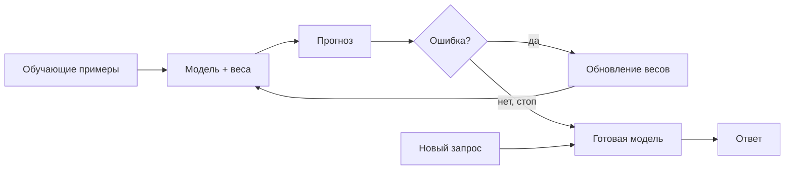
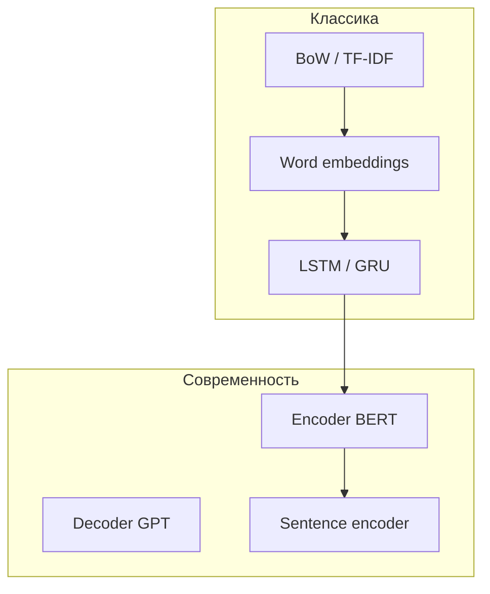
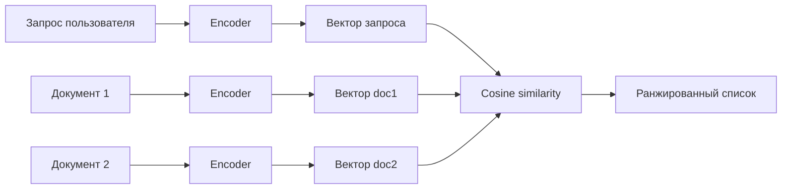

# Модели обучения

<div class="article-tags">
  <span class="tag tag-beginner">ДЛЯ НОВИЧКОВ</span>
  <span class="tag tag-required">ОБЯЗАТЕЛЬНО</span>
</div>

<span class="complexity-badge">Разработчику</span>

**Модель обучения** — это математическая функция с настраиваемыми **параметрами** (весами), которая после обучения на данных превращает вход (текст, числа, изображение) в полезный результат: метку класса, вектор смысла, перевод, ответ. В отличие от жёстко прописанных правил `if`, содержание решения **извлекается из примеров** — см. [Категории обучения](/encyclopedia/6-ai/6-02-mashinnoe-obuchenie/5).

В этой статье — фокус на **текстовых моделях**: от классических эмбеддингов до трансформеров и семантического поиска. Общий обзор ML — [Машинное обучение](/encyclopedia/6-ai/6-02-mashinnoe-obuchenie/1); углублённый NLP-маршрут — [Трансформеры и NLP](/encyclopedia/6-ai/6-09-transformery-i-nlp/intro).

---

## Что такое модель обучения

Модель — это **сжатое представление закономерностей** в обучающих данных. Программист задаёт:

- **архитектуру** — как устроены слои и связи;
- **функцию потерь** — что считать ошибкой;
- **алгоритм оптимизации** — как обновлять веса (SGD, Adam и др.);
- **гиперпараметры** — learning rate, размер батча, число эпох.

После обучения модель **инференсит** — принимает новые данные и выдаёт прогноз без пересчёта градиентов.



В NLP типичные задачи модели обучения:

| Задача | Что предсказывает модель |
|--------|--------------------------|
| Классификация интента | Намерение пользователя («заказать», «отменить») |
| NER | Именованные сущности в тексте |
| Эмбеддинг | Вектор смысла фразы для поиска |
| Генерация | Продолжение или ответ по контексту |

---

## Виды архитектур моделей

Архитектура определяет, **как** модель обрабатывает вход. Для текста исторически выделяют несколько линий:

| Семейство | Идея | Когда уместно |
|-----------|------|---------------|
| **Bag-of-words / TF-IDF** | Частоты слов, без порядка | Быстрый baseline, короткие тексты |
| **Word embeddings** (Word2Vec, FastText, GloVe, Navec) | Плотный вектор на слово | Классификация, поиск похожих слов |
| **RNN / LSTM / GRU** | Последовательная обработка с памятью | Временные ряды текста, старые seq2seq |
| **CNN для текста** | Свёртки по n-граммам | Быстрая классификация на GPU |
| **Transformer** (BERT, MPNet, T5, GPT) | Self-attention, параллельный проход | Современный NLP, высокое качество |
| **Sentence encoders** (SBERT, LaBSE, E5) | Вектор целой фразы | Семантический поиск, RAG |



Подробный разбор трансформеров — [Обзор архитектур](/encyclopedia/6-ai/6-09-transformery-i-nlp/5). Дообучение готовой модели под свою задачу — [Обучение на базе готовой модели](/encyclopedia/6-ai/6-02-mashinnoe-obuchenie/3).

---

## Токены, слои и эмбеддинги

### Токены

**Токен** — минимальная единица, с которой работает модель. Это не всегда слово:

- `"привет"` → 1 токен;
- `"unbelievable"` → `["un", "believ", "able"]` → 3 токена (subword);
- числа и пунктуация — часто отдельные токены.

Токенизация выполняется **токенизатором** (BPE, WordPiece, SentencePiece), привязанным к конкретной модели. Разные модели — разные словари и правила разбиения. Подробнее — [NLP и работа с текстом](/encyclopedia/6-ai/6-09-transformery-i-nlp/1#от-текста-к-признакам) и [Работа с ИИ-моделями](/encyclopedia/6-ai/6-05-razrabotka-ii/113).

### Слои

Нейросеть — стек **слоёв**, каждый преобразует тензор:

| Слой | Роль |
|------|------|
| **Embedding** | ID токена → вектор фиксированной размерности |
| **Attention** | Взвешенное смешивание контекста всех позиций |
| **FFN** (feed-forward) | Нелинейное преобразование каждой позиции |
| **Классификационная голова** | Вектор → метка класса или логиты |
| **Pooling** | Последовательность векторов → один вектор (mean, `[CLS]`, max) |

Ранние слои часто учат **общие** признаки (морфология, синтаксис); поздние — **задачеспецифичные** (интент, тональность).

### Эмбеддинги

**Эмбеддинг** — плотный числовой вектор, кодирующий смысл.

- **Статические** (FastText, Navec) — одно слово → один вектор, независимо от контекста.
- **Контекстуальные** (BERT) — вектор токена зависит от соседей: «банк» у реки и «банк» финансовый получают разные представления.
- **Sentence-level** (MPNet, LaBSE) — один вектор на всю фразу, оптимизированный для сравнения смыслов.

Размерность эмбеддинга (например, 300, 768, 1024) — гиперпараметр архитектуры; от неё зависят память и качество.

---

## Словари, интенты, память, фразы, ошибки

Эти понятия особенно важны при **обучении NLU-модели** — блока, который понимает, *что хочет пользователь*, до генерации ответа (чат-бот, голосовой ассистент, маршрутизация тикетов).

### Словарь (vocabulary)

**Словарь** — таблица соответствия токен ↔ числовой ID. Размер словаря (`vocab_size`) — от нескольких тысяч (компактные модели) до 250 000+ (multilingual LLM). Токены вне словаря обрабатываются как `UNK` или разбиваются на subword.

Словарь **фиксируется при обучении** предобученной модели; при fine-tuning обычно не меняют.

### Интенты

**Интент** (intent) — класс **намерения** пользователя: `order_pizza`, `cancel_booking`, `greeting`. Модель классификации интентов получает фразу и возвращает метку + уверенность.

Обучение требует **размеченных примеров** — десятки–сотни фраз на каждый интент с вариативностью формулировок.

### Фразы (training phrases)

**Фразы** — обучающие примеры: «Хочу пиццу», «Закажи маргариту», «Доставка на дом». Чем разнообразнее формулировки, тем лучше обобщение. Дубли и шаблоны без вариаций ведут к **переобучению** на точные строки.

### Память (контекст диалога)

**Память** в диалоговых системах — сохранённые слоты и история: имя клиента, город, предыдущий интент. Для модели это:

- **краткосрочная** — последние N реплик в контекстном окне;
- **долгосрочная** — внешнее хранилище (БД, векторная база), куда пишут факты из диалога.

LSTM исторически хранил «память» во внутреннем состоянии; трансформеры — в attention по всему контексту (в пределах окна).

### Ошибки

Типичные **ошибки** при обучении и эксплуатации NLU-моделей:

| Ошибка | Причина | Что делать |
|--------|---------|------------|
| Путаница похожих интентов | Мало примеров, пересекающиеся формулировки | Добавить контрастные фразы, уточнить границы классов |
| Низкая уверенность на новых фразах | Доменный сдвиг, жаргон | Дообучить на реальных логах, data augmentation |
| Переобучение | Мало данных, слишком тяжёлая модель | Регуляризация, меньшая модель, больше примеров |
| OOV (out-of-vocabulary) | Редкие слова вне словаря | Subword-токенизация (BERT, FastText) |
| Ложные срабатывания | Дисбаланс классов | Взвешивание классов, порог уверенности, fallback |

Метрики: accuracy, F1 по классам, confusion matrix. См. также [смещение и переобучение](/encyclopedia/6-ai/6-02-mashinnoe-obuchenie/8).

---

## Параметры — размеры моделей, словарей, языки

### Параметры модели

**Параметр** — обучаемый вес (число в матрице). «Модель на 7B» — ~7 миллиардов таких весов. Грубая оценка памяти при inference в FP16: `параметры × 2 байта` (7B ≈ 14 ГБ VRAM без квантизации).

| Модель | Параметры | Типичное применение |
|--------|-----------|---------------------|
| Navec | ~50M (300-dim embeddings) | Русские word vectors |
| FastText ru | ~100M–1B (зависит от корпуса) | Subword embeddings |
| BERT-base | ~110M | Классификация, NER |
| BERT-large | ~340M | Качество выше, медленнее |
| MPNet-base | ~110M | Sentence embeddings EN |
| LaBSE | ~471M | Multilingual sentence similarity |
| ruBERT-large | ~435M | Русский encoder |

### Размер словаря

| Модель | vocab_size (порядок) |
|--------|----------------------|
| BERT-base (cased) | ~30 000 |
| multilingual BERT | ~120 000 |
| GPT-2 / LLM | 50 000–256 000 |
| Navec | ~500 000 лемм (русский корпус) |

Больший словарь — меньше `UNK`, но больше памяти на embedding-матрицу (`vocab_size × hidden_size`).

### Поддерживаемые языки

- **Монолингвальные** (Navec, ruBERT) — заточены под русский; на английском качество падает.
- **Multilingual** (mBERT, LaBSE, mE5) — один чекпоинт на 100+ языков; удобно для смешанных корпусов.
- **Cross-lingual** (LaBSE) — похожие фразы на разных языках близки в векторном пространстве.

Перед выбором проверяйте **model card** на Hugging Face: языки обучения, лицензия, ограничения.

---

## Семантический поиск

**Семантический поиск** находит документы по **смыслу**, а не по точному совпадению слов. Запрос «как оформить возврат» находит статью «политика возврата товара», даже если слова не совпадают.



Типичный pipeline:

1. Разбить базу знаний на **чанки** (абзацы, статьи).
2. Прогнать каждый чанк через **sentence encoder** (MPNet, LaBSE, E5).
3. Сохранить векторы в **векторной БД** ([обзор](/encyclopedia/3-data-markup/3-06-nosql/812)).
4. При запросе — эмбеддинг запроса, **kNN** по cosine similarity, top-k чанков в контекст LLM (RAG).

Метрики качества: Recall@k, MRR, nDCG. Для продакшена важны latency и периодическая переиндексация при обновлении базы.

---

## LSTM-нейросети

**LSTM** (Long Short-Term Memory) — разновидность рекуррентной сети (RNN) с **вентилями** (forget, input, output), которые регулируют, что запомнить и что забыть. Решает проблему **затухающего градиента** обычных RNN на длинных последовательностях.

| Плюсы | Минусы |
|-------|--------|
| Учитывает порядок токенов | Последовательный проход — медленно на GPU |
| Работает на коротких–средних текстах | Уступает трансформерам по качеству NLP |
| Меньше памяти, чем большой BERT | Сложно параллелить обучение |

Сегодня LSTM применяют для **legacy-систем**, временных рядов и как учебный шаг; для новых NLP-проектов чаще берут BERT или sentence encoders. Подробнее — [нейросети, RNN и LSTM](/encyclopedia/6-ai/6-03-neyroseti/113) и [обзор ML](/encyclopedia/6-ai/6-02-mashinnoe-obuchenie/1#lstm-и-gru).

---

## Navec

**Navec** — набор **русских эмбеддингов слов**, обученных на корпусе НКРЯ (Национальный корпус русского языка). Проект [Natasha](https://github.com/natasha/navec) (Александр Кукушкин).

| Характеристика | Значение |
|----------------|----------|
| Размерность | 300 |
| Словарь | ~500 000 лемм |
| Формат | `.tar` с векторами, быстрая загрузка |
| Контекст | Статический — одна лемма → один вектор |

```python
from navec import Navec

navec = Navec.load("navec_hudlit_v1_12B_500K_300d_100q.tar")
vector = navec["машинное"]  # numpy array shape (300,)
```

**Когда использовать:** лёгкая классификация на русском, baseline без GPU, прототипы. **Когда не использовать:** нужен контекст слова («ключ» как инструмент vs музыка) — берите BERT или LaBSE.

---

## FastText

**FastText** (Facebook/Meta) — библиотека для **word embeddings** с ключевой особенностью: вектор слова = сумма векторов **символьных n-грамм**. Слово `где` и редкое `где-нибудь` делят общие n-граммы — меньше проблем с OOV.

| Характеристика | Детали |
|----------------|--------|
| Обучение | На своём корпусе или готовые `cc.ru.300.bin` |
| Subword | Символьные n-граммы длиной 3–6 |
| Задачи | Классификация текста, поиск похожих слов, лёгкий inference |
| Размер | От компактных 300-dim до больших бинарников на весь Common Crawl |

```python
import fasttext

# Предобученные векторы (скачать с fasttext.cc)
model = fasttext.load_model("cc.ru.300.bin")
model.get_word_vector("обучение")

# Обучение классификатора на своих метках
model_sup = fasttext.train_supervised("train.txt", epoch=25, lr=0.5, wordNgrams=2)
model_sup.predict("Хочу отменить заказ")
```

**Плюсы:** быстро, мало ресурсов, хорош для коротких текстов и продакшен-микросервисов ([микро-ML](/encyclopedia/6-ai/6-06-primenenie-ii/113)). **Минусы:** нет глубокого контекста предложения — для семантического поиска по абзацам лучше MPNet или LaBSE.

---

## BERT

**BERT** (Bidirectional Encoder Representations from Transformers, Google, 2018) — **encoder-only** трансформер, предобученный на задачах **Masked Language Modeling** (угадай замаскированное слово) и **Next Sentence Prediction**.

| Свойство | Описание |
|----------|----------|
| Контекст | Двунаправленный — видит слова слева и справа |
| Выход | Вектор на каждый токен + специальный `[CLS]` на всё предложение |
| Fine-tuning | Добавить голову классификатора, обучить на своих метках |
| Русский | `DeepPavlov/rubert-base-cased`, `ai-forever/ruBert-large` |

```python
from transformers import AutoTokenizer, AutoModelForSequenceClassification

tokenizer = AutoTokenizer.from_pretrained("cointegrated/rubert-tiny2")
model = AutoModelForSequenceClassification.from_pretrained(
    "cointegrated/rubert-tiny2",
    num_labels=5,  # число интентов
)
inputs = tokenizer("Хочу вернуть товар", return_tensors="pt")
outputs = model(**inputs)
# outputs.logits — оценки по классам
```

BERT — **рабочая лошадка** для классификации, NER, извлечения сущностей. Для сравнения **целых предложений** (поиск) поверх BERT часто обучают sentence-BERT или берут специализированные encoder'ы — MPNet, LaBSE.

Разбор семейства — [Обзор трансформерных архитектур](/encyclopedia/6-ai/6-09-transformery-i-nlp/5#encoder-only).

---

## MPNet

**MPNet** (Microsoft, 2020) — encoder, объединяющий идеи BERT (masked tokens) и XLNet (permutation language modeling). В линейке **sentence-transformers** модель `sentence-transformers/all-mpnet-base-v2` — популярный **англоязычный** sentence encoder.

| Характеристика | Значение |
|----------------|----------|
| Параметры | ~110M |
| Размерность эмбеддинга | 768 |
| Язык | Преимущественно английский |
| Метрика сравнения | Cosine similarity |

```python
from sentence_transformers import SentenceTransformer

model = SentenceTransformer("sentence-transformers/all-mpnet-base-v2")
emb1 = model.encode("How to reset my password")
emb2 = model.encode("Password recovery steps")
# cosine_similarity(emb1, emb2) — высокая для близких по смыслу фраз
```

Для **русского** semantic search на Hub есть `ai-forever/sbert_large_nlu_ru`, `intfloat/multilingual-e5-large` — MPNet напрямую на русском хуже.

---

## LaBSE

**LaBSE** (Language-agnostic BERT Sentence Embedding, Google) — **мультиязычный** sentence encoder: похожие по смыслу фразы на **разных языках** лежат рядом в векторном пространстве.

| Характеристика | Значение |
|----------------|----------|
| Чекпоинт | `sentence-transformers/LaBSE` |
| Параметры | ~471M |
| Размерность | 768 |
| Языки | 100+ (включая русский) |
| Задача | Cross-lingual semantic similarity, поиск, clustering |

```python
from sentence_transformers import SentenceTransformer

model = SentenceTransformer("sentence-transformers/LaBSE")
ru = model.encode("Как оформить возврат товара")
en = model.encode("How to return a product")
# Высокая cosine similarity между ru и en
```

**Когда выбирать LaBSE:** мультиязычная база знаний, смешанные RU/EN запросы, кросс-лингвальный поиск без перевода. **Альтернативы:** `intfloat/multilingual-e5-large`, `BAAI/bge-m3` — часто сильнее на бенчмарках 2023–2025, но LaBSE остаётся понятным baseline.

---

## Как выбрать модель

| Задача | Старт | Если нужно лучше |
|--------|-------|------------------|
| Классификация интентов (RU) | FastText supervised | `rubert-tiny2` + fine-tune |
| NER, извлечение сущностей | ruBERT + token classification | `DeepPavlov` pipelines |
| Семантический поиск (RU) | LaBSE или e5-multilingual | `bge-m3`, дообучение на своих парах |
| Семантический поиск (EN) | MPNet | e5-large, Cohere/Voyage API |
| Лёгкий edge без GPU | FastText, Navec + логрег | `rubert-tiny2` в ONNX |
| Генерация ответов | — | LLM + RAG ([модели и инструменты](/encyclopedia/6-ai/6-04-modeli-i-instrumenty/1)) |

Общий pipeline: **baseline на простой модели** → замер метрик → усложнение только при доказанной необходимости.

---

## Связь с другими материалами

| Тема | Статья |
|------|--------|
| NLP-задачи, корпуса, метрики | [NLP и работа с текстом](/encyclopedia/6-ai/6-09-transformery-i-nlp/1) |
| Fine-tuning, LoRA | [Дообучение под задачи NLP](/encyclopedia/6-ai/6-09-transformery-i-nlp/4) |
| Hugging Face, русские чекпоинты | [Практика с предобученными моделями](/encyclopedia/6-ai/6-09-transformery-i-nlp/6) |
| Векторные БД, RAG | [Векторные базы данных](/encyclopedia/3-data-markup/3-06-nosql/812) |
| RNN, LSTM, трансформеры | [Нейросети — RNN и трансформеры](/encyclopedia/6-ai/6-03-neyroseti/113) |
| Transfer learning | [Обучение на базе готовой модели](/encyclopedia/6-ai/6-02-mashinnoe-obuchenie/3) |
