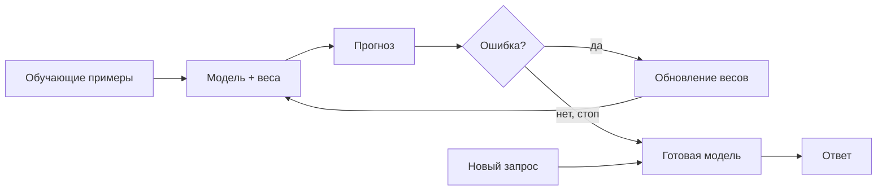
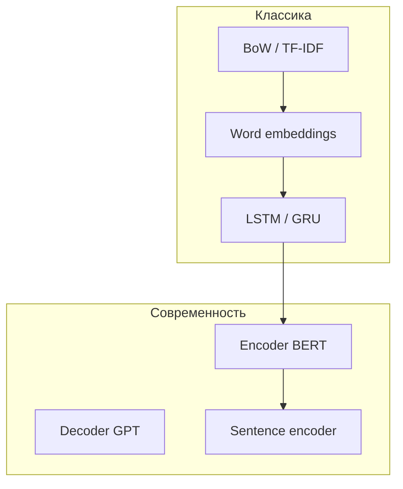
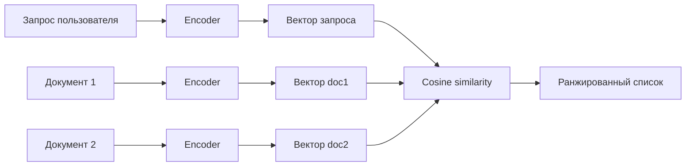

# Модели обучения

<div class="article-tags">
  <span class="tag tag-beginner">ДЛЯ НОВИЧКОВ</span>
  <span class="tag tag-required">ОБЯЗАТЕЛЬНО</span>
</div>

<span class="complexity-badge">Разработчику</span>

**Модель обучения** — это математическая функция с настраиваемыми **параметрами** (весами), которая после обучения на данных превращает вход (текст, числа, изображение) в полезный результат — метку класса, вектор смысла, перевод, ответ. В отличие от жёстко прописанных правил `if`, содержание решения **извлекается из примеров** — см. [Категории обучения](/encyclopedia/6-ai/6-02-mashinnoe-obuchenie/5).

Математическая функция - это правило или механизм, который берет одно число (или набор чисел) и по строгой формуле превращает его в другое число. Например, возьмём соковыжималку - вы кладете внутрь апельсин, функция совершает действие (выжимает) и выдает сок.

Настраиваемые параметры (веса) - это внутренние регуляторы, «ручки» и «тумблеры» внутри математической функции. Меняя их положения, мы меняем то, как именно функция обрабатывает входящие данные. Как настройки гитары или рецепт супа. Изменяя количество соли (параметр), вы меняете итоговый вкус. В процессе обучения компьютер крутит эти «ручки» миллионы раз, пока функция не начнет выдавать правильные результаты.

Вход (Данные) - это информация, которую мы даем модели для обработки. Компьютер не понимает текст или картинки напрямую, поэтому перед подачей на вход они всегда превращаются в наборы чисел.

А результат (выход) - это финальный ответ, который выдает функция после выполнения всех расчетов.

В этой статье — фокус на **текстовых моделях**: от классических эмбеддингов до трансформеров и семантического поиска. Общий обзор ML — [Машинное обучение](/encyclopedia/6-ai/6-02-mashinnoe-obuchenie/1); углублённый NLP-маршрут — [Трансформеры и NLP](/encyclopedia/6-ai/6-09-transformery-i-nlp/intro).

---

## Что такое модель обучения

Модель — это **сжатое представление закономерностей** в обучающих данных. Программист задаёт:

- **архитектуру** — как устроены слои и связи;
- **функцию потерь** — что считать ошибкой;
- **алгоритм оптимизации** — как обновлять веса (SGD, Adam и др.);
- **гиперпараметры** — learning rate, размер батча, число эпох.

После обучения модель **инференсит** — принимает новые данные и выдаёт прогноз без пересчёта градиентов.

Инференс (Inference) — это процесс использования уже обученной модели для получения результатов на новых, реальных данных. Говоря простыми словами, это работа модели в режиме эксплуатации, когда этап учебы закончился и начался этап практики.

Каждый раз, когда вы используете современные технологии, вы запускаете инференс какой-то модели:
- Переводчик: Вы ввели фразу «How are you?» и нажали кнопку. Модель выполнила инференс и мгновенно выдала: «Как дела?».
- FaceID: Вы поднесли телефон к лицу. Камера сделала снимок, модель прогнала его через свои «замороженные» веса и выдала метку: «Хозяин» (телефон разблокирован).
- Генерация текста: Вы пишете запрос в ChatGPT. Нейросеть не учится в этот момент, она делает инференс — рассчитывает и выдает вам наиболее подходящий ответ слово за словом.



В NLP типичные задачи модели обучения:

| Задача | Что предсказывает модель |
|--------|--------------------------|
| Классификация интента | Намерение пользователя ("заказать", "отменить") |
| NER | Именованные сущности в тексте |
| Эмбеддинг | Вектор смысла фразы для поиска |
| Генерация | Продолжение или ответ по контексту |

---

## Виды архитектур моделей

Архитектура определяет, **как** модель обрабатывает вход. Для текста исторически выделяют несколько линий:

| Семейство | Идея | Когда уместно |
|-----------|------|---------------|
| **Bag-of-words / TF-IDF** | Частоты слов, без порядка | Быстрый baseline, короткие тексты |
| **Word embeddings** (Word2Vec, FastText, GloVe, Navec) | Плотный вектор на слово | Классификация, поиск похожих слов |
| **RNN / LSTM / GRU** | Последовательная обработка с памятью | Временные ряды текста, старые seq2seq |
| **CNN для текста** | Свёртки по n-граммам | Быстрая классификация на GPU |
| **Transformer** (BERT, MPNet, T5, GPT) | Self-attention, параллельный проход | Современный NLP, высокое качество |
| **Sentence encoders** (SBERT, LaBSE, E5) | Вектор целой фразы | Семантический поиск, RAG |



Bag-of-Words (BoW) — «Мешок слов». Этот метод полностью игнорирует порядок слов и грамматику. Он просто собирает все уникальные слова из всех текстов в один большой «словарь» (мешок), а затем считает, сколько раз каждое слово встретилось в конкретном предложении.

TF-IDF (Частота термина — Обратная частота документа) - метод умнее. Он не просто считает количество слов, а оценивает важность слова. Если слово часто встречается в этом документе, но редко встречается в других документах, значит, оно уникально и очень важно для понимания смысла. Формула состоит из двух частей:
- TF (Term Frequency): Как часто слово встречается в конкретном тексте. (Чем чаще, тем вес выше).
- IDF (Inverse Document Frequency): В скольких текстах вообще встречается это слово. Если оно есть везде (как предлог «и» или слово «компьютер» на ИТ-портале), его ценность штрафуется и падает до нуля.

Word Embeddings (Векторные представления слов) — это современный способ перевода слов в числа, который, в отличие от Bag-of-Words и TF-IDF, умеет понимать смысл слов, контекст и синонимы. Вместо гигантских строк из нулей, эмбеддинг превращает каждое слово в компактный вектор (обычно от 100 до 1024 чисел), где закодированы его семантические свойства.

RNN (Recurrent Neural Network) — Рекуррентная нейросеть. Базовая архитектура. У неё есть петля обратной связи, которая работает как кратковременная память. При обработке текущего слова сеть передает себе на вход информацию о предыдущем слове. Главная проблема (Затухание градиента) - память RNN очень короткая. Когда предложение длинное (больше 5–7 слов), сеть намертво забывает то, что было в самом начале. Математически при обучении числа уменьшаются и превращаются в ноль.

LSTM (Long Short-Term Memory) — Долгая краткосрочная память. Решение проблемы забывчивости RNN. В LSTM добавили «магистраль памяти» (Cell State), которая тянется через всю цепочку обработки, и систему фильтров (гейтов), которые управляют этой памятью.

GRU (Gated Recurrent Unit) — Управляемый рекуррентный блок. Это упрощенная и ускоренная версия LSTM, созданная в 2014 году. Разработчики объединили магистраль памяти и скрытое состояние, а также сократили количество фильтров.

CNN (Convolutional Neural Networks / Сверточные нейросети) изначально создавались для обработки изображений (поиска объектов, лиц). Однако они отлично применимы и к тексту, где показывают высокую скорость работы. Если в картинках свертка ищет локальные узоры (края, линии, текстуры), то в тексте она ищет важные словосочетания и фразы (n-граммы), игнорируя их точное положение в предложении.

Transformer (Трансформер) — это самая важная архитектура в современном искусственном интеллекте. Она была представлена компанией Google в 2017 году в культовой статье «Attention Is All You Need» и полностью заменила собой RNN, LSTM и CNN в задачах обработки текста. Именно на архитектуре Transformer работают ChatGPT, Клауд, Midjourney, Google-переводчик и все современные большие языковые модели (LLM). Предыдущие сети (LSTM) читали текст строго по очереди, слово за словом. Трансформер смотрит на весь текст сразу целиком. Чтобы понять смысл конкретного слова, он вычисляет его связь со всеми остальными словами в предложении одновременно.

Sentence Encoders (Кодировщики предложений) — это специализированные нейросетевые модели, которые переводят целый текст (предложение, абзац или даже небольшую статью) в один компактный вектор смысла (эмбеддинг) фиксированной длины (обычно от 384 до 1024 чисел). Если обычные Word Embeddings (например, Word2Vec) создают векторы для отдельных слов, то Sentence Encoders сжимают в единый вектор контекст, логику и суть всего высказывания.

Подробный разбор трансформеров — [Обзор архитектур](/encyclopedia/6-ai/6-09-transformery-i-nlp/5). Дообучение готовой модели под свою задачу — [Обучение на базе готовой модели](/encyclopedia/6-ai/6-02-mashinnoe-obuchenie/3).

---

## Токены, слои и эмбеддинги

### Токены

**Токен** — минимальная единица, с которой работает модель. Это не всегда слово:

- `"привет"` → 1 токен;
- `"unbelievable"` → `["un", "believ", "able"]` → 3 токена (subword);
- числа и пунктуация — часто отдельные токены.

Компьютер не умеет читать слова целиком, как человек. Перед тем как текст попадет в модель, специальный алгоритм — токенизатор (Tokenizer) — разрезает его на кусочки (токены), а затем превращает каждый кусочек в уникальный цифровой ID.

В современных моделях используется алгоритм Subword Tokenization (субсловесная токенизация). Токеном может быть:
- Целое слово (если оно короткое и часто встречается): `привет`, `apple`, `the`.
- Часть слова / корень / суффикс (для редких или длинных слов): слово `трансформер` токенизатор может разбить на `транс` + `##формер`.
- Одиночный символ или буква (для редких знаков или формул): `х`, `%`, `§`.
- Знаки препинания и пробелы: `,`, `!`, `[пробел]`.

Фраза на английском: «`Tokenization is smart`» - Модель может увидеть это как 4 токена: `[Token]` `[ization]` `[is]` `[smart]`.

Поскольку большинство нейросетей (GPT, Claude) обучаются в основном на английском интернете, их словарь токенов оптимизирован под английский язык. На английском языке один токен — это примерно 4 символа или 0.75 слова (почти каждое слово — один токен).

На русском языке слова часто бьются на мелкие кусочки (слоги и даже отдельные буквы). Из-за этого русское слово из 7 букв может превратиться в 3–4 токена. Именно поэтому лимиты контекста в чат-ботах на русском языке расходуются быстрее, а API стоит дороже.

Для модели слова книга и  книга (с пробелом перед ним) — это часто два абсолютно разных токена с разными цифровыми ID.

Токенизатор (Tokenizer) — это отдельная программа или программный модуль, который подготавливает сырой текст перед отправкой в нейросеть. Это своего рода «переводчик» с человеческого языка на язык чисел. Если токен — это сама единица текста, то токенизатор — это инструмент, который этот текст режет и кодирует.

Токенизация (Tokenization) — это сам процесс или технология разбиения непрерывного потока текста на отдельные элементы (токены) и их последующая замена на числовые идентификаторы.Если токенизатор — это программа-инструмент, а токен — единица измерения, то токенизация — это первый и обязательный этап в конвейере обработки естественного языка (NLP), без которого ни один Трансформер не сможет прочитать текст.

Токенизация выполняется **токенизатором** (BPE, WordPiece, SentencePiece), привязанным к конкретной модели. Разные модели — разные словари и правила разбиения. Подробнее — [NLP и работа с текстом](/encyclopedia/6-ai/6-09-transformery-i-nlp/1#от-текста-к-признакам) и [Работа с ИИ-моделями](/encyclopedia/6-ai/6-05-razrabotka-ii/113).

### Слои

Слои (Layers) — это основные строительные блоки любой нейросети. Каждый слой состоит из группы математических функций (нейронов), которые работают параллельно и выполняют определенный этап обработки данных. Если представить нейросеть как заводской конвейер, то слои — это рабочие цеха. Сырые данные (например, пиксели картинки или токены текста) заходят в первый цех, последовательно обрабатываются каждым слоем и превращаются в готовый результат на выходе.

Тензор (Tensor) — это фундаментальная единица хранения и обработки данных в искусственном интеллекте. Говоря самым простым языком, это многомерный массив чисел. Если в обычной математике мы работаем с одиночными числами или таблицами, то в нейросетях абсолютно все данные (тексты, картинки, звуки, веса слоев) упаковываются в тензоры. Это нужно для того, чтобы мощные видеокарты (GPU) могли мгновенно выполнять над ними миллионы математических операций.

Нейросети работают на специальных библиотеках (например, PyTorch или TensorFlow). Их тензоры кардинально отличаются от стандартных массивов в языках программирования двумя суперсилами:
- Поддержка GPU / TPU: Обычный процессор компьютера (CPU) считает числа последовательно. Видеокарта (GPU) умеет считать тысячи чисел одновременно. Тензоры устроены так, что их можно в один клик перенести в память видеокарты для сверхбыстрых параллельных вычислений.
- Автоматическое дифференцирование: Во время обучения нейросети нужно знать, в какую сторону менять параметры (веса), чтобы исправить ошибку. Тензоры в PyTorch «помнят», какие математические операции над ними совершались, и умеют автоматически рассчитывать градиенты (направление изменений) для алгоритма обратного распространения ошибки.

> Дифференцирование в математике — это процесс нахождения производной. Если говорить простыми словами в контексте искусственного интеллекта, дифференцирование — это математический инструмент, который позволяет узнать, как сильно и в какую сторону изменится результат функции, если мы чуть-чуть покрутим один из её параметров (весов). Именно благодаря дифференцированию нейросети способны обучаться на своих ошибках.

Нейросеть — стек **слоёв**, каждый преобразует тензор:

| Слой | Роль |
|------|------|
| **Embedding** | ID токена → вектор фиксированной размерности |
| **Attention** | Взвешенное смешивание контекста всех позиций |
| **FFN** (feed-forward) | Нелинейное преобразование каждой позиции |
| **Классификационная голова** | Вектор → метка класса или логиты |
| **Pooling** | Последовательность векторов → один вектор (mean, `[CLS]`, max) |

Ранние слои часто учат **общие** признаки (морфология, синтаксис); поздние — **задачеспецифичные** (интент, тональность).

Attention (Механизм внимания) — это математический алгоритм в нейросетях, который позволяет модели при обработке конкретного элемента (например, слова в тексте или пикселя на картинке) динамически фокусироваться на других, наиболее важных в данный момент частях данных. Именно механизм внимания избавил ИИ от проблемы «короткой памяти» рекуррентных сетей (LSTM) и лег в основу архитектуры Transformer.

FFN (Feed-Forward Network / Полносвязная нейросеть прямого распространения) — это стандартный вычислительный блок нейросети, в котором данные движутся строго в одном направлении: от входа к выходу. В нем нет петель обратной связи (как в RNN) и скользящих окон (как в CNN).

Классификационная голова (Classification Head) — это финальный слой (или небольшая группа слоев) нейросети, который принимает абстрактные математические векторы из глубины модели и превращает их в конкретный, понятный человеку ответ: метку класса (категорию).

Пулинг (Pooling / Слой подвыборки или агрегации) — это специальный слой в нейросетях, который уменьшает размерность данных (их ширину и высоту), сохраняя при этом самую важную информацию. Если говорить просто, пулинг — это процесс сжатия или обобщения данных. Он берет большую матрицу чисел и превращает её в маленькую, отбрасывая лишние детали и снижая нагрузку на видеокарту.

---

### Эмбеддинги

Эмбеддинг (Embedding / Векторное представление) — это процесс и результат перевода любого сложного объекта (слова, целого текста, картинки или аудио) в строку чисел (вектор) фиксированной длины, в которой математически закодирован смысл этого объекта. Ранее мы уже разбирали Word Embeddings (для отдельных слов) и Sentence Encoders (для целых предложений). Теперь объединим это в общую концепцию, так как эмбеддинги — это универсальный «язык смыслов» внутри любого искусственного интеллекта.

Представьте себе гигантскую воображаемую комнату, в которой есть тысячи измерений (осей координат). Каждое число в эмбеддинге — это координата объекта по одной из этих осей.Модель обучается так, чтобы похожие по смыслу вещи оказывались в этой комнате рядом.

**Эмбеддинг** — плотный числовой вектор, кодирующий смысл.

- **Статические** (FastText, Navec) — одно слово → один вектор, независимо от контекста.
- **Контекстуальные** (BERT) — вектор токена зависит от соседей: "банк" у реки и "банк" финансовый получают разные представления.
- **Sentence-level** (MPNet, LaBSE) — один вектор на всю фразу, оптимизированный для сравнения смыслов.

Размерность эмбеддинга (например, 300, 768, 1024) — гиперпараметр архитектуры; от неё зависят память и качество.

---

## Словари, интенты, память, фразы, ошибки

Эти понятия особенно важны при **обучении NLU-модели** — блока, который понимает, *что хочет пользователь*, до генерации ответа (чат-бот, голосовой ассистент, маршрутизация тикетов).

### Словарь (vocabulary)

Словарь (Vocabulary) — это полный упорядоченный набор всех уникальных текстовых единиц (токенов), которые нейросеть способна распознавать на входе и генерировать на выходе. Словарь жестко закладывается на этапе создания токенизатора и определяет границы «мира» конкретной модели: если элемента нет в словаре, сеть буквально не сможет его прочитать или написать.

Математически словарь — это простая таблица сопоставления текстовых кусочков и их уникальных цифровых индексов (ID). Когда токенизатор переводит текст в тензор, он просто заменяет буквы на эти индексы из таблицы. Размер этой таблицы называют размером словаря (Vocabulary Size).

**Словарь** — таблица соответствия токен ↔ числовой ID. Размер словаря (`vocab_size`) — от нескольких тысяч (компактные модели) до 250 000+ (multilingual LLM). Токены вне словаря обрабатываются как `UNK` или разбиваются на subword.

Словарь **фиксируется при обучении** предобученной модели; при fine-tuning обычно не меняют.

### Интенты

**Интент** (intent) — класс **намерения** пользователя — `order_pizza`, `cancel_booking`, `greeting`. Модель классификации интентов получает фразу и возвращает метку + уверенность.

Люди формулируют одну и ту же мысль абсолютно по-разному. Задача ИИ — свести сотни разных фраз к одному конкретному действию. Интенты (Intents / Намерения) — это цели, намерения или задачи, которые пользователь хочет решить, когда отправляет сообщение или задает вопрос чат-боту (ИИ-ассистенту). Если говорить простыми словами, интент — это ответ на вопрос: «Чего на самом деле хочет пользователь?». Поиск интента превращает хаотичную человеческую речь в понятную для компьютерной системы команду.

Чтобы выполнить команду пользователя, одного интента часто бывает мало. Нужно вытащить из текста конкретные детали. Эти детали называются сущностями (Entities).

Обучение требует **размеченных примеров** — десятки–сотни фраз на каждый интент с вариативностью формулировок.

### Фразы (training phrases)

**Фразы** — обучающие примеры — "Хочу пиццу", "Закажи маргариту", "Доставка на дом". Чем разнообразнее формулировки, тем лучше обобщение. Дубли и шаблоны без вариаций ведут к **переобучению** на точные строки.

Если интент — это целевая команда, которую должна выполнить система, то обучающие фразы — это входные данные, на которых тренируется классификационная голова модели. Фразы (Training Phrases / Обучающие фразы) — это примеры текстовых запросов, которые разработчики собирают и загружают в модель, чтобы научить её правильно распознавать конкретный интент (намерение). 

Чтобы ИИ-ассистент понял, что фразы «привет», «добрый день» и «хай» означают одно и то же намерение поздороваться, разработчик размечает данные пакетами (батчами):
1. Интент: «Greeting» (Приветствие)
- Фраза 1: «Привет, бот!»
- Фраза 2: «Здравствуйте»
- Фраза 3: «Добрый вечер»
2. Интент: «Help» (Помощь)
- Фраза 1: «Что ты умеешь?»
- Фраза 2: «Мне нужна помощь»
- Фраза 3: «Как этим пользоваться?»

Модель пропускает эти фразы через токенизатор и слой эмбеддингов, превращая их в векторы смысла. В процессе дифференцирования веса модели настраиваются так, чтобы векторы всех фраз из одного интента легли в многомерном пространстве максимально близко друг к другу.

Качество работы инференса (распознавания целей пользователя на практике) напрямую зависит от того, насколько грамотно составлен этот список.

### Память (контекст диалога)

**Память** в диалоговых системах — сохранённые слоты и история — имя клиента, город, предыдущий интент. Для модели это:

- **краткосрочная** — последние N реплик в контекстном окне;
- **долгосрочная** — внешнее хранилище (БД, векторная база), куда пишут факты из диалога.

LSTM исторически хранил "память" во внутреннем состоянии; трансформеры — в attention по всему контексту (в пределах окна).

Поскольку классический инференс Трансформеров по своей природе является «беспамятным» (модель обрабатывает каждый запрос изолированно, с чистого листа), память реализуется с помощью специальных инженерных подходов. Существует популярное заблуждение, что чат-бот (например, ChatGPT) «запоминает» ваши слова так же, как человек. На самом деле ИИ ничего не держит в голове между вашими сообщениями. Каждый раз, когда вы отправляете новую фразу, за кулисами интерфейса происходит скрытая склейка всей истории диалога.

Токенизатор превращает всю эту гигантскую склеенную ленту текста в один длинный тензор, и модель заново прогоняет его через свои слои внимания (Attention). Механизм внимания связывает вопрос «Как меня зовут?» с токеном «Алексей» из самого первого сообщения, и модель выдает правильный ответ.

Если диалог длится часами, отправлять всю историю целиком становится невозможно: забивается контекстное окно (лимит токенов), а инференс начинает сильно дорожать и тормозить из-за квадратичной сложности внимания. Поэтому инженеры используют разные стратегии управления памятью.


### Ошибки

NLU (Natural Language Understanding / Понимание естественного языка) — это крупное поднаправление в сфере искусственного интеллекта, главная задача которого — помочь компьютеру не просто прочитать текст, а понять его реальный смысл, намерение автора и контекст. NLU является важнейшей частью более широкой дисциплины NLP (Natural Language Processing). Если NLP отвечает за сбор, очистку и любую базовую обработку текста, то NLU — это именно «мозг» системы, отвечающий за интерпретацию.

Типичные **ошибки** при обучении и эксплуатации NLU-моделей:

| Ошибка | Причина | Что делать |
|--------|---------|------------|
| Путаница похожих интентов | Мало примеров, пересекающиеся формулировки | Добавить контрастные фразы, уточнить границы классов |
| Низкая уверенность на новых фразах | Доменный сдвиг, жаргон | Дообучить на реальных логах, data augmentation |
| Переобучение | Мало данных, слишком тяжёлая модель | Регуляризация, меньшая модель, больше примеров |
| OOV (out-of-vocabulary) | Редкие слова вне словаря | Subword-токенизация (BERT, FastText) |
| Ложные срабатывания | Дисбаланс классов | Взвешивание классов, порог уверенности, fallback |

Метрики — accuracy, F1 по классам, confusion matrix. См. также [смещение и переобучение](/encyclopedia/6-ai/6-02-mashinnoe-obuchenie/8).

---

## Параметры — размеры моделей, словарей, языки

### Параметры модели

Параметры модели — это общее количество внутренних переменных, которые система настраивает в процессе обучения. Параметры состоят из двух элементов:
- Веса (Weights) — числовые коэффициенты, которые определяют силу связи между нейронами. Они показывают, насколько сильно конкретный входной признак влияет на итоговый результат.
- Смещения (Biases) — дополнительные константы, которые позволяют сдвигать функцию активации нейрона для более точной настройки.

Когда говорят, что модель имеет «70 миллиардов параметров» (70B), имеют в виду общий объем ее цифровой памяти. Веса модели — это конкретные сохраненные файлы с этими числами (например, в форматах `.safetensors` или `.gguf`), которые запускают на видеокартах для генерации текста или распознавания образов.

**Параметр** — обучаемый вес (число в матрице). "Модель на 7B" — ~7 миллиардов таких весов. Грубая оценка памяти при inference в FP16: `параметры × 2 байта` (7B ≈ 14 ГБ VRAM без квантизации).

| Модель | Параметры | Типичное применение |
|--------|-----------|---------------------|
| Navec | ~50M (300-dim embeddings) | Русские word vectors |
| FastText ru | ~100M–1B (зависит от корпуса) | Subword embeddings |
| BERT-base | ~110M | Классификация, NER |
| BERT-large | ~340M | Качество выше, медленнее |
| MPNet-base | ~110M | Sentence embeddings EN |
| LaBSE | ~471M | Multilingual sentence similarity |
| ruBERT-large | ~435M | Русский encoder |

### Размер словаря

В контексте машинного обучения и языковых моделей (LLM) размер словаря (Vocabulary Size) — это общее количество уникальных текстовых единиц, которые модель способна распознать и сгенерировать.

Модели делят текст не на целые слова, а на токены (части слов, слоги, буквы или знаки препинания). Размер словаря — это именно количество таких токенов. Размер словаря напрямую влияет на количество параметров модели. Финальный слой нейросети (матрица эмбеддингов) имеет размерность `[размер словаря × скрытая размерность модели]`.

В современных моделях размер словаря обычно составляет от 32 000 до 256 000 токенов.

| Модель | vocab_size (порядок) |
|--------|----------------------|
| BERT-base (cased) | ~30 000 |
| multilingual BERT | ~120 000 |
| GPT-2 / LLM | 50 000–256 000 |
| Navec | ~500 000 лемм (русский корпус) |

Больший словарь — меньше `UNK`, но больше памяти на embedding-матрицу (`vocab_size × hidden_size`).
- Чем больше словарь, тем длиннее токены. Модель тратит меньше токенов на одно предложение, что экономит контекстное окно и ускоряет генерацию.
- Маленький словарь хорошо работает для английского, но дробит слова из русского или китайского языка на отдельные буквы. Большой словарь позволяет кодировать русские слова целиком или крупными слогами.
- Слишком большой словарь сильно раздувает размер самой модели, так как требует хранения миллионов дополнительных связей (весов).

### Поддерживаемые языки

- **Монолингвальные** (Navec, ruBERT) — заточены под русский; на английском качество падает. Весь обучающий датасет и словарь (Vocabulary) оптимизированы под конкретную лингвистическую структуру. Максимальное качество понимания нюансов, сленга и грамматики этого языка. Компактный размер словаря (обычно 32 000 – 50 000 токенов) экономит память. Абсолютно бесполезны на других языках. Если подать чужой текст, модель начнет дробить его на отдельные символы или выдаст ошибку. Примеры: YandexGPT / GigaChat (ранние версии, оптимизированные под русский), CamemBERT (для французского).
- **Multilingual** (mBERT, LaBSE, mE5) — один чекпоинт на 100+ языков; удобно для смешанных корпусов. В обучающую выборку входят тексты на разных языках, а словарь расширяется до 100 000 – 256 000+ токенов, чтобы вместить разные алфавиты (кириллицу, иероглифы, вязь). Одна модель может отвечать пользователям со всего мира и выполнять переводы. Примеры: GPT-4, Gemma 2, LLaMA 3, mBERT.
- **Cross-lingual** (LaBSE) — похожие фразы на разных языках близки в векторном пространстве. Модели (или скрытые пространства эмбеддингов), способные переносить знания из одного языка в другой без прямого перевода. Модель обучается так, чтобы слова со схожим смыслом из разных языков (например, «apple», «яблоко», «pomme») находились в одной и той же точке ее внутреннего математического пространства (векторного пространства). Если обучить кросс-языковую модель классифицировать токсичные комментарии только на английском языке, она автоматически начнет качественно классифицировать их на русском или испанском, даже если не видела русских примеров при обучении (Zero-shot transfer). Примеры: XLM-RoBERTa, LaBSE (от Google), мультиязычные эмбеддинги от Cohere.

Перед выбором проверяйте **model card** на Hugging Face — языки обучения, лицензия, ограничения.

> «Проклятие мультиязычности» (Curse of Multilinguality) — если размер модели (количество параметров) ограничен, добавление новых языков ухудшает качество работы на каждом из них, так как емкость сети размывается.


---

## Семантический поиск

Семантический поиск — это метод поиска информации, который ищет документы не по точному совпадению ключевых слов, а по смыслу и контексту запроса. Вместо механического сравнения букв алгоритм переводит текст в математические векторы (эмбеддинги), позволяя находить ответы даже тогда, когда автор документа и ищущий человек использовали абсолютно разные слова.
- Нейросеть (bi-encoder) превращает поисковый запрос и документы из базы данных в длинные цепочки чисел — векторы фиксированной длины.
- Близкие по смыслу фразы (например, «как вылечить простуду» и «терапия ОРВИ дома») в этом математическом пространстве оказываются рядом.
- Векторная база данных (векторный индекс) за миллисекунды вычисляет геометрическое расстояние (косинусное сходство) между вектором запроса и векторами документов, выдавая самые релевантные результаты.

**Семантический поиск** находит документы по **смыслу**, а не по точному совпадению слов. Запрос "как оформить возврат" находит статью "политика возврата товара", даже если слова не совпадают.



Типичный pipeline:

1. Разбить базу знаний на **чанки** (абзацы, статьи).
2. Прогнать каждый чанк через **sentence encoder** (MPNet, LaBSE, E5).
3. Сохранить векторы в **векторной БД** ([обзор](/encyclopedia/3-data-markup/3-06-nosql/812)).
4. При запросе — эмбеддинг запроса, **kNN** по cosine similarity, top-k чанков в контекст LLM (RAG).

Чанки (Chunks) — это небольшие текстовые фрагменты (сегменты), на которые разбивается большой документ перед тем, как превратить его в вектор для семантического поиска. Большие языковые модели и модели эмбеддингов не могут обрабатывать огромные книги или длинные инструкции целиком из-за ограничений на размер контекстного окна (например, 512 или 1024 токена для био-энкодеров). Чанкинг решает эту проблему.

Sentence Encoder (кодировщик предложений) — это специализированная нейросетевая модель, которая превращает целые предложения, абзацы или короткие тексты (чанки) в плотные векторы фиксированной длины (эмбеддинги). Эти векторы отражают семантический смысл текста, что делает Sentence Encoder главным инструментом для семантического поиска, систем RAG и кластеризации.

Метрики качества — Recall@k, MRR, nDCG. Для продакшена важны latency и периодическая переиндексация при обновлении базы.

---

## LSTM-нейросети

**LSTM** (Long Short-Term Memory) — разновидность рекуррентной сети (RNN) с **вентилями** (forget, input, output), которые регулируют, что запомнить и что забыть. Решает проблему **затухающего градиента** обычных RNN на длинных последовательностях.

В отличие от стандартных слоев, ячейка LSTM содержит внутреннее состояние (cell state), которое идет транзитом через всю цепочку вычислений. LSTM-нейросети (Long Short-Term Memory — долгая краткосрочная память) — это специализированный тип рекуррентных нейронных сетей (RNN), предназначенный для обработки и прогнозирования последовательных данных и временных рядов. Главная особенность LSTM заключается в их способности запоминать важную информацию на длительные периоды и эффективно решать проблему затухания градиента, из-за которой обычные RNN быстро «забывают» контекст.

| Плюсы | Минусы |
|-------|--------|
| Учитывает порядок токенов | Последовательный проход — медленно на GPU |
| Работает на коротких–средних текстах | Уступает трансформерам по качеству NLP |
| Меньше памяти, чем большой BERT | Сложно параллелить обучение |

Сегодня LSTM применяют для **legacy-систем**, временных рядов и как учебный шаг; для новых NLP-проектов чаще берут BERT или sentence encoders. Подробнее — [нейросети, RNN и LSTM](/encyclopedia/6-ai/6-03-neyroseti/113) и [обзор ML](/encyclopedia/6-ai/6-02-mashinnoe-obuchenie/1#lstm-и-gru).

---

## Navec

Navec — это популярная open-source библиотека на Python, предоставляющая компактные предобученные пословные эмбеддинги для русского языка. Она является ключевой частью известной экосистемы Natasha (набора инструментов для обработки естественного языка / NLP).

Главная задача Navec — превращать русские слова в числовые векторы, которые затем могут использовать нейросети (включая LSTM) для анализа текста, классификации, NER и других задач. Navec часто используется как первый (входной) слой для тяжелых нейросетей, заменяя собой ресурсоемкие BERT-подобные модели в задачах, где важна скорость работы.

**Navec** — набор **русских эмбеддингов слов**, обученных на корпусе НКРЯ (Национальный корпус русского языка). Проект [Natasha](https://github.com/natasha/navec) (Александр Кукушкин).

| Характеристика | Значение |
|----------------|----------|
| Размерность | 300 |
| Словарь | ~500 000 лемм |
| Формат | `.tar` с векторами, быстрая загрузка |
| Контекст | Статический — одна лемма → один вектор |

```python
from navec import Navec

navec = Navec.load("navec_hudlit_v1_12B_500K_300d_100q.tar")
vector = navec["машинное"]  # numpy array shape (300,)
```

**Когда использовать:** лёгкая классификация на русском, baseline без GPU, прототипы. **Когда не использовать:** нужен контекст слова ("ключ" как инструмент vs музыка) — берите BERT или LaBSE.

---

## FastText

FastText — это библиотека для эффективного обучения эмбеддингов слов и классификации текста, созданная исследовательской лабораторией искусственного интеллекта Facebook (FAIR) в 2016 году. Главное отличие FastText от классических моделей (Word2Vec, GloVe или Navec) заключается в том, что она разбивает слова на символьные n-граммы (субслова). Благодаря этому вектор слова собирается из векторов его частей.

**FastText** (Facebook/Meta) — библиотека для **word embeddings** с ключевой особенностью: вектор слова = сумма векторов **символьных n-грамм**. Слово `где` и редкое `где-нибудь` делят общие n-граммы — меньше проблем с OOV.

| Характеристика | Детали |
|----------------|--------|
| Обучение | На своём корпусе или готовые `cc.ru.300.bin` |
| Subword | Символьные n-граммы длиной 3–6 |
| Задачи | Классификация текста, поиск похожих слов, лёгкий inference |
| Размер | От компактных 300-dim до больших бинарников на весь Common Crawl |

N-грамма (n-gram) — это последовательность из n соседних элементов в текстовом или речевом потоке. Элементами могут выступать отдельные символы (символьные n-граммы), слова (пословные n-граммы) или даже слоги. Основная цель использования n-грамм — улавливать контекст, локальные закономерности и структуру языка.

```python

import fasttext

# Предобученные векторы (скачать с fasttext.cc)
model = fasttext.load_model("cc.ru.300.bin")
model.get_word_vector("обучение")

# Обучение классификатора на своих метках
model_sup = fasttext.train_supervised("train.txt", epoch=25, lr=0.5, wordNgrams=2)
model_sup.predict("Хочу отменить заказ")
```

**Плюсы:** быстро, мало ресурсов, хорош для коротких текстов и продакшен-микросервисов ([микро-ML](/encyclopedia/6-ai/6-06-primenenie-ii/113)). **Минусы:** нет глубокого контекста предложения — для семантического поиска по абзацам лучше MPNet или LaBSE.

---

## BERT

**BERT** (Bidirectional Encoder Representations from Transformers, Google, 2018) — **encoder-only** трансформер, предобученный на задачах **Masked Language Modeling** (угадай замаскированное слово) и **Next Sentence Prediction**. В отличие от предыдущих моделей (Word2Vec, FastText), BERT понимает контекст всего предложения целиком, а не просто кодирует отдельные слова.

Основной прорыв BERT заключается в его двунаправленности: модель анализирует текст одновременно слева направо и справа налево.

| Свойство | Описание |
|----------|----------|
| Контекст | Двунаправленный — видит слова слева и справа |
| Выход | Вектор на каждый токен + специальный `[CLS]` на всё предложение |
| Fine-tuning | Добавить голову классификатора, обучить на своих метках |
| Русский | `DeepPavlov/rubert-base-cased`, `ai-forever/ruBert-large` |

```python
from transformers import AutoTokenizer, AutoModelForSequenceClassification

tokenizer = AutoTokenizer.from_pretrained("cointegrated/rubert-tiny2")
model = AutoModelForSequenceClassification.from_pretrained(
    "cointegrated/rubert-tiny2",
    num_labels=5,  # число интентов
)
inputs = tokenizer("Хочу вернуть товар", return_tensors="pt")
outputs = model(**inputs)
# outputs.logits — оценки по классам
```

BERT — **рабочая лошадка** для классификации, NER, извлечения сущностей. Для сравнения **целых предложений** (поиск) поверх BERT часто обучают sentence-BERT или берут специализированные encoder'ы — MPNet, LaBSE.

Разбор семейства — [Обзор трансформерных архитектур](/encyclopedia/6-ai/6-09-transformery-i-nlp/5#encoder-only).

---

## MPNet

**MPNet** (Microsoft, 2020) — encoder, объединяющий идеи BERT (masked tokens) и XLNet (permutation language modeling). В линейке **sentence-transformers** модель `sentence-transformers/all-mpnet-base-v2` — популярный **англоязычный** sentence encoder.

| Характеристика | Значение |
|----------------|----------|
| Параметры | ~110M |
| Размерность эмбеддинга | 768 |
| Язык | Преимущественно английский |
| Метрика сравнения | Cosine similarity |

На практике MPNet (особенно ее версия `all-mpnet-base-v2`) стала золотым стандартом для создания векторных эмбеддингов предложений (Sentence Embeddings) и активно применяется в семантическом поиске и RAG-системах.

```python
from sentence_transformers import SentenceTransformer

model = SentenceTransformer("sentence-transformers/all-mpnet-base-v2")
emb1 = model.encode("How to reset my password")
emb2 = model.encode("Password recovery steps")
# cosine_similarity(emb1, emb2) — высокая для близких по смыслу фраз
```

Для **русского** semantic search на Hub есть `ai-forever/sbert_large_nlu_ru`, `intfloat/multilingual-e5-large` — MPNet напрямую на русском хуже.

---

## LaBSE

**LaBSE** (Language-agnostic BERT Sentence Embedding, Google) — **мультиязычный** sentence encoder: похожие по смыслу фразы на **разных языках** лежат рядом в векторном пространстве.

| Характеристика | Значение |
|----------------|----------|
| Чекпоинт | `sentence-transformers/LaBSE` |
| Параметры | ~471M |
| Размерность | 768 |
| Языки | 100+ (включая русский) |
| Задача | Cross-lingual semantic similarity, поиск, clustering |

Главный прорыв LaBSE заключается в её языковой независимости (language-agnostic): фразы на русском, английском, китайском или суахили, имеющие одинаковый смысл, получают практически идентичные векторы. Модель основана на классическом BERT (архитектура Dual-Encoder — двойной кодировщик), но обучена с использованием уникальной комбинации методов на колоссальном корпусе данных (17 млрд моноязычных предложений и 6 млрд параллельных двуязычных пар).

```python
from sentence_transformers import SentenceTransformer

model = SentenceTransformer("sentence-transformers/LaBSE")
ru = model.encode("Как оформить возврат товара")
en = model.encode("How to return a product")
# Высокая cosine similarity между ru и en
```

Оригинальная модель Google весит достаточно много из-за огромного словаря под 109 языков. Однако в русскоязычном NLP-сообществе огромную популярность получила сжатая версия LaBSE-en-ru (созданная исследователем David Dale / cointegrated). Из неё удалили токены всех языков, кроме русского и английского, что уменьшило размер словаря до 10% от исходного без потери качества эмбеддингов для этой языковой пары.

**Когда выбирать LaBSE:** мультиязычная база знаний, смешанные RU/EN запросы, кросс-лингвальный поиск без перевода. **Альтернативы:** `intfloat/multilingual-e5-large`, `BAAI/bge-m3` — часто сильнее на бенчмарках 2023–2025, но LaBSE остаётся понятным baseline.

---

## Как выбрать модель

Выбор модели текстовых эмбеддингов зависит от трех главных факторов: языковых требований проекта, доступных вычислительных ресурсов (железа) и необходимости понимать длинный контекст.

| Задача | Старт | Если нужно лучше |
|--------|-------|------------------|
| Классификация интентов (RU) | FastText supervised | `rubert-tiny2` + fine-tune |
| NER, извлечение сущностей | ruBERT + token classification | `DeepPavlov` pipelines |
| Семантический поиск (RU) | LaBSE или e5-multilingual | `bge-m3`, дообучение на своих парах |
| Семантический поиск (EN) | MPNet | e5-large, Cohere/Voyage API |
| Лёгкий edge без GPU | FastText, Navec + логрег | `rubert-tiny2` в ONNX |
| Генерация ответов | — | LLM + RAG ([модели и инструменты](/encyclopedia/6-ai/6-04-modeli-i-instrumenty/1)) |

Общий pipeline: **baseline на простой модели** → замер метрик → усложнение только при доказанной необходимости.

---

## Связь с другими материалами

| Тема | Статья |
|------|--------|
| NLP-задачи, корпуса, метрики | [NLP и работа с текстом](/encyclopedia/6-ai/6-09-transformery-i-nlp/1) |
| Fine-tuning, LoRA | [Дообучение под задачи NLP](/encyclopedia/6-ai/6-09-transformery-i-nlp/4) |
| Hugging Face, русские чекпоинты | [Практика с предобученными моделями](/encyclopedia/6-ai/6-09-transformery-i-nlp/6) |
| Векторные БД, RAG | [Векторные базы данных](/encyclopedia/3-data-markup/3-06-nosql/812) |
| RNN, LSTM, трансформеры | [Нейросети — RNN и трансформеры](/encyclopedia/6-ai/6-03-neyroseti/113) |
| Transfer learning | [Обучение на базе готовой модели](/encyclopedia/6-ai/6-02-mashinnoe-obuchenie/3) |
