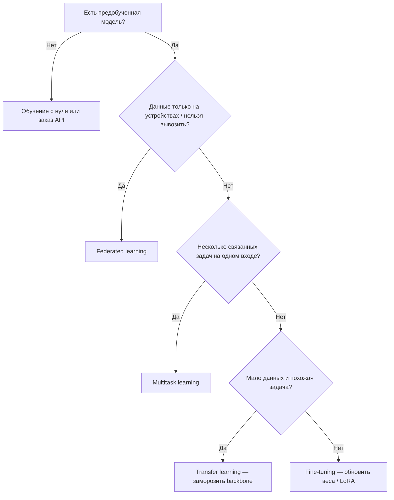

# Обучение на базе готовой модели

  ДЛЯ НОВИЧКОВ

Разработчику

Четыре подхода часто путают, потому что все они опираются на уже обученную сеть или на общую модель для многих клиентов. Разница в том, **какие веса обновляются**, **сколько задач решает одна архитектура** и **где лежат данные**.

Краткая шпаргалка — в таблице ниже; далее каждый подход разобран подробнее. Для LLM (промпт, RAG, LoRA) см. [Работа с ИИ-моделями](/encyclopedia/6-ai/6-05-razrabotka-ii/113). Где в общей архитектуре лежит дообучение (слой 3) и данные (слои 1–2) — [Семь слоёв LLM-стека](/encyclopedia/6-ai/6-05-razrabotka-ii/119).

---

## Сравнение подходов

| Подход | Предобученные веса | Новые слои | Поток градиентов | Типичный сценарий |
|--------|-------------------|------------|------------------|-------------------|
| **Transfer learning** (трансферное обучение) | Заморожены | Добавляются и обучаются | Только в «голове» классификатора | Мало размеченных данных, нужна экономия GPU |
| **Fine-tuning** (тонкая настройка) | Обновляются | Могут добавляться | По всей сети (или через LoRA/адаптеры) | Большой целевой датасет, нужна высокая точность в домене |
| **Multitask learning** (мультизадачное обучение) | Общая «стволовая» часть | Отдельные ветки на задачу | Из всех задач в общие слои | Несколько связанных задач (NLP, CV, рекомендации) |
| **Federated learning** (федеративное обучение) | Глобальная модель на сервере | Локальная донастройка на устройстве | Локально на устройстве; на сервер уходят только обновления | Приватные данные на телефонах, в больницах, на заводах |

---

## Transfer learning — трансферное обучение

Берётся модель, уже обученная на большом корпусе (ImageNet, общий текст, код), и к ней **добавляют** небольшой блок для новой задачи — классификатор, регрессионную «голову», проекцию в эмбеддинги.

**Ранние слои** предобученной сети обычно **замораживают**: градиенты через них не проходят. Они уже умеют извлекать универсальные признаки (края, текстуры, синтаксис). **Обучают только новые нейроны** в конце стека.

**Когда уместно:**

- мало размеченных примеров (сотни, а не миллионы);
- новая задача близка к исходной (классификация собак после ImageNet);
- ограничены время и видеопамять.

**Пример:** ResNet-50 с ImageNet + замороженный backbone + обучаемый полносвязный слой на 10 классов дефектов на конвейере.

---

## Fine-tuning — тонкая настройка

Архитектура та же идея «старт с предобученной модели», но **градиенты идут по всей сети** (или по большой её части). Веса базовой модели **сдвигаются** под целевой домен, терминологию, формат ответа.

От transfer learning fine-tuning отличают именно **обновление предобученных весов**, а не только головы. На практике часто комбинируют этапы: сначала обучают только голову, затем размораживают последние блоки, затем весь стек с малым learning rate.

**Когда уместно:**

- достаточно целевых данных и разметки;
- домен сильно отличается от предобучения (медицинские снимки, внутренние регламенты, узкий жаргон);
- нужны стиль, формат или поведение, которых нет в базовой модели.

**Варианты для больших LLM** (меньше памяти, тот же смысл «донастройки»):

- **Full fine-tuning** — все параметры;
- **LoRA / QLoRA, adapters** — обучается малая надстройка, базовые веса почти не трогают или трогают слабо.

Подробнее про inference, RAG и LoRA — в [Работа с ИИ-моделями](/encyclopedia/6-ai/6-05-razrabotka-ii/113).

---

## Multitask learning — мультизадачное обучение

Одна **общая сеть** (encoder, ранние свёртки, нижние слои трансформера) обслуживает **несколько задач** параллельно. У каждой задачи — своя «голова» (ветка): тональность, NER, категория тикета, оценка риска.

Градиенты от всех задач **суммируются** в общих слоях. Модель учится представлению, полезному сразу для нескольких целей. Связанные задачи помогают друг другу (общая лексика, визуальный контекст); несвязанные могут мешать — тогда лучше отдельные модели.

**Когда уместно:**

- задачи из одного продукта (один текст → и тег, и приоритет, и язык);
- общий вход (одно изображение → детекция + сегментация + атрибуты);
- хочется один деплой вместо пяти отдельных моделей.

**Пример:** BERT-общий trunk + три классификатора на выходе для CRM: тема, срочность, намерение клиента.

---

## Federated learning — федеративное обучение

Данные **остаются на устройствах** пользователей или на площадках организаций. Центральный сервер хранит **глобальную модель** и рассылает её копии клиентам. Каждый клиент обучает модель на **локальных** данных, затем отправляет на сервер **только обновления** (градиенты, дельты весов, зашифрованные агрегаты) — **не сырые записи**.

Сервер **агрегирует** обновления (часто FedAvg — усреднение весов с учётом размера локальных выборок) и выпускает улучшенную глобальную модель. Цикл повторяется.

**Когда уместно:**

- закон или политика запрещают вывоз персональных данных (здоровье, банк, переписка);
- данные естественно распределены (клавиатура на телефоне, датчики на заводах);
- нужна персонализация без централизации всего датасета.

**Ограничения:** нестабильная связь, разнородные устройства, атаки на агрегацию (подмена обновлений), сложнее отладка, чем в классическом data center.

Примеры в индустрии: подсказки клавиатуры (Gboard), голосовые модели на устройстве, пилоты в здравоохранении. См. также [анализ больших данных — распределённое обучение](/encyclopedia/3-data-markup/3-11-analiz-dannyh/11).

---

## Как выбрать подход

  
Практическое правило

  Сначала попробуйте inference + промпт или RAG. Transfer learning — при малой разметке в CV/классике ML. Full fine-tuning или LoRA — когда нужен устойчивый стиль или домен без постоянной подгрузки документов. Federated — когда данные юридически или физически не могут собраться в одном озере.

---

## Связанные материалы

- [Машинное обучение](/encyclopedia/6-ai/6-02-mashinnoe-obuchenie/1) — supervised / unsupervised / reinforcement
- [Разработка ИИ](/encyclopedia/6-ai/6-05-razrabotka-ii/1) — цикл дообучения LLM, PEFT, RAG
- [Компьютерное зрение](/encyclopedia/6-ai/6-03-neyroseti/112) — transfer learning на ResNet и детекторах
- Глоссарий: [Federated Learning](/glossary/f#federated-learning), [Transfer Learning](/glossary/t#transfer-learning), [Multitask Learning](/glossary/m#multitask-learning)

---
