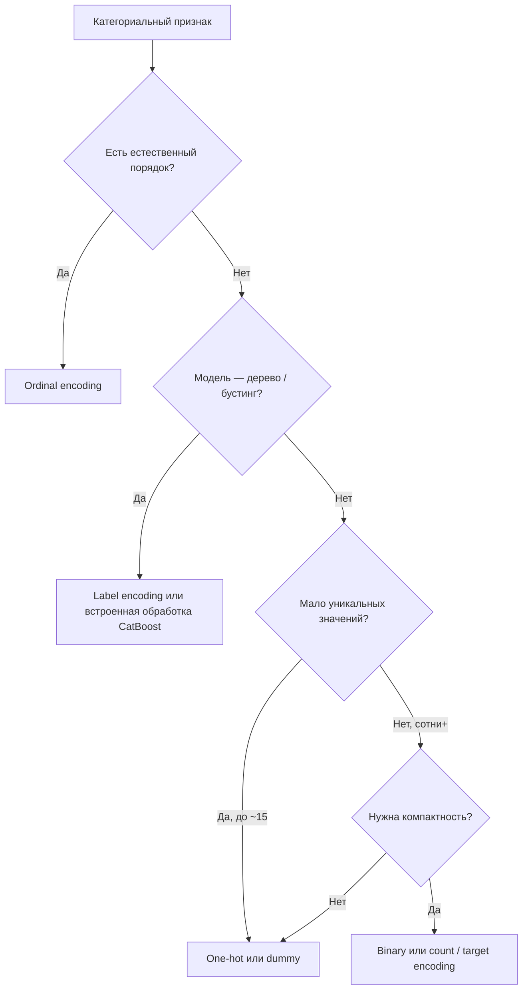

# Кодирование категориальных признаков

<div class="article-tags">
  <span class="tag tag-beginner">ДЛЯ НОВИЧКОВ</span>
</div>

<span class="complexity-badge">Разработчику</span>
<span class="complexity-badge">Аналитику</span>

Категориальные столбцы — цвет, размер, тип продукта, город — хранят **метки**, а не числа. Большинство алгоритмов машинного обучения (линейные модели, SVM, нейросети, градиентный бустинг на «сырых» категориях) ожидают **числовой ввод**. Задача предобработки — перевести категории в признаки, которые модель может сравнивать и взвешивать.

Ниже — семь распространённых техник. Они дополняют, а не заменяют друг друга: выбор зависит от **типа категории** (номинальная или порядковая), **числа уникальных значений** (кардинальности) и **требований модели** (линейность, деревья, нейросети).

Контекст типов данных в аналитике — в [Data Science](/encyclopedia/3-data-markup/3-11-analiz-dannyh/12#типы-данных-в-data-science). Пайплайн предобработки в общей статье — [Машинное обучение](/encyclopedia/6-ai/6-02-mashinnoe-obuchenie/1#подготовка-данных).

---

## Сводная таблица

| Техника | Результат | Когда уместна |
| :--- | :--- | :--- |
| **One-hot** | По столбцу на каждую категорию (0/1) | Номинальные признаки, мало категорий, линейные модели |
| **Dummy** | One-hot без одного столбца | Регрессия с константой, избежание мультиколлинеарности |
| **Effect** | Dummy, но «базовая» категория = −1 | То же, что dummy; удобнее в некоторых статистических пакетах |
| **Label** | Одно целое на категорию | Деревья и бустинг; **осторожно** с линейными моделями |
| **Ordinal** | Целые с сохранением порядка | Размер, рейтинг, класс обслуживания |
| **Count** | Частота категории в обучающей выборке | Высокая кардинальность, эвристика «популярности» |
| **Binary** | Биты целочисленного кода | Много категорий, нужно меньше столбцов, чем при one-hot |

---

## One-hot encoding

Исходный столбец `Color` с категориями Green, Red, Black, Orange превращается в **четыре бинарных признака**. В строке ровно один столбец равен `1`, остальные — `0`.

| Color | Green | Red | Black | Orange |
| :--- | :---: | :---: | :---: | :---: |
| Green | 1 | 0 | 0 | 0 |
| Red | 0 | 1 | 0 | 0 |
| Black | 0 | 0 | 1 | 0 |
| Orange | 0 | 0 | 0 | 1 |

Категории **не упорядочены** — столбцы равноправны. Подходит для логистической регрессии, нейросетей, k-NN. Минус при тысячах уникальных значений (например, `user_id`) — взрыв размерности матрицы признаков.

В scikit-learn — `OneHotEncoder` (часто внутри `ColumnTransformer`, см. [пример в статье про ML](/encyclopedia/6-ai/6-02-mashinnoe-obuchenie/1#подготовка-данных)).

---

## Dummy encoding

Вариант one-hot: **один столбец удаляют** (часто случайно или по алфавиту — здесь убрали Orange). Строка из одних нулей в оставшихся столбцах означает **удалённую** категорию.

| Color | Green | Red | Black |
| :--- | :---: | :---: | :---: |
| Green | 1 | 0 | 0 |
| Red | 0 | 1 | 0 |
| Black | 0 | 0 | 1 |
| Orange | 0 | 0 | 0 |

Так убирают **линейную зависимость** между столбцами (мультиколлинеарность), если в модели уже есть свободный член (intercept). В `pandas` — `pd.get_dummies(..., drop_first=True)`.

---

## Effect encoding

Тот же каркас, что у dummy, но строка «базовой» (удалённой) категории кодируется не нулями, а **−1 во всех столбцах**.

| Color | Green | Red | Black |
| :--- | :---: | :---: | :---: |
| Green | 1 | 0 | 0 |
| Red | 0 | 1 | 0 |
| Black | 0 | 0 | 1 |
| Orange | −1 | −1 | −1 |

Используется в статистике и некоторых R-пакетах (contrasts). Смысл тот же, что у dummy: одна категория — опорная, остальные сравниваются с ней.

---

## Label encoding

Каждой уникальной категории присваивают **целое число** (обычно 0, 1, 2, … по порядку появления или по алфавиту).

| Color | Color_label |
| :--- | :---: |
| Green | 1 |
| Red | 2 |
| Black | 3 |
| Green | 1 |

Один столбец вместо нескольких — компактно. Для **номинальных** признаков числа 1 &lt; 2 &lt; 3 **не отражают** реальных отношений, но модель может ошибочно трактовать их как порядок. Деревья решений и градиентный бустинг (XGBoost, LightGBM, CatBoost) часто работают с label encoding напрямую; для линейной регрессии и MLP над номинальными полями лучше one-hot.

`sklearn.preprocessing.LabelEncoder` — для **целевой** переменной и одномерных столбцов; для таблицы удобнее `astype('category').cat.codes` в pandas.

---

## Ordinal encoding

Как label encoding, но числа **отражают порядок** категорий (XS &lt; S &lt; M &lt; L).

| Size | Size_ord |
| :--- | :---: |
| XS | 1 |
| S | 2 |
| M | 3 |
| L | 4 |

Используют для шкал «мало / средне / много», звёзд рейтинга, классов образования. Порядок меток задаёт человек; кодировщик не угадывает его из данных. `OrdinalEncoder` в sklearn принимает явный список `categories=[['XS','S','M','L']]`.

---

## Count encoding

Категорию заменяют **числом появлений** этой категории в обучающей выборке (на тесте — частоты с обучения, иначе утечка).

| Color | Color_count |
| :--- | :---: |
| Green | 2 |
| Red | 1 |
| Black | 1 |
| Green | 2 |

Простая эвристика для признаков с **большим числом** уникальных значений (ID магазина, хеш тега). Риск — редкие категории получают 1, частые — большие числа; связь с целевой переменной слабая. Близкий и более сильный приём — **target encoding** (среднее целевой по категории); его нужно считать только на train и с регуляризацией, чтобы избежать переобучения.

---

## Binary encoding

Сначала категории нумеруют (0, 1, 2, …), затем целое записывают в **двоичном виде** и каждый бит выносят в отдельный столбец.

| Color | Код | Color_0 | Color_1 |
| :--- | :---: | :---: | :---: |
| Green | 0 | 0 | 0 |
| Red | 1 | 0 | 1 |
| Black | 2 | 1 | 0 |
| Green | 0 | 0 | 0 |

Для \(k\) категорий нужно примерно \(\lceil \log_2 k \rceil\) столбцов вместо \(k\) при one-hot — экономия памяти при высокой кардинальности. Минус — произвольный порядок меток влияет на биты; для номинальных признаков это менее интерпретируемо, чем one-hot.

---

## Как выбрать метод



<div class="callout callout--warning">
  <div class="callout-title">Утечка данных</div>

  Count encoding, target encoding и любые статистики по категориям считают **только на обучающей выборке**, затем применяют к validation и test. Иначе информация о целевой переменной «просачивается» в признаки и метрики завышаются.
</div>

<div class="callout callout--tip">
  <div class="callout-title">Практика в sklearn</div>

  Объединяйте числовые и категориальные преобразования в `ColumnTransformer` + `Pipeline`, чтобы на inference применялась та же схема кодирования, что и при `fit`. Неизвестные категории на проде — параметр `handle_unknown='ignore'` у `OneHotEncoder`.
</div>

---

## Пример — несколько кодировщиков

```python
import pandas as pd
from sklearn.preprocessing import OneHotEncoder, OrdinalEncoder, LabelEncoder

df = pd.DataFrame({
    "color": ["Green", "Red", "Black", "Green"],
    "size": ["XS", "S", "L", "M"],
})

# One-hot (dummy — drop_first=True)
color_ohe = pd.get_dummies(df["color"], prefix="color")
# drop_first=True даёт dummy encoding

# Ordinal — порядок задаём явно
size_ord = OrdinalEncoder(categories=[["XS", "S", "M", "L"]])
df["size_ord"] = size_ord.fit_transform(df[["size"]])

# Label — одна колонка целых
le = LabelEncoder()
df["color_label"] = le.fit_transform(df["color"])

# Count — только по train; здесь иллюстрация на всём df
counts = df["color"].value_counts()
df["color_count"] = df["color"].map(counts)
```

Для production-пайплайна предпочтительнее зафиксировать `ColumnTransformer` в [конвейере из статьи про ML](/encyclopedia/6-ai/6-02-mashinnoe-obuchenie/1#подготовка-данных), а не вызывать `get_dummies` отдельно на каждом датасете.

---

## Связанные материалы

- [Машинное обучение](/encyclopedia/6-ai/6-02-mashinnoe-obuchenie/1) — предобработка, нормализация, `ColumnTransformer`
- [Data Science](/encyclopedia/3-data-markup/3-11-analiz-dannyh/12) — номинальные и порядковые типы данных
- [Анализ данных](/encyclopedia/3-data-markup/3-11-analiz-dannyh/2) — этап подготовки данных в CRISP-DM
- [Табличные данные](/encyclopedia/3-data-markup/3-11-analiz-dannyh/426) — операции с категориями в Pandas

---
