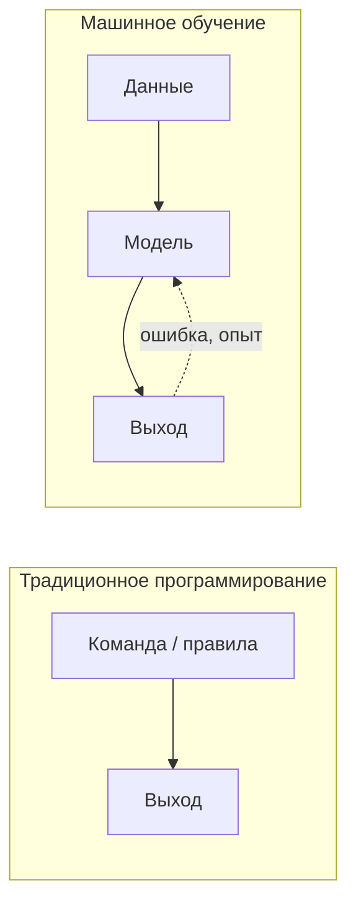

# Категории обучения и стек инструментов

  ДЛЯ НОВИЧКОВ

Всем

Перед выбором конкретного алгоритма важно понять **категорию** задачи: есть ли у данных метки, нужен ли агент с наградами, можно ли смешать размеченное и неразмеченное. Параллельно полезно представить **инструментарий** — из чего состоит рабочий стол ML-инженера на старте и что добавляется на продвинутом уровне. Статья дополняет обзор [Машинное обучение](/encyclopedia/6-ai/6-02-mashinnoe-obuchenie/1).

---

## Откуда взялось «машинное обучение»

В 1959 году Артур Самуэль (IBM) описал программу для шашек, которая **улучшала игру** по мере накопления партий — без переписывания правил вручную после каждой ошибки. Его формулировка: область, где компьютер **учится**, а не получает готовый ответ на каждый случай.

Ключевая идея — **самообучение**: модель находит закономерности в данных и уточняет прогнозы по мере контакта с новыми примерами. Программист задаёт алгоритм, данные и гиперпараметры; **содержание решения** определяют данные, а не жёстко прописанные `if`.

---

## Анатомия цикла ML

Типичный путь от сырых данных до прогноза:

1. **Сбор данных** — таблица, текст, изображения, логи.
2. **Очистка и признаки** — пропуски, кодирование категорий, отбор столбцов ([Кодирование категориальных признаков](/encyclopedia/6-ai/6-02-mashinnoe-obuchenie/4)).
3. **Разбиение** — train / validation / test ([сквозной проект](/encyclopedia/6-ai/6-02-mashinnoe-obuchenie/7)).
4. **Выбор алгоритма** и настройка гиперпараметров.
5. **Оценка** на данных, которых модель не видела при обучении.
6. **Деплой** — API, batch-скoring, мониторинг дрейфа.

  
ML и добыча данных

  

  **Добыча данных** (data mining) часто ищет скрытые связи в больших массивах **без заранее заданной цели**. **Машинное обучение** чаще строит **повторяемую модель**: на train учится, на test проверяется, на новых входах выдаёт прогноз. Области пересекаются (деревья, кластеризация, PCA), но акцент разный.
  

---

## Четыре категории обучения

| Категория | Метки (y) | Суть | Примеры алгоритмов |
|-----------|-----------|------|---------------------|
| **С учителем** (supervised) | Есть | Учимся на парах X → y, прогнозируем y для новых X | Линейная и логистическая регрессия, k-NN, деревья, SVM, бустинг |
| **Без учителя** (unsupervised) | Нет | Ищем структуру во входах | k-means, PCA, DBSCAN |
| **Полуконтролируемое** (semi-supervised) | Частично | Размеченных мало, неразмеченных много | Псевдометки, self-training, graph-based методы |
| **С подкреплением** (RL) | Награда, не метка | Агент пробует действия в среде | Q-learning, policy gradient, PPO |

В русскоязычных учебниках встречаются синонимы **контролируемое / неконтролируемое** — это те же supervised и unsupervised.

---

## Обучение с учителем

Модель видит **независимые переменные X** (признаки) и **зависимую y** (целевую). На train выявляет связь; на новых X предсказывает y.

**Регрессия** — y числовая (цена дома, спрос). **Классификация** — y категория (спам / не спам, вид ириса).

Классическая аналогия: инженеры Toyota разобрали готовый Chevrolet на детали (X), изучили собранный автомобиль (y) и восстановили принципы конструкции — так же модель «разбирает» размеченные примеры.

Без меток y **обучить** supervised-модель нельзя; можно только **применить** уже обученную.

---

## Обучение без учителя

Меток нет — алгоритм группирует, сжимает или ищет аномалии. Пример: сегменты клиентов по поведению без заранее заданных ярлыков «малый / крупный бизнес».

Минус: **нет эталонного y** для простой проверки «угадали или нет» — качество оценивают метриками кластеризации (silhouette) или экспертным разбором групп.

Подробнее — в [Машинное обучение](/encyclopedia/6-ai/6-02-mashinnoe-obuchenie/1#обучение-без-учителя) и справочнике [Алгоритмы ИИ](/encyclopedia/6-ai/6-02-mashinnoe-obuchenie/2).

---

## Полуконтролируемое обучение

Гибрид: в выборке есть **и размеченные, и неразмеченные** строки. Мотивация — разметка дорогая (медицинские снимки, юридические тексты), а сырых данных много.

Типичные приёмы:

- обучить модель на размеченной части, **псевдоразметить** уверенные предсказания на неразмеченной и дообучить;
- итеративно добавлять в train только те неразмеченные объекты, где модель превышает порог уверенности.

Гарантии «лучше, чем только на малой разметке» нет — нужна валидация. В [1.md](/encyclopedia/6-ai/6-02-mashinnoe-obuchenie/1) эта категория раньше почти не выделялась; для production чаще смотрят на active learning и weak supervision.

---

## Обучение с подкреплением и Q-обучение

Агент выбирает **действия** в **среде** и получает **награды** (или штрафы). Цель — максимизировать суммарную награду, а не минимизировать ошибку относительно готовых меток.

**Q-обучение** — базовый алгоритм для дискретных сред (игры, простые роботы):

- **S** (state) — состояние, например позиция в лабиринте Pac-Man;
- **A** (action) — допустимое действие (вверх, вниз, …);
- **Q(s, a)** — «ценность» пары состояние–действие; изначально часто нули;
- после каждого шага Q обновляется по награде: хорошие действия укрепляются, плохие ослабляются.

Полная реализация требует много симуляций и вычислений. Углублённо — в [Алгоритмы ИИ — RL](/encyclopedia/6-ai/6-02-mashinnoe-obuchenie/2); для LLM-агентов — [Типы интеллектуальных агентов](/encyclopedia/6-ai/6-04-modeli-i-instrumenty/120).

---

## Стек инструментов — три «отделения»

Удобно представить стек как ящик с тремя отделениями. Для новичка достаточно базового набора; продвинутый уровень расширяет каждое отделение.

### Отделение 1 — данные

| Тип | Примеры | С чего начать |
|-----|---------|---------------|
| Структурированные | CSV, SQL-таблицы, Excel | Kaggle, [Melbourne Housing](/encyclopedia/6-ai/6-02-mashinnoe-obuchenie/7) |
| Неструктурированные | изображения, текст, аудио | После табличного ML — [Нейросети](/encyclopedia/6-ai/6-03-neyroseti/intro) |

Таблица: **строки** — наблюдения, **столбцы** — признаки (features). В supervised последний столбец часто — **y**. Несколько столбцов вместе образуют **матрицу признаков X**.

### Отделение 2 — инфраструктура

| Компонент | Новичок | Продвинутый уровень |
|-----------|---------|---------------------|
| Среда | Jupyter Notebook, VS Code | CI для ML, MLflow, облако |
| Язык | **Python** (pandas, scikit-learn) | C++/CUDA, распределённый Spark |
| Железо | CPU, CSV на диске | GPU, TPU, потоковые пайплайны |
| Визуализация | Matplotlib, Seaborn | Tableau, интерактивные дашборды |

Python доминирует из‑за экосистемы; R и MATLAB встречаются в академических курсах. Для глубокого обучения на GPU — TensorFlow, PyTorch ([обзор в 1.md](/encyclopedia/6-ai/6-02-mashinnoe-obuchenie/1#библиотеки-для-машинного-обучения)).

### Отделение 3 — алгоритмы

**Неглубокое (shallow) ML** — scikit-learn: регрессия, деревья, SVM, k-means. Признаки подаются в модель напрямую (после кодирования).

**Глубокое обучение** — нейросети с несколькими слоями; признаки извлекаются автоматически. TensorFlow / PyTorch / Keras — отдельный слой библиотек поверх инфраструктуры с GPU.

---

## Маршрут после этой статьи

  
Практика

  

  1. [NumPy — массивы и матрицы](/lab/Примеры/1129) — массивы, `mean`, матрицы перед таблицами.
  2. [Как начать с ML на Python](/encyclopedia/6-ai/6-02-mashinnoe-obuchenie/21) — синтаксис и Kaggle Learn.
  3. [Pandas — типовые операции](/lab/Примеры/1113) — CSV, groupby, очистка перед моделью.
  3. [Кодирование категориальных признаков](/encyclopedia/6-ai/6-02-mashinnoe-obuchenie/4) — перед табличным проектом.
  4. [Сквозной проект — Мельбурн](/encyclopedia/6-ai/6-02-mashinnoe-obuchenie/7) — полный pipeline на pandas + sklearn.
  4. [Машинное обучение](/encyclopedia/6-ai/6-02-mashinnoe-obuchenie/1) — расширенный обзор метрик и DL.
  

---

## Связанные материалы

- [Введение в ИИ](/encyclopedia/6-ai/6-01-vvedenie-v-ii/1) — место ML в ландшафте ИИ
- [Data Science — типы данных](/encyclopedia/3-data-markup/3-11-analiz-dannyh/12)
- [Обучение на базе готовой модели](/encyclopedia/6-ai/6-02-mashinnoe-obuchenie/3) — transfer learning после базового ML

---
